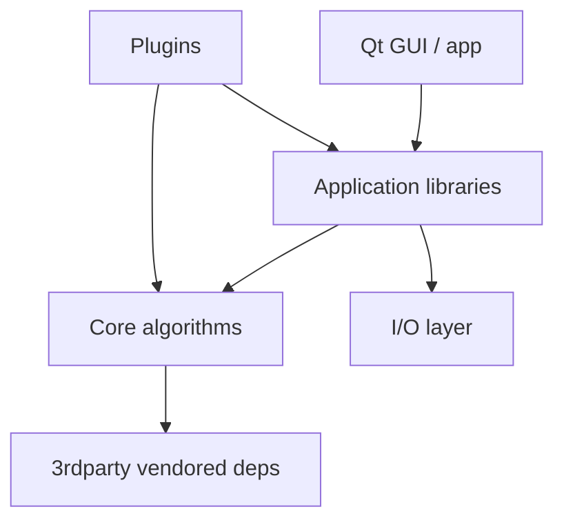
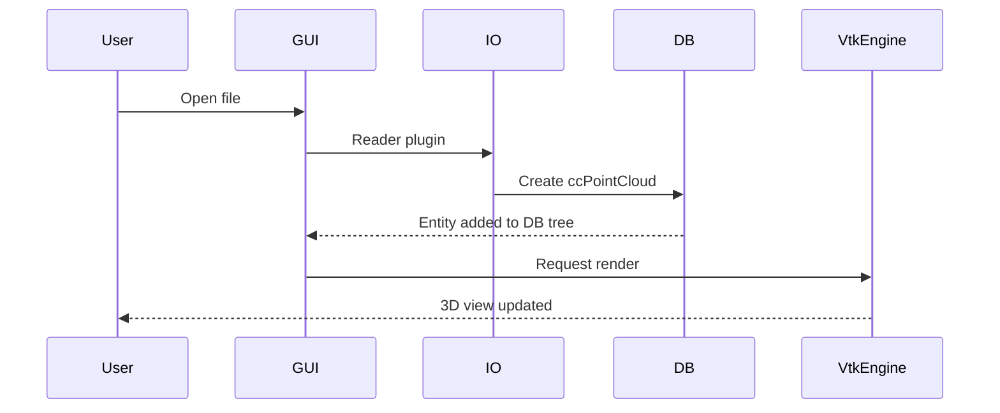
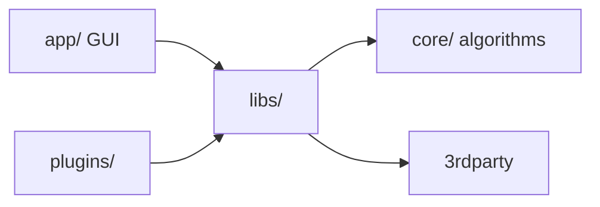
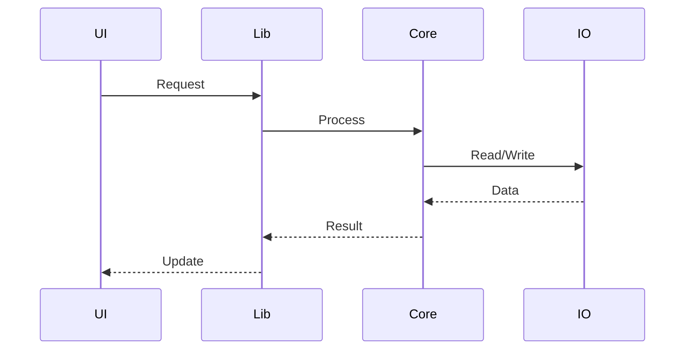
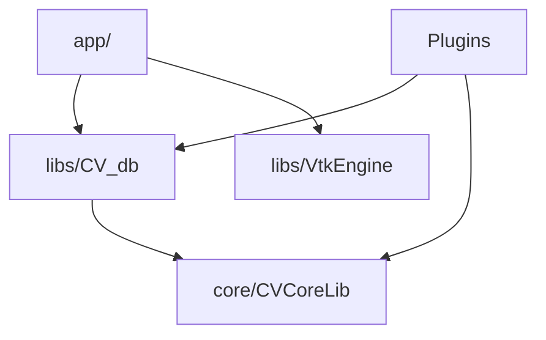

# Codebase Summarizer

Generate comprehensive architecture documentation from repository analysis.

## Core Workflow

1. **Scan structure**: Recursively analyze folder tree and file organization
2. **Identify patterns**: Detect framework, architecture style, key directories
3. **Map entry points**: Find main files, libraries, CLI commands
4. **Trace data flow**: Follow processing pipelines through layers (UI → core algorithms → I/O)
5. **Document modules**: Explain purpose and responsibilities of each directory
6. **Create navigation**: Build "how to" guides for common tasks
7. **Generate diagrams**: Add Mermaid diagrams for visual architecture

## Documentation Structure

### ARCHITECTURE.md Template

````markdown
# Architecture Overview

## System Summary

[Project Name] is a [type] application built with [stack]. It follows [architecture pattern] and handles [primary use cases].

**Tech Stack:**

- Language: C++17
- GUI: Qt 5/6
- Rendering: VTK (optional backend)
- Core algorithms: Eigen, PCL-style point cloud structures
- Build: CMake 3.19+
- AI inference (optional): ggml (GGUF models)
- Python bindings (optional): pybind11

## High-Level Architecture



````

## Project Structure

```
core/                # Core algorithms (octree, scalar fields, basic processing)
libs/                # Application libraries (CV_db, CV_io, VtkEngine, cloudViewer, Python)
app/                 # Desktop GUI: MainWindow, DB tree, reconstruction UI
plugins/             # Qt plugins (core/Standard, core/IO)
examples/            # Sample C++ programs
docs/                # Sphinx guides, compiling docs, plugin user guides
3rdparty/            # Vendored and fetched dependencies
cmake/               # Version config, dependency helpers
```

## Key Components

### Entry Points

**Desktop Application:** `app/MainWindow.cpp`

- Main window, DB tree, action wiring
- Plugin loading and menu integration

**Command-line interface:** `ecvCommandLineParser` (app/)

- Headless convert/process operations
- Scripted reconstruction runs

### Core Modules

**DB entities (`libs/CV_db/`)**

- `ccHObject` base class for the DB hierarchy
- `ccPointCloud`, `ccMesh`, `ecvImage` entity types
- Scalar fields and color management

**Core algorithms (`core/CVCoreLib/`)**

- Octree construction and queries
- Point cloud processing primitives
- Geodesic / distance algorithms

**I/O layer (`libs/CV_io/`)**

- File readers/writers shared with core
- Format registry and plugins

**AI inference (`core/AICore/`, optional)**

- Unified C API for depth / gaussian inference
- ggml backend with GGUF models

## Data Flow

### Point Cloud Load Flow



### Processing Pipeline

1. **Load** → reader plugin produces `ccPointCloud`
2. **Process** → algorithm operates on cloud / octree
3. **Validate** → run focused tests or compare with reference
4. **Export** → writer plugin persists result

## Common Patterns

### Plugin Pattern

```cpp
// plugins/core/Standard/<Name>/q<Name>.cpp
class qMyPlugin : public ccStdPluginInterface {
public:
    QList<QAction*> getActions() override {
        // register actions, shown in plugin menu
    }
};
```

### Entity Pattern

```cpp
// New DB entity derives from ccHObject
class ccMyEntity : public ccHObject {
public:
    // register with the DB tree, implement serialization
};
```

## How To Guides

### Add a New Standard Plugin

1. **Create folder:** `plugins/core/Standard/<Name>/` with `CMakeLists.txt`, `info.json`, `.qrc`
2. **Implement interface:** subclass `ccStdPluginInterface` in `q<Name>.cpp`
3. **Register build:** use `AddPlugin(NAME ...)` in `plugins/cmake/Plugins.cmake`
4. **Enable option:** `-DPLUGIN_STANDARD_Q<NAME>=ON` in CMake configure
5. **Add tests:** focus on the algorithm core, not UI dialogs

### Add a New Algorithm

1. **Locate owner:** `core/CVCoreLib/` for shared algorithms, plugin `src/` for plugin-specific ones
2. **Implement:** match surrounding naming (`cc` + PascalCase for entities)
3. **Add tests:** `BUILD_UNIT_TESTS=ON`, run via `ctest`
4. **Document:** update the plugin README and `plugins/README.md` catalog

### Add or Update Tests

1. **C++ unit tests:** gtest under the module's `tests/` directory, registered with `add_test`
2. **Python tests:** pytest under `python/test/`
3. **Run:** `cd build_app && ctest --output-on-failure`
4. **AICore tests:** `cmake -DAICore_ENABLED=ON -DAICore_BUILD_TESTS=ON ..` then `cmake --build build_app --target test_capi`

### Modify the GUI / DB Tree

1. **UI dialogs:** `app/` for shared dialogs, `libs/CVAppCommon/` for reusable widgets
2. **DB property panel:** `app/db_tree/` (opacity, light intensity, recursive group apply)
3. **Multi-view rendering:** `libs/VtkEngine/` with per-view `ecvViewContext`

## Key Files Reference

| File | Purpose | Modify For |
| ---------------------- | ---------------------- | --------------------- |
| `CMakeLists.txt` | Root build; feature toggles | Enabling/disabling options |
| `app/MainWindow.cpp` | Main window and action wiring | Global UI behavior |
| `libs/CV_db/include/ecvPointCloud.h` | Point cloud entity | Cloud data model |
| `core/CVCoreLib/` | Core algorithms | Shared algorithm changes |
| `plugins/cmake/Plugins.cmake` | Plugin registration (`AddPlugin`) | Adding/removing plugins |
| `BUILD.md` | CMake option table and recipes | Build documentation |

## Dependencies

### Critical Dependencies

- `Qt 5.12+ / 6.2+` - GUI, plugins, concurrency
- `Eigen3` - Linear algebra (core, reconstruction, AICore)
- `VTK` - Rendering (`libs/VtkEngine/`)
- `CMake 3.19+` - Build system

### Optional / Modular

- `OpenCV` - Image processing (qManualCalib, reconstruction paths)
- `ggml` - ML inference backend in AICore
- `CUDA / Vulkan / Metal` - GPU acceleration per platform
- `COLMAP` - Reconstruction stack (`BUILD_RECONSTRUCTION=ON`)

## Development Workflow

1. **Setup:** Follow the platform guide in `docs/guides/compiling_doc/` (Linux/macOS/Windows)
2. **Configure:** `cmake` with options from `BUILD.md` (e.g. `-DAICore_ENABLED=ON -DPLUGIN_STANDARD_QDA3=ON`)
3. **Build:** `make -j${BUILD_JOBS}` in `build_app/`; cap jobs on low-RAM machines
4. **Test:** `ctest --output-on-failure` for unit tests
5. **PR:** merge into `main` via pull request; CI runs the platform matrix

## Troubleshooting

**Build killed / OOM**

- Reduce `BUILD_JOBS` (e.g. `BUILD_JOBS=4`), disable heavy plugins/options

**Plugin not in menu**

- CMake option OFF or target not built; reconfigure with `-DPLUGIN_STANDARD_Q…=ON` and rebuild

**AICore test skipped (exit 77)**

- Missing GGUF model assets; download from cloudViewer_downloads or skip

**ggml fix works locally but not in CI**

- Changes must go through the patch flow (`3rdparty/ggml/patches/` + `manifest.yaml`), never edit `build*/ggml/` directly

## Additional Resources

- [README.md](../../../README.md) - Project overview and quick start
- [BUILD.md](../../../BUILD.md) - CMake option table and build recipes
- [ARCHITECTURE.md](../../../ARCHITECTURE.md) - Repository architecture map
- [Contributing Guide](../../../CONTRIBUTING.md) - Code standards and conventions
- [Compiling Guide](../../../docs/guides/compiling_doc/compiling-cloudviewer-linux.md) - Platform setup and build

## Analysis Techniques

### Identify Framework

Look for telltale files:
- `CMakeLists.txt` → CMake / C++ project
- `*.pro` or `*.pri` → Qt qmake project
- `meson.build` → Meson build
- `Cargo.toml` → Rust
- `setup.py` / `pyproject.toml` → Python
- `package.json` → Node.js

### Map Entry Points

- Desktop: `main.cpp`, `MainWindow.cpp`, `ecvApplication.cpp`
- Libraries: exported headers in `include/` dirs, C API headers (`*_capi.h`)
- CLI: `ecvCommandLineParser`, `cli-anything-acloudviewer` harness
- Plugins: `q<Name>.cpp` implementing `ccStdPluginInterface`

### Trace Request Flow

Follow typical paths:
1. Entry point / action trigger
2. Boundary / decision (dialog, controller)
3. Core algorithm or service layer
4. Entity / data model
5. I/O or rendering result

### Module Categories

- **Core**: Essential algorithms (`core/`, `libs/CV_db/`)
- **Infrastructure**: I/O, rendering engine, plugin API
- **Utilities**: Helpers, validators, dialogs
- **Features**: User-facing plugin functionality
- **Config**: CMake options, CI workflows

## Mermaid Diagrams

### Architecture Diagram



### Data Flow



### Module Relationships



## Best Practices

1. **Start high-level**: Overview before details
2. **Visual first**: Use diagrams for complex flows
3. **Be specific**: Reference actual file paths
4. **Show examples**: Include code snippets
5. **Link related docs**: Reference other documentation
6. **Keep updated**: Update as architecture evolves
7. **Developer-focused**: Write for onboarding and daily use

## Output Checklist

Every codebase summary should include:

- [ ] System overview and tech stack
- [ ] High-level architecture diagram
- [ ] Project structure explanation
- [ ] Entry points identification
- [ ] Module/directory purposes
- [ ] Data flow diagrams
- [ ] Common patterns documented
- [ ] "How to" guides for common tasks
- [ ] Key files reference table
- [ ] Dependencies explanation
- [ ] Troubleshooting section

---

## Related Skills

**Works well with:** [acloudviewer-aicore-plugin](../acloudviewer-aicore-plugin/SKILL.md), [first-principles](../first-principles/SKILL.md)
