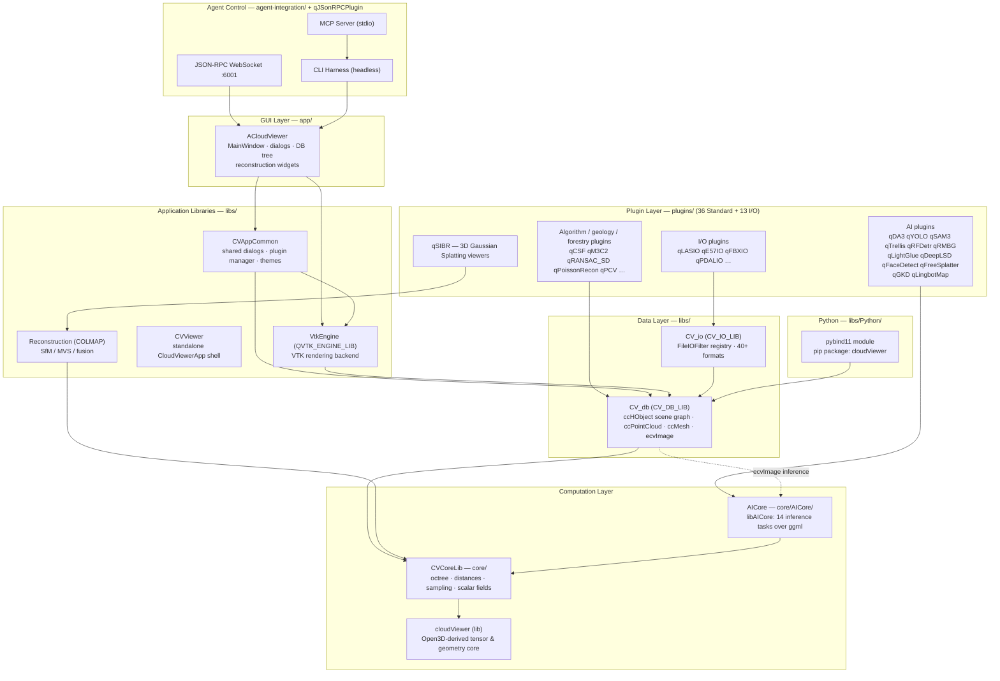
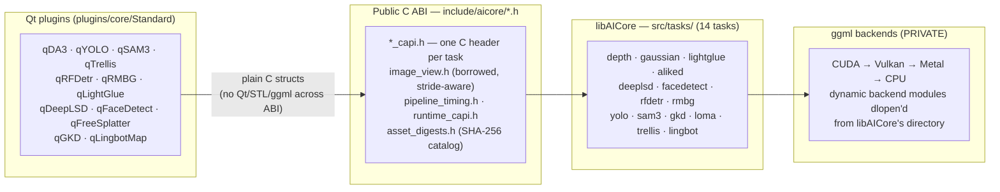
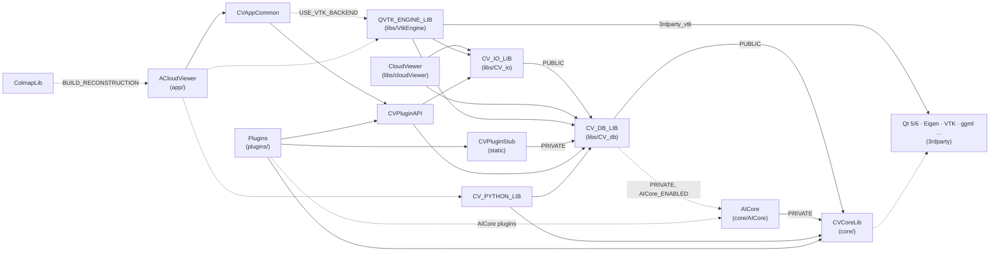
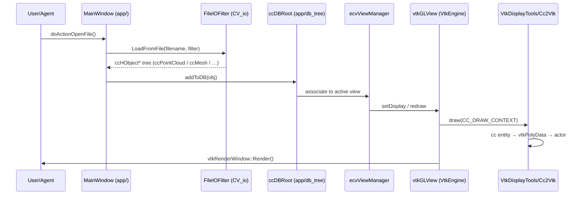

# ACloudViewer Architecture

A modern system for 3D data processing — an open-source C++17 desktop application and
library for point clouds, meshes, photogrammetric reconstruction, and GGUF-based AI
inference, based on CloudCompare, Open3D, ParaView, and COLMAP.

> **Audit stamp:** every module, target, dependency edge, and artifact named below was
> verified against the CMake sources of this tree (version **3.9.5**, see
> `libs/cloudViewer/version.txt`). See [Appendix](#appendix-keeping-this-document-honest)
> for how to re-verify each claim.

## How to Read This Document

| Reader | Path | Time |
|--------|------|------|
| **Newcomer** | [System Map](#1-system-map) → [Build Artifacts](#2-build-artifacts) → [Key Data Flows](#5-key-data-flows) | ~10 min |
| **Maintainer / contributor** | [Module Dependency Graph](#4-module-dependency-graph-cmake-verified) → [Module Reference](#3-module-reference) → [Edit Here For](#7-edit-here-for) | on demand |
| **AI agent / automation** | [System Map](#1-system-map) → [AICore](#32-aicore--unified-ai-inference-libaicore) → [Agent Integration](#312-agent-integration) → [AGENTS.md](AGENTS.md) | ~5 min |

---

## 1. System Map



Everything above the dashed line is optional at configure time; every box maps to one
or two CMake targets (see [Build Artifacts](#2-build-artifacts)).

---

## 2. Build Artifacts

| CMake switch (default) | CMake target | Output artifact | Sources |
|------------------------|--------------|-----------------|---------|
| `BUILD_GUI` (ON) | `ACloudViewer` | `bin/ACloudViewer(.exe)` | `app/` |
| `BUILD_GUI` (ON) | `CloudViewerApp` | standalone lightweight viewer | `libs/CVViewer/apps/` |
| always | `CloudViewer` (library) | `libCloudViewer` | `libs/cloudViewer/` |
| `AICore_ENABLED` (→ auto-enables ggml) | `AICore` | `bin/libAICore.so\|.dll` — **always beside the app, never in `bin/plugins/`** | `core/AICore/` |
| `BUILD_RECONSTRUCTION` (OFF) | `ColmapLib` + `Colmap` | reconstruction library + COLMAP app | `libs/Reconstruction/` |
| `BUILD_PYTHON_MODULE` (ON) | `CV_PYTHON_LIB` + pybind | pip wheel `cloudViewer` | `libs/Python/` |
| `USE_VTK_BACKEND` (ON) | `QVTK_ENGINE_LIB` | VTK rendering backend library | `libs/VtkEngine/` |
| `PLUGIN_STANDARD_*` / `PLUGIN_IO_*` (OFF) | per-plugin targets via `AddPlugin()` | `bin/plugins/*.so\|.dll` | `plugins/core/` |

Build order is fixed by the root `CMakeLists.txt`: **`core/` → `libs/` → `examples/`
→ `plugins/` → `app/`**. Toolchain: CMake ≥ **3.24**, C++17, Qt 5.12+ / 6.2+
(`USE_QT6`), optional CUDA / Vulkan / Metal. Full option tables: [BUILD.md](BUILD.md).

---

## 3. Module Reference

### 3.1 CVCoreLib — Scalar Geometry Core (`core/`)

The foundational library inherited from CloudCompare: octrees (`DgmOctree`), distance
computation, sampling, registration, scalar fields, geometric fitting, fast marching.
Defines `ScalarType` — **double by default** in this fork (`CVCORELIB_SCALAR_DOUBLE=ON`),
propagated as a public compile definition to every consumer.

Optional accelerators: CGAL (Delaunay 2.5D), TBB, QtConcurrent (parallel processing,
ON by default), SIMD/AVX2 (`USE_SIMD` — auto-ON with `BUILD_RECONSTRUCTION`).

### 3.2 AICore — Unified AI Inference (`libAICore`, `core/AICore/`)

One **monolithic shared library** for all AI tasks; plugins never link ggml directly.



Key contracts (enforced by `core/AICore/CMakeLists.txt` + `.agents/skills/acloudviewer-aicore-plugin/SKILL.md`):

- Public headers expose **plain C** only — no Qt, STL, OpenCV, exceptions, or ggml types
  cross the ABI; Linux exports are locked by a version script (`cmake/aicore.exports.map`).
- ggml and meshoptimizer are **PRIVATE** link deps; consumers get ggml runtime `.so`
  paths via `INTERFACE`, backend modules are copied next to `libAICore` and `dlopen`'d.
- Requires `CVCoreLib` (hard `FATAL_ERROR` otherwise) and links it PRIVATE.
- Result integrity: every downloadable model has a pinned SHA-256 in
  `asset_digests.h`; the one-click validation gate is
  `cmake --build build_app --target aicore-validate-all`
  (see `core/AICore/scripts/validate_all.py`).
- Tests: `AICore_BUILD_TESTS` (+ `AICore_BUILD_WHITEBOX_TESTS`) build per-task test
  executables under `bin/aicore_tests/`.

Architecture detail: `core/AICore/README.md`, `core/AICore/docs/ARCHITECTURE.md`.

### 3.3 CV_db — Spatial Object Database (`libs/CV_db/`, target `CV_DB_LIB`)

The scene graph and entity model — everything the user sees in the DB tree.

```
ccSerializableObject → ccObject → ccHObject (+ ccDrawableObject)
  ├── ccShiftedObject
  │     ├── ccGenericPointCloud → ccPointCloud
  │     ├── ccGenericMesh → ccMesh, ccSubMesh
  │     └── ccPolyline
  ├── ccSensor → ccCameraSensor, ccGBLSensor
  ├── cc2DLabel · ccFacet · ccImage (ecvImage) · ccClipBox
  └── ecvOrientedBBox / ccBBox
```

Notable wiring: when `AICore_ENABLED`, `ecvImage` may call AICore internally — the
dependency is **PRIVATE** and leaks no AICore types through CV_db headers
(`libs/CV_db/CMakeLists.txt`). Display abstraction: `ecvGenericGLDisplay`
(per-window interface, implemented by `vtkGLView`); `ecvViewManager` is the hub that
tracks all views.

### 3.4 CV_io — File I/O (`libs/CV_io/`, target `CV_IO_LIB`)

Format drivers behind the `FileIOFilter` registry (`FileIOFilter::LoadFromFile()` →
filter list → per-format `loadFile()` → `ccHObject*` tree). Built-in: PLY, LAS/PCD,
DXF (dxflib), SHP (shapelib), optional GDAL. Plugin-provided formats (E57, FBX,
LASzip, PDAL, Draco, …) register themselves at plugin load time.

### 3.5 cloudViewer — Geometry & Tensor Library (`libs/cloudViewer/`, target `CloudViewer`)

Open3D-derived library assembled from object libraries
(`core, data, t/geometry, t/io, t/pipelines, io, ml, pipelines, utility, visualization`).

- `core/` — Tensor, device (CPU/CUDA) memory management, dtype dispatch, NNS.
- `t/geometry/` — device-aware GPU-ready PointCloud / TriangleMesh / LineSet / Image.
- `geometry/` — **shim layer**: `cloudViewer::geometry::PointCloud` *is* `ccPointCloud`
  (`using PointCloud = ::ccPointCloud;` in `geometry/PointCloud.h`) — one object model,
  two APIs.
- `pipelines/` (Eigen) and `t/pipelines/` (tensor: ICP, RGB-D odometry, SLAM).
- `ml/` — optional PyTorch/TensorFlow ops (`BUILD_PYTORCH_OPS` / `BUILD_TENSORFLOW_OPS`).
- Links `CV_DB_LIB` + `CV_IO_LIB` — the two data layers are its substrate.

### 3.6 VtkEngine — Rendering Backend (`libs/VtkEngine/`, target `QVTK_ENGINE_LIB`)

VTK 9-based rendering backend (default, `USE_VTK_BACKEND=ON`). ≈356 sources organized as:

| Subsystem | Location | Verified classes |
|-----------|----------|------------------|
| Visualization | `Visualization/` | `vtkGLView` (window), `VtkDisplayTools`, `VtkVis`, `VtkCameraLink` (pairwise camera sync), `vtkCustomInteractorStyle` |
| Converters | `Converters/` | `Cc2Vtk` (CC entity → vtkPolyData), `Vtk2Cc` |
| Views / charts | `VTKExtensions/Views/` | `vtkChartView` (line/bar/histogram/scatter/…) |
| Widgets | `VTKExtensions/Widgets/` | `QVTKWidgetCustom`, `ScaleBarWidget` |
| Tools | `Tools/{AnnotationTools,CameraTools,ColorTools,FilterTools,…}` | interactive VTK editing tools |

Design: entities draw themselves through the CC abstraction
(`ccHObject::draw(CC_DRAW_CONTEXT&)` → `drawMeOnly()` → `context.display->draw()`),
and `VtkDisplayTools`/`Cc2Vtk` translate that into VTK actors — the CC scene graph
never knows about VTK.

### 3.7 CVViewer / CVAppCommon — App Shells & Shared UI

- `libs/CVViewer/` — standalone **CloudViewerApp** (lightweight viewer executable) plus
  shared tools; benchmarks/tests behind `BUILD_BENCHMARKS` / `BUILD_UNIT_TESTS`.
- `libs/CVAppCommon/` — UI toolkit shared by both apps: shared dialogs, themes
  (QDarkStyleSheet), device support (gamepads, 3Dconnexion), and the plugin manager
  (`ecvPluginManager.h` defines class `ccPluginManager`).

### 3.8 Reconstruction — COLMAP SfM/MVS (`libs/Reconstruction/`, optional)

An inlined COLMAP fork (engine version 4.3.0.dev0, decoupled from the package version)
built as `ColmapLib` + standalone `Colmap` app. Own options: `BUILD_COLMAP_GUI`,
`CUDA_ENABLED`, HIP, PoseLib fetch, Caspar BA. GUI integration lives in
`app/reconstruction/` (`AutomaticReconstructionWidget`) and drives DA3 depth/pose from
AICore into COLMAP's sparse/dense pipeline (`DA3DepthController`).

### 3.9 Python Bindings (`libs/Python/`, target `CV_PYTHON_LIB`)

pybind11 module (pip package **cloudViewer**) binding CVCoreLib + CV_db +
`libs/cloudViewer` (geometry, t/geometry, pipelines, reconstruction, visualization,
ml). Distributed wheels: `cloudViewer`, `cloudViewer-cpu`.

### 3.10 app — ACloudViewer GUI (`app/`, target `ACloudViewer`)

≈190 top-level sources around a 15.6k-line `MainWindow.cpp`, plus:

| Directory | Content |
|-----------|---------|
| `db_tree/` | `ecvDBRoot` (scene tree model), `ecvPropertiesTreeDelegate` (property panel) |
| `pluginManager/` | app-side plugin UI integration |
| `reconstruction/` | reconstruction widgets (conditional on `BUILD_RECONSTRUCTION`) |
| `ecvCommandLineParser.cpp` / `ecvCommandLineCommands.cpp` | headless CLI mode (`-SILENT`) |
| `ui_templates/`, `translations/` | Qt Designer UI + i18n (zh) |

Links: `CVAppCommon`, `QVTK_ENGINE_LIB`, `QCustomPlot`, Qt Network/WebSockets,
optionally `ColmapLib`, `CV_PYTHON_LIB`, PCL plugin algorithm lib.

### 3.11 Plugins (`plugins/`)

Registered via `AddPlugin(NAME <target> TYPE standard|io|gl …)` from
`plugins/cmake/Plugins.cmake`; every plugin **must** ship `<Name>.qrc` and
`info.json` (hard CMake errors otherwise). Base linkage for all plugins:
`CVCoreLib`, `CVPluginAPI`, `CVPluginStub`. A `plugins/private/` folder (if present)
is auto-discovered for non-public plugins.

| Category | Plugins (all verified in-tree) |
|----------|-------------------------------|
| **AI (needs `AICore_ENABLED`)** | qDA3 (depth/pose), qFreeSplatter (3DGS), qLightGlue (matching), qDeepLSD (lines), qFaceDetect, qYOLO, qSAM3, qTrellis (image→mesh), qRFDetr, qRMBG, qGKD (keypoints), qLingbotMap (RGB-D mapping) |
| **I/O** (`plugins/core/IO/`) | qCoreIO, qAdditionalIO, qMeshIO, qCSVMatrixIO, qDracoIO, qE57IO, qFBXIO, qLASIO, qLASFWFIO, qPDALIO, qPhotoscanIO, qRDBIO, qStepCADImport |
| Algorithms | qCSF, qM3C2, qRANSAC_SD, qPoissonRecon, qHoughNormals, qPCV, qPCL |
| Classification | q3DMASC, qCanupo, qCloudLayers |
| Structural / geology | qCompass, qCork, qFacets, qG3Point, qMPlane, qSRA, qTreeIso, qVoxFall |
| Segmentation / misc | qColorimetricSegmenter, qMasonry (qAutoSeg / qManualSeg), qBroom, qAnimation |
| Integration / viewer | qPythonRuntime (embedded scripts), qJSonRPCPlugin (agent RPC), qSIBR (3DGS viewers) |
| Examples | `plugins/example/`: ExamplePlugin, ExampleIOPlugin |

Full catalog with per-plugin docs: [plugins/README.md](plugins/README.md).

### 3.12 Agent Integration (`agent-integration/`)

Three machine-facing control surfaces over one runtime:

| Interface | Transport | Entry point |
|-----------|-----------|-------------|
| **JSON-RPC plugin** | WebSocket `ws://localhost:6001` (verified: `JsonRPCPlugin.cpp`) | `plugins/core/Standard/qJSonRPCPlugin/` |
| **CLI harness** | `cli-anything-acloudviewer` (Click CLI; headless mode invokes the binary directly) | `agent-integration/cli/` |
| **MCP server** | `cli-anything-acloudviewer-mcp` (stdio) — wraps the CLI | `agent-integration/mcp/` |

Docs: `agent-integration/README.md`, `agent-integration/docs/` (JSON-RPC API,
command mapping, CLI quick reference, testing, troubleshooting).

---

## 4. Module Dependency Graph (CMake-verified)

Every edge below corresponds to a `target_link_libraries()` call in the referenced
CMakeLists. Dashed = optional (conditional on a CMake switch).



| Edge | Evidence |
|------|----------|
| `CV_DB_LIB → CVCoreLib` (PUBLIC) | `libs/CV_db/CMakeLists.txt` |
| `CV_DB_LIB → AICore` (PRIVATE) | same file, `AICore_ENABLED` branch |
| `CV_IO_LIB → CV_DB_LIB` (PUBLIC) | `libs/CV_io/CMakeLists.txt` |
| `CloudViewer → CV_DB_LIB + CV_IO_LIB` | `libs/CMakeLists.txt` (`cloudViewer_link_3rdparty_libraries`) |
| `QVTK_ENGINE_LIB → CV_DB_LIB + CV_IO_LIB + 3rdparty_vtk` | `libs/VtkEngine/CMakeLists.txt` |
| `CVPluginStub → CV_DB_LIB`; added **before** `CVPluginAPI` | `libs/CVPluginStub/CMakeLists.txt`, `libs/CMakeLists.txt` |
| `CVPluginAPI → CV_DB_LIB + CV_IO_LIB + Qt::Network` | `libs/CVPluginAPI/CMakeLists.txt` |
| `CVAppCommon → CVPluginAPI (+ QVTK_ENGINE_LIB)` | `libs/CVAppCommon/CMakeLists.txt` |
| `AICore → CVCoreLib` (PRIVATE, FATAL_ERROR if missing) | `core/AICore/CMakeLists.txt` |
| `ACloudViewer → CVAppCommon + QCustomPlot + Qt(+ColmapLib/CV_PYTHON_LIB/QVTK_ENGINE_LIB)` | `app/CMakeLists.txt` |
| `Plugin → CVCoreLib + CVPluginAPI + CVPluginStub` | `plugins/cmake/Plugins.cmake` (`AddPlugin`) |

The layering is strictly acyclic: **core → data (CV_db/CV_io) → services
(VtkEngine/cloudViewer/Reconstruction) → app & plugins**. The only "upward" edge is
CV_db's optional PRIVATE link to AICore (inference inside `ecvImage`), which leaks
nothing into CV_db's public headers.

---

## 5. Key Data Flows

### 5.1 File → DB → Render



All symbols verified: `MainWindow::doActionOpenFile`, `FileIOFilter::LoadFromFile`,
`MainWindow::addToDB`, `ecvDBRoot`, `ecvViewManager`, `vtkGLView`, `VtkDisplayTools`,
`Cc2Vtk`.

### 5.2 AI inference (plugin → libAICore → DB entities)

```
qYOLO dialog (Qt) ──► aicore_yolo_* C API (include/aicore/yolo_capi.h)
                      │  image crosses ABI as borrowed aicore_image_view
                      │  (row stride + RGB/RGBA/GRAY/BGR/BGRA format)
                      ▼
              libAICore task session (src/tasks/yolo)
                      │  gguf weights, SHA-256 verified (asset_digests.h)
                      ▼
              ggml backend (CUDA → Vulkan → Metal → CPU)
                      ▼
              typed result structs + aicore_pipeline_timings
                      ▼
qYOLO converts results → ccPointCloud / ccMesh / labels → DB tree + properties panel
```

### 5.3 Plugin loading

```
app startup → ccPluginManager (CVAppCommon) scans bin/plugins/*.so|.dll
  → QPluginLoader + info.json metadata (plugin type: standard | io | gl)
  → IO plugins: register FileIOFilter(s) → formats become openable/savable
  → standard plugins: getActions() → menus/toolbars; selection callbacks
```

### 5.4 Agent control paths

```
Agent (Python / MCP client / shell)
  ├─ CLI harness (headless): cli-anything-acloudviewer … → spawns ACloudViewer binary directly
  ├─ MCP server (stdio):    cli-anything-acloudviewer-mcp → wraps the CLI
  └─ JSON-RPC (GUI live):   ws://localhost:6001 → qJSonRPCPlugin → MainWindow actions
```

---

## 6. Cross-Cutting Conventions

| Kind | Convention | Examples |
|------|------------|----------|
| Core entity classes | `cc` + PascalCase | `ccHObject`, `ccPointCloud`, `ccMesh` |
| App / engine classes | `ecv` prefix | `ecvMainAppInterface`, `ecvViewManager` |
| Files | `ecv`-prefixed headers, camelCase sources | `ecvPointCloud.h`, `DA3Dialog.cpp` |
| VtkEngine classes | `vtk`/`Vtk` prefix | `vtkGLView`, `VtkDisplayTools` |
| Plugins | `q` + PascalCase folder; target from `AddPlugin(NAME …)` | `qDA3`, `qFreeSplatter` |
| CMake options | UPPER_SNAKE | `PLUGIN_STANDARD_QDA3`, `AICore_ENABLED` |
| New AICore / reconstruction code | `snake_case` functions, `PascalCase` types | match surrounding file |

Other invariants worth knowing before you change things:

- **Dual API, one object model** — `cloudViewer::geometry::PointCloud` aliases
  `ccPointCloud`; don't create parallel data structures.
- **ABI discipline at AICore** — Qt/STL/ggml types never cross `include/aicore/`;
  decoded images travel as borrowed `aicore_image_view` values with true strides.
- **Task configuration via options structs**, never task-local environment variables;
  no developer-machine absolute paths in production code.
- **Plugin metadata is mandatory** — missing `info.json`/`.qrc` is a configure-time
  `FATAL_ERROR`, by design.
- **UI performance** — property-panel slider drags use lightweight VTK previews +
  debounced `renderScene()`; full syncs happen on release/commit (see AGENTS.md).

---

## 7. Edit Here For

| Task | Where to look |
|------|---------------|
| Add a file format | `libs/CV_io/` (core formats) or `plugins/core/IO/` (plugin format; implement `FileIOFilter`) |
| Add an algorithm plugin | `plugins/core/Standard/` — implement `ccStdPluginInterface`, register with `AddPlugin` |
| Add an AI task | `core/AICore/src/tasks/<task>/` + `include/aicore/<task>_capi.h` — then follow the checklist in `.agents/skills/acloudviewer-aicore-plugin/SKILL.md` (catalog, digests, probes, manifest, tests) |
| Modify 3D rendering | `libs/VtkEngine/Visualization/VtkDisplayTools.cpp`, `VtkVis` |
| Add a view / chart type | `libs/VtkEngine/VTKExtensions/Views/` + `app/ecvMultiViewWidget.cpp` |
| Modify entity properties panel | `app/db_tree/ecvPropertiesTreeDelegate.cpp` |
| Add a sensor type | derive from `ccSensor` (see `libs/CV_db/include/ecvCameraSensor.h`) |
| Modify reconstruction pipeline | `libs/Reconstruction/` (COLMAP) + `app/reconstruction/` (GUI) |
| Add a Python binding | `libs/Python/pybind/` |
| Add an agent command | `agent-integration/` (update `docs/COMMAND-MAPPING.md`) |
| Modify build options | `CMakeLists.txt`, `cmake/AICoreOptions.cmake`, [BUILD.md](BUILD.md) |

---

## 8. Documentation Map

| Document | Scope |
|----------|-------|
| [AGENTS.md](AGENTS.md) | Operating contract for AI agents + build recipes |
| [BUILD.md](BUILD.md) | Full CMake option tables and build scenarios |
| [plugins/README.md](plugins/README.md) | Plugin catalog index |
| `core/AICore/README.md`, `core/AICore/docs/ARCHITECTURE.md` | AICore runtime architecture |
| `.agents/skills/acloudviewer-aicore-plugin/SKILL.md` | AICore engineering contract (reviews, tests) |
| `docs/guides/` | Platform build guides, plugin user guides |
| `agent-integration/README.md` | Agent CLI/MCP/RPC reference |

---

## Appendix: Keeping This Document Honest

This file is derived from build sources, so it rots when those change. Re-verify:

```bash
# Build order & module list
grep -n "add_subdirectory" CMakeLists.txt libs/CMakeLists.txt

# Dependency edges quoted in §4
grep -n "target_link_libraries" libs/*/CMakeLists.txt core/AICore/CMakeLists.txt app/CMakeLists.txt plugins/cmake/Plugins.cmake

# Plugin inventory
ls plugins/core/Standard/ plugins/core/IO/

# AICore task list & public ABI
ls core/AICore/src/tasks/ core/AICore/include/aicore/

# Version
cat libs/cloudViewer/version.txt
```

If a statement here conflicts with current CMake sources, **the CMake sources win** —
then update this file.
