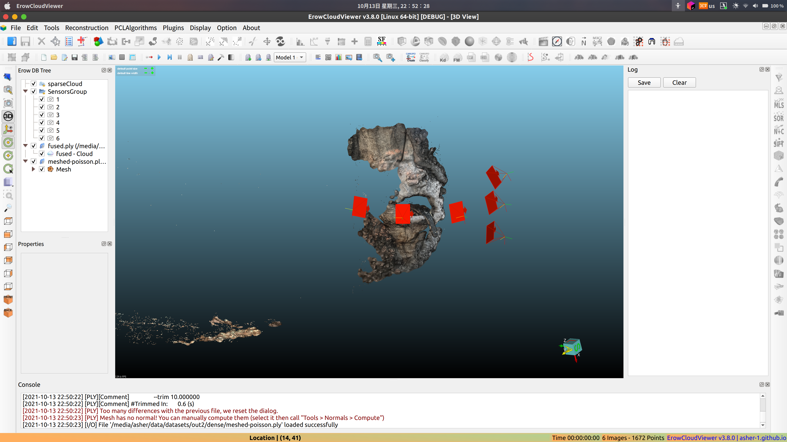

  

# ACloudViewer: A Modern System for 3D Data Processing

<h4>
    <a href="http://asher-1.github.io">Homepage</a> |
    <a href="http://asher-1.github.io/docs">Docs</a> |
    <a href="http://asher-1.github.io/docs/release/getting_started.html">Quick Start</a> |
    <a href="http://asher-1.github.io/docs/release/compilation.html">Compile</a> |
    <a href="http://asher-1.github.io/docs/release/index.html#python-api-index">Python</a> |
    <a href="http://asher-1.github.io/docs/release/cpp_api.html">C++</a> |
    <a href="https://github.com/Asher-1/CloudViewer-ML">CloudViewer-ML</a> |
    <a href="https://github.com/Asher-1/ACloudViewer/releases">Viewer</a> |
    <a href="http://asher-1.github.io/docs/release/contribute/contribute.html">Contribute</a> |
    <a href="https://www.youtube.com/channel/UCRJBlASPfPBtPXJSPffJV-w">Demo</a> |
    <a href="http://asher-1.github.io">Forum</a>
</h4>

Introduction
------------
ACloudViewer is an open-source library that supports rapid development of software that deals with 3D data. The
ACloudViewer frontend exposes a set of carefully selected data structures and algorithms in both C++ and Python. The
backend is highly optimized and is set up for parallelization. We welcome contributions from the open-source community.

------------
ACloudViewer is a 3D point cloud (and triangular mesh) processing software. It was originally designed to perform
comparison between two 3D points clouds
(such as the ones obtained with a laser scanner) or between a point cloud and a triangular mesh. It relies on an octree
structure that is highly optimized for this particular use-case. It was also meant to deal with huge point clouds (
typically more than 10 millions points, and up to 120 millions with 2 Gb of memory).

More on ACloudViewer [here](http://asher-1.github.io)

**Core features of ACloudViewer include:**

* 3D data structures
* 3D data processing algorithms
* Scene reconstruction (based on colmap)
* Surface alignment
* 3D visualization
* Physically based rendering (PBR)
* Available in C++ and Python

For more, please visit the [ACloudViewer documentation](http://asher-1.github.io).

## ACloudViewer System

  

ACloudViewer is a standalone 3D viewer app based on QT5 available on Ubuntu and Windows.
Please stay tuned for MacOS. Download ACloudViewer from the [release page](https://github.com/Asher-1/ACloudViewer/releases).

Semantic Annotation Tool:

  

Reconstruction Tool:

  

## CloudViewer app

  

CloudViewer-Viewer is a standalone 3D viewer app available on Ubuntu and Windows.
Please stay tuned for MacOS. Download CloudViewer app from the
[release page](https://github.com/Asher-1/ACloudViewer/releases).

## CloudViewer-ML

  

CloudViewer-ML is an extension of CloudViewer for 3D machine learning tasks. It builds on
top of the CloudViewer core library and extends it with machine learning tools for
3D data processing. To try it out, install CloudViewer with PyTorch or TensorFlow and check out
[CloudViewer-ML](https://github.com/Asher-1/CloudViewer-ML).

Compilation
-----------

Supported OS: Windows, Linux, and Mac OS X

Refer to the [compiling-cloudviewer.md file](doc/compiling-cloudviewer.md) for up-to-date information.

Refer to the [BUILD.md file](BUILD.md) for up-to-date information.

Basically, you have to:

- clone this repository
- install mandatory dependencies (OpenGL, etc.) and optional ones if you really need them
  (mainly to support particular file formats, or for some plugins)
- launch CMake (from the trunk root)
- enjoy!

Contributing to ACloudViewer
----------------------------

If you want to help us improve ACloudViewer or create a new plugin you can start by reading
this [guide](CONTRIBUTING.md)

Supporting the project
----------------------

If you want to help us in another way, you can make donations via [donorbox](https://asher-1.github.io)
Thanks!

