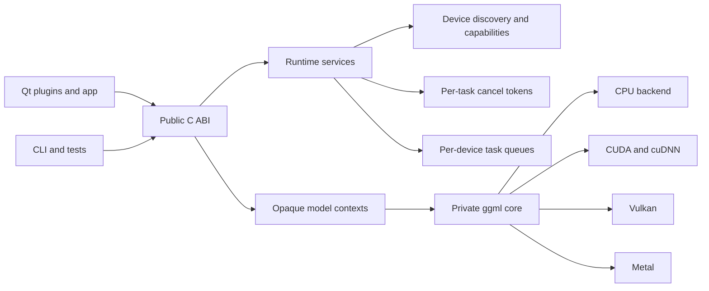
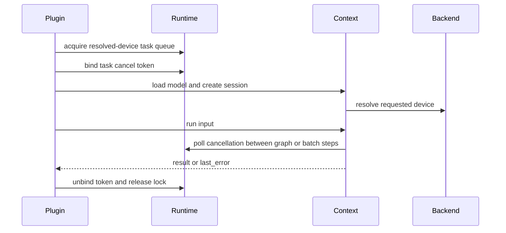

# AICore Architecture

## Scope

AICore is the process-local inference boundary shared by ACloudViewer plugins,
reconstruction code, command-line tools, and language bindings. Its public ABI
is the C header set under `include/aicore/`; ggml types and backend libraries are
private implementation details.

The architecture is partly migrated toward a process Runtime plus independent
model Sessions. Device discovery, capabilities, task cancellation, and opaque
per-model contexts are available today. Backend ownership and result contracts
are not yet fully uniform across every model family.

## Runtime Topology



Long-running plugin jobs acquire a queue keyed by their resolved device. This
permits independent CPU and GPU jobs to overlap while preserving one task at a
time per physical backend. The legacy process inference lock remains only for
short synchronous paths that do not yet expose a device request.

## Public Entry Points

| Header | Responsibility | Context ownership |
|---|---|---|
| `runtime_capi.h` | Task cancellation and per-device scheduling | Process runtime plus caller-owned cancel token |
| `backend_capi.h` | Device enumeration, availability, warmup, capabilities | Process discovery snapshot |
| `aliked_capi.h` | ALIKED feature extraction | Per-context extractor, backend, and pipeline cache |
| `lightglue_capi.h` | Sparse feature matching | Per-context matcher and backend |
| `facedetect_capi.h` | Detection, alignment, embedding, verification | Per-context model; backend is still process-global |
| `depth_capi.h` | Depth, pose, reconstruction, export | Per-context `depth::Engine` |
| `gaussian_capi.h` | FreeSplatter Gaussian reconstruction | Per-context model and options |
| `deeplsd_capi.h` | Line extraction | Per-context extractor |

All returned buffers must be released through the matching module free
function. C++ exceptions, STL containers, Qt types, and ggml handles must not
cross this boundary.

## Module Data Flow



### ALIKED and LightGlue

`src/aliked/` owns an extractor backend and a `GpuPipelineCache` per context.
Vulkan custom operations are resolved dynamically through
`vulkan/vulkan_aliked_dispatch.cpp`. Large Vulkan sessions currently rebuild
the backend between repeated extractions because ggml Vulkan convolution state
is not reliable after a 1024-pixel extraction. This is a correctness guard, not
the final performance design.

`src/lightglue/` owns matcher state per context. qLightGlue composes two ALIKED
extractions with one LightGlue match while keeping the public feature format
backend-neutral.

### FaceDetect

`src/facedetect/` supports YuNet/SCRFD detection, aligned SFace/ArcFace
embeddings, dense landmarks, age/gender, and anti-spoofing. CUDA conv nodes are
explicitly named `facedetect.cudnn.*`, so the shared ggml CUDA backend applies
cuDNN only to FaceDetect graphs.

Every FaceDetect context owns a Session with a compatible graph cache and
leases a physical backend from the common registry. The implementation retains
the `global_backend()` accessor solely as a thread-local binding inside an
active Session; it does not identify process-global mutable model state.

### Depth and Gaussian

`src/depth/` uses a context-owned `depth::Engine`; `src/gaussian/` uses a
context-owned model. Both poll the runtime cancellation API at graph or batch
boundaries. They still implement different internal backend wrappers and error
reporting conventions.

## Device Selection

`src/common/backend_capi.cpp` is the public device catalog and capability API.
It delegates registry loading and device resolution to
`src/common/ggml_backend_utils.hpp`.

Platform auto order is:

- Linux and Windows with CUDA: CUDA, Vulkan, CPU.
- Linux and Windows without CUDA: Vulkan, CPU.
- macOS: Metal, CPU.

Capabilities describe the resolved concrete backend. They are not a promise
that every model implements every operation on that backend; model load and
parity tests remain authoritative.

## Cancellation

Each long-running Qt worker owns an `aicore_cancel_token`, binds it on its worker
thread, and requests only that token from the UI thread. Current migrated
workers are qDA3, qFaceDetect, and qFreeSplatter.

The legacy process token and global inference-lock exports remain only for ABI
compatibility. They are compiler-deprecated in `runtime_capi.h`; new code must
use a caller-owned token plus `aicore_device_task_lock()` and must not call
`aicore_cancel_request()`.

## Migration Status

FaceDetect now creates one backend Session per context. Each Session has a
private compatible graph cache and leases a compatible physical backend keyed
by resolved device and CPU-thread configuration. The C API binds that Session
for model load, inference, and teardown, so it never changes
`FACEDETECT_DEVICE`, resets a process-global backend, or invalidates another
context's weights.

All public model C APIs now provide an explicit `*_is_ready(ctx)` query. This
normalizes readiness for successful contexts without breaking older `NULL on
load failure` entry points.

qDA3, qDeepLSD, qFaceDetect, qFreeSplatter, and qLightGlue workers now bind
their caller-owned cancellation token while holding the resolved-device queue.
The synchronous Face Capture path uses the same scoped token and resolved
device queue; it no longer serializes unrelated inference through the legacy
process-wide lock.

## Remaining Architecture Gaps

1. The internal backend registry now shares a physical `ggml_backend_t` across
   FaceDetect, LightGlue, DeepLSD, Depth, Gaussian, and ALIKED. Every public
   context retains private graph caches, allocators, schedulers, and weights;
   only compatible physical handles and execution locks are shared.
2. The public runtime ABI exposes device discovery, capability bits, scoped
   task cancellation, and device queues, but does not yet provide a single
   typed `DeviceManager`/task-result object for third-party C++ consumers.
3. Load-failure contracts differ: depth retains its ABI-compatible `NULL` result,
   while newer modules return a non-ready context with `last_error`.
4. Result payloads remain task-specific allocations/JSON rather than one typed
   result envelope; callers must still use each module's documented free API.
5. Cancellation is cooperative and checked at graph or batch boundaries; a
   single long backend kernel cannot be preempted.
6. Backend capability bits are device-wide. Model-specific operation coverage,
   memory limits, and precision guarantees are not yet queryable.

## Target Design

The next migration should preserve the C ABI while adding internal C++ runtime
objects:

```text
Runtime (process singleton)
  DeviceManager
    BackendRegistryEntry { device, raw backend, ref_count, execution mutex,
                           capabilities }
  TaskScheduler
    Task { cancel_token, requested_device, priority }

Session (one per public context)
  shared BackendLease
  private allocator/scheduler, model weights and graph cache
  last status { ready, error_code, message }
  result owner
```

Migration order:

1. Done: add the internal `BackendLease` and reference-counted raw-backend
   registry without changing public context APIs.
2. Done: migrate LightGlue and DeepLSD while retaining private allocators and
   serialize graph work per physical backend.
3. Done: migrate Depth and Gaussian with a lease group for their GPU set plus
   CPU fallback backend; schedulers remain Session-private.
4. Done: migrate ALIKED and FaceDetect, retaining ALIKED's size-keyed Vulkan
   graph cache and FaceDetect's compatible graph cache as Session-private.
5. Add common status/error definitions and `is_ready` to every public module,
   preserving old symbols as ABI-compatible wrappers.
6. Add model capability queries that combine device support with graph and
   precision requirements.
7. Add concurrency tests for two contexts, two devices, cancellation isolation,
   and backend lifetime reference counting.

## Edit Guide

| Change | Primary files |
|---|---|
| Device aliases or auto order | `src/common/ggml_backend_utils.hpp`, `src/common/backend_capi.cpp` |
| Public capability bit | `include/aicore/backend_capi.h`, `src/common/backend_capi.cpp`, contract tests |
| Cancellation behavior | `include/aicore/runtime_capi.h`, `src/common/runtime_capi.cpp` |
| New model C API | `include/aicore/<model>_capi.h`, `src/<model>/capi.cpp`, `tests/<model>/` |
| ALIKED Vulkan operation | `src/aliked/vulkan/`, merged ggml patch exporter, ALIKED parity tests |
| FaceDetect CUDA/cuDNN | `src/facedetect/graph_ops.cpp`, `src/facedetect/antispoof_graph.cpp`, `patches/cuda_cudnn/` |
| Plugin task integration | Plugin worker class plus `runtime_capi.h`; use a caller-owned cancel token |

## Verification

Fast ABI and runtime contracts:

```bash
ctest --test-dir build_app -L capi --output-on-failure
```

Model-specific acceptance additionally requires CPU/GPU parity, repeated
same-context execution, cancellation isolation, and end-to-end plugin workflow
tests. A backend being discoverable is not sufficient evidence of correctness.
