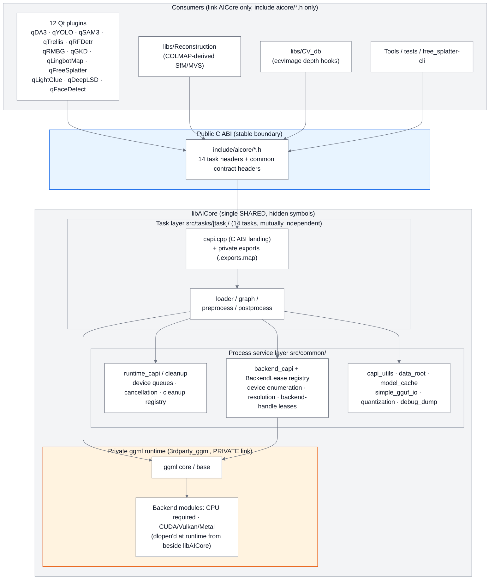
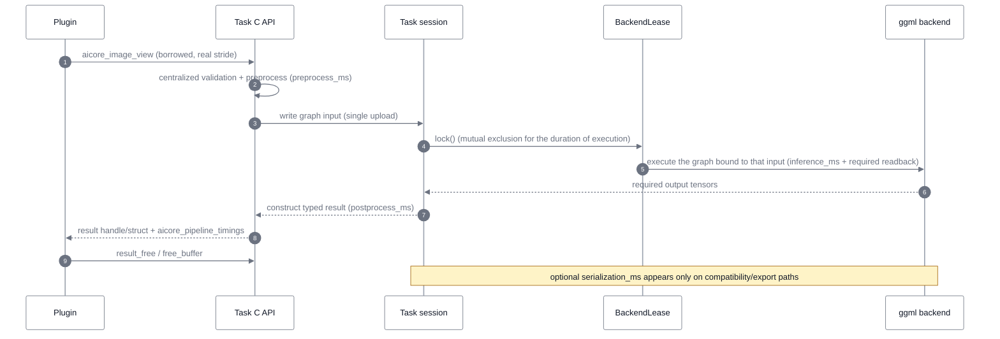
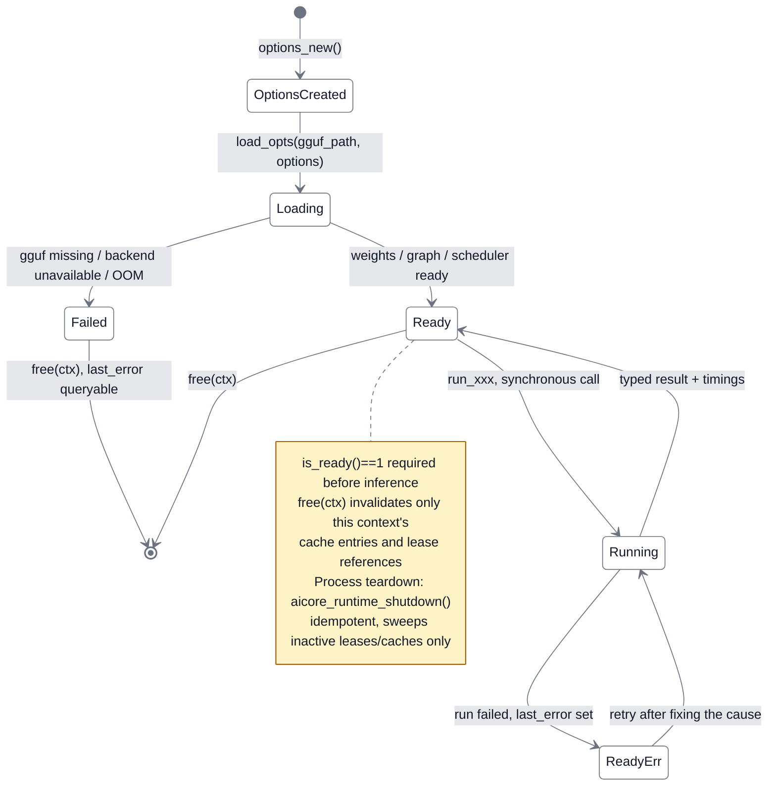
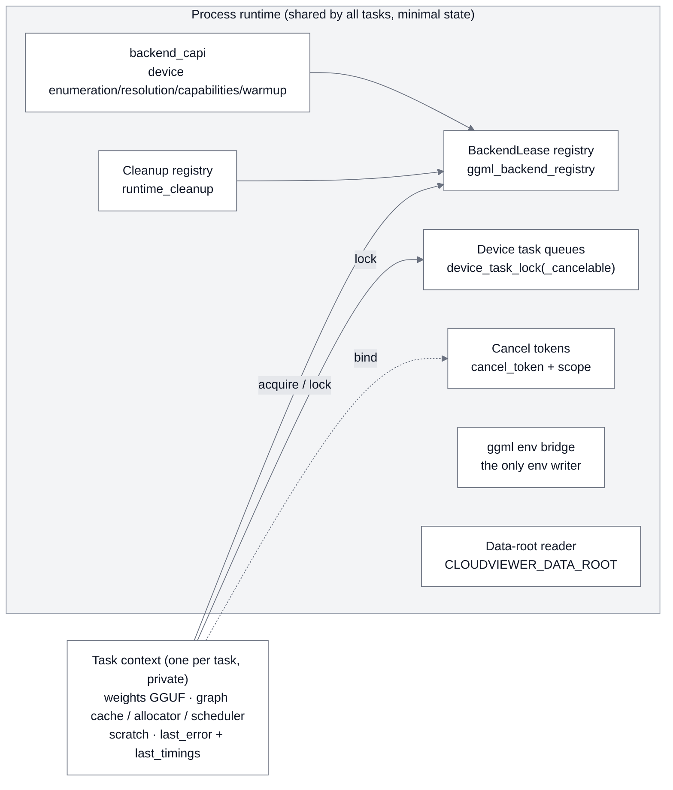
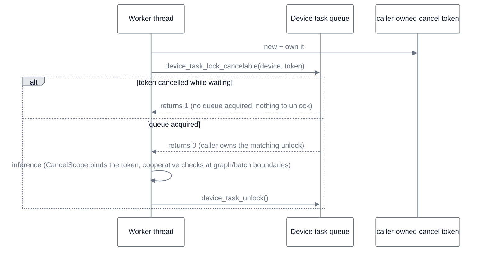
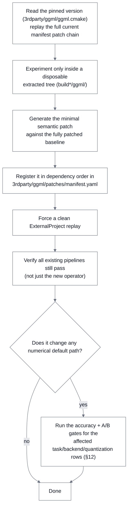
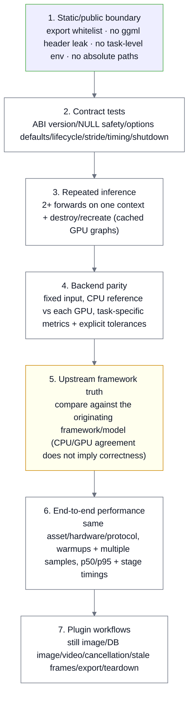

# AICore Architecture (Runtime Topology · Ownership · Data Flow)

> **What this document is**: the single source of truth for AICore's runtime topology,
> ownership model, and data flow (see the Documentation Ownership table in
> [`../README.md`](../README.md)). The engineering contract (ABI rules, review
> checklist, acceptance gates) lives in
> [`SKILL.md`](../../../.agents/skills/acloudviewer-aicore-plugin/SKILL.md) — this
> document links to it instead of repeating it; the model/performance test protocol
> lives in [`../tests/TESTING.md`](../tests/TESTING.md).
>
> **Audience**: developers touching AICore for the first time, developers adding a
> new task or plugin, and developers working on backends or ggml. All prose in
> AICore docs and code is English; code symbols, commands, and paths appear as-is.
> **Documentation discipline**: numbers that drift (ABI values, patch counts,
> benchmark figures) are never hard-coded here — every one of them points at its
> owning source. This is a repo documentation rule (SKILL.md §1).

---

## 0. Newcomer 30-Minute Route (Run It First, Read Details Later)

| Step | What to do | Command / location | Outcome |
|---|---|---|---|
| 1 | Build the mental model | Read §1 and §2 below (10 min) | Know where the boundaries are |
| 2 | Configure and build | Command block in §11.2 | `build_app/bin/libAICore.so` |
| 3 | Run the contract tests (no model assets needed) | `ctest --test-dir build_app -L capi -j1` | See everything PASS |
| 4 | Read one complete minimal task | `src/tasks/sam3/` (the smallest task in the tree) | Understand the task skeleton |
| 5 | Read its C API header | `include/aicore/sam3_capi.h` | Understand the lifecycle pattern |
| 6 | Look at how a consumer uses it | `plugins/core/Standard/qSAM3/` | Understand the worker pattern |
| 7 | About to change code? | Jump straight to §13 (development scaffold) | Locate + checklist + pitfall table |

---

## 1. What AICore Is

AICore is ACloudViewer's **in-process inference kernel**: one monolithic shared
library, `libAICore`, exposing a **stable pure C ABI** to Qt plugins, the
COLMAP-derived reconstruction code, command-line tools, and the Python bindings.
ggml and its CPU/GPU backends are **private implementation details** that
consumers never touch.

The design in one sentence: **"in-process libAICore + pure C ABI + borrowed image
input + typed results"**. It is structurally the same as the handle-based,
versioned-function-table designs of ONNX Runtime / OpenVINO and fits the desktop
single-process scenario; service-style scheduling (Triton-like) is outside this
project's problem domain.

### 1.1 Five Non-Negotiable Boundaries

| # | Boundary | Contract | Cost of violation |
|---|---|---|---|
| 1 | Packaging | Exactly one `libAICore` target; per-task shared libraries are **forbidden** | Deployment/symbol/dependency matrix explosion |
| 2 | Public ABI | Only C headers under `include/aicore/`; STL/Qt/OpenCV/exceptions/ggml types must **not cross** (`depth_image.h` is the single documented Qt exception) | Consumers get locked to implementation details |
| 3 | Input | Decoded images enter as a **borrowed, row-stride-aware** `aicore_image_view` | Hidden copies / misaligned row parsing |
| 4 | Output | Typed result structs/handles with explicit ownership and one release path; JSON and encoded images are compatibility/export boundaries only | Serialization round-trips on the hot path |
| 5 | Runtime | Device discovery/queues/cleanup are process services; model/session/cache state is **private per context** | Cross-context state corruption |

### 1.2 Overall Architecture (Layered View)



Key point: ggml headers, targets, backend handles, and patch-specific operators are
all **private** to AICore. Consumers link the single `AICore` target and nothing
else (exception: `AICore_capi_link` exists only to close direct C-API executable
links with `--allow-shlib-undefined` under `GGML_BACKEND_DL`; it is not a public
replacement for `AICore`).

---

## 2. Source Layout Map

```text
core/AICore/
├── include/aicore/          Public ABI (installed to include/AICore/, *.h only)
│   ├── aicore.h             Umbrella header (note: intentionally excludes inference_log.h, see §3.1)
│   ├── export.h             AICORE_CAPI / AICORE_CXX_API export macros
│   ├── image_view.h         Borrowed decoded-image input contract
│   ├── pipeline_timing.h    Unified timing contract
│   ├── runtime_capi.h       Cancellation / device queues / process cleanup
│   ├── backend_capi.h       Device enumeration / resolution / capabilities / warmup (model_kind admission enum)
│   ├── runtime_raii.h       Header-only C++ RAII (DeviceTaskLock / CancelScope, Qt-free)
│   ├── depth_image.h        Qt exception: QImage convenience layer (AICORE_CXX_API ImageDepth)
│   ├── inference_log.h      CVLog logging convenience layer (depends on CVLog, hence not in the umbrella)
│   ├── asset_digests.h      Generated file: SHA-256 anchor table for published model assets (Qt-free)
│   └── <task>_capi.h × 14   Task C APIs (aliked/deeplsd/depth/facedetect/gaussian/
│                            gkd/lightglue/lingbot/loma/rfdetr/rmbg/sam3/trellis/yolo)
├── src/common/              Process service layer (devices, leases, cancellation, cache paths, logging, quantization)
├── src/tasks/<task>/        Task engines (loader/graph/preprocess/postprocess/capi.cpp)
│   └── trellis/third_party/ xatlas · o-voxel-fdg · CuMesh (optional GPU chart clustering, see §11.1)
├── tests/
│   ├── common/              Shared contract tests (image_view/timing/runtime/backend_registry/data_root)
│   ├── <task>/              Task contracts + parity + model/e2e tests
│   ├── check_no_legacy_symbols.sh   Export whitelist + ggml header leak check
│   ├── check_no_env_getenv.sh       Environment variable whitelist check
│   ├── check_capi_coverage.py       C API test coverage (threshold 95%)
│   └── TESTING.md           Test protocol and evidence ladder
├── scripts/                 validate_all.py + validation_manifest.json (one-click regression gate)
├── cmake/                   aicore.exports.map (Linux version script) etc.
├── tools/                   aicore_gguf_quantize command-line quantization tool
└── docs/ARCHITECTURE.md     This document
```

---

## 3. Public ABI: Headers and Task Lifecycle

### 3.1 Three Header Classes with Different Rules

| Class | Headers | Rule |
|---|---|---|
| **C ABI headers** (`extern "C"`) | `image_view.h` `pipeline_timing.h` `runtime_capi.h` `backend_capi.h` + 14 `<task>_capi.h` | C types only; exported symbols `aicore_*` |
| **Qt-free C++ headers** | `runtime_raii.h` (inline RAII), `asset_digests.h` (generated table) | Pure inline/data; never touch the export map; usable by non-Qt consumers |
| **C++ helper headers with dependencies** | `depth_image.h` (QImage/QString, the **single documented Qt exception**), `inference_log.h` (depends on CVLog) | `inference_log.h` is **intentionally excluded from the umbrella** `aicore.h`: lean capi test targets have no CVLog include path; only plugins/app-side code includes it directly |

> The umbrella `aicore.h` is a convenience include; new code should **include only
> the headers it uses**. Adding a new task header to the umbrella is optional.

### 3.2 The Fourteen Tasks at a Glance

| Task header | Capability | Image input shape |
|---|---|---|
| `depth_capi.h` | Monocular depth + camera pose + reconstruction + COLMAP/GLB/PLY export (DA3 family) | `aicore_image_view` |
| `gaussian_capi.h` | FreeSplatter image-to-3D Gaussians | NCHW float tensors (in-memory and file-path entries) |
| `aliked_capi.h` | ALIKED feature extraction (native ggml implementation + dedicated CUDA/Vulkan kernels, see §11.1) | RGB pointer + row_stride |
| `lightglue_capi.h` | Sparse feature matching | Non-bitmap: `aicore_lightglue_features` |
| `deeplsd_capi.h` | Line segment extraction | GRAY pointer + row_stride |
| `loma_capi.h` | LoMa features (detector/descriptor/matcher roles, COLMAP-aligned; default DaD + DeDoDe-G + LoMa-B) | Own stride-aware `aicore_loma_rgb_image` |
| `facedetect_capi.h` | Face detection/landmarks/analysis/embedding/verification | `aicore_image_view` |
| `rfdetr_capi.h` | RF-DETR detection and segmentation | `aicore_image_view` |
| `rmbg_capi.h` | RMBG alpha matting + RGBA composition (**shared foundational task**; trellis et al. consume it via the RMBG cache API) | `aicore_image_view` |
| `sam3_capi.h` | SAM 2/2.1/3 segmentation and tracking | RGB pointer + row_stride |
| `trellis_capi.h` | TRELLIS image-to-3D generation (incl. GLB export; single-source model catalog: `src/tasks/trellis/model_catalog.cpp`) | Pipeline-internal; also mesh/RMBG-RGBA outputs |
| `yolo_capi.h` | YOLO detect/segment/pose/OBB/semantic/classify/depth + prompts | `aicore_image_view` |
| `gkd_capi.h` | GKDT general keypoint detection (text/visual/multimodal prompts) | `aicore_image_view` |
| `lingbot_capi.h` | LingBot-Map (GCT) streaming RGB-D reconstruction: depth/pose/native sky masking | `aicore_image_view` |

> Shape rule: **new bitmap-consuming tasks must use `aicore_image_view`**. A few
> tasks use their own typed structs because the input is not a bitmap (features,
> NCHW tensors) or for historical compatibility (pointer + stride parameters) —
> they still obey "borrowed + stride-aware + valid for the duration of one
> synchronous call".

### 3.3 Unified Lifecycle Pattern (every task implements this)

```c
/* 1) Version query — compile time and runtime can agree */
int aicore_<task>_abi_version(void);

/* 2) options: caller creates/fills/frees; setters are all NULL-safe */
aicore_<task>_options* aicore_<task>_options_new(void);
void aicore_<task>_options_free(aicore_<task>_options* options);
void aicore_<task>_options_set_device(aicore_<task>_options* options,
                                      const char* device);   /* "auto"/"cpu"/"gpu"/"vulkan:1"/"cuda" */
void aicore_<task>_options_set_threads(aicore_<task>_options* options, int n_threads);

/* 3) load: returns an opaque context; NULL on failure with a queryable error */
aicore_<task>_ctx* aicore_<task>_load_opts(const char* gguf_path,
                                           const aicore_<task>_options* options);
int         aicore_<task>_is_ready(const aicore_<task>_ctx* ctx);
const char* aicore_<task>_last_error(const aicore_<task>_ctx* ctx);

/* 4) run: synchronous inference; input borrowed; typed result owned by the caller */
int aicore_<task>_run_xxx(aicore_<task>_ctx* ctx, /* inputs */, <typed_result>* out);

/* 5) release: one explicit release function per result + one unified buffer entry */
void aicore_<task>_free_xxx(<typed_result>* result);
void aicore_<task>_free_buffer(void* p);      /* unified exit for malloc'd strings/arrays */

/* 6) observability and teardown */
int  aicore_<task>_last_pipeline_timings(const aicore_<task>_ctx* ctx,
                                         aicore_pipeline_timings* timings);
void aicore_<task>_shutdown(void);   /* delegates to aicore_runtime_shutdown(), ABI-compatible */
```

**Common rules**: an opaque context has exactly two states — ready or queryable
error; `0` on success / `-1` for contract or runtime errors (a few existing ABIs
document different compatibility values); more than six related inputs belong in
an options/request struct; breaking signatures/layout/ownership or removing
symbols requires bumping that task's `abi_version` and updating its contract
tests (SKILL.md §3).

### 3.4 Export Symbol Rules (what is allowed to leave libAICore)

On Linux the `cmake/aicore.exports.map` version script closes this; on every
platform symbol hiding (`CXX_VISIBILITY_PRESET hidden`) plus the gate script
close it:

```text
AICORE_1 {
    global:
        aicore_*;                            /* the entire public C ABI */
        _ZN6aicore5depth10ImageDepth*;       /* the only exported C++ class: aicore::depth::ImageDepth */
    local: *;                                /* everything else hidden (ggml included) */
};
```

Verification (CI gate; mandatory after any ABI change):

```bash
bash core/AICore/tests/check_no_legacy_symbols.sh \
     build_app/bin/libAICore.so core/AICore/include/aicore
```

Public headers are additionally enforced at configure time:
`cmake/CheckPublicHeaders.cmake` fails the build (`FATAL_ERROR`) when any public
header includes a ggml/gguf header.

Diagnostic/white-box symbols **never enter the production DSO**: tests that need
private C++ internals use the `AICore_test` static library behind
`AICore_BUILD_WHITEBOX_TESTS=ON` (it excludes `capi.cpp`/`image_depth.cpp`).

### 3.5 Cross-Boundary Struct Versioning Rule

Any struct in `include/aicore/*.h` that crosses a call boundary as an input or
output must carry:

- `uint32_t struct_size;` — the caller sets `sizeof(struct)` so the runtime can
  detect mismatched builds;
- `uint32_t abi_version;` — bumped together with the owning task's
  `aicore_<task>_abi_version()`.

Retrofitting older structs = that task's ABI bump + a contract-test update.
Header-only C++ helpers stay Qt-free and purely inline so the export map and the
C ABI surface remain untouched.

---

## 4. Data Flow: From Pixels to Typed Results

### 4.1 Input Contract: the Borrowed Image View

```c
typedef struct aicore_image_view {
    const uint8_t* data;          /* read-only; caller owns it; valid for one synchronous call */
    int32_t width, height;
    size_t  row_stride_bytes;     /* may exceed width*bpp (QImage/camera/video aligned rows) */
    aicore_image_format format;   /* RGB8 / RGBA8 / GRAY8 / BGR8 / BGRA8 */
} aicore_image_view;
```

**Caller rules** (most pitfalls are on the Qt side):

- Ownership never transfers; the view is valid only for **one synchronous
  inference call**.
- `QImage::bits()` is **not guaranteed to be tightly packed**: Grayscale8 /
  RGB888 rows may be aligned beyond logical width — pass the real `bytesPerLine()`.
- On little-endian systems the memory layout of `QImage::Format_ARGB32` is
  **BGRA8**.
- Unsupported or premultiplied formats are converted **once** at the plugin
  boundary (convertToFormat) and that QImage is retained for the call.

**AICore-internal rules**: centralized validation (data/dimensions/format/
overflow/minimum stride); rows are read directly into persistent preprocess
staging; the "pack tight RGB first, then convert to CHW" two-stage copy is
forbidden.

### 4.2 Timeline of One Inference (Shortest Supported Path)



### 4.3 Hot-Path Bans (between input submission and result delivery)

| Banned | Why | Still legitimate for |
|---|---|---|
| Temporary image file save/reload | Filesystem round-trip + pointless codec work | — |
| JSON serialization then plugin-side parsing | Double parsing + lost type information | Model metadata, persistence, RPC, user export |
| Packing RGB into a QByteArray before CHW conversion | One extra full-image copy | — |
| PNG/JPEG encoding as an internal handoff | Encode/decode overhead | DB metadata, post-inference file export |
| Materializing N full-resolution masks before top-k selection | VRAM/memory peak | — |
| Large buffers copied through queued signals without an owner | Uncontrollable lifetime | — |

Typed results expose only what the consumer needs: filter detections on the
decoded tensors first, then materialize the selected masks; reuse context scratch
capacity across frames — never `shrink_to_fit` in a hot loop.

### 4.4 Unified Timing Contract (`aicore_pipeline_timings`)

| Field | Boundary |
|---|---|
| `preprocess_ms` | API input validation → graph-input preparation |
| `inference_ms` | upload, backend graph execution, synchronization, and the readback required to expose native outputs |
| `postprocess_ms` | typed native result construction |
| `serialization_ms` | compatibility serialization/encoding only (optional) |
| `e2e_ms` | API entry → native result ready (excludes serialization when it can be measured independently) |

Consumers **must** inspect `valid_fields`: a zero with the bit clear means
"unmeasurable", not "instantaneous". Plugin queueing/thread hops/decoding/render/
display are **outer measurements** and must not be mixed with AICore E2E.

---

## 5. Ownership and Lifecycle

### 5.1 Ownership Model

| Object | Owner | Lifetime rule |
|---|---|---|
| Options | Caller | create → set → load → free; setters NULL-safe |
| Task context | Caller | The single model/session owner; free after all synchronous calls complete |
| Input image view | Caller | Borrowed; valid for one synchronous call |
| Typed result | Task ABI | Released via the function documented by the owning header (one result, one explicit release path) |
| BackendLease | Context/session | Shared physical backend handle; reference counted (§6.2) |
| Graph/allocator/scratch | Context/session | Never process-global mutable model state |
| Cancel token | Worker/caller | Independent request scope; bound only on the inference thread |
| Cleanup registry | Process runtime | Sweeps inactive resources, **never** touches live contexts |

Compatibility wrappers (path/JSON/tight-RGB APIs) may allocate temporary result
text or packed RGB, but they call into the typed implementation and must
**never** be used by plugin frame paths — the typed path is always the
implementation owner.

### 5.2 Context Lifecycle State Machine



---

## 6. Process Runtime Services (src/common)

### 6.1 Service Overview



Design axiom: **physical backend handles may be shared; execution state must be
private**.

### 6.2 BackendLease (backend-handle lease)

- Declared in `src/common/ggml_backend_registry.hpp`, namespace `aicore::runtime`;
- `acquire_backend_lease(device_request, n_threads, error)`: takes a shared
  backend for the resolved device; **the CPU thread count is part of the lease
  key** (it configures the backend instance);
- `adopt_backend_lease(backend, resolved_device, n_threads)`: takes ownership of
  an already-created handle (used by multi-GPU schedulers); when a live lease with
  the same key exists it **returns the old lease and immediately releases the
  candidate handle** — the caller must then apply thread affinity and similar
  settings to the **actually surviving** handle;
- `acquire_parallel_backend_lease(...)`: CPU only — issues a session-private CPU
  backend so independent workers can run in parallel; non-CPU devices keep the
  shared lease + execution lock (their physical command queues are shared);
- `lock_backend_leases(vector<BackendLease>)`: locks a group of GPU leases + CPU
  fallback in a stable order;
- `purge_inactive_backend_leases()`: reclaims the key-table memory of ownerless
  leases; triggered by the per-task `aicore_<task>_shutdown()` delegates through
  `aicore_runtime_shutdown()`.

**Discipline**: any task module that creates backends itself must hold a
`BackendLease` member, initialize through `acquire/adopt`, and must **never** call
bare `ggml_backend_free` at release points (`BackendLease::State`'s destructor
releases) — otherwise dangling or double releases result.

### 6.3 Device Queues and Cancellation



- **Nested acquisition is forbidden** (same thread); RAII wrappers: `DeviceTaskLock`
  / `CancelScope` from `runtime_raii.h`;
- `aicore_cancel_*` (process-wide) and `aicore_inference_lock/unlock` (global
  serial lock) are `AICORE_LEGACY_API` compatibility surfaces; new workers always
  use task-owned tokens + device queues;
- Long-running worker standard posture: caller-owned token, resolved-device
  queue, context kept on the worker thread, cooperative cancellation at
  graph/batch boundaries, generation checks before publishing results.

### 6.4 Process Cleanup

`aicore_runtime_shutdown()` is the idempotent global entry; every task's
`aicore_<task>_shutdown()` is its ABI-compatible delegate. It may sweep: inactive
leases + registered task caches (`runtime_cleanup.hpp`'s
`register_cleanup/run_cleanups`, deduplicated registration, callbacks run outside
the registry lock). It **never** destroys live contexts or backends still
referenced by them.

### 6.5 Environment Variable Boundary (hard rule)

Task behavior is configured **only** through options; `src/tasks/**` must not
touch the env mechanism at all (not even including `ggml_env_bridge.hpp`). The
whitelist is exactly three files (enforced by `tests/check_no_env_getenv.sh`):

| File | Responsibility |
|---|---|
| `common/data_root_util.cpp` | Reads `CLOUDVIEWER_DATA_ROOT` (deployment data-root convention) |
| `common/ggml_env_bridge.cpp` | **The only** env writer: `explicit options → GgmlEnvOverrides → apply_ggml_env_overrides()` (direction: "explicit interface drives env"; ggml snapshots `GGML_VK_*`/`GGML_METAL_*` when a backend instance is created) |
| `common/debug_dump.cpp` | Debug-only dump-path reads |

### 6.6 Data Root and Model Cache

```text
$CLOUDVIEWER_DATA_ROOT (default ~/cloudViewer_data)
└── extract/
    ├── da3_models/            ← depth (depth_model_cache_dir())
    ├── freesplatter_models/   ← gaussian
    ├── lightglue_models/      ← lightglue + aliked (shared!)
    ├── deeplsd_models/  loma_models/  facedetect_models/
    ├── rfdetr_models/   rmbg_models/   yolo_models/
    ├── sam3_models/     trellis_models/  gkd_models/  lingbot_models/
    └── (shared fixture archives in ../download/, consumed files SHA-256 checked in extract)
```

- `src/common/model_cache.hpp` provides the per-task directory functions;
  plugin-side downloads go through `ecvModelDownloader` / `ecvAssetIntegrity`
  (`asset_digests.h` is the content-anchor table, no size-only fallback);
  plugins must **not** build private download/extract state machines;
- **RMBG is a shared dependency**: consumers such as trellis must obtain
  `rmbg_models` through the RMBG cache API and must not duplicate it.

---

## 7. Cache and GPU Graph Execution Safety

**A cache key must include every compatibility dimension**: resolved
backend/device, tensor shape and type, model/weight identity, graph-affecting
options, and an owner/session generation where allocator reuse is possible.
Context teardown invalidates only entries **owned by that context (or its
weights)** — clearing a process-global cache from one context can corrupt other
live contexts and is forbidden.

**Cached GPU graph execution order invariant** (rebinding can invalidate/clear
the uploaded input):

```text
build graph
  → allocate/bind graph buffers
  → upload current input
  → execute THAT SAME bound graph
  → read required outputs
```

GPU tests therefore require: **≥ 2 forwards on the same context + context
destroy/recreate** — a single successful call does not prove cache safety.

---

## 8. Plugin Execution Model

### 8.1 Still-Image Worker (single-frame tools)

Borrow the decoded storage → infer → convert the typed result into
annotations/DB entities. Binding results to source identity is enough; no
pipeline constraints.

### 8.2 Live Worker (video/camera streams)

```mermaid
%%{init: {"theme":"base","themeVariables":{"primaryColor":"#ffffff","primaryTextColor":"#111827","primaryBorderColor":"#6b7280","secondaryColor":"#f3f4f6","tertiaryColor":"#e5e7eb","mainBkg":"#ffffff","nodeBorder":"#6b7280","textColor":"#111827","titleColor":"#111827","lineColor":"#6b7280","clusterBkg":"#f3f4f6","clusterBorder":"#9ca3af","edgeLabelBackground":"#e5e7eb","labelBoxBkgColor":"#e5e7eb","labelTextColor":"#111827","noteBkgColor":"#fef3c7","noteTextColor":"#111827","noteBorderColor":"#a16207","actorBkg":"#ffffff","actorTextColor":"#111827","actorBorder":"#6b7280","actorLineColor":"#9ca3af","signalColor":"#6b7280","signalTextColor":"#6b7280","sequenceNumberColor":"#ffffff","loopTextColor":"#111827","activationBkgColor":"#f3f4f6","activationBorderColor":"#6b7280"},"themeCSS":".edgeLabel span, .edgeLabel p, .edgeLabel .labelText, .labelText { color: #111827 !important; fill: #111827 !important; }"}}%%
flowchart LR
    F0["new frame g=7 (decode/frame thread)"] --> GATE{"running slot idle?"}
    GATE -->|yes| RUN["running: frame g=7<br/>context + queue + CancelScope"]
    GATE -->|"no (one frame already running)"| PEND["pending: keep only latest frame g=8<br/>(older pending is dropped)"]
    RUN -->|"completion on every path (success / failure / cancel / stale / invalid input)"| DONE["completeFrameProcessing()<br/>decoder releases the next frame"]
    PEND -->|"running slot frees"| RUN2["running: frame g=8"]
    DONE --> CHECK{"generation == current source generation?"}
    CHECK -->|"no (seek / source change / stop / reload)"| DROP["drop, never publish"]
    CHECK -->|yes| PUB["publish overlay/result"]
```



Rule summary: **1 running + at most 1 latest pending**; results carry source
identity and generation — stale results after seek/source change/stop/model
reload are always dropped; consumer-driven video must call
`completeFrameProcessing()` on **every** completion path or playback stalls;
preserve decoded resolution, preprocessing belongs to AICore; convert QImage only
once and only when its format is not representable.

---

## 9. Backend and Configuration Policy

### 9.1 Platform Backend Matrix

| Platform | Default | Auto order | Notes |
|---|---|---|---|
| Linux (CUDA built) | CUDA | CUDA → Vulkan → CPU | CUDA backend **dynamically loaded**; libAICore has no mandatory CUDA dependency |
| Linux/Windows (no CUDA) | Vulkan | Vulkan → CPU | — |
| macOS | Metal | Metal → CPU | **Vulkan is unsupported on macOS** (MoltenVK fails to translate complex ggml compute shaders; removed since v3.9.5) |

Device strings: `"auto"` / `"cpu"` / `"gpu"` / `"<backend>:N"` (e.g. `vulkan:1`).
Enumeration/resolution/capabilities/warmup live in `backend_capi.h`:
`aicore_device_count/at`, `aicore_device_available`,
`aicore_device_capabilities`, `aicore_model_device_info_query` (**model-level**
admission: capability bits + precision + conservative working-set estimates, so
UIs can pre-disable infeasible choices — it is admission control, not a
replacement for allocation failures), `aicore_warmup_backend` (call on the UI
thread before spawning a worker).

Capability bits describe the **resolved device**, not per-model numerical
correctness — model × backend correctness remains the parity tests' job. The
`aicore_model_kind` enum and the `FillModelDeviceInfo` switch must be extended
together (new task = enum value + switch branch).

### 9.2 Configuration Policy

- Process configuration goes through **explicit options** (CMake public switches
  in §11.3; runtime behavior via `*_options_set_*`);
- Zero env reads in task code (§6.5);
- Zero developer-machine absolute paths in production code (assets resolve
  through options / the shared data root / repo fixtures).

---

## 10. ggml Integration



- ggml is an ExternalProject + PRIVATE dependency; the pinned version and archive
  digest live only in `ggml.cmake`; durable modifications exist only as
  **ordered patch files** referenced by `patches/manifest.yaml`;
- extracted sources under `build*/ggml/` are **disposable and must not be
  committed**;
- when an upstream patch touches code already modified by existing patches, it
  **must be merged semantically** and proven to replay cleanly (never copy it
  verbatim);
- clean replay command:

```bash
rm -f build_app/ggml/src/ext_ggml-stamp/ext_ggml-{install,done}
cmake --build build_app --target ext_ggml -j4
```

---

## 11. Build System

### 11.1 Single Target and Dependencies

| Item | Fact |
|---|---|
| Target | `AICore` (SHARED, C++17, hidden visibility, output in `bin/`, RPATH `$ORIGIN`/`@loader_path`) |
| Private links | `3rdparty_ggml` (ExternalProject), `3rdparty_meshoptimizer`, `CVCoreLib` (defines `AICore_HAS_CVLOG`), Threads |
| Public links | `Qt::Core Qt::Gui` (PUBLIC — a consequence of the `depth_image.h` Qt exception) |
| OpenMP | ALIKED SIMD/collapse kernels (MSVC uses `/openmp:experimental` and strips 3rdparty_ggml's default `/openmp`) |
| ALIKED acceleration | `AICore_CUDA_ENABLED` → `aliked_cuda.cu` (statically linked cudart on UNIX so libAICore carries no libcudart DT_NEEDED); `AICore_VULKAN_ENABLED` → `vulkan_aliked_dispatch.cpp` |
| Trellis CuMesh | `AICore_USE_CUMESH` (default ON; degrades step-by-step with loud warnings when CUDA/libtorch/Python headers are missing; mesh_export falls back to simple_unwrap; builds a separate `aicore_cumesh` SHARED linked to libtorch+libpython) |
| Version script | `cmake/aicore.exports.map` (Linux); `AICore_capi_link` serves only executables that link the C API directly under `GGML_BACKEND_DL` |
| Task registration | New task = GLOB + existence check + include paths inside the existing monolithic `core/AICore/CMakeLists.txt` target; **no** task-specific shared libraries |

### 11.2 Minimal Build

```bash
cmake -S . -B build_app \
  -DAICore_ENABLED=ON \
  -DAICore_BUILD_TESTS=ON
cmake --build build_app --target AICore aicore-contract-tests -j4
```

Use only `AICore_*` public options; internal `GGML_*` cache entries are derived
by `cmake/AICoreOptions.cmake` and must not be passed as user configuration.

### 11.3 Common CMake Options (see BUILD.md / AICoreOptions.cmake for the full list)

| Option | Purpose |
|---|---|
| `AICore_ENABLED` / `AICore_BUILD_TESTS` / `AICore_BUILD_WHITEBOX_TESTS` | Module / contract tests / white-box static library |
| `AICore_USE_METAL` / `USE_VULKAN` / `USE_CUDA` / `USE_SYCL`(+`SYCL_USE_DNN`) / `USE_OPENCL` | Backend switches (SYCL/OpenCL are explicit opt-in development backends) |
| `AICore_BUNDLE_CUDA_RUNTIME` / `AICore_CUDA_FORCE_MMQ` | Bundle the CUDA runtime / force MMQ quantization kernels |
| `AICore_CPU_ALL_VARIANTS` | Multi-variant CPU backend |
| `AICore_USE_CUMESH` (+`CUMESH_TORCH_DIR`) | Trellis GPU chart clustering |
| `AICORE_TEST_ASSET_ROOT` / `AICORE_TEST_AUTO_DOWNLOAD` / `AICORE_TEST_DEVICE` / `AICORE_TEST_ENABLE_MODEL_TESTS` | Test asset root / explicit download / device / model-test switches (see TESTING.md) |

### 11.4 Deployment Shape

- ggml shared libraries (core/base) and backend MODULEs (`libggml-cuda.so` etc.)
  are POST_BUILD-copied next to libAICore and installed via
  `InstallGgmlBackends.cmake` — **backend modules are dlopen'd at runtime from
  libAICore's directory**;
- do **not** copy `libggml*.so` into `bin/plugins/` (that directory is reserved
  for application plugin scanning);
- on Windows note that under `GGML_BACKEND_DL` ggml's loadable modules are
  `.so`/`.dll` depending on platform; `CopyGgmlBackends.cmake` handles the suffix
  difference.

---

## 12. Testing and Validation

### 12.1 Test Layout and Labels

| Location | Content | CTest labels |
|---|---|---|
| `tests/common/` | image_view / timing / runtime / backend_registry / data_root contracts | `capi` |
| `tests/<task>/` | Task ABI contracts, optional white-box, parity, model/e2e | `capi` `model` `gpu` `parity` `e2e` `validation` `whitebox` `reference` `accuracy` |
| `scripts/validate_all.py` + `validation_manifest.json` | Asset-driven one-click matrix (task/scenario/asset row counts live in the manifest — do not snapshot them here) | — |

GitHub-hosted CI disables model tests by default (a missing GPU must not be
recorded as a parity pass); the GPU matrix = Linux CUDA, Linux/Windows Vulkan,
macOS Metal, required on self-hosted hardware where the corresponding label
exists.

### 12.2 Validation Ladder (from contracts to numerical truth)



### 12.3 Gate Scripts (run all relevant to your blast radius)

```bash
bash core/AICore/tests/check_no_legacy_symbols.sh \
     build_app/bin/libAICore.so core/AICore/include/aicore   # export whitelist + ggml leak
bash core/AICore/tests/check_no_env_getenv.sh core/AICore/src  # env whitelist + task isolation
python3 core/AICore/tests/check_capi_coverage.py               # C API coverage ≥95%
```

### 12.4 One-Click Regression Gate (`aicore-validate-all`)

```bash
# Default LIGHT tier (sam3/trellis et al. run only their declared lightweight
# subsets; missing/corrupt models are SHA-256 verified then downloaded into
# ~/cloudViewer_data/extract; probe outputs and the model cache are kept by default)
cmake --build build_app --target aicore-validate-all -j1
# Equivalent direct invocation:
python3 core/AICore/scripts/validate_all.py \
  --build build_app --backend cuda \
  --output build_app/Testing/aicore_validation.json

# Complete matrix (the only form that supports a "complete regression/release/
# parity/speedup" claim)
python3 core/AICore/scripts/validate_all.py --build build_app --backend cuda --full \
  --output build_app/Testing/aicore_validation.json

# Local diagnosis only (scenarios depending on unavailable models are skipped and
# recorded; verdict = INCOMPLETE, never release evidence)
python3 core/AICore/scripts/validate_all.py --build build_app --backend cuda \
  --allow-incomplete --output build_app/Testing/aicore_validation-incomplete.json
```

Key points: the gate **never** silently shrinks the matrix to the local cache;
tier subsets are declared in `validation_manifest.json` (`"light": true` /
`"light_globs"`); catalog/download/digest/uncovered-model/exit 77/accuracy/
stability/performance failures all fail the gate; A/B uses
`--baseline-build <before-build>` (tiers must match); use
`--clean-probe-outputs` / `--clean-model-cache` on space-constrained CI. The
intake checklist for new tasks/models/plugins is §13.1.

### 12.5 Evidence Classes (never conflate these claims)

| Evidence | Proves | Does not prove |
|---|---|---|
| Contract tests | ABI/lifecycle behavior | model accuracy or GPU safety |
| CPU/GPU parity | backend agreement | upstream correctness |
| Stable hash | deterministic output | semantic accuracy |
| Graph timing | backend execution cost | plugin end-to-end latency |
| Controlled A/B | that change's regression/gain | other hardware/platforms |

---

## 13. Development Scaffold (Copy From Here for Daily Work)

### 13.1 New Task/Model/Dependent-Plugin Intake Checklist (authoritative version: SKILL.md §10; execution summary here)

1. **Model assets**: register the task runtime catalog + `aicore/asset_digests.h`
   (filename, stable URL, cache folder, SHA-256); `test_catalog_dump_urls --json`
   must expose it — never rely on local file discovery.
2. **C ABI**: `include/aicore/<task>_capi.h` + `src/tasks/<task>/capi.cpp`
   following the §3.3 pattern; add an `aicore_model_kind` value in
   `backend_capi.h` + a `FillModelDeviceInfo` switch branch; breaking changes
   bump the ABI and update contract tests.
3. **Build registration**: the monolithic `core/AICore/CMakeLists.txt` (source
   list + include paths + existence checks); no task-specific shared libraries;
   backend handles must go through `BackendLease` (§6.2).
4. **Probe**: a task-specific accuracy/stability/timing probe registered in
   `core/AICore/tests/CMakeLists.txt` and attached to `aicore-validate-all`.
5. **Manifest**: register every pipeline × model × quantization row in
   `scripts/validation_manifest.json` (ownership/coverage/dependency globs
   complete; declare a light subset for oversized tasks).
6. **Runner tests**: catalog parsing, cache destination, failed download, scenario
   expansion, incomplete filtering; prove every catalog model has a consumer.
7. **Gates**: run the default command on each affected real backend; operator
   optimizations add a `--baseline-build` controlled A/B.
8. **Semantic labels**: class names/model metadata names reach the plugin through
   typed accessors; a `"class <id>"`-style placeholder is allowed only as the
   documented NULL fallback.
9. **Trellis specifics**: published models are recognized only through the
   `src/tasks/trellis/model_catalog.cpp` single source + a mandatory
   f16/q8/f32 manifest consumer; RMBG goes through the shared cache API, never
   duplicated.

### 13.2 "I Want to Change X → Where Do I Change It" Table

| I want to change… | Primary owner | Companion |
|---|---|---|
| Common image format/validation | `include/aicore/image_view.h` + `src/common/capi_utils.*` | `tests/common/test_image_view_contract.cpp` |
| Timing semantics | `include/aicore/pipeline_timing.h` + every task C API | `tests/common/test_pipeline_timing_contract.cpp` |
| Cancellation/cleanup/device queues | `include/aicore/runtime_capi.h` + `src/common/runtime_capi.cpp`, `runtime_cleanup.hpp` | `tests/common/test_runtime_capi_contract.cpp` |
| Device discovery/capabilities/leases | `include/aicore/backend_capi.h` + `src/common/backend_capi.cpp`, `ggml_backend_registry.*` | `tests/common/test_backend_registry.cpp` |
| Model cache directories | `src/common/model_cache.hpp` (+ `data_root_util`) | `tests/common/test_data_root.cpp` |
| A new task's ABI | `include/aicore/<task>_capi.h` + `src/tasks/<task>/capi.cpp` | Task contract tests + §13.1 |
| A plugin hot path | Plugin worker + that task's typed image/result API | §8 constraints |
| ggml implementation | `patches/manifest.yaml` ordered patches | §10 flow + cross-task parity |
| The export surface | `cmake/aicore.exports.map` | `check_no_legacy_symbols.sh` |
| C++ RAII helpers | `include/aicore/runtime_raii.h` (Qt-free inline) | runtime contract tests |
| Quantization tooling | `tools/aicore_gguf_quantize.cpp` / `src/common/gguf_weight_quantize.*` | loma/aliked quantization entry points |
| TRELLIS model catalog | `src/tasks/trellis/model_catalog.cpp` (single source) | `aicore_trellis_model_entry` consumers |

### 13.3 Command Cheat Sheet

```bash
# —— Build ——
cmake --build build_app --target AICore -j4                    # the library itself
cmake --build build_app --target aicore-contract-tests -j4     # contract test build
# —— Tests ——
ctest --test-dir build_app -L capi --output-on-failure -j1     # all C API contracts (no assets)
ctest --test-dir build_app -L parity --output-on-failure -j1   # backend parity (assets + GPU)
ctest --test-dir build_app -L e2e   --output-on-failure -j1    # end-to-end (assets + GPU)
cmake --build build_app --target aicore-validate-all -j1       # one-click gate (light tier)
# —— Gate scripts ——
bash core/AICore/tests/check_no_legacy_symbols.sh build_app/bin/libAICore.so core/AICore/include/aicore
bash core/AICore/tests/check_no_env_getenv.sh core/AICore/src
python3 core/AICore/tests/check_capi_coverage.py
# —— ggml ——
rm -f build_app/ggml/src/ext_ggml-stamp/ext_ggml-{install,done}
cmake --build build_app --target ext_ggml -j4                  # clean replay of the patch chain
# —— Tool (module = aliked|deeplsd|loma) ——
build_app/bin/aicore_gguf_quantize <module> <in.gguf> <out.gguf> f16|q8_0
```

### 13.4 Common Pitfalls FAQ (each entry has a real incident behind it)

| # | Symptom | Root cause | Correct practice |
|---|---|---|---|
| 1 | Second forward returns garbled output / input cleared | Cached graph allocated/rebound after upload | Obey the §7 five-step order; tests must include 2 forwards + ctx recreation |
| 2 | Misaligned/striped image after passing a QImage | Assumed `bits()` is tightly packed; ARGB32 treated as RGBA8 | Pass `bytesPerLine()`; little-endian ARGB32=BGRA8; convert premultiplied formats once |
| 3 | Deadlock/assertion when nesting device-queue acquisition | `device_task_lock` forbids nesting | Wrap exactly one layer with `DeviceTaskLock`; check `isLocked()` before inference |
| 4 | GPU backend thread settings "lost" | `adopt_backend_lease` hit an existing lease with the same key; the freshly created handle was released | Apply settings to the **surviving** handle (§6.2) |
| 5 | PR reading env in a task is blocked by the gate | env is allowed in exactly 3 whitelist files | Behavior via options; ggml side via the env bridge (§6.5) |
| 6 | White-box test fails with undefined references | Test-only static library source lists are hand-picked; new cross-TU C++ dependencies were not added to the closure | Add the defining TUs to `AICore_test` (or the task diagnostic library) in sync |
| 7 | New exported symbol hidden on Linux / unexpectedly exported | exports.map and visibility out of sync | Only `aicore_*` + the documented C++ exception; run the §3.4 check afterwards |
| 8 | aliked model "not found" | aliked shares `lightglue_models/` with lightglue | Check the §6.6 cache table |
| 9 | trellis downloads RMBG twice / cannot find it | Bypassing the RMBG cache API with a private copy | Obtain the directory through the shared `rmbg_models` API |
| 10 | Windows compile fails with C4819 (Unicode) | Sources carry em-dashes and other UTF-8 literals | AICore compiles with global `/utf-8`; keep it on new targets; never redefine `NOMINMAX`/`_USE_MATH_DEFINES` |
| 11 | Plugin video playback stalls | A completion path forgot `completeFrameProcessing()` | Release on **every** path: success/failure/cancellation/stale/invalid input (§8.2) |
| 12 | Performance claims challenged | Missing controlled A/B, or mixing E2E with graph timing | §12.5 evidence classes + `--baseline-build` |

---

## 14. Known Validation Boundary

The contracts above are implemented across the current task set, but validation
coverage is evidence-dependent:

- contract tests prove ABI/ownership/stride/timing/lifecycle behavior;
- parity proves agreement with the chosen reference backend only; upstream
  comparison is what proves model truth;
- a complete claim requires every requested model × quantization × backend ×
  platform row executed with real assets;
- Linux CUDA/Vulkan results do not prove Windows Vulkan or macOS Metal.

The current matrix protocol and acceptance thresholds live in
[`../tests/TESTING.md`](../tests/TESTING.md).

## 15. Related Documentation

| Need | Where |
|---|---|
| Full build-switch table | [`../../BUILD.md`](../../BUILD.md), [`../../cmake/AICoreOptions.cmake`](../../cmake/AICoreOptions.cmake) |
| ggml version/digest | [`../../3rdparty/ggml/ggml.cmake`](../../3rdparty/ggml/ggml.cmake) |
| Ordered ggml patches | [`../../3rdparty/ggml/patches/manifest.yaml`](../../3rdparty/ggml/patches/manifest.yaml) |
| Engineering contract (review checklist/gates) | [`../../../.agents/skills/acloudviewer-aicore-plugin/SKILL.md`](../../../.agents/skills/acloudviewer-aicore-plugin/SKILL.md) |
| ggml ExternalProject rules | `.agents/rules/acloudviewer-ggml-aicore.mdc` |
| Qt plugin structure/UI rules | `.agents/rules/acloudviewer-plugin-dev.mdc` |
| ggml upgrade and controlled A/B | `.agents/skills/ggml-upgrade/SKILL.md`, `docs/guides/ggml_upgrade_pipeline.md` |
| Test protocol | [`../tests/TESTING.md`](../tests/TESTING.md) |
| Plugin catalog | [`../../plugins/README.md`](../../plugins/README.md) |
