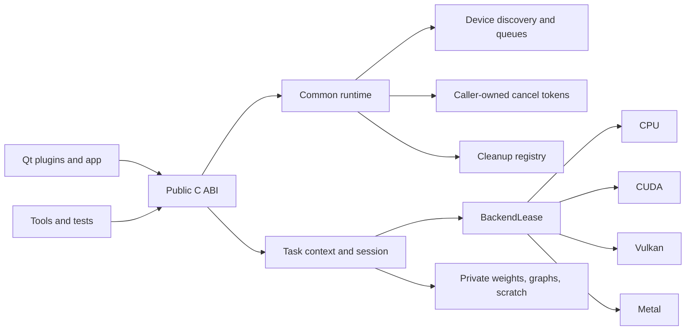
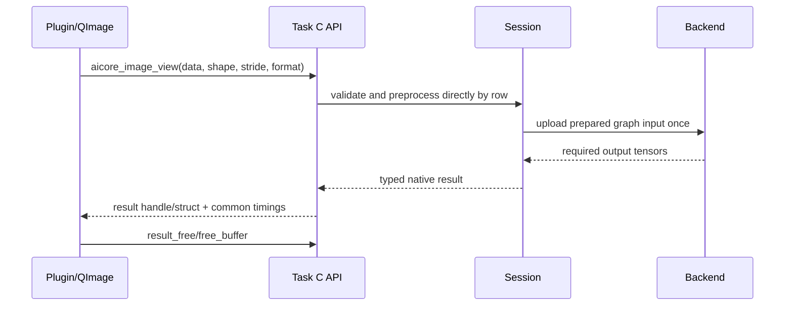

# AICore Architecture

## Scope

AICore is the process-local inference boundary shared by Qt plugins,
reconstruction code, tools, and bindings. It intentionally builds as one shared
library. Task-specific model state is isolated behind opaque C contexts while
device discovery, scheduling, cancellation, logging, backend leases, and
cleanup are common runtime services.

## Runtime Topology



The public C ABI is the stable boundary. ggml headers, targets, backend handles,
and patch-specific operators are private to AICore.

## Ownership Model

| Object | Owner | Lifetime rule |
|---|---|---|
| Options | Caller | Create, set, pass to load, free; setters are NULL-safe |
| Task context | Caller | One model/session owner; free after all synchronous calls complete |
| Input image view | Caller | Borrowed for the duration of one synchronous inference call |
| Typed result | Task ABI | Release with the result/task function documented by that header |
| BackendLease | Context/session | Shared physical backend handle; reference counted |
| Graph/allocator/scratch | Context/session | Never process-global mutable model state |
| Cancel token | Worker/caller | Independent request scope; bind only on the inference thread |
| Runtime cleanup registry | Process runtime | Purges inactive resources, never live contexts |

Compatibility wrappers may allocate temporary result text or packed RGB, but
they call into the typed implementation and are not used by plugin frame paths.

## In-Memory Image Flow

For tasks that consume decoded images, the preferred path is:



`aicore_image_view` supports RGB8, RGBA8, GRAY8, BGR8, and BGRA8. The row
stride is part of the contract because QImage, camera frames, and decoded video
planes are not necessarily tightly packed. Unsupported or premultiplied QImage
formats are converted once at the plugin boundary; representable formats are
borrowed directly.

The hot path must not contain:

- image save/reload or temporary filesystem staging;
- JSON serialization followed by plugin parsing;
- packed RGB scratch before another CHW conversion;
- encoded PNG/JPEG handoffs;
- full-resolution mask materialization before detection filtering.

JSON and encoded images remain supported for model metadata, persistence,
backward-compatible APIs, DB metadata, and explicit export.

## Result and Timing Contracts

Each task owns the semantic layout of its typed result. A universal result
variant would erase useful type information and add dispatch complexity, so the
common layer standardizes ownership/error/timing instead of payload shape.

Every pipeline exposes `aicore_pipeline_timings` where applicable. Fields have
one meaning across tasks:

| Field | Boundary |
|---|---|
| `preprocess_ms` | API validation through graph-input preparation |
| `inference_ms` | upload, backend graph execution, synchronization, required readback |
| `postprocess_ms` | typed native result construction |
| `serialization_ms` | optional compatibility encoding/serialization |
| `e2e_ms` | API entry until native result is ready |

`valid_fields` is mandatory: a zero without a valid bit means unavailable, not
instantaneous. Plugin queue, thread-hop, video decode, render, and display time
are outer measurements and must not be mixed with AICore E2E.

## Runtime Lifecycle

Per-task `aicore_<task>_shutdown()` functions are ABI-compatible delegates to
`aicore_runtime_shutdown()`. The common call is idempotent and may purge
inactive backend leases and registered task caches. It does not free live task
contexts or unload backends still referenced by them.

Long-running workers use:

1. one caller-owned cancel token;
2. one queue for the resolved physical device;
3. a task context kept on the worker thread;
4. cooperative cancellation between graph/batch boundaries;
5. generation checks before publishing results.

The legacy process cancel token and global inference lock remain compatibility
APIs. New workers use task-owned tokens and device queues.

## Cache and GPU Graph Safety

Caches are context-owned or keyed by explicit ownership identity. A valid key
includes all state that changes compatibility: resolved backend/device, tensor
shape and type, model/weight identity, graph-affecting options, and session
generation where backend plans may outlive an allocator.

Context teardown invalidates only entries associated with its weights/owner.
Clearing a process-global cache from one context can corrupt another live
context and is forbidden.

Cached graph execution follows this order:

```text
construct graph
  -> allocate/bind graph buffers
  -> upload current input
  -> execute that same bound graph
  -> read required outputs
```

Rebinding after input upload can invalidate or clear input storage. GPU tests
therefore require repeated forwards and context destroy/recreate, not a single
successful call.

## Backend and Configuration Policy

Platform Auto order is:

- Linux/Windows with CUDA built: CUDA, Vulkan, CPU;
- Linux/Windows without CUDA: Vulkan, CPU;
- macOS: Metal, CPU.

Capabilities describe a resolved device, not per-model numerical support.
Model/backend parity remains the acceptance gate.

Task behavior is explicit in options. Task modules do not read or write process
environment variables for flow control. The only centralized exceptions are
the deployment data-root reader and the ggml environment bridge needed before
backend construction.

## ggml Integration

ggml is an ExternalProject and private dependency. The pinned version and
archive digest live in `3rdparty/ggml/ggml.cmake`; downstream modifications are
the ordered patches in `3rdparty/ggml/patches/manifest.yaml`.

Extracted `build*/ggml/` source trees are disposable. A patch must be generated
against the fully replayed preceding chain, cleanly replayed by CMake, and
validated against all affected pipelines. Adding an operator must not silently
change an existing task's default numerical path.

## Plugin Execution Model

Still-image workers pass decoded storage through image view and convert the
typed result into annotations or DB entities after inference.

Live workers allow one running frame and at most one latest pending frame.
Results carry source generation and are dropped after seek, source/model
change, stop, or teardown. Consumer-driven video releases the next frame on
every completion path, including failure/cancellation/stale results.

This bounds memory, avoids unbounded queued image copies, and keeps overlays
attached to the frame that produced them.

## Known Validation Boundary

The contracts above are implemented across the current task set, but validation
coverage is evidence-dependent:

- contract tests prove ABI, ownership, stride, timing, and lifecycle behavior;
- backend parity proves agreement with a selected reference backend;
- upstream-framework comparison is required to prove model truth;
- a complete claim requires every requested model, quantization, backend, and
  platform row with real assets;
- Linux CUDA/Vulkan results do not prove Windows Vulkan or macOS Metal.

See [`../tests/TESTING.md`](../tests/TESTING.md) for the acceptance ladder and
the complete matrix runner.

## Edit Guide

| Change | Primary owner |
|---|---|
| Common image format/validation | `include/aicore/image_view.h`, `src/common/capi_utils.*`, common contract tests |
| Timing meaning | `include/aicore/pipeline_timing.h`, every task C API, timing contract test |
| Cancellation/cleanup/queues | `include/aicore/runtime_capi.h`, `src/common/runtime_capi.cpp` |
| Backend discovery/leases | `include/aicore/backend_capi.h`, `src/common/ggml_backend_*` |
| New or changed task ABI | `include/aicore/<task>_capi.h`, `src/tasks/<task>/capi.cpp`, task contract tests |
| Plugin hot path | Plugin worker plus the task's typed image/result API |
| ggml implementation | Ordered patch manifest plus AICore glue and cross-task parity tests |
