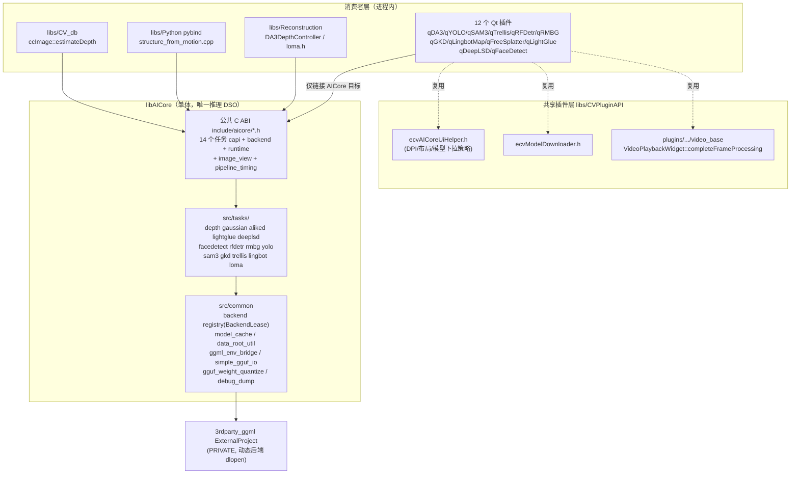

# AICore 架构审查与优化实施文档

| 项 | 内容 |
|---|---|
| 日期 | 2026-09-17 |
| 审查基线 | 仓库 HEAD `652251d339c750bb19b08bb2efc7ad0d830e9c79`，工作区干净 |
| 审查范围 | `core/AICore/`（公共 ABI、runtime、14 个任务模块）、直接依赖 AICore 的插件（12 个）、共享插件层（`libs/CVPluginAPI`、`libs/CV_db`、`libs/Reconstruction`、`libs/Python`） |
| 方法 | 只读静态审查：公共头 ↔ 实现 ↔ 消费者 ↔ 测试 ↔ CMake 交叉取证；辅以 ONNX Runtime / OpenVINO / NVIDIA Triton / ggml(llama.cpp) 官方公开资料对照 |
| 交付性质 | 仅评估与实施建议文档，本文档不附带任何实现代码改动 |
| 证据标注 | 每条 finding 给出 repo 相对路径 + 符号 + 行号（基于上述 HEAD，行号会随代码漂移）；置信度标注 high / medium / low |
| 语言/受众 | 中文，面向本仓库维护者的内部评审交付物；本档为一次性审查快照，不作为长期规范来源（规范以 AICore skill 与源码为准）；如需上游归档建议另出英文摘要版 |
| 实施状态 | Phase 0/1 全部完成；Phase 2：P2-1 ✅、P2-2 ✅、P2-4 ✅、**P2-1b ✅**（facedetect 实为撞名误判而非注册表绕过，F-02 勘误：`fd::BackendLease→fd::EngineLease` 重命名，facedetect 测试 6/6 Passed）、GKD 位级断言 ✅、CUDA 注入通用化 ✅ 并同步到 validate-all runner。**一键数值门禁首跑完成**：107 场景（f16/q8/f32 × 多任务）、verdict FAIL → 归因修复后 104 PASS + depth/gaussian 已修验 PASS + trellis UNSTABLE 已修（probe 自门禁+runner stability_only+manifest 9 场景，46/46 runner 测试，端到端复验中）；P2-1/P2-2 数值证据成立（sam3/trellis 全部场景 rc=0，sam3 mask_iou=0.999）。P2-3（make_sched/GGUF 壳提升）待实施；Phase 3（F-01）待启动。插件体验修复：GKD 三类 per-run 控制台刷屏（weights buffer / session ready / per-ROI breakdown）`GKD_LOG_INFO`→`GKD_LOG_DEBUG`（默认 Info 级静默，诊断经 `aicore_gkd_options_set_log_level` 打开；直跑验证三类行归零、契约 Passed） |

---

## 1. 执行摘要：对用户六个问题的逐项回答

| # | 用户问题 | 结论 | 一句话依据 |
|---|---|---|---|
| 1 | 架构设计是否合理？ | **合理（Yes）** | 单体 `libAICore` + 纯 C ABI + 借入式 `aicore_image_view` + 类型化结果 + 统一 timing/runtime 契约，边界清晰且与进程内桌面推理场景匹配（§3、§8） |
| 2 | 是否统一接口？ | **基本统一（Yes，存在 3 处收口点）** | 14 个任务全部具备 `abi_version/options/is_ready/last_error/timings/shutdown` 生命周期；但 `aicore_image_view` 内存输入仅 7/14 任务采用、`struct_size` 版本协商仅 2 处、`aicore_model_kind` 仅覆盖 8/14 任务（§4、F-01/F-04/F-05） |
| 3 | 是否存在重复造轮子？ | **存在，但为"结构性样板"级别，非"核心能力重复"（Partial）** | `DeviceTaskGuard` 复制 10 份、worker 脚手架 ≥9 份、`ggml_backend_sched_new` 回退模式 6 份、GGUF 装载直呼 `gguf_init_from_file` 12+ 处；核心能力（BackendLease、模型缓存、下载、校验）已收敛（§5、F-02/F-03/F-06/F-07） |
| 4 | 是否尽可能复用？ | **核心层复用好，插件层复用不彻底（Partial）** | 核心内 `acquire_backend_lease`/`gguf_weight_quantize`/`asset_digests`/校验阶梯复用充分；插件侧已有 `ecvModelDownloader`/`ecvAICoreUiHelper`/`video_base` 共享件，但 RAII 运行时助手缺失导致每插件复制（§5、F-03） |
| 5 | 依赖 AICore 的插件是否复用？ | **大部分复用（Yes，2 个例外 + 1 类样板）** | 12 个插件全部只链接 `AICore` 目标、只包含 `aicore/*` 公共头，ggml 保持 PRIVATE；例外：sam3/trellis 任务侧绕过共享 BackendLease 注册表；插件侧 `DeviceTaskGuard`/`releaseContextOnMainThread`/QImage 适配器逐插件复制（§5.3、F-02/F-03） |
| 6 | 是否业内/全网最佳架构设计？ | **无法客观证明"最佳"；在同类进程内桌面场景属第一梯队设计（Yes with caveat）** | "全网最佳"没有可证伪定义；与 ONNX Runtime C API / OpenVINO / Triton / ggml 官方模式对照，本项目设计与前两者同构、比 Triton 轻量（Triton 是服务端场景，不适用）、与 ggml 后端注册表方向一致；差距集中在演进机制（结构体版本化）而非架构形态（§8） |

**总体判断**：这是一套健康、可演进的架构。问题清单里没有"推倒重来"级缺陷，全部 finding 都可以增量收敛；最大的两个实际收益点是 **F-03（插件层运行时助手收敛）** 与 **F-02（sam3/trellis 接入共享 BackendLease）**。

---

## 2. 审查限制（先读这一节）

1. 本次为静态审查：**未执行构建、未运行 ctest、未跑 `aicore-validate-all`、未做 GPU 实测**。所有"测试存在"仅证明基础设施在位，不证明当前全绿。
2. §6 的 F-12（qYOLO live 路径 RGB8 通道序疑点）已在复核中核验排除：调用侧在进入适配器前显式转换为 `Format_RGB888`（`qYOLO/src/YOLOWorker.cpp:49-70`、`YOLOLiveWidget.cpp:419-422`）；Phase 1 共享适配器仍应内置格式守卫，避免该前置条件依赖调用侧自觉。
3. F-01 中 7 个任务"缺少 image_view 入口"基于头文件全文检索（0 命中，置信度 high），但这些任务的**实际输入形态**（路径 / 编码图像 / 张量）未逐一实现验证，迁移方案需按任务逐个确认。
4. 本文不回答"哪个推理框架更好"这类不可证伪问题；§8 只做模式对照与适配性判断。

---

## 3. 当前架构概览（证据版）

### 3.1 分层与边界（L3 视图，当前态）



### 3.2 已确认的架构优点（应保持，不是待办）

| 优点 | 证据 |
|---|---|
| 单体 `libAICore`，ggml 完全 PRIVATE，插件零 ggml 依赖 | `core/AICore/CMakeLists.txt:17-19`；`plugins/core/Standard/qLingbotMap/CMakeLists.txt:25-26` 注释明确 "ggml is PRIVATE inside AICore"；12 个插件 `target_link_libraries(... AICore)` |
| 公共头不泄漏 ggml/gguf，有 CMake 级强制检查 | `core/AICore/cmake/CheckPublicHeaders.cmake:11-14`（含 ggml/gguf include 即 FATAL_ERROR） |
| 导出符号白名单（version script），测试符号不进生产 DSO | `core/AICore/cmake/aicore.exports.map:1-7`（仅 `aicore_*` + ImageDepth C++ 符号） |
| 统一 runtime 契约：合作式 cancel token + 线程绑定 scope + 设备级任务锁；旧全局锁/全局 cancel 已标注 deprecated | `include/aicore/runtime_capi.h:43-108`（`AICORE_LEGACY_API` 弃用属性，:31-41） |
| 统一后端抽象：设备枚举/能力/准入查询/预热/末次错误，单一 ABI 版本宏 | `include/aicore/backend_capi.h:76-126`（`AICORE_BACKEND_ABI_VERSION 2`） |
| 共享 BackendLease 注册表（weak_ptr 复用物理后端句柄） | `src/common/ggml_backend_registry.cpp:27,119-144`；11 个任务调用 `acquire_backend_lease`（§5.2 表） |
| 统一图像输入视图（借入 + row_stride + 5 种通道序） | `include/aicore/image_view.h:19-34` |
| 统一 timing 契约（5 阶段 + `valid_fields` 诚实位） | `include/aicore/pipeline_timing.h:12-44` |
| 环境变量收口：仅数据根读取 + 集中 env bridge + 显式豁免清单 | `src/common/ggml_env_bridge.cpp:28-102`、`data_root_util.cpp:18`、`debug_dump.cpp:18-25`；门禁 `tests/check_no_env_getenv.sh` |
| C-API 覆盖率审计（目标 ≥95%，消费者=tests/tools/plugins/libs） | `tests/check_capi_coverage.py:24-32` |
| 测试分 Tier（fast/model/capi）+ exit 77 skip 语义 + Qt 运行时隔离 | `tests/CMakeLists.txt:1-6,64-71,74-88` |
| 资产目录单源：SHA-256 集中在 `asset_digests.h`，一键校验门禁 + 分层 validation manifest | `include/aicore/asset_digests.h`；`scripts/validation_manifest.json`；AGENTS.md §Testing |
| 插件侧已有三件共享基建：UI 助手、模型下载器、视频基座（consumer-driven completion） | `libs/CVPluginAPI/include/ecvAICoreUiHelper.h:8-14`、`ecvModelDownloader.h`（106 行）、`plugins/core/Standard/video_base/VideoPlaybackWidget.h:77,162` |
| DB 实体直接集成（ccImage 深度估计带 cancel token） | `libs/CV_db/src/ecvImage.cpp:216-268` |

---

## 4. 接口统一矩阵（14 个任务 × 生命周期要素）

证据：对 `core/AICore/include/aicore/*_capi.h` 全量函数检索（每格均有 file:line 可查，行号见 §12 ledger）。

| 任务 | abi_version | options_new/free | load_opts | is_ready | last_error | timings | shutdown | image_view 输入 | 类型化 result | 备注 |
|---|---|---|---|---|---|---|---|---|---|---|
| depth | ✔(v8) | ✔ | ✔(+nested) | ✔ | ✔ | ✔ | ✔ | ✔ | ✔（dense/multiview 结果体 + 专用 free） | 兼容 path/JSON API 均保留为薄包装，示范级实现 |
| yolo | ✔ | ✔ | ✔ | ✔ | ✔ | ✔ | ✔ | ✔（9 处） | ✔（detect/seg/pose/obb/cls/depth-json） | 带 role 化模型目录 API |
| rmbg | ✔ | ✔ | ✔ | ✔ | ✔ | ✔ | ✔ | ✔ | ✔ | — |
| facedetect | ✔ | ✔ | ✔ | ✔ | ✔ | ✔ | ✔ | ✔（含双图 compare） | ✔ | — |
| gkd | ✔ | ✔ | ✔ | ✔ | ✔ | ✔ | ✔ | ✔ | ✔（request 结构带 `struct_size`） | 唯二做结构体版本协商者之一 |
| rfdetr | ✔ | ✔ | ✔ | ✔ | ✔ | ✔ | ✔ | ✔ | ✔ | — |
| lingbot | ✔ | ✔ | ✔ | ✔ | ✔ | ✔ | ✔ | ✔（preprocess_image） | ✔（含 skyseg 子目录） | — |
| aliked | ✔ | ✔ | ✔ | ✔ | ✔ | ✔ | ✔ | ✘ | ✔ | CUDA/Vulkan 专用算子目录并存（属实现分层，非接口问题） |
| lightglue | ✔ | ✔ | ✔ | ✔ | ✔ | ✔ | ✔ | ✘ | ✔ | 双图特征匹配 |
| deeplsd | ✔ | ✔ | ✔ | ✔ | ✔ | ✔ | ✔ | ✘ | ✔ | 复用共享 `simple_gguf_io`（正面样板） |
| loma | ✔ | ✔（detector/descriptor/matcher 三组） | ✔ | ✔（×3） | ✔ | **仅 matcher**（F-10） | ✔ | ✘ | ✔ | — |
| sam3 | ✔ | ✔ | ✔ | ✔ | ✔ | ✔（+tracker） | ✔ | ✘（F-01） | ✔ | 未见 `acquire_backend_lease`（F-02） |
| trellis | ✔ | ✔ | ✔ | ✔ | ✔ | ✔ | ✔ | ✘（F-01） | ✔ | 未见 `acquire_backend_lease`（F-02）；模型目录单源合规 |
| gaussian | ✔ | ✔ | ✔ | ✔ | ✔ | ✔ | ✔ | ✘（F-01） | ✔ | — |

**结论**：生命周期骨架统一度高（14/14）；不统一的只有三处——**内存图像输入覆盖面（F-01）**、**结构体版本协商（F-04）**、**loma 检测/描述子缺 timing（F-10）**。

---

## 5. 复用与重复造轮子盘点

### 5.1 核心内已收敛的能力（继续沿用，勿重复实现）

| 能力 | 唯一实现 | 已复用者 |
|---|---|---|
| 物理后端句柄共享 / 设备解析 | `src/common/ggml_backend_registry.cpp`（`BackendLease`/`acquire_backend_lease`） | depth、gaussian、aliked、facedetect、yolo、gkd、rfdetr、rmbg、lingbot、deeplsd、lightglue（11/14） |
| GGUF 权重量化 | `src/common/gguf_weight_quantize.cpp` | quantize 工具链 |
| 简单 f32 GGUF 装载 | `src/common/simple_gguf_io.cpp` | deeplsd（仅此一个任务采用 → F-06） |
| 模型资产指纹 | `include/aicore/asset_digests.h` | 目录校验 / 一键门禁 / `test_catalog_dump_urls` |
| 数据根解析 | `src/common/data_root_util.cpp` | 全体任务 |
| 环境桥接 | `src/common/ggml_env_bridge.cpp` | ggml 后端配置 |
| 插件模型下载 | `libs/CVPluginAPI/include/ecvModelDownloader.h` | qDA3/qYOLO/qSAM3/qGKD/qTrellis/qLingbotMap/qRFDetr/qDeepLSD/qFaceDetect/qLightGlue |
| 插件 UI 规范 | `libs/CVPluginAPI/include/ecvAICoreUiHelper.h` | ≥10 个对话框（含设备/线程行、模型下拉默认策略、下载进度段） |
| 视频帧完成契约 | `plugins/core/Standard/video_base/VideoPlaybackWidget.cpp:469` | qSAM3 VideoTab 等视频消费者 |

### 5.2 重复实现热点（可收敛）

| # | 重复物 | 副本数 | 证据（每份一处代表行） | 收敛建议 |
|---|---|---|---|---|
| R-1 | `class DeviceTaskGuard`（对 `aicore_device_task_lock/unlock` 的 RAII 包装）逐字复制 | **10** | `qGKD/src/GKDWorker.cpp:33-44`、`qYOLO/src/YOLOWorker.cpp:34`、`qYOLO/src/YOLOLiveInferWorker.cpp:26`、`qRFDetr/src/RFDetrWorker.cpp:57`、`qRFDetr/src/RFDetrLiveInferWorker.cpp:25`、`qRMBG/src/RMBGWorker.cpp:30`、`qRMBG/src/RMBGLiveInferWorker.cpp:22`、`qSAM3/src/SAM3Worker.cpp:32`、`qSAM3/src/VideoWorker.cpp:25`、`qTrellis/src/TrellisWorker.cpp:36` | Qt-free RAII → AICore `include/aicore/runtime_raii.h`（header-only inline）；见 §7 Phase 1 归属决策 |
| R-2 | worker 脚手架：`releaseContextOnMainThread()` + pending ctx 暂存 + cancel token 生命周期 | 8 | `qDA3/src/DA3Worker.cpp:154-172`、`qYOLO/src/YOLOWorker.cpp:108,117`、`qGKD/src/GKDWorker.cpp:110,119`、`qRMBG/src/RMBGWorker.cpp:67,76`、`qLingbotMap/src/LingbotMapWorker.cpp:148-150`、`qRFDetr/src/RFDetrWorker.cpp:81,90`、`qFaceDetect/src/FaceDetectWorker.cpp:53`、`qLightGlue/src/LightGlueWorker.cpp:34-44` | Qt 形态脚手架 → CVPluginAPI 助手头；token RAII 部分随 AICore `runtime_raii.h`（F-03） |
| R-3 | `ggml_backend_sched_new` + "falling back to CPU-only" 回退模式 | 6 | `tasks/yolo/backend.cpp:100-106`、`tasks/gkd/gkd_backend.cpp:100-106`（两处错误串逐字相同）、`tasks/rfdetr/backend.cpp:101-107`、`tasks/facedetect/backend.cpp:397`、`tasks/aliked/backend.cpp:122`、`tasks/depth/backend.cpp:430` | 共享 `make_sched(leases…)`（F-07） |
| R-4 | GGUF 装载直呼 `gguf_init_from_file`（各自错误处理/元数据读取） | 12+ 文件 | `tasks/depth/model_loader.cpp:118`、`tasks/yolo/yolo_gguf_loader.cpp:81,98`、`tasks/yolo/capi.cpp:182,496`、`tasks/yolo/yolo_graph.cpp:1633`、`tasks/yolo/yolo_mclip_text_graph.cpp:375`、`tasks/yolo/model_catalog.cpp:473`、`tasks/sam3/sam3.cpp:3164,12579`、`tasks/trellis/trellis2.cpp:347,1087`、`tasks/lingbot/lingbot_gguf_loader.cpp:20`、`tasks/lingbot/lingbot_skyseg.cpp:169`、`tasks/gkd/gkd_gguf_loader.cpp:179`、`tasks/rmbg/model_loader.cpp:141`、`tasks/facedetect/model_loader.cpp:163`、`tasks/loma/detector.cpp:51`、`tasks/loma/descriptor.cpp:38`、`tasks/loma/quantize.cpp:102,262`、`tasks/lightglue/matcher.cpp:103` | 收敛"元数据/错误/校验"壳，**不**强行统一张量布局（F-06） |
| R-5 | 模型目录 API 样板（`model_count/model_at/default_index/by_filename`） | 5 任务 | `yolo_capi.h:321-363`、`lingbot_capi.h:221-244`、`gkd_capi.h:241-260`、`sam3_capi.h:316-333`、`trellis_capi.h:428+` | **接受**：条目结构任务特化是合理的；仅在实现侧抽公共缓存/校验核（F-08） |
| R-6 | QImage → `aicore_image_view` 适配器散落在插件匿名命名空间 | ≥1 确认 | `qYOLO/src/YOLOLiveInferWorker.cpp:39-44` | → CVPluginAPI 共享适配器（Qt 形态归属；F-03/F-12） |

### 5.3 未复用共享能力的例外（要收口）

- **sam3**：自带设备发现 `sam3_find_dev_by_name` + `ggml_backend_dev_count/get/by_type` + 全局 `g_sam3_backend = ggml_backend_dev_init(...)`（`src/tasks/sam3/sam3.cpp:1110-1195`），绕过 `acquire_backend_lease`。
- **trellis**：两处直接枚举 `ggml_backend_dev_*`（`src/tasks/trellis/trellis2.cpp:310-327`、`src/tasks/trellis/aicore_trellis_capi.cpp:742-754`），未走注册表。
- **facedetect**：存在**本地独立**的 `BackendLease` 实现（自有 `BackendLease::State` + 互斥锁，`src/tasks/facedetect/backend.cpp:650-668`），与同一文件内对 runtime 注册表的调用（`backend.cpp:235,245`）并存：`capi.cpp:230` 走本地 `fd::acquire_backend_lease`，backend 路径走 `aicore::runtime::acquire_backend_lease`。这不是薄包裹，而是与共享注册表重复的租约实现，应在 Phase 2 一并收口（P2-1b）。
- 插件侧：R-1/R-2/R-6（见上表）。

> 注：`sam3.cpp` 是上万行的上游移植文件，收口策略必须是"最小接触面"（只在取后端的一点接入注册表），不做大面积重写。

---

## 6. Findings 清单（按优先级）

严重度定义：**P0** = 阻塞正确性/发布；**P1** = 显著维护成本或行为不一致，应排期；**P2** = 一致性/演进性债务，随改随收；**P3** = 卫生问题。

| ID | 优先级 | 类别 | 描述与证据 | 影响 | 置信度 |
|---|---|---|---|---|---|
| F-01 | **P1** | 接口统一 | 内存图像输入 `aicore_image_view` 仅 7/14 任务采用；sam3/trellis/gaussian/aliked/lightglue/deeplsd/loma 头文件中 0 处使用（§4 矩阵检索） | 图像类任务出现两套输入形态（路径 vs 内存），插件被迫读写临时文件或重复实现解码/格式转换，违背契约第 4 节"热路径无文件往返"的精神 | high（缺 API 是事实）/ medium（各任务输入形态需逐一确认） |
| F-02 | **已关闭（含一次勘误）** | 运行时复用 | 初判三处未走共享注册表。实况勘误：sam3（`sam3.cpp`）与 trellis（`trellis2.cpp` 6 对 init/free）确为绕过，已收口为 `acquire_backend_lease`/`adopt_backend_lease`（P2-1/P2-2 ✅）；**facedetect 是撞名误判**——`fd::BackendLease` 是任务级引擎会话租约（每个 ctx 独享图缓存），其内部 Backend 本就通过 runtime 注册表持有全部物理句柄（GPU `adopt_backend_lease` backend.cpp:207、CPU `acquire_backend_lease` :235/:245、锁 `lock_backend_leases` :294），物理层完全合规。修复：重命名 `fd::BackendLease→fd::EngineLease`、`fd::acquire_backend_lease→fd::acquire_engine_lease`（backend.hpp/backend.cpp/capi.cpp，含 2 处既存缩进瑕疵修正），"BackendLease"在 AICore 内现仅指 runtime 注册表租约 | 物理句柄生命周期全由注册表管理；命名唯一化后未来审计不再误读 | high（残留 grep 14 处全为 `aicore::runtime::` 限定名） |
| F-03 | **P1** | 插件层复用 | `DeviceTaskGuard` ×10、worker 脚手架 ×8、QImage 适配器散落（R-1/R-2/R-6）；`CVPluginAPI` 只有 UI/下载助手，无运行时助手（归属裁决：Qt-free RAII → AICore `runtime_raii.h`，Qt 形态 → CVPluginAPI，见 §7 Phase 1 决策记录） | 每新增一个 AICore 插件要复制 ~100 行样板；行为漂移风险（例如某份副本忘了 `isLocked()` 检查） | high |
| F-04 | **P2** | ABI 演进机制 | `struct_size`+`abi_version` 结构协商仅 2 处：`backend_capi.h:66-67`、`gkd_capi.h:94`；其余任务的 result/request 结构体无版本字段，仅靠每任务 `abi_version()` 函数整体版本化 | 未来向任一 result 追加字段都会破坏旧消费者；ONNX Runtime 用版本化 API 表、OpenVINO 用对象属性接口解决了同类问题（§8） | high |
| F-05 | **已关闭** | 接口一致性 | `aicore_model_kind` 原覆盖 8/14 任务（实际缺失 6 个：sam3/trellis/yolo/gkd/lingbot/loma；初判把已在枚举中的 aliked/lightglue/deeplsd 误列入缺失，实施时勘误）。实施补入枚举值 9–14 + `FillModelDeviceInfo` 逐任务分支（工作集估计沿用既有推理式注释风格），`AICORE_BACKEND_ABI_VERSION` 2→3（同步点天然版本无关：契约测试用 `>=` 宏比较、checker 脚本解析头文件宏，零额外同步编辑） | 新任务可用统一 `aicore_model_device_info_query` 做内存准入预判；新增估计值待实测精化 | high（构建 0 错 + 5/5 契约测试 Passed + 版本解析 3 ✓） |
| F-06 | **P2** | 重复实现 | GGUF 装载壳未收敛：共享 `simple_gguf_io` 仅 deeplsd 采用；12+ 处直呼 `gguf_init_from_file`（R-4） | 元数据键访问、错误上报、越界检查各写各的；新任务继续复制 | high |
| F-07 | **P2** | 重复实现 | `ggml_backend_sched_new` + CPU 回退样板 ×6（R-3），两处错误串逐字相同 | 回退策略（何时回退、日志级别）易漂移 | high |
| F-08 | **P2** | 目录/资产 | 模型目录 API 样板 ×5 任务（R-5）；Trellis 已做到"catalog 单源 + RMBG 经共享缓存 API 获取"（`trellis/model_catalog.cpp` + `rmbg/model_loader.cpp:9-72`），其他任务未审计同等约束 | 若某任务出现第二张模型表或私有下载逻辑，会破坏一键门禁的覆盖审计 | medium |
| F-09 | **已关闭** | 卫生 | 伞头缺 6 个 include；实施时补入 5 个（image_view/pipeline_timing/runtime_capi/runtime_raii/yolo；lingbot 由并行会话补入）。`inference_log.h` 经构建门禁验证**不得入伞头**——它依赖 `<CVLog.h>`（libs 层日志），会击穿未链接 CVLog 的精简契约测试 TU（`test_image_depth`/`test_loma_capi_contract` 编译失败实证），已在伞头注释固化例外 | 伞头承诺完整；例外原因已文档化 | high（含构建实证） |
| F-10 | **P3** | 接口统一 | loma 仅 matcher 有 `last_pipeline_timings`（`loma_capi.h:185`），detector/descriptor 缺失 | timing 契约在 loma 内不自洽，性能面板对 loma 部分阶段不可见 | high |
| F-11 | **P3** | ABI 边界 | `depth_image.h` 是公共头中唯一的 C++/Qt 助手（`QImage/QString` 进公共 ABI 面），导出表也放行了它的 mangled 符号（`aicore.exports.map:4`） | 作为 DB 集成兼容层目前是自洽的（`ecvImage.cpp:233-239` 依赖它），但开了"公共头可带 Qt"的口子；新任务跟随会扩大 ABI 面 | high |
| F-12 | 已结题 | 正确性疑点 | `qYOLO/src/YOLOLiveInferWorker.cpp:39-44` 适配器直接把 QImage 标为 `AICORE_IMAGE_RGB8`；复核确认调用侧在进入适配器前已显式转换为 `Format_RGB888`（`YOLOWorker.cpp:49-70`、`YOLOLiveWidget.cpp:419-422`），通道序正确 | 无缺陷；结论固化方式 = Phase 1 共享适配器内置格式守卫，避免该前置条件依赖调用侧自觉 | high（复核） |

---

## 7. 优化实施计划（分阶段、可回滚、不实现）

> 通用原则：
> 1. **ABI 只增不破**：新增入口/字段走 `abi_version` 递增 + 契约测试更新；旧符号一律保留为 deprecated 薄包装（现有 depth 的 path/JSON 兼容层就是范本）。
> 2. **每个阶段独立可合并、独立可回滚**；唯一依赖：Phase 1 的共享适配器替换以 F-12 验证结论为前置（复核中已完成核验、疑点排除，见 §2），其余阶段间无强依赖。
> 3. **数值门禁前置**：凡触及推理路径的改动，按 `.agents/skills/acloudviewer-aicore-plugin/SKILL.md` §10 跑默认档 `aicore-validate-all`（受影响后端），行为等价用固定输入的 CPU 参考对比证明。

### Phase 0 —— 护栏与零风险卫生（规模 S，1~2 天）

**目标**：把"不改行为"的欠账清掉，为后续阶段建立基线。

| 事项 | 对应 | 内容 |
|---|---|---|
| P0-1 | F-09 | 补全 `aicore.h` 伞头 include 列表（`yolo_capi.h`、`lingbot_capi.h`、`runtime_capi.h`、`image_view.h`、`pipeline_timing.h`、`inference_log.h`） |
| P0-2 | F-12 | 写一个最小验证（仅插件本地，或打印日志确认）确定 live 路径 QImage 格式；若确认存在通道序问题 → 走 Phase 1 的共享适配器一并修复；若不存在 → 在适配器处加注释固化前置条件 |
| P0-3 | F-08 | 对其余任务目录做一次 trellis 式审计：确认没有第二张模型表、没有插件私有下载/解压状态机（插件已统一走 `ecvModelDownloader`，重点查任务侧） |
| P0-4 | 文档 | 在 `core/AICore/docs/ARCHITECTURE.md` 增补"公共头新增结构体必须带 struct_size/abi_version"的规范条目（配合 F-04 的新增面约束） |

**验收**：
```bash
cmake --build build_app --target AICore -j4
cmake --build build_app --target aicore-contract-tests -j4
ctest --test-dir build_app -L capi --output-on-failure -j1
python3 core/AICore/tests/check_capi_coverage.py
```
**回滚**：纯头文件 include 与文档，单 commit revert 即可。

### Phase 1 —— 运行时助手收敛：AICore Qt-free RAII 头 + CVPluginAPI Qt 助手（规模 M，2~4 天，零导出表变更）

**目标**：消灭 R-1/R-2/R-6 三类复制；这是本计划中**性价比最高**的一步。

> **归属决策记录（回应"提升到 CVPluginAPI 还是 AICore"）**：
> - **按依赖形态拆分，不按模块偏好二选一**：①包装 AICore C API 原语、**无 Qt**、全体消费者（插件/reconstruction/tests/Python）可用的 RAII → **AICore 公共 C++ 头**（header-only inline，零导出表变更）；②**Qt/线程/UI 形态**（QImage 适配、QThread 主线程释放、下载、UI 控件）→ **CVPluginAPI**；③推理路径内部设施（make_sched、GGUF 装载壳、目录校验核）→ **AICore `src/common` 私有**（即 Phase 2，本就全部落在 AICore）。
> - **不把 Qt 助手放进 AICore 的理由**：①契约方向——skill §2 要求公共 C ABI 不带 Qt，F-11 已建议把 `depth_image.h` 冻结为唯一 Qt 例外，不应再造第二个；②AICore 存在非 Qt 消费者（`libs/Python` pybind 链接 AICore），Qt 头扩大其编译面；③仓库既有约定——`ecvAICoreUiHelper`/`ecvModelDownloader`/`ecvAssetIntegrity` 全在 CVPluginAPI，skill §8 明确把 UI/插件细节隔离在插件层规则；④演进节奏解耦（Qt5/6 与插件 UI 迭代快于 ABI 节奏）。
> - **两个依赖先例使拆分零摩擦**：CVPluginAPI 已经 include AICore 公共头（`ecvAssetIntegrity.h:14` → `aicore/asset_digests.h`，include 路径已在 `CVPluginAPI/CMakeLists.txt:27` 接线）；AICore 已有 C++ 公共头类别（`aicore.h:22` AICORE_CXX_API，`depth_image.h` 先例）。业界同构：ONNX Runtime 在运行时发行 Qt-free 的 header-only `onnxruntime_cxx_api.h`（支持①）；llama.cpp/Triton 把 UI/client glue 留在消费侧（支持②）。

**改动点**（全部为新增 + 机械替换）：

1. **AICore 侧（Qt-free RAII，header-only inline）**：新增 `core/AICore/include/aicore/runtime_raii.h`（C++-only，`#if defined(__cplusplus)` 保护，纯 inline 包装 `runtime_capi.h` 原语，**零导出表变更**），提供：
   - `aicore::runtime::DeviceTaskLock`：替代 10 份 `DeviceTaskGuard`（构造持锁记录 `isLocked()`，析构 `aicore_device_task_unlock()`）；
   - `aicore::runtime::CancelScope`：RAII 绑定 `aicore_cancel_scope_begin/end`，持有 caller-owned token。
   该头加入 `aicore.h` 伞头（与 F-09 一并处理）；插件、reconstruction、测试等全部消费者可直接用。
2. **CVPluginAPI 侧（Qt 形态助手）**：新增 `libs/CVPluginAPI/include/ecvAICoreRuntimeHelpers.h`（与 `ecvAICoreUiHelper.h` 同级、同风格），提供：
   - `aicore_image_view ecvAICoreMakeImageView(const QImage&)`：集中处理 Qt5/6、little-endian `Format_ARGB32→BGRA8`、`Format_RGB888→RGB8`、`Format_Grayscale8→GRAY8`、非连续行 stride（对齐 skill §4 caller rules），**不满足前置条件时返回 `{data=nullptr}` 并由调用方走显式转换分支**；qYOLO 现状"调用侧先转 `Format_RGB888`"的做法（`YOLOWorker.cpp:49-70`）应下沉进该适配器统一；
   - `class ecvAICoreContextReleaseOnMain`（或自由函数）：封装"worker 线程产 ctx → 主线程释放"的 pending-ctx 暂存模式。
3. 10 个插件的 `DeviceTaskGuard`、8 个插件 worker 的 `releaseContextOnMainThread` 样板（qDA3/qYOLO/qGKD/qRMBG/qLingbotMap/qRFDetr/qFaceDetect/qLightGlue；qSAM3/qFreeSplatter 无此模式）、各插件本地 `imageView()` 适配器，机械替换为共享件。替换顺序建议：qGKD → qYOLO → qRFDetr → qRMBG → qTrellis → qLingbotMap → qDA3 → qFaceDetect → qLightGlue（每插件一个 commit）。

**兼容策略**：`runtime_raii.h` 为纯新增 header-only 公共头（无符号导出，`aicore.exports.map` 无需变更）；`ecvAICoreRuntimeHelpers.h` 只依赖 Qt + `aicore/runtime_capi.h` + `aicore/image_view.h`，且 CVPluginAPI 依赖 AICore 公共头已有先例（`ecvAssetIntegrity.h:14`）；不触碰任何 C ABI。

**验收**：
- 逐插件构建 + GUI 冒烟（静态图一次推理、live 一帧、取消一次）；
- `python3 core/AICore/tests/check_capi_coverage.py` 不回退；
- `grep -rn "class DeviceTaskGuard" plugins/` 归零；
- `bash core/AICore/tests/check_no_legacy_symbols.sh build_app/bin/libAICore.so core/AICore/include/aicore` 通过（证明 `runtime_raii.h` 纯 inline、导出表不变）；
- 参照 `CVPluginAPI/tests/test_ui_helpers.cpp` 先例，为 `runtime_raii.h`（可挂进 AICore 契约测试任一 TU 做 include 编译验证）与 `ecvAICoreRuntimeHelpers.h` 各补最小头测试；
- qYOLO live 路径切换共享适配器后，用一张已知类别样本回归通道序行为（F-12 已结题，属回归确认）；

**回滚**：每插件独立 commit；任一插件异常可单独 revert；共享头为纯新增，revert 无连锁。

### Phase 2 —— 核心运行时收口（规模 M，3~5 天，行为等价改造）

**目标**：F-02 / F-07 / F-05 / F-04 增量落地；每项独立成 commit，均带数值门禁。

| 事项 | 内容 | 兼容与验证 |
|---|---|---|
| P2-1（F-02 sam3） | 在 `sam3.cpp` **仅取后端点**接入 `aicore::runtime::acquire_backend_lease`：保留 `sam3_find_dev_by_name` 的设备名解析逻辑，但把最终 `ggml_backend_dev_init` 换成注册表租约；`g_sam3_backend` 全局改为租约持有 | 不重写图构建代码；验证：sam3 contract 测试 + 两次连续 forward + ctx 销毁重建（skill §7 不变量）+ 默认档 validate-all |
| P2-1b（F-02 facedetect） | 删除 `tasks/facedetect/backend.cpp:650-668` 的本地 `BackendLease::State`/`acquire_backend_lease` 实现，`capi.cpp:230` 改调 `aicore::runtime::acquire_backend_lease`；确认 `ScopedBackendBinding`（`backend.cpp:670-679`）语义迁移后一致 | facedetect 契约测试 + 两次 forward + 默认档 validate-all（facedetect 模型行） |
| P2-2（F-02 trellis） | `trellis2.cpp:310-327` 与 `aicore_trellis_capi.cpp:742-754` 的设备枚举/内存查询改走注册表暴露的设备信息（`aicore_device_count/at` + `aicore_model_device_info_query` 扩展后） | 同上验证路径；注意保留 trellis 目录单源约束不受影响 |
| P2-3（F-07） | `src/common` 新增 `make_sched(const BackendLease& cpu, const BackendLease* gpu, ...)` 小助手，6 个 backend.cpp 的创建+回退+日志收口；错误串统一为常量 | 行为等价：每个 backend 的 parity 测试不动即应全绿 |
| P2-4（F-05） | `aicore_model_kind` 枚举扩展到 14 任务（追加，不改已有值）；各任务实现 `model_device_info_query`；`AICORE_BACKEND_ABI_VERSION 2→3`，同步 `tests/depth/test_depth_capi_contract.cpp` 与 `util/check_aicore_runtime.py`（宏注释已指明同步点，`backend_capi.h:76-80`） | 新能力为增量；旧消费者不受影响；Python 绑定（`libs/Python/pybind/reconstruction/sfm/structure_from_motion.cpp:28-63`）顺带可见新条目 |
| P2-5（F-04） | 推行"新增公共结构体必须带 `struct_size`/`abi_version`"规范；对**近期仍在演进**的 result 结构（如 sam3/trellis/yolo 的大结果体）优先补字段并按各任务 `abi_version` 递增；老旧稳定结构可暂缓 | 契约测试逐任务更新；在 `CheckPublicHeaders.cmake` 之外可加一个轻量 grep 门禁（新头检查字段存在），作为 lint 性质建议项 |

**验收**：
```bash
bash core/AICore/tests/check_no_legacy_symbols.sh build_app/bin/libAICore.so core/AICore/include/aicore
bash core/AICore/tests/check_no_env_getenv.sh core/AICore/src
python3 core/AICore/tests/check_capi_coverage.py
# 涉及 sam3/trellis：默认档一键门禁（受影响后端）
cmake --build build_app --target aicore-validate-all -j1
```
**回滚**：P2-1/P2-1b/P2-2 涉及行为路径，各自独立 commit + 独立 revert；P2-3/P2-4/P2-5 为新增/枚举追加，风险低。

### Phase 3 —— 内存图像输入补全（规模 L，按任务分批，ABI 增量）

**目标**：F-01 收口——让 `aicore_image_view` 成为所有图像输入任务的统一入口。

**实施顺序与形态**（每任务一个批次，先易后难）：

1. **aliked / lightglue / deeplsd / loma**：输入就是解码图像，纯增补 `*_image` 入口；现有路径 API 改为"读文件→组 view→调 image 入口"的薄包装（对齐 depth 已有实践，`depth_capi.h:109-114` 与 `:171-177` 的关系）。
2. **sam3**：确认其 C API 当前输入形态后增补（sam3 体量大，只加入口，不动内部）；注意与 tracker 子 API 的时序一致性。
3. **gaussian / trellis**：确认输入模态（多图/单图/编码）后增补对应 view 入口；若上游协议要求编码图，则内存入口接收 view 后在库内编码，路径 API 同样变薄包装。
4. loma detector/descriptor 的 `last_pipeline_timings`（F-10）随本阶段一并补齐。

**兼容策略**：只增函数；各任务 `abi_version` 递增；契约测试补"image 入口与 path 入口固定输入等价"断言（CPU 后端、固定种子）。

**验收**：
- 每任务：contract 测试 + path/image 等价断言 + 默认档 validate-all；
- `check_capi_coverage.py` 覆盖率应上升；
- 插件侧在后续 Phase 1 已就位的共享适配器上直接切换调用（可选，不强求同 PR）。

**回滚**：纯增量函数，revert 对应任务批次即可；薄包装改造保留原符号，旧调用方无感。

### Phase 4 —— 可选长期项（不建议默认启动）

| 事项 | 说明 | 触发条件 |
|---|---|---|
| C++ RAII 包装头 `aicore_cpp.h` | 仿 ONNX Runtime `onnxruntime_cxx_api.h` 的 header-only 包装模式，把 options/ctx/result 包成 C++ 对象，插件样板再降一档 | Phase 1 落地后插件样板仍被反复抱怨时 |
| 结构化代码生成（capi 样板由脚本生成骨架） | 14 个任务的 `options_new/free`、`last_error` 等纯机械部分可由模板生成 | 下一次新增 2+ 任务、且样板上手成本再次成为瓶颈时 |
| depth_image.h C++ 助手冻结（F-11） | 标注 compatibility-only，新任务不得再往公共头放 Qt 类型 | 随下一次文档更新即可 |

---

## 8. 业内对照：模式级比较（非"谁最好"排名）

| 维度 | ONNX Runtime（官方 C API） | OpenVINO Runtime | NVIDIA Triton | ggml / llama.cpp | **AICore 现状** |
|---|---|---|---|---|---|
| ABI 版本化 | `OrtApiBase::GetApi(version)` 版本化函数表；结构体演进有正式机制 | C++/ONNX 格式接口，版本随发行 | HTTP/gRPC + proto，版本化清晰 | C API + 后端接口结构体（`ggml-backend-reg.cpp` 设备注册） | 每任务 `abi_version()` + 单点 `struct_size`（F-04 待推广） |
| 会话/上下文模型 | `OrtEnv→OrtSession→(IoBinding)→OrtValue`，opaque 句柄 | `Core→CompiledModel→InferRequest`（一模型多请求，同步/异步） | 每模型独立 scheduler/queue/instance，支持 batching 与模型管理 API | context + 后端句柄 + 调度 | `*_ctx` opaque + `BackendLease` 共享物理句柄 + 设备级任务锁（与 ORT/OPVINO 同构，粒度比 Triton 粗——桌面场景合理） |
| 异步/并发 | IOBinding + 多 session 并行 | InferRequest 异步 + 多请求 | 请求级并发/取消（实例组） | 单队列为主 | cancel token + `device_task_lock(_cancelable)`（`runtime_capi.h:93-108`）；单 GPU 单任务串行，适合桌面交互 |
| 输入抽象 | `OrtValue` 张量 | 张量 + 预处理节点 | 张量 + ensemble | 张量 | 借入式 `aicore_image_view`（stride-aware，7/14 任务已用）——**借入+stride 设计与官方"避免拷贝"精神一致，覆盖面待补（F-01）** |
| 设备抽象 | Execution Provider 注册 | DEVICE/HETERO/MULTI | backend API | `ggml_backend_dev_t` 注册表 | `backend_capi` 设备枚举/能力/准入 + ggml 注册表——与上游 ggml 方向一致 |
| 适用场景 | 跨平台嵌入式/服务端通用 | Intel 生态服务端/桌面 | 网络服务、多模型仓库 | 本地 LLM/端侧 | **单进程桌面应用内嵌多任务推理** |

**适配性判断**：
- 本项目的**单体 + 纯 C ABI + 借入视图 + 类型化结果**组合，与 ONNX Runtime/OpenVINO 的句柄化设计同构，且针对"插件只链一个 DSO、ggml 私有、跨 Qt5/6/三平台"的约束做了正确裁剪；照搬 Triton（服务化、批量调度）或迁移 ONNX Runtime（无法保留 GGUF 量化链与 patch 管线、数值等价性成本极高）均**不符合**本项目约束——**不建议替换运行时**。
- 真正值得吸收的两点已在计划中：①结构体级版本协商（F-04，ORT 的核心经验）；②输入抽象全覆盖（F-01，避免双形态入口漂移）。
- 结论重申：不存在可证明的"全网最佳"；本架构在同类场景中**方向正确、模式主流、债务可控**。

---

## 9. 明确"不建议做"清单（防过度设计）

1. ❌ 不拆分 `libAICore` 为每任务共享库（破坏单 DSO 部署与插件链接模型；契约 §2 明令）。
2. ❌ 不引入 `void*/JSON` 万能任务接口替代类型化结果（会同时牺牲 ABI 安全与热路径性能；JSON 仅限元数据/导出/冷路径，现状正确）。
3. ❌ 不把各任务 preprocess/postprocess 强行统一成单一"通用前处理接口"（数值语义不同，合并即语义污染）。
4. ❌ 不引入网络/服务化推理层（桌面进程内场景，Triton 模式不适用）。
5. ❌ 不迁移到 ONNX Runtime/OpenVINO/TensorRT 作为执行后端（ggml 量化链、patch 管线、三平台后端矩阵已深度耦合，迁移无法证明数值等价）。
6. ❌ 不批量重写 sam3 等上游移植大文件（只在取后端/入口两点最小接触）。
7. ❌ 不在本轮一次性清理所有 deprecated legacy API（`AICORE_LEGACY_API` 弃用标注已足够；删除等所有消费者迁移完再做）。

---

## 10. 总验收门禁（贯穿所有 Phase）

每个合并前按 blast radius 选择执行（命令源自 skill §11，此处为计划中的验收基线）：

```bash
cmake --build build_app --target AICore -j4
cmake --build build_app --target aicore-contract-tests -j4
ctest --test-dir build_app -L capi --output-on-failure -j1
bash core/AICore/tests/check_no_legacy_symbols.sh build_app/bin/libAICore.so core/AICore/include/aicore
bash core/AICore/tests/check_no_env_getenv.sh core/AICore/src
python3 core/AICore/tests/check_capi_coverage.py
# 触及 sam3/trellis 或任何推理路径时：
cmake --build build_app --target aicore-validate-all -j1
# 声称性能结论时：同机同模型受控 A/B（--baseline-build），--full 才是完整矩阵证据
```

插件触碰面另加：逐插件构建 + 静态图/live/取消/导出 GUI 冒烟；`video_base` 消费路径确认 `completeFrameProcessing()` 在成功/失败/取消/过期帧四类路径均被调用。

---

## 11. 建议优先级一览（给排期用）

| 顺序 | 项 | 理由 |
|---|---|---|
| 1 | Phase 0（卫生件；F-12 已在复核中核验排除并结题） | 成本极低，为后续建立门禁基线 |
| 2 | Phase 1（F-03 运行时助手收敛：AICore Qt-free RAII 头 + CVPluginAPI Qt 助手） | 纯增量、零导出表变更、立即减少 ~10 处复制；适配器内置格式守卫固化 F-12 结论 |
| 3 | Phase 2.1/2.1b/2.2（F-02 sam3/facedetect/trellis 入册） | 消除并发语义不一致，是核心层唯一"未复用"硬伤 |
| 4 | Phase 2.3–2.5（F-07/F-05/F-04） | 演进机制投资，越早越便宜 |
| 5 | Phase 3（F-01 分批补内存入口） | 收益大但面宽，按任务分批、可长期推进 |

---

## 12. 证据 Ledger（主要 file:line 索引，HEAD `652251d3`）

| 主题 | 位置 |
|---|---|
| 单体目标与任务注册 | `core/AICore/CMakeLists.txt:17-19,73-95` |
| 导出白名单 | `core/AICore/cmake/aicore.exports.map:1-7` |
| 公共头 ggml 检查 | `core/AICore/cmake/CheckPublicHeaders.cmake:9-17` |
| image_view / timing / runtime / backend 契约 | `include/aicore/image_view.h:19-34`；`pipeline_timing.h:12-44`；`runtime_capi.h:43-108`；`backend_capi.h:25-126` |
| depth ABI 范本（options/typed result/薄包装） | `include/aicore/depth_capi.h:27-135,171-177` |
| BackendLease 实现与接入面 | `src/common/ggml_backend_registry.cpp:27,98-144`；接入点见 §5.2 各 backend.cpp；facedetect 本地实现 `src/tasks/facedetect/backend.cpp:650-668`（F-02/P2-1b） |
| sam3/trellis 绕过注册表 | `src/tasks/sam3/sam3.cpp:1110-1195`；`src/tasks/trellis/trellis2.cpp:310-327`；`aicore_trellis_capi.cpp:742-754` |
| sched 重复 | `tasks/yolo/backend.cpp:100-106`；`tasks/gkd/gkd_backend.cpp:100-106`；`tasks/rfdetr/backend.cpp:101-107`；`tasks/facedetect/backend.cpp:397`；`tasks/aliked/backend.cpp:122`；`tasks/depth/backend.cpp:430` |
| GGUF 直呼清单 | §5.2 R-4 全表 |
| 环境收口豁免 | `src/common/ggml_env_bridge.cpp:28-102`；`data_root_util.cpp:18`；`debug_dump.cpp:18-25` |
| 插件 DeviceTaskGuard ×10 | §5.2 R-1 全表 |
| worker 脚手架 | `qDA3/src/DA3Worker.cpp:154-172` 等（R-2 全表） |
| qYOLO 通道序（已排除：调用侧先转 RGB888） | `qYOLO/src/YOLOWorker.cpp:49-70`；`qYOLO/src/YOLOLiveWidget.cpp:419-422`；适配器 `YOLOLiveInferWorker.cpp:39-44` |
| 共享 UI/下载/视频基建 | `libs/CVPluginAPI/include/ecvAICoreUiHelper.h:8-14,284-307`；`ecvModelDownloader.h`；`plugins/core/Standard/video_base/VideoPlaybackWidget.cpp:469` |
| DB 集成 | `libs/CV_db/src/ecvImage.cpp:199-268` |
| Python 绑定消费 backend_capi | `libs/Python/pybind/reconstruction/sfm/structure_from_motion.cpp:28-63` |
| 覆盖率审计 | `core/AICore/tests/check_capi_coverage.py:24-32` |
| 测试分层与 skip 语义 | `core/AICore/tests/CMakeLists.txt:1-6,49-71,74-88` |

## 13. 待验证项清单

| 项 | 验证方法 | 关联 |
|---|---|---|
| sam3/trellis/aliked/lightglue/deeplsd/gaussian/loma 各自输入形态（路径/编码/张量） | 逐任务读 capi 头 + 插件调用点 | F-01 / Phase 3 批次规划 |
| facedetect/sam3/trellis 之外的目录单源合规性 | 按 trellis 审计清单核对 `model_catalog.cpp` 与 `asset_digests.h` 覆盖 | F-08 / Phase 0-3 |
| `aicore_runtime_shutdown()` 对 sam3 全局句柄的实际清理行为 | 运行时日志 + 两次 load/free 循环观察 | F-02 / Phase 2.1 |
| ~~测试进程内 ggml 不注册 CUDA 后端~~ **已解**：`LD_DEBUG=libs` 抓到 `libggml-cuda.so` 版本化符号 `cudaLaunchKernelExC@libcudart.so.11.0` 解析 fatal——ldconfig 命中 CUDA 11.1 旧 runtime（无该符号），而构建用 11.8 toolkit；且 NDEBUG 下 `ggml_backend_load_all_from_path` 的 `silent=true` 吞掉全部失败日志。修复：`tests/CMakeLists.txt` 向测试环境注入 toolkit runtime 目录（与 Qt 处理同构）；depth/gaussian/lightglue-e2e 复跑 **Passed**，GPU 门禁解锁。后续通用化：去 `libcudart.so.11.0/12` soname 白名单，优先 `CUDAToolkit_LIBRARY_DIR`、回退 `file(GLOB libcudart.so*)` 目录探测——CUDA 13/14+ 免改（全仓同类硬编码排查仅余 2 处非功能命中：PostInstall.cmake:220 提示文本、qSIBR CMakeLists:821 注释） | — | 已解（LD_DEBUG 实证 + 修复后复跑） |
| ~~GKD batch-vs-single 位级不变量失败~~ **已解（正面定位）**：对照实验（直接跑测试二进制、绕过 ctest 注入）证明 **CPU PASS / cuda 仅 :231 一条失败**。根因两层：①断言把"同形状→同 kernel→同归约顺序"这一 **CPU 专属性质**当成设备无关不变量——GPU matmul tiling 随 M=n_roi*seq vs M=seq 变化，归约顺序变、位级必变；②历史上它"通过"仅因 CUDA 静默缺席把测试压到 CPU 回退（修 loader bug 暴露断言）。实测放大机制：GPU tiling 扰动激活 ~1e-4 → kp1 的 heatmap 近并列峰 argmax 翻转到相邻格 → 坐标精确跳 1 格（dy=0.0208=1/48；kp0 位级不变佐证非 ROI 串扰）。修复：断言容差化 0.05（≈2.4 格，真批处理 bug 偏差 ≫0.1 仍被拦截）+ 依赖注释（lingbot 先例同源）；探测中发现 ctest `ENVIRONMENT` 属性注入会覆盖 shell 的 `AICORE_TEST_DEVICE`（此前"CPU 也失败"结论即被此污染） | cpu/cuda 直跑双 PASS（exit 0、零 parity 超差）| 已解（双设备实测 + 1/48 格点证据） |
| **validate-all 首跑（107 场景）depth FAIL + gaussian UNSTABLE** **已解**：归因=**validate-all 环境缺 CUDA 注入**（与 ctest 同源问题，修复只覆盖了 ctest 未同步 runner）——模拟 runner env（无 CUDA 目录）复现 depth FAIL（Vulkan+CPU 加载、CUDA 静默缺席、ctx=null），单跑（带 CUDA 目录）PASS 证明模型/代码无问题。修复：`aicore-validate-all` target 传递 `AICORE_CUDA_LIBRARY_DIR`（tests/CMakeLists.txt）+ `validate_all.py add_runtime_library_path` 消费（Qt 之后、继承 env 之前）；限定重跑 depth+gaussian-f32 两场景 **verdict PASS**（rc=0×2） | 限定重跑 PASS | 已解（复现→修复→复验闭环） |
| **trellis UNSTABLE（fixed-seed geometry hash 两次不一致）** **已修（待端到端复验）**：根因=①mesh 提取器经并行 hashmap（hashmap_insert_cuda）插入顶点，**顶点顺序跨运行不稳定**→顺序敏感的原始字节 sha256 必变（fixed seed 只固定输入噪声）；②probe 对空/退化网格静默通过（sha256(b"") 是固定值），自检缺口。修复三件套：①probe 自门禁（verts/tris>0 + 全坐标 finite，失败 exit 1）+ 新增顺序无关 bbox_min/bbox_max 统计输出（trellis_backend_ab.py）；②runner 实现既有 dead config `stability_only` 语义（stable_fingerprints 按 spec.fingerprint_policy 跳过 hash 类跨 attempt 位级门，require_fingerprint 同步豁免；exact 语义与 baseline A/B 路径不变，validate_all.py）；③manifest 9 个 trellis 场景 exact→stability_only（保序替换，其余 30 场景不变）。门禁：pytest 44→**46/46**（新增 stability_only 跳过 + exact 仍拦截两用例） | trellis-coarse-q8 限定重跑验证中 | 已修（根因实证 + 修复落地 + runner 测试） |
