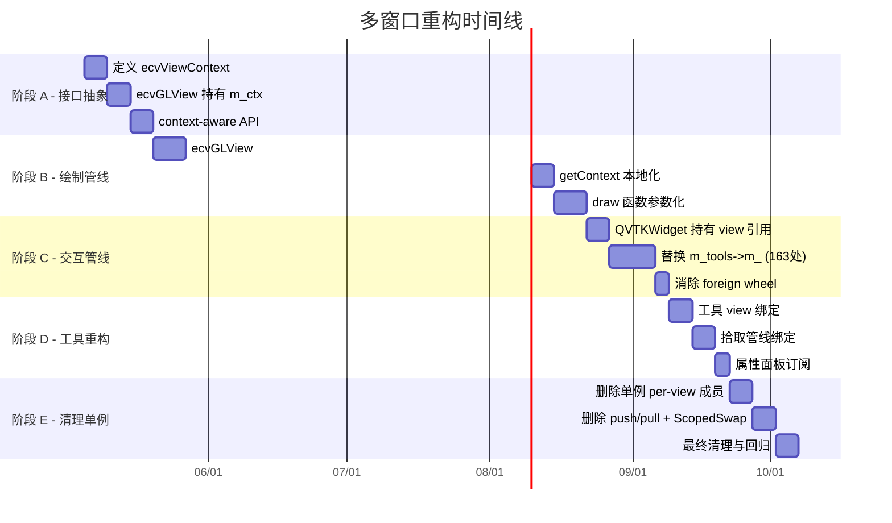

# ACloudViewer 多窗口渲染系统全面重构方案

本文基于 CloudCompare / ParaView 多窗口系统深度审计结果，给出 **分阶段、可交付** 的重构路径。

**配套文档：**
- **`multi-window-paradigms-CloudCompare-ParaView.md`**：CC/PV/ACV 三方对比
- **`audit-TheInstance-m_-members.md`**：单例直读全量扫描

---

## 1. 重构目标

### 1.1 终极目标

将 ACloudViewer 的多窗口渲染系统从 **「单例 + 临时切换」** 改造为 **「每窗口独立状态 + 协调器」** 模式，达到：

1. **窗口间完全隔离**：相机、拾取、交互、渲染管线互不影响
2. **无 push/pull 开销**：取消视图切换时的状态序列化/反序列化
3. **无 ScopedVisSwap**：取消绘制时的全局指针临时替换
4. **工具/对话框显式绑定**：每个工具知道自己操作哪个视图
5. **可选的视图同步**：相机联动是显式 Link，不是隐式状态泄漏

### 1.2 非目标

- **不** 替换 VTK 渲染后端为 CC 的纯 OpenGL（已明确排除）
- **不** 引入 ParaView 的完整 ServerManager/Proxy 体系（取模式不取类名）
- **不** 在短期内删除 `ecvDisplayTools` 类（渐进式改造）

### 1.3 重构原则

| 原则 | 含义 |
|------|------|
| **数据归属明确** | 每个状态字段有且仅有一个 owner（ecvGLView 或 ecvDisplayTools，不是两者都有） |
| **向内求值** | 代码读状态时向 **当前操作的 view** 求值，不向全局单例求值 |
| **先隔离后删除** | 先让所有代码路径通过 view 实例读写，再安全删除单例字段 |
| **渐进交付** | 每个阶段独立可测试、可回退 |

---

## 2. 三套概念不要混为一谈

| 名称 | 含义 | ACloudViewer 现状 |
|------|------|-------------------|
| **CloudCompare 原版** | 每 MDI 子窗口一个 `ccGLWindow`（QOpenGLWidget），原生 OpenGL 管线 | **未采用**：不使用 CC 的 GL 管线 |
| **ACloudViewer 主路径** | `VtkDisplayTools`（单例）+ `QVTKWidgetCustom` + `VtkVis`（VTK OpenGL 后端） | **已采用**：所有 3D 输出经 VTK |
| **副视口 / 分割** | 每 `ecvGLView` 一套 `VtkVis` + `RenderWindow` + ScopedVisSwap | **已采用**：GPU 上下文独立，CPU 状态通过单例共享 |

**结论：** 重构目标是 **在 VTK 后端上实现 CC 级别的状态隔离**，借鉴 PV 的协调器模式。

---

## 3. 当前架构问题全景

### 3.1 单例访问热点

```
ecvDisplayTools 单例访问点（共 ~725 处）
├── s_tools.instance->m_*   in ecvDisplayTools.cpp    : 527 处
├── m_tools->m_*             in QVTKWidgetCustom.cpp   : 163 处
├── TheInstance()->m_*       in ecvDisplayTools.h      :  35 处
└── 合计直接读写单例状态                                 : 725 处
```

### 3.2 缓解机制覆盖率

| 机制 | 覆盖范围 | 未覆盖 |
|------|---------|--------|
| `push/pull` (30 字段) | 交互、鼠标、视口参数、bubble、pivot、光照 | `m_activeItems`, `m_messagesToDisplay`, CPU 矩阵, `m_captureMode` |
| `ScopedVisSwap` (4 字段) | VtkVis, vtkWidget, ImageVis, glViewport | 所有非 VTK 状态 |
| `ScopedRenderOverride` | 调用 `getEffectiveView()` 的路径 | 直读 `s_tools.instance` 的 527 处 |
| `write-through` (20 处) | pointSize, lineWidth, displayParams | cameraClip, cameraFovy, viewportDefaultSize |
| `foreign wheel` | 滚轮事件 | 其他非活动窗口的交互事件 |

---

## 4. 分阶段重构计划

### 阶段 A — 接口抽象：引入 `ecvViewContext`（2-3 周）

**目标：** 定义每窗口状态的 **唯一容器**，所有读写通过此容器，不再直读单例。

#### A.1 定义 `ecvViewContext`

```cpp
// libs/CV_db/include/ecvViewContext.h
class ecvViewContext {
public:
    // === 视口 / 相机 ===
    ecvViewportParameters viewportParams;
    CCVector3d viewMatd[16];
    CCVector3d projMatd[16];
    bool validModelviewMatrix = false;
    bool validProjectionMatrix = false;

    // === 交互 / 拾取 ===
    int interactionFlags = 0;
    PICKING_MODE pickingMode = DEFAULT_PICKING;
    bool pickingModeLocked = false;
    int pickRadius = 3;
    std::vector<Clickable2DItem*> activeItems;
    bool allowRectangularEntityPicking = true;

    // === 鼠标 / 触摸 ===
    QPoint lastMousePos;
    QPoint lastMouseMovePos;
    bool mouseMoved = false;
    bool mouseButtonPressed = false;
    bool ignoreMouseReleaseEvent = false;
    bool touchInProgress = false;
    float touchBaseDist = 1.0f;

    // === 显示 ===
    HotZone* hotZone = nullptr;
    std::vector<ClickableItem> clickableItems;
    bool clickableItemsVisible = true;
    bool displayOverlayEntities = true;
    MessageList messagesToDisplay;

    // === Bubble / Pivot ===
    bool bubbleViewModeEnabled = false;
    float bubbleViewFov_deg = 90.0f;
    PivotVisibility pivotVisibility = PIVOT_SHOW_ON_MOVE;
    bool pivotSymbolShown = false;
    bool autoPickPivotAtCenter = true;

    // === 光照 ===
    float sunLightPos[4];
    bool sunLightEnabled = true;
    float customLightPos[4];
    bool customLightEnabled = false;

    // === 渲染标志 ===
    bool exclusiveFullscreen = false;
    bool showCursorCoordinates = false;
    bool showDebugTraces = false;
    bool rotationAxisLocked = false;
    CCVector3d lockedRotationAxis;
};
```

#### A.2 `ecvGLView` 持有 `ecvViewContext`

```cpp
class ecvGLView : public ecvGenericGLDisplay {
    ecvViewContext m_ctx;  // 唯一真相源

    // 取代现有的分散成员
    const ecvViewContext& context() const { return m_ctx; }
    ecvViewContext& context() { return m_ctx; }
};
```

#### A.3 `ecvDisplayTools` 提供 context-aware API

```cpp
class ecvDisplayTools {
    // 新增：基于 context 的 API（阶段 A 先加，不删旧 API）
    static void GetContext(CC_DRAW_CONTEXT& ctx, const ecvViewContext& viewCtx);
    static void SetPointSize(float size, ecvViewContext& viewCtx);
    static void SetLineWidth(float width, ecvViewContext& viewCtx);
    // ... 所有需要视口状态的 API 加 viewCtx 参数版本

    // 旧 API 保留但标记 deprecated
    [[deprecated("Use context-aware version")]]
    static void SetPointSize(float size);
};
```

#### A.4 验收标准

- [ ] `ecvViewContext` 类定义并编译通过
- [ ] `ecvGLView` 使用 `m_ctx` 替代现有分散成员
- [ ] `pushStateToSingleton` / `pullStateFromSingleton` 改为读写 `m_ctx`
- [ ] 至少 5 个核心静态 API 有 context-aware 版本
- [ ] 回归测试：2+ MDI 窗口 + 1 分割窗口，基本操作无回退

---

### 阶段 B — 绘制管线重构：消除 ScopedVisSwap（3-4 周）

**目标：** 每个 `ecvGLView` 的绘制管线 **自给自足**，不再临时替换单例指针。

#### B.1 `ecvGLView::redraw` 去单例化

```cpp
// 目标：redraw 不再需要 ScopedVisSwap
void ecvGLView::redraw(bool only2D, bool forceRedraw) {
    if (!m_visualizer3D || !m_vtkWidget) return;

    // 直接使用本视图的 VtkVis，不切换单例
    CC_DRAW_CONTEXT ctx;
    getContext(ctx);  // 从 m_ctx 填充，不读单例

    // 背景 / 3D / 2D / clickable / overlay
    drawBackground(ctx);
    draw3D(ctx);
    drawForeground(ctx);

    m_visualizer3D->getRenderWindow()->Render();
}
```

#### B.2 `ecvGLView::getContext` 完全本地化

```cpp
void ecvGLView::getContext(CC_DRAW_CONTEXT& CONTEXT) {
    CONTEXT.glW = m_vtkWidget->width();
    CONTEXT.glH = m_vtkWidget->height();
    CONTEXT.devicePixelRatio = m_vtkWidget->devicePixelRatioF();
    CONTEXT.display = this;
    CONTEXT.defaultPointSize = m_ctx.viewportParams.defaultPointSize;
    CONTEXT.defaultLineWidth = m_ctx.viewportParams.defaultLineWidth;
    // ... 全部从 m_ctx 读取，零单例依赖
}
```

#### B.3 DrawFunction 接受 VtkVis 参数

目前 `draw3D` 等函数内部通过单例获取 `m_visualizer3D`。重构为参数传递：

```cpp
void ecvGLView::draw3D(CC_DRAW_CONTEXT& ctx) {
    // 直接使用 m_visualizer3D，不通过 ecvDisplayTools::GetVisualizer3D()
    auto* renderer = m_visualizer3D->getRenderer();
    // ...
}
```

#### B.4 验收标准

- [ ] `ecvGLView::redraw` 删除 `ScopedVisSwap` 调用
- [ ] `ecvGLView::getContext` 不读 `s_tools.instance`
- [ ] `ScopedRenderOverride` 仅用于 `ecvDisplayTools` 自身的 `RedrawDisplay`（主视图）
- [ ] 多窗口绘制无串窗、无闪烁
- [ ] 性能：消除 push/pull + swap 开销后，多窗口 redrawAll 性能提升可测量

---

### 阶段 C — 交互管线重构：`QVTKWidgetCustom` 去单例化（3-4 周）

**目标：** 鼠标/键盘/滚轮事件处理直接操作 **当前 widget 所属的 `ecvGLView`**，不读写全局单例。

#### C.1 `QVTKWidgetCustom` 持有 view 引用

```cpp
class QVTKWidgetCustom {
    ecvGLView* m_ownerView;  // 替代 m_tools（单例指针）

    // 事件处理直接操作 m_ownerView->context()
    void mousePressEvent(QMouseEvent* e) override {
        auto& ctx = m_ownerView->context();
        ctx.lastMousePos = e->pos();
        ctx.mouseButtonPressed = true;
        // ...
    }
};
```

#### C.2 消除 foreign wheel 补丁

当每个 widget 直接操作自己的 `ecvGLView` 时，**foreign wheel 不再需要 push/pull**：

```cpp
void QVTKWidgetCustom::wheelEvent(QWheelEvent* event) {
    auto& ctx = m_ownerView->context();
    // 直接修改本视图的 zoom/fov/zNear
    // 无需 pushStateToSingleton / pullStateFromSingleton
    // 无需判断 foreignWheel
    m_ownerView->onWheelEvent(event);
}
```

#### C.3 减少 `m_tools->m_*` 访问

逐步将 `QVTKWidgetCustom.cpp` 中的 163 处 `m_tools->m_*` 替换为 `m_ownerView->context().xxx`：

| 类别 | 当前模式 | 目标模式 | 预估数量 |
|------|---------|---------|---------|
| 鼠标状态 | `m_tools->m_lastMousePos` | `ctx.lastMousePos` | ~30 |
| 交互标志 | `m_tools->m_interactionFlags` | `ctx.interactionFlags` | ~20 |
| 拾取 | `m_tools->m_pickingMode` | `ctx.pickingMode` | ~15 |
| 视口参数 | `m_tools->m_viewportParams` | `ctx.viewportParams` | ~40 |
| Bubble/Pivot | `m_tools->m_bubbleViewModeEnabled` | `ctx.bubbleViewModeEnabled` | ~20 |
| 其他 | 杂项 | 通过 ctx 或 view API | ~38 |

#### C.4 验收标准

- [ ] `QVTKWidgetCustom` 不再持有 `m_tools`（`ecvDisplayTools*`）
- [ ] `wheelEvent` 不再需要 foreign wheel 补丁
- [ ] `mousePressEvent` 中的 `setActiveView` 保留（UI 激活语义），但不需要 push/pull
- [ ] 多窗口下鼠标操作（旋转、平移、缩放）互不影响

---

### 阶段 D — 工具/对话框重构：显式视图绑定（2-3 周）

**目标：** 借鉴 CC 的 `linkWith` 和 PV 的 `activeViewChanged` 信号，工具/对话框显式知道自己操作哪个视图。

#### D.1 工具基类增加 view 绑定

```cpp
class ecvOverlayDialog {
    ecvGLView* m_boundView = nullptr;

    void bindToView(ecvGLView* view) {
        if (m_boundView) unbindFromView();
        m_boundView = view;
        connect(view, &ecvGLView::aboutToClose, this, &ecvOverlayDialog::onViewClosed);
    }

    // 或者订阅 activeViewChanged
    void followActiveView() {
        connect(&ecvViewManager::instance(), &ecvViewManager::activeViewChanged,
                this, &ecvOverlayDialog::onActiveViewChanged);
    }
};
```

#### D.2 拾取管线绑定

`ccPickingHub` 已经基本正确（跟踪 MDI 激活窗口），但需确保：
- `doPicking` 使用 **当前拾取窗口的** `ecvViewContext`，不读单例
- `m_deferredPickingTimer` 关联到 **特定 view** 的位置数据

#### D.3 属性面板订阅 `activeViewChanged`

```cpp
// 属性面板在视图切换时刷新
connect(&ecvViewManager::instance(), &ecvViewManager::activeViewChanged,
        propertiesPanel, &PropertiesPanel::refreshFromView);
```

#### D.4 验收标准

- [ ] 所有 `ecvOverlayDialog` 子类使用 `bindToView` 或 `followActiveView`
- [ ] `doPicking` 不读 `s_tools.instance->m_lastMousePos`
- [ ] 属性面板显示当前活动视图的参数
- [ ] 工具切换窗口时无状态残留

---

### 阶段 E — 清理单例：`ecvDisplayTools` 瘦身（2-3 周）

**目标：** `ecvDisplayTools` 退化为 **工具函数集合 + 主视图兼容层**，不再持有 per-view 状态。

#### E.1 分类处理单例成员

| 类别 | 成员 | 处理方式 |
|------|------|---------|
| **已在 ecvViewContext 中** | `m_viewportParams`, `m_interactionFlags`, `m_pickingMode`, 鼠标状态, hotZone, bubble, pivot, 光照 | **删除**单例副本 |
| **全局语义正确** | `m_globalDBRoot`, `m_win`, `m_mainScreen` | **保留**在 `ecvDisplayTools` |
| **应在 ecvViewManager** | `m_currentScreen`, `m_removeFlag` | **迁移** |
| **应在 VtkDisplayTools** | `m_visualizer3D`, `m_vtkWidget`, `m_visualizer2D` | 仅作 **primary fallback** |

#### E.2 删除 push/pull

当所有读写都通过 `ecvViewContext` 时，`pushStateToSingleton` / `pullStateFromSingleton` 不再需要。

#### E.3 删除 ScopedVisSwap

当 `ecvGLView::redraw` 完全自给自足时，`VtkDisplayTools::ScopedVisSwap` 可删除。

#### E.4 删除 foreign wheel 补丁

当 `QVTKWidgetCustom` 直接操作 `m_ownerView` 时，foreign wheel 逻辑简化为普通事件转发。

#### E.5 验收标准

- [ ] `ecvDisplayTools` 的 per-view 成员减少到 0
- [ ] `pushStateToSingleton` / `pullStateFromSingleton` 删除
- [ ] `ScopedVisSwap` 删除
- [ ] `s_tools.instance->m_*` 直读次数从 527 降至 < 50（仅全局语义成员）
- [ ] `m_tools->m_*` 直读次数从 163 降至 0
- [ ] 回归：全功能测试覆盖

---

### 阶段 F — 进阶功能（可选，视产品需求）

| 功能 | 借鉴 | 说明 |
|------|------|------|
| **布局持久化** | PV `vtkSMViewLayoutProxy` | 将分割布局序列化到项目文件 |
| **per-view Representation** | PV `pqDataRepresentation` | 同一对象在不同视图可以有不同颜色/可见性 |
| **Selection Link** | PV `vtkSMSelectionLink` | 多视图间选择同步（可选） |
| **Tab 多布局** | PV `pqTabbedMultiViewWidget` | 多 Tab 页各有独立布局 |

---

## 5. 阶段依赖与时间线



**总预估：12-16 周（按顺序执行）；若 B/C 部分并行可压缩到 10-12 周**

---

## 6. 风险与缓解

| 风险 | 等级 | 缓解 |
|------|------|------|
| **插件兼容性** | 高 | 阶段 A 保留旧 API（deprecated），不 break 外部插件 |
| **回退困难** | 高 | 每阶段独立分支，有明确验收标准；feature flag 控制新旧路径 |
| **性能回退** | 中 | 消除 push/pull/swap 应 **提升** 性能；关注 per-view `getContext` 的 cache locality |
| **并发渲染** | 中 | `ecvViewContext` 是值类型，线程安全性比单例指针好 |
| **遗漏路径** | 高 | 每阶段结束运行 `grep 'TheInstance()->m_\|s_tools.instance->m_\|m_tools->m_'` 验证趋势 |

---

## 7. 高效重构原则（VTK + 单例混合）

1. **先保证「指针指向正确 VtkVis」**：阶段 B 消除 ScopedVisSwap
2. **再保证「参数读写的视图一致」**：阶段 C 消除 m_tools->m_* 直读
3. **最后做「删单例字段」**：阶段 E，只有前两条稳定后才值得动
4. **每阶段有回退路径**：feature flag 或编译开关

---

## 8. 与配套文档的交叉引用

- CC/PV 范式对比与 Mermaid：见 **`multi-window-paradigms-CloudCompare-ParaView.md`**
- 单例直读全量扫描：见 **`audit-TheInstance-m_-members.md`**
- 本文侧重 **重构方案与执行计划**

---

## 9. 执行进度追踪（2026-04-24 更新）

| 阶段 | 状态 | 关键成果 |
|------|------|---------|
| **A** 接口抽象 | **DONE** | `ecvViewContext` 定义、`effectiveCtx()` 桥接、context-aware API |
| **B** 绘制管线 | **DONE** | `getContext` 本地化、`RedrawDisplay` per-view 委派、`ScopedRenderOverride` 移除、deprecated 旧 API |
| **C** 交互管线 | **DONE** | `m_ownerView` + `ownerCtx()` 全量 accessor、foreign wheel 消除 |
| **D** 工具重构 | **DONE** | `bindToView` 绑定、`doPicking` via `effectiveCtx()`、属性面板随活动视图刷新 |
| **E** 清理单例 | **PARTIAL** | `pushState/pullState` 已删除 (16→0)、~35 per-view 成员声明已删除；`ScopedHotZoneRender` 和 `m_tools` 因 `DrawClickableItems` 耦合暂缓 |
| **F** 进阶功能 | **PENDING** | 可选产品功能，待需求驱动 |

### 当前指标

| 指标 | 初始值 | 当前值 | 目标 |
|------|-------|--------|------|
| `s_tools.instance->m_*` (ecvDisplayTools.cpp) | 527 | 55 (全部为全局成员) | < 50 |
| `m_tools->m_*` (QVTKWidgetCustom.cpp) | 163 | 71 (m_primaryCtx 回退路径) | 0 (需 primary view 也用 ecvGLView) |
| `pushState/pullState` 引用 | 16 | **0** | 0 |
| `ScopedHotZoneRender` 引用 | 18 | 18 (DrawClickableItems 耦合) | 0 (需 per-view hot zone 绘制) |

### 遗留项

1. **ScopedHotZoneRender**: `DrawClickableItems` + `DrawWidgets` + `RenderText` 整条 2D overlay 管线依赖单例 VTK 管线指针。需将其参数化（接受 `VtkVis`/`QVTKWidget`）才能消除 swap。
2. **m_tools fallback**: 主窗口的 `QVTKWidgetCustom` 没有 `m_ownerView`（因为主窗口不是 `ecvGLView` 实例），所以 accessor 仍需 `m_tools->m_primaryCtx` 回退。需将主窗口也包装为 `ecvGLView` 才能彻底删除 `m_tools`。

### Bug 修复记录（2026-04-24）

| Bug | 修复内容 | 文件 |
|-----|---------|------|
| **窗口激活** | 已验证：仅 canvas click + MDI tab 激活，无 hover/focus/DBtree 激活 | `QVTKWidgetCustom.cpp`, `MainWindow.cpp` |
| **默认窗口删除 crash** | `SetCurrentScreen` 空指针守卫、`adoptNewPrimary` 更新 `m_mainScreen`、`prepareViewClose` edge-case 处理 | `ecvDisplayTools.cpp`, `VtkDisplayTools.cpp`, `MainWindow.cpp` |
| **新窗口配置继承** | `copyPrimaryViewConfig` 改用 `effectiveCtx()`（活动视图），而非始终 `m_primaryCtx`；重置鼠标/触摸瞬态 | `MainWindow.cpp` |

### 生命周期加固记录（2026-04-25）

| 问题 | 修复内容 | 文件 |
|------|---------|------|
| **MDI deactivation 处理** | `on3DViewActivated(nullptr)` 不再静默返回，会调用 `setActiveView(nullptr)` 同步 `ecvViewManager` | `MainWindow.cpp` |
| **activeViewChanged(nullptr)** | Lambda 不再忽略 null `newActive`，允许 `rebindToolsToActiveView` 处理清理逻辑 | `MainWindow.cpp` |
| **unregisterView 替换策略** | 从 `m_views.first()` 改为 `m_views.last()`（最近注册 = 更可能是用户焦点） | `ecvViewManager.cpp` |
| **重复 registerView** | 移除 `new3DView` 中多余的 `RegisterGLDisplay` + `registerView`（已在 `ecvGLView::Create` 中完成） | `MainWindow.cpp` |
| **rebind null screen** | `rebindToolsToActiveView` 在 screen 为 null 时先 unlink MDI dialogs，再调用 `updateUI()` | `MainWindow.cpp` |
| **adoptNewPrimary 选择** | `prepareViewClose` 优先使用 `ecvViewManager::getActiveView()` 作为新 primary，而非总取 `getAllViews()` 第一个 | `MainWindow.cpp` |
| **最后窗口关闭** | 无存活 `ecvGLView` 时恢复到内置 primary widget (`getQVtkWidget()`)，而非 `SetCurrentScreen(nullptr)` | `MainWindow.cpp` |

---

*维护：架构变更时同步更新阶段验收项与统计数据。*
*更新日期：2026-04-25*
