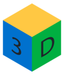

.. ACloudViewer documentation master file

-----------

ACloudViewer: A Modern Library for 3D Point Cloud Processing
=============================================================

**ACloudViewer** is a powerful open-source library for 3D point cloud and mesh processing, built on top of CloudCompare, Open3D, ParaView, and COLMAP.

.. note::
   **Latest Release:** |version| | `Download <https://github.com/Asher-1/ACloudViewer/releases>`_ | `GitHub <https://github.com/Asher-1/ACloudViewer>`_

.. raw:: html

   

       

           📚 <strong>Documentation Version:</strong>
       

       <select id="docs-version-select-main" 
               style="width: 100%; max-width: 300px; padding: 8px; border: 1px solid #ddd; border-radius: 4px; font-size: 14px; background: white; cursor: pointer;"
               onchange="if(window.ACloudViewerVersionSwitcher) { window.ACloudViewerVersionSwitcher.switchVersion(this.value); }">
           <option value="stable">Latest Stable</option>
           <option value="dev">Development (main)</option>
       </select>
       

           Switch between stable release and development documentation. Use the version selector in the sidebar for quick access.
       

   

   

AICore AI Plugins
-----------------

Three GUI plugins share one native inference library — **libAICore.so** (`ggml <https://github.com/ggml-org/ggml>`_).
Run quantized **GGUF** models on **CUDA / Vulkan / Metal / CPU** with **no Python or PyTorch** at runtime.
Results land directly in the DB tree and plug into reconstruction, COLMAP, and SIBR workflows.

.. list-table:: Plugin comparison
   :header-rows: 1
   :widths: 18 27 27 28

   * -
     - **qDA3**
     - **qLightGlue**
     - **qFreeSplatter**
   * - Task
     - Monocular & multi-view depth, camera pose
     - Sparse feature matching
     - Uncalibrated photos → 3D Gaussian splats
   * - Model
     - Depth Anything V3 GGUF
     - SIFT + LightGlue GGUF
     - FreeSplatter GGUF
   * - Standout
     - Single-image depth cloud in one click
     - 300+ matches in **< 1 s** on GPU
     - **2 photos** → 3D scene + SIBR PLY
   * - CMake
     - ``PLUGIN_STANDARD_QDA3``
     - ``PLUGIN_STANDARD_QLIGHTGLUE``
     - ``PLUGIN_STANDARD_QFREESPLATTER``

.. raw:: html

   

     <figure style="margin:0; text-align:center;">
       
       <figcaption style="margin-top:10px; font-size:.9em; color:#475569;"><strong>Depth Anything V3</strong> — depth maps &amp; 3D unprojection from a single photo</figcaption>
     </figure>
     <figure style="margin:0; text-align:center;">
       
       <figcaption style="margin-top:10px; font-size:.9em; color:#475569;"><strong>LightGlue</strong> — sub-second SIFT feature matching with live visualization</figcaption>
     </figure>
     <figure style="margin:0; text-align:center;">
       
       <figcaption style="margin-top:10px; font-size:.9em; color:#475569;"><strong>FreeSplatter</strong> — sparse-view 3D Gaussian reconstruction, optional qSIBR preview</figcaption>
     </figure>
   

Why AICore?
~~~~~~~~~~~

* **Native C++ end-to-end** — GUI, automatic reconstruction, and COLMAP pipelines without a Python stack
* **Compact GGUF weights** — e.g. DA3 Base ~142 MB, LightGlue SIFT ~22 MB; one-click download in the dialog
* **Multi-backend GPU** — Auto picks CUDA → Vulkan → CPU (Linux/Windows) or Metal → CPU (macOS)
* **DB-tree integration** — depth clouds, match lines, Gaussian PLY, and camera frustums appear as first-class entities

.. code-block:: bash

   cmake -B build_app \
     -DBUILD_GUI=ON \
     -DAICore_ENABLED=ON \
     -DPLUGIN_STANDARD_QDA3=ON \
     -DPLUGIN_STANDARD_QLIGHTGLUE=ON \
     -DPLUGIN_STANDARD_QFREESPLATTER=ON \
     -DBUILD_RECONSTRUCTION=ON \
     -DPLUGIN_STANDARD_QSIBR=ON \
     .

   cmake --build build_app --target ACloudViewer -j$(nproc)

See :doc:`guides/plugins/README` for an overview,
:doc:`guides/plugins/qDA3`,
:doc:`plugins/qLightGlue/README`,
and :doc:`guides/plugins/qFreeSplatter` for usage and build instructions.
Full build options: :doc:`getting_started/build_from_source`.

.. toctree::
   :maxdepth: 1
   :caption: AI Plugins (AICore)

   guides/plugins/README
   guides/plugins/qDA3
   guides/plugins/qFreeSplatter
   plugins/qLightGlue/README

.. toctree::
   :maxdepth: 1
   :caption: Getting Started

   getting_started/introduction
   getting_started/installation
   getting_started/quickstart
   getting_started/build_from_source
   getting_started/builddocs
   getting_started/cloudViewer_ml

.. toctree::
   :maxdepth: 2
   :caption: Tutorial

   tutorial/index
   tutorial/core/index
   tutorial/geometry/index
   tutorial/t_geometry/index
   tutorial/data/index
   tutorial/visualization/index
   tutorial/pipelines/index
   tutorial/t_pipelines/index
   tutorial/reconstruction_system/index
   tutorial/t_reconstruction_system/index
   tutorial/sensor/index
   tutorial/advanced/index
   tutorial/reference

.. toctree::
   :maxdepth: 1
   :caption: Python API

   python_api/cloudViewer.camera
   python_api/cloudViewer.core
   python_api/cloudViewer.data
   python_api/cloudViewer.geometry
   python_api/cloudViewer.io
   python_api/cloudViewer.t
   python_api/cloudViewer.ml
   python_api/cloudViewer.pipelines
   python_api/cloudViewer.reconstruction
   python_api/cloudViewer.utility
   python_api/cloudViewer.visualization

.. toctree::
   :maxdepth: 2
   :caption: Python Examples

   python_example/benchmark/index
   python_example/camera/index
   python_example/core/index
   python_example/geometry/index
   python_example/io/index
   python_example/pipelines/index
   python_example/reconstruction/index
   python_example/reconstruction_system/index
   python_example/t_reconstruction_system/index
   python_example/utility/index
   python_example/visualization/index

.. toctree::
   :maxdepth: 1
   :caption: C++ Examples

   examples/cpp_examples

.. toctree::
   :maxdepth: 1
   :caption: C++ API

   cpp_api
   cpp_api/overview
   cpp_api/quickstart
   cpp_api/plugins

.. toctree::
   :maxdepth: 1
   :caption: Developer Guide

   developer/contributing
   developer/docker
   developer/ci_cd

.. toctree::
   :maxdepth: 1
   :caption: Resources

   resources/changelog
   resources/faq
   resources/support

..
   Note: Python API and Examples sections will be auto-generated from docstrings
   when Python bindings include proper documentation.
