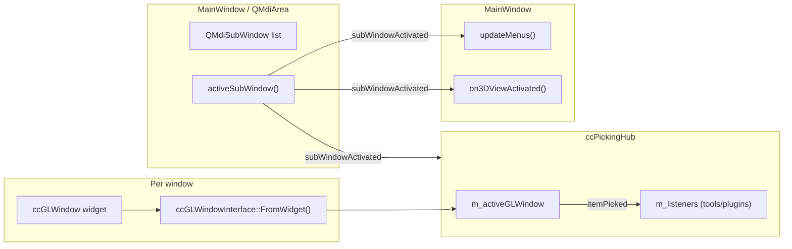
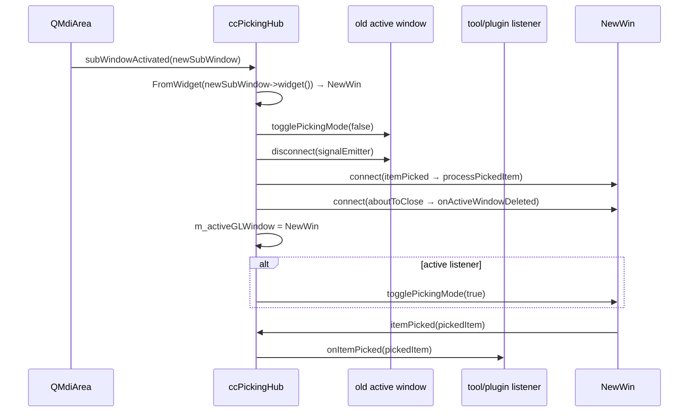
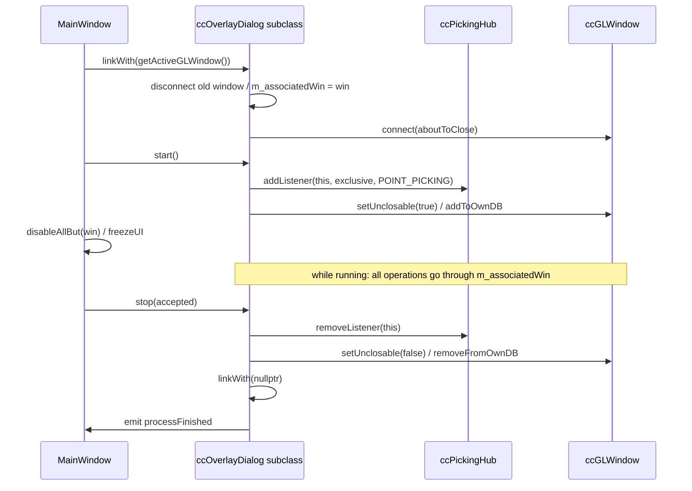
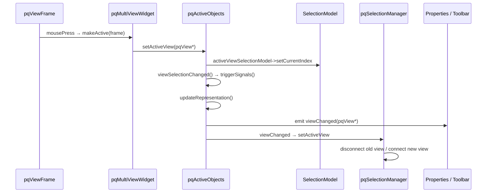
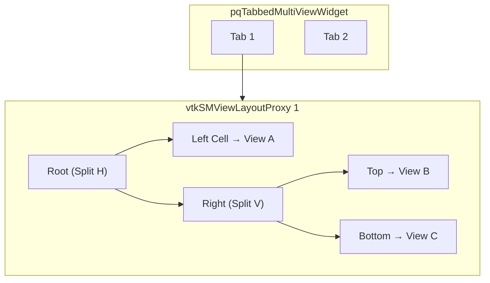
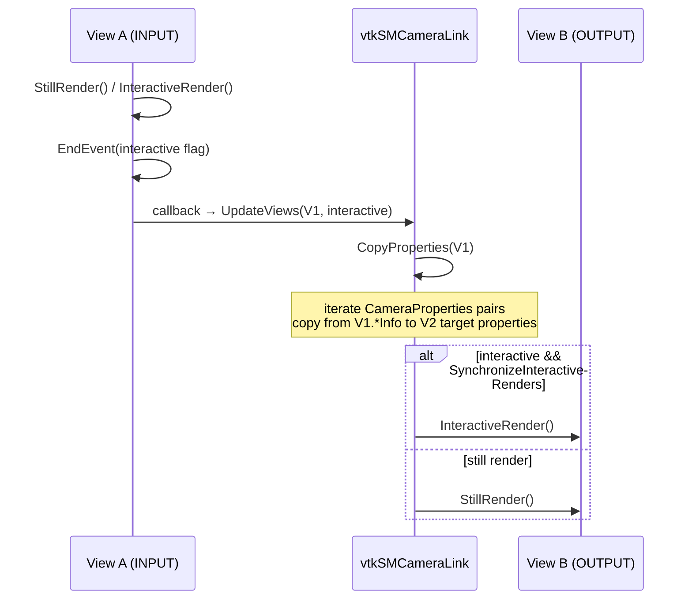
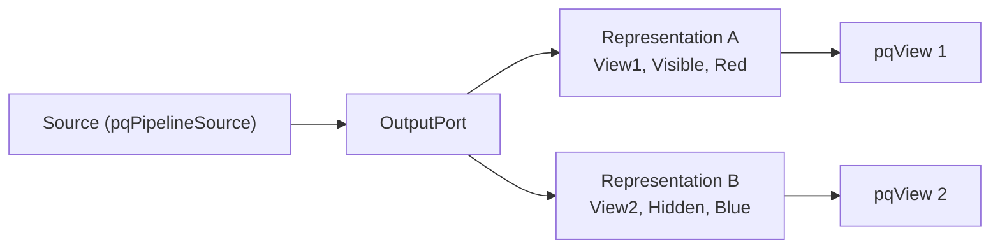
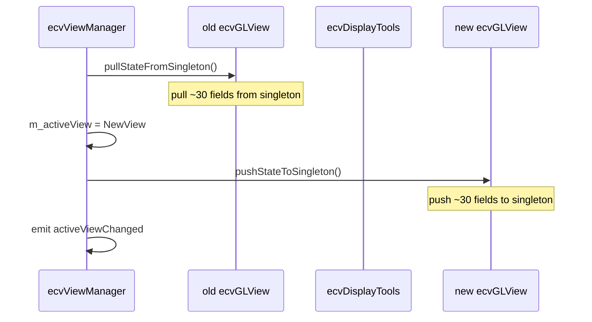
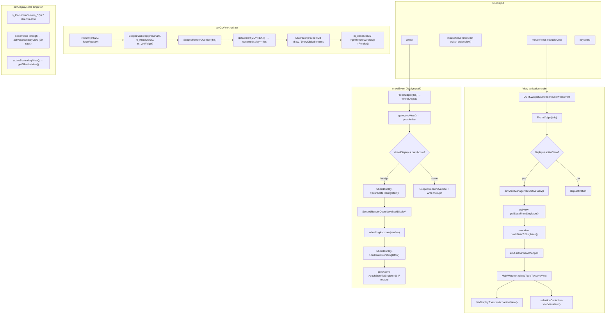

# Multi-Window Visualization Paradigms: CloudCompare vs ParaView vs ACloudViewer

This document is based on an in-depth audit of local source code, for **ACloudViewer** multi-window refactoring and module adaptation reference.

- CloudCompare: `/home/ludahai/develop/code/github/CloudCompare`
- ParaView: `/home/ludahai/develop/code/github/ParaView`
- ACloudViewer: this repository (`ecvViewManager` / `ecvGLView` / `ecvDisplayTools` / `QVTKWidgetCustom`)

**Companion documents:**
- **`multi-window-refactor-roadmap-Vtk-vs-CC.md`**: phased refactoring plan and execution schedule
- **`audit-TheInstance-m_-members.md`**: full scan of singleton direct member reads
- **`multi-window-paraview-alignment-design.md`**: ParaView ↔ ACloudViewer full alignment design (15-dimension comparison + Phase M–N refactoring plan)

---

## 1. Core Design Philosophy Comparison

| Dimension | CloudCompare | ParaView | ACloudViewer (current) |
|------|-------------|----------|---------------------|
| **State ownership** | Each window owns a full state set (camera/picking/interaction/GL resources); **no global singleton** | Each View is a Proxy (independent properties/RenderWindow/Representation); **state isolated by Proxy** | **Singleton `ecvDisplayTools` holds global state**, temporarily switched via push/pull/ScopedSwap |
| **Window abstraction** | `ccGLWindow : QOpenGLWidget + ccGLWindowInterface` | `pqView → vtkSMViewProxy → vtkRenderWindow` | `ecvGLView` (VTK backend) + legacy `ecvDisplayTools` singleton |
| **Active view** | `QMdiArea::activeSubWindow()` + `FromWidget` | `pqActiveObjects::activeView()` + SelectionModel | `ecvViewManager::getActiveView()` + push/pull |
| **Multi-window isolation** | **Natural isolation**: each window has independent OpenGL context/FBO/shaders | **Proxy isolation**: each view has independent RenderWindow/Renderer | **Simulated isolation**: ScopedVisSwap + ScopedRenderOverride + write-through |
| **Picking** | `ccPickingHub` tracks MDI active window | `pqSelectionManager` tracks `activeView` | Singleton `doPicking` + foreign wheel patch |
| **Object display** | `m_currentDisplay` one-to-one binding; filtered in `draw()` via `context.display == this` | One Representation Proxy per (Source, View) pair | `ecvDisplayTools` is the sole display instance; secondary views "simulate" via ScopedRenderOverride |

---

## 2. CloudCompare Multi-Window System Deep Dive

### 2.1 Class Hierarchy and File Index

```
ccGLWindow : QOpenGLWidget, ccGLWindowInterface
    ├── ccGLWindowInterface(~7000 lines of core logic)
    │   ├── ccViewportParameters    m_viewportParams    // independent camera/projection
    │   ├── ccGLWindowSignalEmitter m_signalEmitter     // independent signal emitter
    │   ├── m_fbo / m_fbo2 / m_pickingFbo              // independent FBO
    │   ├── m_activeShader / m_colorRampShader          // independent shader
    │   ├── m_globalDBRoot / m_winDBRoot                // shared scene + window-private DB
    │   ├── m_interactionFlags / m_pickingMode          // independent interaction state
    │   └── m_uniqueID                                  // unique ID
    └── ccGLWindowSignalEmitter
        ├── itemPicked / itemPickedFast                 // picking events
        ├── viewMatRotated / perspectiveStateChanged    // camera events
        ├── leftButtonClicked / mouseMoved              // input events
        ├── drawing3D                                   // rendering hook
        └── aboutToClose                                // lifecycle
```

| File | Path | Lines |
|------|------|------|
| ccGLWindowInterface.h | `libs/qCC_glWindow/include/ccGLWindowInterface.h` | ~1575 |
| ccGLWindowInterface.cpp | `libs/qCC_glWindow/src/ccGLWindowInterface.cpp` | ~7000 |
| ccGLWindow.h/cpp | `libs/qCC_glWindow/include/ccGLWindow.h`, `src/ccGLWindow.cpp` | ~250 |
| ccGLWindowSignalEmitter.h | `libs/qCC_glWindow/include/ccGLWindowSignalEmitter.h` | ~170 |
| ccPickingHub.h/cpp | `libs/CCPluginAPI/include/ccPickingHub.h`, `src/ccPickingHub.cpp` | ~220 |
| ccViewportParameters.h | `libs/qCC_db/include/ccViewportParameters.h` | ~170 |
| mainwindow.cpp | `qCC/mainwindow.cpp` | ~11000 |

### 2.2 Per-Window Complete State Isolation (Core Strength)

Each `ccGLWindowInterface` instance owns a **fully independent** state set:

| Category | Members (representative) | Scope |
|------|--------------|--------|
| **Viewport/camera** | `m_viewportParams`, `m_viewMatd`, `m_projMatd`, `m_cameraToBBCenterDist` | Fully independent |
| **Interaction** | `m_interactionFlags`, `m_pickingMode`, `m_pickRadius` | Fully independent |
| **GL resources** | `m_fbo`, `m_fbo2`, `m_pickingFbo`, `m_activeShader`, `m_activeGLFilter` | Fully independent (QOpenGLWidget provides its own GL context) |
| **Scene data** | `m_globalDBRoot`(shared), `m_winDBRoot`(window-private) | Mixed |
| **Unique ID** | `m_uniqueID`, `windowTitle` | Fully independent |

**Key code — window-private DB creation:**

```334:335:/home/ludahai/develop/code/github/CloudCompare/libs/qCC_glWindow/src/ccGLWindowInterface.cpp
m_winDBRoot = new ccHObject(QString("DB.3DView_%1").arg(m_uniqueID));
```

**Key code — GL context isolation:**

```cpp
// ccGLWindow inherits QOpenGLWidget; each instance automatically owns an independent GL context
// makeCurrent is deleted; doMakeCurrent() is required to ensure FBO consistency
ccGLWindow::doMakeCurrent() {
    QOpenGLWidget::makeCurrent();
    if (m_activeFbo) m_activeFbo->start();
}
```

### 2.3 Drawing Pipeline: Per-Window Context Propagation

CloudCompare's drawing pipeline passes the **current window** to every drawable via `CC_DRAW_CONTEXT`:

```
paintGL() → doPaintGL() → getContext(CONTEXT) → fullRenderingPass(CONTEXT)
                                                    ├── drawBackground()
                                                    ├── draw3D()
                                                    │   ├── m_globalDBRoot->draw(CONTEXT)  // shared scene
                                                    │   └── m_winDBRoot->draw(CONTEXT)     // window-private
                                                    └── compositing / foreground
```

**Key code — context injects window identity:**

```1801:1808:/home/ludahai/develop/code/github/CloudCompare/libs/qCC_glWindow/src/ccGLWindowInterface.cpp
void ccGLWindowInterface::getContext(CC_DRAW_CONTEXT& CONTEXT)
{
    CONTEXT.glW              = glWidth();
    CONTEXT.glH              = glHeight();
    CONTEXT.devicePixelRatio = static_cast<float>(getDevicePixelRatio());
    CONTEXT.display          = this;          // ← window identity
    CONTEXT.qGLContext       = getOpenGLContext();
```

**Key code — drawable filters drawing by window:**

```765:766:/home/ludahai/develop/code/github/CloudCompare/libs/qCC_db/src/ccHObject.cpp
bool drawInThisContext = ((m_visible || m_selected) && m_currentDisplay == context.display);
```

**Design takeaway:** Each object binds to a single window via `m_currentDisplay`; drawing matches via `context.display` with **zero global state queries**.

### 2.4 MDI Window Management and Activation Chain



**Creating a 3D view (`new3DViewInternal`):**

1. `createGLWindow(view3D, viewWidget)` — create a new `ccGLWindow`
2. `m_mdiArea->addSubWindow(viewWidget)` — add to MDI container
3. `view3D->setSceneDB(m_ccRoot->getRootEntity())` — **all views share the same scene root**
4. Connect selection, camera echo, `aboutToClose`, and other signals
5. Set `WA_DeleteOnClose`

**Closing a view:**
- `closeActiveSubWindow()` → Qt `close()` → `prepareWindowDeletion()`
- `m_ccRoot->getRootEntity()->removeFromDisplay_recursive(glWindow)` — clean up object display bindings

### 2.5 ccPickingHub: Multi-Window Picking Isolation



**Design takeaway:**
- Picking events **always** come from the MDI active window
- On window switch **disconnect old window → connect new window**; no signal cross-talk
- Tools register via the `ccPickingListener` interface; **they do not hold window references directly**

### 2.6 Complete Drawing Pipeline Flow (Per-Window Self-Contained)

CC's drawing pipeline is key to understanding "natural isolation"—every step reads state from the `this` instance with **zero global queries**:

```
fullRenderingPass(CONTEXT, renderingParams)
│
├── 1. bindFBO(currentFBO)               ← this window's m_fbo (stereo right eye uses m_fbo2)
│
├── 2. drawBackground()                  ← clear screen, gradient; LOD continuation frames skip clear
│
├── 3. draw3D(CONTEXT)
│     ├── glPointSize(m_viewportParams.defaultPointSize)  ← this window
│     ├── glLineWidth(m_viewportParams.defaultLineWidth)  ← this window
│     ├── setStandardOrthoCenter()
│     ├── m_activeShader->bind()         ← this window's shader
│     ├── modelViewMat = getModelViewMatrix()    ← computed from this window's m_viewportParams
│     ├── projectionMat = getProjectionMatrix()  ← same as above
│     ├── glLoadMatrixd(projectionMat)
│     ├── glLoadMatrixd(modelViewMat)
│     ├── m_globalDBRoot->draw(CONTEXT)  ← shared scene (filtered by CONTEXT.display==this)
│     ├── m_winDBRoot->draw(CONTEXT)     ← window-private DB
│     ├── drawPivot()
│     └── emit drawing3D()              ← extension point (when LOD level is 0)
│
├── 4. bindFBO(nullptr)                  ← unbind FBO
├── 5. m_activeGLFilter->shade(...)      ← post-processing (non-stereo only; this window's filter)
├── 6. DisplayTexture2DPosition(screenTex)  ← blit to screen
│
└── 7. drawForeground()                  ← 2D overlay layer
```

**Per-window FBO management:**

```6211:6246:/home/ludahai/develop/code/github/CloudCompare/libs/qCC_glWindow/src/ccGLWindowInterface.cpp
bool ccGLWindowInterface::initFBO(int w, int h)
{
    doMakeCurrent();
    if (!initFBOSafe(m_fbo, w, h)) { /* on failure, disable FBO/LOD */ }
    // stereo right eye needs m_fbo2
    if (stereo_NVIDIA_or_generic) {
        initFBOSafe(m_fbo2, w, h);
    }
    deprecate3DLayer();
    return true;
}
```

`m_pickingFbo` is created on demand at first pick (`initFBOSafe` in `startOpenGLPicking`).

**LOD per-window:** `m_currentLODState` is an instance member; `getContext` sets decimation policy from GUI parameters; after `draw3D`, a timer advances via `renderNextLODLevel`.

### 2.7 Tool/Dialog Window Binding

CC's tool binding has two key designs: **explicit `linkWith`** and **freezing other windows**.

**`ccOverlayDialog::linkWith` — full implementation:**

```50:90:/home/ludahai/develop/code/github/CloudCompare/libs/CCPluginAPI/src/ccOverlayDialog.cpp
bool ccOverlayDialog::linkWith(ccGLWindowInterface* win)
{
    if (m_processing) return false;       // cannot switch windows while running
    if (m_associatedWin == win) return true;
    if (m_associatedWin) {
        // remove event filter from old window
        foreach (QWidget* w, QApplication::topLevelWidgets())
            w->removeEventFilter(this);
        m_associatedWin->signalEmitter()->disconnect(this);
        m_associatedWin = nullptr;
    }
    m_associatedWin = win;
    if (m_associatedWin) {
        // install event filter
        foreach (QWidget* w, QApplication::topLevelWidgets())
            w->installEventFilter(this);
        connect(m_associatedWin->signalEmitter(),
                &ccGLWindowSignalEmitter::aboutToClose,
                this, &ccOverlayDialog::onLinkedWindowDeletion);
    }
    return true;
}
```

**Freeze other windows while a tool is running:**

```cpp
// MainWindow::activateTracePolylineMode()
m_tplTool->linkWith(getActiveGLWindow());
freezeUI(true);                  // freeze UI
disableAllBut(win);              // disable all other MDI sub-windows
if (!m_tplTool->start())
    deactivateTracePolylineMode(false);
```

This means the user **cannot** switch to another 3D window while a tool runs, preventing tool state from leaking across windows.

**Tool-private DB (OwnDB):** `ccTracePolylineTool` adds its polyline tip to the **window-private DB** via `addToOwnDB`; visible only in the bound window; `removeFromOwnDB` on stop.

**Plugin API:**

```cpp
class ccMainAppInterface {
    virtual ccGLWindowInterface* getActiveGLWindow() = 0;
    virtual ccPickingHub* pickingHub() = 0;
    virtual void registerOverlayDialog(ccOverlayDialog* dlg, Qt::Corner pos) { }
    // ...
};
```

**Full tool binding lifecycle:**



---

## 3. ParaView Multi-Window System Deep Dive

### 3.1 Class Hierarchy and File Index

```
pqProxy
  └── pqView                        // one vtkSMViewProxy per View
        └── pqRenderViewBase
              └── pqRenderView      // 3D render view

vtkSMProxy
  └── vtkSMViewProxy               // View Server Manager proxy
        └── vtkSMRenderViewProxy    // owns independent vtkRenderWindow

vtkSMViewLayoutProxy                // KD-tree layout (split/fraction)

pqActiveObjects                     // active object coordinator (singleton but event-driven)
pqSelectionManager                  // selection management (tracks activeView)
pqLinksModel / vtkSMCameraLink      // camera linking
```

| File | Path | Core content |
|------|------|----------|
| pqView.h/cxx | `Qt/Core/pqView.h`, `pqView.cxx` | View Qt wrapper |
| pqRenderView.h/cxx | `Qt/Core/pqRenderView.h`, `pqRenderView.cxx` | 3D rendering specialization |
| pqMultiViewWidget.h/cxx | `Qt/Components/pqMultiViewWidget.h`, `.cxx` | split layout UI |
| pqActiveObjects.h/cxx | `Qt/Components/pqActiveObjects.h`, `.cxx` | active object management |
| pqSelectionManager.h/cxx | `Qt/Components/pqSelectionManager.h`, `.cxx` | selection management |
| pqLinksModel.h/cxx | `Qt/Core/pqLinksModel.h`, `.cxx` | links (Camera/Proxy/Selection) |
| vtkSMViewProxy.h | `Remoting/Views/vtkSMViewProxy.h` | View Proxy base class |
| vtkSMRenderViewProxy.h | `Remoting/Views/vtkSMRenderViewProxy.h` | Render View Proxy |
| vtkSMViewLayoutProxy.h | `Remoting/Views/vtkSMViewLayoutProxy.h` | layout Proxy |
| vtkSMCameraLink.h/cxx | `Remoting/Views/vtkSMCameraLink.h`, `.cxx` | Camera linking |

### 3.2 Proxy Pattern for State Isolation (Core Strength)

ParaView's core insight: **each View is an independent Proxy object** with its own property set and render target.


**Key isolation points:**

1. **Independent RenderWindow per View**: `vtkSMRenderViewProxy::GetRenderWindow()` returns that View's dedicated window
2. **Independent Representation per (Source, View)**: the same data source is a **different** Representation Proxy in each View
3. **View-scoped render calls**: `pqView::forceRender()` → `getViewProxy()->StillRender()` renders **only the current** View

```134:144:/home/ludahai/develop/code/github/ParaView/Qt/Core/pqView.cxx
vtkSMViewProxy* pqView::getViewProxy() const
{
  return vtkSMViewProxy::SafeDownCast(this->getProxy());
}
```

### 3.3 pqActiveObjects: Event-Driven Active Object Coordination

ParaView's `pqActiveObjects` is not a simple global variable but an event coordinator built on **SelectionModel**:

| Active concept | API | Meaning |
|---------|-----|------|
| Active View | `activeView()` / `setActiveView()` | current view, derived from `activeViewSelectionModel` |
| Active Source | `activePipelineProxy()` | current pipeline source |
| Active Port | `activePort()` | current output port |
| Active Representation | `activeRepresentation()` | = `port->getRepresentation(activeView())` |
| Active Layout | `activeLayout()` | derived from activeView or current Tab |

**Signal chain (on View switch):**



**Comparison with ACloudViewer:**
- ParaView's `pqActiveObjects` ensures consistency via **SelectionModel** and **triggerSignals**
- ACloudViewer's `ecvViewManager` syncs the singleton via **push/pull**—a more fragile mechanism

### 3.4 Layout Management: KD-Tree + Tab



- Each Tab maps to one `vtkSMViewLayoutProxy`
- Layout is a **KD-tree**: each node is either Split (H/V + fraction) or Leaf (View)
- **Layout persists at the SM layer**, not just Qt widget state

### 3.5 Camera Link: Optional View Synchronization (Deep Dive)

**Synchronized property list (`vtkSMCameraLink::CameraProperties`):**

```90:101:/home/ludahai/develop/code/github/ParaView/Remoting/Views/vtkSMCameraLink.cxx
std::set<std::pair<std::string, std::string>> vtkSMCameraLink::CameraProperties()
{
  return {
    { "CameraPositionInfo", "CameraPosition" },
    { "CameraViewAngleInfo", "CameraViewAngle" },
    { "CameraFocalPointInfo", "CameraFocalPoint" },
    { "CameraViewUpInfo", "CameraViewUp" },
    { "CenterOfRotation", "CenterOfRotation" },
    { "CameraParallelScaleInfo", "CameraParallelScale" },
    { "RotationFactor", "RotationFactor" },
    { "CameraParallelProjection", "CameraParallelProjection" },
    { "CameraFocalDiskInfo", "CameraFocalDisk" },
    { "CameraFocalDistanceInfo", "CameraFocalDistance" },
    { "InteractionMode", "InteractionMode" }
  };
}
```

**Synchronization timing (key design):** sync is triggered **after rendering completes**, not on every property change:



**`CopyProperties` implementation:** iterate property pairs; copy from caller's `*Info` properties to each OUTPUT proxy's target properties:

```172:190:/home/ludahai/develop/code/github/ParaView/Remoting/Views/vtkSMCameraLink.cxx
void vtkSMCameraLink::CopyProperties(vtkSMProxy* caller)
{
  for (const auto& propPair : vtkSMCameraLink::CameraProperties())
  {
    vtkSMProperty* fromProp = caller->GetProperty(propPair.first.c_str());
    for (int i = 0; i < numObjects; i++)
    {
      vtkSMProxy* p = this->GetLinkedProxy(i);
      if (p != caller && this->GetLinkedObjectDirection(i) == vtkSMLink::OUTPUT)
      {
        vtkSMProperty* toProp = p->GetProperty(propPair.second.c_str());
        toProp->Copy(fromProp);
        p->UpdateProperty(propPair.second.c_str());
      }
    }
  }
}
```

**`LinkProxies` — bidirectional binding:** two proxies are each other's INPUT + OUTPUT:

```62:68:/home/ludahai/develop/code/github/ParaView/Remoting/ServerManager/vtkSMProxyLink.cxx
void vtkSMProxyLink::LinkProxies(vtkSMProxy* proxy1, vtkSMProxy* proxy2)
{
  this->AddLinkedProxy(proxy1, vtkSMLink::INPUT);
  this->AddLinkedProxy(proxy2, vtkSMLink::OUTPUT);
  this->AddLinkedProxy(proxy2, vtkSMLink::INPUT);
  this->AddLinkedProxy(proxy1, vtkSMLink::OUTPUT);
}
```

**Special handling:**
- `CenterOfRotation` triggers non-interactive `UpdateViews` via `PropertyModified`
- `ResetCamera` only `CopyProperties`; does not trigger peer rendering
- Re-entrancy guard: `this->Internals->Updating` flag prevents chained triggers
- **`SynchronizeInteractiveRenders`** enabled by default (set to 1 in constructor)

**PIP overlay (pqInteractiveViewLink):** beyond pure Camera Link, picture-in-picture overlay can read pixels from the linked view on the display view's `RenderEvent` and composite into a rectangle. This is **image-level** compositing and does not affect Camera Link property sync.

**Implications for ACloudViewer:**
1. Camera sync should happen **after rendering**, not in real time
2. Property list is configurable (which camera properties to sync)
3. Distinguishing interactive vs still avoids interaction stutter
4. Existing `VtkCameraLink` can align with this pattern

### 3.6 Per-View Representation (Deep Dive)

ParaView addresses a need CC does not support: **the same data source can look different in different views**.

**Core design: one Representation = one (Source Port, View) pair**



**Look up Representation by View:**

```234:247:/home/ludahai/develop/code/github/ParaView/Qt/Core/pqOutputPort.cxx
pqDataRepresentation* pqOutputPort::getRepresentation(pqView* view) const
{
  Q_FOREACH (pqDataRepresentation* repr, this->Internal->Representations)
  {
    if (repr && repr->getView() == view)
      return repr;
  }
  return nullptr;
}
```

**Process of binding Representation to View (`pqView::onRepresentationsChanged`):**

```305:358:/home/ludahai/develop/code/github/ParaView/Qt/Core/pqView.cxx
void pqView::onRepresentationsChanged()
{
    // sync SM Representations property to PQ list
    for (each SM proxy in view->Representations) {
        pqRepresentation* repr = findItem(proxy);
        if (new) {
            repr->setView(this);           // friend method, bind to this View
            connect(repr, visibilityChanged, this, ...);
            emit representationAdded(repr);
        }
    }
    for (each removed repr) {
        repr->setView(nullptr);            // unbind
        emit representationRemoved(repr);
    }
}
```

**Visibility is per-view:** `pqRepresentation::setVisible` writes that proxy's `Visibility` property. Two Representations are different proxies, each with its own `Visibility`.

**SM-layer creation:** `vtkSMParaViewPipelineControllerWithRendering::Show` — if the View already has a Representation for that Source, only set Visibility=1; otherwise `CreateDefaultRepresentation` creates a new proxy and `Add`s it to the View's Representations list.

**Implications for ACloudViewer:** Current `m_currentDisplay` is one-to-one binding. If the same object needs different display properties (color, visibility, etc.) across windows, a similar per-view representation layer is needed—but that is **Phase F (advanced)**, not a prerequisite for isolation refactoring.

### 3.7 Selection View Binding

**Selection (per-view entry, global data):**
- `pqSelectionManager` listens for `activeView` changes; **disconnect old view / connect new view**
- Pick entry is view-specific: `pqRenderView::pick(pos)` → `getRenderViewProxy()->Pick(x, y)`
- Selection data itself is pipeline-global (via `vtkSMSelectionLink`)

---

## 4. ACloudViewer Current Architecture Deep Audit

### 4.1 Singleton State Distribution (Root Cause)

```
ecvDisplayTools(singleton s_tools.instance)
├── Viewport/camera:m_viewportParams, m_glViewport, m_viewMatd, m_projMatd
├── Interaction/picking:m_interactionFlags, m_pickingMode, m_pickRadius, m_activeItems
├── Mouse state:m_lastMousePos, m_mouseMoved, m_mouseButtonPressed
├── Display:m_hotZone, m_clickableItems, m_messagesToDisplay
├── Rendering:m_visualizer3D, m_vtkWidget, m_visualizer2D
├── Bubble/Pivot:m_bubbleViewModeEnabled, m_pivotVisibility
├── Lighting:m_sunLightPos, m_customLightPos
└── Scene:m_globalDBRoot, m_winDBRoot
```

**Singleton access hotspot statistics (latest scan):**

| Pattern | Location | Access count | Risk |
|------|------|---------|------|
| `s_tools.instance->m_*` | `ecvDisplayTools.cpp` | **527** | High: full draw/pick/camera paths |
| `m_tools->m_*` | `QVTKWidgetCustom.cpp` | **163** | High: all mouse/keyboard/wheel events |
| `TheInstance()->m_*` | `ecvDisplayTools.h` | **35** | Medium: inline getters/setters |
| `TheInstance()->m_*` | `ecvDisplayTools.cpp` | **1** | Low |
| `TheInstance()->m_*` | `MainWindow.cpp` | **2** | Low: `MainWindow::TheInstance()->m_mdiArea` |
| `activeSecondaryView()` | `ecvDisplayTools.cpp` | **20** | mitigation; incomplete coverage |

### 4.2 Current Mitigation Mechanisms and Their Limits

#### push/pull state synchronization



**push/pull covered fields (ecvGLView.cpp L394-523):**

| Synced | Missing |
|------|------|
| interaction flags, picking mode/radius | **`m_activeItems`**(2D interactor list) |
| mouse state (pos, moved, pressed) | **`m_messagesToDisplay`** |
| hotZone, clickable items | **`m_viewMatd` / `m_projMatd`**(CPU camera matrices) |
| bubble view, pivot, rotation lock | **`m_autoPivotCandidate`** |
| viewport params (full copy) | **`m_diagStrings`** |
| light, picking aux, click timer | **`m_captureMode`** |

#### ScopedVisSwap (VTK pipeline switching)

**Coverage:** `m_visualizer3D`, `m_vtkWidget`, `m_visualizer2D`, `m_glViewport`(temporary)
**Missing:** `m_interactionFlags`, `m_pickingMode`, `m_activeItems`, `m_messagesToDisplay`, all mouse state

#### ScopedRenderOverride (effective view override)

**Coverage:** `getEffectiveView()` returns the rendering view
**Missing:** only paths calling `getEffectiveView()`; code that reads `s_tools.instance->m_*` **fully bypasses** it

#### write-through (dual write)

**Coverage (partial):** `SetPointSize`, `SetLineWidth`, `SetDisplayParameters`
**Missing:** `SetViewportDefaultPointSize`, `SetCameraClip`, `SetCameraFovy`  etc. write singleton only

### 4.3 Confirmed State Leakage Scenarios

| Scenario | Cause | Impact |
|------|------|------|
| **GetContext size wrong** | `glW`/`glH` taken from primary `m_glViewport` even when `CONTEXT.display` is a secondary view | Text/2D element position offset |
| **Secondary GlWidth/GlHeight may be stale** | Outside ScopedRenderOverride, `TheInstance()->m_glViewport` reflects last pushed view | Wrong projection |
| **m_activeItems globally shared** | 2D label/interactor "under mouse" list not in push/pull | Window A hover affects window B |
| **Camera CPU mirror out of sync** | `m_viewMatd`/`m_projMatd` updated only on VTK+singleton path; ecvGLView copy may lag | Projection/unprojection error |
| **SetCameraClip/SetCameraFovy write singleton only** | header inlines write `TheInstance()->m_viewportParams`; ecvGLView copy not updated | Secondary near/far/FOV overwritten until next pull |
| **rebindToolsToActiveView missed** | New code path skips rebind; VTK picking points at wrong VtkVis | Pick runs in wrong window |
| **deferred picking timer is singleton-global** | `m_deferredPickingTimer` and `doPicking()` use singleton `m_lastMousePos` | Deferred pick may use stale position after switch |

### 4.4 End-to-End Pipeline (Full Version)



---

## 5. Three-Way Comparison: Isolation Mechanism Assessment

### 5.1 Isolation Completeness

| Dimension | CC score | PV score | ACV score | ACV issue |
|------|--------|--------|---------|----------|
| Camera/viewport | ★★★★★ | ★★★★★ | ★★★☆☆ | push/pull latency window |
| GL resources | ★★★★★ | ★★★★★ | ★★★★☆ | ScopedVisSwap covers core but not fully |
| Picking | ★★★★★ | ★★★★★ | ★★★☆☆ | m_activeItems global; deferred timer global |
| Interaction state | ★★★★★ | ★★★★★ | ★★☆☆☆ | 163 direct m_tools->m_ reads |
| Render pipeline | ★★★★★ | ★★★★★ | ★★★★☆ | ScopedVisSwap + ScopedRenderOverride work but fragile |
| Tools/dialogs | ★★★★★ | ★★★★☆ | ★★☆☆☆ | some tools still depend on singleton global state |

### 5.2 Patterns Borrowed from CC/PV

| Pattern | CC source | PV source | ACloudViewer recommendation |
|------|---------|---------|-------------------|
| **Window owns full state** | `ccGLWindowInterface` member set | `vtkSMViewProxy` property set | `ecvGLView` should be the **single source of truth** for state |
| **context.display identity injection** | `getContext()` sets `display = this` | N/A (natural proxy isolation) | implemented, but `ecvDisplayTools::GetContext` still reads singleton dimensions |
| **Picking tracks active window** | `ccPickingHub::onActiveWindowChanged` | `pqSelectionManager::setActiveView` | `ccPickingHub` exists; ensure sync with ecvViewManager |
| **Tools explicitly bind to window** | `ccOverlayDialog::linkWith(win)` | tools subscribe to `pqActiveObjects::viewChanged` | systematic tool binding refactor needed |
| **Optional camera linking** | none (independent) | `vtkSMCameraLink` | `VtkCameraLink` exists; pattern is correct |
| **shared scene + per-view display** | `setSceneDB` shared + `m_currentDisplay` filter | `Representations` per-view | current `m_currentDisplay` points at singleton |

---

## 6. Source Code Index

### CloudCompare

| Topic | File | Key lines/functions |
|------|------|------------|
| Window interface | `libs/qCC_glWindow/include/ccGLWindowInterface.h` | Class definition L59-1575 |
| Window implementation | `libs/qCC_glWindow/src/ccGLWindowInterface.cpp` | `getContext` L1801, `draw3D` L4841, `fullRenderingPass` L5171 |
| Window widget | `libs/qCC_glWindow/src/ccGLWindow.cpp` | Constructor L31, `doMakeCurrent` L77 |
| Signal emitter | `libs/qCC_glWindow/include/ccGLWindowSignalEmitter.h` | L35-169 |
| MDI + Hub | `qCC/mainwindow.cpp` | MDI L289, `getActiveGLWindow` L6204, `new3DViewInternal` L6282 |
| PickingHub | `libs/CCPluginAPI/src/ccPickingHub.cpp` | `onActiveWindowChanged` L58, `processPickedItem` L102 |
| Drawable filter | `libs/qCC_db/src/ccHObject.cpp` | `drawInThisContext` L765 |
| ViewportParams | `libs/qCC_db/include/ccViewportParameters.h` | Members L123-166 |
| Tool binding | `libs/CCPluginAPI/src/ccOverlayDialog.cpp` | `linkWith` L50 |
| Plugin API | `libs/CCPluginAPI/include/ccMainAppInterface.h` | L45-248 |

### ParaView

| Topic | File | Key lines/functions |
|------|------|------------|
| View base class | `Qt/Core/pqView.h`, `pqView.cxx` | `getViewProxy` L134, `forceRender` L212 |
| RenderView | `Qt/Core/pqRenderView.h`, `pqRenderView.cxx` | `pick` L693 |
| Multi-view widget | `Qt/Components/pqMultiViewWidget.cxx` | `makeActive` L537, `reload` L615 |
| Active objects | `Qt/Components/pqActiveObjects.h`, `.cxx` | `setActiveView` L361, `triggerSignals` L100 |
| selection management | `Qt/Components/pqSelectionManager.h`, `.cxx` | `setActiveView` L96 |
| Camera link | `Qt/Core/pqLinksModel.cxx` | `addCameraLink` L700 |
| Links Manager | `Qt/Components/pqLinksManager.cxx` | L59-73 |
| Camera Link SM | `Remoting/Views/vtkSMCameraLink.cxx` | `CopyProperties` L172 |
| Layout Proxy | `Remoting/Views/vtkSMViewLayoutProxy.h` | KD-Tree L44-116 |
| View Proxy | `Remoting/Views/vtkSMViewProxy.h` | `StillRender` L55, `FindRepresentation` L105 |

### ACloudViewer

| Topic | File | Key lines/functions |
|------|------|------------|
| View management | `libs/CV_db/include/ecvViewManager.h`, `src/ecvViewManager.cpp` | `setActiveView` L29, `ScopedRenderOverride` L40 |
| Secondary view | `libs/VtkEngine/Visualization/ecvGLView.h`, `.cpp` | `redraw` L108, `pushState` L394, `pullState` L460 |
| Singleton delegate | `libs/CV_db/src/ecvDisplayTools.cpp` | `activeSecondaryView` L67, `GetContext` L2518 |
| VTK pipeline switching | `libs/VtkEngine/Visualization/VtkDisplayTools.cpp` | `ScopedVisSwap` L197, `switchActiveView` L114 |
| Interaction activation | `libs/VtkEngine/VTKExtensions/Widgets/QVTKWidgetCustom.cpp` | `wheelEvent` L609, `mousePressEvent` L520 |
| Main window | `app/MainWindow.cpp` | `rebindToolsToActiveView` L2455, `new3DView` L2936 |

---

## 7. Document Maintenance Notes

- After upstream **CloudCompare / ParaView** version upgrades, re-verify key line numbers first
- After ACloudViewer code changes, run `grep -rn 'TheInstance()->m_\|s_tools.instance->m_\|m_tools->m_' --include='*.cpp' --include='*.h'` to refresh statistics
- Maintain this document together with `multi-window-refactor-roadmap-Vtk-vs-CC.md` and `audit-TheInstance-m_-members.md`

---

*Document purpose: in-depth multi-window architecture comparison and refactoring reference; implementation follows each repository's source code.*
*Last updated: 2026-04-24*
