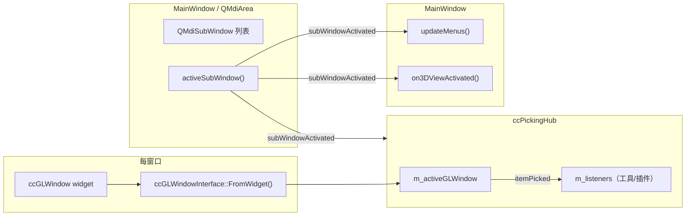
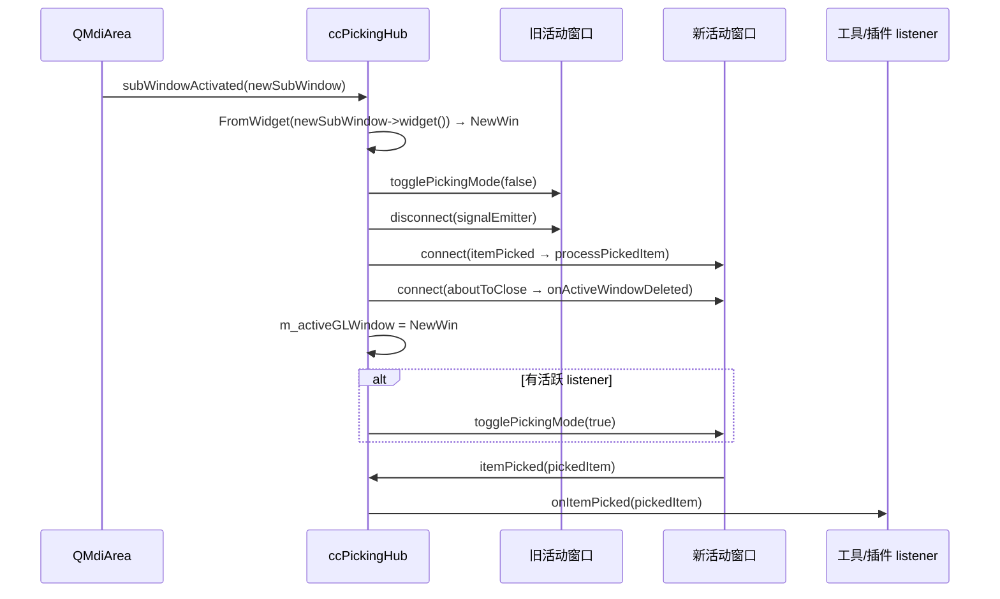
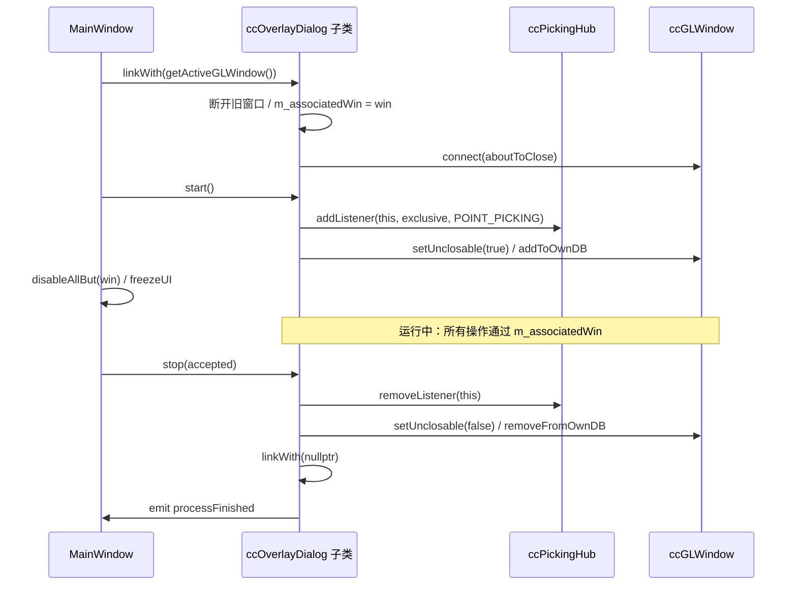
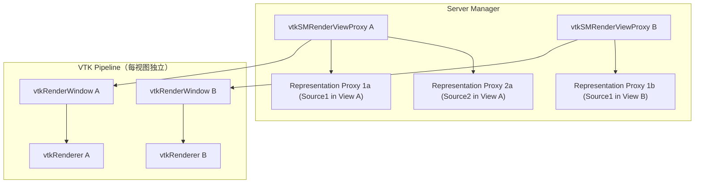
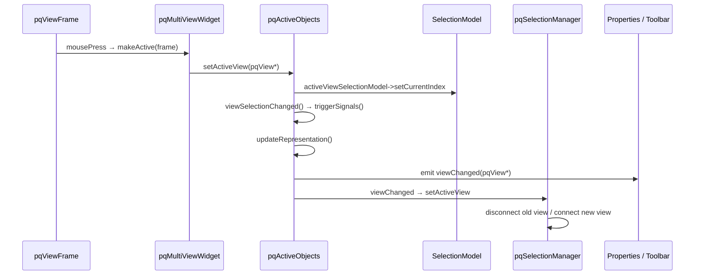
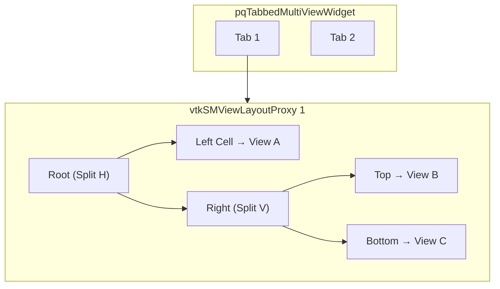
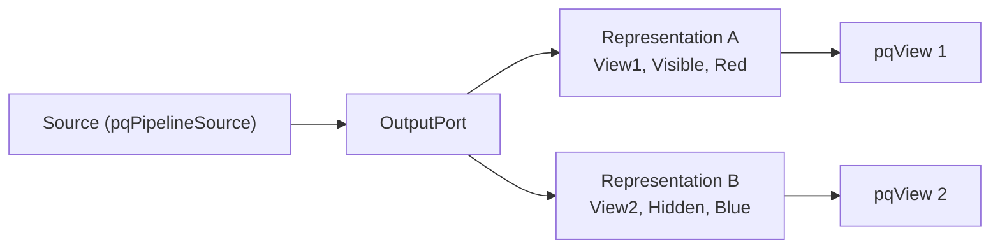
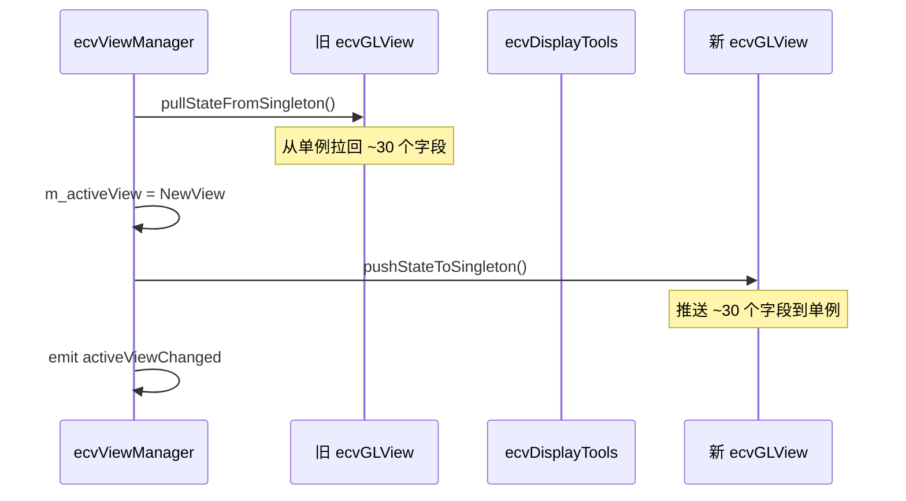
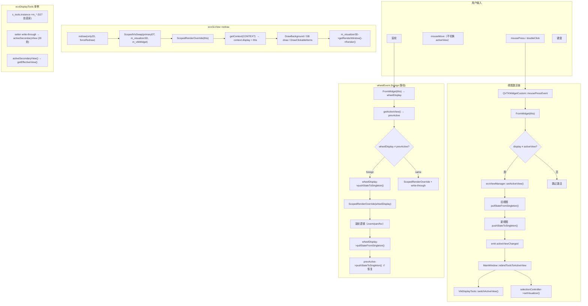

# 多窗口可视化范式深度剖析：CloudCompare vs ParaView vs ACloudViewer

本文档基于本地源码深度审计，供 **ACloudViewer** 多窗口重构与模块适配参考。

- CloudCompare：`/home/ludahai/develop/code/github/CloudCompare`
- ParaView：`/home/ludahai/develop/code/github/ParaView`
- ACloudViewer：本仓库（`ecvViewManager` / `ecvGLView` / `ecvDisplayTools` / `QVTKWidgetCustom`）

**配套文档：**
- **`multi-window-refactor-roadmap-Vtk-vs-CC.md`**：分阶段重构方案与执行计划
- **`audit-TheInstance-m_-members.md`**：单例直读全量扫描
- **`multi-window-paraview-alignment-design.md`**：ParaView ↔ ACloudViewer 全面对齐设计文档（15 维度对比 + Phase M–N 重构方案）

---

## 1. 核心设计哲学对比

| 维度 | CloudCompare | ParaView | ACloudViewer（当前） |
|------|-------------|----------|---------------------|
| **状态归属** | 每窗口一套完整状态（相机/拾取/交互/GL资源），**无全局单例** | 每 View 一个 Proxy（独立属性/RenderWindow/Representation），**状态由 Proxy 隔离** | **单例 `ecvDisplayTools` 持有全局状态**，通过 push/pull/ScopedSwap 临时切换 |
| **窗口抽象** | `ccGLWindow : QOpenGLWidget + ccGLWindowInterface` | `pqView → vtkSMViewProxy → vtkRenderWindow` | `ecvGLView`（VTK后端）+ 旧 `ecvDisplayTools` 单例 |
| **活动视图** | `QMdiArea::activeSubWindow()` + `FromWidget` | `pqActiveObjects::activeView()` + SelectionModel | `ecvViewManager::getActiveView()` + push/pull |
| **多窗口隔离** | **天然隔离**：每窗口独立 OpenGL 上下文/FBO/Shader | **Proxy 隔离**：每视图独立 RenderWindow/Renderer | **模拟隔离**：ScopedVisSwap + ScopedRenderOverride + write-through |
| **拾取** | `ccPickingHub` 跟踪 MDI 激活窗口 | `pqSelectionManager` 跟踪 `activeView` | 单例上的 `doPicking` + foreign wheel 补丁 |
| **对象显示** | `m_currentDisplay` 一对一绑定，`draw()` 中 `context.display == this` 过滤 | 每 (Source, View) 对一个 Representation Proxy | `ecvDisplayTools` 是唯一 display 实例，副视图通过 ScopedRenderOverride "模拟" |

---

## 2. CloudCompare 多窗口系统深度剖析

### 2.1 类层次与文件索引

```
ccGLWindow : QOpenGLWidget, ccGLWindowInterface
    ├── ccGLWindowInterface（~7000行核心逻辑）
    │   ├── ccViewportParameters    m_viewportParams    // 独立相机/投影
    │   ├── ccGLWindowSignalEmitter m_signalEmitter     // 独立信号发射器
    │   ├── m_fbo / m_fbo2 / m_pickingFbo              // 独立 FBO
    │   ├── m_activeShader / m_colorRampShader          // 独立 Shader
    │   ├── m_globalDBRoot / m_winDBRoot                // 共享场景 + 窗口私有 DB
    │   ├── m_interactionFlags / m_pickingMode          // 独立交互状态
    │   └── m_uniqueID                                  // 唯一标识
    └── ccGLWindowSignalEmitter
        ├── itemPicked / itemPickedFast                 // 拾取事件
        ├── viewMatRotated / perspectiveStateChanged    // 相机事件
        ├── leftButtonClicked / mouseMoved              // 输入事件
        ├── drawing3D                                   // 渲染钩子
        └── aboutToClose                                // 生命周期
```

| 文件 | 路径 | 行数 |
|------|------|------|
| ccGLWindowInterface.h | `libs/qCC_glWindow/include/ccGLWindowInterface.h` | ~1575 |
| ccGLWindowInterface.cpp | `libs/qCC_glWindow/src/ccGLWindowInterface.cpp` | ~7000 |
| ccGLWindow.h/cpp | `libs/qCC_glWindow/include/ccGLWindow.h`, `src/ccGLWindow.cpp` | ~250 |
| ccGLWindowSignalEmitter.h | `libs/qCC_glWindow/include/ccGLWindowSignalEmitter.h` | ~170 |
| ccPickingHub.h/cpp | `libs/CCPluginAPI/include/ccPickingHub.h`, `src/ccPickingHub.cpp` | ~220 |
| ccViewportParameters.h | `libs/qCC_db/include/ccViewportParameters.h` | ~170 |
| mainwindow.cpp | `qCC/mainwindow.cpp` | ~11000 |

### 2.2 每窗口完整状态隔离（核心优势）

每个 `ccGLWindowInterface` 实例拥有 **完全独立** 的状态集：

| 类别 | 成员（代表性） | 作用域 |
|------|--------------|--------|
| **视口/相机** | `m_viewportParams`, `m_viewMatd`, `m_projMatd`, `m_cameraToBBCenterDist` | 完全独立 |
| **交互** | `m_interactionFlags`, `m_pickingMode`, `m_pickRadius` | 完全独立 |
| **GL 资源** | `m_fbo`, `m_fbo2`, `m_pickingFbo`, `m_activeShader`, `m_activeGLFilter` | 完全独立（QOpenGLWidget 自带 GL Context） |
| **场景数据** | `m_globalDBRoot`（共享）, `m_winDBRoot`（窗口私有） | 混合 |
| **唯一标识** | `m_uniqueID`, `windowTitle` | 完全独立 |

**关键代码 — 窗口私有 DB 创建：**

```334:335:/home/ludahai/develop/code/github/CloudCompare/libs/qCC_glWindow/src/ccGLWindowInterface.cpp
m_winDBRoot = new ccHObject(QString("DB.3DView_%1").arg(m_uniqueID));
```

**关键代码 — GL Context 隔离：**

```cpp
// ccGLWindow 继承 QOpenGLWidget，每个实例自动拥有独立 GL Context
// makeCurrent 被删除，强制使用 doMakeCurrent() 确保 FBO 一致性
ccGLWindow::doMakeCurrent() {
    QOpenGLWidget::makeCurrent();
    if (m_activeFbo) m_activeFbo->start();
}
```

### 2.3 绘制管线：per-window context 传递

CloudCompare 的绘制管线通过 `CC_DRAW_CONTEXT` 将 **当前窗口** 传递到每一个 drawable：

```
paintGL() → doPaintGL() → getContext(CONTEXT) → fullRenderingPass(CONTEXT)
                                                    ├── drawBackground()
                                                    ├── draw3D()
                                                    │   ├── m_globalDBRoot->draw(CONTEXT)  // 共享场景
                                                    │   └── m_winDBRoot->draw(CONTEXT)     // 窗口私有
                                                    └── compositing / foreground
```

**关键代码 — context 注入窗口身份：**

```1801:1808:/home/ludahai/develop/code/github/CloudCompare/libs/qCC_glWindow/src/ccGLWindowInterface.cpp
void ccGLWindowInterface::getContext(CC_DRAW_CONTEXT& CONTEXT)
{
    CONTEXT.glW              = glWidth();
    CONTEXT.glH              = glHeight();
    CONTEXT.devicePixelRatio = static_cast<float>(getDevicePixelRatio());
    CONTEXT.display          = this;          // ← 窗口身份
    CONTEXT.qGLContext       = getOpenGLContext();
```

**关键代码 — drawable 按窗口过滤绘制：**

```765:766:/home/ludahai/develop/code/github/CloudCompare/libs/qCC_db/src/ccHObject.cpp
bool drawInThisContext = ((m_visible || m_selected) && m_currentDisplay == context.display);
```

**设计启示：** 每个对象通过 `m_currentDisplay` 绑定到唯一窗口，绘制时通过 `context.display` 匹配，**零全局状态查询**。

### 2.4 MDI 窗口管理与激活链



**创建 3D 视图 (`new3DViewInternal`)：**

1. `createGLWindow(view3D, viewWidget)` — 创建新的 `ccGLWindow`
2. `m_mdiArea->addSubWindow(viewWidget)` — 加入 MDI 容器
3. `view3D->setSceneDB(m_ccRoot->getRootEntity())` — **所有视图共享同一场景根**
4. 连接 selection、camera echo、`aboutToClose` 等信号
5. 设置 `WA_DeleteOnClose`

**关闭视图：**
- `closeActiveSubWindow()` → Qt `close()` → `prepareWindowDeletion()`
- `m_ccRoot->getRootEntity()->removeFromDisplay_recursive(glWindow)` — 清理对象显示绑定

### 2.5 ccPickingHub：多窗口拾取隔离



**设计启示：**
- 拾取事件 **始终** 来自 MDI 激活窗口
- 窗口切换时 **断开旧窗口 → 连接新窗口**，不存在信号串扰
- 工具通过 `ccPickingListener` 接口注册，**不直接持有窗口引用**

### 2.6 绘制管线完整流程（per-window 自包含）

CC 的绘制管线是理解 "天然隔离" 的核心——每一步都从 `this` 实例取状态，**零全局查询**：

```
fullRenderingPass(CONTEXT, renderingParams)
│
├── 1. bindFBO(currentFBO)               ← 本窗口的 m_fbo（stereo 右眼用 m_fbo2）
│
├── 2. drawBackground()                  ← 清屏、渐变；LOD 续帧不清
│
├── 3. draw3D(CONTEXT)
│     ├── glPointSize(m_viewportParams.defaultPointSize)  ← 本窗口
│     ├── glLineWidth(m_viewportParams.defaultLineWidth)  ← 本窗口
│     ├── setStandardOrthoCenter()
│     ├── m_activeShader->bind()         ← 本窗口 Shader
│     ├── modelViewMat = getModelViewMatrix()    ← 从本窗口 m_viewportParams 计算
│     ├── projectionMat = getProjectionMatrix()  ← 同上
│     ├── glLoadMatrixd(projectionMat)
│     ├── glLoadMatrixd(modelViewMat)
│     ├── m_globalDBRoot->draw(CONTEXT)  ← 共享场景（CONTEXT.display==this 过滤）
│     ├── m_winDBRoot->draw(CONTEXT)     ← 窗口私有 DB
│     ├── drawPivot()
│     └── emit drawing3D()              ← 扩展点（LOD level 0 时）
│
├── 4. bindFBO(nullptr)                  ← 解绑 FBO
├── 5. m_activeGLFilter->shade(...)      ← 后处理（仅非 stereo，本窗口 filter）
├── 6. DisplayTexture2DPosition(screenTex)  ← Blit 到屏幕
│
└── 7. drawForeground()                  ← 2D 叠加层
```

**FBO per-window 管理：**

```6211:6246:/home/ludahai/develop/code/github/CloudCompare/libs/qCC_glWindow/src/ccGLWindowInterface.cpp
bool ccGLWindowInterface::initFBO(int w, int h)
{
    doMakeCurrent();
    if (!initFBOSafe(m_fbo, w, h)) { /* 失败则禁用 FBO/LOD */ }
    // stereo 右眼需要 m_fbo2
    if (stereo_NVIDIA_or_generic) {
        initFBOSafe(m_fbo2, w, h);
    }
    deprecate3DLayer();
    return true;
}
```

`m_pickingFbo` 在首次拾取时按需创建（`startOpenGLPicking` 中 `initFBOSafe`）。

**LOD per-window：** `m_currentLODState` 是实例成员，`getContext` 从 GUI 参数设置 decimation 策略，`draw3D` 后通过定时器 `renderNextLODLevel` 递进。

### 2.7 工具/对话框的窗口绑定

CC 的工具绑定模式有两个关键设计：**显式 `linkWith`** 和 **冻结其他窗口**。

**`ccOverlayDialog::linkWith` — 完整实现：**

```50:90:/home/ludahai/develop/code/github/CloudCompare/libs/CCPluginAPI/src/ccOverlayDialog.cpp
bool ccOverlayDialog::linkWith(ccGLWindowInterface* win)
{
    if (m_processing) return false;       // 运行中不能切窗口
    if (m_associatedWin == win) return true;
    if (m_associatedWin) {
        // 移除旧窗口的 event filter
        foreach (QWidget* w, QApplication::topLevelWidgets())
            w->removeEventFilter(this);
        m_associatedWin->signalEmitter()->disconnect(this);
        m_associatedWin = nullptr;
    }
    m_associatedWin = win;
    if (m_associatedWin) {
        // 安装 event filter
        foreach (QWidget* w, QApplication::topLevelWidgets())
            w->installEventFilter(this);
        connect(m_associatedWin->signalEmitter(),
                &ccGLWindowSignalEmitter::aboutToClose,
                this, &ccOverlayDialog::onLinkedWindowDeletion);
    }
    return true;
}
```

**工具运行时冻结其他窗口：**

```cpp
// MainWindow::activateTracePolylineMode()
m_tplTool->linkWith(getActiveGLWindow());
freezeUI(true);                  // 冻结 UI
disableAllBut(win);              // 禁用其他所有 MDI 子窗口
if (!m_tplTool->start())
    deactivateTracePolylineMode(false);
```

这意味着用户在工具运行时 **不能** 切换到其他 3D 窗口，从根本上避免了工具状态串窗。

**工具私有 DB（OwnDB）：** `ccTracePolylineTool` 的 polyline tip 通过 `addToOwnDB` 添加到 **窗口私有 DB**，只在绑定的窗口中可见，stop 时 `removeFromOwnDB`。

**插件 API：**

```cpp
class ccMainAppInterface {
    virtual ccGLWindowInterface* getActiveGLWindow() = 0;
    virtual ccPickingHub* pickingHub() = 0;
    virtual void registerOverlayDialog(ccOverlayDialog* dlg, Qt::Corner pos) { }
    // ...
};
```

**工具绑定完整生命周期：**



---

## 3. ParaView 多窗口系统深度剖析

### 3.1 类层次与文件索引

```
pqProxy
  └── pqView                        // 每 View 一个 vtkSMViewProxy
        └── pqRenderViewBase
              └── pqRenderView      // 3D 渲染视图

vtkSMProxy
  └── vtkSMViewProxy               // View 的 Server Manager 代理
        └── vtkSMRenderViewProxy    // 拥有独立 vtkRenderWindow

vtkSMViewLayoutProxy                // KD-tree 布局（split/fraction）

pqActiveObjects                     // 活动对象协调器（单例但事件驱动）
pqSelectionManager                  // 选择管理（跟踪 activeView）
pqLinksModel / vtkSMCameraLink      // 相机联动
```

| 文件 | 路径 | 核心内容 |
|------|------|----------|
| pqView.h/cxx | `Qt/Core/pqView.h`, `pqView.cxx` | View Qt 封装 |
| pqRenderView.h/cxx | `Qt/Core/pqRenderView.h`, `pqRenderView.cxx` | 3D 渲染特化 |
| pqMultiViewWidget.h/cxx | `Qt/Components/pqMultiViewWidget.h`, `.cxx` | 分割布局 UI |
| pqActiveObjects.h/cxx | `Qt/Components/pqActiveObjects.h`, `.cxx` | 活动对象管理 |
| pqSelectionManager.h/cxx | `Qt/Components/pqSelectionManager.h`, `.cxx` | 选择管理 |
| pqLinksModel.h/cxx | `Qt/Core/pqLinksModel.h`, `.cxx` | 链接（Camera/Proxy/Selection） |
| vtkSMViewProxy.h | `Remoting/Views/vtkSMViewProxy.h` | View Proxy 基类 |
| vtkSMRenderViewProxy.h | `Remoting/Views/vtkSMRenderViewProxy.h` | Render View Proxy |
| vtkSMViewLayoutProxy.h | `Remoting/Views/vtkSMViewLayoutProxy.h` | 布局 Proxy |
| vtkSMCameraLink.h/cxx | `Remoting/Views/vtkSMCameraLink.h`, `.cxx` | 相机联动 |

### 3.2 Proxy 模式实现状态隔离（核心优势）

ParaView 的核心洞察：**每个 View 是一个独立的 Proxy 对象**，拥有独立的属性集和渲染目标。



**关键隔离点：**

1. **每 View 独立 RenderWindow**：`vtkSMRenderViewProxy::GetRenderWindow()` 返回该 View 专属的窗口
2. **每 (Source, View) 独立 Representation**：同一数据源在不同 View 中是 **不同的** Representation Proxy
3. **渲染调用视图限定**：`pqView::forceRender()` → `getViewProxy()->StillRender()` 只渲染 **当前** View

```134:144:/home/ludahai/develop/code/github/ParaView/Qt/Core/pqView.cxx
vtkSMViewProxy* pqView::getViewProxy() const
{
  return vtkSMViewProxy::SafeDownCast(this->getProxy());
}
```

### 3.3 pqActiveObjects：事件驱动的活动对象协调

ParaView 的 `pqActiveObjects` 不是简单的全局变量，而是基于 **SelectionModel** 的事件协调器：

| 活动概念 | API | 含义 |
|---------|-----|------|
| Active View | `activeView()` / `setActiveView()` | 当前视图，从 `activeViewSelectionModel` 派生 |
| Active Source | `activePipelineProxy()` | 当前管线源 |
| Active Port | `activePort()` | 当前输出端口 |
| Active Representation | `activeRepresentation()` | = `port->getRepresentation(activeView())` |
| Active Layout | `activeLayout()` | 从 activeView 或当前 Tab 推导 |

**信号链路（View 切换时）：**



**与 ACloudViewer 的对比：**
- ParaView 的 `pqActiveObjects` 通过 **SelectionModel** 和 **triggerSignals** 确保状态一致性
- ACloudViewer 的 `ecvViewManager` 通过 **push/pull** 同步单例，机制更脆弱

### 3.4 布局管理：KD-Tree + Tab



- 每个 Tab 对应一个 `vtkSMViewLayoutProxy`
- 布局是 **KD-Tree**：每个节点要么是 Split（H/V + fraction），要么是 Leaf（View）
- **布局持久化在 SM 层**，不仅仅是 Qt Widget 状态

### 3.5 Camera Link：可选的视图同步（深度剖析）

**同步的属性列表（`vtkSMCameraLink::CameraProperties`）：**

```90:101:/home/ludahai/develop/code/github/ParaView/Remoting/Views/vtkSMCameraLink.cxx
std::set<std::pair<std::string, std::string>> vtkSMCameraLink::CameraProperties()
{
  return {
    { "CameraPositionInfo", "CameraPosition" },
    { "CameraViewAngleInfo", "CameraViewAngle" },
    { "CameraFocalPointInfo", "CameraFocalPoint" },
    { "CameraViewUpInfo", "CameraViewUp" },
    { "CenterOfRotation", "CenterOfRotation" },
    { "CameraParallelScaleInfo", "CameraParallelScale" },
    { "RotationFactor", "RotationFactor" },
    { "CameraParallelProjection", "CameraParallelProjection" },
    { "CameraFocalDiskInfo", "CameraFocalDisk" },
    { "CameraFocalDistanceInfo", "CameraFocalDistance" },
    { "InteractionMode", "InteractionMode" }
  };
}
```

**同步时机（关键设计）：** 不是每次属性修改时同步，而是 **渲染结束后** 触发：


**`CopyProperties` 实现：** 遍历属性对，从 caller 的 `*Info` 属性复制到每个 OUTPUT proxy 的目标属性：

```172:190:/home/ludahai/develop/code/github/ParaView/Remoting/Views/vtkSMCameraLink.cxx
void vtkSMCameraLink::CopyProperties(vtkSMProxy* caller)
{
  for (const auto& propPair : vtkSMCameraLink::CameraProperties())
  {
    vtkSMProperty* fromProp = caller->GetProperty(propPair.first.c_str());
    for (int i = 0; i < numObjects; i++)
    {
      vtkSMProxy* p = this->GetLinkedProxy(i);
      if (p != caller && this->GetLinkedObjectDirection(i) == vtkSMLink::OUTPUT)
      {
        vtkSMProperty* toProp = p->GetProperty(propPair.second.c_str());
        toProp->Copy(fromProp);
        p->UpdateProperty(propPair.second.c_str());
      }
    }
  }
}
```

**`LinkProxies` — 双向绑定：** 两个 proxy 互为 INPUT + OUTPUT：

```62:68:/home/ludahai/develop/code/github/ParaView/Remoting/ServerManager/vtkSMProxyLink.cxx
void vtkSMProxyLink::LinkProxies(vtkSMProxy* proxy1, vtkSMProxy* proxy2)
{
  this->AddLinkedProxy(proxy1, vtkSMLink::INPUT);
  this->AddLinkedProxy(proxy2, vtkSMLink::OUTPUT);
  this->AddLinkedProxy(proxy2, vtkSMLink::INPUT);
  this->AddLinkedProxy(proxy1, vtkSMLink::OUTPUT);
}
```

**特殊处理：**
- `CenterOfRotation` 通过 `PropertyModified` 触发非交互式 `UpdateViews`
- `ResetCamera` 仅 `CopyProperties`，不触发对端渲染
- 防重入：`this->Internals->Updating` 标志避免链式触发
- **`SynchronizeInteractiveRenders`** 默认开启（构造函数中设为 1）

**PIP 叠加（pqInteractiveViewLink）：** 纯 Camera Link 之外，还可以创建画中画叠加——在 display view 的 `RenderEvent` 中从 linked view 读取像素并合成到一个矩形区域。这是 **图像级** 合成，不影响 Camera Link 的属性同步。

**对 ACloudViewer 的启示：**
1. 相机同步应在 **渲染后** 而非实时
2. 属性列表可配（哪些相机属性需要同步）
3. interactive vs still 区分可避免交互卡顿
4. 已有的 `VtkCameraLink` 可对齐此模式

### 3.6 per-view Representation（深度剖析）

ParaView 解决了一个 CC 不支持的需求：**同一数据源在不同视图中有不同表现**。

**核心设计：一个 Representation = 一个 (Source Port, View) 对**



**按 View 查找 Representation：**

```234:247:/home/ludahai/develop/code/github/ParaView/Qt/Core/pqOutputPort.cxx
pqDataRepresentation* pqOutputPort::getRepresentation(pqView* view) const
{
  Q_FOREACH (pqDataRepresentation* repr, this->Internal->Representations)
  {
    if (repr && repr->getView() == view)
      return repr;
  }
  return nullptr;
}
```

**Representation 绑定到 View 的过程（`pqView::onRepresentationsChanged`）：**

```305:358:/home/ludahai/develop/code/github/ParaView/Qt/Core/pqView.cxx
void pqView::onRepresentationsChanged()
{
    // 同步 SM Representations 属性到 PQ 列表
    for (每个 SM proxy in view->Representations) {
        pqRepresentation* repr = findItem(proxy);
        if (新增) {
            repr->setView(this);           // friend 方法，绑定到本 View
            connect(repr, visibilityChanged, this, ...);
            emit representationAdded(repr);
        }
    }
    for (每个移除的 repr) {
        repr->setView(nullptr);            // 解绑
        emit representationRemoved(repr);
    }
}
```

**可见性是 per-view 的：** `pqRepresentation::setVisible` 写该 proxy 的 `Visibility` 属性。两个 Representation 是不同 proxy，各自有独立的 `Visibility`。

**SM 层创建：** `vtkSMParaViewPipelineControllerWithRendering::Show` — 如果 View 中已有该 Source 的 Representation 则仅切 Visibility=1；否则 `CreateDefaultRepresentation` 新建 proxy 并 `Add` 到 View 的 Representations 列表。

**对 ACloudViewer 的启示：** 当前 `m_currentDisplay` 是一对一绑定。如果未来需要同一对象在多个窗口有不同显示属性（颜色、可见性等），需要引入类似的 per-view representation 层。但这是 **阶段 F（进阶功能）**，不是隔离重构的前提。

### 3.7 Selection 的视图绑定

**Selection（per-view 入口，global 数据）：**
- `pqSelectionManager` 监听 `activeView` 变化，**disconnect 旧 view / connect 新 view**
- 拾取入口是视图特定的：`pqRenderView::pick(pos)` → `getRenderViewProxy()->Pick(x, y)`
- 选择数据本身是 pipeline-global 的（通过 `vtkSMSelectionLink`）

---

## 4. ACloudViewer 当前架构深度审计

### 4.1 单例状态分布（问题根源）

```
ecvDisplayTools（单例 s_tools.instance）
├── 视口/相机：m_viewportParams, m_glViewport, m_viewMatd, m_projMatd
├── 交互/拾取：m_interactionFlags, m_pickingMode, m_pickRadius, m_activeItems
├── 鼠标状态：m_lastMousePos, m_mouseMoved, m_mouseButtonPressed
├── 显示：m_hotZone, m_clickableItems, m_messagesToDisplay
├── 渲染：m_visualizer3D, m_vtkWidget, m_visualizer2D
├── Bubble/Pivot：m_bubbleViewModeEnabled, m_pivotVisibility
├── 光照：m_sunLightPos, m_customLightPos
└── 场景：m_globalDBRoot, m_winDBRoot
```

**单例访问热点统计（最新扫描）：**

| 模式 | 位置 | 访问次数 | 风险 |
|------|------|---------|------|
| `s_tools.instance->m_*` | `ecvDisplayTools.cpp` | **527** | 高：绘制/拾取/相机全路径 |
| `m_tools->m_*` | `QVTKWidgetCustom.cpp` | **163** | 高：所有鼠标/键盘/滚轮事件 |
| `TheInstance()->m_*` | `ecvDisplayTools.h` | **35** | 中：内联 getter/setter |
| `TheInstance()->m_*` | `ecvDisplayTools.cpp` | **1** | 低 |
| `TheInstance()->m_*` | `MainWindow.cpp` | **2** | 低：`MainWindow::TheInstance()->m_mdiArea` |
| `activeSecondaryView()` | `ecvDisplayTools.cpp` | **20** | 缓解措施，覆盖不完全 |

### 4.2 当前缓解机制与其局限

#### push/pull 状态同步



**push/pull 覆盖字段（ecvGLView.cpp L394-523）：**

| 同步 | 遗漏 |
|------|------|
| interaction flags, picking mode/radius | **`m_activeItems`**（2D interactor 列表） |
| mouse state (pos, moved, pressed) | **`m_messagesToDisplay`** |
| hotZone, clickable items | **`m_viewMatd` / `m_projMatd`**（CPU 相机矩阵） |
| bubble view, pivot, rotation lock | **`m_autoPivotCandidate`** |
| viewport params (完整拷贝) | **`m_diagStrings`** |
| light, picking aux, click timer | **`m_captureMode`** |

#### ScopedVisSwap（VTK 管线切换）

**覆盖：** `m_visualizer3D`, `m_vtkWidget`, `m_visualizer2D`, `m_glViewport`（临时）
**遗漏：** `m_interactionFlags`, `m_pickingMode`, `m_activeItems`, `m_messagesToDisplay`, 所有 mouse state

#### ScopedRenderOverride（有效视图覆盖）

**覆盖：** `getEffectiveView()` 返回渲染视图
**遗漏：** 仅对调用 `getEffectiveView()` 的代码路径有效；直读 `s_tools.instance->m_*` 的代码 **完全绕过**

#### write-through（双写）

**覆盖（部分）：** `SetPointSize`, `SetLineWidth`, `SetDisplayParameters`
**遗漏：** `SetViewportDefaultPointSize`, `SetCameraClip`, `SetCameraFovy` 等仅写单例

### 4.3 状态泄漏场景（已确认）

| 场景 | 原因 | 影响 |
|------|------|------|
| **GetContext 尺寸错误** | `glW`/`glH` 从 primary `m_glViewport` 取值，即使 `CONTEXT.display` 是副视图 | 文字/2D 元素位置偏移 |
| **副视图 GlWidth/GlHeight 可能陈旧** | 非 ScopedRenderOverride 期间，`TheInstance()->m_glViewport` 来自上一次 push 的视图 | 投影计算错误 |
| **m_activeItems 全局共享** | 2D 标签/交互器 "鼠标下方" 列表不在 push/pull 中 | 窗口 A 的 hover 影响窗口 B |
| **相机 CPU 镜像不同步** | `m_viewMatd`/`m_projMatd` 更新仅在 VTK+单例路径，ecvGLView 的副本可能滞后 | 投影/反投影计算偏差 |
| **SetCameraClip/SetCameraFovy 仅写单例** | header 内联函数写 `TheInstance()->m_viewportParams`，不更新 ecvGLView 副本 | 副视图近远裁面/FOV 在下次 pull 前可能被覆盖 |
| **rebindToolsToActiveView 遗漏** | 新代码路径未触发 rebind，VTK picking 指向错误 VtkVis | 拾取在错误窗口中执行 |
| **deferred picking timer 是单例全局** | `m_deferredPickingTimer` 和 `doPicking()` 使用单例 `m_lastMousePos` | 切换窗口后延迟拾取可能用旧位置 |

### 4.4 端到端管线（完整版）



---

## 5. 三者对比：隔离机制评估

### 5.1 隔离完备性

| 维度 | CC 得分 | PV 得分 | ACV 得分 | ACV 问题 |
|------|--------|--------|---------|----------|
| 相机/视口 | ★★★★★ | ★★★★★ | ★★★☆☆ | push/pull 有延迟窗口 |
| GL 资源 | ★★★★★ | ★★★★★ | ★★★★☆ | ScopedVisSwap 覆盖了核心，但不全面 |
| 拾取 | ★★★★★ | ★★★★★ | ★★★☆☆ | m_activeItems 全局，deferred timer 全局 |
| 交互状态 | ★★★★★ | ★★★★★ | ★★☆☆☆ | 163 处 m_tools->m_ 直读 |
| 渲染管线 | ★★★★★ | ★★★★★ | ★★★★☆ | ScopedVisSwap + ScopedRenderOverride 有效但脆弱 |
| 工具/对话框 | ★★★★★ | ★★★★☆ | ★★☆☆☆ | 仍有工具依赖单例全局状态 |

### 5.2 从 CC/PV 可借鉴的模式

| 模式 | CC 来源 | PV 来源 | ACloudViewer 建议 |
|------|---------|---------|-------------------|
| **窗口拥有完整状态** | `ccGLWindowInterface` 成员集 | `vtkSMViewProxy` 属性集 | `ecvGLView` 应成为状态的 **唯一真相源** |
| **context.display 身份注入** | `getContext()` 设置 `display = this` | N/A（proxy 天然隔离） | 已实现，但 `ecvDisplayTools::GetContext` 仍读单例尺寸 |
| **拾取跟踪活动窗口** | `ccPickingHub::onActiveWindowChanged` | `pqSelectionManager::setActiveView` | 已有 `ccPickingHub`，需确保与 ecvViewManager 同步 |
| **工具显式绑定窗口** | `ccOverlayDialog::linkWith(win)` | 工具订阅 `pqActiveObjects::viewChanged` | 需要系统性改造工具绑定 |
| **可选的相机联动** | 无（独立） | `vtkSMCameraLink` | 已有 `VtkCameraLink`，模式正确 |
| **shared scene + per-view display** | `setSceneDB` 共享 + `m_currentDisplay` 过滤 | `Representations` per-view | 当前 `m_currentDisplay` 指向单例 |

---

## 6. 源码索引

### CloudCompare

| 主题 | 文件 | 关键行/函数 |
|------|------|------------|
| 窗口接口 | `libs/qCC_glWindow/include/ccGLWindowInterface.h` | 类定义 L59-1575 |
| 窗口实现 | `libs/qCC_glWindow/src/ccGLWindowInterface.cpp` | `getContext` L1801, `draw3D` L4841, `fullRenderingPass` L5171 |
| 窗口 Widget | `libs/qCC_glWindow/src/ccGLWindow.cpp` | 构造 L31, `doMakeCurrent` L77 |
| 信号发射器 | `libs/qCC_glWindow/include/ccGLWindowSignalEmitter.h` | L35-169 |
| MDI + Hub | `qCC/mainwindow.cpp` | MDI L289, `getActiveGLWindow` L6204, `new3DViewInternal` L6282 |
| PickingHub | `libs/CCPluginAPI/src/ccPickingHub.cpp` | `onActiveWindowChanged` L58, `processPickedItem` L102 |
| Drawable 过滤 | `libs/qCC_db/src/ccHObject.cpp` | `drawInThisContext` L765 |
| ViewportParams | `libs/qCC_db/include/ccViewportParameters.h` | 成员 L123-166 |
| 工具绑定 | `libs/CCPluginAPI/src/ccOverlayDialog.cpp` | `linkWith` L50 |
| 插件 API | `libs/CCPluginAPI/include/ccMainAppInterface.h` | L45-248 |

### ParaView

| 主题 | 文件 | 关键行/函数 |
|------|------|------------|
| View 基类 | `Qt/Core/pqView.h`, `pqView.cxx` | `getViewProxy` L134, `forceRender` L212 |
| RenderView | `Qt/Core/pqRenderView.h`, `pqRenderView.cxx` | `pick` L693 |
| 多视图 Widget | `Qt/Components/pqMultiViewWidget.cxx` | `makeActive` L537, `reload` L615 |
| 活动对象 | `Qt/Components/pqActiveObjects.h`, `.cxx` | `setActiveView` L361, `triggerSignals` L100 |
| 选择管理 | `Qt/Components/pqSelectionManager.h`, `.cxx` | `setActiveView` L96 |
| 相机链接 | `Qt/Core/pqLinksModel.cxx` | `addCameraLink` L700 |
| Links Manager | `Qt/Components/pqLinksManager.cxx` | L59-73 |
| Camera Link SM | `Remoting/Views/vtkSMCameraLink.cxx` | `CopyProperties` L172 |
| Layout Proxy | `Remoting/Views/vtkSMViewLayoutProxy.h` | KD-Tree L44-116 |
| View Proxy | `Remoting/Views/vtkSMViewProxy.h` | `StillRender` L55, `FindRepresentation` L105 |

### ACloudViewer

| 主题 | 文件 | 关键行/函数 |
|------|------|------------|
| 视图管理 | `libs/CV_db/include/ecvViewManager.h`, `src/ecvViewManager.cpp` | `setActiveView` L29, `ScopedRenderOverride` L40 |
| 副视图 | `libs/VtkEngine/Visualization/ecvGLView.h`, `.cpp` | `redraw` L108, `pushState` L394, `pullState` L460 |
| 单例委托 | `libs/CV_db/src/ecvDisplayTools.cpp` | `activeSecondaryView` L67, `GetContext` L2518 |
| VTK 管线切换 | `libs/VtkEngine/Visualization/VtkDisplayTools.cpp` | `ScopedVisSwap` L197, `switchActiveView` L114 |
| 交互激活 | `libs/VtkEngine/VTKExtensions/Widgets/QVTKWidgetCustom.cpp` | `wheelEvent` L609, `mousePressEvent` L520 |
| 主窗口 | `app/MainWindow.cpp` | `rebindToolsToActiveView` L2455, `new3DView` L2936 |

---

## 7. 文档维护说明

- 上游 **CloudCompare / ParaView** 版本升级后，优先重新核对关键行号
- ACloudViewer 代码变更后运行 `grep -rn 'TheInstance()->m_\|s_tools.instance->m_\|m_tools->m_' --include='*.cpp' --include='*.h'` 更新统计
- 本文档与 `multi-window-refactor-roadmap-Vtk-vs-CC.md` 和 `audit-TheInstance-m_-members.md` 配套维护

---

*文档用途：多窗口系统架构深度对比与重构参考；实现以各仓库源码为准。*
*更新日期：2026-04-24*
