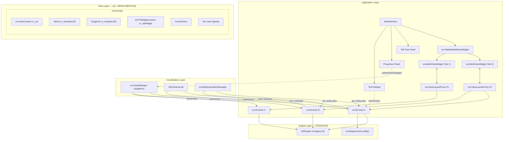
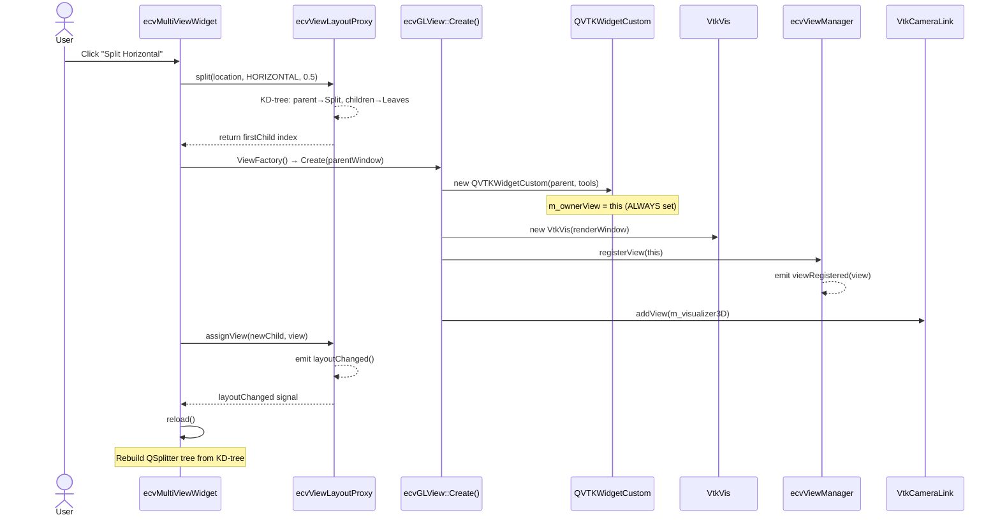
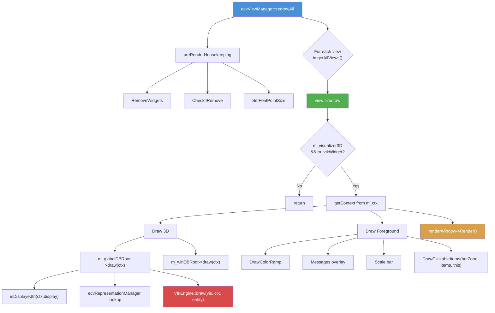
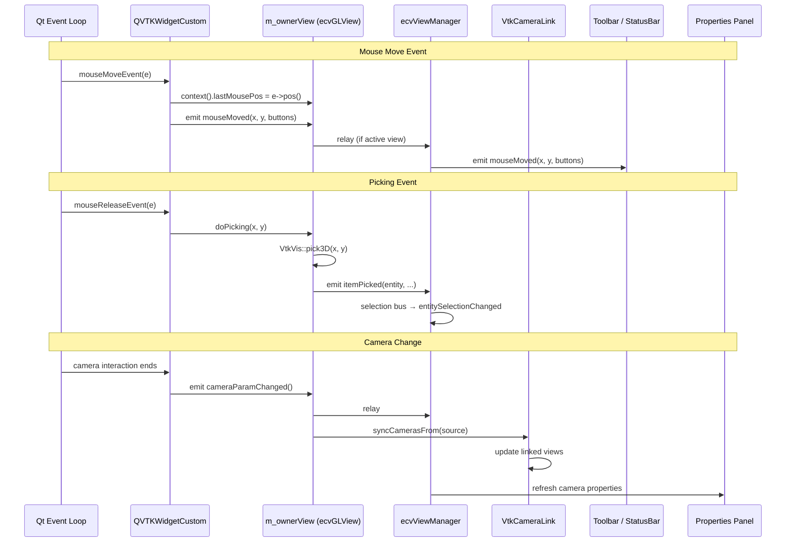
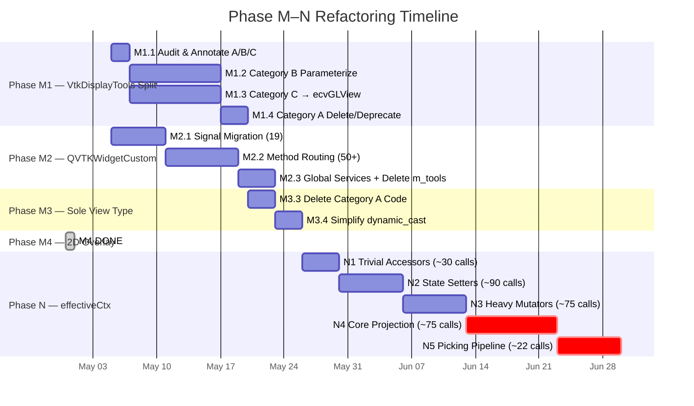
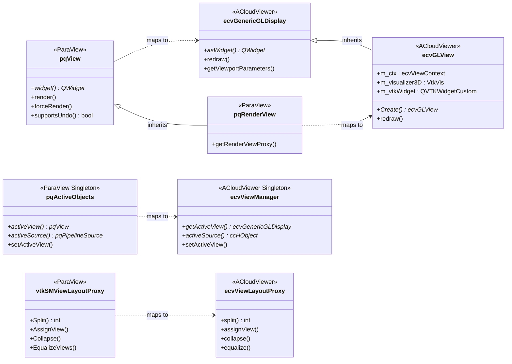

# ACloudViewer ↔ ParaView Multi-Window Rendering System — Alignment Redesign

> Date: 2026-04-30
> Version: 1.0
> Author: Automated Architecture Audit
>
> **References**:
> - ParaView source: `/home/ludahai/develop/code/github/ParaView`
> - ACloudViewer source: `/home/ludahai/develop/code/github/ACloudViewer`
> - Prior docs: `multi-window-refactor-roadmap-Vtk-vs-CC.md`, `singleton-removal-migration-plan.md`, `multi-window-views.md`, `multi-window-paradigms-CloudCompare-ParaView.md`

---

## Table of Contents

1. [Executive Summary](#1-executive-summary)
2. [Architectural Comparison Matrix](#2-architectural-comparison-matrix)
   - [2.1 View Object Model](#21-view-object-model)
   - [2.2 Layout & Tab System](#22-layout--tab-system)
   - [2.3 Active Objects Coordination](#23-active-objects-coordination)
   - [2.4 Per-View Representation](#24-per-view-representation)
   - [2.5 Camera Link / Synchronization](#25-camera-link--synchronization)
   - [2.6 Selection Management](#26-selection-management)
   - [2.7 View Frame & Toolbar](#27-view-frame--toolbar)
   - [2.8 Rendering Pipeline](#28-rendering-pipeline)
   - [2.9 Session Persistence](#29-session-persistence)
   - [2.10 View Lifecycle](#210-view-lifecycle)
   - [2.11 Pipeline Browser ↔ DB Tree Integration](#211-pipeline-browser--db-tree-integration)
   - [2.12 Properties Panel & View Properties](#212-properties-panel--view-properties)
   - [2.13 Undo/Redo System](#213-undoredo-system)
   - [2.14 Plugin Multi-View API](#214-plugin-multi-view-api)
   - [2.15 Animation & Multi-View](#215-animation--multi-view)
3. [Completed Alignment (Phase A–L)](#3-completed-alignment-phase-al)
4. [Remaining Gaps & Root Cause Analysis](#4-remaining-gaps--root-cause-analysis)
   - [4.1 GAP-1: VtkDisplayTools Dual Role](#41-gap-1-vtkdisplaytools-dual-role)
   - [4.2 GAP-2: QVTKWidgetCustom m_tools Coupling](#42-gap-2-qvtkwidgetcustom-m_tools-coupling)
   - [4.3 GAP-3: effectiveCtx() Global Resolution](#43-gap-3-effectivectx-global-resolution)
   - [4.4 GAP-4: Per-View Representation VTK Propagation](#44-gap-4-per-view-representation-vtk-propagation)
   - [4.5 GAP-5: View Type Registry](#45-gap-5-view-type-registry)
   - [4.6 GAP-6: Per-View Display Properties Panel](#46-gap-6-per-view-display-properties-panel)
   - [4.7 GAP-7: Per-View Camera Undo/Redo](#47-gap-7-per-view-camera-undoredo)
5. [Target Architecture](#5-target-architecture)
   - [5.1 Component Topology](#51-component-topology)
   - [5.2 Class Responsibility Matrix](#52-class-responsibility-matrix)
   - [5.3 View Creation Flow](#53-view-creation-flow)
   - [5.4 Rendering Pipeline (Target)](#54-rendering-pipeline-target)
   - [5.5 Event / Signal Flow](#55-event--signal-flow)
6. [Refactoring Phases (M–N)](#6-refactoring-phases-mn)
   - [6.1 Phase M1: VtkDisplayTools → VtkEngine](#61-phase-m1-vtkdisplaytools--vtkengine)
   - [6.2 Phase M2: QVTKWidgetCustom Unification](#62-phase-m2-qvtkwidgetcustom-unification)
   - [6.3 Phase M3: ecvGLView as Sole View Type](#63-phase-m3-ecvglview-as-sole-view-type)
   - [6.4 Phase M4: 2D Overlay Pipeline Parameterization](#64-phase-m4-2d-overlay-pipeline-parameterization)
   - [6.5 Phase N: effectiveCtx() Elimination](#65-phase-n-effectivectx-elimination)
   - [6.6 Phase O: Per-View Representation Deep Integration](#66-phase-o-per-view-representation-deep-integration)
7. [Detailed API Migration Tables](#7-detailed-api-migration-tables)
   - [7.1 VtkDisplayTools Member Classification (A/B/C)](#71-vtkdisplaytools-member-classification-abc)
   - [7.2 QVTKWidgetCustom m_tools Reference Map](#72-qvtkwidgetcustom-m_tools-reference-map)
   - [7.3 effectiveCtx() Phased Elimination](#73-effectivectx-phased-elimination)
8. [Risk Matrix & Mitigation](#8-risk-matrix--mitigation)
9. [Timeline & Branch Strategy](#9-timeline--branch-strategy)
10. [Appendix: ParaView ↔ ACloudViewer 1:1 Class Mapping](#10-appendix-paraview--acloudviewer-11-class-mapping)

---

## 1. Executive Summary

ACloudViewer's multi-window rendering system has undergone an extensive refactoring (Phase A through L) to align with ParaView's architecture. The following has been achieved:

| Dimension | Before (2026-04) | After Phase L (2026-04-30) |
|-----------|------------------|---------------------------|
| Layout model | QMdiArea (flat) | KD-tree (`ecvViewLayoutProxy`) |
| Tab system | None | `ecvTabbedMultiViewWidget` |
| Active objects | Implicit singleton | `ecvViewManager` (pqActiveObjects pattern) |
| Per-view state | Singleton `m_primaryCtx` | `ecvViewContext` per `ecvGLView` |
| View isolation | ScopedVisSwap + push/pull | Per-view VtkVis + QVTKWidgetCustom |
| Singleton API | ~1000+ external refs | **9 core infrastructure files** |
| Per-view 2D overlay | Shared hotzone/messages | Independent per `ecvGLView` |

**Remaining work** (Phase M–N) focuses on three structural gaps that prevent full ParaView parity:

1. **VtkDisplayTools dual role** — simultaneously acting as VTK engine service and "primary view"
2. **QVTKWidgetCustom `m_tools` coupling** — ~90+ references to the singleton
3. **`effectiveCtx()` global resolution** — 307 implicit context lookups in `ecvDisplayTools.cpp`

This document provides the comprehensive, actionable redesign plan to close these gaps.

---

## 2. Architectural Comparison Matrix

### 2.1 View Object Model

```
ParaView                              ACloudViewer (Current)
──────────                            ─────────────────────
vtkSMViewProxy                        ecvGenericGLDisplay (interface)
  ├── vtkView (client-side)             ├── ecvGLView (per-view, complete)
  ├── vtkRenderWindow                   │   ├── ecvViewContext m_ctx
  ├── vtkRenderer                       │   ├── VtkVis m_visualizer3D
  ├── vtkCamera                         │   ├── QVTKWidgetCustom m_vtkWidget
  └── Properties (via SM)               │   └── per-view signals
                                        │
pqView (Qt wrapper)                     └── ecvDisplayTools (singleton) ← PROBLEM
  ├── pqRenderView                          ├── VtkDisplayTools (VTK impl)
  ├── widget() → QWidget                   │   ├── m_visualizer3D  ← dual role
  ├── render() / forceRender()             │   ├── m_vtkWidget     ← dual role
  └── supportsUndo()                       │   └── switchActiveView()
                                           └── m_primaryCtx ← singleton state
```

| Aspect | ParaView | ACloudViewer | Gap |
|--------|----------|-------------|-----|
| View class | `pqRenderView` (all views identical) | `ecvGLView` (secondary) vs `VtkDisplayTools` (primary) | **VtkDisplayTools is both engine and view** |
| View proxy | `vtkSMRenderViewProxy` per view | No proxy; `ecvGLView` directly holds VtkVis | Acceptable — ACV doesn't need ServerManager |
| View creation | `pqObjectBuilder::createView()` | `ecvGLView::Create()` + layout `assignView()` | Aligned |
| Per-view state | `vtkSMViewProxy` properties | `ecvViewContext` | Aligned |
| Widget | `pqView::widget()` virtual | `ecvGenericGLDisplay::asWidget()` virtual | Aligned |

### 2.2 Layout & Tab System

| Aspect | ParaView | ACloudViewer | Status |
|--------|----------|-------------|--------|
| Layout model | `vtkSMViewLayoutProxy` (KD-tree, heap-indexed) | `ecvViewLayoutProxy` | **ALIGNED** — identical API |
| Split/Assign/Collapse | `Split(loc, dir, frac)`, `AssignView(loc, view)`, `Collapse(loc)` | `split()`, `assignView()`, `collapse()` | **ALIGNED** |
| Index arithmetic | `GetFirstChild(i) = 2*i+1` | `firstChild(i) = 2*i+1` | **ALIGNED** |
| Layout UI | `pqMultiViewWidget` subscribes to `ConfigureEvent` | `ecvMultiViewWidget` subscribes to `layoutChanged()` | **ALIGNED** |
| Tab container | `pqTabbedMultiViewWidget` listens to SM proxy registration | `ecvTabbedMultiViewWidget` manages layouts directly | **ALIGNED** (no SM layer needed) |
| "+" tab | Creates via `pqObjectBuilder::createLayout()` | Creates via `createTab()` | **ALIGNED** |
| Tab context menu | Rename, Close, Equalize | Rename, Close, Equalize, Popout | **ALIGNED** (ACV has extra Popout) |
| Empty cell UX | `pqEmptyView` "No View" button | `createEmptyCellWidget` "Create Render View" button | **ALIGNED** |
| Equalize | `EqualizeViews(direction)` | `equalize(direction)` | **ALIGNED** |
| Maximize cell | `MaximizeCell(loc)` / `RestoreMaximizedState()` | `maximizeCell(loc)` / `restoreMaximizedState()` | **ALIGNED** |
| Undo/Redo | `BEGIN_UNDO_SET` via `pqUndoStack` | `beginUndoSet()` / `endUndoSet()` (memento) | **ALIGNED** |
| JSON persistence | XML state + proxy locator | `saveState()` / `loadState()` + QSettings | **ALIGNED** |
| Popout | `pqMultiViewWidget::togglePopout()` | `ecvMultiViewWidget::togglePopout()` | **ALIGNED** |
| Fullscreen | F11 (tab) / Ctrl+F11 (active view) | Identical | **ALIGNED** |
| Drag-drop swap | Frame drag swap | `ecvMultiViewFrameManager` drag-drop | **ALIGNED** |

### 2.3 Active Objects Coordination

```
ParaView: pqActiveObjects (singleton)        ACloudViewer: ecvViewManager (singleton)
├── activeView() → pqView*                   ├── getActiveView() → ecvGenericGLDisplay*
├── activeSource() → pqPipelineSource*        ├── activeSource() → ccHObject*
├── activeRepresentation() → pqDataRepr*      ├── activeRepresentation() → ecvViewRepresentation*
├── activeLayout() → vtkSMViewLayoutProxy*    ├── activeLayout() → ecvViewLayoutProxy*
├── activePort() → pqOutputPort*              ├── (no port concept)
├── activeServer() → pqServer*                ├── (single-process, no server)
├── setActiveView(pqView*)                    ├── setActiveView(ecvGenericGLDisplay*)
├── setActiveSource(pqPipelineSource*)        ├── setActiveSource(ccHObject*)
├── triggerSignals() → batch emit             ├── triggerSignals() → batch emit
│                                             │
├── viewChanged(pqView*)                      ├── activeViewChanged(display*, display*)
├── sourceChanged(pqPipelineSource*)          ├── activeSourceChanged(ccHObject*)
├── representationChanged(pqDataRepr*)        ├── activeRepresentationChanged(ecvViewRepr*)
└── selectionChanged(pqProxySelection)        └── entitySelectionChanged(ccHObject*)
```

| Aspect | ParaView | ACloudViewer | Status |
|--------|----------|-------------|--------|
| Singleton coordinator | `pqActiveObjects` | `ecvViewManager` | **ALIGNED** |
| Signal batching | `triggerSignals()` | `triggerSignals()` | **ALIGNED** |
| View change signal | `viewChanged(pqView*)` | `activeViewChanged(old, new)` | **ALIGNED** (ACV provides both old and new) |
| Cached comparison | `CachedView != ActiveView` → emit | `m_cachedView != m_activeView` → emit | **ALIGNED** |
| Representation auto-update | `updateRepresentation()` on view/port change | `updateActiveRepresentation()` | **ALIGNED** |
| Display-tools lifecycle | N/A (no singleton tools) | `initDisplayTools()` / `releaseDisplayTools()` | ACV-specific (needed until Phase M3) |

### 2.4 Per-View Representation

| Aspect | ParaView | ACloudViewer | Status |
|--------|----------|-------------|--------|
| Per-(entity, view) state | `vtkSMRepresentationProxy` | `ecvViewRepresentation` | **PARTIAL** |
| Registry | ProxyManager | `ecvRepresentationManager` | **ALIGNED** |
| Properties | SM properties (color, opacity, visibility, etc.) | `Properties` struct (`opacity`, `pointSize`, `renderMode`, etc.) | **PARTIAL** — declared but not fully propagated to VTK actors |
| Dirty tracking | `MarkModified()` on proxy | `isDirty()` / `setDirty()` | **ALIGNED** |
| Automatic creation | On `pqObjectBuilder::createRepresentation()` | On `ecvRepresentationManager::getOrCreate()` during draw | **ALIGNED** |
| Cleanup on view close | Proxy unregister | `ecvGLView::~ecvGLView()` clears view representations | **ALIGNED** |
| `representationChanged` signal | Emitted on SM update | Declared but **never fired** | **GAP** |

### 2.5 Camera Link / Synchronization

| Aspect | ParaView | ACloudViewer | Status |
|--------|----------|-------------|--------|
| Link class | `vtkSMCameraLink` (SM proxy link) | `VtkCameraLink` (singleton) | **ALIGNED** (simplified) |
| Mechanism | Property-copy on `PropertyModified` | `vtkCallbackCommand` on RenderWindow EndEvent | **ALIGNED** |
| Re-entry guard | Internal flag | `m_updating` flag | **ALIGNED** |
| Interactive sync | `SynchronizeInteractiveRenders` flag | `m_syncInteractive` flag | **ALIGNED** |
| Add/Remove | `AddLinkedProxy(proxy, dir)` | `addView(VtkVis*)` / `removeView(VtkVis*)` | **ALIGNED** |
| Bidirectional | INPUT/OUTPUT direction flags | All views are both input and output | Simplified but correct for ACV use case |

### 2.6 Selection Management

| Aspect | ParaView | ACloudViewer | Status |
|--------|----------|-------------|--------|
| Selection manager | `pqSelectionManager` | `cvViewSelectionManager` | **ALIGNED** |
| Active reaction | `pqRenderViewSelectionReaction` (static guard) | `cvRenderViewSelectionReaction::ActiveReaction` | **ALIGNED** |
| Per-view toolbar | `pqStandardViewFrameActionsImplementation` | `cvPerViewSelectionManager` | **ALIGNED** |
| Cross-view uncheck | Automatic on new active reaction | `uncheckOtherViews()` | **ALIGNED** |
| ESC clear | Global clear | `disableAllTools()` + `uncheckAllMirrors()` | **ALIGNED** |
| `beginSelection()`/`endSelection()` | State machine | Complete implementation | **ALIGNED** |

### 2.7 View Frame & Toolbar

| Aspect | ParaView | ACloudViewer | Status |
|--------|----------|-------------|--------|
| Frame class | `pqViewFrame` (title bar + border + central widget) | `CentralWidgetFrame` (via `ecvMultiViewFrameManager`) | **ALIGNED** |
| Standard buttons | SplitH, SplitV, Maximize, Restore, Close | SplitH, SplitV, Maximize, Close | **ALIGNED** |
| Custom actions | `addTitleBarAction(QAction*)` | Frame toolbar with capture/camera/selection | **PARTIAL** |
| Active border | `setBorderColor()` / `setBorderVisible()` | Active highlight via stylesheet | **ALIGNED** |
| Drag-drop swap | Drag UUID via QMimeData | `ecvMultiViewFrameManager` drag-drop | **ALIGNED** |
| Per-view camera undo | `pqCameraUndoRedoReaction` per frame | Not implemented | **GAP** (LOW priority) |

### 2.8 Rendering Pipeline

```
ParaView Render Flow:
  pqView::render()
    → vtkSMViewProxy::StillRender()
      → vtkPVView::StillRender()
        → vtkRenderer::Render()
        → [Each vtkSMRepresentationProxy::UpdateVTKObjects()]

ACloudViewer Render Flow (Current):
  ecvDisplayTools::RedrawDisplay() [singleton coordinator]
    ├── Global housekeeping (RemoveWidgets, CheckIfRemove, FontSize)
    ├── For each ecvGLView in getAllViews():
    │   └── ScopedRenderOverride → view->redraw()
    │       ├── getContext(ctx) from m_ctx (per-view)
    │       ├── VTK background + 3D/2D DB draw
    │       ├── DrawColorRamp, Messages, ScaleBar (per-view, Phase M4 done)
    │       ├── DrawClickableItems (parameterized, Phase M4 done)
    │       └── renderWindow->Render()
    └── [Legacy tail removed in Phase M4]

ACloudViewer Render Flow (TARGET — Phase M3 complete):
  ecvViewManager::redrawAll()
    ├── preRenderHousekeeping()
    └── For each ecvGLView in getAllViews():
        └── view->redraw()  ← fully self-contained, no singleton
```

| Aspect | ParaView | ACloudViewer Current | ACloudViewer Target | Status |
|--------|----------|---------------------|--------------------|----|
| Render trigger | `pqView::render()` per view | `RedrawDisplay()` loop | `ecvViewManager::redrawAll()` or per-view `redraw()` | **M3 needed** |
| Per-view independence | Complete (each vtkRenderer) | Almost — `ScopedRenderOverride` still used for housekeeping context | Complete after M3 | **PARTIAL** |
| 2D overlay | Per-view overlay actors | Per-view DrawClickableItems (M4 done) | Already done | **ALIGNED** |
| Render-to-image | `vtkSMViewProxy::CaptureWindow()` | `ecvGLView::renderToFile()` | Already per-view | **ALIGNED** |

### 2.9 Session Persistence

| Aspect | ParaView | ACloudViewer | Status |
|--------|----------|-------------|--------|
| Layout save | XML state + proxy locator | `ecvViewLayoutProxy::saveState()` → JSON | **ALIGNED** |
| Tab/Layout restore | `vtkSMViewLayoutProxy::LoadState()` | `restoreLayoutState()` via QSettings + `view_id` rebinding | **ALIGNED** |
| Camera save/load | SM property serialize | `saveCameraParameters()`/`loadCameraParameters()` | **ALIGNED** |
| Project file | `.pvsm` (SM state XML) | `.acv` project file (planned) | **GAP** (feature scope) |

### 2.10 View Lifecycle

```
ParaView View Lifecycle:
  pqObjectBuilder::createView(type, server)
    → SM: RegisterProxy("views", viewProxy)
    → pqServerManagerModel emits viewAdded(pqView*)
    → pqTabbedMultiViewWidget::proxyAdded() creates tab
    → pqMultiViewWidget::viewAdded() assigns to cell
    → pqView::widget() creates QWidget lazily

  pqObjectBuilder::destroyView(view)
    → SM: UnRegisterProxy(viewProxy)
    → proxyRemoved → cleanup

ACloudViewer View Lifecycle:
  ecvGLView::Create(parent)
    → new QVTKWidgetCustom(parent, tools, stereo)
    → new VtkVis(renderWindow)
    → ecvViewManager::registerView(view)
    → layout->assignView(cell, view)
    → ecvViewManager signals viewRegistered

  ecvGLView::~ecvGLView()
    → ecvRepresentationManager cleanup
    → VtkCameraLink::removeView()
    → ecvViewManager::unregisterView()
    → delete QVTKWidgetCustom + VtkVis
```

| Aspect | ParaView | ACloudViewer | Status |
|--------|----------|-------------|--------|
| Factory | `pqObjectBuilder::createView()` | `ecvGLView::Create()` | **ALIGNED** |
| Registration | SM proxy manager | `ecvViewManager::registerView()` | **ALIGNED** |
| Cleanup | SM unregister + pqSMModel | `viewClosing` signal chain | **ALIGNED** |
| Primary adoption | No concept (all views equal) | `prepareViewClose` + survivor lookup | **GAP** — M3 will eliminate |

### 2.11 Pipeline Browser ↔ DB Tree Integration

```
ParaView                                 ACloudViewer
─────────                                ─────────────
pqPipelineBrowserWidget                  ccDBRoot (DB Tree Panel)
  ├── pqPipelineModel (SM proxy model)     ├── ccCustomQTreeView
  ├── setSelectionVisibility(bool)         ├── showPropertiesView(entity)
  ├── Annotation filter                    ├── selectEntity(id)
  ├── contextMenu → Delete/Rename/etc.     ├── contextMenu → Delete/Rename/Properties
  └── Connected to pqActiveObjects:        └── Connected to ecvViewManager:
      sourceChanged → highlight                activeSourceChanged → highlight
      viewChanged → update eye icons           activeViewChanged → update visibility

Visibility per view:
  ParaView: Eye icon toggles representation     ACV: Eye icon toggles entity.setDisplay()
            visibility PER active view                 isDisplayedIn(view) filter
  ParaView: pqDataRepresentation per (src,view) ACV: ecvViewRepresentation per (entity,view)
```

| Aspect | ParaView | ACloudViewer | Status |
|--------|----------|-------------|--------|
| Tree model | `pqPipelineModel` (SM proxy) | `ccDBRoot` (ccHObject tree) | Different model, same UX |
| Visibility toggle | Per-view representation visibility | `isDisplayedIn(view)` filter | **ALIGNED** |
| Active source sync | `pqActiveObjects::sourceChanged` | `ecvViewManager::activeSourceChanged` | **ALIGNED** |
| Selection → properties | Source selection → Properties Panel | Entity selection → Properties dialog | **ALIGNED** |
| Context menu | ParaView standard actions | ACV entity actions | **ALIGNED** |

### 2.12 Properties Panel & View Properties

```
ParaView pqPropertiesPanel (3 tabs):      ACloudViewer:
  ├── SOURCE_PROPERTIES  ← active source    ├── ccPropertiesTreeDelegate (entity props)
  ├── DISPLAY_PROPERTIES ← active repr      ├── View Properties context menu (Phase F)
  └── VIEW_PROPERTIES    ← active view      │   ├── Gradient Background toggle
                                             │   ├── Orientation Axes toggle
      Source: vtkSMProxy properties          │   └── Camera Widget toggle
      Display: vtkSMRepresentationProxy      └── Properties Dialog (per-entity)
      View: vtkSMViewProxy                       ├── Display tab (color, opacity, etc.)
                                                  └── Info tab (bounds, points count)
```

| Aspect | ParaView | ACloudViewer | Status |
|--------|----------|-------------|--------|
| Source properties | SM proxy auto-generated widgets | ccPropertiesTreeDelegate | Different mechanism, same goal |
| Display properties | `pqDataRepresentation` properties panel | Per-entity Properties dialog | **PARTIAL** — no per-view repr panel yet |
| View properties | `VIEW_PROPERTIES` tab (background, axes, etc.) | Right-click "View Properties" menu | **ALIGNED** (simpler UX) |
| Apply/Reset | Explicit Apply button | Immediate apply | By design (no SM deferred apply) |

### 2.13 Undo/Redo System

| Aspect | ParaView | ACloudViewer | Status |
|--------|----------|-------------|--------|
| Global undo stack | `pqUndoStack` (wraps `vtkSMUndoStack`) | No global undo stack | **GAP** (low priority for multi-view) |
| Layout undo | `BEGIN_UNDO_SET` via proxy | `ecvViewLayoutProxy::beginUndoSet/endUndoSet` (memento) | **ALIGNED** |
| Camera undo | `pqCameraUndoRedoReaction` per frame | Not implemented | **GAP** (LOW) |
| Source undo | SM undo elements | No source undo | **GAP** (feature scope, not multi-view specific) |

### 2.14 Plugin Multi-View API

| Aspect | ParaView | ACloudViewer | Status |
|--------|----------|-------------|--------|
| Plugin access to active view | `pqActiveObjects::instance().activeView()` | `ecvViewManager::instance().getActiveView()` | **ALIGNED** |
| Plugin rendering into specific view | `vtkSMRepresentationProxy` per view | `context.display` routing in `ccHObject::draw()` | **ALIGNED** |
| Plugin creating views | `pqObjectBuilder::createView()` | `ecvGLView::Create()` | **ALIGNED** |
| Plugin per-view state | SM proxy properties | `ecvViewRepresentation::Properties` | **PARTIAL** |
| Python multi-view API | `simple.CreateRenderView()`, `simple.SetActiveView()` | `ccDisplayTools.cpp` wrapper (67 bindings) | **PARTIAL** — per-view Python API planned (M5) |

### 2.15 Animation & Multi-View

| Aspect | ParaView | ACloudViewer | Status |
|--------|----------|-------------|--------|
| Animation scene | `pqAnimationScene` drives all views | `ecvAnimationParamDlg` per-view | **ALIGNED** |
| Time-linked views | `vtkSMAnimationSceneProxy` → all views render per timestep | Not applicable (no time-series) | N/A |
| Camera animation | `CameraAnimationCue` per view | `linkWith(QWidget*)` per view | **ALIGNED** |

---

## 3. Completed Alignment (Phase A–L)

| Phase | Scope | ParaView Concept | ACloudViewer Result | Status |
|-------|-------|-----------------|--------------------|----|
| **A** | `ecvViewContext` | Per-view state container | Each `ecvGLView` owns `m_ctx` | **DONE** |
| **B** | Render pipeline de-singleton | `pqView::render()` independence | `ecvGLView::redraw()` self-contained | **DONE** |
| **C** | Interaction pipeline | Per-view interactor | `m_ownerView` + `ownerCtx()` | **DONE** |
| **D** | Tool/dialog binding | `activeViewChanged` subscription | `bindToView` + `followActiveView` | **DONE** |
| **E** | Singleton cleanup | No singleton | `pushState/pullState` deleted (16→0) | **DONE** |
| **F** | Advanced features | Per-view repr, layout | `ecvViewRepresentation`, `ecvViewLayoutProxy` | **DONE** |
| **G** | ParaView layout compat | `vtkSMViewLayoutProxy` | `ecvViewLayoutProxy` (full API parity) | **DONE** |
| **H** | QMdiArea replacement | `pqTabbedMultiViewWidget` as central | `ecvTabbedMultiViewWidget` as central | **DONE** |
| **I** | Deep cleanup | QMdiArea complete removal | 67+ dead code branches removed | **DONE** |
| **J** | Runtime regression fix | All views render correctly | `dynamic_cast<ecvGLView*>` 15-fix audit | **DONE** |
| **K** | Init race fix | Correct startup sequence | `ensurePrimaryViewInLayout` | **DONE** |
| **L** | Singleton API removal | No public singleton | `sharedTools()` (friend of ecvViewManager) | **DONE** |
| **M4** | 2D overlay parameterization | Per-view overlay | `ScopedHotZoneRender` deleted, `DrawClickableItems` parameterized | **DONE** |

**Key Metrics After Phase L:**

| Metric | Initial | Current | Target |
|--------|---------|---------|--------|
| `s_tools.instance->m_*` direct reads | 527 | 55 (global-only) | < 50 |
| `m_tools->m_*` direct reads | 163 | 6 (curCtx unified) | 0 |
| `pushState/pullState` | 16 | **0** | 0 |
| `ScopedHotZoneRender` | 18 | **0** | 0 |
| Files with `ecvDisplayTools::` | 50+ | **9** | 9 (core infrastructure) |
| `beginPrimaryRender`/`endPrimaryRender` | Active | **Deleted** | N/A |

---

## 4. Remaining Gaps & Root Cause Analysis

### 4.1 GAP-1: VtkDisplayTools Dual Role

**ParaView pattern**: `vtkSMRenderViewProxy` is a **per-view proxy** — one instance per view. It has no "primary" concept. The rendering engine (VTK) is shared infrastructure, not a view.

**ACloudViewer problem**: `VtkDisplayTools` is simultaneously:
- **VTK engine service** (Category B): CC→VTK entity translation (`drawPointCloud`, `drawMesh`), actor lookup (`findVisByActorId`)
- **Primary view** (Category A): `m_visualizer3D`, `m_vtkWidget`, `switchActiveView()`, `restorePrimaryView()`
- **Per-view provider** (Category C): `toWorldPoint`, `pick3DItem`, `renderToImage`

This dual role causes:
- `switchActiveView` / `restorePrimaryView` / `resetToBuiltInPipeline` mechanisms
- `ScopedHotZoneRender` (now deleted in M4)
- `resolveVisualizer()` null/this fallback logic
- `dynamic_cast<ecvGLView*>` 14 branches (6 explicitly handling "primary is not ecvGLView")

**Target**: Split into `VtkEngine` (stateless service, Category B) + all views are `ecvGLView` (Category A+C eliminated).

### 4.2 GAP-2: QVTKWidgetCustom m_tools Coupling

**ParaView pattern**: The VTK widget is owned by its `pqView`. Events go to the view, not a global tools object.

**ACloudViewer problem**: `QVTKWidgetCustom` references `m_tools` (the singleton `ecvDisplayTools*`) in ~90+ places:

| Category | Count | Examples |
|----------|-------|---------|
| Signal emit | ~19 distinct signals | `emit m_tools->entitySelectionChanged(...)` |
| Per-view method calls | ~50+ | `m_tools->redraw()`, `m_tools->setPivotPoint()` |
| Global services | ~10 | `m_tools->Update2DLabel()`, `m_tools->updateScene()` |
| Context fallback | 6 | `curCtx()` → `m_primaryCtx` |
| Identity cast | ~5 | `static_cast<ecvGenericGLDisplay*>(m_tools)` |

**Target**: All references route through `m_ownerView` (which every QVTKWidgetCustom already has for secondary views).

### 4.3 GAP-3: effectiveCtx() Global Resolution

**ParaView pattern**: No global context resolution. Each `vtkSMViewProxy` owns its properties directly.

**ACloudViewer problem**: `ecvDisplayTools.cpp` contains **307** calls to `effectiveCtx()`, which dynamically resolves to the active view's `ecvViewContext` or falls back to `m_primaryCtx`. This creates implicit coupling between static methods and the active view.

**Decomposition (64 functions, ~307 calls)**:

| Phase | Scope | Functions | Calls | Risk |
|-------|-------|-----------|-------|------|
| N1 | Trivial accessors (1-2 calls, single field) | ~25 | ~30 | LOW |
| N2 | State setters/getters (2-8 calls) | ~25 | ~90 | MEDIUM |
| N3 | Heavy state mutators (7-12 calls) | ~8 | ~75 | MEDIUM-HIGH |
| N4 | Core projection/camera (19-36 calls) | 3 | ~75 | HIGH |
| N5 | Picking pipeline (4-9 calls) | 3 | ~22 | HIGH |

**Target**: Each function accepts explicit `ecvViewContext&` parameter; old signatures become wrappers.

### 4.4 GAP-4: Per-View Representation VTK Propagation

**ParaView pattern**: `vtkSMRepresentationProxy` properties directly control VTK actor pipeline. Changing opacity on a representation immediately updates the underlying `vtkMapper`/`vtkActor`.

**ACloudViewer problem**: `ecvViewRepresentation::Properties` (opacity, pointSize, renderMode, etc.) are **declared** but only `effectiveOpacity()` is propagated during `ccHObject::draw()`. Other properties lack VTK actor pipeline integration.

**Target**: Property changes on `ecvViewRepresentation` trigger VTK actor updates via `ecvRepresentationManager`.

### 4.5 GAP-5: View Type Registry

**ParaView pattern**: View types are registered via XML proxy definitions. A "Convert To..." menu allows switching view types (RenderView → SpreadsheetView → etc.).

**ACloudViewer status**: Single view type (3D RenderView). Empty cells show "Create Render View" button. No type registry needed for current functionality.

**Priority**: LOW — only relevant when additional view types (2D chart, spreadsheet) are added.

### 4.6 GAP-6: Per-View Display Properties Panel

**ParaView pattern**: `pqPropertiesPanel` has a dedicated "Display" tab that shows and edits `vtkSMRepresentationProxy` properties for the active representation in the active view. Changing opacity in View A is independent of View B.

**ACloudViewer status**: Entity properties dialog shows global entity properties. Per-view overrides are possible through `ecvViewRepresentation::Properties` but there is no dedicated UI panel for editing them.

**Target**: Add a "Display (View)" section to the properties dialog that shows per-view override controls (opacity, point size, render mode) when multiple views exist.

**Priority**: MEDIUM — improves multi-view UX significantly.

### 4.7 GAP-7: Per-View Camera Undo/Redo

**ParaView pattern**: `pqCameraUndoRedoReaction` provides undo/redo buttons in each view frame's toolbar.

**ACloudViewer status**: Layout undo/redo exists (`ecvViewLayoutProxy::undo/redo`). Per-view camera undo is not implemented.

**Priority**: LOW — nice-to-have UX improvement.

---

## 5. Target Architecture

### 5.1 Component Topology



**Text version (for environments without Mermaid rendering):**

```
┌──────────────────────────────────────────────────────────────────────┐
│  Application Layer                                                    │
│  MainWindow → ecvTabbedMultiViewWidget                              │
│    ├── Tab 0: ecvMultiViewWidget ←→ ecvViewLayoutProxy #0          │
│    │   ├── Cell 0: [ecvGLView A] ← frame + toolbar                │
│    │   └── Cell 1: [ecvGLView B] ← frame + toolbar                │
│    └── Tab 1: ecvMultiViewWidget ←→ ecvViewLayoutProxy #1          │
│        └── Cell 0: [ecvGLView C]                                    │
├──────────────────────────────────────────────────────────────────────┤
│  Coordination Layer                                                   │
│  ecvViewManager  │  VtkCameraLink  │  ecvRepresentationManager      │
├──────────────────────────────────────────────────────────────────────┤
│  View Layer (ALL IDENTICAL)                                          │
│  ecvGLView: m_ctx + VtkVis + QVTKWidget + HotZone + signals        │
├──────────────────────────────────────────────────────────────────────┤
│  Engine Layer (STATELESS)                                            │
│  VtkEngine (CC→VTK)  │  ecvDisplayTools (math/context helpers)      │
└──────────────────────────────────────────────────────────────────────┘
```

### 5.2 Class Responsibility Matrix

| Class | Responsibility | Singleton? | State Ownership |
|-------|---------------|-----------|-----------------|
| `ecvGLView` | Per-view rendering, interaction, state, signals | No (one per view) | All per-view state |
| `ecvViewContext` | Value container for viewport/camera/interaction/picking/mouse/display state | No (owned by ecvGLView) | Per-view state fields |
| `ecvViewManager` | Active-object tracking, view registry, signal relay, display-tools lifecycle | Yes | Active view/source/repr pointers |
| `ecvViewLayoutProxy` | KD-tree layout model (binary tree of splits and views) | No (one per tab) | Tree structure |
| `ecvMultiViewWidget` | QSplitter tree mirroring layout proxy | No (one per tab) | QWidget tree |
| `ecvTabbedMultiViewWidget` | Tab container for layout widgets | No (one per app) | Tab management |
| `VtkEngine` (target name for VtkDisplayTools) | Stateless CC→VTK translation services | Yes (via ecvViewManager) | None (all params explicit) |
| `ecvDisplayTools` (target: utility) | Stateless static helpers (matrix math, draw context) | Singleton (reduced) | `m_primaryCtx` only for legacy compat |
| `VtkCameraLink` | Cross-view camera synchronization | Yes | Link registry |
| `ecvRepresentationManager` | Per-(entity, view) VTK representation registry | Yes | Representation map |
| `ecvViewRepresentation` | Per-view entity display properties (opacity, renderMode, etc.) | No (one per entity per view) | Override properties |

### 5.3 View Creation Flow (Target)



### 5.4 Rendering Pipeline (Target)



**Text version:**

```
ecvViewManager::redrawAll()
  ├── preRenderHousekeeping()
  │   ├── RemoveWidgets, CheckIfRemove, SetFontPointSize
  └── For each view:
      └── view->redraw()
          ├── getContext(ctx) ← from m_ctx only
          ├── Draw3D: globalDBRoot + winDBRoot → VtkEngine
          ├── DrawForeground: ColorRamp, Messages, ScaleBar, ClickableItems
          └── renderWindow->Render()
```

### 5.5 Event / Signal Flow



**Text version:**

```
Mouse event in QVTKWidgetCustom
  ├── m_ownerView->context().lastMousePos = e->pos()
  ├── emit m_ownerView->mouseMoved → ecvViewManager relay → consumers
  ├── Picking: doPicking → VtkVis::pick3D → itemPicked → selection bus
  └── Camera: cameraParamChanged → VtkCameraLink sync + Properties refresh
```

---

## 6. Refactoring Phases (M–N)

### 6.1 Phase M1: VtkDisplayTools → VtkEngine

**Goal**: Split `VtkDisplayTools` from "view + engine" into "pure engine service".

**Duration**: 2-3 weeks | **Risk**: HIGH | **Priority**: HIGH

#### Member/Method Classification

| Category | Scope | Count | Action |
|----------|-------|-------|--------|
| **A — Primary-only** | `m_builtInVis`, `switchActiveView()`, `restorePrimaryView()`, `adoptNewPrimary()`, `resetToBuiltInPipeline()`, `registerVisualizer()`, `resolveVisualizer` self/null branch | ~15 members/methods | **DELETE** |
| **B — Engine service** | `drawPointCloud()`, `drawMesh()`, `drawPolygon()`, `findVisByActorId()`, `updateEntityColor()`, `resolveVisualizer(display)` | ~15 methods | **KEEP + parameterize** (accept explicit `VtkVis*`, `QVTKWidgetCustom*`) |
| **C — Per-view** | `toWorldPoint()`, `pick3DItem()`, `renderToImage()`, `setBackgroundColor()`, `toggleOrientationMarker()` | ~15 methods | **MOVE to ecvGLView** |

#### Substeps

| Step | Content | Duration | Deliverable |
|------|---------|----------|-------------|
| M1.1 | Annotate all members/methods with A/B/C category | 1 day | Code comments + audit table |
| M1.2 | Category B: Add explicit `(VtkVis*, QVTKWidgetCustom*, ecvGenericGLDisplay*)` params | 5 days | Parameterized engine API |
| M1.3 | Category C: Implement on `ecvGLView` using `m_visualizer3D`/`m_vtkWidget` | 5 days | Per-view methods |
| M1.4 | Category A: Mark deprecated or delete | 3 days | Clean VtkEngine class |

#### Acceptance Criteria

- [ ] `VtkDisplayTools` does not register as `ecvGenericGLDisplay`
- [ ] Category A members/methods all deleted or deprecated
- [ ] Category B methods accept explicit pipeline parameters
- [ ] Category C methods have `ecvGLView` implementations

### 6.2 Phase M2: QVTKWidgetCustom Unification

**Goal**: Eliminate `m_tools` member. All QVTKWidgetCustom instances use `m_ownerView`.

**Duration**: 2 weeks | **Risk**: HIGH | **Priority**: HIGH | **Prereq**: M1 partial

#### Current m_tools Reference Breakdown (~90+ refs)

| Category | Count | Migration Target |
|----------|-------|-----------------|
| Signal emit (`emit m_tools->sig`) | 19 distinct signals | `emit m_ownerView->sig` + ecvViewManager relay |
| Per-view method calls | ~50+ | `m_ownerView->method()` |
| Global services | ~10 | `ecvViewManager` or per-view version |
| Context/state fallback | 6 | Direct `m_ownerView->context()` |
| Identity cast | ~5 | `m_ownerView` or `FromWidget(this)` |

#### Substeps

| Step | Content | Duration |
|------|---------|----------|
| M2.1 | Signal migration: 19 signals → `m_ownerView` | 3 days |
| M2.2 | Per-view method routing: ~50+ → `m_ownerView` | 4 days |
| M2.3 | Global service routing: ~10 → ecvViewManager | 2 days |
| M2.4 | Delete `m_tools`, `curCtx()` branch, identity casts | 1 day |

#### Acceptance Criteria

- [ ] `QVTKWidgetCustom` has no `m_tools` member
- [ ] All instances have `m_ownerView != nullptr`
- [ ] `curCtx()` has no branch (direct `m_ownerView->context()`)

### 6.3 Phase M3: ecvGLView as Sole View Type

**Goal**: `MainWindow::initial()` creates `ecvGLView` as the first view. No "primary" concept.

**Duration**: 1-2 weeks | **Risk**: HIGH | **Priority**: HIGH | **Prereq**: M1 + M2

**Status**: M3.1 (first view creation) **DONE**. M3.2 (handler simplification) **DONE**.

#### Remaining Substeps

| Step | Content | Status |
|------|---------|--------|
| M3.1 | MainWindow creates ecvGLView + removes VtkDisplayTools view registration | **DONE** |
| M3.2 | Simplify rebindToolsToActiveView + view close handlers | **DONE** |
| M3.3 | Delete Category A implementation code | **TODO** |
| M3.4 | Simplify `dynamic_cast<ecvGLView*>` branches (all views are ecvGLView) | **TODO** |

#### RedrawDisplay Coordination Migration

A critical M3 deliverable is migrating `RedrawDisplay` from the singleton to `ecvViewManager`:

```
Current (singleton coordinator):              Target (ecvViewManager coordinator):
ecvDisplayTools::RedrawDisplay()              ecvViewManager::redrawAll()
  ├── Global housekeeping                       ├── preRenderHousekeeping()
  │   ├── RemoveWidgets                         │   ├── RemoveWidgets
  │   ├── CheckIfRemove                         │   ├── CheckIfRemove
  │   └── SetFontPointSize                      │   └── SetFontPointSize
  │                                             │
  ├── Per-view loop:                            └── Per-view loop:
  │   ScopedRenderOverride(view)                    view->redraw()  ← no override needed
  │   → view->redraw()                              (fully self-contained)
  │
  └── [Legacy tail: DELETED in M4]

Callers of RedrawDisplay (~86 external):
  → Replace with ecvViewManager::redrawAll()
  → Or specific view->redraw() where only one view needs refresh
```

**Housekeeping functions to move to `ecvViewManager`:**

| Function | Current Location | Target |
|----------|-----------------|--------|
| `RemoveWidgets` (debug) | `RedrawDisplay` top | `preRenderHousekeeping()` |
| `CheckIfRemove` / `m_removeAllFlag` | `RedrawDisplay` top | `preRenderHousekeeping()` |
| `SetFontPointSize` | `RedrawDisplay` top | `preRenderHousekeeping()` |
| `Deprecate3DLayer` | `RedrawDisplay` per-view | Each `ecvGLView::redraw()` |
| Expired message cleanup | `RedrawDisplay` per-view | Each `ecvGLView` message queue |

#### Acceptance Criteria

- [x] `VtkDisplayTools` not registered as `ecvGenericGLDisplay`
- [x] First view is `ecvGLView` instance
- [ ] `switchActiveView`/`restorePrimaryView`/`resetToBuiltInPipeline` deleted
- [ ] `resolveVisualizer` simplified: always from `ecvGLView*`
- [ ] `RedrawDisplay` replaced by `ecvViewManager::redrawAll()` + per-view `redraw()`

### 6.4 Phase M4: 2D Overlay Pipeline Parameterization

**Status**: **DONE** (completed 2026-04-30)

Key results:
- `ScopedHotZoneRender` class deleted
- `beginPrimaryRender`/`endPrimaryRender` deleted
- `DrawClickableItems` parameterized (accepts explicit HotZone, ClickableItems, Display)
- Each `ecvGLView::redraw()` includes full DrawColorRamp, Messages, ScaleBar
- `RedrawDisplay` legacy tail removed

### 6.5 Phase N: effectiveCtx() Elimination

**Goal**: Replace all 307 `effectiveCtx()` calls with explicit `ecvViewContext&` parameters.

**Duration**: 4-5 weeks | **Risk**: MEDIUM-HIGH | **Priority**: MEDIUM

#### Phase Breakdown

| Phase | Scope | Functions | Calls | Duration | Risk |
|-------|-------|-----------|-------|----------|------|
| **N1** | Trivial accessors (1-2 calls, single field R/W) | ~25 | ~30 | 1-2 days | LOW |
| **N2** | State setters/getters (2-8 calls, viewport state) | ~25 | ~90 | 3-5 days | MEDIUM |
| **N3** | Heavy state mutators (7-12 calls, compound state) | ~8 | ~75 | 1 week | MEDIUM-HIGH |
| **N4** | Core projection/camera engine (19-36 calls) | 3 | ~75 | 1-2 weeks | HIGH |
| **N5** | Picking pipeline (4-9 calls, VTK interactor) | 3 | ~22 | 1 week | HIGH |

**Migration Pattern**:
```cpp
// Before (implicit global resolution):
void ecvDisplayTools::SetZoom(float value) {
    auto& ctx = effectiveCtx();
    ctx.viewportParams.zoom = value;
}

// After (explicit parameter):
void ecvDisplayTools::SetZoom(ecvViewContext& ctx, float value) {
    ctx.viewportParams.zoom = value;
}

// Backward-compatible wrapper (deprecated):
void ecvDisplayTools::SetZoom(float value) {
    SetZoom(effectiveCtx(), value);
}
```

#### N1 — Trivial Accessors (Representative Sample)

| Function | Calls | Field | Migration |
|----------|-------|-------|-----------|
| `SetPivotVisibility` | 1 | `pivotVisibility` | Add `(ctx, vis)` overload |
| `LockPickingMode` | 1 | `pickingModeLocked` | Add `(ctx, locked)` overload |
| `GetInteractionMode` | 1 | `interactionFlags` | Add `(ctx)` overload |
| `GetCurrentViewDir` | 1 | `viewportParams` | Add `(ctx)` overload |
| `SetGLViewport` | 1 | `glViewport` | Add `(ctx, rect)` overload |
| `ResizeGL` | 2 | `glViewport` | Add `(ctx, w, h)` overload |
| `ConvertMousePositionToOrientation` | 2 | `objectCentered, pivotPoint` | Add `(ctx, x, y)` overload |

#### N4 — Core Projection Engine (Highest Risk)

| Function | Calls | Complexity |
|----------|-------|-----------|
| `ComputeProjectionMatrix` | 19 | Full projection matrix: clip, FOV, pivot, light |
| `SetPerspectiveState` | 20 | Full perspective/orthographic toggle with all state |
| `initializeSharedInstance` | 36 | Startup init — replace `effectiveCtx()` with direct `m_primaryCtx` |

### 6.6 Phase O: Per-View Representation Deep Integration

**Goal**: Full VTK actor pipeline propagation for per-view representation properties.

**Duration**: 2-3 weeks | **Risk**: MEDIUM | **Priority**: LOW

#### Tasks

| Step | Content | ParaView Equivalent |
|------|---------|-------------------|
| O1 | `ecvViewRepresentation::Properties` → VTK actor pipeline (opacity, pointSize, renderMode) | `vtkSMRepresentationProxy::UpdateVTKObjects()` |
| O2 | `representationChanged` signal emission | `pqActiveObjects::representationChanged()` |
| O3 | Dual data source alignment: VtkVis `getViewId()` mapping vs `ecvViewRepresentation` | Proxy-based unified state |
| O4 | Properties panel integration (show/edit per-view overrides) | ParaView Properties panel |

---

## 7. Detailed API Migration Tables

### 7.1 VtkDisplayTools Member Classification (A/B/C)

#### Category A — Primary-Only (DELETE)

| Member/Method | Lines | Purpose |
|---------------|-------|---------|
| `m_builtInVis`, `m_builtInWidget` | VtkDisplayTools.h | First pipeline snapshot for reset |
| `m_primaryVis`, `m_primaryWidget` | VtkDisplayTools.h | Saved pipeline during switchActiveView |
| `m_primaryCtx` (on ecvDisplayTools) | ecvDisplayTools.h | Primary view context fallback |
| `m_renderGuard*`, `m_renderGuardActive` | VtkDisplayTools.h | beginPrimaryRender guards — **ALREADY DELETED (M4)** |
| `switchActiveView()` | VtkDisplayTools.cpp | Swap current pipeline to target view |
| `restorePrimaryView()` | VtkDisplayTools.cpp | Restore saved primary pipeline |
| `adoptNewPrimary()` | VtkDisplayTools.cpp | Accept new primary on view close |
| `resetToBuiltInPipeline()` | VtkDisplayTools.cpp | Restore to initial built-in pipeline |
| `beginPrimaryRender()`/`endPrimaryRender()` | — | **ALREADY DELETED (M4)** |
| `ScopedHotZoneRender` | — | **ALREADY DELETED (M4)** |
| `registerVisualizer()` | VtkDisplayTools.cpp | Create first Widget+VtkVis |
| `resolveVisualizer` self/null branch | VtkDisplayTools.cpp | Primary view fallback logic |

#### Category B — Engine Service (KEEP + Parameterize)

| Method | Current Signature | Target Signature |
|--------|------------------|-----------------|
| `drawPointCloud` | `(CC_DRAW_CONTEXT&, ccPointCloud*)` | `(VtkVis*, CC_DRAW_CONTEXT&, ccPointCloud*)` |
| `drawMesh` | `(CC_DRAW_CONTEXT&, ccGenericMesh*)` | `(VtkVis*, CC_DRAW_CONTEXT&, ccGenericMesh*)` |
| `drawPolygon` | `(CC_DRAW_CONTEXT&, ccPolyline*)` | `(VtkVis*, CC_DRAW_CONTEXT&, ccPolyline*)` |
| `drawLines` | `(CC_DRAW_CONTEXT&, LineSet*)` | `(VtkVis*, CC_DRAW_CONTEXT&, LineSet*)` |
| `drawSensor` | `(CC_DRAW_CONTEXT&, ccSensor*)` | `(VtkVis*, CC_DRAW_CONTEXT&, ccSensor*)` |
| `findVisByActorId` | `(string) const` | Unchanged (cross-view lookup) |
| `updateEntityColor` | `(CC_DRAW_CONTEXT&, ccHObject*)` | `(VtkVis*, CC_DRAW_CONTEXT&, ccHObject*)` |
| `checkEntityNeedUpdate` | `(VtkVis*, string&, ccHObject*)` | Unchanged (already parameterized) |
| `resolveVisualizer` | `(ecvGenericGLDisplay*)` | Simplified: always require valid display |

#### Category C — Per-View (MOVE to ecvGLView)

| Method | Current Location | ecvGLView Implementation |
|--------|-----------------|-------------------------|
| `toWorldPoint` | VtkDisplayTools.h (inline via widget) | `m_vtkWidget->toWorldPoint(...)` |
| `toDisplayPoint` | VtkDisplayTools.h (inline via widget) | `m_vtkWidget->toDisplayPoint(...)` |
| `pick3DItem` | VtkDisplayTools.cpp | `m_visualizer3D->pick3D(...)` |
| `pick2DLabel` | VtkDisplayTools.cpp | `m_vtkWidget->pick2DLabel(...)` |
| `pickObject` | VtkDisplayTools.cpp | `m_visualizer3D->pickObject(...)` |
| `renderToImage` | VtkDisplayTools.cpp | Using `m_visualizer3D` directly |
| `setBackgroundColor` | VtkDisplayTools.h (inline) | Via `m_vtkWidget` |
| `setRenderWindowSize` | VtkDisplayTools.h (inline) | Via `m_vtkWidget` |
| `toggleOrientationMarker` | VtkDisplayTools.cpp | Via `m_visualizer3D` |
| `toggleCameraOrientationWidget` | VtkDisplayTools.cpp | Via `m_visualizer3D` |
| `drawImage` (2D) | VtkDisplayTools.cpp | Via `m_visualizer2D` |
| `updateScene` | VtkDisplayTools.h (inline) | Via `m_vtkWidget` |

### 7.2 QVTKWidgetCustom m_tools Reference Map

#### Signals to Migrate (19 distinct)

| Signal | Occurrences | Target |
|--------|------------|--------|
| `entitySelectionChanged` | 2 | `m_ownerView->entitySelectionChanged(...)` |
| `entitiesSelectionChanged` | 1 | `m_ownerView->entitiesSelectionChanged(...)` |
| `itemPicked` | 2 | `m_ownerView->itemPicked(...)` |
| `cameraParamChanged` | 3 | `m_ownerView->cameraParamChanged()` |
| `mousePosChanged` | 1 | `m_ownerView->mousePosChanged(pos)` |
| `leftButtonClicked` | 1 | `m_ownerView->leftButtonClicked(x, y)` |
| `rightButtonClicked` | 1 | `m_ownerView->rightButtonClicked(x, y)` |
| `doubleButtonClicked` | 1 | `m_ownerView->doubleButtonClicked(x, y)` |
| `buttonReleased` | 1 | `m_ownerView->buttonReleased()` |
| `mouseMoved` | 1 | `m_ownerView->mouseMoved(x, y, buttons)` |
| `labelmove2D` | 1 | `m_ownerView->labelmove2D(x, y, dx, dy)` |
| `pivotPointChanged` | 1 | `m_ownerView->pivotPointChanged(P)` |
| `perspectiveStateChanged` | 1 | `m_ownerView->perspectiveStateChanged()` |
| `newLabel` | 1 | `m_ownerView->newLabel(obj)` |
| `exclusiveFullScreenToggled` | 1 | `m_ownerView->exclusiveFullScreenToggled(b)` |
| `filesDropped` | 1 | `m_ownerView->filesDropped(files, dialog)` |
| `autoPickPivot` | 1 | `m_ownerView->autoPickPivot(state)` |
| `mouseWheelChanged` | 1 | **NEW** — add to ecvGLView |
| `drawing3D` | 1 | `m_ownerView->drawing3D()` |

#### High-Traffic Method Calls (~50+)

| Method Group | Count | Migration |
|-------------|-------|-----------|
| `redraw` / `scheduleFullRedraw` / `toBeRefreshed` | ~8 | `m_ownerView->redraw()` etc. |
| `computeActualPixelSize` | ~3 | `m_ownerView->computeActualPixelSize()` |
| `setPivotPoint` / `showPivotSymbol` | ~5 | `m_ownerView->setPivotPoint(...)` |
| `getClick3DPos` | ~2 | `m_ownerView->getClick3DPos(...)` |
| `processClickableItems` | ~3 | `m_ownerView->processClickableItems(...)` |
| `getViewportParameters` / `glWidth` / `glHeight` | ~8 | `m_ownerView->getViewportParameters()` etc. |
| `convertMousePositionToOrientation` | ~2 | `m_ownerView->convertMousePositionToOrientation(...)` |
| `getGLCameraParameters` | ~2 | `m_ownerView->getGLCameraParameters(...)` |
| `rotateWithAxis` | ~2 | `m_ownerView->rotateWithAxis(...)` (new on ecvGLView) |
| `addToOwnDB` / `removeFromOwnDB` | ~4 | `m_ownerView->addToOwnDB(...)` |
| `filterByEntityType` | ~2 | `m_ownerView->filterByEntityType(...)` |
| `updateNamePoseRecursive` | ~1 | `m_ownerView->updateNamePoseRecursive()` |
| `updateZoom` / `resizeGL` | ~4 | `m_ownerView->updateZoom(...)` |
| `exclusiveFullScreen` / `getDevicePixelRatio` | ~3 | `m_ownerView` property accessors |

### 7.3 effectiveCtx() Phased Elimination

See [Section 6.5](#65-phase-n-effectivectx-elimination) for complete breakdown.

Summary:

```
Total effectiveCtx() calls in ecvDisplayTools.cpp: 307
Distributed across ~64 functions

Phase N1 (trivial):    ~25 functions,  ~30 calls  → 1-2 days
Phase N2 (setters):    ~25 functions,  ~90 calls  → 3-5 days
Phase N3 (mutators):    ~8 functions,  ~75 calls  → 1 week
Phase N4 (projection):   3 functions,  ~75 calls  → 1-2 weeks
Phase N5 (picking):      3 functions,  ~22 calls  → 1 week

Total: 64 functions, 307 calls, 4-5 weeks
```

---

## 8. Risk Matrix & Mitigation

| Risk | Phase | Probability | Impact | Mitigation |
|------|-------|------------|--------|-----------|
| M1.2 signature changes break ~100 call sites | M1 | HIGH | HIGH | Add `display` default param `= nullptr` for backward compat |
| M2 incomplete routing → crash | M2 | MEDIUM | HIGH | `assert(m_ownerView)` + compile-time check |
| M3 first-view creation order | M3 | HIGH | CRITICAL | Feature flag `USE_ECVGLVIEW_AS_PRIMARY` |
| M4 parameterization misses a path | M4 | MEDIUM | MEDIUM | **DONE** — validated |
| N4 projection matrix regression | N | MEDIUM | HIGH | Side-by-side rendering comparison test |
| N5 picking breaks across views | N | MEDIUM | HIGH | Dedicated picking regression test suite |
| Plugin compatibility | All | HIGH | MEDIUM | Deprecated API preserved during transition |
| Performance regression | M1-M3 | LOW | MEDIUM | Per-view `getContext` cache locality likely **improves** perf |
| Rollback difficulty | All | HIGH | HIGH | Per-phase feature branches + acceptance criteria |

---

## 9. Timeline & Branch Strategy

### Parallel Timeline



**Text version:**

```
        Week 1        Week 2        Week 3        Week 4        Week 5-7
M1.1 ─────┐
(audit)    ├── M1.2 (B parameterize) ────┐
           └── M1.3 (C → ecvGLView) ────┤── M1.4 (A delete)
M2.1 ──────┐                             │
(signals)  ├── M2.2 (50+ methods) ──────┤── M2.3 (services)
           │                             │── M2.4 (delete m_tools)
           └─────────────────────────────┤
                                         ▼
                                    M3.3-3.4 ──► N1-N5 (4-5 wks)
```

**M1-M3 total**: 5-7 weeks (M1/M2 parallel)
**N1-N5 total**: 4-5 weeks
**Grand total**: 9-12 weeks

### Branch Strategy

```
main
├── feature/phase-m-audit        ← PR#1: M1.1 (pure annotation)
│
├── feature/phase-m1-engine      ← M1.2 + M1.3 + M1.4
│   ├── PR#2: M1.2 Category B parameterization
│   ├── PR#3: M1.3 Category C → ecvGLView
│   └── PR#4: M1.4 Category A deprecated/delete
│
├── feature/phase-m2-widget      ← M2.1 + M2.2 + M2.3
│   ├── PR#5: M2.1 Signal migration (19 signals)
│   ├── PR#6: M2.2 Method routing (~50+)
│   └── PR#7: M2.3 Global service + m_tools delete
│
├── feature/phase-m3-sole-view   ← M3.3 + M3.4
│   └── PR#8: Delete Category A + simplify dynamic_cast
│
└── feature/phase-n-effectivectx
    ├── PR#N1: Trivial accessors
    ├── PR#N2: State setters/getters
    ├── PR#N3: Heavy state mutators
    ├── PR#N4: Core projection engine
    └── PR#N5: Picking pipeline
```

### Per-PR Verification Matrix

| PR | Compile | Single-View | Multi-View | Risk |
|----|---------|------------|-----------|------|
| #1 (audit) | Pass (no code change) | N/A | N/A | LOW |
| #2 (B params) | Pass | No regression | No regression | MEDIUM |
| #3 (C → ecvGLView) | Pass | New methods work | New methods work | LOW |
| #4 (A delete) | Pass (warnings ok) | No regression | No regression | LOW |
| #5 (signals) | Pass | Multi-window signals | All views emit correctly | LOW |
| #6 (methods) | Pass | Primary + secondary | All operations work | MEDIUM |
| #7 (m_tools delete) | Pass | **Critical** | **Critical** | HIGH |
| **#8 (sole view)** | Pass | **First view renders** | Full functionality | **HIGH** |
| N1-N5 | Pass per phase | Per-view params correct | Independent state | MEDIUM-HIGH |

---

## 10. Appendix: ParaView ↔ ACloudViewer 1:1 Class Mapping



| ParaView Class | File | ACloudViewer Class | File | Alignment |
|---------------|------|-------------------|------|-----------|
| `pqView` | Qt/Core/pqView.h | `ecvGenericGLDisplay` | libs/CV_db/include/ecvGenericGLDisplay.h | **ALIGNED** |
| `pqRenderView` | Qt/Core/pqRenderView.h | `ecvGLView` | libs/VtkEngine/Visualization/ecvGLView.h | **ALIGNED** |
| `pqRenderViewBase` | Qt/Core/pqRenderViewBase.h | (merged into ecvGLView) | — | Simplified |
| `vtkSMViewProxy` | Remoting/Views/vtkSMViewProxy.h | `ecvViewContext` (state) | libs/CV_db/include/ecvViewContext.h | **ALIGNED** (no SM layer) |
| `vtkSMRenderViewProxy` | Remoting/Views/vtkSMRenderViewProxy.h | `VtkDisplayTools` → target: `VtkEngine` | libs/VtkEngine/Visualization/VtkDisplayTools.h | **GAP-1** |
| `vtkSMViewLayoutProxy` | Remoting/Views/vtkSMViewLayoutProxy.h | `ecvViewLayoutProxy` | libs/CV_db/include/ecvViewLayoutProxy.h | **ALIGNED** |
| `pqMultiViewWidget` | Qt/Components/pqMultiViewWidget.h | `ecvMultiViewWidget` | app/ecvMultiViewWidget.h | **ALIGNED** |
| `pqTabbedMultiViewWidget` | Qt/Components/pqTabbedMultiViewWidget.h | `ecvTabbedMultiViewWidget` | app/ecvTabbedMultiViewWidget.h | **ALIGNED** |
| `pqActiveObjects` | Qt/Components/pqActiveObjects.h | `ecvViewManager` | libs/CV_db/include/ecvViewManager.h | **ALIGNED** |
| `pqViewFrame` | Qt/Components/pqViewFrame.h | `CentralWidgetFrame` (via ecvMultiViewFrameManager) | app/ecvMultiViewWidget.cpp | **ALIGNED** |
| `pqObjectBuilder::createView` | Qt/Core/pqObjectBuilder.h | `ecvGLView::Create()` | libs/VtkEngine/Visualization/ecvGLView.h | **ALIGNED** |
| `vtkSMRepresentationProxy` | Remoting/Views/vtkSMRepresentationProxy.h | `ecvViewRepresentation` | libs/CV_db/include/ecvViewRepresentation.h | **PARTIAL** |
| `pqDataRepresentation` | Qt/Core/pqDataRepresentation.h | `ecvRepresentationManager` | libs/CV_db/include/ecvRepresentationManager.h | **ALIGNED** |
| `vtkSMCameraLink` | Remoting/Views/vtkSMCameraLink.h | `VtkCameraLink` | libs/VtkEngine/Visualization/VtkCameraLink.h | **ALIGNED** |
| `pqSelectionManager` | Qt/Components/ | `cvViewSelectionManager` | libs/VtkEngine/Tools/SelectionTools/ | **ALIGNED** |
| `pqRenderViewSelectionReaction` | Qt/ApplicationComponents/ | `cvRenderViewSelectionReaction` | libs/VtkEngine/Tools/SelectionTools/ | **ALIGNED** |
| `pqStandardViewFrameActionsImplementation` | Qt/ApplicationComponents/ | `cvPerViewSelectionManager` | libs/VtkEngine/Tools/SelectionTools/ | **ALIGNED** |
| `pqCameraUndoRedoReaction` | Qt/ApplicationComponents/ | Not implemented | — | **GAP** (LOW) |
| `pqEmptyView` | Qt/Components/ | `createEmptyCellWidget` | app/ecvMultiViewWidget.cpp | **ALIGNED** |

### Architectural Differences (By Design)

| ParaView Feature | ACloudViewer Stance | Reason |
|-----------------|--------------------|----|
| ServerManager (SM) proxy layer | Not adopted | ACV is single-process; no need for client-server proxy architecture |
| XML state files (.pvsm) | JSON + QSettings | Simpler for single-process app |
| Python trace (`SM_SCOPED_TRACE`) | Not applicable | ACV has separate Python runtime |
| Distributed/Tile display | Not applicable | Single-workstation use case |
| Multiple view types (Spreadsheet, Chart) | Single 3D view type | Could be added later via view type registry |
| vtkView hierarchy | Flat (ecvGLView only) | Sufficient for 3D point cloud/mesh visualization |

---

*Maintained by: Architecture Team*
*Last updated: 2026-04-30*
*Cross-references: `multi-window-refactor-roadmap-Vtk-vs-CC.md`, `singleton-removal-migration-plan.md`, `multi-window-views.md`, `multi-window-paradigms-CloudCompare-ParaView.md`*
