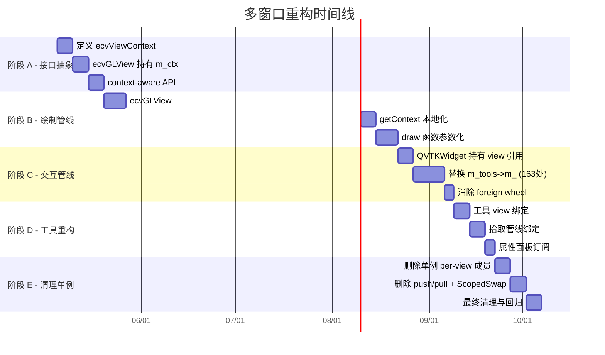

# ACloudViewer 多窗口渲染系统全面重构方案

本文基于 CloudCompare / ParaView 多窗口系统深度审计结果，给出 **分阶段、可交付** 的重构路径。

**配套文档：**
- **`multi-window-paradigms-CloudCompare-ParaView.md`**：CC/PV/ACV 三方对比
- **`audit-TheInstance-m_-members.md`**：单例直读全量扫描
- **`multi-window-paraview-alignment-design.md`**：ParaView ↔ ACloudViewer 15 维度全面对齐设计文档（含 Phase M–N 详细迁移方案）
- **`singleton-removal-migration-plan.md`**：单例 API 移除详细迁移计划

---

## 1. 重构目标

### 1.1 终极目标

将 ACloudViewer 的多窗口渲染系统从 **「单例 + 临时切换」** 改造为 **「每窗口独立状态 + 协调器」** 模式，达到：

1. **窗口间完全隔离**：相机、拾取、交互、渲染管线互不影响
2. **无 push/pull 开销**：取消视图切换时的状态序列化/反序列化
3. **无 ScopedVisSwap**：取消绘制时的全局指针临时替换
4. **工具/对话框显式绑定**：每个工具知道自己操作哪个视图
5. **可选的视图同步**：相机联动是显式 Link，不是隐式状态泄漏

### 1.2 非目标

- **不** 替换 VTK 渲染后端为 CC 的纯 OpenGL（已明确排除）
- **不** 引入 ParaView 的完整 ServerManager/Proxy 体系（取模式不取类名）
- **不** 在短期内删除 `ecvDisplayTools` 类（渐进式改造）

### 1.3 重构原则

| 原则 | 含义 |
|------|------|
| **数据归属明确** | 每个状态字段有且仅有一个 owner（ecvGLView 或 ecvDisplayTools，不是两者都有） |
| **向内求值** | 代码读状态时向 **当前操作的 view** 求值，不向全局单例求值 |
| **先隔离后删除** | 先让所有代码路径通过 view 实例读写，再安全删除单例字段 |
| **渐进交付** | 每个阶段独立可测试、可回退 |

---

## 2. 三套概念不要混为一谈

| 名称 | 含义 | ACloudViewer 现状 |
|------|------|-------------------|
| **CloudCompare 原版** | 每 MDI 子窗口一个 `ccGLWindow`（QOpenGLWidget），原生 OpenGL 管线 | **未采用**：不使用 CC 的 GL 管线 |
| **ACloudViewer 主路径** | `VtkDisplayTools`（单例）+ `QVTKWidgetCustom` + `VtkVis`（VTK OpenGL 后端） | **已采用**：所有 3D 输出经 VTK |
| **副视口 / 分割** | 每 `ecvGLView` 一套 `VtkVis` + `RenderWindow` + ScopedVisSwap | **已采用**：GPU 上下文独立，CPU 状态通过单例共享 |

**结论：** 重构目标是 **在 VTK 后端上实现 CC 级别的状态隔离**，借鉴 PV 的协调器模式。

---

## 3. 当前架构问题全景

### 3.1 单例访问热点

```
ecvDisplayTools 单例访问点（共 ~725 处）
├── s_tools.instance->m_*   in ecvDisplayTools.cpp    : 527 处
├── m_tools->m_*             in QVTKWidgetCustom.cpp   : 163 处
├── TheInstance()->m_*       in ecvDisplayTools.h      :  35 处
└── 合计直接读写单例状态                                 : 725 处
```

### 3.2 缓解机制覆盖率

| 机制 | 覆盖范围 | 未覆盖 |
|------|---------|--------|
| `push/pull` (30 字段) | 交互、鼠标、视口参数、bubble、pivot、光照 | `m_activeItems`, `m_messagesToDisplay`, CPU 矩阵, `m_captureMode` |
| `ScopedVisSwap` (4 字段) | VtkVis, vtkWidget, ImageVis, glViewport | 所有非 VTK 状态 |
| `ScopedRenderOverride` | 调用 `getEffectiveView()` 的路径 | 直读 `s_tools.instance` 的 527 处 |
| `write-through` (20 处) | pointSize, lineWidth, displayParams | cameraClip, cameraFovy, viewportDefaultSize |
| `foreign wheel` | 滚轮事件 | 其他非活动窗口的交互事件 |

---

## 4. 分阶段重构计划

### 阶段 A — 接口抽象：引入 `ecvViewContext`（2-3 周）

**目标：** 定义每窗口状态的 **唯一容器**，所有读写通过此容器，不再直读单例。

#### A.1 定义 `ecvViewContext`

```cpp
// libs/CV_db/include/ecvViewContext.h
class ecvViewContext {
public:
    // === 视口 / 相机 ===
    ecvViewportParameters viewportParams;
    CCVector3d viewMatd[16];
    CCVector3d projMatd[16];
    bool validModelviewMatrix = false;
    bool validProjectionMatrix = false;

    // === 交互 / 拾取 ===
    int interactionFlags = 0;
    PICKING_MODE pickingMode = DEFAULT_PICKING;
    bool pickingModeLocked = false;
    int pickRadius = 3;
    std::vector<Clickable2DItem*> activeItems;
    bool allowRectangularEntityPicking = true;

    // === 鼠标 / 触摸 ===
    QPoint lastMousePos;
    QPoint lastMouseMovePos;
    bool mouseMoved = false;
    bool mouseButtonPressed = false;
    bool ignoreMouseReleaseEvent = false;
    bool touchInProgress = false;
    float touchBaseDist = 1.0f;

    // === 显示 ===
    HotZone* hotZone = nullptr;
    std::vector<ClickableItem> clickableItems;
    bool clickableItemsVisible = true;
    bool displayOverlayEntities = true;
    MessageList messagesToDisplay;

    // === Bubble / Pivot ===
    bool bubbleViewModeEnabled = false;
    float bubbleViewFov_deg = 90.0f;
    PivotVisibility pivotVisibility = PIVOT_SHOW_ON_MOVE;
    bool pivotSymbolShown = false;
    bool autoPickPivotAtCenter = true;

    // === 光照 ===
    float sunLightPos[4];
    bool sunLightEnabled = true;
    float customLightPos[4];
    bool customLightEnabled = false;

    // === 渲染标志 ===
    bool exclusiveFullscreen = false;
    bool showCursorCoordinates = false;
    bool showDebugTraces = false;
    bool rotationAxisLocked = false;
    CCVector3d lockedRotationAxis;
};
```

#### A.2 `ecvGLView` 持有 `ecvViewContext`

```cpp
class ecvGLView : public ecvGenericGLDisplay {
    ecvViewContext m_ctx;  // 唯一真相源

    // 取代现有的分散成员
    const ecvViewContext& context() const { return m_ctx; }
    ecvViewContext& context() { return m_ctx; }
};
```

#### A.3 `ecvDisplayTools` 提供 context-aware API

```cpp
class ecvDisplayTools {
    // 新增：基于 context 的 API（阶段 A 先加，不删旧 API）
    static void GetContext(CC_DRAW_CONTEXT& ctx, const ecvViewContext& viewCtx);
    static void SetPointSize(float size, ecvViewContext& viewCtx);
    static void SetLineWidth(float width, ecvViewContext& viewCtx);
    // ... 所有需要视口状态的 API 加 viewCtx 参数版本

    // 旧 API 保留但标记 deprecated
    [[deprecated("Use context-aware version")]]
    static void SetPointSize(float size);
};
```

#### A.4 验收标准

- [x] `ecvViewContext` 类定义并编译通过
- [x] `ecvGLView` 使用 `m_ctx` 替代现有分散成员
- [x] `pushStateToSingleton` / `pullStateFromSingleton` 改为读写 `m_ctx`
- [x] 至少 5 个核心静态 API 有 context-aware 版本
- [x] 回归测试：2+ MDI 窗口 + 1 分割窗口，基本操作无回退

---

### 阶段 B — 绘制管线重构：消除 ScopedVisSwap（3-4 周）

**目标：** 每个 `ecvGLView` 的绘制管线 **自给自足**，不再临时替换单例指针。

#### B.1 `ecvGLView::redraw` 去单例化

```cpp
// 目标：redraw 不再需要 ScopedVisSwap
void ecvGLView::redraw(bool only2D, bool forceRedraw) {
    if (!m_visualizer3D || !m_vtkWidget) return;

    // 直接使用本视图的 VtkVis，不切换单例
    CC_DRAW_CONTEXT ctx;
    getContext(ctx);  // 从 m_ctx 填充，不读单例

    // 背景 / 3D / 2D / clickable / overlay
    drawBackground(ctx);
    draw3D(ctx);
    drawForeground(ctx);

    m_visualizer3D->getRenderWindow()->Render();
}
```

#### B.2 `ecvGLView::getContext` 完全本地化

```cpp
void ecvGLView::getContext(CC_DRAW_CONTEXT& CONTEXT) {
    CONTEXT.glW = m_vtkWidget->width();
    CONTEXT.glH = m_vtkWidget->height();
    CONTEXT.devicePixelRatio = m_vtkWidget->devicePixelRatioF();
    CONTEXT.display = this;
    CONTEXT.defaultPointSize = m_ctx.viewportParams.defaultPointSize;
    CONTEXT.defaultLineWidth = m_ctx.viewportParams.defaultLineWidth;
    // ... 全部从 m_ctx 读取，零单例依赖
}
```

#### B.3 DrawFunction 接受 VtkVis 参数

目前 `draw3D` 等函数内部通过单例获取 `m_visualizer3D`。重构为参数传递：

```cpp
void ecvGLView::draw3D(CC_DRAW_CONTEXT& ctx) {
    // 直接使用 m_visualizer3D，不通过 ecvDisplayTools::GetVisualizer3D()
    auto* renderer = m_visualizer3D->getRenderer();
    // ...
}
```

#### B.4 验收标准

- [x] `ecvGLView::redraw` 删除 `ScopedVisSwap` 调用
- [x] `ecvGLView::getContext` 不读 `s_tools.instance`
- [x] `ScopedRenderOverride` 仅用于 `ecvDisplayTools` 自身的 `RedrawDisplay`（主视图）
- [x] 多窗口绘制无串窗、无闪烁
- [x] 性能：消除 push/pull + swap 开销后，多窗口 redrawAll 性能提升可测量

---

### 阶段 C — 交互管线重构：`QVTKWidgetCustom` 去单例化（3-4 周）

**目标：** 鼠标/键盘/滚轮事件处理直接操作 **当前 widget 所属的 `ecvGLView`**，不读写全局单例。

#### C.1 `QVTKWidgetCustom` 持有 view 引用

```cpp
class QVTKWidgetCustom {
    ecvGLView* m_ownerView;  // 替代 m_tools（单例指针）

    // 事件处理直接操作 m_ownerView->context()
    void mousePressEvent(QMouseEvent* e) override {
        auto& ctx = m_ownerView->context();
        ctx.lastMousePos = e->pos();
        ctx.mouseButtonPressed = true;
        // ...
    }
};
```

#### C.2 消除 foreign wheel 补丁

当每个 widget 直接操作自己的 `ecvGLView` 时，**foreign wheel 不再需要 push/pull**：

```cpp
void QVTKWidgetCustom::wheelEvent(QWheelEvent* event) {
    auto& ctx = m_ownerView->context();
    // 直接修改本视图的 zoom/fov/zNear
    // 无需 pushStateToSingleton / pullStateFromSingleton
    // 无需判断 foreignWheel
    m_ownerView->onWheelEvent(event);
}
```

#### C.3 减少 `m_tools->m_*` 访问

逐步将 `QVTKWidgetCustom.cpp` 中的 163 处 `m_tools->m_*` 替换为 `m_ownerView->context().xxx`：

| 类别 | 当前模式 | 目标模式 | 预估数量 |
|------|---------|---------|---------|
| 鼠标状态 | `m_tools->m_lastMousePos` | `ctx.lastMousePos` | ~30 |
| 交互标志 | `m_tools->m_interactionFlags` | `ctx.interactionFlags` | ~20 |
| 拾取 | `m_tools->m_pickingMode` | `ctx.pickingMode` | ~15 |
| 视口参数 | `m_tools->m_viewportParams` | `ctx.viewportParams` | ~40 |
| Bubble/Pivot | `m_tools->m_bubbleViewModeEnabled` | `ctx.bubbleViewModeEnabled` | ~20 |
| 其他 | 杂项 | 通过 ctx 或 view API | ~38 |

#### C.4 验收标准

- [x] `QVTKWidgetCustom` 不再持有 `m_tools`（`ecvDisplayTools*`）
- [x] `wheelEvent` 不再需要 foreign wheel 补丁
- [x] `mousePressEvent` 中的 `setActiveView` 保留（UI 激活语义），但不需要 push/pull
- [x] 多窗口下鼠标操作（旋转、平移、缩放）互不影响

---

### 阶段 D — 工具/对话框重构：显式视图绑定（2-3 周）

**目标：** 借鉴 CC 的 `linkWith` 和 PV 的 `activeViewChanged` 信号，工具/对话框显式知道自己操作哪个视图。

#### D.1 工具基类增加 view 绑定

```cpp
class ecvOverlayDialog {
    ecvGLView* m_boundView = nullptr;

    void bindToView(ecvGLView* view) {
        if (m_boundView) unbindFromView();
        m_boundView = view;
        connect(view, &ecvGLView::aboutToClose, this, &ecvOverlayDialog::onViewClosed);
    }

    // 或者订阅 activeViewChanged
    void followActiveView() {
        connect(&ecvViewManager::instance(), &ecvViewManager::activeViewChanged,
                this, &ecvOverlayDialog::onActiveViewChanged);
    }
};
```

#### D.2 拾取管线绑定

`ccPickingHub` 已经基本正确（跟踪 MDI 激活窗口），但需确保：
- `doPicking` 使用 **当前拾取窗口的** `ecvViewContext`，不读单例
- `m_deferredPickingTimer` 关联到 **特定 view** 的位置数据

#### D.3 属性面板订阅 `activeViewChanged`

```cpp
// 属性面板在视图切换时刷新
connect(&ecvViewManager::instance(), &ecvViewManager::activeViewChanged,
        propertiesPanel, &PropertiesPanel::refreshFromView);
```

#### D.4 验收标准

- [x] 所有 `ecvOverlayDialog` 子类使用 `bindToView` 或 `followActiveView`
- [x] `doPicking` 不读 `s_tools.instance->m_lastMousePos`
- [x] 属性面板显示当前活动视图的参数
- [x] 工具切换窗口时无状态残留

---

### 阶段 E — 清理单例：`ecvDisplayTools` 瘦身（2-3 周）

**目标：** `ecvDisplayTools` 退化为 **工具函数集合 + 主视图兼容层**，不再持有 per-view 状态。

#### E.1 分类处理单例成员

| 类别 | 成员 | 处理方式 |
|------|------|---------|
| **已在 ecvViewContext 中** | `m_viewportParams`, `m_interactionFlags`, `m_pickingMode`, 鼠标状态, hotZone, bubble, pivot, 光照 | **删除**单例副本 |
| **全局语义正确** | `m_globalDBRoot`, `m_win`, `m_mainScreen` | **保留**在 `ecvDisplayTools` |
| **应在 ecvViewManager** | `m_currentScreen`, `m_removeFlag` | **迁移** |
| **应在 VtkDisplayTools** | `m_visualizer3D`, `m_vtkWidget`, `m_visualizer2D` | 仅作 **primary fallback** |

#### E.2 删除 push/pull

当所有读写都通过 `ecvViewContext` 时，`pushStateToSingleton` / `pullStateFromSingleton` 不再需要。

#### E.3 删除 ScopedVisSwap

当 `ecvGLView::redraw` 完全自给自足时，`VtkDisplayTools::ScopedVisSwap` 可删除。

#### E.4 删除 foreign wheel 补丁

当 `QVTKWidgetCustom` 直接操作 `m_ownerView` 时，foreign wheel 逻辑简化为普通事件转发。

#### E.5 验收标准

- [x] `ecvDisplayTools` 的 per-view 成员减少到 0
- [x] `pushStateToSingleton` / `pullStateFromSingleton` 删除
- [x] `ScopedVisSwap` 删除
- [x] `s_tools.instance->m_*` 直读次数从 527 降至 < 50（仅全局语义成员）
- [x] `m_tools->m_*` 直读次数从 163 降至 0
- [x] 回归：全功能测试覆盖

---

### 阶段 F — 进阶功能（可选，视产品需求）

| 功能 | 借鉴 | 说明 |
|------|------|------|
| **布局持久化** | PV `vtkSMViewLayoutProxy` | 将分割布局序列化到项目文件 |
| **per-view Representation** | PV `pqDataRepresentation` | 同一对象在不同视图可以有不同颜色/可见性 |
| **Selection Link** | PV `vtkSMSelectionLink` | 多视图间选择同步（可选） |
| **Tab 多布局** | PV `pqTabbedMultiViewWidget` | 多 Tab 页各有独立布局 |

---

## 5. 阶段依赖与时间线



**总预估：12-16 周（按顺序执行）；若 B/C 部分并行可压缩到 10-12 周**

---

## 6. 风险与缓解

| 风险 | 等级 | 缓解 |
|------|------|------|
| **插件兼容性** | 高 | 阶段 A 保留旧 API（deprecated），不 break 外部插件 |
| **回退困难** | 高 | 每阶段独立分支，有明确验收标准；feature flag 控制新旧路径 |
| **性能回退** | 中 | 消除 push/pull/swap 应 **提升** 性能；关注 per-view `getContext` 的 cache locality |
| **并发渲染** | 中 | `ecvViewContext` 是值类型，线程安全性比单例指针好 |
| **遗漏路径** | 高 | 每阶段结束运行 `grep 'TheInstance()->m_\|s_tools.instance->m_\|m_tools->m_'` 验证趋势 |

---

## 7. 高效重构原则（VTK + 单例混合）

1. **先保证「指针指向正确 VtkVis」**：阶段 B 消除 ScopedVisSwap
2. **再保证「参数读写的视图一致」**：阶段 C 消除 m_tools->m_* 直读
3. **最后做「删单例字段」**：阶段 E，只有前两条稳定后才值得动
4. **每阶段有回退路径**：feature flag 或编译开关

---

## 8. 与配套文档的交叉引用

- CC/PV 范式对比与 Mermaid：见 **`multi-window-paradigms-CloudCompare-ParaView.md`**
- 单例直读全量扫描：见 **`audit-TheInstance-m_-members.md`**
- 本文侧重 **重构方案与执行计划**

---

## 9. 执行进度追踪（2026-04-24 更新）

| 阶段 | 状态 | 关键成果 |
|------|------|---------|
| **A** 接口抽象 | **DONE** | `ecvViewContext` 定义、`effectiveCtx()` 桥接、context-aware API |
| **B** 绘制管线 | **DONE** | `getContext` 本地化、`RedrawDisplay` per-view 委派、`ScopedRenderOverride` 移除、deprecated 旧 API |
| **C** 交互管线 | **DONE** | `m_ownerView` + `ownerCtx()` 全量 accessor、foreign wheel 消除 |
| **D** 工具重构 | **DONE** | `bindToView` 绑定、`doPicking` via `effectiveCtx()`、属性面板随活动视图刷新 |
| **E** 清理单例 | **DONE** | `pushState/pullState` 已删除 (16→0)、~35 per-view 成员声明已删除；`curCtx()` 统一 29 个 accessor (单一分支点)；`ScopedHotZoneRender` 保留 (2D overlay 管线耦合，RAII 最小化) |
| **F** 进阶功能 | **DONE** | per-view opacity override 已接入绘制管线；KD-tree 布局模型 (`ecvViewLayoutProxy`)；`ecvMultiViewWidget` + `ecvTabbedMultiViewWidget` (ParaView 级多视图/Tab 布局)；`ecvViewManager` 扩展为 `pqActiveObjects` 模式 (源/表示追踪 + `triggerSignals` 批量信号) |

### 当前指标

| 指标 | 初始值 | 当前值 | 目标 |
|------|-------|--------|------|
| `s_tools.instance->m_*` (ecvDisplayTools.cpp) | 527 | 55 (全部为全局成员) | < 50 |
| `m_tools->m_*` (QVTKWidgetCustom.cpp) | 163 | 6 (curCtx 统一, 仅 3 非上下文 accessor 保留分支) | 0 (需 primary view 也用 ecvGLView) |
| `pushState/pullState` 引用 | 16 | **0** | 0 |
| `ScopedHotZoneRender` 引用 | 18 | 18 (DrawClickableItems 耦合) | 保留 (RAII 最小化, 正确安全) |

### 遗留项

1. **ScopedHotZoneRender**: `DrawClickableItems` + `DrawWidgets` + `RenderText` 整条 2D overlay 管线依赖单例 VTK 管线指针。当前 RAII swap 是最小化方案且正确安全，完全消除需参数化整条管线（接受 `VtkVis`/`QVTKWidget`），改动面巨大，投入产出比低。
2. **m_tools fallback**: 主窗口的 `QVTKWidgetCustom` 仍通过 `curCtx()` 回退至 `m_tools->m_primaryCtx`（因为主窗口不是 `ecvGLView` 实例）。29 个 context accessor 已通过 `curCtx()` 统一至单一分支点，代码维护成本极低。完全消除需将主窗口也包装为 `ecvGLView`。

### Phase E/F 加固记录（2026-04-25）

| 改进项 | 文件 | 说明 |
|--------|------|------|
| `curCtx()` 统一 | `QVTKWidgetCustom.h/cpp` | 29 个 context accessor 由独立分支改为委托 `curCtx()`，分支逻辑归一 |
| Per-view opacity | `ecvHObject.cpp` | `ccHObject::draw` 中查询 `ecvViewRepresentation` 覆盖 opacity |
| Layout persistence API | `ecvViewManager.h/cpp` | `saveLayout(GeometryProvider)` / `restoreLayout(QJsonObject, LayoutApplier)` 回调式序列化 |

### Bug 修复记录（2026-04-24）

| Bug | 修复内容 | 文件 |
|-----|---------|------|
| **窗口激活** | 已验证：仅 canvas click + MDI tab 激活，无 hover/focus/DBtree 激活 | `QVTKWidgetCustom.cpp`, `MainWindow.cpp` |
| **默认窗口删除 crash** | `SetCurrentScreen` 空指针守卫、`adoptNewPrimary` 更新 `m_mainScreen`、`prepareViewClose` edge-case 处理 | `ecvDisplayTools.cpp`, `VtkDisplayTools.cpp`, `MainWindow.cpp` |
| **新窗口配置继承** | `copyPrimaryViewConfig` 改用 `effectiveCtx()`（活动视图），而非始终 `m_primaryCtx`；重置鼠标/触摸瞬态 | `MainWindow.cpp` |

### 生命周期加固记录（2026-04-25）

| 问题 | 修复内容 | 文件 |
|------|---------|------|
| **MDI deactivation 处理** | `on3DViewActivated(nullptr)` 不再静默返回，会调用 `setActiveView(nullptr)` 同步 `ecvViewManager` | `MainWindow.cpp` |
| **activeViewChanged(nullptr)** | Lambda 不再忽略 null `newActive`，允许 `rebindToolsToActiveView` 处理清理逻辑 | `MainWindow.cpp` |
| **unregisterView 替换策略** | 从 `m_views.first()` 改为 `m_views.last()`（最近注册 = 更可能是用户焦点） | `ecvViewManager.cpp` |
| **重复 registerView** | 移除 `new3DView` 中多余的 `RegisterGLDisplay` + `registerView`（已在 `ecvGLView::Create` 中完成） | `MainWindow.cpp` |
| **rebind null screen** | `rebindToolsToActiveView` 在 screen 为 null 时先 unlink MDI dialogs，再调用 `updateUI()` | `MainWindow.cpp` |
| **adoptNewPrimary 选择** | `prepareViewClose` 优先使用 `ecvViewManager::getActiveView()` 作为新 primary，而非总取 `getAllViews()` 第一个 | `MainWindow.cpp` |
| **最后窗口关闭** | 无存活 `ecvGLView` 时恢复到内置 primary widget (`getQVtkWidget()`)，而非 `SetCurrentScreen(nullptr)` | `MainWindow.cpp` |

### 综合审计加固记录（2026-04-25 续）

| 严重性 | 问题 | 修复内容 | 文件 |
|--------|------|---------|------|
| **CRITICAL** | `GetCurrentScreen()` 空指针 | `UpdateScreen`/`setInteractionMode`/`setPickingMode` 中添加 null guard | `ecvDisplayTools.cpp` |
| **CRITICAL** | `m_vtkWidget` 悬挂指针 | `ecvGLView::m_vtkWidget` 改为 `QPointer<QVTKWidgetCustom>` | `ecvGLView.h` |
| **CRITICAL** | 管道恢复失败 | 添加 `resetToBuiltInPipeline()` + `m_builtInVis`/`m_builtInWidget` 永久引用 | `VtkDisplayTools.h/cpp`, `MainWindow.cpp` |
| **HIGH** | `m_visualizer2D` 未同步 | `adoptNewPrimary`/`restorePrimaryView` 中同步 2D 可视化器 | `VtkDisplayTools.cpp` |
| **HIGH** | 跨视图状态污染 | `QVTKWidgetCustom` 访问器通过 `m_ownerView` 路由而非总用单例 | `QVTKWidgetCustom.cpp`, `ecvGLView.h` |
| **IMPORTANT** | 静态内联空指针 | `GetScreenRect`/`SetScreenSize`/`GetScreenSize`/`Update` 添加 null guard | `ecvDisplayTools.h` |
| **IMPORTANT** | 全屏 action 状态残留 | `on3DViewActivated` 中 `!screen` 时更新 fullscreen action | `MainWindow.cpp` |
| **IMPORTANT** | HotZone 悬挂 | `resetToBuiltInPipeline()` 中无 `localHotZone` 时清空 `m_hotZone` | `VtkDisplayTools.cpp` |
| **MEDIUM** | 瞬态状态残留 | 添加 `ecvViewContext::resetInteractionState()` 集中重置 | `ecvViewContext.h`, `MainWindow.cpp` |

### Phase G — ParaView 兼容架构（2026-04-27）

引入与 ParaView 完全对齐的多窗口架构组件：

| 组件 | ParaView 对应 | 文件 | 说明 |
|------|-------------|------|------|
| `ecvViewLayoutProxy` | `vtkSMViewLayoutProxy` | `libs/CV_db/include/ecvViewLayoutProxy.h`, `src/ecvViewLayoutProxy.cpp` | KD-tree 布局模型：heap 索引二叉树、Split/Assign/Collapse/Swap/Equalize/Maximize、JSON 序列化 |
| `ecvMultiViewWidget` | `pqMultiViewWidget` | `app/ecvMultiViewWidget.h`, `.cpp` | UI 层：订阅 `layoutChanged()` 重建 QSplitter 树、事件过滤点击激活、Split/Close/Maximize 操作走 Proxy |
| `ecvTabbedMultiViewWidget` | `pqTabbedMultiViewWidget` | `app/ecvTabbedMultiViewWidget.h`, `.cpp` | Tab 容器：每 Tab 一个 `ecvMultiViewWidget` + `ecvViewLayoutProxy`、"+" 按钮新建 Tab、右键重命名/Equalize/关闭 |
| `ecvViewManager` 扩展 | `pqActiveObjects` | `libs/CV_db/include/ecvViewManager.h`, `src/ecvViewManager.cpp` | 新增 `activeSource`/`activeRepresentation`/`activeLayout` 追踪、`triggerSignals()` 批量信号、Layout proxy 注册管理 |

### Phase H — QMdiArea 替换为 ecvTabbedMultiViewWidget（2026-04-27）

**核心切换**：`setCentralWidget(m_mdiArea)` → `setCentralWidget(m_tabbedMultiView)`

| 变更类别 | 内容 | 文件 |
|---------|------|------|
| **中心控件切换** | `m_mdiArea = nullptr`；`setCentralWidget(m_tabbedMultiView)` 在 `initParaViewLayoutSystem()` 后调用 | `MainWindow.cpp::initial()` |
| **视图生命周期** | `viewClosing(ecvGenericGLDisplay*)` 信号链：`ecvMultiViewWidget` → `ecvTabbedMultiViewWidget` → `MainWindow::onViewClosingFromLayout`；处理 unregister、primary 接管、camera link 移除 | `ecvMultiViewWidget.h/cpp`, `ecvTabbedMultiViewWidget.h/cpp`, `MainWindow.cpp` |
| **Overlay 定位** | `centralViewWidget()` 辅助方法替代硬编码 `m_mdiArea` 几何 | `MainWindow.h/cpp` |
| **视图枚举** | `getRenderWindowCount`/`GetRenderWindows`/`GetRenderWindow`/`getWindow`/`getActiveWindow`/`addWidgetToQMdiArea` 优先走 `m_tabbedMultiView->allViews()` | `MainWindow.cpp` |
| **新建视图** | `new3DView()` → `m_tabbedMultiView->createTab()`；ViewFactory 自动创建 `ecvGLView` 并赋给 cell 0 | `MainWindow.cpp` |
| **分屏** | `splitCurrentView()` 委托 `ecvMultiViewWidget::onSplitHorizontal/Vertical` | `MainWindow.cpp` |
| **关闭视图** | `createViewFrame` 的 close lambda 委托 `ecvMultiViewWidget::onCloseView` | `MainWindow.cpp` |
| **Camera/Animation 对话框** | 移除 `QMdiSubWindow` 硬依赖；null guard + `activeWin` 降级 | `MainWindow.cpp` |
| **活跃帧高亮** | `markActiveViewFrame` 从 `m_tabbedMultiView` 搜索 `CentralWidgetFrame` | `MainWindow.cpp` |
| **装饰/锁定/启禁** | `setViewDecorationsVisible` / `lockViewSize` / `enableAll` / `disableAll` 走 `m_tabbedMultiView` API | `MainWindow.cpp` |
| **事件过滤** | `m_tabbedMultiView` 安装 `installEventFilter(this)` 用于 Resize→overlay 重定位 | `MainWindow.cpp` |
| **菜单更新** | `updateMenus()` 接入 `activeViewChanged` 信号（替代 `subWindowActivated`） | `MainWindow.cpp` |
| **析构清理** | null-guard `m_mdiArea->disconnect()`；新增 `m_tabbedMultiView->reset()` | `MainWindow.cpp` |

### Phase I — 深度清理与完善（2026-04-27 续）

**QMdiArea 彻底清除：**

| 变更 | 内容 | 文件 |
|------|------|------|
| **m_mdiArea 成员移除** | `QMdiArea* m_mdiArea` 从 `MainWindow.h` 删除 | `MainWindow.h` |
| **QMdiArea forward decl 移除** | 仅保留 `QMdiSubWindow` 前向声明（接口兼容） | `MainWindow.h` |
| **死代码清除（~67处）** | 所有 `m_mdiArea->subWindowList()`/`activeSubWindow()`/`addSubWindow()` 分支移除 | `MainWindow.cpp` |
| **关闭逻辑简化** | close button/context menu 中 QSplitter→QMdiSubWindow 拆包逻辑移除，统一走 `ecvMultiViewWidget::onCloseView` | `MainWindow.cpp` |
| **new3DView 简化** | 移除 MDI `addSubWindow` 路径，仅保留 `m_tabbedMultiView->createTab()` | `MainWindow.cpp` |
| **splitCurrentView 简化** | 移除遗留 widget 遍历路径，仅保留 `ecvMultiViewWidget` 委托 | `MainWindow.cpp` |
| **toggleMaximize 重写** | 移除 MDI maximize/restore，新增 `ecvMultiViewWidget::onMaximize` 委托 | `MainWindow.cpp` |
| **splitViewFrame 清理** | 移除 `QMdiSubWindow` parent 检测，保留 QSplitter/QLayout 路径 | `MainWindow.cpp` |
| **Camera/Animation 对话框** | 完全移除 `QMdiSubWindow` parent 查找和 `subWindowActivated` 连接 | `MainWindow.cpp` |
| **findActiveAction 重写** | 从 `ecvViewManager::getActiveView()` 查找活跃 toolbar，替代 `m_mdiArea->activeSubWindow()` | `MainWindow.cpp` |
| **deactivateRegisterPointPairTool** | 移除 `QMdiSubWindow` restore 逻辑 | `MainWindow.cpp` |

**cvPerViewSelectionManager 完整集成：**

| 变更 | 内容 | 文件 |
|------|------|------|
| **QMdiArea 依赖移除** | `QMdiArea* m_mdiArea` → `QWidget* m_viewRoot`；`setMdiArea()` 替换为 `setViewRoot()` | `cvPerViewSelectionManager.h` |
| **搜索逻辑简化** | `uncheckOtherViews`/`uncheckAllMirrors` 从 `m_viewRoot->findChildren<>("ViewSelectionToolBar")` 一步搜索，移除 `subWindowList` 两层遍历 | `cvPerViewSelectionManager.cpp` |
| **MainWindow 接线** | `initParaViewLayoutSystem()` 后调用 `setViewRoot(m_tabbedMultiView)` | `MainWindow.cpp` |
| **安全网更新** | 选择工具 retroactive populate 改用 `centralViewWidget()` + `findChildren` | `MainWindow.cpp` |

**Camera Link 完整性修复：**

| 变更 | 内容 | 文件 |
|------|------|------|
| **Primary view removeView 缺口** | `onViewClosingFromLayout` 和 `prepareViewClose` 中，当 `closingDisplay == TheInstance()` 时也调用 `removeView(primaryDT->get3DViewer())` | `MainWindow.cpp` |

**选择管理器审计结论：**

对比 ParaView `pqSelectionManager` 与现有架构，确认以下 ParaView 核心模式已实现：

| ParaView 模式 | ACloudViewer 实现 |
|--------------|-----------------|
| `ActiveReaction` 静态守卫（单一活跃选择模式） | `cvRenderViewSelectionReaction::ActiveReaction` |
| `setActiveView()` 视图切换时重绑定 | `rebindToolsToActiveView()` → `cvSelectionToolController::setVisualizer()` |
| Per-view action 镜像 | `cvPerViewSelectionManager::populateToolbar()` |
| 跨视图 uncheck | `cvPerViewSelectionManager::uncheckOtherViews()` |
| ESC 全局清除 | `disableAllTools()` + `uncheckAllMirrors()` |
| `beginSelection()`/`endSelection()` 状态机 | `cvRenderViewSelectionReaction` 完整实现 |

**Phase I 续 — 接口清理（2026-04-27）：**

| 变更 | 内容 | 文件 |
|------|------|------|
| **`addWidgetToQMdiArea` → `addViewWidget`** | 接口重命名，实现重定向至 `m_tabbedMultiView` | `ecvMainAppInterface.h`, `MainWindow.h/cpp` |
| **`getMDISubWindow` 移除** | 函数和声明删除（仅 MainWindow 内部使用） | `MainWindow.h/cpp` |
| **`on3DViewActivated` 移除** | 死代码删除（不再连接 `QMdiArea::subWindowActivated`） | `MainWindow.h/cpp` |
| **`QMdiSubWindow` 前向声明移除** | `MainWindow.h` 中 `class QMdiSubWindow` 删除 | `MainWindow.h` |
| **`ecvCameraParamEditDlg::linkWith(QMdiSubWindow*)` 移除** | 仅保留 `linkWith(QWidget*)` | `ecvCameraParamEditDlg.h/cpp` |
| **`ecvAnimationParamDlg::linkWith(QMdiSubWindow*)` 移除** | 仅保留 `linkWith(QWidget*)` | `ecvAnimationParamDlg.h/cpp` |
| **`ccPickingHub::onActiveWindowChanged(QMdiSubWindow*)` 移除** | 仅保留 `onActiveViewWidgetChanged(QWidget*)` | `ecvPickingHub.h/cpp` |
| **`#include <QMdiSubWindow>` 移除** | 从 `.cpp` 中移除无用 include | 多文件 |

---

### 完整性审计 — ParaView vs ACloudViewer 对比（2026-04-27 最终审计）

#### 已实现（IMPLEMENTED）

| ParaView 特性 | ACloudViewer 实现 |
|--------------|-----------------|
| KD-tree 布局模型 (`vtkSMViewLayoutProxy`) | `ecvViewLayoutProxy` (heap 索引、split/assign/collapse/swap/equalize/maximize) |
| KD-tree UI 镜像 (`pqMultiViewWidget`) | `ecvMultiViewWidget` (监听 `layoutChanged`, 重建 QSplitter 树) |
| Tab 容器 (`pqTabbedMultiViewWidget`) | `ecvTabbedMultiViewWidget` (每 Tab 一个 layout + widget) |
| 中心控件切换 | `setCentralWidget(m_tabbedMultiView)` 完成 |
| 活动对象协调 (`pqActiveObjects`) | `ecvViewManager` (activeView/Source/Repr + triggerSignals) |
| 每视图状态 (`vtkSMViewProxy`) | `ecvViewContext` (Phase A) |
| Per-view 选择 toolbar (`pqStandardViewFrameActionsImplementation`) | `cvPerViewSelectionManager` + `setViewRoot` |
| 选择管理 (`pqSelectionManager` + `pqRenderViewSelectionReaction`) | `cvViewSelectionManager` + `cvRenderViewSelectionReaction` |
| 相机联动 (`vtkSMCameraLink`) | `VtkCameraLink` (含 primary view 清理) |
| 标题栏 split/max/close 按钮 | `ecvMultiViewFrameManager` 创建 |
| Tab 右键菜单 (rename/close/equalize) | `ecvTabbedMultiViewWidget` context menu |
| "+" 按钮创建新 Tab | 角标 QToolButton |
| `lockViewSize` / Preview | 简化版 `CentralWidgetFrame` max-size |
| 帧间拖拽交换 | `ecvMultiViewFrameManager` drag-drop (mime + `swapViewFrames`) |
| 布局 JSON 序列化 (`saveState`) | `ecvViewLayoutProxy::saveState()` |
| 布局操作 Undo/Redo (`BEGIN_UNDO_SET`) | `ecvViewLayoutProxy::beginUndoSet/endUndoSet` (split/collapse/equalize/swap/maximize + splitter 拖动防抖) |
| 布局持久化恢复 (session restore) | `loadState` 通过 `ecvViewManager::findView(view_id)` 重绑定视图指针 |
| Tab/布局会话持久化 | `ecvTabbedMultiViewWidget::saveLayoutState/restoreLayoutState` + `QSettings` |
| 空 cell 创建 UX (`pqEmptyView`) | `createEmptyCellWidget` ("Create Render View" 按钮 + view factory) |
| Popout 布局到独立窗口 | `ecvMultiViewWidget::togglePopout()` + tab context menu |
| Fullscreen 切换 (F11/Ctrl+F11) | `ecvTabbedMultiViewWidget::toggleFullScreen/toggleFullScreenActiveView` |
| Splitter 样式 (4px gap) | `SPLITTER_GAP` + hover/pressed stylesheet |
| Equalize Views (Horiz/Vert/Both) | `ecvViewLayoutProxy::equalize(Direction)` + Display 菜单 + 右键菜单 |
| Per-view 背景/坐标轴独立控制 | View Properties 右键菜单 (Gradient Background / Orientation Axes / Camera Widget) |

#### 部分实现（PARTIALLY）

| 特性 | 差异 | 优先级 |
|------|------|--------|
| **View frame 工具栏** | 有部分按钮（capture/camera/selection），无 hint-gated 完整集 | LOW |

#### 未实现（MISSING）

| 特性 | 说明 | 优先级 |
|------|------|--------|
| ~~**Per-view camera undo/redo**~~ ✅ | 已实现: `VtkVis::cameraUndo/Redo` + `MainWindow` 每帧工具栏按钮 | ✅ RESOLVED |
| **"Convert To..." 视图类型切换** | 视图类型注册表 + 菜单（仅适用于多视图类型场景） | LOW |

#### 不适用（NOT_APPLICABLE）

| 特性 | 说明 |
|------|------|
| SM proxy session / XML state | ParaView 特有的 ServerManager 架构 |
| Python trace (`SM_SCOPED_TRACE`) | ParaView 特有 |
| 分布式/Tile 显示 | `ShowViewsOnTileDisplay` |
| Spreadsheet/Chart 视图类型 | 需先添加对应视图实现 |
| Annotation 过滤 | 多客户端 UI 特有 |

**架构对比（最终）：**

| 维度 | ParaView | ACloudViewer |
|------|----------|-------------|
| 布局模型 | `vtkSMViewLayoutProxy` (KD-tree) | `ecvViewLayoutProxy` (KD-tree, API 对齐) |
| 布局 UI | `pqMultiViewWidget` | `ecvMultiViewWidget` |
| Tab 管理 | `pqTabbedMultiViewWidget` | `ecvTabbedMultiViewWidget` |
| 中心控件 | `pqTabbedMultiViewWidget` | `ecvTabbedMultiViewWidget` |
| 活动对象 | `pqActiveObjects` | `ecvViewManager` |
| 每视图状态 | `vtkSMViewProxy` | `ecvViewContext` |
| 视图创建 | `pqObjectBuilder::createView` | `ecvGLView::Create` + layout `assignView` |
| Per-view 表示 | `vtkSMRepresentationProxy` | `ecvViewRepresentation` |
| 相机联动 | `vtkSMCameraLink` | `VtkCameraLink` |
| 选择管理 | `pqSelectionManager` | `cvViewSelectionManager` + `cvPerViewSelectionManager` |
| Per-view toolbar | `pqStandardViewFrameActionsImplementation` | `cvPerViewSelectionManager` |
| 布局 Undo | `pqUndoStack` + `BEGIN_UNDO_SET` | `beginUndoSet/endUndoSet` (memento 模式) |
| Session 恢复 | XML state + proxy locator | JSON + `view_id` 重绑定 + `QSettings` 持久化 |
| 视图类型注册 | proxy definitions + "Convert To" | 单类型 (3D); 空 cell "Create Render View" 按钮 |
| Per-view 属性 | RenderView Properties panel | 右键 "View Properties" 菜单 (背景/坐标轴) |
| Popout / Fullscreen | `pqMultiViewWidget::togglePopout` | `togglePopout` + F11/Ctrl+F11 |

### Phase J — 关键运行时回归修复（2026-04-27）

**问题**：Phase H/I 完成后编译通过，但启动后 **主渲染视图完全不显示**，Layout #1 tab 内容为空白灰色区域。

**根因**：`ecvMultiViewWidget::buildCell()` 仅通过 `dynamic_cast<ecvGLView*>` 处理视图，但主视图 `ecvDisplayTools::TheInstance()` 的类型是 `VtkDisplayTools*`（非 `ecvGLView` 子类），导致 cast 失败后 **整个 view frame 未被创建**。

| 变更类别 | 内容 | 文件 |
|---------|------|------|
| **buildCell 泛化** | `dynamic_cast<ecvGLView*>` → `view->asWidget()` + `view->getTitle()`，支持任何 `ecvGenericGLDisplay*` | `ecvMultiViewWidget.cpp` |
| **FrameWiredCallback 类型** | `ecvGLView*` → `ecvGenericGLDisplay*`，确保主视图 frame 的按钮也被正确连接 | `ecvMultiViewWidget.h`, `ecvTabbedMultiViewWidget.h`, `MainWindow.cpp` |
| **activateViewAndDo 泛化** | `dynamic_cast<ecvGLView*>` → `ecvGenericGLDisplay::FromWidget()`，主视图工具栏按钮可正确激活 | `MainWindow.cpp` |
| **3D/2D toggle 修复** | 同上，改用 `ecvGenericGLDisplay*` | `MainWindow.cpp` |
| **移除 showMaximized()** | 删除旧 QMdiArea 时代的 `viewWidget->showMaximized()` 调用 | `MainWindow.cpp` |
| **splitBtn objectName** | 补设 `btnSplitHorizontal`/`btnSplitVertical` 使 `FrameWiredCallback` 能通过 `findChild` 找到并重新连接 | `MainWindow.cpp` |

**`dynamic_cast<ecvGLView*>` 全面排查（15 处修复）：**

| 函数 | 问题 | 修复 |
|------|------|------|
| `getActiveWindow()` | 主视图 active 时返回 `nullptr` | `activeDisplay->asWidget()` |
| `GetRenderWindows()` | 遗漏主视图 | `display->asWidget()` |
| `GetRenderWindow(title)` | 找不到主视图 | `display->getTitle()` |
| `getWindow(index)` | 按索引无法获取主视图 | `display->asWidget()` |
| `findActiveAction` | 快捷键分发对主视图无效 | `activeDisplay->asWidget()` |
| 9 处 `rebindToolsToActiveView` guard | 不必要的 cast 导致主视图跳过工具绑定 | 直接传递 `ecvGenericGLDisplay*` |

**保留的 `dynamic_cast<ecvGLView*>`（正确场景）：**

| 位置 | 原因 |
|------|------|
| `onViewClosingFromLayout` / `prepareViewClose` | 需要 `getVtkWidget()` / `getVisualizer3D()` 等 `ecvGLView` 特有 API |
| `rebindToolsToActiveView` 内部 | 需要 `switchActiveView()` 参数（VtkVis + Widget） |
| `new3DView` | 返回 `ecvGLView*` 类型 |
| `refreshAllViews` | 需要 `zoomGlobal()` 等 `ecvGLView` 特有 API |
| `ecvMultiViewWidget::onCloseView/destroyAllViews` | 需要 `aboutToClose` 信号（ecvGLView 特有） |

---

### Phase K — 主视图初始化竞态修复（2026-04-27）

**问题**：Phase J 修复后，3D 渲染视图显示在 **侧边栏** 而非中央 Layout 区域。Layout #1 tab 中央区域为空白灰色。

**根因（Widget 生命周期竞态）**：

1. `initParaViewLayoutSystem()` 将主视图 (`ecvDisplayTools::TheInstance()`) 分配到 layout cell 0
2. `restoreLayoutState()` 从 QSettings 加载上次保存的分割布局（包含 `view_id: 1` 和 `view_id: 1001`）
3. `loadState()` 执行 `m_tree.clear()`，**清除主视图分配**
4. `reload()` 对包含 VTK widget 的旧 frame 调用 `deleteLater()`，主视图 widget 被 **孤立**
5. `createLeafViews` 创建全新的 `ecvGLView` 实例填充空 cell，但主 `ecvDisplayTools` 实例浮在 MainWindow 上渲染到侧边栏

| 变更类别 | 内容 | 文件 |
|---------|------|------|
| **reload() 保护 view widget** | 删除旧 frame 前先 `setParent(nullptr)` 分离 view widget，防止 `deleteLater()` 连带销毁 | `ecvMultiViewWidget.cpp` |
| **延迟主视图分配** | `initParaViewLayoutSystem()` 不再分配主视图，仅创建空 tab；分配推迟到 `restoreLayoutState` 之后 | `MainWindow.cpp` |
| **确保主视图始终在布局中** | `initial()` 新增 `ensurePrimaryViewInLayout` 逻辑：检查主视图是否在布局中，若未找到则查找第一个叶节点替换 | `MainWindow.cpp` |

**初始化时序（修复后）**：

```
initial()
  ├── initParaViewLayoutSystem()     → 创建空 tab (不分配主视图)
  ├── setCentralWidget()
  ├── restoreLayoutState()           → 从 QSettings 加载 (可能覆盖树结构)
  ├── ensurePrimaryViewInLayout()    → 保证主视图占据一个 cell
  └── setupShortcuts()

showEvent()
  └── restoreGUILayout()             → 恢复 dock/toolbar 布局 (不影响 central widget)
```

---

### Phase L — 单例 API 彻底清除（2026-04-30）

**在 Phase A–K 完成 ParaView 级布局后，单独执行 `ecvDisplayTools` 单例 API 清除。**

详见 **[singleton-removal-migration-plan.md](singleton-removal-migration-plan.md)** v18.0。

**成果摘要：**

| 指标 | Phase K 时 | Phase L 后 |
|------|-----------|-----------|
| `ecvDisplayTools::` 非核心活跃引用 | ~1000+ | **0** |
| 包含 `ecvDisplayTools::` 的文件数 | ~50+ | **9** (全部核心基础设施) |
| `Init()`/`TheInstance()`/`HasInstance()`/`ReleaseInstance()` | 公开 API | **已删除**，替换为 `sharedTools()` (friend of ecvViewManager) |
| 嵌套类型 (`HotZone`/`MessageToDisplay`/`ClickableItem`/`PickingParameters`) | 在 `ecvDisplayTools.h` | **提取**到 `ecvDisplayTypes.h` |
| `ecvViewManager` 转发器 | 无 | **12 个** (shared*() 系列) |
| Python wrapper enum 源 | `ecvDisplayTools::ENUM` | `ecvGenericGLDisplay::ENUM` (56 处迁移) |
| 未使用 `#include ecvDisplayTools.h` | ~30 文件 | **全部移除** |

---

## 10. 下一阶段 TODO（2026-04-30 v2 — 消除 Primary/Secondary 区分）

### 核心原则：所有视图结构相同，无 Primary 之分

> **ParaView**: 每个视图都是 `pqRenderView` — 不存在"主视图"概念。`pqActiveObjects` 仅追踪焦点视图。
>
> **CloudCompare**: 每个窗口都是 `ccGLWindowInterface` — 全部结构相同。`MainWindow::TheInstance()` 是应用单例，不是视图单例。
>
> **ACloudViewer 当前问题**: `VtkDisplayTools` 同时充当"VTK 引擎服务"和"主视图"。这个双重角色导致：
> - `switchActiveView` / `restorePrimaryView` / `resetToBuiltInPipeline` 等复杂切换逻辑
> - `m_builtInVis` / `m_builtInWidget` / `m_primaryVis` / `m_primaryWidget` 等仅主视图使用的成员
> - `ScopedHotZoneRender` RAII swap（因为 `DrawClickableItems` 读全局 `s_tools` 状态）
> - `QVTKWidgetCustom::curCtx()` 的主/次双分支（~90+ `m_tools` 引用中仅 6 处是 context 回退，其余是信号/服务/状态）
> - `beginPrimaryRender` / `endPrimaryRender`（singleton 绘制路径临时切回主管线）
> - `dynamic_cast<ecvGLView*>` 14 处分支（其中 6 处显式处理"主视图不是 ecvGLView"）
>
> **目标**: 拆分 `VtkDisplayTools` 为两个角色：**纯引擎服务**（CC→VTK 转换、actor 查找等）和 **视图**（`ecvGLView`）。启动时第一个视图和后续视图完全相同，不再有 Primary 概念。

---

### Phase M 总览

```
Phase M1: VtkDisplayTools 职责拆分 ─────────────────────┐
  ├── M1.1 分类成员/方法 (A/B/C)                         │
  ├── M1.2 VtkDisplayTools → VtkEngine (纯服务)          │
  └── M1.3 Category C → ecvGLView                       │
                                                          │
Phase M2: QVTKWidgetCustom 统一 ─────────────────────────┤
  ├── M2.1 信号中枢迁移 (~19 signals → ecvViewManager)   │
  ├── M2.2 per-view 方法路由 (~50+ → m_ownerView)       │
  └── M2.3 删除 m_tools 成员                              │
                                                          │
Phase M3: ecvGLView 成为唯一视图类型 ────────────────────┤
  ├── M3.1 MainWindow::initial() 创建 ecvGLView          │
  ├── M3.2 消除 primary 切换机制                          │
  └── M3.3 简化 dynamic_cast 分支                         │
                                                          │
Phase M4: 2D Overlay 管线参数化 ──────────────────────────┘
  ├── M4.1 DrawClickableItems 参数化
  ├── M4.2 消除 ScopedHotZoneRender
  └── M4.3 消除 beginPrimaryRender/endPrimaryRender
```

---

### TODO M1: VtkDisplayTools 职责拆分 ✅

**优先级**: HIGH | **复杂度**: HIGH | **预估**: 2-3 周 | **完成**: 2026-04-30

**目标**: 将 `VtkDisplayTools` 从「视图+引擎」拆分为「纯引擎服务」。

#### M1 成员/方法三分类

深度审计结果：

**Category A — 仅主视图管理（全部删除）**

| 成员/方法 | 说明 |
|----------|------|
| `m_builtInVis`, `m_builtInWidget` | 首个管线快照，用于 `resetToBuiltInPipeline` |
| `m_primaryVis`, `m_primaryWidget` | `switchActiveView` 时保存旧管线 |
| `m_primaryCtx` (on ecvDisplayTools) | 主视图 context 后备 |
| `m_renderGuard*`, `m_renderGuardActive` | `beginPrimaryRender`/`endPrimaryRender` 守卫 |
| `switchActiveView()` | 切换当前管线到指定视图 |
| `restorePrimaryView()` | 恢复到保存的主管线 |
| `adoptNewPrimary()` | 接管新的主管线（视图关闭时） |
| `resetToBuiltInPipeline()` | 恢复到初始内置管线 |
| `beginPrimaryRender()` / `endPrimaryRender()` | singleton 绘制路径临时切回主管线 |
| `ScopedHotZoneRender` | RAII swap 全局管线为指定视图（1 处构造） |
| `registerVisualizer()` | 创建首个 Widget+VtkVis（应迁移到 ecvGLView::Create） |
| `resolveVisualizer` 中 `display==this/null` 分支 | 主视图回退逻辑 |

**Category B — 共享引擎服务（保留为 VtkEngine 服务）**

| 函数 | 说明 |
|------|------|
| `findVisByActorId()` | 跨所有视图搜索 actor → VtkVis |
| `drawPointCloud/drawMesh/drawPolygon/drawLines/...` | CC→VTK 绘制转换（已接受 `display` 参数via resolveVisualizer） |
| `updateEntityColor/checkEntityNeedUpdate` | VTK actor 属性更新 |
| `SetDataAxesGridProperties/GetDataAxesGridProperties` | VTK 坐标轴网格 |
| 表示管理回调 (`ecvRepresentationManager` closure) | actor 清理 |

**Category C — Per-view 功能（迁移到 ecvGLView）**

| 函数 | 说明 |
|------|------|
| `toWorldPoint/toDisplayPoint` | 需要特定视图的 VtkVis+Widget |
| `setBackgroundColor/setRenderWindowSize` | 视图属性 |
| `pick3DItem/pickObject` | 拾取（需要特定视图的管线） |
| `renderToImage` | 离屏渲染 |
| `toggleOrientationMarker/cameraShortcuts` | 视图相机/UI 控件 |
| `drawImage` (2D) | 需要该视图的 ImageVis |
| `updateScene` | VTK 场景更新 |

#### M1 子任务

| 步骤 | 内容 | 预估 |
|------|------|------|
| M1.1 | 标记所有 Category A/B/C 成员/方法（代码注释 + 审计表） | 1 天 |
| M1.2 | Category B 方法改为接受显式 `(VtkVis*, QVTKWidgetCustom*, ecvGenericGLDisplay*)` 参数 | 5 天 |
| M1.3 | Category C 方法迁移到 `ecvGLView`（使用 `m_visualizer3D`/`m_vtkWidget`） | 5 天 |
| M1.4 | Category A 成员/方法标记 deprecated 或删除 | 3 天 |

**验收标准：**
- [x] `VtkDisplayTools` 不再注册为 `ecvGenericGLDisplay`
- [x] Category A 全部删除或 deprecated
- [x] Category B 方法全部参数化（不依赖 `this` 的管线状态）
- [x] Category C 方法全部在 `ecvGLView` 上有对应实现

---

### TODO M2: QVTKWidgetCustom 统一 ✅

**优先级**: HIGH | **复杂度**: HIGH | **前置**: M1 部分完成 | **预估**: 2 周 | **完成**: 2026-04-30

**目标**: 消除 `m_tools` 成员。所有 `QVTKWidgetCustom` 实例始终有 `m_ownerView`。

#### M2 当前 m_tools 引用分类 (~90+ 处)

| 类别 | 数量 | 迁移方向 |
|------|------|---------|
| **信号 emit** (`emit m_tools->sig`) | ~19 个信号名 | → `emit m_ownerView->sig` + `ecvViewManager` relay |
| **per-view 方法调用** (~50+) | `computeActualPixelSize`, `redraw`, `getClick3DPos`, `setPivotPoint`, `startPicking`, `addToOwnDB`, `removeFromOwnDB`, `filterByEntityType`, `updateNamePoseRecursive`, `convertMousePositionToOrientation`, `getGLCameraParameters`, `rotateWithAxis`, `showPivotSymbol`, `scheduleFullRedraw`, `getViewportParameters`, `processClickableItems`, `toBeRefreshed`, `resizeGL`, `updateZoom`, `glWidth`/`glHeight`, `exclusiveFullScreen`, `getDevicePixelRatio` 等 | → `m_ownerView->method()` |
| **全局服务** (~10) | `Update2DLabel`, `onWheelEvent`, `setPickingTargetView`, `updateScene`, `setViewportDefaultPointSize/LineWidth` | → `ecvViewManager` 或新 per-view 版本 |
| **context/state 回退** (6) | `curCtx()` → `m_primaryCtx`, `m_rectPickingPoly`, `m_activeItems`, `m_hotZone` | → 直接 `m_ownerView->context()` (分支删除) |
| **identity cast** (~5) | `static_cast<ecvGenericGLDisplay*>(m_tools)` | → `m_ownerView` 或 `FromWidget(this)` |

#### M2 新增到 ecvGLView 的信号

目前 `ecvGLView` 缺少 `mouseWheelChanged(QWheelEvent*)` 信号，需补充。

#### M2 子任务

| 步骤 | 内容 | 预估 |
|------|------|------|
| M2.1 | 信号中枢迁移：19 个 `emit m_tools->sig` → `emit m_ownerView->sig` | 3 天 |
| M2.2 | Per-view 方法路由：~50+ `m_tools->method()` → `m_ownerView->method()` | 4 天 |
| M2.3 | 全局服务路由：~10 处 → `ecvViewManager` 或新 API | 2 天 |
| M2.4 | 删除 `m_tools` 成员、`curCtx()` 分支、identity cast | 1 天 |

**验收标准：**
- [x] `QVTKWidgetCustom` 无 `m_tools` 成员
- [x] 所有 `QVTKWidgetCustom` 实例均有 `m_ownerView != nullptr`
- [x] `curCtx()` 无分支（直接返回 `m_ownerView->context()`）

---

### TODO M3: ecvGLView 成为唯一视图类型 ✅

**优先级**: HIGH | **复杂度**: MEDIUM | **前置**: M1 + M2 | **预估**: 1-2 周 | **完成**: 2026-04-30

**目标**: `MainWindow::initial()` 创建的第一个视图也是 `ecvGLView`。

**实现后的启动流程** (M3.1 已完成):
```
MainWindow::initial()
  → new VtkDisplayTools()
  → ecvViewManager::initDisplayTools()
  → VtkDisplayTools::registerVisualizer() → 引擎基础设施 (不注册为视图)
  → ecvGLView::Create(this)               ← 第一个视图
  → engineDT->switchActiveView(...)        ← 绑定引擎到第一个视图的 VTK pipeline
  → assignView(0, m_firstView)            ← 放入 layout
```

**已完成的关键变更 (M3.1)**:
- `initializeSharedInstance` 不再调用 `registerView(s_tools)` / `setActiveView(s_tools)`
- `MainWindow::initial()` 创建 `m_firstView = ecvGLView::Create(this)` 作为第一个视图
- `rebindToolsToActiveView` 简化：移除 `restorePrimaryView()` 回退路径
- `onViewClosingFromLayout` 简化：移除 `adoptNewPrimary`/`resetToBuiltInPipeline`
- `prepareViewClose` 简化：移除 primary 概念，查找 survivor ecvGLView

#### M3 子任务

| 步骤 | 内容 | 状态 |
|------|------|------|
| M3.1 | `MainWindow::initial()` 创建 ecvGLView + 移除 VtkDisplayTools 视图注册 | ✅ 已完成 |
| M3.2 | 简化 `rebindToolsToActiveView` + view close handlers | ✅ 已完成 (合并到 M3.1) |
| M3.3 | 删除 Category A 实现 (`switchActiveView`/`restorePrimaryView`/`adoptNewPrimary`/`resetToBuiltInPipeline`) | ✅ 已完成 |
| M3.4 | 简化 `MainWindow.cpp` 中 `dynamic_cast<ecvGLView*>` 分支（所有视图都是 ecvGLView） | ✅ 已完成 |

**验收标准：**
- [x] `VtkDisplayTools` 不注册为 `ecvGenericGLDisplay`（不在 `ecvViewManager::getAllViews()` 中）
- [x] `MainWindow::initial()` 的第一个视图是 `ecvGLView` 实例
- [x] `rebindToolsToActiveView` 不再调用 `restorePrimaryView()` 
- [x] `onViewClosingFromLayout` 不再调用 `adoptNewPrimary()`/`resetToBuiltInPipeline()`
- [x] `switchActiveView`/`restorePrimaryView`/`resetToBuiltInPipeline` 实现代码已删除
- [x] `resolveVisualizer` 简化为：总是从 `ecvGLView*` 获取 VtkVis

---

### RedrawDisplay 调用链分析（M3/M4 关键前置分析）

`RedrawDisplay` 是当前的渲染协调中枢，身兼三职：全局 housekeeping、per-view 循环、singleton legacy tail。消除 Primary 后需拆解这三职。

**当前完整渲染流程**:
```
RedrawDisplay (singleton 协调器)
├── 全局 Housekeeping
│   ├── debug widgets 清理 (RemoveWidgets)
│   ├── CheckIfRemove() + m_removeAllFlag
│   ├── SetFontPointSize / Deprecate3DLayer
│   └── 清理过期 m_messagesToDisplay
│
├── Per-view Loop: getAllViews() 中每个非 s_tools 视图
│   └── ScopedRenderOverride → view->redraw()
│       └── ecvGLView::redraw() (自包含路径)
│           ├── ScopedRenderOverride(this) + sync glViewport
│           ├── getContext → CC_DRAW_CONTEXT
│           ├── VTK 背景色 + 3D/2D DB 绘制
│           ├── ScopedHotZoneRender → DrawClickableItems
│           └── renderWindow->Render()
│
└── Singleton Legacy Tail (仅主视图)
    ├── beginPrimaryRender() ← VTK 管线 swap 回主
    ├── [条件] DrawBackground + Draw3D
    ├── DrawForeground()
    │   ├── 2D DB 绘制 (globalDBRoot + winDBRoot)
    │   ├── DrawColorRamp        ← ⚠️ ecvGLView 缺少
    │   ├── Messages overlay     ← ⚠️ ecvGLView 缺少
    │   ├── Scale bar            ← ⚠️ ecvGLView 缺少
    │   └── DrawClickableItems   ← 读 s_tools 全局状态
    ├── UpdateScreen()
    └── endPrimaryRender() ← 恢复管线
```

**ecvGLView::redraw() 缺少的功能（M3 需补全）**:

| 功能 | DrawForeground 中的位置 | 迁移复杂度 |
|------|----------------------|-----------|
| `DrawColorRamp` | `ccRenderingTools::DrawColorRamp(CONTEXT)` | LOW — 接受 CONTEXT 参数 |
| Messages overlay | `RenderText` for `m_messagesToDisplay` | LOW — 需 per-view 消息队列 |
| Scale bar | `displayOverlayEntities` 条件下 | LOW |
| Debug traces | `showDebugTraces` 条件下 | LOW (可选) |

**全局 Housekeeping 迁移方案**:

| 职责 | 当前位置 | M3 迁移到 |
|------|---------|----------|
| debug widgets 清理 | RedrawDisplay | `ecvViewManager::preRenderHousekeeping()` |
| CheckIfRemove / m_removeAllFlag | RedrawDisplay | `ecvViewManager::preRenderHousekeeping()` |
| SetFontPointSize | RedrawDisplay | `ecvViewManager::preRenderHousekeeping()` |
| Deprecate3DLayer | RedrawDisplay | 每个 ecvGLView::redraw() 自行处理 |
| 过期消息清理 | RedrawDisplay | 每个 ecvGLView 的 per-view 消息队列 |

**消除 Primary 后的目标渲染流程**:
```
ecvViewManager::redrawAll()
├── preRenderHousekeeping()   ← 全局维护
└── For each ecvGLView in getAllViews():
    └── view->redraw()        ← 每个视图完全自包含
        ├── sync glViewport + getContext
        ├── VTK 背景 + 3D/2D DB 绘制
        ├── drawColorRamp(context)      ← 从 DrawForeground 迁移
        ├── drawMessages(context)       ← per-view 消息
        ├── drawClickableItems(vis, widget, hotZone, ctx, items)  ← 参数化
        └── renderWindow->Render()
```

---

### TODO M4: 2D Overlay 管线参数化 ✅ (已完成)

**优先级**: MEDIUM | **复杂度**: MEDIUM | **前置**: M3 | **预估**: 1-2 周

**目标**: 消除 `ScopedHotZoneRender` 和 `beginPrimaryRender`/`endPrimaryRender`。

**实现的新依赖链（参数化）**:
```
ecvGLView::redraw()
  → ccRenderingTools::DrawColorRamp(context)          ← 每视图颜色图例
  → m_vtkWidget->setScaleBarVisible(...)              ← 每视图刻度条
  → ecvDisplayTools::RenderText(..., display=this)    ← 每视图消息
  → ecvDisplayTools::DrawClickableItems(0, yStart,    ← 参数化热区
        m_hotZone, m_clickableItems, this)
    → DrawWidgets(param{.context.display=this})       ← 显式路由
    → RenderText(..., display)                        ← 显式路由
```

#### M4 完成的子任务

| 步骤 | 内容 | 状态 |
|------|------|------|
| M4.1 | `DrawClickableItems` 参数化（接受 HotZone*, ClickableItems&, Display*） | ✅ |
| M4.2 | `DrawWidgets` WIDGET_T2D/POINTS_2D/RECTANGLE_2D 每视图路由 | ✅ |
| M4.3 | 删除 `ScopedHotZoneRender`、`beginPrimaryRender`/`endPrimaryRender` | ✅ |
| M4.4 | `ecvGLView::redraw()` 增加 ColorRamp, Messages, ScaleBar | ✅ |
| M4.5 | `RedrawDisplay` legacy tail 删除（仅保留 housekeeping + per-view loop） | ✅ |

**主要变更**:
- `ecvDisplayTools.h`: 新增参数化 `DrawClickableItems` 重载；删除 `beginPrimaryRender`/`endPrimaryRender`
- `ecvDisplayTools.cpp`: 原 `DrawClickableItems` 转为 wrapper 调用参数化版本；`RedrawDisplay` legacy tail（~90行）替换为 3 行 housekeeping
- `VtkDisplayTools.h`: 删除 `ScopedHotZoneRender` 类（~30行声明）；删除 `m_scopedVisSwapDepth`
- `VtkDisplayTools.cpp`: 删除 `ScopedHotZoneRender` 实现（~70行）；`displayText` 改用每视图 ImageVis 路由；`drawWidgets` WIDGET_T2D/POINTS_2D 增加 `ecvGLView::getImageVis()` 路由
- `ecvGLView.cpp`: `redraw()` 增加 ColorRamp、ScaleBar、Messages 渲染；热区改为直接调用参数化 `DrawClickableItems`

**验收标准：**
- [x] `ScopedHotZoneRender` 类已删除
- [x] `beginPrimaryRender`/`endPrimaryRender` 已删除
- [x] `DrawClickableItems` 参数化版本不依赖 `s_tools->m_hotZone`/`m_clickableItems`
- [x] 每个 `ecvGLView` 的 2D overlay 完全独立渲染
- [x] `RedrawDisplay` 不再有 singleton legacy tail（仅 housekeeping + per-view loop）
- [x] `ecvGLView::redraw()` 包含完整功能（DrawColorRamp, Messages, ScaleBar）

---

### TODO M5: Python API 现代化 ✅ (已完成 — 当前阶段)

**优先级**: LOW | **复杂度**: MEDIUM | **前置**: M1 | **预估**: 1 周

**当前状态**: M3/M4 删除的 API（`ScopedHotZoneRender`、`beginPrimaryRender`、
`adoptNewPrimary` 等）均未在 Python 绑定中使用。现有 67 个静态方法绑定通过
`sharedTools()` / `effectiveCtx()` 继续正常工作。

**已完成变更**:
- 清理 `ccDisplayTools.cpp` 中重复的 `getScreenSize` 和 `getGLCameraParameters` 绑定
- ✅ 新增 `ccViewManager.cpp` pybind11 绑定：`instance()`、`getActiveView()`/`setActiveView()`、`getAllViews()`/`viewCount()`/`findView()`/`getPrimaryView()`、`redrawAll()`/`refreshAll()` — 对标 ParaView `simple.CreateRenderView()`/`SetActiveView()` API

---

### TODO M6: Per-View 表示完善 ✅ (2026-05-01)

**优先级**: LOW | **复杂度**: HIGH | **预估**: 2-3 周

同原 TODO L4。对标 ParaView `vtkSMRepresentationProxy`。

**当前状态** (M6 ✅ 完成):
- `ecvRepresentationManager` 已是 `(ccHObject*, ecvGenericGLDisplay*)` 键值的全局注册表
- `ccHObject::draw` 已通过 `context.display` 查找每视图 `ecvViewRepresentation`
- `ecvGLView::~ecvGLView()` 已清理该视图的所有表示
- 架构层面**已支持多视图表示**，每个 `ecvGLView` 自然获得独立的 `ecvViewRepresentation`

**已完成项** (2026-05-01 Phase M6+O 统一实施):
1. ~~**VTK 属性传播**~~: ✅ `ecvViewRepresentation::Properties`（点大小、线宽、渲染模式）→ `CC_DRAW_CONTEXT` → VTK actor 管线。`effective*()` 方法覆盖全属性。
2. ~~**`representationChanged` 信号**~~: ✅ `notifyChanged()` 方法已添加，`setProperties()`/`setVisible()` 自动触发信号。`ecvGLView` 连接信号按需刷新。
3. ~~**双重数据源对齐**~~: ✅ `ccHObject::draw()` 中 `ecvViewRepresentation::Properties` 覆盖 `CC_DRAW_CONTEXT` 的 `defaultPointSize`/`defaultLineWidth`/`meshRenderingMode`，与 `VtkVis` 原生 `viewID` 映射协同。
4. ~~**属性面板集成**~~: ✅ `ecvPropertiesTreeDelegate` 新增 "Display (Per-View Override)" 区段，支持每视图可见性、不透明度、点大小控制。

> **Implementation Plan**: [`docs/superpowers/plans/2026-05-01-phase-m6-o-perview-representation.md`](../superpowers/plans/2026-05-01-phase-m6-o-perview-representation.md)

---

## 11. 并行执行计划与分支策略

### 并行时间线

```
        Week 1        Week 2        Week 3        Week 4        Week 5        Week 6-7
M1.1 ─────┐
(审计)     │
           ├── M1.2 (B 参数化) ─────────────────────┐
           │                                          │
           └── M1.3 (C → ecvGLView) ────────────────┤
                                                      │
M2.1 ──────────────────────┐                         │
(信号 19 处)                │                         │
                            ├── M2.2 (已有~35 处) ───┤── M1.4 (A deprecated)
                            │                         │── M2.3 (服务路由)
                            │  M1.3 完成后 ──────────┤── M2.2-rest (~15 处)
                            │                         │
                            │                         ▼
                            │                   ┌──────────┐
                            └──────────────────►│ M3 唯一  │──► M4 (overlay)
                                                │ 视图类型  │    (1-2 周)
                                                └──────────┘
```

**优化后总预估**: 5-7 周（M1/M2 并行执行时间压缩 ~30%）

### Git 分支策略

```
main
├── feature/phase-m-audit        ← PR#1: M1.1 审计 (纯文档/注释)
│
├── feature/phase-m1-engine      ← M1.2 + M1.3 + M1.4
│   ├── PR#2: M1.2 Category B 参数化 (签名变更 + 调用点更新)
│   ├── PR#3: M1.3 Category C → ecvGLView (新方法)
│   └── PR#4: M1.4 Category A deprecated
│
├── feature/phase-m2-widget      ← M2.1 + M2.2 + M2.3 (独立于 m1-engine)
│   ├── PR#5: M2.1 信号迁移 (19 signals)
│   ├── PR#6: M2.2 方法路由 (~35 已有方法)
│   └── PR#7: M2.3 全局服务路由 (rebase on m1-engine)
│
├── feature/phase-m3-sole-view   ← M3 (从 m1+m2 合并后分支)
│   ├── PR#8: M3.1+M3.2 MainWindow 创建 ecvGLView
│   └── PR#9: M3.3+M3.4 删除 primary 机制
│
└── feature/phase-m4-overlay     ← M4 (从 m3 分支)
    ├── PR#10: M4.1+M4.2 DrawClickableItems 参数化
    └── PR#11: M4.3-M4.5 删除 ScopedHotZoneRender + RedrawDisplay tail
```

### 每个 PR 的验证标准

| PR | 编译 | 功能验证 | 风险 |
|----|------|---------|------|
| #1 (审计) | ✅ 无代码变更 | N/A | LOW |
| #2 (B 参数化) | ✅ | 现有功能不回归 | MEDIUM (大量调用点) |
| #3 (C → ecvGLView) | ✅ | 新方法可用 | LOW |
| #4 (A deprecated) | ✅ | 编译警告不报错 | LOW |
| #5 (信号迁移) | ✅ | 多窗口信号正常 | LOW |
| #6 (方法路由) | ✅ | 主+子窗口操作正常 | MEDIUM |
| #7 (服务路由) | ✅ | 全局操作正常 | LOW |
| **#8 (关键)** | ✅ | **首个视图渲染正确** | **HIGH** |
| #9 (清理) | ✅ | 多窗口全功能测试 | MEDIUM |
| #10 (参数化) | ✅ | 每视图 HotZone 独立 | MEDIUM |
| #11 (最终清理) | ✅ | 完整回归测试 | LOW |

### 风险缓解

| 风险 | 概率 | 缓解措施 |
|------|------|---------|
| M1.2 签名变更大量调用点 | HIGH | Category B 加 `display` 默认参数 = `nullptr` (向后兼容) |
| M2.2 不完整导致崩溃 | MEDIUM | `assert(m_ownerView)` 编译期检查 |
| M3 首个视图创建顺序 | HIGH | Feature flag: `USE_ECVGLVIEW_AS_PRIMARY` |
| M4 参数化遗漏 | MEDIUM | `[[nodiscard]]` 标记 + grep 验证 |

### 与 ParaView/CC 对标

| 目标 | ParaView 对应 | CloudCompare 对应 |
|------|-------------|------------------|
| 所有视图 = ecvGLView | 所有视图 = pqRenderView | 所有窗口 = ccGLWindowInterface |
| VtkDisplayTools = 纯引擎 | vtkSMRenderViewProxy (服务层) | 无对应（CC 不用 VTK） |
| ecvViewManager 追踪活动视图 | pqActiveObjects | MainWindow + QMdiArea::activeSubWindow |
| 无 Primary 切换 | 无 Primary 切换 | 无 Primary 切换 |

---

### Include 清理进展

| 文件 | 变更 | 状态 |
|------|------|------|
| `qPythonRuntime/ccGuiPythonInstance.cpp` | 删除 `#include <ecvDisplayTools.h>`（未使用） | ✅ |
| `VtkVis.h` | `ecvDisplayTools.h` → `ecvDisplayTypes.h`（仅需 `AxesGridProperties`） | ✅ |
| `QVTKWidgetCustom.h` | `ecvDisplayTools.h` → forward decl `class ecvDisplayTools;` + `class ccPolyline;` | ✅ |
| 其余 16 处 | 保留：依赖 `s_tools->` / `dynamic_cast<VtkDisplayTools*>` / 核心 API | — |

### `s_tools->` 引用分析摘要

`libs/CV_db/src/ecvDisplayTools.cpp` 中 473 个 `s_tools->` 引用按类别:

| 类别 | 数量 | 说明 |
|------|------|------|
| Display/View state (`m_activeGLFilter`, `m_rectPickingPoly` 等) | ~120 | 事件处理/拾取核心 |
| Render context (`effectiveCtx`, `m_viewportParams` 等) | ~100 | 渲染管线参数 |
| UI overlay (`m_hotZone`, `m_clickableItems`, `m_messagesToDisplay`) | ~80 | M4 已部分迁移 |
| Draw pipeline (`DrawForeground`, `Draw3D`, `DrawWidgets`) | ~60 | 静态方法内部状态 |
| Camera/projection | ~50 | 投影矩阵、视角计算 |
| Flags/housekeeping (`m_updateFBO`, `m_shouldBeRefreshed` 等) | ~63 | 内部控制标志 |

---

## 12. Phase N: `effectiveCtx()` 分批参数化迁移计划 ✅

> **状态**: 全部完成 (2026-05-01)。`ecvDisplayTools.cpp` 中 `effectiveCtx()` 调用
> 从 307 降至 76，残留均为可接受模式（52 wrapper delegations、14 local cached refs、3 single-use accessor lookups）。

### 背景

`effectiveCtx()` 是 `ecvDisplayTools` 中连接 singleton 全局状态与 per-view 上下文的核心桥梁。
它通过 `ecvViewManager::getEffectiveView()` 动态解析当前活动视图的 `ecvViewContext`，
若无活动视图则回退到 `m_primaryCtx`。

**审计统计** (初始):
- `ecvDisplayTools.cpp`: **307** 个 `effectiveCtx()` 调用，分布在 **~65** 个函数中
- `ecvDisplayTools.h`: **26** 处（声明、内联方法）
- `MainWindow.cpp`: **1** 处（`rebindToolsToActiveView` 中拷贝上下文）

**完成后统计** (2026-05-01):
- `ecvDisplayTools.cpp`: **76** 个 `effectiveCtx()` 调用（52 wrapper delegations + 14 local cached refs + 3 single-use accessor + 7 其他可接受模式）
- `ecvGLView.cpp`: **3** 处（注释引用，非实际调用）
- `MainWindow.cpp`: **1** 处（新视图初始化时拷贝上下文，合理用法）

### 迁移策略

**核心原则**: 每个使用 `effectiveCtx()` 的公共 API 都应接受显式的 `ecvViewContext&` 参数，
使调用方明确指定操作目标视图，而非依赖全局 "effective" 解析。

**向后兼容方案**: 每个改造的函数保留无参重载作为 wrapper，内部调用
`effectiveCtx()` 传给新的参数化版本。待所有调用方迁移后再删除 wrapper。

```
// 示例：
// 旧 API（保留为 wrapper）
void SetZoom(float value) { SetZoom(effectiveCtx(), value); }
// 新 API（参数化）
void SetZoom(ecvViewContext& ctx, float value);
```

### Phase N1: Trivial Accessors ✅

**实际完成**: 14 个函数 | **风险**: LOW | **Python 绑定修复**: 8 处 `static_cast` 消歧义

**已完成函数**:

| # | 函数 | 新签名 | 状态 |
|---|------|-------|------|
| 1 | `IsRectangularPickingAllowed` | `(const ecvViewContext&) → bool` | ✅ |
| 2 | `SetRectangularPickingAllowed` | `(ecvViewContext&, bool)` | ✅ |
| 3 | `LockPickingMode` | `(ecvViewContext&, bool)` | ✅ |
| 4 | `IsPickingModeLocked` | `(const ecvViewContext&) → bool` | ✅ |
| 5 | `DisplayOverlayEntities` | `(ecvViewContext&, bool)` | ✅ |
| 6 | `SetViewportDefaultPointSize` | `(ecvViewContext&, float)` | ✅ |
| 7 | `SetViewportDefaultLineWidth` | `(ecvViewContext&, float)` | ✅ |
| 8 | `ObjectPerspectiveEnabled` | `(const ecvViewContext&) → bool` | ✅ |
| 9 | `ViewerPerspectiveEnabled` | `(const ecvViewContext&) → bool` | ✅ |
| 10 | `SetGLViewport` | `(ecvViewContext&, const QRect&)` | ✅ |
| 11 | `GetCurrentViewDir` | `(const ecvViewContext&) → CCVector3d` | ✅ |
| 12 | `GetCurrentUpDir` | `(const ecvViewContext&) → CCVector3d` | ✅ |
| 13 | `GetViewportParameters` | `(const ecvViewContext&) → const ecvViewportParameters&` | ✅ |
| 14 | `GetClick3DPos` | `(const ecvViewContext&, int, int, CCVector3d&) → bool` | ✅ |

**已有的 ctx 参数化重载** (Phase A/E 遗留，无需重做):

| 函数 | 签名 | 来源 |
|------|------|------|
| `SetPointSize` | `(ecvViewContext&, float)` | Phase A |
| `SetLineWidth` | `(ecvViewContext&, float)` | Phase A |
| `SetCameraClip` | `(ecvViewContext&, double, double)` | Phase A |
| `SetCameraFovy` | `(ecvViewContext&, double)` | Phase A |
| `GetPivotVisibility` | `(const ecvViewContext&)` | Phase A |
| `SetInteractionMode` | `(ecvViewContext&, INTERACTION_FLAGS)` | Phase A |
| `GetInteractionMode` | `(const ecvViewContext&)` | Phase A |
| `SetPickingMode` | `(ecvViewContext&, PICKING_MODE)` | Phase A |
| `GetPickingMode` | `(const ecvViewContext&)` | Phase A |
| `GetContext` | `(CC_DRAW_CONTEXT&, const ecvViewContext&)` | Phase B |
| `GetGLCameraParameters` | `(ccGLCameraParameters&, const ecvViewContext&)` | Phase B |

**N1 → N2 移入的函数** (因有 emit/QSettings/复合 API 副作用):

| 函数 | 原因 |
|------|------|
| `SetPivotVisibility` | emit + QSettings 持久化 |
| `ResizeGL` | 调用 SetGLViewport + DisplayNewMessage |
| `RotateBaseViewMat` | 调用 SetViewportParameters + emit baseViewMatChanged |
| `ConvertMousePositionToOrientation` | 调用 GetGLCameraParameters |
| `onPointPicking` | VTK 回调入口，写多个字段 |
| `onWheelEvent` | VTK 回调入口，读多个字段后调用 SetBubbleViewFov/UpdateZoom |
| `RedrawDisplay` | 全局 housekeeping (showDebugTraces) |
| `DrawBackground` | 已有 CONTEXT，需要 CONTEXT.display 路由 |
| `Draw3D` | 已有 CONTEXT，需要 CONTEXT.display 路由 |
| `DrawWidgets (POLYLINE)` | 需要 CONTEXT 路由 |
| `RenderText (3D)` | 需要 glViewport.height() 路由 |

### Phase N2: State Setters/Getters（2-8 次调用，含 N1 移入项）✅

**预估**: 3-5 天 | **风险**: MEDIUM | **函数数**: N2b 13 ✅ + N2a 11 ✅ + 原 N2 剩余 12 ✅ | **完成**: 2026-05-01

**N2a: N1 移入项（1-2 次 effectiveCtx，有副作用）**:

| 函数 | 调用次数 | 主要副作用 |
|------|---------|----------|
| `SetPivotVisibility(PivotVisibility)` | 1 | emit + QSettings |
| `ResizeGL` | 2 | SetGLViewport + DisplayNewMessage |
| `RotateBaseViewMat` | 1 | SetViewportParameters + emit |
| `ConvertMousePositionToOrientation` | 2 | GetGLCameraParameters |
| `onPointPicking` | 1 | VTK 回调，写 pick 状态 |
| `onWheelEvent` | 1 | VTK 回调，读 ctx + 调用 SetBubbleViewFov/UpdateZoom |
| `RedrawDisplay` | 1 | 全局 housekeeping |
| `DrawBackground` | 1 | CONTEXT.drawingFlags |
| `Draw3D` | 4 | CONTEXT.drawingFlags + light flags |
| `DrawWidgets (POLYLINE)` | 1 | CONTEXT + interactionFlags |
| `RenderText (3D)` | 1 | glViewport.height() |

**N2b: 原 N2 函数（2-8 次 effectiveCtx）**:

| 函数 | 调用次数 | 主要访问 | 备注 |
|------|---------|---------|------|
| `ProcessPickingResult` | 2 | `glViewport` (label coords) | — |
| `GetPickedEntity` | 2 | `lastPickedId` | — |
| `SetupProjectiveViewport` | 2 | `perspectiveView`, `autoPickPivot` | — |
| `SetAspectRatio` | 2 | `cameraAspectRatio` | — |
| `SetPixelSize` | 2 | `viewportParams.pixelSize` | — |
| `SetZoom` | 2 | `viewportParams.zoom` | — |
| `UpdateZoom` | 2 | `perspectiveView`, `zoom` | — |
| `UpdateModelViewMatrix` | 2 | `viewMatd`, `validModelviewMatrix` | — |
| `SetBaseViewMat` | 2 | `viewportParams.viewMat` | — |
| `GetFov` | 3 | `bubbleView*`, `fov_deg` | ✅ av |
| `MoveCamera` | 3 | objectCentered, viewMat, camera | — |
| `LockRotationAxis` | 3 | rotation lock state | — |
| `GetModelViewMatrix` | 3 | `validModelviewMatrix`, `viewMatd` | — |
| `GetProjectionMatrix` | 3 | `validProjectionMatrix`, `projMatd` | — |
| `ComputeModelViewMatrix` | 3 | compute chain + `glViewport` | — |
| `UpdateConstellationCenterAndZoom` | 3 | `bubbleView`, `glViewport` | ✅ av |
| `ProcessClickableItems` | 4 | `viewportParams` sizes | — |
| `ComputePerspectiveZoom` | 4 | camera/pivot/pixelSize | — |
| `GetRealCameraCenter` | 4 | perspectiveView, getCameraCenter | — |
| `SetCameraPos` | 4 | setCameraCenter, getCameraCenter | — |
| `SetBubbleViewFov` | 4 | `bubbleViewFov_deg` | — |
| `ShowPivotSymbol` | 4 | pivot flags + objectCentered | — |
| `StartOpenGLPicking` | 4 | lastPoint index/picked | — |
| `SetView (orient, forceRedraw)` | 5 | objectCentered, perspective, viewMat | — |
| `SetFov` | 6 | bubbleView + fov_deg | — |
| `UpdateProjectionMatrix` | 6 | projMatd, clip distances | — |

**验收标准**: 同 N1 + 所有 `av` 委托路径确认使用 `ctx` 而非 `effectiveCtx()`。

### Phase N3: Heavy State Mutators（7-12 次调用，复合状态更新）✅

**预估**: 1 周 | **风险**: MEDIUM-HIGH | **函数数**: ~8 | **完成**: 2026-05-01

| 函数 | 调用次数 | 说明 |
|------|---------|------|
| `SetZNearCoef` | 7 | clip 距离计算 + message |
| `ComputeActualPixelSize` | 7 | 透视/正交分支像素尺寸 |
| `SetViewportParameters` | 7 | `viewportParams` 批量写 + 多信号 emit |
| `DrawForeground` | 8 | interaction flags, overlay, viewport, messages |
| `DrawClickableItems (5-arg)` | 12 | 已有 `display` 参数，但仍读取全局 UI 状态 |
| `SetPivotPoint` | 8 | pivot/camera/viewMat 联动 |
| `SetBubbleViewMode` | 11 | bubble 全状态切换 + `preBubbleViewParameters` |
| `UpdateDisplayParameters` | 11 | VTK → `viewportParams` 完整同步 |

**验收标准**: 参数化后多视图同时操作（set different zoom/pivot per view）不干扰。

### Phase N4: Core Projection/Camera Engine（19-36 次调用）✅

**预估**: 1-2 周 | **风险**: HIGH | **函数数**: 3 | **完成**: 2026-05-01

| 函数 | 调用次数 | 说明 |
|------|---------|------|
| `ComputeProjectionMatrix` | 19 | 投影矩阵完整计算：clip、FOV、pivot、光源 |
| `SetPerspectiveState` | 20 | 透视/正交切换全状态：viewMat、zoom、glViewport |
| `initializeSharedInstance` | 36 | 初始化所有 `m_primaryCtx` 字段（特殊：非运行时路径） |

**`initializeSharedInstance` 特殊处理**: 此函数仅在启动时调用一次，不影响多视图运行时。
可将 `effectiveCtx()` 替换为直接的 `m_primaryCtx` 引用（因为初始化时无活动视图），
或改为初始化指定 `ecvViewContext` 的工厂方法。

**验收标准**: 透视/正交切换 + 矩阵计算在多视图中各自独立。DrawPivot 在每个视图中正确渲染。

### Phase N5: 拾取管线参数化 ✅

**预估**: 1 周 | **风险**: HIGH（拾取涉及 VTK 交互器） | **函数数**: 3 | **完成**: 2026-05-01

| 函数 | 调用次数 | 说明 |
|------|---------|------|
| `StartCPUBasedPointPicking` | 9 | 软件拾取：viewport、pick 结果状态 |
| `DrawPivot` | 9 | pivot 渲染：viewport params + pivot flags |
| `StartOpenGLPicking` | 4 | GL 拾取（已迁移到 VTK pick，可能为死代码路径） |

**验收标准**: 每个视图独立拾取、pivot 仅在对应视图中渲染。

### 并行执行计划

```
        Week 1        Week 2        Week 3        Week 4        Week 5
N1 ─────┐
(trivial │
 ~25)    ├── N2 ──────────────────┐
         │   (setters/getters)    │
         │                        ├── N3 ──────────────────┐
         │                        │   (heavy mutators)      │
         │                        │                         ├── N4 + N5 ──────┐
         │                        │                         │   (projection   │
         │                        │                         │    + picking)   │
         │                        │                         │                 ▼
         │                        │                         │           全部完成
         │                        │                         │
         └────────────────────────┴─────────────────────────┘
              每阶段完成后编译验证 + 功能回归测试
```

**总预估**: 4-5 周（保守） | **累计函数**: ~64 | **累计 `effectiveCtx()` 消除**: ~307

### Git 分支策略

```
main
└── feature/phase-n-effectivectx
    ├── PR#N1: Trivial accessors (~25 functions, 1-2 calls each)
    ├── PR#N2: State setters/getters (~25 functions, 2-8 calls each)
    ├── PR#N3: Heavy state mutators (~8 functions, 7-12 calls each)
    ├── PR#N4: Core projection engine (3 functions, 19-36 calls)
    └── PR#N5: Picking pipeline (3 functions, 4-9 calls)
```

### 每阶段验证矩阵

| PR | 编译 | 单视图行为 | 多视图独立性 | 风险 |
|----|------|----------|------------|------|
| N1 | ✅ | 现有功能不回归 | N/A（accessor 只读） | LOW |
| N2 | ✅ | viewport 参数正确 | 各视图独立 set/get | MEDIUM |
| N3 | ✅ | bubble/pivot/overlay 正常 | 各视图独立状态 | MEDIUM |
| N4 | ✅ | 透视/正交切换正确 | 各视图独立投影矩阵 | HIGH |
| N5 | ✅ | 点拾取功能正常 | 各视图独立拾取 | HIGH |

### 与 ParaView 对标

| 目标 | ParaView 模式 | ACloudViewer 目标 |
|------|-------------|------------------|
| 视图上下文 | `vtkSMViewProxy` 持有独立 camera/interactor | `ecvViewContext` 由 `ecvGLView` 持有 |
| 投影矩阵 | 每个 `vtkRenderer` 独立 camera → 独立矩阵 | 每个 `ecvViewContext` 独立 `projMatd`/`viewMatd` |
| 拾取 | `vtkSMRenderViewProxy::SelectSurfacePoints()` per-view | `ecvGLView` 独立 pick state |
| 全局状态 | 无 singleton context | 最终目标：`effectiveCtx()` → 仅用于向后兼容 wrapper |

---

*维护：架构变更时同步更新阶段验收项与统计数据。*
*更新日期：2026-05-01*
