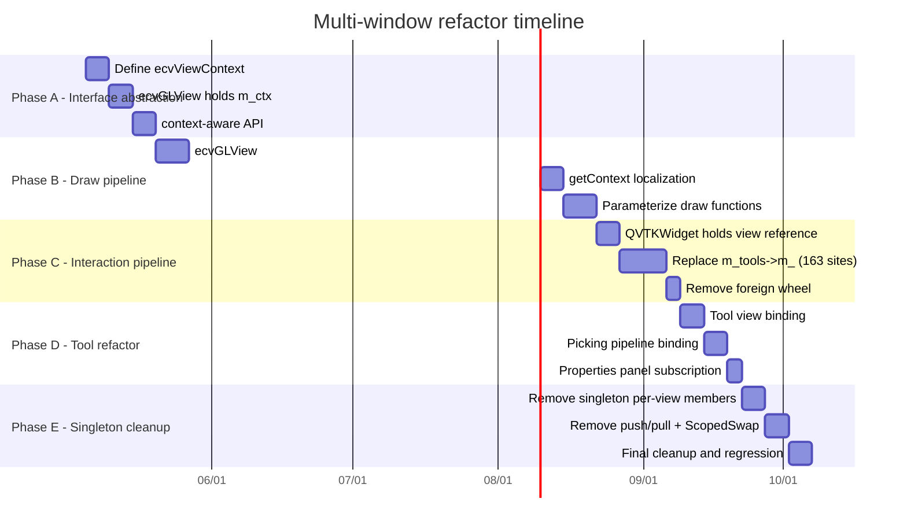

# ACloudViewer Multi-Window Rendering System Comprehensive Refactoring Plan

Based on the in-depth audit of CloudCompare / ParaView multi-window systems, this document presents a **phased, deliverable** refactoring path.

**Companion documents:**
- **`multi-window-paradigms-CloudCompare-ParaView.md`**: CC/PV/ACV three-way comparison
- **`audit-TheInstance-m_-members.md`**: full scan of singleton direct reads
- **`multi-window-paraview-alignment-design.md`**: ParaView ↔ ACloudViewer 15-dimension full alignment design (includes Phase M–N detailed migration plan)
- **`singleton-removal-migration-plan.md`**: detailed singleton API removal migration plan

---

## 1. Refactoring Goals

### 1.1 Ultimate Goal

Transform ACloudViewer's multi-window rendering from **"singleton + temporary switching"** to **"per-window independent state + coordinator"** mode, achieving:

1. **Complete inter-window isolation**: camera, picking, interaction, and rendering pipelines do not interfere
2. **No push/pull overhead**: eliminate state serialization/deserialization on view switch
3. **No ScopedVisSwap**: eliminate temporary replacement of global pointers during drawing
4. **Explicit tool/dialog binding**: each tool knows which view it operates on
5. **Optional view synchronization**: camera linking is an explicit Link, not implicit state leakage

### 1.2 Non-Goals

- **Do not** replace the VTK rendering backend with CC's pure OpenGL (explicitly ruled out)
- **Do not** introduce ParaView's full ServerManager/Proxy system (adopt patterns, not class names)
- **Do not** delete the `ecvDisplayTools` class in the short term (incremental refactor)

### 1.3 Refactoring Principles

| Principle | Meaning |
|------|------|
| **Clear data ownership** | Each status field has one and only one owner (ecvGLView or ecvDisplayTools, not both) |
| **Evaluate inward** | When reading state, evaluate against the **view being operated on**, not the global singleton |
| **Isolate first, delete later** | Route all code paths through view instances first, then safely remove singleton fields |
| **Incremental delivery** | Each phase is independently testable and revertible |

---

## 2. Do Not Conflate Three Concepts

| Name | Meaning | ACloudViewer status |
|------|------|-------------------|
| **CloudCompare original** | One `ccGLWindow` (QOpenGLWidget) per MDI sub-window, native OpenGL pipeline | **Not adopted**: CC GL pipeline not used |
| **ACloudViewer main path** | `VtkDisplayTools` (singleton) + `QVTKWidgetCustom` + `VtkVis` (VTK OpenGL backend) | **Adopted**: all 3D output goes through VTK |
| **Secondary viewport / split** | Each `ecvGLView` has its own `VtkVis` + `RenderWindow` + ScopedVisSwap | **Adopted**: GPU contexts are independent; CPU state shared via singleton |

**Conclusion:** The refactoring goal is **CC-level state isolation on the VTK backend**, borrowing PV's coordinator pattern.

---

## 3. Current Architecture Problem Overview

### 3.1 Singleton Access Hotspots

```
ecvDisplayTools singleton access points (~725 total)
├── s_tools.instance->m_*   in ecvDisplayTools.cpp    : 527 sites
├── m_tools->m_*             in QVTKWidgetCustom.cpp   : 163 sites
├── TheInstance()->m_*       in ecvDisplayTools.h      :  35 sites
└── Total direct singleton state reads/writes                                 : 725 sites
```

### 3.2 Mitigation Mechanism Coverage

| Mechanism | Coverage | Not covered |
|------|---------|--------|
| `push/pull`(30 fields) | interaction, mouse, viewport parameters, bubble, pivot, lighting |`m_activeItems`, `m_messagesToDisplay`, CPU matrix,`m_captureMode` |
| `ScopedVisSwap`(4 fields) | VtkVis, vtkWidget, ImageVis, glViewport | All non-VTK states |
| `ScopedRenderOverride`| call`getEffectiveView()`path | direct reading`s_tools.instance`of 527 places |
| `write-through`(20 places) | pointSize, lineWidth, displayParams | cameraClip, cameraFovy, viewportDefaultSize |
| `foreign wheel`| Scroll wheel events | Interaction events for other inactive windows |

---

## 4. Phased Refactoring Plan

### Phase A - Interface abstraction: introduction`ecvViewContext`(2-3 weeks)

**Goal:** Define a **unique container** for each window state. All reads and writes pass through this container and no longer read directly from the singleton.

#### A.1 Definition`ecvViewContext`

```cpp
// libs/CV_db/include/ecvViewContext.h
class ecvViewContext {
public:
    // === Viewport / camera ===
    ecvViewportParameters viewportParams;
    CCVector3d viewMatd[16];
    CCVector3d projMatd[16];
    bool validModelviewMatrix = false;
    bool validProjectionMatrix = false;

    // === Interaction / picking ===
    int interactionFlags = 0;
    PICKING_MODE pickingMode = DEFAULT_PICKING;
    bool pickingModeLocked = false;
    int pickRadius = 3;
    std::vector<Clickable2DItem*> activeItems;
    bool allowRectangularEntityPicking = true;

    // === Mouse / touch ===
    QPoint lastMousePos;
    QPoint lastMouseMovePos;
    bool mouseMoved = false;
    bool mouseButtonPressed = false;
    bool ignoreMouseReleaseEvent = false;
    bool touchInProgress = false;
    float touchBaseDist = 1.0f;

    // === Display ===
    HotZone* hotZone = nullptr;
    std::vector<ClickableItem> clickableItems;
    bool clickableItemsVisible = true;
    bool displayOverlayEntities = true;
    MessageList messagesToDisplay;

    // === Bubble / Pivot ===
    bool bubbleViewModeEnabled = false;
    float bubbleViewFov_deg = 90.0f;
    PivotVisibility pivotVisibility = PIVOT_SHOW_ON_MOVE;
    bool pivotSymbolShown = false;
    bool autoPickPivotAtCenter = true;

    // === Lighting ===
    float sunLightPos[4];
    bool sunLightEnabled = true;
    float customLightPos[4];
    bool customLightEnabled = false;

    // === Render flags ===
    bool exclusiveFullscreen = false;
    bool showCursorCoordinates = false;
    bool showDebugTraces = false;
    bool rotationAxisLocked = false;
    CCVector3d lockedRotationAxis;
};
```

#### A.2 `ecvGLView`hold`ecvViewContext`

```cpp
class ecvGLView : public ecvGenericGLDisplay {
    ecvViewContext m_ctx;  // single source of truth

    // replaces scattered members
    const ecvViewContext& context() const { return m_ctx; }
    ecvViewContext& context() { return m_ctx; }
};
```

#### A.3 `ecvDisplayTools`Provide context-aware API

```cpp
class ecvDisplayTools {
    // new: context-based API (Phase A adds first; keep old API)
    static void GetContext(CC_DRAW_CONTEXT& ctx, const ecvViewContext& viewCtx);
    static void SetPointSize(float size, ecvViewContext& viewCtx);
    static void SetLineWidth(float width, ecvViewContext& viewCtx);
    // ... add viewCtx parameter to all viewport-state APIs

    // keep old API but mark deprecated
    [[deprecated("Use context-aware version")]]
    static void SetPointSize(float size);
};
```

#### A.4 Acceptance Criteria

- [x] `ecvViewContext`Class definition and compilation pass
- [x] `ecvGLView`use`m_ctx`Replace existing dispersed members
- [x] `pushStateToSingleton` / `pullStateFromSingleton`Change to read and write`m_ctx`
- [x] At least 5 core static APIs have context-aware versions
- [x] Regression testing: 2+ MDI windows + 1 split window, no rollback for basic operations

---

### Phase B — Draw Pipeline Refactoring: Elimination of ScopedVisSwap (3-4 weeks)

**Target:** Each`ecvGLView`The drawing pipeline is **self-sufficient** and no longer temporarily replaces singleton pointers.

#### B.1 `ecvGLView::redraw`De-singletonization

```cpp
// goal: redraw no longer needs ScopedVisSwap
void ecvGLView::redraw(bool only2D, bool forceRedraw) {
    if (!m_visualizer3D || !m_vtkWidget) return;

    // use this view's VtkVis directly; do not switch singleton
    CC_DRAW_CONTEXT ctx;
    getContext(ctx);  // fill from m_ctx; no singleton read

    // background / 3D / 2D / clickable / overlay
    drawBackground(ctx);
    draw3D(ctx);
    drawForeground(ctx);

    m_visualizer3D->getRenderWindow()->Render();
}
```

#### B.2 `ecvGLView::getContext`Fully localized

```cpp
void ecvGLView::getContext(CC_DRAW_CONTEXT& CONTEXT) {
    CONTEXT.glW = m_vtkWidget->width();
    CONTEXT.glH = m_vtkWidget->height();
    CONTEXT.devicePixelRatio = m_vtkWidget->devicePixelRatioF();
    CONTEXT.display = this;
    CONTEXT.defaultPointSize = m_ctx.viewportParams.defaultPointSize;
    CONTEXT.defaultLineWidth = m_ctx.viewportParams.defaultLineWidth;
    // ... all from m_ctx; zero singleton dependency
}
```

#### B.3 DrawFunction accepts VtkVis parameters

at present`draw3D`Get it through a singleton inside the function`m_visualizer3D`. Refactored to parameter passing:

```cpp
void ecvGLView::draw3D(CC_DRAW_CONTEXT& ctx) {
    // use m_visualizer3D directly; not via ecvDisplayTools::GetVisualizer3D()
    auto* renderer = m_visualizer3D->getRenderer();
    // ...
}
```

#### B.4 Acceptance Criteria

- [x] `ecvGLView::redraw`delete`ScopedVisSwap`call
- [x] `ecvGLView::getContext`Don't read`s_tools.instance`
- [x] `ScopedRenderOverride`only for`ecvDisplayTools`own`RedrawDisplay`(main view)
- [x] Multi-window drawing without cross-windows or flickering
- [x] Performance: Measurable multi-window redrawAll performance improvement after eliminating push/pull + swap overhead

---

### Phase C — Interaction pipeline reconstruction:`QVTKWidgetCustom`De-singletonization (3-4 weeks)

**Goal:** Direct operation of mouse/keyboard/wheel event processing **To which the current widget belongs`ecvGLView`**, does not read or write the global singleton.

#### C.1 `QVTKWidgetCustom`Holds view reference

```cpp
class QVTKWidgetCustom {
    ecvGLView* m_ownerView;  // replaces m_tools (singleton pointer)

    // event handling uses m_ownerView->context() directly
    void mousePressEvent(QMouseEvent* e) override {
        auto& ctx = m_ownerView->context();
        ctx.lastMousePos = e->pos();
        ctx.mouseButtonPressed = true;
        // ...
    }
};
```

#### C.2 Eliminate foreign wheel patch

When each widget directly operates its own`ecvGLView`When , **foreign wheel no longer needs push/pull**:

```cpp
void QVTKWidgetCustom::wheelEvent(QWheelEvent* event) {
    auto& ctx = m_ownerView->context();
    // modify this view's zoom/fov/zNear directly
    // no pushStateToSingleton / pullStateFromSingleton
    // no foreignWheel check
    m_ownerView->onWheelEvent(event);
}
```

#### C.3 Reduce`m_tools->m_*`access

gradually`QVTKWidgetCustom.cpp`163 of`m_tools->m_*`Replace with`m_ownerView->context().xxx`：

| Category | Current Mode | Target Mode | Estimated Quantity |
|------|---------|---------|---------|
| Mouse status |`m_tools->m_lastMousePos` | `ctx.lastMousePos` | ~30 |
| Interactive Logo |`m_tools->m_interactionFlags` | `ctx.interactionFlags` | ~20 |
| Pickup |`m_tools->m_pickingMode` | `ctx.pickingMode` | ~15 |
| Viewport parameters |`m_tools->m_viewportParams` | `ctx.viewportParams` | ~40 |
| Bubble/Pivot | `m_tools->m_bubbleViewModeEnabled` | `ctx.bubbleViewModeEnabled` | ~20 |
| Miscellaneous | Miscellaneous | Via ctx or view API | ~38 |

#### C.4 Acceptance Criteria

- [x] `QVTKWidgetCustom`No longer held`m_tools`（`ecvDisplayTools*`）
- [x] `wheelEvent`The foreign wheel patch is no longer needed
- [x] `mousePressEvent`in`setActiveView`Reserved (UI activation semantics), but push/pull not required
- [x] Mouse operations (rotation, translation, zoom) in multiple windows do not affect each other

---

### Phase D - Tool/Dialog Refactoring: Explicit View Binding (2-3 weeks)

**Goal:** Draw from CC’s`linkWith`and PV's`activeViewChanged`Signals, tools/dialogs explicitly know which view they are operating on.

#### D.1 Add view binding to tool base class

```cpp
class ecvOverlayDialog {
    ecvGLView* m_boundView = nullptr;

    void bindToView(ecvGLView* view) {
        if (m_boundView) unbindFromView();
        m_boundView = view;
        connect(view, &ecvGLView::aboutToClose, this, &ecvOverlayDialog::onViewClosed);
    }

    // or subscribe to activeViewChanged
    void followActiveView() {
        connect(&ecvViewManager::instance(), &ecvViewManager::activeViewChanged,
                this, &ecvOverlayDialog::onActiveViewChanged);
    }
};
```

#### D.2 Pickup pipeline binding

`ccPickingHub`Already basically correct (tracking MDI activation windows), but make sure:
- `doPicking`Use **the current picking window**`ecvViewContext`, do not read the singleton
- `m_deferredPickingTimer`Location data associated with a **specific view**

#### D.3 Property Panel Subscription`activeViewChanged`

```cpp
// refresh properties panel on view switch
connect(&ecvViewManager::instance(), &ecvViewManager::activeViewChanged,
        propertiesPanel, &PropertiesPanel::refreshFromView);
```

#### D.4 Acceptance Criteria

- [x] all`ecvOverlayDialog`Subclass use`bindToView`or`followActiveView`
- [x] `doPicking`Don't read`s_tools.instance->m_lastMousePos`
- [x] The properties panel displays the parameters of the currently active view
- [x] No state remains when switching windows between tools

---

### Phase E — Cleaning up the singleton:`ecvDisplayTools`Weight loss (2-3 weeks)

**Target:**`ecvDisplayTools`Degenerates into **tool function collection + main view compatibility layer** and no longer holds per-view status.

#### E.1 Classified processing of singleton members

| Categories | Members | Processing |
|------|------|---------|
| **already in ecvViewContext** |`m_viewportParams`, `m_interactionFlags`, `m_pickingMode`, mouse state, hotZone, bubble, pivot, lighting | **Delete** singleton copy |
| **Globally semantically correct** |`m_globalDBRoot`, `m_win`, `m_mainScreen`| **RESERVED** AT`ecvDisplayTools` |
| **Should be in ecvViewManager** |`m_currentScreen`, `m_removeFlag`| **Migration** |
| **Should be in VtkDisplayTools** |`m_visualizer3D`, `m_vtkWidget`, `m_visualizer2D`| For **primary fallback** only |

#### E.2 Delete push/pull

When all reads and writes pass`ecvViewContext`hour,`pushStateToSingleton` / `pullStateFromSingleton`No longer needed.

#### E.3 Delete ScopedVisSwap

when`ecvGLView::redraw`When completely self-sufficient,`VtkDisplayTools::ScopedVisSwap`Can be deleted.

#### E.4 Delete foreign wheel patch

when`QVTKWidgetCustom`Direct operation`m_ownerView`, the foreign wheel logic is simplified to ordinary event forwarding.

#### E.5 Acceptance Criteria

- [x] `ecvDisplayTools`of per-view members reduced to 0
- [x] `pushStateToSingleton` / `pullStateFromSingleton`delete
- [x] `ScopedVisSwap`delete
- [x] `s_tools.instance->m_*`Number of direct reads reduced from 527 to < 50 (global semantic members only)
- [x] `m_tools->m_*`Number of direct reads dropped from 163 to 0
- [x] Regression: full functional test coverage

---

### Phase F - Advanced functions (optional, depending on product requirements)

| Function | Reference | Description |
|------|------|------|
| **Layout Persistence** | PV`vtkSMViewLayoutProxy`| Serialize split layout to project file |
| **per-view Representation** | PV `pqDataRepresentation`| The same object can have different colors/visibility in different views |
| **Selection Link** | PV `vtkSMSelectionLink`| Select synchronization between multiple views (optional) |
| **Tab multiple layout** | PV`pqTabbedMultiViewWidget`| Multiple Tab pages each have independent layout |

---

## 5. Phase Dependencies and Timeline



**Total estimate: 12–16 weeks (sequential); partial B/C parallelism can compress to 10–12 weeks**

---

## 6. Risks and Mitigation

| Risk | Level | Mitigation |
|------|------|------|
| **Plugin Compatibility** | High | Phase A retains old API (deprecated), no break external plugins |
| **Difficulty in rollback** | High | Each stage is an independent branch with clear acceptance criteria; feature flag controls the old and new paths |
| **Performance Rollback** | Medium | Eliminating push/pull/swap should **improve** performance; focus on per-view`getContext`cache locality |
| **Concurrent Rendering** | Medium |`ecvViewContext`It is a value type and has better thread safety than singleton pointer |
| **Missing Path** | High | End of each stage run`grep 'TheInstance()->m_\|s_tools.instance->m_\|m_tools->m_'`Verify Trend |

---

## 7. Efficient Refactoring Principles (VTK + Singleton Hybrid)

1. **First ensure that "the pointer points to the correct VtkVis"**: Phase B eliminates ScopedVisSwap
2. **Re-ensure that "the views of parameter reading and writing are consistent"**: Phase C eliminates m_tools->m_* direct reading
3. **Finally do "Delete Singleton Fields"**: Stage E, it is only worth moving after the first two items are stable.
4. **Each stage has a fallback path**: feature flag or compilation switch

---

## 8. Cross-References to Companion Documents

- CC/PV paradigm comparison and Mermaid diagrams: see **`multi-window-paradigms-CloudCompare-ParaView.md`**
- Full singleton direct-read scan: see **`audit-TheInstance-m_-members.md`**
- This document focuses on the **refactoring plan and execution schedule**

---

## 9. Execution Progress Tracking (updated 2026-04-24)

| Phase | Status | Key outcomes |
|------|------|---------|
| **A** Interface Abstraction | **DONE** |`ecvViewContext`definition,`effectiveCtx()`Bridging, context-aware API |
| **B** Draw pipeline | **DONE** |`getContext`localization,`RedrawDisplay`per-view delegation,`ScopedRenderOverride`Removed, deprecated old API |
| **C** Interaction Pipeline | **DONE** |`m_ownerView` + `ownerCtx()`Eliminate full accessor and foreign wheel |
| **D** Tool Refactoring | **DONE** |`bindToView`binding,`doPicking` via `effectiveCtx()`, the property panel refreshes with the active view |
| **E** Clean up singleton | **DONE** |`pushState/pullState`Deleted (16→0), ~35 per-view member declaration deleted;`curCtx()`Unify 29 accessors (single branch point);`ScopedHotZoneRender`Deleted in M4;`m_tools`Members have been completely eliminated (2026-05-07) |
| **F** Advanced functions | **DONE** | per-view opacity override has been connected to the drawing pipeline; KD-tree layout model (`ecvViewLayoutProxy`)；`ecvMultiViewWidget` + `ecvTabbedMultiViewWidget`(ParaView-level multi-view/Tab layout);`ecvViewManager`expanded to`pqActiveObjects`mode (source/representation trace +`triggerSignals`bulk signal) |

### Current Metrics

| Metric | Initial | Current | Target |
|------|-------|--------|------|
| `s_tools.instance->m_*`(ecvDisplayTools.cpp) | 527 | 55 (all global members) | < 50 |
| `m_tools->m_*`(QVTKWidgetCustom.cpp) | 163 | **0** (m_tools member deleted) | 0 ✅ |
| `pushState/pullState`Quotes | 16 | **0** | 0 |
| `ScopedHotZoneRender`Quotes | 18 | **0** (M4 deleted) | 0 ✅ |

### Remaining Items

1. ~~**ScopedHotZoneRender**~~: ✅ Completely removed in Phase M4.`DrawClickableItems`parameterized,`beginPrimaryRender`/`endPrimaryRender`Deleted.
2. ~~**m_tools fallback**~~: ✅ Completely eliminated on 2026-05-07.`QVTKWidgetCustom`No longer held`ecvDisplayTools* m_tools`member. All ~15 references have been replaced with: static API calls (`ecvDisplayTools::GetClick3DPos/Redraw2DLabel/Update2DLabel/UpdateDisplayParameters`）、`displayTarget()`routing(`elapsedMs()`/`scheduleFullRedraw()`/`getSceneDB()`/`getOwnDB()`）、`ecvViewManager::instance()`routing(`entitySelectionChanged`Signal,`displayTools()`access).

**All remaining items cleared.**

### Phase E/F Hardening Log (2026-04-25)

| Improvement | File | Notes |
|--------|------|------|
| `curCtx()`unity |`QVTKWidgetCustom.h/cpp`| 29 context accessors changed from independent branches to delegates`curCtx()`, branch logic normalization |
| Per-view opacity | `ecvHObject.cpp` | `ccHObject::draw`Query in`ecvViewRepresentation`override opacity |
| Layout persistence API | `ecvViewManager.h/cpp` | `saveLayout(GeometryProvider)` / `restoreLayout(QJsonObject, LayoutApplier)`Callback serialization |

### Bug Fix Log (2026-04-24)

| Bug | Fix | File |
|-----|---------|------|
| **Window activation** | Verified: only canvas click + MDI tab activation, no hover/focus/DBtree activation |`QVTKWidgetCustom.cpp`, `MainWindow.cpp` |
| **Default window deletion crash** |`SetCurrentScreen`Null pointer guard,`adoptNewPrimary`renew`m_mainScreen`、`prepareViewClose`edge-case processing |`ecvDisplayTools.cpp`, `VtkDisplayTools.cpp`, `MainWindow.cpp` |
| **New window configuration inheritance** |`copyPrimaryViewConfig`Use instead`effectiveCtx()`(active view) instead of always`m_primaryCtx`;Reset mouse/touch transients |`MainWindow.cpp` |

### Lifecycle Hardening Log (2026-04-25)

| Issue | Fix | File |
|------|---------|------|
| **MDI deactivation handling** |`on3DViewActivated(nullptr)`No longer returns silently, it will be called`setActiveView(nullptr)`synchronous`ecvViewManager` | `MainWindow.cpp` |
| **activeViewChanged(nullptr)** | Lambda no longer ignores null`newActive`,allow`rebindToolsToActiveView`Handling cleanup logic |`MainWindow.cpp` |
| **unregisterView replacement strategy** | From`m_views.first()`Change to`m_views.last()`(Recently registered = more likely to be user focus) |`ecvViewManager.cpp` |
| **Duplicate registerView** | Remove`new3DView`excess in`RegisterGLDisplay` + `registerView`(Already in`ecvGLView::Create`Completed in) |`MainWindow.cpp` |
| **rebind null screen** | `rebindToolsToActiveView`When screen is null, first unlink MDI dialogs and then call`updateUI()` | `MainWindow.cpp` |
| **adoptNewPrimary select** |`prepareViewClose`priority use`ecvViewManager::getActiveView()`as a new primary, rather than always taking`getAllViews()`first |`MainWindow.cpp` |
| **Last window closed** | No survivors`ecvGLView`when reverting to the built-in primary widget (`getQVtkWidget()`) instead of`SetCurrentScreen(nullptr)` | `MainWindow.cpp` |

### Comprehensive Audit Hardening Log (2026-04-25 cont.)

| Severity | Issue | Fix | File |
|--------|------|---------|------|
| **CRITICAL** | `GetCurrentScreen()`null pointer |`UpdateScreen`/`setInteractionMode`/`setPickingMode`Add null guard |`ecvDisplayTools.cpp` |
| **CRITICAL** | `m_vtkWidget`Hanging pointer |`ecvGLView::m_vtkWidget`Change to`QPointer<QVTKWidgetCustom>` | `ecvGLView.h` |
| **CRITICAL** | Pipeline recovery failed | Add`resetToBuiltInPipeline()` + `m_builtInVis`/`m_builtInWidget`Permanent Quote |`VtkDisplayTools.h/cpp`, `MainWindow.cpp` |
| **HIGH** | `m_visualizer2D`Not synced |`adoptNewPrimary`/`restorePrimaryView`MidSync 2D Visualizer |`VtkDisplayTools.cpp` |
| **HIGH** | Cross-view state pollution |`QVTKWidgetCustom`accessor passes`m_ownerView`Route rather than always use singleton |`QVTKWidgetCustom.cpp`, `ecvGLView.h` |
| **IMPORTANT** | Static inline null pointer |`GetScreenRect`/`SetScreenSize`/`GetScreenSize`/`Update`add null guard |`ecvDisplayTools.h` |
| **IMPORTANT** | Full screen action status residual |`on3DViewActivated`middle`!screen`Update when fullscreen action |`MainWindow.cpp` |
| **IMPORTANT** | HotZone Suspension |`resetToBuiltInPipeline()`None`localHotZone`Clear when`m_hotZone` | `VtkDisplayTools.cpp` |
| **MEDIUM** | Transient state residual | Add`ecvViewContext::resetInteractionState()`Centralized Reset |`ecvViewContext.h`, `MainWindow.cpp` |

### Phase G — ParaView compatible architecture (2026-04-27)

Introducing multi-window architecture components fully aligned with ParaView:

| Component | ParaView counterpart | File | Notes |
|------|-------------|------|------|
| `ecvViewLayoutProxy` | `vtkSMViewLayoutProxy` | `libs/CV_db/include/ecvViewLayoutProxy.h`, `src/ecvViewLayoutProxy.cpp`| KD-tree layout model: heap index binary tree, Split/Assign/Collapse/Swap/Equalize/Maximize, JSON serialization |
| `ecvMultiViewWidget` | `pqMultiViewWidget` | `app/ecvMultiViewWidget.h`, `.cpp`| UI layer: Subscription`layoutChanged()`Rebuild the QSplitter tree, click to activate event filtering, and perform Split/Close/Maximize operations using Proxy |
| `ecvTabbedMultiViewWidget` | `pqTabbedMultiViewWidget` | `app/ecvTabbedMultiViewWidget.h`, `.cpp`| Tab container: one per Tab`ecvMultiViewWidget` + `ecvViewLayoutProxy`, "+" button to create a new Tab, right-click to rename/Equalize/close |
| `ecvViewManager`Extension |`pqActiveObjects` | `libs/CV_db/include/ecvViewManager.h`, `src/ecvViewManager.cpp`| New`activeSource`/`activeRepresentation`/`activeLayout`track,`triggerSignals()`Batch signal, Layout proxy registration management |

### Phase H — QMdiArea replaced by ecvTabbedMultiViewWidget (2026-04-27)

**Core Switch**:`setCentralWidget(m_mdiArea)` → `setCentralWidget(m_tabbedMultiView)`

| Change category | Content | File |
|---------|------|------|
| **Center Control Switch** |`m_mdiArea = nullptr`；`setCentralWidget(m_tabbedMultiView)`exist`initParaViewLayoutSystem()`call after |`MainWindow.cpp::initial()` |
| **View life cycle** |`viewClosing(ecvGenericGLDisplay*)`Signal chain:`ecvMultiViewWidget` → `ecvTabbedMultiViewWidget` → `MainWindow::onViewClosingFromLayout`;Handle unregister, primary takeover, camera link removal |`ecvMultiViewWidget.h/cpp`, `ecvTabbedMultiViewWidget.h/cpp`, `MainWindow.cpp` |
| **Overlay Positioning** |`centralViewWidget()`Helper methods instead of hard coding`m_mdiArea`Geometry |`MainWindow.h/cpp` |
| **View Enumeration** |`getRenderWindowCount`/`GetRenderWindows`/`GetRenderWindow`/`getWindow`/`getActiveWindow`/`addWidgetToQMdiArea`Go first`m_tabbedMultiView->allViews()` | `MainWindow.cpp` |
| **New View** |`new3DView()` → `m_tabbedMultiView->createTab()`;ViewFactory automatically created`ecvGLView`and assigned to cell 0 |`MainWindow.cpp` |
| **Split Screen** |`splitCurrentView()`entrust`ecvMultiViewWidget::onSplitHorizontal/Vertical` | `MainWindow.cpp` |
| **Close view** |`createViewFrame`The close lambda delegate`ecvMultiViewWidget::onCloseView` | `MainWindow.cpp` |
| **Camera/Animation Dialog** | Remove`QMdiSubWindow`Hard dependency; null guard +`activeWin`Downgrade |`MainWindow.cpp` |
| **Active Frame Highlight** |`markActiveViewFrame`from`m_tabbedMultiView`search`CentralWidgetFrame` | `MainWindow.cpp` |
| **Decoration/Lock/Disable** |`setViewDecorationsVisible` / `lockViewSize` / `enableAll` / `disableAll`Walk`m_tabbedMultiView` API | `MainWindow.cpp` |
| **Event Filtering** |`m_tabbedMultiView`Install`installEventFilter(this)`Used for Resize→overlay relocation |`MainWindow.cpp` |
| **Menu Update** |`updateMenus()`Access`activeViewChanged`signal (replacing`subWindowActivated`） | `MainWindow.cpp` |
| **Destruction Cleanup** | null-guard`m_mdiArea->disconnect()`;New`m_tabbedMultiView->reset()` | `MainWindow.cpp` |

### Phase I — Deep cleaning and improvement (continued on 2026-04-27)

**QMdiArea Complete Clear:**

| Change | Content | File |
|------|------|------|
| **m_mdiArea member removed** |`QMdiArea* m_mdiArea`from`MainWindow.h`Delete |`MainWindow.h` |
| **QMdiArea forward decl remove** | Keep only`QMdiSubWindow`Forward declaration (interface compatible) |`MainWindow.h` |
| **Dead code removal (~67 places)** | All`m_mdiArea->subWindowList()`/`activeSubWindow()`/`addSubWindow()`Branch removal |`MainWindow.cpp` |
| **Close logic simplified** | QSplitter→QMdiSubWindow unpacking logic in close button/context menu is removed and unified`ecvMultiViewWidget::onCloseView` | `MainWindow.cpp` |
| **new3DView Simplified** | Remove MDI`addSubWindow`path, keep only`m_tabbedMultiView->createTab()` | `MainWindow.cpp` |
| **splitCurrentView Simplification** | Remove the legacy widget traversal path and keep only`ecvMultiViewWidget`Commission |`MainWindow.cpp` |
| **toggleMaximize rewrite** | Removed MDI maximize/restore, added`ecvMultiViewWidget::onMaximize`Commission |`MainWindow.cpp` |
| **splitViewFrame Cleanup** | Remove`QMdiSubWindow`parent detection, retain QSplitter/QLayout path |`MainWindow.cpp` |
| **Camera/Animation Dialog** | Remove completely`QMdiSubWindow`parent finds the sum`subWindowActivated`Connect |`MainWindow.cpp` |
| **findActiveAction override** | From`ecvViewManager::getActiveView()`Find active toolbar, replace`m_mdiArea->activeSubWindow()` | `MainWindow.cpp` |
| **deactivateRegisterPointPairTool** | Remove`QMdiSubWindow`restore logic |`MainWindow.cpp` |

**cvPerViewSelectionManager full integration:**

| Change | Content | File |
|------|------|------|
| **QMdiArea dependency removal** |`QMdiArea* m_mdiArea` → `QWidget* m_viewRoot`；`setMdiArea()`Replace with`setViewRoot()` | `cvPerViewSelectionManager.h` |
| **Search logic simplified** |`uncheckOtherViews`/`uncheckAllMirrors`from`m_viewRoot->findChildren<>("ViewSelectionToolBar")`Search and remove in one step`subWindowList`Two-level traversal |`cvPerViewSelectionManager.cpp` |
| **MainWindow Wiring** |`initParaViewLayoutSystem()`call after`setViewRoot(m_tabbedMultiView)` | `MainWindow.cpp` |
| **Safety Net Update** | Select the tool retroactive populate and use it instead`centralViewWidget()` + `findChildren` | `MainWindow.cpp` |

**Camera Link integrity fixes:**

| Change | Content | File |
|------|------|------|
| **Primary view removeView notch** |`onViewClosingFromLayout`and`prepareViewClose`in, when`closingDisplay == TheInstance()`Also called when`removeView(primaryDT->get3DViewer())` | `MainWindow.cpp` |

**Select Manager Audit Conclusion:**

Compare ParaView`pqSelectionManager`With the existing architecture, confirm that the following ParaView core patterns are implemented:

| ParaView pattern | ACloudViewer implementation |
|--------------|-----------------|
| `ActiveReaction`Static Guard (Single Active Selection Mode) |`cvRenderViewSelectionReaction::ActiveReaction` |
| `setActiveView()`Rebinding when switching views |`rebindToolsToActiveView()` → `cvSelectionToolController::setVisualizer()` |
| Per-view action mirror |`cvPerViewSelectionManager::populateToolbar()` |
| Cross-view uncheck |`cvPerViewSelectionManager::uncheckOtherViews()` |
| ESC global clear |`disableAllTools()` + `uncheckAllMirrors()` |
| `beginSelection()`/`endSelection()`State Machine |`cvRenderViewSelectionReaction`Complete implementation |

**Phase I continued - Interface cleanup (2026-04-27):**

| Change | Content | File |
|------|------|------|
| **`addWidgetToQMdiArea` → `addViewWidget`** | Rename the interface to redirect to`m_tabbedMultiView` | `ecvMainAppInterface.h`, `MainWindow.h/cpp` |
| **`getMDISubWindow`Remove** | Functions and declarations removed (mainWindow internal use only) |`MainWindow.h/cpp` |
| **`on3DViewActivated`Remove** | Dead code removed (no longer connected`QMdiArea::subWindowActivated`） | `MainWindow.h/cpp` |
| **`QMdiSubWindow`Forward declaration removal** |`MainWindow.h`middle`class QMdiSubWindow`Delete |`MainWindow.h` |
| **`ecvCameraParamEditDlg::linkWith(QMdiSubWindow*)`Remove** | Keep only`linkWith(QWidget*)` | `ecvCameraParamEditDlg.h/cpp` |
| **`ecvAnimationParamDlg::linkWith(QMdiSubWindow*)`Remove** | Keep only`linkWith(QWidget*)` | `ecvAnimationParamDlg.h/cpp` |
| **`ccPickingHub::onActiveWindowChanged(QMdiSubWindow*)`Remove** | Keep only`onActiveViewWidgetChanged(QWidget*)` | `ecvPickingHub.h/cpp` |
| **`#include <QMdiSubWindow>`Remove** | from`.cpp`Remove useless include | multiple files |

---

### Integrity Audit — ParaView vs ACloudViewer Comparison (2026-04-27 Final Audit)

#### IMPLEMENTED

| ParaView feature | ACloudViewer implementation |
|--------------|-----------------|
| KD-tree layout model (`vtkSMViewLayoutProxy`) | `ecvViewLayoutProxy`(heap index, split/assign/collapse/swap/equalize/maximize) |
| KD-tree UI image (`pqMultiViewWidget`) | `ecvMultiViewWidget`(monitor`layoutChanged`, rebuild the QSplitter tree) |
| Tab container (`pqTabbedMultiViewWidget`) | `ecvTabbedMultiViewWidget`(One layout + widget per Tab) |
| Center control switching |`setCentralWidget(m_tabbedMultiView)`Complete |
| Activity Object Coordination (`pqActiveObjects`) | `ecvViewManager` (activeView/Source/Repr + triggerSignals) |
| per view state (`vtkSMViewProxy`) | `ecvViewContext` (Phase A) |
| Per-view select toolbar (`pqStandardViewFrameActionsImplementation`) | `cvPerViewSelectionManager` + `setViewRoot` |
| Select Management (`pqSelectionManager` + `pqRenderViewSelectionReaction`) | `cvViewSelectionManager` + `cvRenderViewSelectionReaction` |
| Camera linkage (`vtkSMCameraLink`) | `VtkCameraLink`(including primary view cleaning) |
| Title bar split/max/close button |`ecvMultiViewFrameManager`Create |
| Tab right-click menu (rename/close/equalize) |`ecvTabbedMultiViewWidget` context menu |
| "+" button creates new Tab | Corner QToolButton |
| `lockViewSize`/Preview | Simplified version`CentralWidgetFrame` max-size |
| Drag and drop exchange between frames |`ecvMultiViewFrameManager` drag-drop (mime + `swapViewFrames`) |
| layout JSON serialization (`saveState`) | `ecvViewLayoutProxy::saveState()` |
| Layout operation Undo/Redo (`BEGIN_UNDO_SET`) | `ecvViewLayoutProxy::beginUndoSet/endUndoSet`(split/collapse/equalize/swap/maximize + splitter drag anti-shake) |
| Layout persistence recovery (session restore) |`loadState`pass`ecvViewManager::findView(view_id)`Rebind view pointer |
| Tab/layout session persistence |`ecvTabbedMultiViewWidget::saveLayoutState/restoreLayoutState` + `QSettings` |
| Empty cell creates UX (`pqEmptyView`) | `createEmptyCellWidget`("Create Render View" button + view factory) |
| Popout layout to independent window |`ecvMultiViewWidget::togglePopout()` + tab context menu |
| Fullscreen switch (F11/Ctrl+F11) |`ecvTabbedMultiViewWidget::toggleFullScreen/toggleFullScreenActiveView` |
| Splitter style (4px gap) |`SPLITTER_GAP` + hover/pressed stylesheet |
| Equalize Views (Horiz/Vert/Both) | `ecvViewLayoutProxy::equalize(Direction)`+ Display menu + Right-click menu |
| Per-view background/axis independent control | View Properties right-click menu (Gradient Background / Orientation Axes / Camera Widget) |

#### Partial implementation (PARTIALLY)

| Feature | Difference | Priority |
|------|------|--------|
| **View frame toolbar** | Some buttons (capture/camera/selection), no hint-gated full set | LOW |

#### Not implemented (MISSING)

| Feature | Notes | Priority |
|------|------|--------|
| ~~**Per-view camera undo/redo**~~ ✅ | Implemented:`VtkVis::cameraUndo/Redo` + `MainWindow`Per Frame Toolbar Button | ✅ RESOLVED |
| **"Convert To..." View type switching** | View type registry + menu (only applicable to multi-view type scenarios) | LOW |

#### Not applicable (NOT_APPLICABLE)

| Feature | Notes |
|------|------|
| SM proxy session / XML state | ParaView’s unique ServerManager architecture |
| Python trace (`SM_SCOPED_TRACE`) | ParaView specific |
| Distributed/Tile Display |`ShowViewsOnTileDisplay` |
| Spreadsheet/Chart view type | The corresponding view implementation needs to be added first |
| Annotation filtering | Multi-client UI specific |

**Architecture comparison (final):**

| Dimension | ParaView | ACloudViewer |
|------|----------|-------------|
| Layout model |`vtkSMViewLayoutProxy` (KD-tree) | `ecvViewLayoutProxy`(KD-tree, API alignment) |
| Layout UI |`pqMultiViewWidget` | `ecvMultiViewWidget` |
| Tab Management |`pqTabbedMultiViewWidget` | `ecvTabbedMultiViewWidget` |
| Center Control |`pqTabbedMultiViewWidget` | `ecvTabbedMultiViewWidget` |
|Activity objects|`pqActiveObjects` | `ecvViewManager` |
| Per view status |`vtkSMViewProxy` | `ecvViewContext` |
| View creation |`pqObjectBuilder::createView` | `ecvGLView::Create` + layout `assignView` |
| Per-view representation |`vtkSMRepresentationProxy` | `ecvViewRepresentation` |
| Camera linkage |`vtkSMCameraLink` | `VtkCameraLink` |
| Select Management |`pqSelectionManager` | `cvViewSelectionManager` + `cvPerViewSelectionManager` |
| Per-view toolbar | `pqStandardViewFrameActionsImplementation` | `cvPerViewSelectionManager` |
| Layout Undo |`pqUndoStack` + `BEGIN_UNDO_SET` | `beginUndoSet/endUndoSet`(memento mode) |
| Session recovery | XML state + proxy locator | JSON +`view_id`Rebind +`QSettings`Persistence |
| View type registration | proxy definitions + "Convert To" | Single type (3D); empty cell "Create Render View" button |
| Per-view properties | RenderView Properties panel | Right-click "View Properties" menu (Background/Axis) |
| Popout / Fullscreen | `pqMultiViewWidget::togglePopout` | `togglePopout` + F11/Ctrl+F11 |

### Phase J — Critical runtime regression fix (2026-04-27)

**Problem**: Compilation passes after Phase H/I is completed, but after startup, **the main rendering view is not displayed at all**, and the content of Layout #1 tab is a blank gray area.

**Root cause**:`ecvMultiViewWidget::buildCell()`only through`dynamic_cast<ecvGLView*>`handle view but main view`ecvDisplayTools::TheInstance()`The type is`VtkDisplayTools*`(No`ecvGLView`subclass), resulting in the entire view frame not being created after the cast failed.

| Change category | Content | File |
|---------|------|------|
| **buildCell generalization** |`dynamic_cast<ecvGLView*>` → `view->asWidget()` + `view->getTitle()`, supports any`ecvGenericGLDisplay*` | `ecvMultiViewWidget.cpp` |
| **FrameWiredCallback type** |`ecvGLView*` → `ecvGenericGLDisplay*`, make sure the buttons of the main view frame are also connected correctly |`ecvMultiViewWidget.h`, `ecvTabbedMultiViewWidget.h`, `MainWindow.cpp` |
| **activateViewAndDo generalization** |`dynamic_cast<ecvGLView*>` → `ecvGenericGLDisplay::FromWidget()`, the main view toolbar button activates correctly |`MainWindow.cpp` |
| **3D/2D toggle fix** | Same as above, use instead`ecvGenericGLDisplay*` | `MainWindow.cpp` |
| **Remove showMaximized()** | Remove old QMdiArea era`viewWidget->showMaximized()`call |`MainWindow.cpp` |
| **splitBtn objectName** | Supplementary`btnSplitHorizontal`/`btnSplitVertical`make`FrameWiredCallback`can pass`findChild`Find and reconnect |`MainWindow.cpp` |

**`dynamic_cast<ecvGLView*>`Full Troubleshooting (15 fixes): **

| Function | Issue | Fix |
|------|------|------|
| `getActiveWindow()`| Returned when the main view is active`nullptr` | `activeDisplay->asWidget()` |
| `GetRenderWindows()`| Missing main view |`display->asWidget()` |
| `GetRenderWindow(title)`| Main view not found |`display->getTitle()` |
| `getWindow(index)`| Unable to get main view by index |`display->asWidget()` |
| `findActiveAction`| Shortcut key distribution is not valid for main view |`activeDisplay->asWidget()` |
| 9 places`rebindToolsToActiveView`guard | Unnecessary cast causes main view to skip tool binding | Pass directly`ecvGenericGLDisplay*` |

**reserved`dynamic_cast<ecvGLView*>`(Correct scenario): **

| Location | Reason |
|------|------|
| `onViewClosingFromLayout` / `prepareViewClose`| Required`getVtkWidget()` / `getVisualizer3D()`wait`ecvGLView`Unique API |
| `rebindToolsToActiveView`Internal | Required`switchActiveView()`Parameters (VtkVis + Widget) |
| `new3DView`| Return`ecvGLView*`Type |
| `refreshAllViews`| Required`zoomGlobal()`wait`ecvGLView`Unique API |
| `ecvMultiViewWidget::onCloseView/destroyAllViews`| Required`aboutToClose`Signal (ecvGLView specific) |

---

### Phase K — Main view initialization race fix (2026-04-27)

**Issue**: After Phase J fix, the 3D render view is displayed in the **Sidebar** instead of the central Layout area. Layout #1 tab The center area is blank gray.

**Root cause (Widget life cycle race condition)**:

1. `initParaViewLayoutSystem()`Change the main view (`ecvDisplayTools::TheInstance()`) assigned to layout cell 0
2. `restoreLayoutState()`Loads the last saved split layout (containing`view_id: 1`and`view_id: 1001`）
3. `loadState()`implement`m_tree.clear()`, **Clear main view assignment**
4. `reload()`Called on the old frame containing the VTK widget`deleteLater()`, the main view widget is **orphaned**
5. `createLeafViews`create new`ecvGLView`instance fills empty cells, but the main`ecvDisplayTools`Instance floats on MainWindow and renders to sidebar

| Change category | Content | File |
|---------|------|------|
| **reload() protect view widget** | delete old frame before`setParent(nullptr)`Detach the view widget to prevent`deleteLater()`Joint destruction |`ecvMultiViewWidget.cpp` |
| **Delay main view assignment** |`initParaViewLayoutSystem()`The main view is no longer allocated, only empty tabs are created; allocation is deferred until`restoreLayoutState`After |`MainWindow.cpp` |
| **Make sure the main view is always in the layout** |`initial()`New`ensurePrimaryViewInLayout`Logic: Check if the main view is in the layout, if not found, find the first leaf node and replace |`MainWindow.cpp` |

**Initialization timing (after repair)**:

```
initial()
  ├── initParaViewLayoutSystem()     → create empty tab (no main view assignment)
  ├── setCentralWidget()
  ├── restoreLayoutState()           → load from QSettings (may overwrite tree)
  ├── ensurePrimaryViewInLayout()    → ensure main view occupies a cell
  └── setupShortcuts()

showEvent()
  └── restoreGUILayout()             → restore dock/toolbar layout (not central widget)
```

---

### Phase L — Singleton API completely cleared (2026-04-30)

**After completing ParaView level layout in Phase A–K, execute separately`ecvDisplayTools`Singleton API cleanup. **

See **[singleton-removal-migration-plan.md](singleton-removal-migration-plan.md)** v18.0.

**Outcome summary:**

| Indicators | During Phase K | After Phase L |
|------|-----------|-----------|
| `ecvDisplayTools::`Non-core active citations | ~1000+ | **0** |
| contains`ecvDisplayTools::`Number of files | ~50+ | **9** (all core infrastructure) |
| `Init()`/`TheInstance()`/`HasInstance()`/`ReleaseInstance()`| Public API | **removed**, replaced with`sharedTools()` (friend of ecvViewManager) |
| nested types (`HotZone`/`MessageToDisplay`/`ClickableItem`/`PickingParameters`) | in`ecvDisplayTools.h`| **Extract** to`ecvDisplayTypes.h` |
| `ecvViewManager`Repeaters | None | **12** (shared*() series) |
| Python wrapper enum source |`ecvDisplayTools::ENUM` | `ecvGenericGLDisplay::ENUM`(56 moves) |
| Not used`#include ecvDisplayTools.h`| ~30 files | **Remove All** |

---

## 10. Next-Phase TODO (2026-04-30 v2 — Eliminate Primary/Secondary Distinction)

### Core principle: all views share the same structure; no Primary distinction

> **ParaView**: Each view is`pqRenderView`— There is no concept of "main view".`pqActiveObjects`Only the focused view is tracked.
>
> **CloudCompare**: Each window is`ccGLWindowInterface`— All structures are the same.`MainWindow::TheInstance()`It's an application singleton, not a view singleton.
>
> **ACloudViewer current issues**:`VtkDisplayTools`Acts as both "VTK Engine Service" and "Main View". This dual role results in:
> - `switchActiveView` / `restorePrimaryView` / `resetToBuiltInPipeline`Complex switching logic
> - `m_builtInVis` / `m_builtInWidget` / `m_primaryVis` / `m_primaryWidget`etc. Members used only by the main view
> - `ScopedHotZoneRender`RAII swap (because`DrawClickableItems`read global`s_tools`state)
> - `QVTKWidgetCustom::curCtx()`The primary/secondary dual branch (~90+`m_tools`Only 6 places in the reference are context fallbacks, the rest are signals/services/status)
> - `beginPrimaryRender` / `endPrimaryRender`(Singleton drawing path temporarily switches back to the main line)
> - `dynamic_cast<ecvGLView*>`14 branches (6 of which explicitly handle "main view is not ecvGLView")
>
> **Goal**: Split`VtkDisplayTools`Serves two roles: **pure engine services** (CC→VTK conversion, actor lookup, etc.) and **views** (`ecvGLView`). The first view and subsequent views at startup are exactly the same, and there is no longer the concept of Primary.

---

### Phase M Overview

```
Phase M1: VtkDisplayTools role split ─────────────────────┐
  ├── M1.1 Classify members/methods (A/B/C)                         │
  ├── M1.2 VtkDisplayTools → VtkEngine (pure service)          │
  └── M1.3 Category C → ecvGLView                       │
                                                          │
Phase M2: QVTKWidgetCustom unification ─────────────────────────┤
  ├── M2.1 Signal hub migration (~19 signals → ecvViewManager)   │
  ├── M2.2 Per-view method routing (~50+ → m_ownerView)       │
  └── M2.3 Remove m_tools member                              │
                                                          │
Phase M3: ecvGLView as sole view type ────────────────────┤
  ├── M3.1 MainWindow::initial() creates ecvGLView          │
  ├── M3.2 Remove primary switching mechanism                          │
  └── M3.3 Simplify dynamic_cast branches                         │
                                                          │
Phase M4: 2D overlay pipeline parameterization ──────────────────────────┘
  ├── M4.1 Parameterize DrawClickableItems
  ├── M4.2 Remove ScopedHotZoneRender
  └── M4.3 Remove beginPrimaryRender/endPrimaryRender
```

---

### TODO M1: VtkDisplayTools responsibility split ✅

**Priority**: HIGH | **Complexity**: HIGH | **Estimate**: 2-3 weeks | **Completion**: 2026-04-30

**Goal**: Will`VtkDisplayTools`Split from "View + Engine" to "Pure Engine Service".

#### M1 member/method three categories

In-depth audit results:

**Category A — Main view management only (remove all)**

| Members/Methods | Description |
|----------|------|
| `m_builtInVis`, `m_builtInWidget`| First pipeline snapshot for`resetToBuiltInPipeline` |
| `m_primaryVis`, `m_primaryWidget` | `switchActiveView`When saving old pipelines |
| `m_primaryCtx`(on ecvDisplayTools) | main view context fallback |
| `m_renderGuard*`, `m_renderGuardActive` | `beginPrimaryRender`/`endPrimaryRender`Guard |
| `switchActiveView()`| Switch the current pipeline to the specified view |
| `restorePrimaryView()`| Restore to saved main line |
| `adoptNewPrimary()`| Taking over the new main line (when view is closed) |
| `resetToBuiltInPipeline()`| Revert to original built-in pipeline |
| `beginPrimaryRender()` / `endPrimaryRender()`| singleton draws the path to temporarily switch back to the main line |
| `ScopedHotZoneRender`| RAII swap global pipeline is the specified view (1 construction) |
| `registerVisualizer()`| Create the first Widget+VtkVis (should be migrated to ecvGLView::Create) |
| `resolveVisualizer`middle`display==this/null`Branch | Main view rollback logic |

**Category B — Shared Engine Service (reserved as VtkEngine Service)**

| Function | Description |
|------|------|
| `findVisByActorId()`| Search for actors across all views → VtkVis |
| `drawPointCloud/drawMesh/drawPolygon/drawLines/...`| CC→VTK drawing conversion (accepted`display`Parameter via resolveVisualizer) |
| `updateEntityColor/checkEntityNeedUpdate`| VTK actor properties update |
| `SetDataAxesGridProperties/GetDataAxesGridProperties`| VTK axis grid |
| represents management callback (`ecvRepresentationManager`closure) | actor cleanup |

**Category C — Per-view functionality (migrated to ecvGLView)**

| Function | Description |
|------|------|
| `toWorldPoint/toDisplayPoint`| VtkVis+Widget that requires a specific view |
| `setBackgroundColor/setRenderWindowSize`| View Properties |
| `pick3DItem/pickObject`| Pick (requires a specific view of the pipeline) |
| `renderToImage`| Off-screen rendering |
| `toggleOrientationMarker/cameraShortcuts`| View Camera/UI Controls |
| `drawImage`(2D) | ImageVis that requires this view |
| `updateScene`| VTK scene update |

#### M1 subtask

| Steps | Content | Estimate |
|------|------|------|
| M1.1 | Mark all Category A/B/C members/methods (code comments + audit table) | 1 day |
| M1.2 | Category B methods changed to accept explicit`(VtkVis*, QVTKWidgetCustom*, ecvGenericGLDisplay*)`Parameters | 5 days |
| M1.3 | Category C methods migrated to`ecvGLView`(use`m_visualizer3D`/`m_vtkWidget`) | 5 days |
| M1.4 | Category A member/method marked deprecated or deleted | 3 days |

**Acceptance Criteria:**
- [x] `VtkDisplayTools`No longer registered as`ecvGenericGLDisplay`
- [x] Category A All deleted or deprecated
- [x] Category B methods are all parameterized (do not rely on`this`pipeline status)
- [x] Category C methods are all in`ecvGLView`There is a corresponding implementation on

---

### TODO M2: QVTKWidgetCustom unified ✅

**Priority**: HIGH | **Complexity**: HIGH | **Prerequisite**: M1 partially completed | **Estimate**: 2 weeks | **Complete**: 2026-04-30

**Goal**: Eliminate`m_tools`member. all`QVTKWidgetCustom`Instances always have`m_ownerView`。

#### M2 Current m_tools reference category (~90+ places)

| Category | Quantity | Migration direction |
|------|------|---------|
| **signal emit** (`emit m_tools->sig`) | ~19 signal names | →`emit m_ownerView->sig` + `ecvViewManager` relay |
| **per-view method call** (~50+) |`computeActualPixelSize`, `redraw`, `getClick3DPos`, `setPivotPoint`, `startPicking`, `addToOwnDB`, `removeFromOwnDB`, `filterByEntityType`, `updateNamePoseRecursive`, `convertMousePositionToOrientation`, `getGLCameraParameters`, `rotateWithAxis`, `showPivotSymbol`, `scheduleFullRedraw`, `getViewportParameters`, `processClickableItems`, `toBeRefreshed`, `resizeGL`, `updateZoom`, `glWidth`/`glHeight`, `exclusiveFullScreen`, `getDevicePixelRatio`etc | →`m_ownerView->method()` |
| **Global Services** (~10) |`Update2DLabel`, `onWheelEvent`, `setPickingTargetView`, `updateScene`, `setViewportDefaultPointSize/LineWidth` | → `ecvViewManager`or new per-view version |
| **context/state fallback** (6) |`curCtx()` → `m_primaryCtx`, `m_rectPickingPoly`, `m_activeItems`, `m_hotZone`| → direct`m_ownerView->context()`(branch deleted) |
| **identity cast** (~5) | `static_cast<ecvGenericGLDisplay*>(m_tools)` | → `m_ownerView`or`FromWidget(this)` |

#### M2 signal added to ecvGLView

at present`ecvGLView`Lack`mouseWheelChanged(QWheelEvent*)`Signal needs to be added.

#### M2 subtask

| Steps | Content | Estimate |
|------|------|------|
| M2.1 | Signal hub migration: 19`emit m_tools->sig` → `emit m_ownerView->sig`| 3 days |
| M2.2 | Per-view method routing: ~50+`m_tools->method()` → `m_ownerView->method()`| 4 days |
| M2.3 | Global Service Routing: ~10 places →`ecvViewManager`or new API | 2 days |
| M2.4 | Delete`m_tools`member,`curCtx()`branch, identity cast | 1 day |

**Acceptance Criteria:**
- [x] `QVTKWidgetCustom`none`m_tools`member
- [x] all`QVTKWidgetCustom`Examples are available`m_ownerView != nullptr`
- [x] `curCtx()`No branch (return directly`m_ownerView->context()`）

---

### TODO M3: ecvGLView becomes the only view type ✅

**Priority**: HIGH | **Complexity**: MEDIUM | **Prerequisite**: M1 + M2 | **Estimation**: 1-2 weeks | **Complete**: 2026-04-30

**Target**:`MainWindow::initial()`The first view created is also`ecvGLView`。

**Startup process after implementation** (M3.1 completed):
```
MainWindow::initial()
  → new VtkDisplayTools()
  → ecvViewManager::initDisplayTools()
  → VtkDisplayTools::registerVisualizer() → engine infrastructure (not registered as view)
  → ecvGLView::Create(this)               ← first view
  → engineDT->switchActiveView(...)        ← bind engine to first view VTK pipeline
  → assignView(0, m_firstView)            ← place in layout
```

**Key changes completed (M3.1)**:
- `initializeSharedInstance`no longer called`registerView(s_tools)` / `setActiveView(s_tools)`
- `MainWindow::initial()`create`m_firstView = ecvGLView::Create(this)`as first view
- `rebindToolsToActiveView`Simplify: remove`restorePrimaryView()`fallback path
- `onViewClosingFromLayout`Simplify: remove`adoptNewPrimary`/`resetToBuiltInPipeline`
- `prepareViewClose`Simplify: remove the primary concept and look for survivor ecvGLView

#### M3 subtask

| Steps | Content | Status |
|------|------|------|
| M3.1 | `MainWindow::initial()`Create ecvGLView + Remove VtkDisplayTools view registration | ✅ Completed |
| M3.2 | Simplified`rebindToolsToActiveView`+ view close handlers | ✅ Completed (merged into M3.1) |
| M3.3 | Remove Category A implementation (`switchActiveView`/`restorePrimaryView`/`adoptNewPrimary`/`resetToBuiltInPipeline`) | ✅ Completed |
| M3.4 | Simplified`MainWindow.cpp`middle`dynamic_cast<ecvGLView*>`Branch (all views are ecvGLView) | ✅ Completed |

**Acceptance Criteria:**
- [x] `VtkDisplayTools`Not registered as`ecvGenericGLDisplay`(Not there`ecvViewManager::getAllViews()`middle)
- [x] `MainWindow::initial()`The first view is`ecvGLView`Example
- [x] `rebindToolsToActiveView`no longer called`restorePrimaryView()` 
- [x] `onViewClosingFromLayout`no longer called`adoptNewPrimary()`/`resetToBuiltInPipeline()`
- [x] `switchActiveView`/`restorePrimaryView`/`resetToBuiltInPipeline`Implementation code has been removed
- [x] `resolveVisualizer`Simplified to: always start from`ecvGLView*`GetVtkVis

---

### RedrawDisplay call chain analysis (M3/M4 key pre-analysis)

`RedrawDisplay`It is the current rendering coordination center and plays three roles: global housekeeping, per-view loop, and singleton legacy tail. After eliminating Primary, these three positions need to be dismantled.

**Current complete rendering process**:
```
RedrawDisplay (singleton coordinator)
├── Global housekeeping
│   ├── debug widgets cleanup (RemoveWidgets)
│   ├── CheckIfRemove() + m_removeAllFlag
│   ├── SetFontPointSize / Deprecate3DLayer
│   └── purge expired m_messagesToDisplay
│
├── Per-view loop: each non-s_tools view in getAllViews()
│   └── ScopedRenderOverride → view->redraw()
│       └── ecvGLView::redraw() (self-contained path)
│           ├── ScopedRenderOverride(this) + sync glViewport
│           ├── getContext → CC_DRAW_CONTEXT
│           ├── VTK background + 3D/2D DB draw
│           ├── ScopedHotZoneRender → DrawClickableItems
│           └── renderWindow->Render()
│
└── Singleton legacy tail (primary view only)
    ├── beginPrimaryRender() ← swap VTK pipeline back to main
    ├── [conditional] DrawBackground + Draw3D
    ├── DrawForeground()
    │   ├── 2D DB draw (globalDBRoot + winDBRoot)
    │   ├── DrawColorRamp        ← ⚠️ missing in ecvGLView
    │   ├── Messages overlay     ← ⚠️ missing in ecvGLView
    │   ├── Scale bar            ← ⚠️ missing in ecvGLView
    │   └── DrawClickableItems   ← reads s_tools global state
    ├── UpdateScreen()
    └── endPrimaryRender() ← restore pipeline
```

**ecvGLView::redraw() missing functions (M3 needs to be completed)**:

| Function | Position in DrawForeground | Migration Complexity |
|------|----------------------|-----------|
| `DrawColorRamp` | `ccRenderingTools::DrawColorRamp(CONTEXT)`| LOW — accepts CONTEXT parameter |
| Messages overlay | `RenderText` for `m_messagesToDisplay`| LOW — requires per-view message queue |
| Scale bar | `displayOverlayEntities`CONDITIONS | LOW |
| Debug traces | `showDebugTraces`CONDITIONS | LOW (optional) |

**Global Housekeeping migration plan**:

| Responsibilities | Current Location | M3 Migration to |
|------|---------|----------|
| debug widgets cleanup | RedrawDisplay |`ecvViewManager::preRenderHousekeeping()` |
| CheckIfRemove / m_removeAllFlag | RedrawDisplay | `ecvViewManager::preRenderHousekeeping()` |
| SetFontPointSize | RedrawDisplay | `ecvViewManager::preRenderHousekeeping()` |
| Deprecate3DLayer | RedrawDisplay | Each ecvGLView::redraw() handles it by itself |
| Expired message cleanup | RedrawDisplay | Per-view message queue for each ecvGLView |

**Target rendering process after eliminating Primary**:
```
ecvViewManager::redrawAll()
├── preRenderHousekeeping()   ← global maintenance
└── For each ecvGLView in getAllViews():
    └── view->redraw()        ← each view fully self-contained
        ├── sync glViewport + getContext
        ├── VTK background + 3D/2D DB draw
        ├── drawColorRamp(context)      ← migrated from DrawForeground
        ├── drawMessages(context)       ← per-view messages
        ├── drawClickableItems(vis, widget, hotZone, ctx, items)  ← parameterized
        └── renderWindow->Render()
```

---

### TODO M4: 2D Overlay Pipeline Parameterization ✅ (Completed)

**Priority**: MEDIUM | **Complexity**: MEDIUM | **Pre-order**: M3 | **Estimation**: 1-2 weeks

**Goal**: Eliminate`ScopedHotZoneRender`and`beginPrimaryRender`/`endPrimaryRender`。

**New dependency chain implemented (parameterized)**:
```
ecvGLView::redraw()
  → ccRenderingTools::DrawColorRamp(context)          ← per-view color ramp
  → m_vtkWidget->setScaleBarVisible(...)              ← per-view scale bar
  → ecvDisplayTools::RenderText(..., display=this)    ← per-view messages
  → ecvDisplayTools::DrawClickableItems(0, yStart,    ← parameterized hot zone
        m_hotZone, m_clickableItems, this)
    → DrawWidgets(param{.context.display=this})       ← explicit routing
    → RenderText(..., display)                        ← explicit routing
```

#### M4 completed subtasks

| Steps | Content | Status |
|------|------|------|
| M4.1 | `DrawClickableItems`Parameterized (accepts HotZone*, ClickableItems&, Display*) | ✅ |
| M4.2 | `DrawWidgets`WIDGET_T2D/POINTS_2D/RECTANGLE_2D Per View Routing | ✅ |
| M4.3 | Delete`ScopedHotZoneRender`、`beginPrimaryRender`/`endPrimaryRender` | ✅ |
| M4.4 | `ecvGLView::redraw()`Added ColorRamp, Messages, ScaleBar | ✅ |
| M4.5 | `RedrawDisplay`legacy tail deleted (only housekeeping + per-view loop retained) | ✅ |

**Major changes**:
- `ecvDisplayTools.h`: Added parameterization`DrawClickableItems`reload; delete`beginPrimaryRender`/`endPrimaryRender`
- `ecvDisplayTools.cpp`: Original`DrawClickableItems`Convert to wrapper call parameterized version;`RedrawDisplay`legacy tail (~90 lines) replaced with 3 lines of housekeeping
- `VtkDisplayTools.h`: delete`ScopedHotZoneRender`Class (~30 lines of declaration); delete`m_scopedVisSwapDepth`
- `VtkDisplayTools.cpp`: delete`ScopedHotZoneRender`Implementation (~line 70);`displayText`Use per-view ImageVis routing instead;`drawWidgets`WIDGET_T2D/POINTS_2D increase`ecvGLView::getImageVis()`routing
- `ecvGLView.cpp`: `redraw()`Added ColorRamp, ScaleBar, and Messages rendering; the hot zone was changed to directly call parameterization`DrawClickableItems`

**Acceptance Criteria:**
- [x] `ScopedHotZoneRender`Class deleted
- [x] `beginPrimaryRender`/`endPrimaryRender`Deleted
- [x] `DrawClickableItems`The parameterized version does not depend on`s_tools->m_hotZone`/`m_clickableItems`
- [x] each`ecvGLView`The 2D overlay renders completely independently
- [x] `RedrawDisplay`No more singleton legacy tail (housekeeping + per-view loop only)
- [x] `ecvGLView::redraw()`Contains full functionality (DrawColorRamp, Messages, ScaleBar)

---

### TODO M5: Python API Modernization ✅ (Completed — Current Phase)

**Priority**: LOW | **Complexity**: MEDIUM | **Premium**: M1 | **Estimation**: 1 week

**Current Status**: M3/M4 Removed API (`ScopedHotZoneRender`、`beginPrimaryRender`、
`adoptNewPrimary`etc.) are not used in the Python bindings. There are currently 67 static method bindings passed
`sharedTools()` / `effectiveCtx()`Continue to work normally.

**Changes Completed**:
- Clean up`ccDisplayTools.cpp`repeated in`getScreenSize`and`getGLCameraParameters`binding
- ✅ Newly added`ccViewManager.cpp`pybind11 binding:`instance()`、`getActiveView()`/`setActiveView()`、`getAllViews()`/`viewCount()`/`findView()`/`getPrimaryView()`、`redrawAll()`/`refreshAll()`— Benchmarking ParaView`simple.CreateRenderView()`/`SetActiveView()` API

---

### TODO M6: Per-View means perfect ✅ (2026-05-01)

**Priority**: LOW | **Complexity**: HIGH | **Estimation**: 2-3 weeks

Same as the original TODO L4. Benchmark ParaView`vtkSMRepresentationProxy`。

**Current Status** (M6 ✅ Completed):
- `ecvRepresentationManager`Already`(ccHObject*, ecvGenericGLDisplay*)`Global registry of keys
- `ccHObject::draw`Passed`context.display`Find every view`ecvViewRepresentation`
- `ecvGLView::~ecvGLView()`All representations of this view have been cleaned
- Architectural level **has supported multi-view representation**, each`ecvGLView`naturally gain independence`ecvViewRepresentation`

**Completed items** (2026-05-01 Phase M6+O unified implementation):
1. ~~**VTK attribute propagation**~~: ✅`ecvViewRepresentation::Properties`(point size, line width, rendering mode) →`CC_DRAW_CONTEXT`→ VTK actor pipeline.`effective*()`The method covers all properties.
2. ~~**`representationChanged`Signal**~~: ✅`notifyChanged()`Method has been added,`setProperties()`/`setVisible()`Automatic trigger signal.`ecvGLView`Connection signals are refreshed on demand.
3. ~~**Dual data source alignment**~~: ✅`ccHObject::draw()`middle`ecvViewRepresentation::Properties`cover`CC_DRAW_CONTEXT`of`defaultPointSize`/`defaultLineWidth`/`meshRenderingMode`,and`VtkVis`Native`viewID`Mapping collaboration.
4. ~~**Property Panel Integration**~~: ✅`ecvPropertiesTreeDelegate`Added "Display (Per-View Override)" section to support per-view visibility, opacity, and point size controls.

> **Implementation Plan**: [`docs/superpowers/plans/2026-05-01-phase-m6-o-perview-representation.md`](../superpowers/plans/2026-05-01-phase-m6-o-perview-representation.md)

---

## 11. Parallel Execution Plan and Branch Strategy

### Parallel Timeline

```
        Week 1        Week 2        Week 3        Week 4        Week 5        Week 6-7
M1.1 ─────┐
(audit)     │
           ├── M1.2 (B parameterization) ─────────────────────┐
           │                                          │
           └── M1.3 (C → ecvGLView) ────────────────┤
                                                      │
M2.1 ──────────────────────┐                         │
(19 signals)                │                         │
                            ├── M2.2 (~35 existing) ───┤── M1.4 (A deprecated)
                            │                         │── M2.3 (service routing)
                            │  after M1.3 ──────────┤── M2.2-rest (~15 sites)
                            │                         │
                            │                         ▼
                            │                   ┌──────────┐
                            └──────────────────►│ M3 sole  │──► M4 (overlay)
                                                │ view type│    (1-2 weeks)
                                                └──────────┘
```

**Optimized total estimate**: 5–7 weeks (M1/M2 parallel execution saves ~30% time)

### Git Branch Strategy

```
main
├── feature/phase-m-audit        ← PR#1: M1.1 audit (docs/comments only)
│
├── feature/phase-m1-engine      ← M1.2 + M1.3 + M1.4
│   ├── PR#2: M1.2 Category B parameterization (signature + call sites)
│   ├── PR#3: M1.3 Category C → ecvGLView (new methods)
│   └── PR#4: M1.4 Category A deprecated
│
├── feature/phase-m2-widget      ← M2.1 + M2.2 + M2.3 (parallel to m1-engine)
│   ├── PR#5: M2.1 signal migration (19 signals)
│   ├── PR#6: M2.2 method routing (~35 existing methods)
│   └── PR#7: M2.3 global service routing (rebase on m1-engine)
│
├── feature/phase-m3-sole-view   ← M3 (branch from merged m1+m2)
│   ├── PR#8: M3.1+M3.2 MainWindow creates ecvGLView
│   └── PR#9: M3.3+M3.4 remove primary mechanism
│
└── feature/phase-m4-overlay     ← M4 (from m3 branch)
    ├── PR#10: M4.1+M4.2 DrawClickableItems parameterization
    └── PR#11: M4.3-M4.5 remove ScopedHotZoneRender + RedrawDisplay tail
```

### Verification Criteria per PR

| PR | Build | Functional verification | Risk |
|----|------|---------|------|
| #1 (Audit) | ✅ No code changes | N/A | LOW |
| #2 (B parameterization) | ✅ | Existing functions will not return | MEDIUM (a large number of call points) |
| #3 (C → ecvGLView) | ✅ | New method available | LOW |
| #4 (A deprecated) | ✅ | No compilation warnings or errors | LOW |
| #5 (Signal Migration) | ✅ | Multi-window signals are normal | LOW |
| #6 (Method Routing) | ✅ | Main + child windows operate normally | MEDIUM |
| #7 (Service Routing) | ✅ | Global operation is normal | LOW |
| **#8 (Key)** | ✅ | **First view renders correctly** | **HIGH** |
| #9 (Clean) | ✅ | Multi-window fully functional test | MEDIUM |
| #10 (Parametric) | ✅ | HotZone independent per view | MEDIUM |
| #11 (Final Cleanup) | ✅ | Full Regression Testing | LOW |

### Risk Mitigation

| Risk | Probability | Mitigation |
|------|------|---------|
| M1.2 signature change large number of call points | HIGH | Category B added`display`Default parameters =`nullptr`(backwards compatible) |
| M2.2 incomplete causing crash | MEDIUM |`assert(m_ownerView)`Compile time checks |
| M3 first view creation order | HIGH | Feature flag:`USE_ECVGLVIEW_AS_PRIMARY` |
| M4 parameterization missing | MEDIUM |`[[nodiscard]]`tag + grep verify |

### ParaView/CC Benchmarking

| Goal | ParaView counterpart | CloudCompare counterpart |
|------|-------------|------------------|
| all views = ecvGLView | all views = pqRenderView | all windows = ccGLWindowInterface |
| VtkDisplayTools = pure engine | vtkSMRenderViewProxy (service layer) | No correspondence (CC does not use VTK) |
| ecvViewManager tracks active views | pqActiveObjects | MainWindow + QMdiArea::activeSubWindow |
| No Primary switching | No Primary switching | No Primary switching |

---

### Include Cleanup Progress

| File | Change | Status |
|------|------|------|
| `qPythonRuntime/ccGuiPythonInstance.cpp`| Delete`#include <ecvDisplayTools.h>`(Not used) | ✅ |
| `VtkVis.h` | `ecvDisplayTools.h` → `ecvDisplayTypes.h`(requires only`AxesGridProperties`） | ✅ |
| `QVTKWidgetCustom.h` | `ecvDisplayTools.h` → forward decl `class ecvDisplayTools;` + `class ccPolyline;` | ✅ |
| The remaining 16 places | Reserved: dependency`s_tools->` / `dynamic_cast<VtkDisplayTools*>`/Core API | — |

### `s_tools->`Citation analysis summary

`libs/CV_db/src/ecvDisplayTools.cpp`473 in`s_tools->`Quotes by category:

| Category | Count | Notes |
|------|------|------|
| Display/View state (`m_activeGLFilter`, `m_rectPickingPoly`etc.) | ~120 | Event handling/pickup core |
| Render context (`effectiveCtx`, `m_viewportParams`etc.) | ~100 | Rendering pipeline parameters |
| UI overlay (`m_hotZone`, `m_clickableItems`, `m_messagesToDisplay`) | ~80 | M4 partially migrated |
| Draw pipeline (`DrawForeground`, `Draw3D`, `DrawWidgets`) | ~60 | Static method internal state |
| Camera/projection | ~50 | Projection matrix, angle of view calculation |
| Flags/housekeeping (`m_updateFBO`, `m_shouldBeRefreshed`etc.) | ~63 | Internal control flags |

---

## 12. Phase N: `effectiveCtx()` Batched Parameterization Migration Plan ✅

> **Status**: fully complete (2026-05-01).`ecvDisplayTools.cpp`middle`effectiveCtx()`call
> From 307 to 76, remaining in acceptable mode (52 wrapper delegations, 14 local cached refs, 3 single-use accessor lookups).

### Background

`effectiveCtx()`yes`ecvDisplayTools`The core bridge connecting singleton global state and per-view context.
it passes`ecvViewManager::getEffectiveView()`Dynamically parse the current active view`ecvViewContext`，
If there is no active view, fall back to`m_primaryCtx`。

**Audit Statistics** (initial):
- `ecvDisplayTools.cpp`: **307**`effectiveCtx()`calls, distributed among **~65** functions
- `ecvDisplayTools.h`: **26** (declaration, inline method)
- `MainWindow.cpp`: **1** place (`rebindToolsToActiveView`medium copy context)

**Statistics after completion** (2026-05-01):
- `ecvDisplayTools.cpp`: **76**`effectiveCtx()`Invocation (52 wrapper delegations + 14 local cached refs + 3 single-use accessor + 7 other acceptable modes)
- `ecvGLView.cpp`: **3** (comment reference, not actual call)
- `MainWindow.cpp`: **1** (copy the context when the new view is initialized, reasonable usage)

### Migration Strategy

**Core Principle**: Use every`effectiveCtx()`All public APIs should accept explicit`ecvViewContext&`parameter,
Allows the caller to explicitly specify the target view for the operation, rather than relying on global "effective" resolution.

**Backwards Compatibility Solution**: Each modified function retains the no-argument overload as a wrapper and is called internally
`effectiveCtx()`Passed to the new parameterized version. Wait until all callers have been migrated before deleting the wrapper.

```
// Example:
// legacy API (wrapper)
void SetZoom(float value) { SetZoom(effectiveCtx(), value); }
// new API (parameterized)
void SetZoom(ecvViewContext& ctx, float value);
```

### Phase N1: Trivial Accessors ✅

**Actual completion**: 14 functions | **Risk**: LOW | **Python bindings fixes**: 8`static_cast`Disambiguation

**Completed function**:

| # | function | new signature | status |
|---|------|-------|------|
| 1 | `IsRectangularPickingAllowed` | `(const ecvViewContext&) → bool` | ✅ |
| 2 | `SetRectangularPickingAllowed` | `(ecvViewContext&, bool)` | ✅ |
| 3 | `LockPickingMode` | `(ecvViewContext&, bool)` | ✅ |
| 4 | `IsPickingModeLocked` | `(const ecvViewContext&) → bool` | ✅ |
| 5 | `DisplayOverlayEntities` | `(ecvViewContext&, bool)` | ✅ |
| 6 | `SetViewportDefaultPointSize` | `(ecvViewContext&, float)` | ✅ |
| 7 | `SetViewportDefaultLineWidth` | `(ecvViewContext&, float)` | ✅ |
| 8 | `ObjectPerspectiveEnabled` | `(const ecvViewContext&) → bool` | ✅ |
| 9 | `ViewerPerspectiveEnabled` | `(const ecvViewContext&) → bool` | ✅ |
| 10 | `SetGLViewport` | `(ecvViewContext&, const QRect&)` | ✅ |
| 11 | `GetCurrentViewDir` | `(const ecvViewContext&) → CCVector3d` | ✅ |
| 12 | `GetCurrentUpDir` | `(const ecvViewContext&) → CCVector3d` | ✅ |
| 13 | `GetViewportParameters` | `(const ecvViewContext&) → const ecvViewportParameters&` | ✅ |
| 14 | `GetClick3DPos` | `(const ecvViewContext&, int, int, CCVector3d&) → bool` | ✅ |

**Existing ctx parameterized overloads** (legacy from Phase A/E, no need to redo):

| Function | Signature | Source |
|------|------|------|
| `SetPointSize` | `(ecvViewContext&, float)` | Phase A |
| `SetLineWidth` | `(ecvViewContext&, float)` | Phase A |
| `SetCameraClip` | `(ecvViewContext&, double, double)` | Phase A |
| `SetCameraFovy` | `(ecvViewContext&, double)` | Phase A |
| `GetPivotVisibility` | `(const ecvViewContext&)` | Phase A |
| `SetInteractionMode` | `(ecvViewContext&, INTERACTION_FLAGS)` | Phase A |
| `GetInteractionMode` | `(const ecvViewContext&)` | Phase A |
| `SetPickingMode` | `(ecvViewContext&, PICKING_MODE)` | Phase A |
| `GetPickingMode` | `(const ecvViewContext&)` | Phase A |
| `GetContext` | `(CC_DRAW_CONTEXT&, const ecvViewContext&)` | Phase B |
| `GetGLCameraParameters` | `(ccGLCameraParameters&, const ecvViewContext&)` | Phase B |

**N1 → N2 moved-in function** (due to emit/QSettings/composite API side effects):

| function | reason |
|------|------|
| `SetPivotVisibility`| emit + QSettings persistence |
| `ResizeGL`| Call SetGLViewport + DisplayNewMessage |
| `RotateBaseViewMat`| Call SetViewportParameters + emit baseViewMatChanged |
| `ConvertMousePositionToOrientation`| Call GetGLCameraParameters |
| `onPointPicking`| VTK callback entry, write multiple fields |
| `onWheelEvent`| VTK callback entry, call SetBubbleViewFov/UpdateZoom after reading multiple fields |
| `RedrawDisplay`| global housekeeping (showDebugTraces) |
| `DrawBackground`| CONTEXT already exists, CONTEXT.display routing is required |
| `Draw3D`| CONTEXT already exists, CONTEXT.display routing is required |
| `DrawWidgets (POLYLINE)`| CONTEXT routing required |
| `RenderText (3D)`| Requires glViewport.height() routing |

### Phase N2: State Setters/Getters (2-8 calls, including N1 move-in item)✅

**Estimate**: 3-5 days | **Risk**: MEDIUM | **Number of functions**: N2b 13 ✅ + N2a 11 ✅ + original N2 remaining 12 ✅ | **Complete**: 2026-05-01

**N2a: N1 move-in item (1-2 times effectiveCtx, with side effects)**:

| Function | Number of calls | Main side effects |
|------|---------|----------|
| `SetPivotVisibility(PivotVisibility)` | 1 | emit + QSettings |
| `ResizeGL` | 2 | SetGLViewport + DisplayNewMessage |
| `RotateBaseViewMat` | 1 | SetViewportParameters + emit |
| `ConvertMousePositionToOrientation` | 2 | GetGLCameraParameters |
| `onPointPicking`| 1 | VTK callback, write pick status |
| `onWheelEvent`| 1 | VTK callback, read ctx + call SetBubbleViewFov/UpdateZoom |
| `RedrawDisplay`| 1 | Global housekeeping |
| `DrawBackground` | 1 | CONTEXT.drawingFlags |
| `Draw3D` | 4 | CONTEXT.drawingFlags + light flags |
| `DrawWidgets (POLYLINE)` | 1 | CONTEXT + interactionFlags |
| `RenderText (3D)` | 1 | glViewport.height() |

**N2b: Original N2 function (2-8 times effectiveCtx)**:

| Function | Number of calls | Main visits | Remarks |
|------|---------|---------|------|
| `ProcessPickingResult` | 2 | `glViewport` (label coords) | — |
| `GetPickedEntity` | 2 | `lastPickedId` | — |
| `SetupProjectiveViewport` | 2 | `perspectiveView`, `autoPickPivot` | — |
| `SetAspectRatio` | 2 | `cameraAspectRatio` | — |
| `SetPixelSize` | 2 | `viewportParams.pixelSize` | — |
| `SetZoom` | 2 | `viewportParams.zoom` | — |
| `UpdateZoom` | 2 | `perspectiveView`, `zoom` | — |
| `UpdateModelViewMatrix` | 2 | `viewMatd`, `validModelviewMatrix` | — |
| `SetBaseViewMat` | 2 | `viewportParams.viewMat` | — |
| `GetFov` | 3 | `bubbleView*`, `fov_deg` | ✅ av |
| `MoveCamera` | 3 | objectCentered, viewMat, camera | — |
| `LockRotationAxis` | 3 | rotation lock state | — |
| `GetModelViewMatrix` | 3 | `validModelviewMatrix`, `viewMatd` | — |
| `GetProjectionMatrix` | 3 | `validProjectionMatrix`, `projMatd` | — |
| `ComputeModelViewMatrix` | 3 | compute chain + `glViewport` | — |
| `UpdateConstellationCenterAndZoom` | 3 | `bubbleView`, `glViewport` | ✅ av |
| `ProcessClickableItems` | 4 | `viewportParams` sizes | — |
| `ComputePerspectiveZoom` | 4 | camera/pivot/pixelSize | — |
| `GetRealCameraCenter` | 4 | perspectiveView, getCameraCenter | — |
| `SetCameraPos` | 4 | setCameraCenter, getCameraCenter | — |
| `SetBubbleViewFov` | 4 | `bubbleViewFov_deg` | — |
| `ShowPivotSymbol` | 4 | pivot flags + objectCentered | — |
| `StartOpenGLPicking` | 4 | lastPoint index/picked | — |
| `SetView (orient, forceRedraw)` | 5 | objectCentered, perspective, viewMat | — |
| `SetFov` | 6 | bubbleView + fov_deg | — |
| `UpdateProjectionMatrix` | 6 | projMatd, clip distances | — |

**Acceptance Criteria**: Same as N1 + all`av`Delegate path confirmation to use`ctx`rather than`effectiveCtx()`。

### Phase N3: Heavy State Mutators (7-12 calls, compound state updates)✅

**Estimate**: 1 week | **Risk**: MEDIUM-HIGH | **Number of functions**: ~8 | **Complete**: 2026-05-01

| Function | Number of calls | Description |
|------|---------|------|
| `SetZNearCoef`| 7 | clip distance calculation + message |
| `ComputeActualPixelSize`| 7 | Perspective/orthogonal branch pixel size |
| `SetViewportParameters` | 7 | `viewportParams`Batch write + multi-signal emit |
| `DrawForeground` | 8 | interaction flags, overlay, viewport, messages |
| `DrawClickableItems (5-arg)`| 12 | Already`display`parameters, but still reads global UI state |
| `SetPivotPoint`| 8 | pivot/camera/viewMat linkage |
| `SetBubbleViewMode`| 11 | bubble full state switching +`preBubbleViewParameters` |
| `UpdateDisplayParameters` | 11 | VTK → `viewportParams`Full sync |

**Acceptance Criteria**: After parameterization, simultaneous operation of multiple views (set different zoom/pivot per view) does not interfere.

### Phase N4: Core Projection/Camera Engine (19-36 calls)✅

**Estimate**: 1-2 weeks | **Risk**: HIGH | **Number of functions**: 3 | **Complete**: 2026-05-01

| Function | Number of calls | Description |
|------|---------|------|
| `ComputeProjectionMatrix`| 19 | Complete calculation of projection matrix: clip, FOV, pivot, light source |
| `SetPerspectiveState`| 20 | Perspective/orthogonal switching state: viewMat, zoom, glViewport |
| `initializeSharedInstance`| 36 | Initialize all`m_primaryCtx`Field (special: non-runtime path) |

**`initializeSharedInstance`Special handling**: This function is only called once at startup and does not affect the multi-view runtime.
can be`effectiveCtx()`Replace with direct`m_primaryCtx`reference (because there is no active view when initializing),
Or instead initialize the specified`ecvViewContext`factory method.

**Acceptance Criteria**: Perspective/orthographic switching + matrix calculations are independent in multiple views. DrawPivot renders correctly in every view.

### Phase N5: Pickup Pipeline Parameterization ✅

**Estimate**: 1 week | **Risk**: HIGH (pickup involves VTK interactor) | **Number of functions**: 3 | **Complete**: 2026-05-01

| Function | Number of calls | Description |
|------|---------|------|
| `StartCPUBasedPointPicking`| 9 | Software picking: viewport, pick result status |
| `DrawPivot`| 9 | pivot rendering: viewport params + pivot flags |
| `StartOpenGLPicking`| 4 | GL pick (migrated to VTK pick, possibly dead code path) |

**Acceptance Criteria**: Each view is picked independently, and pivot is only rendered in the corresponding view.

### Parallel Execution Plan

```
        Week 1        Week 2        Week 3        Week 4        Week 5
N1 ─────┐
(trivial │
 ~25)    ├── N2 ──────────────────┐
         │   (setters/getters)    │
         │                        ├── N3 ──────────────────┐
         │                        │   (heavy mutators)      │
         │                        │                         ├── N4 + N5 ──────┐
         │                        │                         │   (projection   │
         │                        │                         │    + picking)   │
         │                        │                         │                 ▼
         │                        │                         │           all complete
         │                        │                         │
         └────────────────────────┴─────────────────────────┘
              compile verify + functional regression after each phase
```

**Total estimate**: 4–5 weeks (conservative) | **Cumulative functions**: ~64 | **Cumulative `effectiveCtx()` eliminated**: ~307

### Git Branch Strategy

```
main
└── feature/phase-n-effectivectx
    ├── PR#N1: Trivial accessors (~25 functions, 1-2 calls each)
    ├── PR#N2: State setters/getters (~25 functions, 2-8 calls each)
    ├── PR#N3: Heavy state mutators (~8 functions, 7-12 calls each)
    ├── PR#N4: Core projection engine (3 functions, 19-36 calls)
    └── PR#N5: Picking pipeline (3 functions, 4-9 calls)
```

### Per-Phase Verification Matrix

| PR | Build | Single-view behavior | Multi-view independence | Risk |
|----|------|----------|------------|------|
| N1 | ✅ | Existing functions will not return | N/A (accessor read-only) | LOW |
| N2 | ✅ | The viewport parameters are correct | Each view has independent set/get | MEDIUM |
| N3 | ✅ | bubble/pivot/overlay normal | Each view is independent | MEDIUM |
| N4 | ✅ | Perspective/orthogonal switching is correct | Independent projection matrix for each view | HIGH |
| N5 | ✅ | The point picking function is normal | Each view is picked independently | HIGH |

### ParaView Benchmarking

| Goal | ParaView pattern | ACloudViewer target |
|------|-------------|------------------|
| view context |`vtkSMViewProxy`Hold independent camera/interactor |`ecvViewContext`Depend on`ecvGLView`Hold |
| projection matrix | each`vtkRenderer`independent camera → independent matrix | each`ecvViewContext`independent`projMatd`/`viewMatd` |
| Pickup |`vtkSMRenderViewProxy::SelectSurfacePoints()` per-view | `ecvGLView`independent pick state |
| Global state | No singleton context | Final goal:`effectiveCtx()`→ For backward compatibility only wrapper |

---

### Phase O — Multi-window runtime bug fix (2026-05-07)

This fix covers 8 runtime bugs related to multi-window/per-view, as well as log cleanup and deprecated API cleanup.

#### O.1 Bug fix

| Bug | Root Cause | Fix | Documentation |
|-----|------|------|------|
| **Old window grayed out** |`switchActiveView`Hide with`ownerView`Old widget | Add`ownerView()`guard, skip widgets that already belong to ecvGLView |`VtkDisplayTools.cpp` |
| **cc2DLabel display and hiding are incomplete** | When hiding point clouds`hideObject_recursive`/`toggleVisibility_recursive`Only operates a single display and is not propagated to all views | Introduction`hideInAllViews`helper, traverse`getAllViews()`spread`hideShowEntities`；`clearLabel(true)`Make sure the 3D widget is cleared |`ecvHObject.cpp`, `ecv2DLabel.cpp`, `QVTKWidgetCustom.cpp`, `ecvDBRoot.cpp` |
| **cc2DLabel cross-window rendering** |`drawMeOnly`and`paintGL`No per-view filtering for unbound label | Use`getActiveView()`Filter unbound label and only render in active view |`ecv2DLabel.cpp`, `QVTKWidgetCustom.cpp` |
| **Label marker/caption out of sync** |`Redraw2DLabel`only call`update2DLabelView`,Lack`update3DLabelView`| call simultaneously`update3DLabelView` + `update2DLabelView` | `ecvDisplayTools.cpp` |
| **Opacity expired** |`drawPointCloud`/`drawMesh`Not yet`context.opacity`Pass to VTK actor | Add`setPointCloudOpacity`/`setMeshOpacity`call |`VtkDisplayTools.cpp` |
| **Normals do not display** |`normalScale`Default 0.02 (absolute value), almost invisible for large point clouds; blue normals are not visible on blue background | Automatically calculate normalScale based on bbox diagonal; color changed to orange`(1.0, 0.65, 0.0)` | `VtkVis.cpp` |
| **Zoom-to-box cannot be triggered** |`createActions()`Create standalone QAction, not connected to UI toolbar button`m_ui->actionZoomToBox`| use`m_ui->actionZoomToBox`Replace dynamically created zoom action |`MainWindow.cpp` |
| **New window not activated after Split** |`onSplitHorizontal`/`onSplitVertical`Not called`setActiveView`| Add`setActiveView(newView)`(Align ParaView`makeActive(Frames[new_index+1])`） | `ecvMultiViewWidget.cpp` |

#### O.2 `findVisByActorId`Fallback mechanism

| Change | Content | File |
|------|------|------|
| **`findVisByActorIdOrActive()`** | When the actor is not in any VtkVis, fall back to the active view's VtkVis, ensuring that property settings (light intensity, axes grid) always have target storage |`VtkDisplayTools.h/cpp` |
| **`ToggleCameraOrientationWidget`** | Get VtkVis from active view, no longer dependent on`m_visualizer3D` | `VtkDisplayTools.cpp` |
| **`setLightIntensity`** | Same as above |`VtkDisplayTools.cpp` |

#### O.3 Deprecated API Cleanup

| Change | Content | File |
|------|------|------|
| **`getPrimaryView()`Replace all** | 4 call sites replaced with`getActiveView()`/`getEffectiveView()`/`m_views.first()` | `MainWindow.cpp`, `ecvViewManager.cpp` |

#### O.4 Log Cleaning

Total ~30+ places`CVLog::Print`/`CVLog::Warning`downgraded to`CVLog::PrintDebug`：

| Category | Typical patterns | Files |
|------|-------------|------|
| Pickup Diagnostics |`[StartPicking]`, `[doPicking]`, `[CPUPick]`, `[ProcessPickingResult]` | `ecvDisplayTools.cpp` |
| Label interaction |`[Label] updateActivateditems`, `[Label] UpdateActiveItemsList`, `[Label-Drag]` | `ecvDisplayTools.cpp`, `QVTKWidgetCustom.cpp` |
| Rendering statistics |`[paintGL] Found X labels`, `[VtkProjTest]` | `QVTKWidgetCustom.cpp`, `ecvGLView.cpp` |
| initialization |`[annotation mouse/keyboard Event]`, `[global pointPicking/areaPicking]`, `pixelDeviceRatio` | `VtkVis.cpp`, `ecvDisplayTypes.cpp` |
| Operation feedback |`New point size`, `New line width`(Fix typo: "with" → "width") |`ecvDisplayTools.cpp` |
| Internal state | toolbar removal, view restore, entity rebind, selection clear, align camera |`MainWindow.cpp`, `ecvDBRoot.cpp` |

---

## 13. Phase P — Deep ParaView Alignment TODO (2026-05-07 audit)

Based on ParaView source code audit, the following features are not fully aligned in ACloudViewer:

### P1: Per-View Visibility Toggle in DB Tree

**ParaView mode**: Pipeline browser's eye button passes`pqActiveObjects::activeView()` → `GetVisibility/SetVisibility(source, port, viewProxy)`Manipulates the visibility of the currently active view. The same object can be visible in View A and hidden in View B.

**ACloudViewer Status**: DB Tree checkbox is global visibility (`setEnabled(true/false)`), affecting all views.`ecvViewRepresentation`Already`setVisible()`per-view API, but DB Tree is not connected.

**Priority**: HIGH | **Complexity**: MEDIUM

**TODO**:
- [ ] DB Tree eye column changed to operation`ecvViewRepresentation::setVisible()` + `context.display = activeView`
- [ ] Added visual indication: eye icon shows per-view status (all visible/only part of the view visible/all hidden)
- [ ] `hideObject_recursive` / `toggleVisibility_recursive`Change to operate the representation of active view, non-global enable

### P2: Normals Display via Representation

**ParaView Mode**: Normal/Vector Pass`vtkGlyph3DRepresentation`Implementation: standalone glyph mapper + actor →`AddToView/RemoveFromView`per-view. Glyph source (arrow/line segment) and properties (scale, orient array) are all exposed through SM property.

**ACloudViewer Status**:`VtkVis::updateNormals`Create VTK polydata lines directly, hardcoding normalScale/normalDensity/color. Cannot be adjusted via the properties panel.

**Priority**: MEDIUM | **Complexity**: MEDIUM

**TODO**:
- [ ] changes normals display from`VtkVis::updateNormals`extracted as independent`NormalGlyphRepresentation`
- [ ] pass`ecvViewRepresentation`Manage per-view normal display parameters (scale, density, color)
- [ ] Add normal display control (scale slider, density slider, color picker) to the property panel
- [ ] Support per-view independent normal display switch

### P3: Selection Tool View Binding Improved

**ParaView Mode**:`pqRenderViewSelectionReaction`storage`pqRenderView* View`;like`view == nullptr`then pass`viewChanged`Signal tracking active view. Tool-operated`InteractionMode`Set on **specific view proxy**.

**ACloudViewer Status**:`cvRenderViewSelectionReaction`of`setVisualizer()`Manually set the VtkVis pointer.`beginSelection()`Use global interactors instead of per-view interactors. Zoom-to-box has been fixed (O.1), but other selection tools still need to verify per-view behavior.

**Priority**: MEDIUM | **Complexity**: LOW

**TODO**:
- [ ] `cvRenderViewSelectionReaction`support`setView(ecvGLView*)`and automatically track`activeViewChanged`
- [ ] `beginSelection()`Use the per-view interactor (`ecvGLView::getInteractor()`）
- [ ] Verify that all selection modes (surface, frustum, polygon, interactive, hover) are correct in multi-view

### P4: Property Panel Active-View Scoping

**ParaView mode**: Active representation of Properties panel via`pqActiveObjects::updateRepresentation()`Automatic switching:`port->getRepresentation(activeView())`. The properties displayed by the panel are always the representation in the currently active view.

**ACloudViewer Status**: The property panel displays global object properties (`m_currentObject`), does not distinguish active view.`ecvViewRepresentation`The per-view override section was added but removed in Bug 5 (not needed due to user feedback). It should actually be imperceptible per-view scoping, not an explicit "per-view override" section.

**Priority**: MEDIUM | **Complexity**: MEDIUM

**TODO**:
- [ ] The property panel automatically displays the corresponding display according to the active view`ecvViewRepresentation`properties
- [ ] Transparent per-view: Representation automatically applied to active view when user edits opacity/point size
- [ ] Remove explicit "Display (Per-View Override)" section and change to implicit per-view behavior

### P5: Label/Annotation as Representation

**ParaView mode**: Text widget passed`TextWidgetRepresentationProxy`Attached to a specific view as a representation. visibility/position are both per-view properties.

**ACloudViewer Status**:`cc2DLabel`is an entity in the DB tree, use`getDisplay()`Bind to a specific view (or null for unbound). Phase O added per-view filtering, but not the representation model.

**Priority**: LOW | **Complexity**: HIGH

**TODO**:
- [x] Migrate cc2DLabel's VTK visualization (sphere/contour/surface actors) to per-view representation
- [x] Label's display/getDisplay semantics are the same as`ecvViewRepresentation`Alignment
- [x] Support independent visibility/position of the same label in different views

### P6: Representation Property Inheritance

**ParaView Mode**:`vtkInheritRepresentationProperties`When a new representation is created, inherit compatible properties from existing representations for the same input in the same view.

**ACloudViewer status**: No corresponding mechanism. The representation in the new view uses the default value.

**Priority**: LOW | **Complexity**: LOW

**TODO**:
- [x] in`ecvViewRepresentation`When created, inherit properties from the active view's existing representation.
- [x] or when splitting a view, automatically copy all representation properties of the source view to the new view

---

### Phase P Priority Ranking

```
P1 (DB Tree per-view visibility)    ← HIGH, ✅ DONE
P2 (Normals via representation)     ← MEDIUM, ✅ DONE
P3 (Selection tool view binding)    ← MEDIUM, ✅ DONE
P4 (Property panel view scoping)    ← MEDIUM, ✅ DONE
P5 (Label as representation)        ← LOW, ✅ DONE
P6 (Property inheritance)           ← LOW, ✅ DONE
```

### Phase P1 implementation details — DB Tree per-view visibility toggle

**Implementation plan (ParaView pqDataRepresentation alignment):**

1. **`ccHObject::draw()` — `context.visible` propagation**
   - `context.visible`now from`ecvViewRepresentation::isVisible()`value (when per-view override is present) instead of just using`m_visible`
- make sure`hideShowEntities()`Correctly set actor visibility in VTK layer

2. **`ccDBRoot::data()` — CheckStateRole**
- When the entity is globally enabled and the active view has per-view visibility override, the checkbox reflects the per-view status
- New`Qt::ForegroundRole`: per-view hidden entity text is displayed in gray (160,160,160)
- New`Qt::ToolTipRole`: Display "Hidden in N view(s)" prompt when using multiple views

3. **`ccDBRoot::setData()` — CheckStateRole**
- When in multi-view mode (>1 view) and entity is globally enabled:
- pass`ecvViewRepresentation::setVisible()`Toggle per-view visibility of active view
- Recursively propagate to all child nodes (`setPerViewVisibilityRecursive()`)
- Called when Label is hidden`clearLabel(true)`Clean up 3D widgets
- Single view mode: keep the original`setEnabled()`global behavior

4. **Active view switch refresh**
   - `activeViewChanged` signal → `dataChanged(CheckStateRole, ForegroundRole, ToolTipRole)`
- After switching views, DB tree checkbox automatically reflects the per-view status of the new view

5. **Undo support**
- per-view path push`ecvPropertyChangeCommand<bool>("perViewVisible", ...)`
- undo callback passed`ensureRepresentation`Retrieve rep and set visibility

**Modify file:**
- `libs/CV_db/src/ecvHObject.cpp` — `context.visible` per-view propagation
- `app/db_tree/ecvDBRoot.cpp` — data()/setData() per-view checkbox + visual indicators

### Phase P2 implementation details — Normals via representation

1. **`ccHObject::draw()`**: when`viewRep->properties().normalScale`When there is value, use`effectiveNormalScale()`cover`context.normalScale`
2. **`ccPointCloud::drawMeOnly()`**: `getDrawingParameters`post-check per-view rep`showNormals`override, cover`glParams.showNorms`
3. **`ccMesh::drawMeOnly()`**: Same as above, use per-view`effectiveShowNormals()`substitute`m_normalsDisplayed`
4. `effectiveShowNormals()`Fallback to when there is no override`entity->normalsShown()`, to maintain backward compatibility

**Modify file**:`ecvHObject.cpp`, `ecvPointCloud.cpp`, `ecvMesh.cpp`

### Phase P3 implementation details — Selection tool view binding

1. **`cvPerViewSelectionManager::populateToolbar()`**: Will`zoomToBox`Add per-view toolbar (checkable, isolated mirror), consistent with other selection tools
2. **`cvSelectionToolController`Constructor**: Add`activeViewChanged`Safety net connection, automatically rebind visualizer when active view changes to prevent unauthorized`MainWindow::rebindToolsToActiveView`stale caused by path`m_viewer`

**Modify file**:`cvPerViewSelectionManager.cpp`, `cvSelectionToolController.cpp`

### Phase P4 implementation details — Property panel active-view scoping

1. **Remove "Display (Per-View Override)" area**:`fillWithPerViewProperties()`Change to no-op to eliminate user confusion
2. **Opacity read**:`setEditorData`middle`OBJECT_OPACITY`Prioritize from active view`rep->effectiveOpacity()`read
3. **Opacity Write**:`opacityChanged()`Update simultaneously`rep->properties().opacity`and`ccHObject::setOpacity()`
4. **Normals read**:`fillWithHObject`in Normals checkbox from per-view`effectiveShowNormals()`read
5. **Normals writing**:`OBJECT_NORMALS_SHOWN`handler updated simultaneously`rep->properties().showNormals`and overall`showNormals()`
6. **View switching refresh**:`activeViewChanged`handler add`updatePropertiesView()`Called, the property panel automatically refreshes when switching views

**Modify file**:`ecvPropertiesTreeDelegate.cpp`, `ecvDBRoot.cpp`

---

### Phase P5 implementation details — Label/Annotation as Representation

**Design Idea**:
- Multi-window mode,`cc2DLabel::drawMeOnly()`No longer dependent on`getDisplay()`A single binding to control which view the label is displayed in
- use instead`ecvViewRepresentation`Per-view visibility to control label visibility in each view
- Automatically create a representation when drawing in a view for the first time (active view is visible, other views are not displayed by default)
- `QVTKWidgetCustom::paintGL()`2D overlay rendering path synchronization using representation-based filtering
- Single window mode remains legacy`getDisplay()`Behavior

**Modify file**:`ecv2DLabel.cpp`, `QVTKWidgetCustom.cpp`

### Phase P6 Implementation Details — Representation Property Inheritance

**Design ideas (ParaView vtkInheritRepresentationProperties alignment)**:
1. **`ensureRepresentation()`Automatic inheritance** — When creating a new representation, properties (opacity, showNormals, pointSize, etc.) are inherited first from the active view’s representation of the same entity, and secondarily from any other view’s representation.
2. **Split view explicit copy** —`ecvMultiViewWidget::onSplitHorizontal/Vertical`call`copyRepresentationsOnSplit()`Copies all representation properties of the source view to the new view

**Modify file**:`ecvRepresentationManager.cpp`, `ecvMultiViewWidget.cpp`

---

*Maintenance: update phase acceptance criteria and statistics when architecture changes.*
*Last updated: 2026-05-07*
