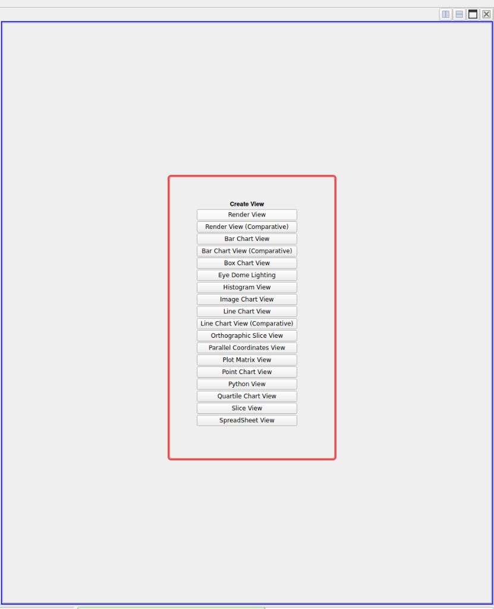
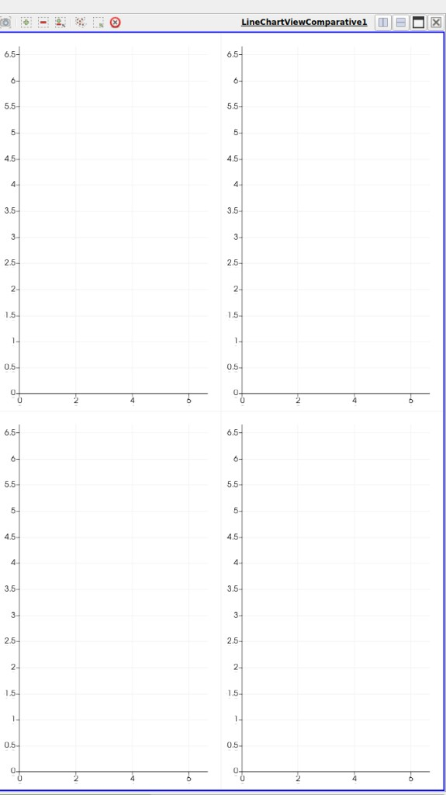
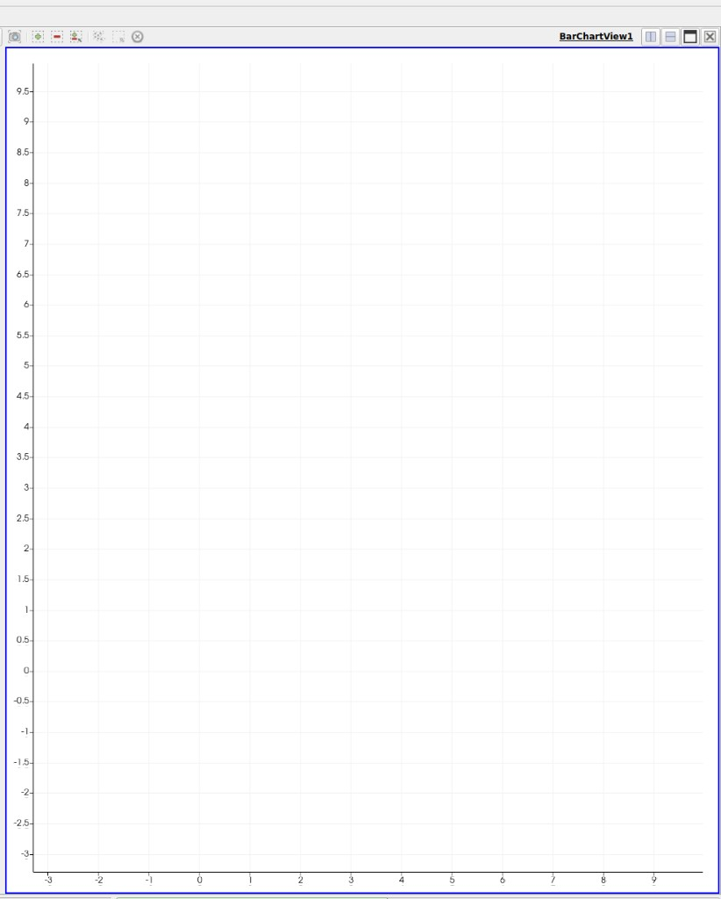
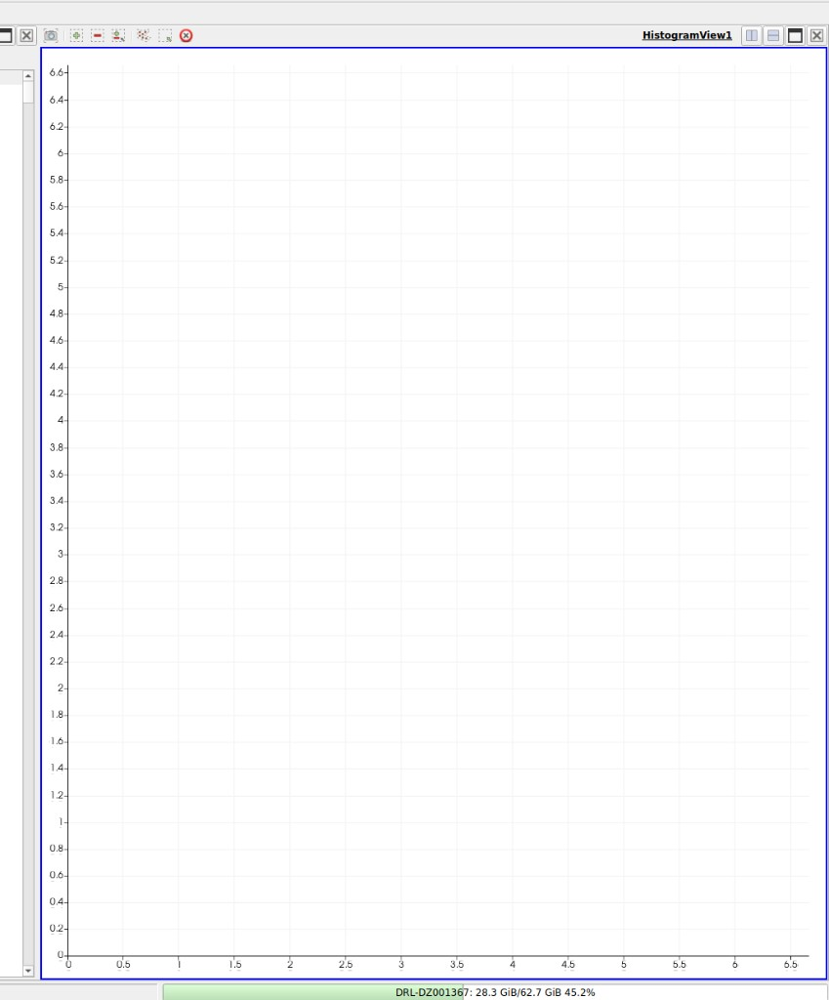
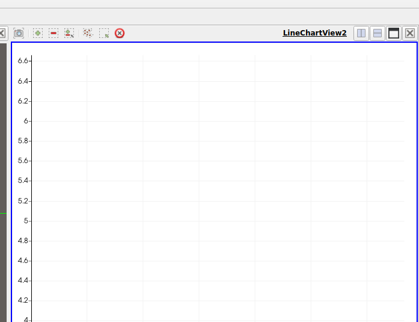
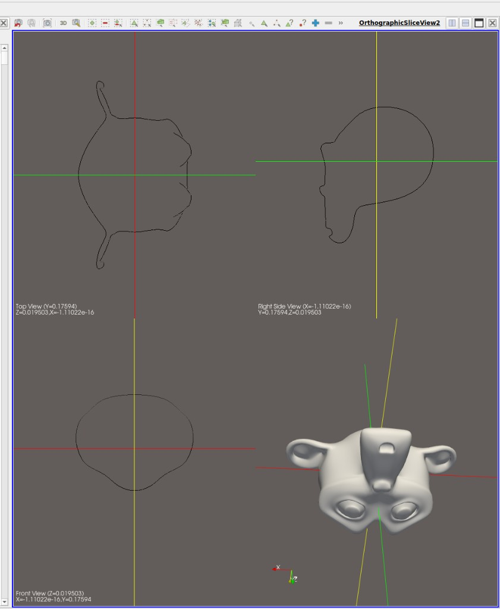
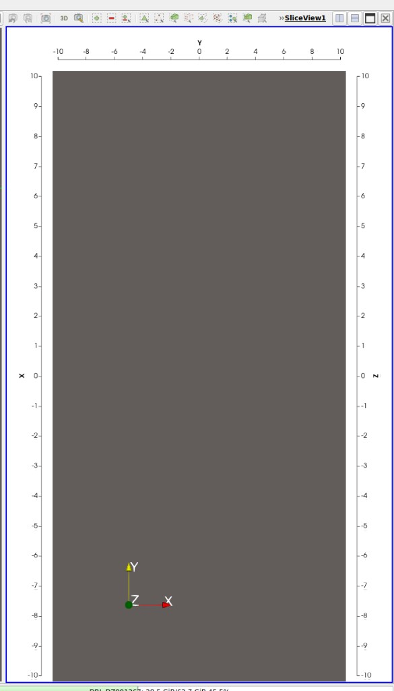
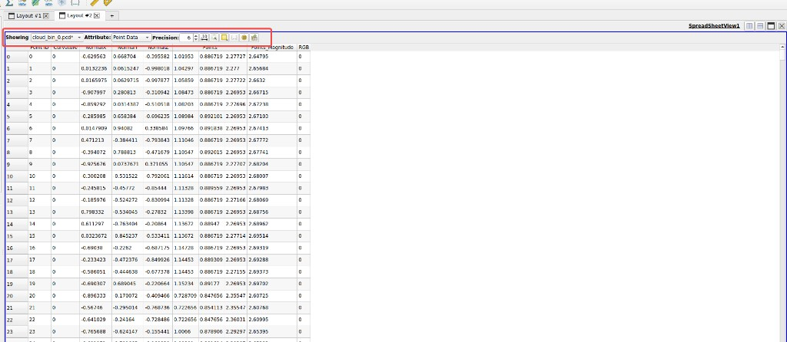

# ACloudViewer View Types — Illustrated Usage Guide

> This document provides detailed, illustrated usage instructions for all 18 view types
> available in ACloudViewer's **Create View** dialog, aligned with ParaView.

---

## Table of Contents

1. [Render View](#1-render-view)
2. [Render View (Comparative)](#2-render-view-comparative)
3. [Bar Chart View](#3-bar-chart-view)
4. [Bar Chart View (Comparative)](#4-bar-chart-view-comparative)
5. [Box Chart View](#5-box-chart-view)
6. [Eye Dome Lighting](#6-eye-dome-lighting)
7. [Histogram View](#7-histogram-view)
8. [Image Chart View](#8-image-chart-view)
9. [Line Chart View](#9-line-chart-view)
10. [Line Chart View (Comparative)](#10-line-chart-view-comparative)
11. [Orthographic Slice View](#11-orthographic-slice-view)
12. [Parallel Coordinates View](#12-parallel-coordinates-view)
13. [Plot Matrix View](#13-plot-matrix-view)
14. [Point Chart View](#14-point-chart-view)
15. [Python View](#15-python-view)
16. [Quartile Chart View](#16-quartile-chart-view)
17. [Slice View](#17-slice-view)
18. [SpreadSheet View](#18-spreadsheet-view)

---

## How to Create a View

1. In the main window, locate the **layout area** (center panel)
2. Click the **split** button (horizontal ⬜|⬜ or vertical ⬜/⬜) on any existing view's title bar to create a new empty cell
3. An empty cell shows the **Create View** dialog with all 18 view type buttons:



4. Click any button to create that view type in the cell
5. The view will automatically populate if you have an entity selected in the DB tree

---

## 1. Render View

**ParaView equivalent:** `RenderView`
**ACloudViewer class:** `vtkGLView`

### What it does
The primary 3D visualization view. Renders point clouds, meshes, polylines, and all other 3D entities with interactive camera controls.

### How to use
1. Load any 3D data file (`.ply`, `.pcd`, `.obj`, `.stl`, `.bin`, etc.)
2. The data appears automatically in the active Render View
3. Use mouse to navigate:

| Mouse Action | Effect |
|-------------|--------|
| **Left drag** | Rotate (trackball) |
| **Middle drag** | Pan |
| **Right drag / Scroll** | Zoom in/out |
| **Shift + Left** | Pan |
| **Ctrl + Left** | Roll |

### Features
- Background gradient (configurable)
- Orientation marker (axes indicator)
- Scale bar
- Camera orientation widget
- Properties panel for per-entity display settings (color, opacity, point size)
- Selection tools (point picking, rectangle select, polygon select)

### Toolbar icons
| Icon | Function |
|------|----------|
| 🎯 | Reset camera to fit all |
| 🔍 | Zoom to selection |
| 📸 | Screenshot |
| 🎨 | Background color |
| 📐 | Toggle orientation axes |

---

## 2. Render View (Comparative)

**ParaView equivalent:** `ComparativeRenderView`
**ACloudViewer class:** `vtkComparativeViewWidget::RENDER`

### What it does
Displays the same 3D scene in an N×M grid of sub-viewports within a single widget, allowing side-by-side comparison with different camera angles or parameters.

### How to use
1. Select an entity in the DB tree
2. Create a "Render View (Comparative)"
3. The default 2×2 grid shows 4 copies of the same scene

### Toolbar controls

| Control | Description |
|---------|-------------|
| **R** (spinner) | Number of rows (1–8) |
| **C** (spinner) | Number of columns (1–8) |
| **Cue** | Parameter to sweep: None / Camera Azimuth / Camera Elevation / Opacity |
| **Mode** | Distribution mode: X-Range / Y-Range / T-Range |
| **Min / Max** | Parameter value range for the sweep |
| **Apply** | Apply the parameter sweep across all sub-views |
| **Sp** (spinner) | Grid spacing in pixels (0–20) |
| **Overlay** | Toggle overlay mode (shows only first sub-view) |
| **Screenshot** | Export stitched composite image |

### Parameter sweep example
To compare 4 camera angles:
1. Set Grid to 2×2
2. Set Cue to "Camera Azimuth"
3. Set Min=0, Max=90
4. Set Mode to "T-Range"
5. Click Apply → Sub-views show 0°, 30°, 60°, 90° azimuth

### ParaView reference

*(Comparative layout pattern — single widget, N×M sub-viewports)*

---

## 3. Bar Chart View

**ParaView equivalent:** `XYBarChartView`
**ACloudViewer class:** `vtkChartView::BAR_CHART`

### What it does
Displays scalar field values as vertical bars, with point index on the X-axis and field value on the Y-axis.

### How to use
1. Load a point cloud with scalar fields
2. Select the entity in the DB tree
3. Create a "Bar Chart View"
4. In the **Fields** list (left side), check one or more scalar fields
5. Each field appears as a color-coded bar series

### Toolbar controls

| Control | Description |
|---------|-------------|
| **Title** | Text field to set chart title |
| **Legend** | Toggle legend display |
| **Grid** | Toggle grid lines |
| **Axis** | Selector (Left/Bottom/Right/Top) for per-axis settings |
| **Vis** | Toggle axis visibility |
| **Log** | Toggle logarithmic scale on selected axis |
| **Notation** | Mixed / Scientific / Fixed number format |
| **Prec** | Decimal precision (0–15) |
| **Custom** | Enable custom axis range |
| **Min / Max** | Custom range bounds |
| **Link 3D** | Toggle selection linkage with 3D view |
| **Reset** | Reset zoom to auto-fit |
| **PNG** | Export chart as PNG image |
| **CSV** | Export data as CSV |
| **Bins** | (Histogram only) Number of bins |

### ParaView reference


---

## 4. Bar Chart View (Comparative)

**ParaView equivalent:** `ComparativeXYBarChartView`
**ACloudViewer class:** `vtkComparativeViewWidget::BAR_CHART`

### What it does
Displays the same bar chart in an N×M grid for parameter comparison.

### How to use
Same as Render View (Comparative), but each sub-view is a Bar Chart instead of a 3D render. Useful for comparing the same data under different filtering conditions.

---

## 5. Box Chart View

**ParaView equivalent:** `BoxChartView`
**ACloudViewer class:** `vtkChartView::BOX_CHART`

### What it does
Displays statistical distributions as box-and-whisker plots. Shows min, Q1, median, Q3, max for each selected scalar field.

### How to use
1. Load a point cloud with multiple scalar fields
2. Select the entity
3. Create a "Box Chart View"
4. Select 2+ fields from the Fields list
5. Each field renders as a color-coded box-and-whisker column

### Reading the chart
```
    ┬   ← max
    │
    ┤   ← Q3 (75th percentile)
    │
    ┼   ← median
    │
    ┤   ← Q1 (25th percentile)
    │
    ┴   ← min
```

### Implementation
Uses VTK's `vtkChartBox` + `vtkPlotBox`. Automatically computes the five-number summary from sampled data (up to 10k points).

---

## 6. Eye Dome Lighting

**ParaView equivalent:** `RenderViewWithEDL`
**ACloudViewer class:** `vtkGLView::enableEDL()`

### What it does
A Render View with Eye Dome Lighting post-processing enabled. EDL enhances depth perception by applying edge darkening based on the depth buffer, making point clouds appear more three-dimensional.

### How to use
1. Load any point cloud or mesh
2. Create an "Eye Dome Lighting" view
3. The EDL effect is automatically applied
4. Interact with the scene as in a normal Render View

### How EDL works
```
Normal Render Pipeline:
  Scene → Rasterize → Depth Buffer → Color Buffer → Display

EDL Pipeline:
  Scene → Rasterize → Depth Buffer → EDL Pass (edge detection) → FXAA → Display
                                      ↑
                            Darkens edges based on
                            depth discontinuities
```

### Supported geometry
- **Point clouds** — primary use case, dramatically improves depth readability
- **Meshes** — full support (uses `vtkRenderStepsPass` for complete geometry pipeline)
- **Translucent objects** — supported via full render steps

### Render pass chain
```
FXAA Pass → EDL Shading Pass → RenderStepsPass (lights, opaque, translucent, volumetric, overlays)
```

---

## 7. Histogram View

**ParaView equivalent:** `XYHistogramChartView`
**ACloudViewer class:** `vtkChartView::HISTOGRAM`

### What it does
Displays frequency distributions of scalar field values as a histogram.

### How to use
1. Load a point cloud with scalar fields
2. Select the entity
3. Create a "Histogram View"
4. Select field(s) from the Fields list
5. Adjust the **Bins** spinner (5–500) to control histogram resolution

### Toolbar controls
Same as Bar Chart View, plus:

| Control | Description |
|---------|-------------|
| **Bins** | Number of histogram bins (5–500, default 50) |

### How binning works
The scalar field range [min, max] is divided into N equal-width bins. Each bin counts the number of points whose scalar value falls within that bin's range.

### ParaView reference


---

## 8. Image Chart View

**ParaView equivalent:** `ImageChartView`
**ACloudViewer class:** `vtkChartView::IMAGE_CHART`

### What it does
A line-based chart view designed for image data representation. Functionally similar to Line Chart View but optimized for image data display.

### How to use
Same workflow as Line Chart View. Select scalar fields to plot as line series.

---

## 9. Line Chart View

**ParaView equivalent:** `XYChartView`
**ACloudViewer class:** `vtkChartView::LINE_CHART`

### What it does
Plots scalar field values versus point index as connected line series.

### How to use
1. Load a point cloud with scalar fields (e.g., curvature, intensity, height)
2. Select the entity
3. Create a "Line Chart View"
4. Check one or more fields in the **Fields** list
5. Each field becomes a line series with automatic coloring

### Interaction
| Mouse Action | Effect |
|-------------|--------|
| **Left drag** | Pan chart |
| **Right drag** | Zoom |
| **Middle drag** | Zoom axis |
| **Scroll** | Zoom in/out |

### Performance note
Point clouds with >10,000 points are automatically subsampled to ~10k for chart performance. The full data is accessible via SpreadSheet View.

### ParaView reference


---

## 10. Line Chart View (Comparative)

**ParaView equivalent:** `ComparativeXYChartView`
**ACloudViewer class:** `vtkComparativeViewWidget::LINE_CHART`

### What it does
Displays the same line chart in an N×M grid for parameter comparison.

### How to use
Same as Render View (Comparative), but each sub-view is a Line Chart.

### ParaView reference


---

## 11. Orthographic Slice View

**ParaView equivalent:** `OrthographicSliceView`
**ACloudViewer class:** `vtkOrthoSliceViewWidget`

### What it does
A quad-viewport view showing Top, Right Side, Front orthographic projections plus a free 3D perspective view, all in a single widget.

### How to use
1. Load a mesh or point cloud
2. Create an "Orthographic Slice View"
3. The four viewports show:

```
┌──────────────────┬──────────────────┐
│  Top View        │  Right Side View │
│  (XZ plane)      │  (YZ plane)      │
│  camera: -Y      │  camera: -X      │
├──────────────────┼──────────────────┤
│  Front View      │  3D Perspective  │
│  (XY plane)      │  (free camera)   │
│  camera: -Z      │                  │
└──────────────────┴──────────────────┘
```

### Interactive slice positioning

| Action | Effect |
|--------|--------|
| **Scroll wheel** on any ortho view | Scrolls slice position along that view's normal axis |
| **Double-click** on any ortho view | Picks 3D position and updates slice to that location |
| **Drag** in 3D perspective view | Normal camera rotation |

### Features
- Crosshair axes in all 4 viewports showing current slice position
- Color-coded crosshairs: X=red, Y=yellow, Z=blue
- Text annotations: view name + slice position coordinates (e.g., "Top View (Y=0.17594)")
- Grid axes per orthographic pane with colored axis labels
- Shared render window for efficient rendering
- `slicePositionChanged` signal for external integration

### ParaView reference


---

## 12. Parallel Coordinates View

**ParaView equivalent:** `ParallelCoordinatesChartView`
**ACloudViewer class:** `vtkChartView::PARALLEL_COORDINATES`

### What it does
Multi-axis polyline visualization for high-dimensional data analysis. Each scalar field becomes a vertical axis; each data point draws a line connecting its values across all axes.

### How to use
1. Load a point cloud with 2+ scalar fields
2. Select the entity
3. Create a "Parallel Coordinates View"
4. Select 2 or more fields from the Fields list
5. Polylines connect each point's values across the selected axes

### Reading the chart
```
  Field A    Field B    Field C    Field D
     │          │          │          │
  10 ┤          ┤          ┤          ┤
     │╲         │    ╱─────│──╲       │
   8 ┤ ╲────────│───╱     │   ╲──────│─── point 1
     │          │          │          │
   6 ┤    ╱─────│──╲       │    ╱─────│─── point 2
     │   ╱      │   ╲──────│───╱      │
   4 ┤──╱       │          │          │
     │          │          │          │
   2 ┤          ┤          ┤          ┤
     │          │          │          │
   0 ┴──────────┴──────────┴──────────┴
```

### Use cases
- Detecting correlations between scalar fields
- Identifying clusters in multi-dimensional data
- Filtering outliers visually

---

## 13. Plot Matrix View

**ParaView equivalent:** `PlotMatrixView`
**ACloudViewer class:** `vtkChartView::PLOT_MATRIX`

### What it does
NxN scatter plot matrix showing pairwise relationships between all selected scalar fields. Diagonal cells show histograms of individual fields.

### How to use
1. Load a point cloud with 2+ scalar fields
2. Select the entity
3. Create a "Plot Matrix View"
4. Select 2+ fields from the Fields list
5. An NxN grid appears:

```
        Field A      Field B      Field C
       ┌────────────┬────────────┬────────────┐
Field A│ [Histogram]│  ·  ·  ·   │  ·    ·    │
       │            │   ·  ·     │    ·  ·    │
       ├────────────┼────────────┼────────────┤
Field B│ ·    ·     │ [Histogram]│  ·  ·      │
       │  ·  ·  ·   │            │ ·   ·  ·   │
       ├────────────┼────────────┼────────────┤
Field C│ ·   ·      │  ·  ·  ·   │ [Histogram]│
       │   ·  ·     │ ·   ·      │            │
       └────────────┴────────────┴────────────┘
```

### Use cases
- Finding correlations between multiple fields at once
- Quick overview of data distribution
- Identifying field pairs with strong/weak correlations

---

## 14. Point Chart View

**ParaView equivalent:** `XYPointChartView`
**ACloudViewer class:** `vtkChartView::POINT_CHART`

### What it does
Scatter plot of scalar field values vs point index. Same as Line Chart but renders as individual dots instead of connected lines.

### How to use
Same workflow as Line Chart View.

### Key differences from Line Chart
- Renders as scattered dots (not connected lines)
- Wider marker width (3.0px) for visibility
- Better for spotting discrete distributions and outliers
- More suitable when data points are sparse or unordered

---

## 15. Python View

**ParaView equivalent:** `PythonView`
**ACloudViewer class:** `ecvPythonView`

### What it does
A built-in Python script editor and executor. Write Python code in the editor, run it, and see output — all within the application.

### How to use
1. Create a "Python View"
2. The view shows two panels:
   - **Top panel**: Script editor (dark theme, monospace font)
   - **Bottom panel**: Output console (read-only)

3. Type your Python script in the editor
4. Press **Run** (or `Ctrl+Enter`) to execute
5. Output appears in the bottom panel

### Toolbar

| Button | Action | Shortcut |
|--------|--------|----------|
| **Run** | Execute the script | `Ctrl+Enter` |
| **Export+Run** | Export selected entity to CSV, set `DATA_FILE` env var, then run | — |
| **Clear** | Clear output panel | — |
| **Load** | Load a `.py` file into the editor | — |
| **Save** | Save editor contents to a `.py` file | — |

### Code editor features
- **Line numbers** on the left gutter (auto-sizing width based on line count)
- **Current line highlighting** (subtle dark background on the active line)
- **Syntax highlighting** (pure C++, no Pygments dependency):
  - Python keywords (blue, bold): `def`, `class`, `if`, `for`, `return`, etc.
  - Built-in functions (yellow): `print`, `len`, `range`, `dict`, etc.
  - Strings (orange): single/double/triple quotes with escape support
  - f-string prefixes: `f"..."`, `r"..."`, `b"..."`
  - Comments (green, italic): `# ...`
  - Numbers (green): integers, floats, hex, octal, binary
  - Decorators (yellow, italic): `@property`, `@staticmethod`
  - self/cls (blue, italic)
- **Auto-indent**: pressing Enter preserves current indentation; adds 4 spaces after `:` lines
- **Block indent/dedent**: Tab indents selected lines, Shift+Tab dedents
- **Tab = 4 spaces** (soft tabs)
- **Auto-completion** (Ctrl+Space or auto after 2+ chars): 150+ Python keywords, builtins, modules
- Dark theme (Consolas/Monaco monospace font)

### Entity data access (Export+Run)
The **Export+Run** button provides pipeline-like data access:
1. Exports the currently selected entity (point cloud/mesh) to a temporary CSV file
2. Sets the `DATA_FILE` environment variable to the CSV path
3. Runs your script with this env var available

The CSV contains columns: `X,Y,Z,<ScalarField1>,<ScalarField2>,...,Nx,Ny,Nz,R,G,B`

### Example: Analyze entity data with Export+Run
```python
import os, numpy as np
data = np.loadtxt(os.environ['DATA_FILE'], delimiter=',', skiprows=1)
print(f'Points: {len(data)}')
print(f'X: [{data[:,0].min():.4f}, {data[:,0].max():.4f}]')
print(f'Y: [{data[:,1].min():.4f}, {data[:,1].max():.4f}]')
print(f'Z: [{data[:,2].min():.4f}, {data[:,2].max():.4f}]')
for i in range(3, data.shape[1]):
    print(f'Col {i}: [{data[:,i].min():.4f}, {data[:,i].max():.4f}]')
```

### Example: Generate a matplotlib plot
```python
import matplotlib
matplotlib.use('Agg')
import matplotlib.pyplot as plt
import numpy as np

x = np.linspace(0, 2*np.pi, 100)
plt.figure(figsize=(8, 5))
plt.plot(x, np.sin(x), 'b-', label='sin(x)')
plt.plot(x, np.cos(x), 'r--', label='cos(x)')
plt.title('Trigonometric Functions')
plt.xlabel('x')
plt.ylabel('y')
plt.legend()
plt.grid(True)
plt.savefig('/tmp/trig_plot.png', dpi=150)
print('Plot saved to /tmp/trig_plot.png')
```

### Example: Process a point cloud file
```python
import numpy as np

data = np.loadtxt('/path/to/exported_cloud.csv', delimiter=',', skiprows=1)
print(f'Points: {len(data)}')
print(f'X range: [{data[:,0].min():.3f}, {data[:,0].max():.3f}]')
print(f'Y range: [{data[:,1].min():.3f}, {data[:,1].max():.3f}]')
print(f'Z range: [{data[:,2].min():.3f}, {data[:,2].max():.3f}]')
```

### Limitations
- Scripts run as a subprocess (`python3 -c`) with a 30-second timeout
- Entity access is via CSV export (not direct in-memory access like ParaView's `vtkPythonInterpreter`)
- `DATA_FILE` env var persists between `Run` calls after first `Export+Run`
- No inline plot rendering (save to file and open externally)

---

## 16. Quartile Chart View

**ParaView equivalent:** `QuartileChartView`
**ACloudViewer class:** `vtkChartView::QUARTILE_CHART`

### What it does
Area chart showing filled regions for scalar field values. Useful for visualizing distributions and confidence bands.

### How to use
Same workflow as Line Chart View. Each selected field renders as a filled area plot instead of a line.

### Implementation
Uses `vtkChart::AREA` plot type for filled rendering.

---

## 17. Slice View

**ParaView equivalent:** `MultiSlice`
**ACloudViewer class:** `vtkSliceViewWidget`

### What it does
Interactive multi-slice visualization with three-axis slice plane control. Shows a 3D view with draggable axis rulers on three edges for adding and positioning slice planes.

### How to use
1. Load a mesh or point cloud
2. Create a "Slice View"
3. The view shows:
   - **Center**: 3D viewport with the scene
   - **Top edge**: Y-axis ruler (green)
   - **Left edge**: X-axis ruler (red)
   - **Right edge**: Z-axis ruler (blue)

### Layout
```
    ┌───────── Y axis (green) ──────────┐
    │                                    │
  X │                                    │ Z
  a │         3D Viewport               │ a
  x │                                    │ x
  i │    (slice planes visible)         │ i
  s │                                    │ s
    │                                    │
(r) │                                    │(b)
    └────────────────────────────────────┘
```

### Slice interaction

| Action | Where | Effect |
|--------|-------|--------|
| **Double-click** | On any axis ruler | Add a new slice at that position |
| **Drag** | A slice marker (triangle) | Move the slice interactively |
| **Right-click** | A slice marker | Context menu → "Remove Slice" |

### Slice colors
- **X-axis slices**: Red
- **Y-axis slices**: Green
- **Z-axis slices**: Blue

### How slicing works
Each slice is implemented as a `vtkCutter` with a `vtkPlane`:
- The plane's normal is aligned to the axis (e.g., X-slice has normal [1,0,0])
- The plane's origin is set to the slice position
- The cut geometry is rendered as colored line actors in the 3D viewport

### ParaView reference


---

## 18. SpreadSheet View

**ParaView equivalent:** `SpreadSheetView`
**ACloudViewer class:** `ecvSpreadSheetView`

### What it does
Tabular display of entity attributes with full ParaView-style decorator toolbar. Shows point coordinates, scalar fields, normals, colors, and metadata in a spreadsheet format.

### How to use
1. Load any point cloud or mesh
2. Select the entity in the DB tree
3. Create a "SpreadSheet View"
4. The table automatically populates with the selected entity's data

### Decorator toolbar

| Control | Description |
|---------|-------------|
| **Showing** | Displays entity name of the current data source |
| **Attribute** | Dropdown: Point Data / Cell Data / Field Data |
| **Precision** | Spinner (1–32): decimal digit control |
| **Fixed** | Toggle: scientific (`g`) vs fixed-point (`f`) representation |
| **Columns** | Menu: show/hide individual columns |
| **Selected** | Toggle: show only selected points |
| **Conn** | Toggle: generate cell connectivity (V1/V2/V3 coordinates) |
| **Cell Font** | Spinner (6–24pt): table cell font size |
| **Header Font** | Spinner (6–24pt): header font size |
| **🔍** | Filter text box for row search |
| **Export** | Export data to CSV file |

### Data modes

#### Point Data
| Column | Description |
|--------|-------------|
| Point ID | Sequential point index |
| Points_X / Y / Z | 3D coordinates |
| Normals_X / Y / Z | Normal vectors (if available) |
| *ScalarFieldName* | Value from each scalar field |
| RGB | Color value (if available) |

#### Cell Data (meshes only)
| Column | Description |
|--------|-------------|
| Cell ID | Triangle index |
| V1 / V2 / V3 | Vertex indices |
| Material | Material index (if available) |
| V1_X/Y/Z, V2_X/Y/Z, V3_X/Y/Z | Vertex coordinates (when Conn is enabled) |

#### Field Data (metadata)
| Property | Value |
|----------|-------|
| Name | Entity name |
| Type | "Mesh", "Point Cloud", etc. |
| Number of Points | Total point count |
| Bounds X/Y/Z | [min, max] range per axis |
| Has Colors | Yes/No |
| Has Normals | Yes/No |
| Scalar Fields | Count + per-field [min, max] |
| Number of Triangles | (meshes) |
| Has Materials | (meshes) |

### Bidirectional selection
- **3D → SpreadSheet**: Select points in the 3D view → rows automatically highlight and scroll
- **SpreadSheet → 3D**: Select rows in the table → points highlight in the 3D view
- Toggle "Selected" to filter the table to show only selected points

### Keyboard shortcuts
| Key | Action |
|-----|--------|
| **Ctrl+C** | Copy selected rows (or all rows if none selected) to clipboard |

### ParaView reference


---

## Quick Reference: View Type Selection Guide

| Your Goal | Recommended View |
|-----------|-----------------|
| Visualize 3D geometry | **Render View** |
| Enhanced depth for point clouds | **Eye Dome Lighting** |
| Compare camera angles | **Render View (Comparative)** |
| View orthographic projections | **Orthographic Slice View** |
| Cut through geometry | **Slice View** |
| Inspect data values | **SpreadSheet View** |
| Plot scalar distributions | **Histogram View** |
| Plot scalar values vs index | **Line Chart View** |
| Bar chart of scalar values | **Bar Chart View** |
| Scatter plot | **Point Chart View** |
| Statistical summary (box plots) | **Box Chart View** |
| Multi-field correlation | **Parallel Coordinates View** |
| Pairwise scatter matrix | **Plot Matrix View** |
| Area/band visualization | **Quartile Chart View** |
| Compare charts side-by-side | **Line/Bar Chart View (Comparative)** |
| Run Python scripts | **Python View** |
| Image data plotting | **Image Chart View** |
