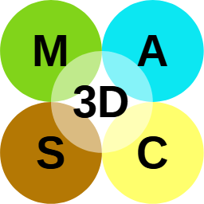

# 3DMASC (plugin) — 3D Multi-scale Automatic Supervised Classification

## Introduction

**3DMASC** performs **automatic supervised classification** of 3D point clouds using **multi-attribute, multi-scale** features. It can combine **several scalar attributes**, **multiple scales**, and optionally **multiple input clouds** (e.g. bi-temporal or multi-spectral). Training uses a **random forest** on features defined in a parameter file; output includes per-point classes and confidence.

Official page: [3DMASC — Université de Rennes](https://lidar.univ-rennes.fr/en/3dmasc).

## Usage/Algorithm

1. Prepare a **parameter file** (`.txt`) describing features and training options (syntax on the official site).
2. Load one or more clouds with `-O`.
3. Run `-3DMASC_CLASSIFY` with optional mode flags, then the parameter file, then an optional **cloud role** string mapping logical roles (`PC1`, `PC2`, …) to loaded cloud indices (**1-based**).

## Parameters

| Flag | Role |
|------|------|
| `-KEEP_ATTRIBUTES` | Preserve computed feature attributes on the output cloud(s) |
| `-ONLY_FEATURES` | Compute features only (no training/classification) |
| `-SKIP_FEATURES` | Skip feature computation (use precomputed features; see source help) |

After the flags: **`params.txt`**, then optional **`"PC1=1 PC2=2"`** style role assignment.

## Screenshots



## ACloudViewer CLI

```bash
ACloudViewer -SILENT -O core.las -O ref.las -3DMASC_CLASSIFY -KEEP_ATTRIBUTES params.txt "PC1=1 PC2=2"
```

**Features only example:**

```bash
ACloudViewer -SILENT -O survey.las -3DMASC_CLASSIFY -ONLY_FEATURES my_params.txt "PC1=1" -SAVE_CLOUDS
```

Argument order: optional flags (`-KEEP_ATTRIBUTES`, `-ONLY_FEATURES`, `-SKIP_FEATURES`), then the **parameter file**, then the **cloud roles** string.

## Build

```bash
-DPLUGIN_STANDARD_3DMASC=ON
```

## Dependencies

**OpenCV** (and dependencies of the feature pipeline).

## References

- [3DMASC — Université de Rennes](https://lidar.univ-rennes.fr/en/3dmasc)
- CloudCompare wiki: [3DMASC (plugin)](https://www.cloudcompare.org/doc/wiki/index.php/3DMASC_(plugin))
