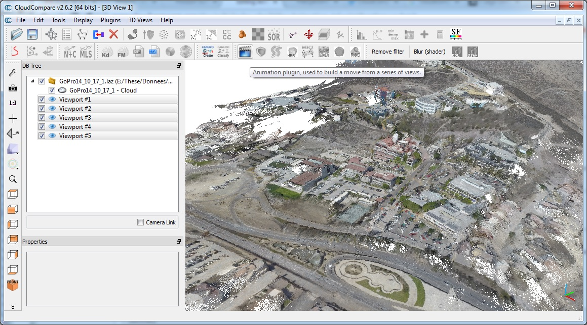
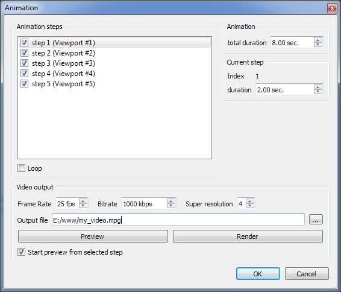

# Animation (plugin)

## Introduction

The qAnimation plugin can render animation as movie files (mpg, etc.). It relies on the [FFMPEG library](https://www.ffmpeg.org/).

This plugin has been initiated by [2G Robotics](http://www.2grobotics.com/).

## Usage

### Creating viewport objects

Before starting the plugin, you must create [viewport objects](https://www.cloudcompare.org/doc/wiki/index.php/Entities#Viewport) along the path of the animation to render. The position and orientation of the camera will then be interpolated between each viewport.

To create the viewports, simply position the camera of the active 3D view in the right position and orientation and then use the 'Display > Save viewport as object' menu entry (or the **CTRL+V** shortcut).

Notes:

- For now the viewports must be created in the **chronological order**.
- Viewport objects store almost all the display parameters (even the point size, etc.). When interpolating the frames between each viewport object, CloudCompare will actually interpolate all those parameters.
- For more convenience, it is better to **regularly sample** the viewpoints (as the default duration of the output video between each viewpoint is the same — this can be changed for each step afterwards but this can be quite cumbersome if you have a lot of viewpoints).



Once all the viewports have been created, highlight them (hold the CTRL key while selecting them in the DB tree) and launch the plugin with the icon.

### Animation parameters

Once launched, the animation settings dialog will appear:



In the upper part are listed all the animation 'steps' (i.e. the selected viewports).

You can click on a single step so as to setup its parameters (in the 'Current step' frame on the right). For now, only the **step duration** can be changed.

You'll also notice that when you select a step, the corresponding viewport is automatically applied.

Steps can be activated or deactivated with the checkbox on the left of their entry in the list.

You can also change the **total duration** of the video with the 'total duration' field in the 'Animation' frame on the right. Warning: all steps duration will be modified proportionally to their current duration.

### Output video parameters

First you can set whether the video will **'loop'** or not (with the corresponding 'Loop' checkbox). This means that the last step will be considered as a real step (and connected to the first frame).

In the lower part of the dialog, you'll find the video rendering options:

- The **frame rate** (in frame per second (fps) — 24 or 25 fps should be the minimum)
- The **bitrate** (the higher, the better the video quality will be but the bigger the file — see [Youtube recommendations](https://support.google.com/youtube/answer/1722171?hl=en) for instance)
- The **'super resolution'** parameter will be used to render the frames at a much bigger scale (n times bigger) and then the frames will be rescaled to the original video resolution. This gives a much smoother look and removes visual artifacts, etc.
- The **output filename**

Note that the video output format is automatically guessed from the extension (mpg, mp4, avi, etc.). The available output formats depend on the codecs installed on your machine.

### Previewing

You can preview the animation at any time by clicking on the **'Preview'** button.

The 'Start preview from selected step' checkbox will let you specify if the preview should always start from the selected step or from the first enabled one.

Note that in preview mode the LOD mechanism will still be activated (if any) but it won't be during the real animation rendering.

### Rendering

Before rendering you can preview the video in realtime with the 'Preview' button (but without the compression effect).

Once ready simply hit the **'Render'** button to create the video file.

### Saving the parameters

The parameters of each step are saved as 'meta-data' of the associated viewport object. This way you can close the dialog and restart it without losing them.

It is possible to save the viewport objects together in a BIN file in order to save the animation for later editing or simply to re-use the same camera positions for another object.

## Tutorial

A quick tutorial video has been uploaded by Eugene Liscsio: [https://www.youtube.com/watch?v=M3i16D0_Yac](https://www.youtube.com/watch?v=M3i16D0_Yac) (note: this was the beta version of the plugin).

## ACloudViewer CLI

```bash
ACloudViewer -SILENT -O scene.bin -ANIMATION [OPTIONS]
```

| Token | Type | Description |
|-------|------|-------------|
| `-ANIMATION` | command | Run animation rendering |
| `-FPS` | int | Frames per second |
| `-TOTAL_FRAMES` | int | Total number of frames |
| `-SUPER_RESOLUTION` | int | Super-resolution factor (e.g. 2 = 2× rendering) |
| `-OUTPUT` | path | Output video file path |

Note: Full animation rendering (FFMPEG encoding) requires the GUI. The CLI provides viewport export and frame control.

## Build

```cmake
-DPLUGIN_STANDARD_QANIMATION=ON
```

Optional: `-DQANIMATION_WITH_FFMPEG_SUPPORT=ON` to enable movie file export via FFMPEG.

## References

- CloudCompare wiki: [Animation (plugin)](https://www.cloudcompare.org/doc/wiki/index.php/Animation_(plugin))
