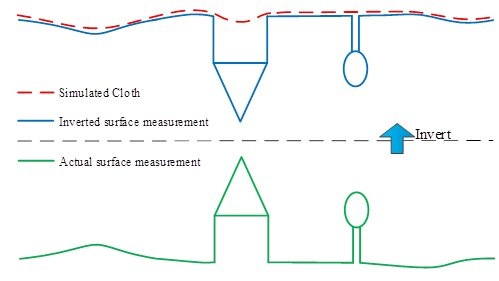
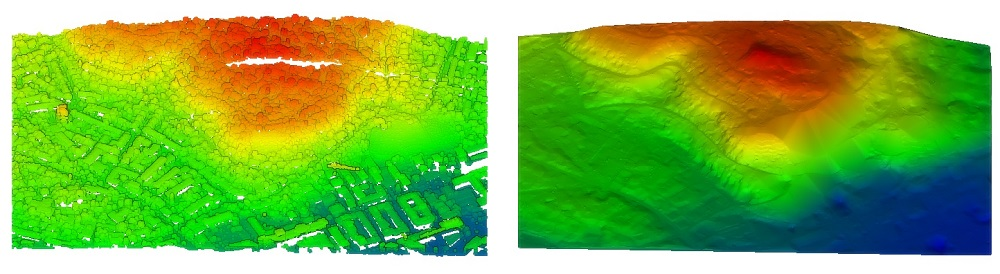

# CSF (plugin)

Airborne LiDAR Data Filtering Algorithm Based on Cloth Simulation

**Authors:** Wuming Zhang, Jianbo Qi, Peng Wan, Hongtao Wang (School of Geography, Beijing Normal University, China)

Cloth Simulation Filter (CSF) is a tool to extract ground points in discrete return LiDAR point clouds.

If you use this tool for a scientific publication, please cite the following paper:

> Zhang W, Qi J, Wan P, Wang H, Xie D, Wang X, Yan G. *An Easy-to-Use Airborne LiDAR Data Filtering Method Based on Cloth Simulation.* Remote Sensing. 2016; 8(6):501.

You can download the paper from [ResearchGate](https://www.researchgate.net/profile/Wuming_Zhang2). You can also visit the [homepage](http://ramm.bnu.edu.cn/researchers/wumingzhang/english/default_contributions.htm). A mex version for Matlab is available at [MathWorks File Exchange](http://www.mathworks.com/matlabcentral/fileexchange/58139-csf--ground-filtering-of-point-cloud-based-on-cloth-simulation).

## Introduction

Separating point clouds into ground and non-ground measurements is an essential step to generate digital terrain models (DTMs) from airborne LiDAR (light detection and ranging) data. Many filtering algorithms have been developed. However, even state-of-the-art filtering algorithms need to set up a number of complicated parameters carefully to achieve high accuracy.

For the purpose of reducing the parameters users need to set, and promoting the filtering algorithms, we present a new filtering method which only needs a few easy-to-set integer and Boolean parameters. This method is based on cloth simulation which is a 3D computer graphics algorithm and is used for simulating cloth within a computer program. In this proposed approach, a LiDAR point cloud is inverted, and then a rigid cloth is used to cover the inverted surface. By analyzing the interactions between the cloth nodes and the corresponding LiDAR points, the locations of the cloth nodes can be determined to generate an approximation of the ground surface. Finally, the ground points can be extracted from the LiDAR point cloud by comparing the original LiDAR points and the generated surface. This filtering algorithm could be called cloth simulation filtering, CSF.

## Algorithm Details

Our method is based on the simulation of a simple physical process. Imagine a piece of cloth is placed above a terrain, and then this cloth drops because of gravity. Assuming that the cloth is soft enough to stick to the surface, the final shape of the cloth is the DSM (digital surface model). However, if the terrain is firstly turned upside down and the cloth is defined with rigidness, then the final shape of the cloth is the DTM. To simulate this physical process, we employ a technique that is called cloth simulation (Weil, 1986). Based on this technique, we developed our cloth simulation filtering (CSF) algorithm to extract ground points from LiDAR points. The overview of the proposed algorithm is illustrated in Fig. 1. First, the original point cloud is turned upside down, and then a cloth drops to the inverted surface from above. By analyzing the interactions between the nodes of the cloth and the corresponding LiDAR points, the final shape of the cloth can be determined and used as a base to classify the original points into ground and non-ground parts.

For more information, refer to the original plugin documentation: [qCSF_instructions.pdf](qCSF_instructions.pdf)



## Set up of parameters

The parameters which need to be set by user can be divided into General parameter and Advanced parameter. The general parameter means that it must be set each time the program runs. The advance parameter means that it can be set according to the users need.

### General parameters

#### Scenes

Three options are under this parameter: **Steep slope**, **Relief**, and **Flat**. This parameter helps users to set the scenes type of the point clouds. When you set up this parameter, the rigidness will be determined actually.

#### Slope post processing for disconnected terrain

For steep slopes, this algorithm may yield relatively large errors because the simulated cloth is above the steep slopes and does not fit with the ground measurements very well due to the internal constraints among particles. This problem can be solved by selecting this option. If there are no steep slopes in your scenes, just neglect it.

### Advanced parameters

#### Cloth resolution

Cloth resolution refers to the grid size (the unit is same as the unit of point clouds) of cloth which is used to cover the terrain. The bigger cloth resolution you have set, the coarser DTM you will get.

#### Max iterations

Max iterations refers to the maximum iteration times of terrain simulation. 500 is enough for most scenes.

#### Classification threshold

Classification threshold refers to a threshold (the unit is same as the unit of point clouds) to classify the point clouds into ground and non-ground parts based on the distances between points and the simulated terrain. 0.5 is adapted to most scenes.



## ACloudViewer CLI

```bash
ACloudViewer -SILENT -O cloud.las -CSF [OPTIONS] -SAVE_CLOUDS
```

| Token | Type | Default | Description |
|-------|------|---------|-------------|
| `-CSF` | command | — | Run Cloth Simulation Filter |
| `-SCENES` | enum | `RELIEF` | `SLOPE`, `RELIEF`, or `FLAT` |
| `-PROC_SLOPE` | flag | off | Enable slope post-processing for disconnected terrain |
| `-CLOTH_RESOLUTION` | float | 2 | Cloth grid resolution (same unit as point cloud) |
| `-MAX_ITERATION` | int | 500 | Maximum simulation iterations |
| `-CLASS_THRESHOLD` | float | 0.5 | Distance threshold for ground vs non-ground classification |
| `-EXPORT_GROUND` | flag | off | Export classified ground points |
| `-EXPORT_OFFGROUND` | flag | off | Export off-ground (non-ground) points |

### Example

```bash
ACloudViewer -SILENT -O terrain.las \
  -CSF -SCENES RELIEF -CLOTH_RESOLUTION 1.5 -MAX_ITERATION 600 -CLASS_THRESHOLD 0.5 \
  -PROC_SLOPE -EXPORT_GROUND -EXPORT_OFFGROUND \
  -SAVE_CLOUDS
```

## Build

```cmake
-DPLUGIN_STANDARD_QCSF=ON
```

The CSF implementation is bundled with the plugin; no separate external library is required.

## References

- Zhang W, Qi J, Wan P, Wang H, Xie D, Wang X, Yan G. *An Easy-to-Use Airborne LiDAR Data Filtering Method Based on Cloth Simulation.* Remote Sensing. 2016; 8(6):501.
- CloudCompare wiki: [CSF (plugin)](https://www.cloudcompare.org/doc/wiki/index.php/CSF_(plugin))
