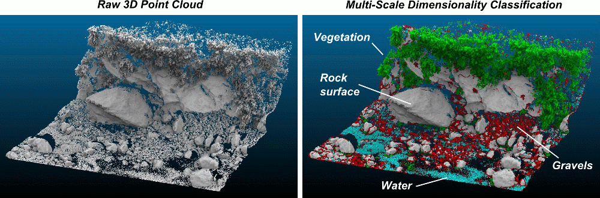
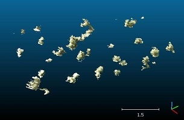
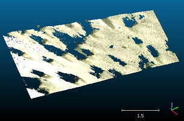
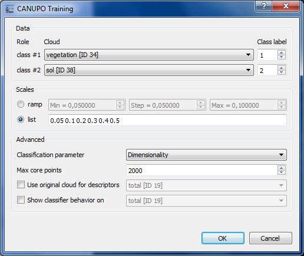
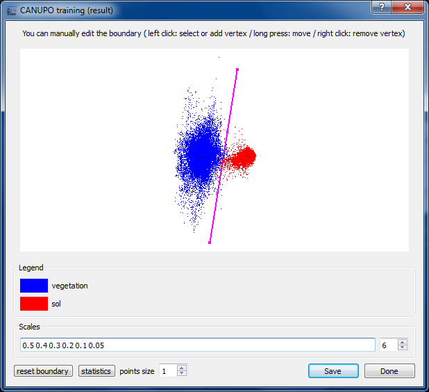
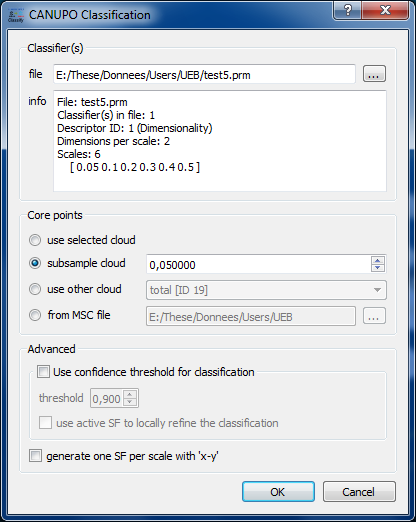
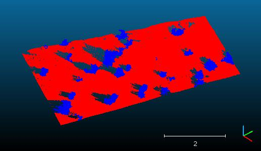
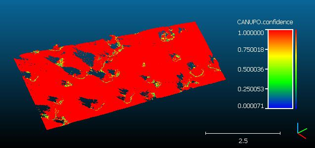

# CANUPO (plugin)

## Introduction

The CANUPO suite is a simple yet efficient way to automatically classify a point cloud. It lets you create your own classifiers (by training them on small samples) and/or apply one classifier at a time on a point cloud so as to separate it into two subsets. It also outputs a classification confidence value for each point so that you can quickly identify the problematic cases (generally on the classes borders).

While the plugin is simple to use, it can be a good idea to read some more information about CANUPO first — see the original [article](http://nicolas.brodu.net/common/recherche/publications/canupo.pdf) by N. Brodu and D. Lague (Geosciences Rennes).



## Getting a working classifier

### Use an existing ".prm" file

Classifiers are stored in standalone ".prm" files. They can be applied to any point cloud providing its units are concordant with the classifier. If a classifier has been trained with scales regularly sampled between 0.05 and 0.3 (implicitly in meters for instance) then your cloud coordinates must be expressed in the same units (i.e. in meters here).

So anyone can share a classifier with others. You can first look at:

- the authors' webpage for an existing classifier that may suit your needs ([Geosciences Rennes](https://geosciences.univ-rennes1.fr/interlocuteurs/dimitri-lague))
- or on the dedicated [thread](http://www.cloudcompare.org/forum/viewtopic.php?f=17&t=808&start=90#p11588) on CloudCompare forum

### Train your own classifier

#### Prepare the data

Getting a working classifier is really easy (getting an accurate one might be a little longer, but not much).

All you have to do is to manually segment some groups of points representing each class (with the scissors tool of CloudCompare). For each class you should take several typical subsets of points and regroup them in a single cloud (with the Edit > Merge method of CloudCompare).

Try to get an exhaustive sampling of the various cases that can be encountered for each class. Make sure also that all subsets have roughly the same number of points (or at least that the relative quantities are representative of their occurrence in your data).

Tip: make sure that both have unique and clear names so as to differentiate them during the rest of the procedure (type F2 to rename the selected cloud).

| Class 1: vegetation | Class 2: ground |
|:---:|:---:|
|  |  |

#### Train a classifier

Once you have the two clouds representing each class, you can call the 'Train classifier' method of the plugin (Plugins > qCANUPO > Train classifier).



Select the right clouds in the class #1 and class #2 combo-boxes. Then enter the range of scales you wish to use for the multi-scale descriptors (see the original canupo tutorial and article for more information on how to choose the right values). You can either input a regular 'ramp' (the scale values will be regularly sampled inside an interval) or a custom list of scales (separated by a space character, e.g. "0.05 0.1 0.2 0.5 1.0").

Note: the more scales you set, the more discriminative the result might be, but also the longer the computations (especially if the largest scale is wide relatively to the cloud density).

Optionally you can set more advanced parameters in the lower part of the dialog:

- the type of descriptors that will be computed (only "Dimensionality" — as proposed by Brodu and Lague in the original CANUPO paper — is available for now)
- the maximum number of core points that will be randomly extracted from the input cloud (10 or 20 thousands should be more than enough in most of the cases)
- you can specify to use the original cloud (not the segmented ones) to compute the descriptors (it's a little longer — depending on its size — but it can give better results on the borders)
- eventually you can specify another cloud that will be used to display the classifier behavior (see below)

Once ready, you can click on the "OK" button to start the training. The plugin will start to compute the descriptors on each cloud and will then try to find the best classification boundary (in a custom 2D space).



The classifier behavior is represented by projecting all the descriptors in the classification space with the classification boundary in-between (as a magenta line). If a custom cloud has been set for displaying the classifier behavior, all its descriptors will be represented in grey. Otherwise, the descriptors corresponding to the first class will be displayed in blue, and the others in red.

From this point, several actions may be realized by the user:

- you can decrease the number of scales used to train the classifier (by default, the biggest scales are removed first). This lets you tune the classifier so as to use the fewest scales as possible (with the lowest scales radii, so as to minimize the computation time for descriptors) while keeping a sufficiently discriminating behavior.
- you can also edit the boundary position. The vertices of the boundary line can be moved (right click + keep the button pressed); new vertices can be added (by clicking anywhere — in which case the vertex will be added to the nearest line's end — or by clicking exactly on the line — in which case a new vertex will be created on the line near the mouse cursor); and vertices can be removed (left click — only taken into account if the line has more than 2 vertices). At any time the boundary can be reset to its original state by clicking on the 'reset boundary' button.

Once ready, you can save the classifier in a .prm file. This file will be used as input for the 'Classify' method (see below).

Don't hesitate to share your own classifiers (either with Dimitri Lague himself — he might put up a dedicated webpage to store the best classifiers — or on the dedicated [thread](http://www.cloudcompare.org/forum/viewtopic.php?t=808) on CloudCompare's forum).

## Apply a classifier on a cloud

Once you have a valid classifier file (see above) you can apply it on any cloud (providing its units are concordant with the classifier — see above).

Select the cloud you wish to classify and call the 'Classify' method of the plugin (Plugins > qCANUPO > Classify).



First load the classifier file (with the '...' button next to the file field). Then select the 'core points' on which the computation should be done: it's not always useful to use all points of a cloud for such a process (moreover it can be quite long). Therefore, especially for a first attempt, you can use less points either by sub-sampling the original cloud or by providing your own core points (a rasterized version of the input cloud for instance). You can even directly open a ".msc" file generated by the original CANUPO suite developed by Nicolas Brodu.

Eventually and whatever the choice you've made for core points, all the points will be classified. The classification result for a given core point is propagated to its nearest neighbors. Therefore using core points instead of the whole cloud might just be a little less accurate on the borders (and once you are happy with the results, you can launch the same classification process on every point in the cloud… and go take a coffee ;).

Note that the plugin always generates on the input cloud an additional scalar field with the classification 'confidence'.





## Command line

The plugin can be called via the command line:

Main option:

- `-CANUPO_CLASSIFY {classifier.prm}`

Additional options:

- `-USE_CONFIDENCE {threshold}` — threshold must be between 0 and 1
- Use the `SET_ACTIVE_SF` after loading a cloud to set the active scalar field if you want it to be used to refine the classification

Syntax:

```bash
ACloudViewer -O cloud1.las ... -O cloudN.las -CANUPO_CLASSIFY (-USE_CONFIDENCE 0.9) classifier.prm
```

## Acknowledgments

The plugin creation has been financed by [Université Européenne de Bretagne](http://www.ueb.eu/) and [CNRS](http://www.cnrs.fr/).

## Build

```cmake
-DPLUGIN_STANDARD_QCANUPO=ON
```

## References

- N. Brodu, D. Lague, "3D Terrestrial LiDAR data classification of complex natural scenes using a multi-scale dimensionality criterion," *ISPRS J. Photogramm.*, 2012. [PDF](http://nicolas.brodu.net/common/recherche/publications/canupo.pdf)
- CloudCompare wiki: [CANUPO (plugin)](https://www.cloudcompare.org/doc/wiki/index.php/CANUPO_(plugin))
