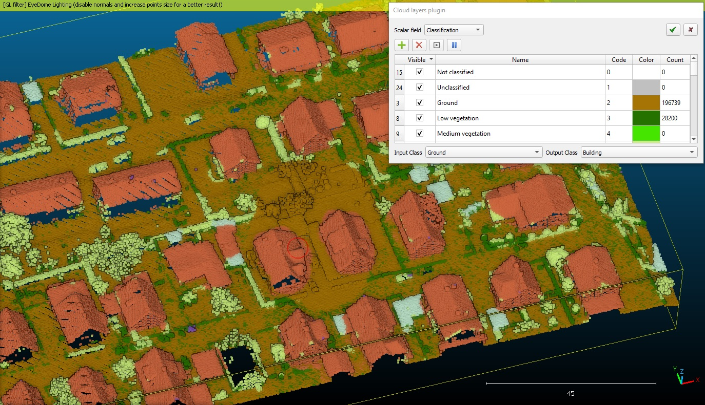

# QCloudLayers (plugin)

Cloud Layers is a plugin for CloudCompare to perform manual classification.



## Introduction

QCloudLayers provides an interactive manual classification/labelling workflow for point clouds. Users assign scalar field values as class labels (e.g. ground, vegetation, building) and the plugin uses per-point alpha transparency to show/hide classified vs unclassified points, making it easy to visually verify and refine the classification.

## Copyright

- [WigginsTech](https://www.wigginstech.com/)

## Initial developer

- [Neurodat](https://neurodat.com/contact-us/)

## ACloudViewer CLI

```bash
ACloudViewer -SILENT -O cloud.las -CLOUD_LAYERS [OPTIONS] -SAVE_CLOUDS
```

| Token | Type | Description |
|-------|------|-------------|
| `-CLOUD_LAYERS` | command | Run Cloud Layers classification |
| `-SF_INDEX` | int | Scalar field index to use for classification |
| `-APPLY` | flag | Apply the classification immediately |
| `-CONFIG` | path | Path to a classification configuration file |

## Build

```cmake
-DPLUGIN_STANDARD_QCLOUDLAYERS=ON
```

## References

- CloudCompare wiki: [QCloudLayers (plugin)](https://www.cloudcompare.org/doc/wiki/index.php/QCloudLayers_(plugin))
