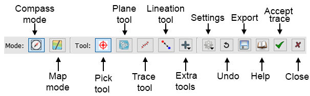
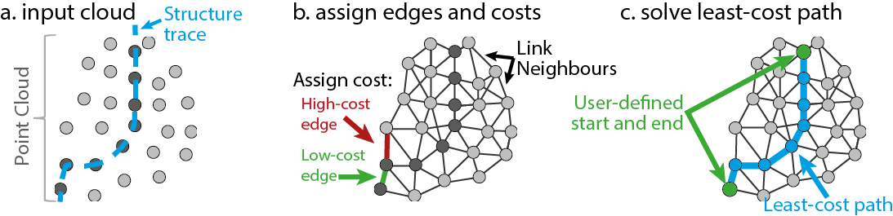
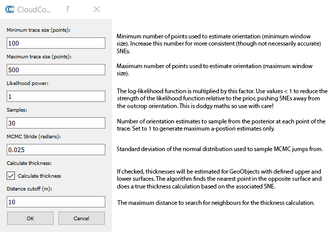

# Compass (plugin) — Structural geology interpretation

## Introduction

Compass is a structural geology toolbox for the interpretation and analysis of virtual outcrop models. It combines a flexible data structure for organising geological interpretation with a series of tools for intuitive and computer-assisted digitisation and measurement. Broadly, the tool comprises two modes: **Map Mode**, for delineating geological units, and **Compass Mode** for measuring orientations and thicknesses. The combination of these two modes roughly correspond to the functionality of a good field geologist (armed with a trusty compass and notebook), but require less beer and sunscreen. They are described in detail below.



## Usage

### Compass mode: Extracting structural measurements

The compass mode, activated by clicking the  icon in the main dialog, contains three tools for measuring orientations: the **Plane Tool**, **Trace Tool** and **Lineation Tool**. A self-explanatory **Picking Tool** is also included for convenience.

#### Plane tool: Measure surface orientations

The plane tool is used to measure the orientations of fully exposed planar structures, such as joint or bedding surfaces. When it is activated, a red circle is shown in the 3D window. On picking a point in the virtual outcrop model (left-click), a plane is fitted to all points sitting within the circle (using least squares), giving an orientation estimate (dip/dip direction). The circle radius can be changed with **Ctrl+scroll wheel**. Note that for this to work correctly, the application needs to be using orthographic projection (Display → Toggle Centred Perspective).

#### Trace tool: Digitise and measure traces and contacts

The trace tool allows the estimation of a structure or contact's orientation based on its intersection with a non-flat surface. It uses a **least-cost path algorithm** to 'follow' these intersection traces along the surface between user defined start and end points, and then calculates the best fit plane to estimate the orientation. To use, select the tool and then left click the start and end of the structure you would like to digitise/measure. The tool will then try to find a fracture trace that links these points. Generally this works remarkably well, though intermediate 'waypoints' can be added (also using left click) to modify the trace. To finish a segment click **Accept** (green tick) or press the **Space Key**. To cancel a segment, click **Close** or press the **Escape key**.



The results of this tool depend on the **cost function** used by the least-cost path algorithm. A variety of these have been implemented, and can be activated by clicking the algorithm dropdown (settings icon). The different cost functions that have been implemented are:

| Cost Function | Description |
|---------------|-------------|
| **Darkness** (default) | Traces follow dark points in the cloud. Good for fracture traces defined by shadow. |
| **Lightness** | Traces follow light points in the cloud. Good for light-coloured structures such as veins. |
| **RGB** | Traces avoid colour contrasts, following points with a similar colour to the start and end points. |
| **Curvature** | Traces follow points on ridges and valleys. Good for fracture traces with high relief but can be slow and sensitive to noise. |
| **Gradient** | Traces follow colour boundaries. Excellent for tracing contacts between lithologies with different colour. |
| **Distance** | Traces take the shortest path. |
| **Scalar Field** | Traces follow low values in the active (displayed) scalar field. Use this to implement custom cost functions. |
| **Inverse Scalar Field** | Traces follow high values in the active (displayed) scalar field. Use this to implement custom cost functions. |

When using this tool it is important to note that its **performance scales with trace length**. Hence, it can be used with large point clouds if trace lengths are kept small (though long traces can be quickly digitised as multiple segments). Asking the tool to find long traces may result in system crashes.

A plane is fitted to each trace (using least squares) when it is finalized (green tick or space key), providing an estimate of the structure orientation. Unfortunately, in some situations the best-fit plane does not provide a robust estimate of structure orientation, particularly in low relief. To help avoid these issues, planes deriving from traces which are co-linear or within 10° of the average surface orientation along the trace are automatically vetted (if point normals have been calculated). Further details on the automatic vetting process can be found in [2].

Automatic plane fitting can be enabled/disabled (it is disabled by default) in the algorithm menu (settings icon) or by holding the **Shift** key when accepting the trace. Plane orientations are expressed using the **dip/dip direction** convention.

#### Lineation tool: Measure lineations

This tool measures the **trend** and **plunge** of a (straight) line between two points. Left-click selects points (as above).

### Map mode

Map Mode provides functionality for storing and organising interpretations in larger projects, where many different geological features need to be recorded. On entering Map Mode (), a second dialog contains functionality for creating and managing **GeoObjects**. GeoObjects are a data structure for organising and describing geological features in a flexible way, and are comprised of an **Interior**, **Upper Boundary** and **Lower Boundary**. Hence, measurements from a dyke for example, can be assigned such that they are representative of either contact (somewhat arbitrarily called upper and lower) or the interior. The GeoObject dialog contains functionality for creating GeoObjects and defining their active part (upper, lower or interior), to which any new measurements get assigned.

When Map Mode is active, the Compass functionality described above remains with a few subtle differences. New measurements are stored in the active GeoObject rather than in a Measurements folder. Furthermore, traces defined using the Trace tool are also kept visible in this mode (rather than converted to planes), so the Trace tool can be used to digitise contacts.

### Other tools

The Other Tools dropdown (Plus icon) contains additional functionality, and includes tools for measuring true thicknesses, recording notes and exporting interpretation for 2D visualisation. These are summarised below.

#### Add pinch node

Pinch nodes are used to record locations where the upper and lower surfaces of a GeoObject meet, such as at dyke tips or where sedimentary layers pinch-out. Pinch nodes are simply represented by a single point, but in being assigned to a GeoObject can record important information.

#### Measure one-point/two-point thickness

The **Measure One-Point Thickness** and **Measure Two-Point Thickness** tools can be used to measure the true-thickness of geological units by selecting a plane representing the orientation of a unit and one or two points on its boundary. Measure One-Point Thickness will measure the plane-perpendicular distance between the selected plane and each successively chosen point (use this if the fit-plane represents one of the contacts). Measure Two-Point Thickness measures the plane-perpendicular distance between pairs of successively chosen points (used when the fit-plane doesn't fall on one of the contacts).

#### Add note

Quick and dirty way of taking notes. Will add a new object to the picked location that displays the object name (this will be the contents of the note).

#### Fit plane to GeoObject

On some occasions, a GeoObject comprised of multiple different trace objects will define a well-constrained plane. As the trace-tool only allows plane-fitting to an individual trace, the Fit Plane to GeoObject tool will calculate a fit plane for all traces defining the upper and lower surfaces of a GeoObject. Use with care, as this can often produce spurious results.

#### Merge selected GeoObjects

Merges all of the GeoObjects selected in the DB Tree into the currently active (most recently selected) GeoObject.

#### Estimate structure normals (SNE)

Uses a **Bayesian plane-fitting method** and moving window search algorithm to identify optimum best-fit planes for each point along the selected structure trace and hence estimate structure normals. If one (or more) GeoObjects are selected, SNEs will be created for all traces within each object. If objects have upper and lower surfaces defined then true-thicknesses corresponding to each orientation can also be estimated. Results are stored on a "SNE" point cloud, including thickness, dip and dip direction scalar fields.



When using this algorithm it is critical to **carefully filter the results**, as geometric quirks will often lead to wildly inaccurate results. The "segment" tool (scissors) can be used to delete unwanted SNEs as with any other point cloud. SNEs are also compatible with the stereonet tool in the qFacets plugin, which can aid in filtering erroneous results.

Note that fit-planes are not allowed to include pinch-nodes, meaning these can be used to separate different sections of a structure (e.g. a segmented dyke).

#### Export SVG

Exports trace objects to a `.svg` file for "beautification" in vector-graphics packages such as Inkscape or Adobe Illustrator. Traces will be projected into 2D using the current view-direction and camera settings, so should appear as viewed on the screen. Other objects (e.g. point clouds) can be included by rendering an image with standard functionality (Display → Render to File).

### Saving and exporting measurements

Interpretation generated using this tool is represented internally as planes and polygons, and so can be natively stored in `.bin` files. For ease of use, a save tool has also been included. This tool exports plane and trace data to `.csv` files, from which data can be easily imported into other software packages for further analysis. Polylines created by the Trace and Lineation tools can also be exported as **shapefiles** through the normal Save dialog. To avoid confusion regarding different strike/dip conventions (British vs American RHR), we suggest using the exported **dip and dip-direction** values instead, or at least treating the strike values with care.

## ACloudViewer CLI

```bash
# Export compass measurements
ACloudViewer -SILENT -O project.bin -COMPASS_EXPORT -FORMAT csv -OUTPUT compass_data

# Import foliations from scalar fields
ACloudViewer -SILENT -O input.ply -COMPASS_IMPORT_FOL -DIP_SF Dip -DIPDIR_SF DipDir -PLANE_SIZE 2.0

# Import lineations from scalar fields
ACloudViewer -SILENT -O input.ply -COMPASS_IMPORT_LIN -TREND_SF Trend -PLUNGE_SF Plunge -LENGTH 2.0

# Refit trace planes
ACloudViewer -SILENT -O project.bin -COMPASS_REFIT -SAVE_CLOUDS

# P21 fracture intensity estimation
ACloudViewer -SILENT -O input.ply -COMPASS_P21 -RADIUS 10.0 -SUBSAMPLE 25 -SAVE_CLOUDS
```

| Command | Parameter | Type | Description |
|---------|-----------|------|-------------|
| `COMPASS_EXPORT` | `-FORMAT` | string | Export format: `csv`, `xml`, `svg` |
| | `-OUTPUT` | path | Output file or base path (required for export) |
| `COMPASS_IMPORT_FOL` | `-DIP_SF` | string | Dip scalar field name |
| | `-DIPDIR_SF` | string | Dip direction scalar field name |
| | `-PLANE_SIZE` | float | Generated plane size |
| `COMPASS_IMPORT_LIN` | `-TREND_SF` | string | Trend scalar field name |
| | `-PLUNGE_SF` | string | Plunge scalar field name |
| | `-LENGTH` | float | Lineation display length |
| `COMPASS_P21` | `-RADIUS` | float | Search radius for P21 estimation |
| | `-SUBSAMPLE` | int | Subsampling factor |
| | `-OUTPUT` | path | Optional output path |

## Build

```cmake
-DPLUGIN_STANDARD_QCOMPASS=ON
```

## References

If you found this tool useful, please cite Thiele et al., 2017. The publication also contains a more detailed description of the methods employed by this plugin.

[1] Thiele, S. T., Grose, L., Samsu, A., Micklethwaite, S., Vollgger, S. A., and Cruden, A. R.: Rapid, semi-automatic fracture and contact mapping for point clouds, images and geophysical data, Solid Earth, https://doi.org/10.5194/se-8-1241-2017, 2017

[2] Thiele, ST., Micklethwaite, S., Bourke, P., Verrall, M., Kovesi, P., 2015, Insights into the mechanics of en-échelon sigmoidal vein formation using ultra-high resolution photogrammetry and computed tomography, Journal of Structural Geology, Volume 77, Pages 27-44, ISSN 0191-8141, http://dx.doi.org/10.1016/j.jsg.2015.05.006

A detailed description of the SNE algorithm: https://www.researchgate.net/publication/329529172

**Author:** Sam Thiele — https://www.samthiele.science/
