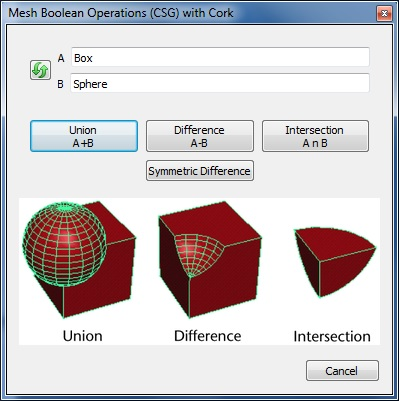
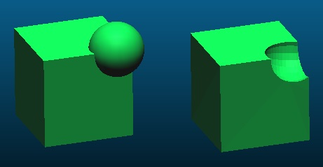

# Cork (plugin)

## Introduction

This plugin can be used to perform Boolean operations on meshes (also called CSG = Constructive Solid Geometry).

It is based on the [Cork](https://github.com/cloudcompare/cork) library.

Consider also using the [Mesh Boolean](https://www.cloudcompare.org/doc/wiki/index.php/Mesh_Boolean_(plugin)) plugin, which is slower but supposedly more robust.



## Procedure

Its usage is pretty straightforward:

1. Load two watertight/manifold meshes and select them both.
2. When the plugin dialog appears, select the operation to apply:
   - **union**: A + B
   - **difference** (symmetric or not): A - B
   - **intersection**: A ∩ B

The plugin will create a new mesh corresponding to the operation output.

**Warning:** due to internal instabilities in the current version of the Cork library, it may be necessary to launch the process several times in order to get it working ;)



## ACloudViewer CLI

Load **two** meshes, then run Cork:

```bash
ACloudViewer -SILENT -O meshA.ply -O meshB.ply -CORK -OPERATION UNION -SAVE_CLOUDS
ACloudViewer -SILENT -O meshA.ply -O meshB.ply -CORK -OPERATION DIFF -SWAP -SAVE_CLOUDS
```

| Token | Description |
|-------|-------------|
| `-CORK` | Run Cork boolean operation on the two loaded meshes |
| `-OPERATION` | `UNION`, `INTERSECT`, `DIFF`, or `SYM_DIFF` |
| `-SWAP` | Swap operand order (useful for asymmetric operations like `DIFF`) |

## Build

```cmake
-DPLUGIN_STANDARD_QCORK=ON
```

## Dependencies

- [Cork](https://github.com/cloudcompare/cork) — the forked version of the Cork library for CloudCompare
- [MPIR](http://www.mpir.org/) or GMP — for exact arithmetic

## References

- Cork: [github.com/gilbo/cork](https://github.com/gilbo/cork)
- CloudCompare wiki: [Cork (plugin)](https://www.cloudcompare.org/doc/wiki/index.php?title=Cork_(plugin))
