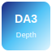
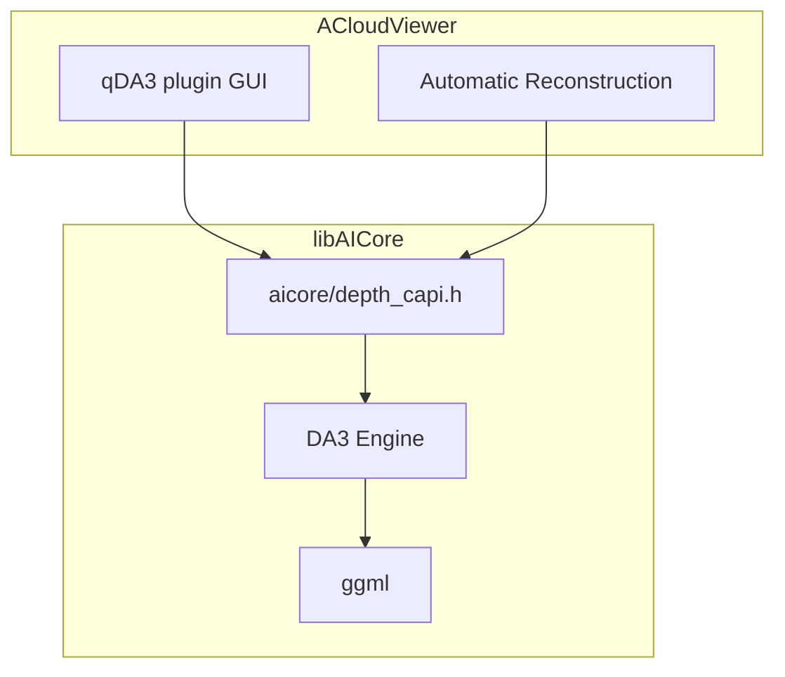
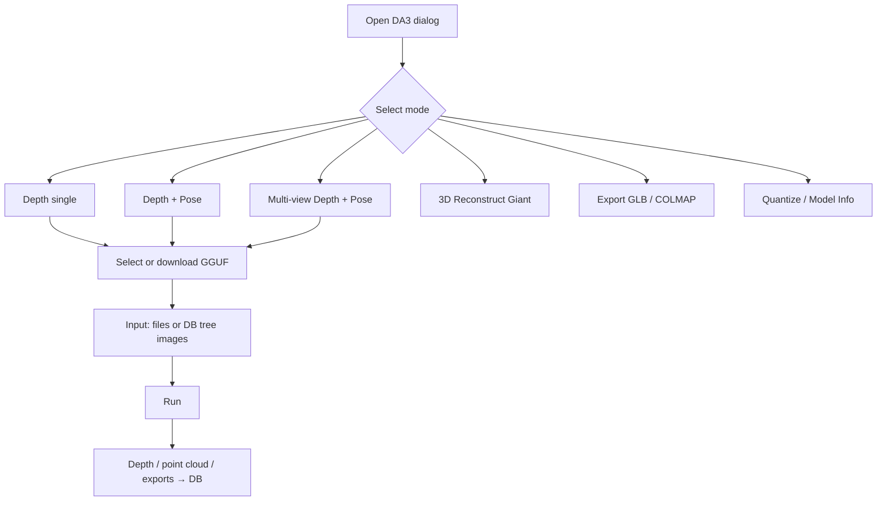

# qDA3 — Depth Anything V3



Integrates [Depth Anything 3](https://github.com/DepthAnything/Depth-Anything-V3) into ACloudViewer. Runs **GGUF models** via C++17 / [ggml](https://github.com/ggml-org/ggml) (derived from [depth-anything.cpp](https://github.com/mudler/depth-anything.cpp)) with no Python/PyTorch runtime.

> **Build index:** see [plugins/README.md](../../README.md).

[](https://huggingface.co/mudler/depth-anything.cpp-gguf)

User guide (Sphinx): [docs/guides/plugins/qDA3.md](../../../../docs/guides/plugins/qDA3.md)

---

## Architecture



| Component | Path | Role |
|-----------|------|------|
| `libAICore.so` | `core/AICore/` | Shared inference library (DA3 + FreeSplatter) |
| `QDA3_PLUGIN` | This directory | Interactive depth / pose / export |
| `DA3DepthController` | `libs/Reconstruction/` | Automatic reconstruction pipeline hook |

---

## GUI usage

**Menu:** Plugins → **Depth Anything V3 (DA3)** → **DA3 Depth Estimation**



### Modes

| Mode | Output |
|------|--------|
| **Depth (single)** | Grayscale / pseudo-color depth → DB tree |
| **Depth + Pose** | Depth + 3×4 extrinsics / 3×3 intrinsics |
| **Multi-view depth + pose** | Multi-view depth and cameras |
| **3D Reconstruct (Gaussian)** | Giant-model point cloud |
| **Export GLB** | glTF 2.0 binary point cloud |
| **Export COLMAP** | `cameras/` / `images/` / `points3D` |
| **Quantize Model** | Convert to f16 / q8_0 / q4_k GGUF |
| **Model Info** | GGUF JSON metadata |

### Typical workflow

1. Select one or more images in the DB tree, or click **Browse**.
2. Choose a **Model** from the combo box (use **Download** on first run).
3. Set **Device** (`Auto` / Metal (macOS) / CUDA / OpenCL / CPU), **Threads** (0 = auto), **Invert depth**, **Unproject 3D**, etc.
4. Click **Run**; progress appears in the log window.
5. Depth results are added as `ccImage` child nodes; use **Export depth** to save to disk.

### Inference device (Device)

| Option | Behavior |
|--------|----------|
| **Auto** | Pick the first compiled GPU backend by platform priority; fall back to CPU (see table below) |
| **GPU (Metal)** | Force Metal (macOS only; `-DGGML_USE_METAL=ON`) |
| **GPU (CUDA)** | Force CUDA (`BUILD_CUDA_MODULE=ON` or `-DGGML_USE_CUDA=ON`) |
| **GPU (OpenCL)** | Force OpenCL (Linux/Windows; `-DGGML_USE_OPENCL=ON`) |
| **CPU** | Force CPU inference |

**Auto priority (runtime):**

| Platform | Order |
|----------|-------|
| **macOS** | Metal → CUDA → CPU (OpenCL not built; Vulkan off by default) |
| **Linux / Windows** | CUDA → OpenCL → CPU (Vulkan off by default) |

Same as **qFreeSplatter**: backend warmup runs on the UI thread before **Run**; if GPU init fails and the user did not force CPU, the job completes on CPU.

Override with environment variable `DA_DEVICE` (CLI / automatic reconstruction): `auto`, `cpu`, `cuda`, `opencl[:N]`, `metal` (macOS).

### Automatic Reconstruction integration

**Reconstruction → Automatic Reconstruction** (requires `-DAICore_ENABLED=ON`):

| Setting | Options |
|---------|---------|
| Sparse model | **COLMAP (native SfM)** or **DA3 (depth+pose)** / hybrid (≥3 images: COLMAP poses + DA3 depth) |
| Stereo / dense | **DA3 depth inference** (Nested AnyView/Metric) or **COLMAP PatchMatch** (CUDA only) |
| Model | Base / Large / Giant / Nested Metric / Nested AnyView |

**Full pipeline without CUDA (CPU / OpenCL / Metal):** when `AICore_ENABLED=ON` and `CUDA_ENABLED=OFF` (e.g. CPU wheel), defaults use DA3 for sparse and stereo; dense path is **undistort → DA3 depth → DA3 voxel fusion → Poisson/Delaunay mesh → texturing** without PatchMatch. If the UI still selects COLMAP PatchMatch, runtime switches to DA3 stereo via `EffectiveStereoPipelineMode`.

**With CUDA:** hybrid mode (≥3 images) can use COLMAP sparse poses + DA3 depth priors + optional PatchMatch geometric refine + StereoFusion.

**Dense coordinate frame:** fused point clouds, textured meshes, and Delaunay meshes are stored in **COLMAP world coordinates** in the DB tree so they align when the scene is rotated.

Model cache (shared with the plugin):

| Platform | Default path |
|----------|--------------|
| Linux | `$HOME/cloudViewer_data/extract/da3_models` |
| Windows | `%USERPROFILE%\cloudViewer_data\extract\da3_models` |
| Override | `CLOUDVIEWER_DATA_ROOT` → `<root>/extract/da3_models` |

Manual download example:

```bash
pip install -U "huggingface_hub[cli]"
hf download mudler/depth-anything.cpp-gguf depth-anything-base-q8_0.gguf \
  --local-dir ~/cloudViewer_data/extract/da3_models
```

---

## Build

```bash
cmake -B build_app \
  -DBUILD_GUI=ON \
  -DAICore_ENABLED=ON \
  -DPLUGIN_STANDARD_QDA3=ON \
  -DBUILD_RECONSTRUCTION=ON \
  .

cmake --build build_app --target QDA3_PLUGIN AICore -j$(nproc)
```

### CMake options

| Option | Default | Description |
|--------|---------|-------------|
| `AICore_ENABLED` | OFF | Build `libAICore.so` |
| `PLUGIN_STANDARD_QDA3` | OFF | This plugin |
| `BUILD_RECONSTRUCTION` | — | `DA3DepthController` / automatic reconstruction |
| `BUILD_CUDA_MODULE` | — | ggml CUDA backend (NVIDIA toolchain) |
| `GGML_USE_METAL` | Apple: ON | Metal backend (macOS/iOS only) |
| `GGML_USE_VULKAN` | OFF (all platforms) | Opt-in only (`-DGGML_USE_VULKAN=ON`) |
| `GGML_USE_OPENCL` | Linux/Win: ON, macOS: OFF | Built when OpenCL 3.0 + Python3 are detected; **not on macOS** |

**Multi-backend ggml:** several static backends can be compiled together; configure prints `backends = ...` and Auto order. OpenCL on Linux/Windows needs OpenCL 3.0 headers. macOS defaults to Metal; Vulkan is not built by default.

**Outputs:**

- Linux: `build_app/bin/libAICore.so`, `build_app/bin/plugins/libQDA3_PLUGIN.so`
- macOS: `build_app/bin/libAICore.dylib`, `build_app/CloudViewer.app/.../PlugIns/libQDA3_PLUGIN.dylib`

Smaller CUDA builds: `-DCMAKE_CUDA_ARCHITECTURES=86-real` (target GPU arch only).

---

## Model quick reference

Full list: [mudler/depth-anything.cpp-gguf](https://huggingface.co/mudler/depth-anything.cpp-gguf)

| Use case | Recommended model |
|----------|-------------------|
| Quick try / CPU | `depth-anything-base-q4_k.gguf` |
| Default quality | `depth-anything-base-q8_0.gguf` |
| Best quality + 3D Gaussians | `depth-anything-giant-f32.gguf` |
| Automatic reconstruction metric depth | `depth-anything-nested-anyview.gguf` + `depth-anything-nested-metric.gguf` |

See also [models/MODEL_CARD.md](models/MODEL_CARD.md).

---

## C API example

Header: `core/AICore/include/aicore/depth_capi.h`

```c
#include "aicore/depth_capi.h"

aicore_depth_ctx* ctx = aicore_depth_load("model.gguf", 8);
int h, w, is_metric;
float *depth, *conf, ext[12], intr[9];
aicore_depth_depth_dense(ctx, "photo.jpg", &h, &w, &depth, &conf, NULL,
                         ext, intr, &is_metric);
aicore_depth_free_floats(depth);
aicore_depth_free(ctx);
```

---

## Tests

Sources under [`tests/`](tests/) (~40+ `test_*.cpp` files). Tests link `AICore` and use environment variables for GGUF and parity baselines; exit code **77** skips when assets are missing.

### Test assets

At repo root (or under `qDA3/`):

```text
models/
  depth-anything-base-f32.gguf
  depth-anything-giant-f32.gguf
  depth-anything-nested-metric.gguf
  depth-anything-nested-anyview.gguf
  ... (see tests/CMakeLists.txt ENVIRONMENT)
dumps/
  reference.gguf
  reference_mv.gguf
  reference_giant.gguf
  ...
```

Download GGUF from HuggingFace; baselines are generated with Python tools under `scripts/`.

### Build a single test (example)

The main CMake tree does not `add_subdirectory(tests)` by default; compile manually:

```bash
cd build_app
cmake --build . --target AICore -j$(nproc)

g++ -std=c++17 -O2 \
  plugins/core/Standard/qDA3/tests/test_capi.cpp \
  -I core/AICore/include -I core/AICore/src/depth \
  -L build_app/bin -lAICore -Wl,-rpath,build_app/bin \
  -o build_app/bin/plugins/test_capi

export DA_TEST_GGUF=$HOME/cloudViewer_data/extract/da3_models/depth-anything-base-f32.gguf
export DA_TEST_NATIVE_PNG=plugins/core/Standard/qDA3/dumps/native_input.png
./build_app/bin/plugins/test_capi
```

Or add `add_subdirectory(tests)` at the end of `qDA3/CMakeLists.txt`:

```bash
cmake -B build_app -DAICore_ENABLED=ON -DBUILD_TESTING=ON ...
cmake --build build_app --target test_capi test_engine_depth -j$(nproc)
ctest --test-dir build_app -R test_capi
```

### Test categories

| Category | Examples | Validates |
|----------|----------|-----------|
| **C API** | `test_capi`, `test_capi_da2`, `test_capi_dense` | `aicore_depth_*` load, info, export |
| **Backbone** | `test_backbone`, `test_backbone_mv`, `test_backbone_giant`, … | ViT backbone vs baseline tensors |
| **Head / Blocks** | `test_dpt_head`, `test_dpt_blocks`, `test_metric_head`, … | Decoder numerical parity |
| **Engine E2E** | `test_engine_depth`, `test_engine_pose`, `test_engine_mv`, … | Full-image inference |
| **Geometry** | `test_cam_pose`, `test_ray_pose`, `test_rope2d`, … | Pose and geometry modules |
| **Preprocess** | `test_preprocess`, `test_preprocess_real` | Image preprocessing |
| **Quantize** | `test_quantize`, `test_quantize_accuracy` | GGUF quantization |
| **Nested** | `test_nested_align`, `test_fused_depth` | Dual-model metric alignment |
| **Reconstruct** | `test_reconstruct`, `test_giant_depth_pose` | 3D / Giant output |
| **Low-level** | `test_backend`, `test_ggml_extend`, `test_winograd`, … | ggml backends and loader |

### Standalone parity tools (not ctest)

| Tool | Use with |
|------|----------|
| `glb_parity_dump` | `scripts/parity_glb.py` |
| `colmap_parity_dump` | `scripts/parity_colmap.py` |

Upstream benchmarks: [`examples/demos/BENCHMARK.md`](examples/demos/BENCHMARK.md).

### Python scripts (convert / validate; not runtime deps)

```bash
cd plugins/core/Standard/qDA3
python3 -m venv .venv && source .venv/bin/activate
pip install -r scripts/requirements.txt
python scripts/download_model.py --repo depth-anything/DA3-BASE --out models/DA3-BASE
python scripts/convert_da3_to_gguf.py --model models/DA3-BASE --output models/depth-anything-base-f32.gguf
```

---

## Supported model families

| Family | Output |
|--------|--------|
| DA3-SMALL / BASE / LARGE | depth + conf + pose |
| DA3-GIANT | depth + conf + pose + 3D Gaussians |
| DA3MONO-LARGE | depth + sky |
| DA3METRIC-LARGE | metric depth + sky |
| DA3NESTED | dual GGUF metric-aligned depth + pose |
| Depth Anything V2 | depth only |

---

## References

- [Depth Anything 3](https://github.com/DepthAnything/Depth-Anything-V3)
- [depth-anything.cpp](https://github.com/mudler/depth-anything.cpp)
- [GGUF weights](https://huggingface.co/mudler/depth-anything.cpp-gguf)

## License

Integration code follows the ACloudViewer project license. DA3 weights are **Apache-2.0**; upstream engine is **MIT**.
