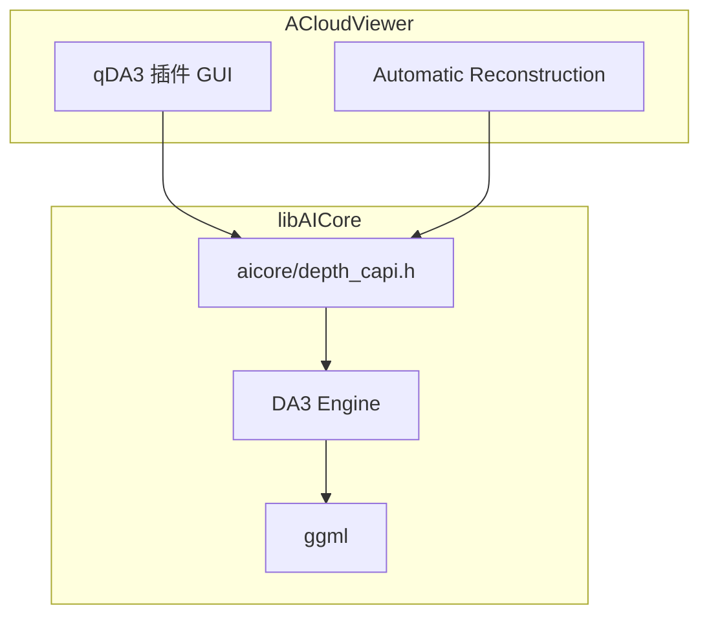
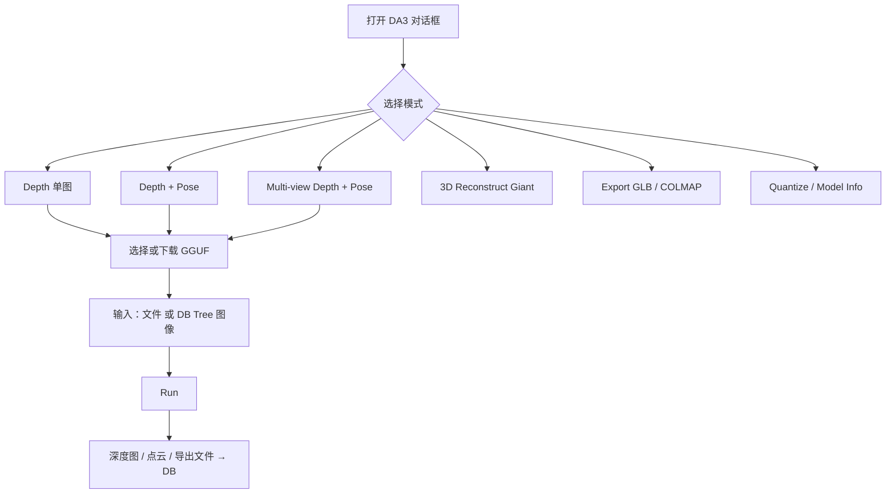

# qDA3 — Depth Anything V3


在 ACloudViewer 中集成 [Depth Anything 3](https://github.com/DepthAnything/Depth-Anything-V3)，通过 C++17 / [ggml](https://github.com/ggml-org/ggml) 引擎（源自 [depth-anything.cpp](https://github.com/mudler/depth-anything.cpp)）运行 **GGUF 模型**，无需 Python/PyTorch 即可推理。

> **构建索引：** 见 [plugins/README.md](../../README.md)。

[](https://huggingface.co/mudler/depth-anything.cpp-gguf)

---

## 架构



| 组件 | 路径 | 作用 |
|------|------|------|
| `libAICore.so` | `core/AICore/` | DA3 + FreeSplatter 统一推理库 |
| `QDA3_PLUGIN` | 本目录 | 交互式深度 / 位姿 / 导出 |
| `DA3DepthController` | `libs/Reconstruction/` | 自动重建流水线 hook |

---

## GUI 使用

**菜单：** Plugins → **Depth Anything V3 (DA3)** → **DA3 Depth Estimation**



### 模式一览

| 模式 | 输出 |
|------|------|
| **Depth (single)** | 灰度 / 伪彩色深度图 → DB Tree |
| **Depth + Pose** | 深度 + 外参 3×4 / 内参 3×3 |
| **Multi-view depth + pose** | 多视图深度与相机 |
| **3D Reconstruct (Gaussian)** | Giant 模型点云 |
| **Export GLB** | glTF 2.0 二进制点云 |
| **Export COLMAP** | `cameras/` / `images/` / `points3D` |
| **Quantize Model** | 转 f16 / q8_0 / q4_k GGUF |
| **Model Info** | GGUF JSON 元数据 |

### 典型工作流

1. 在 DB Tree 中选中一张或多张图像，或点击 **Browse** 选文件。
2. 在 **Model** 下拉框选择内置模型（首次可 **Download**）。
3. 设置 **Device**（`Auto` / `CUDA` / `Vulkan` / `CPU`）、**Threads**（0 = 自动）、**Invert depth**、**Unproject 3D** 等选项。
4. 点击 **Run**；日志窗口显示进度。
5. 深度结果以 `ccImage` 子节点加入 DB；可 **Export depth** 到磁盘。

### 推理设备（Device）

| 选项 | 行为 |
|------|------|
| **Auto** | 按平台优先级自动选择已编译的 GPU 后端，均不可用时回退 CPU（见下表） |
| **GPU (CUDA)** | 强制 CUDA（需 `BUILD_CUDA_MODULE=ON` 或 `-DGGML_USE_CUDA=ON`） |
| **GPU (Vulkan)** | 强制 Vulkan（macOS 上为 MoltenVK；Linux/Windows 需 `-DGGML_USE_VULKAN=ON`） |
| **CPU** | 强制 CPU 推理 |

**Auto 优先级（运行时）：**

| 平台 | 顺序 |
|------|------|
| **Linux / Windows** | CUDA → OpenCL → Vulkan → CPU |
| **macOS** | Metal → Vulkan → CUDA → CPU（不编译 OpenCL） |

与 **qFreeSplatter** 一致：Run 前在 UI 线程执行 backend warmup；若 GPU 初始化失败且用户未强制 CPU，会自动改用 CPU 完成本次任务。

也可通过环境变量 `DA_DEVICE` 覆盖（CLI / 自动重建流水线）：`auto`、`cpu`、`cuda`、`vulkan`、`opencl[:N]`、`metal`（macOS）。

### Automatic Reconstruction 集成

**Reconstruction → Automatic Reconstruction** 中可选 DA3：

| 设置 | 选项 |
|------|------|
| Sparse model | **DA3 (depth+pose)** — 跳过 SIFT，用 DA3 多视图 + 反投影 |
| Stereo / dense | **DA3 depth inference** — 需 Nested AnyView + Metric 与 DA3 sparse 模式 |
| Model | Base / Large / Giant / Nested Metric / Nested AnyView |

**密集重建坐标系：** Fused 点云、Textured mesh、Delaunay mesh 均以 **COLMAP 世界坐标** 写入 DB Tree，旋转场景时应重合。此前 Fused 点云曾错误应用 display 变换 `(x, -y, -z)`，已与 mesh 对齐修复。

模型缓存（与插件共用）：

| 平台 | 默认路径 |
|------|----------|
| Linux | `$HOME/cloudViewer_data/extract/da3_models` |
| Windows | `%USERPROFILE%\cloudViewer_data\extract\da3_models` |
| 覆盖 | 环境变量 `CLOUDVIEWER_DATA_ROOT` → `<root>/extract/da3_models` |

手动下载示例：

```bash
pip install -U "huggingface_hub[cli]"
hf download mudler/depth-anything.cpp-gguf depth-anything-base-q8_0.gguf \
  --local-dir ~/cloudViewer_data/extract/da3_models
```

---

## 构建

```bash
cmake -B build_app \
  -DBUILD_GUI=ON \
  -DAICore_ENABLED=ON \
  -DPLUGIN_STANDARD_QDA3=ON \
  -DBUILD_RECONSTRUCTION=ON \
  .

cmake --build build_app --target QDA3_PLUGIN AICore -j$(nproc)
```

### CMake 选项

| 选项 | 默认 | 说明 |
|------|------|------|
| `AICore_ENABLED` | OFF | 构建 `libAICore.so` |
| `PLUGIN_STANDARD_QDA3` | OFF | 本插件 |
| `BUILD_RECONSTRUCTION` | — | `DA3DepthController` / 自动重建 |
| `BUILD_CUDA_MODULE` | — | ggml CUDA 后端（需 NVIDIA 工具链） |
| `GGML_USE_METAL` | Apple: ON | Metal 后端（仅 macOS/iOS） |
| `GGML_USE_VULKAN` | Apple: ON, 其他: OFF | 检测到依赖时自动编译 Vulkan |
| `GGML_USE_OPENCL` | Linux/Win: ON, macOS: OFF | 检测到 OpenCL 3.0 + Python3 时自动编译；**macOS 不启用** |

**ggml 多 backend：** 可同时编译多个静态后端；配置结束会打印 `backends = ...` 与 Auto 顺序。Linux/Windows 上 OpenCL 需 OpenCL 3.0 头文件；Vulkan 需 loader + glslc + SPIRV-Headers（或完整 Vulkan SDK）。macOS 默认 Metal + Vulkan，不编译 OpenCL。

**产物：**

- Linux: `build_app/bin/libAICore.so`、`build_app/bin/plugins/libQDA3_PLUGIN.so`
- macOS: `build_app/bin/libAICore.dylib`、`build_app/CloudViewer.app/.../PlugIns/libQDA3_PLUGIN.dylib`

缩小 CUDA 体积：`-DCMAKE_CUDA_ARCHITECTURES=86-real`（仅目标 GPU 架构）。

---

## 模型速查

完整列表见 HuggingFace：[mudler/depth-anything.cpp-gguf](https://huggingface.co/mudler/depth-anything.cpp-gguf)

| 场景 | 推荐模型 |
|------|----------|
| 快速试用 / CPU | `depth-anything-base-q4_k.gguf` |
| 默认质量 | `depth-anything-base-q8_0.gguf` |
| 最高质量 + 3D Gaussians | `depth-anything-giant-f32.gguf` |
| 自动重建 metric depth | `depth-anything-nested-anyview.gguf` + `depth-anything-nested-metric.gguf` |

---

## C API 示例

头文件：`core/AICore/include/aicore/depth_capi.h`

```c
#include "aicore/depth_capi.h"

aicore_depth_ctx* ctx = aicore_depth_load("model.gguf", 8);
int h, w, is_metric;
float *depth, *conf, ext[12], intr[9];
aicore_depth_depth_dense(ctx, "photo.jpg", &h, &w, &depth, &conf, NULL,
                         ext, intr, &is_metric);
aicore_depth_free_floats(depth);
aicore_depth_free(ctx);
```

---

## 测试

测试源码在 [`tests/`](tests/)（约 40+ 个 `test_*.cpp`）。测试链接 `AICore`，通过环境变量提供 GGUF 与 parity baseline；缺少资产时以退出码 **77** 跳过。

### 准备测试资产

在仓库根目录（或 `qDA3/` 下）准备：

```text
models/
  depth-anything-base-f32.gguf
  depth-anything-giant-f32.gguf
  depth-anything-nested-metric.gguf
  depth-anything-nested-anyview.gguf
  ...（见 tests/CMakeLists.txt ENVIRONMENT）
dumps/
  reference.gguf
  reference_mv.gguf
  reference_giant.gguf
  ...
```

可从 HuggingFace 下载 GGUF；baseline 由 `scripts/` 下 Python 工具生成。

### 构建单个测试（示例）

当前主工程 CMake 未默认 `add_subdirectory(tests)`，可手动编译：

```bash
cd build_app
# 确保已构建 AICore
cmake --build . --target AICore -j$(nproc)

# 示例：编译 test_capi
g++ -std=c++17 -O2 \
  plugins/core/Standard/qDA3/tests/test_capi.cpp \
  -I core/AICore/include -I core/AICore/src/depth \
  -L build_app/bin -lAICore -Wl,-rpath,build_app/bin \
  -o build_app/bin/plugins/test_capi

export DA_TEST_GGUF=$HOME/cloudViewer_data/extract/da3_models/depth-anything-base-f32.gguf
export DA_TEST_NATIVE_PNG=plugins/core/Standard/qDA3/dumps/native_input.png
./build_app/bin/plugins/test_capi
```

或在 `qDA3/CMakeLists.txt` 末尾添加 `add_subdirectory(tests)` 后：

```bash
cmake -B build_app -DAICore_ENABLED=ON -DBUILD_TESTING=ON ...
cmake --build build_app --target test_capi test_engine_depth -j$(nproc)
ctest --test-dir build_app -R test_capi
```

### 用例分类

| 类别 | 代表用例 | 验证内容 |
|------|----------|----------|
| **C API** | `test_capi`, `test_capi_da2`, `test_capi_dense` | `aicore_depth_*` 加载、info、导出 |
| **Backbone** | `test_backbone`, `test_backbone_mv`, `test_backbone_giant`, `test_backbone_da2`, `test_backbone_metric` | ViT backbone 与 baseline tensor 对比 |
| **Head / Blocks** | `test_dpt_head`, `test_dpt_blocks`, `test_metric_head`, `test_gs_head`, `test_gs_adapter` | 解码头数值 parity |
| **Engine E2E** | `test_engine_depth`, `test_engine_pose`, `test_engine_mv`, `test_engine_metric`, `test_engine_mono`, `test_engine_da2` | 全图推理端到端 |
| **Geometry** | `test_cam_pose`, `test_ray_pose`, `test_rope2d`, `test_uv_posembed`, `test_linalg` | 位姿与几何模块 |
| **Preprocess** | `test_preprocess`, `test_preprocess_real` | 图像预处理 |
| **Quantize** | `test_quantize`, `test_quantize_accuracy` | GGUF 量化 |
| **Nested** | `test_nested_align`, `test_fused_depth` | 双模型 metric 对齐 |
| **Reconstruct** | `test_reconstruct`, `test_giant_depth_pose` | 3D / Giant 输出 |
| **Low-level** | `test_backend`, `test_ggml_extend`, `test_winograd`, `test_model_loader` | ggml 后端与加载器 |

### 独立 parity 工具（非 ctest）

| 工具 | 用途 |
|------|------|
| `glb_parity_dump` | 配合 `scripts/parity_glb.py` |
| `colmap_parity_dump` | 配合 `scripts/parity_colmap.py` |

上游 benchmark 与 demo 资产：[`examples/demos/BENCHMARK.md`](examples/demos/BENCHMARK.md)。

### Python 脚本（转换 / 校验，非运行时依赖）

```bash
cd plugins/core/Standard/qDA3
python3 -m venv .venv && source .venv/bin/activate
pip install -r scripts/requirements.txt
python scripts/download_model.py --repo depth-anything/DA3-BASE --out models/DA3-BASE
python scripts/convert_da3_to_gguf.py --model models/DA3-BASE --output models/depth-anything-base-f32.gguf
```

---

## 支持模型摘要

| 系列 | 输出 |
|------|------|
| DA3-SMALL / BASE / LARGE | depth + conf + pose |
| DA3-GIANT | depth + conf + pose + 3D Gaussians |
| DA3MONO-LARGE | depth + sky |
| DA3METRIC-LARGE | metric depth + sky |
| DA3NESTED | 双 GGUF metric 对齐 depth + pose |
| Depth Anything V2 | depth only |

---

## References

- [Depth Anything 3](https://github.com/DepthAnything/Depth-Anything-V3)
- [depth-anything.cpp](https://github.com/mudler/depth-anything.cpp)
- [GGUF weights](https://huggingface.co/mudler/depth-anything.cpp-gguf)

## License

集成代码遵循 ACloudViewer 项目许可证。DA3 权重为 **Apache-2.0**；上游 engine 为 **MIT**。