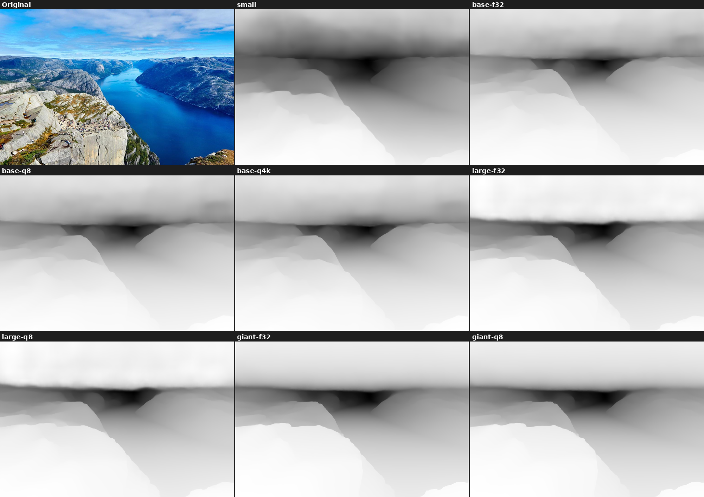
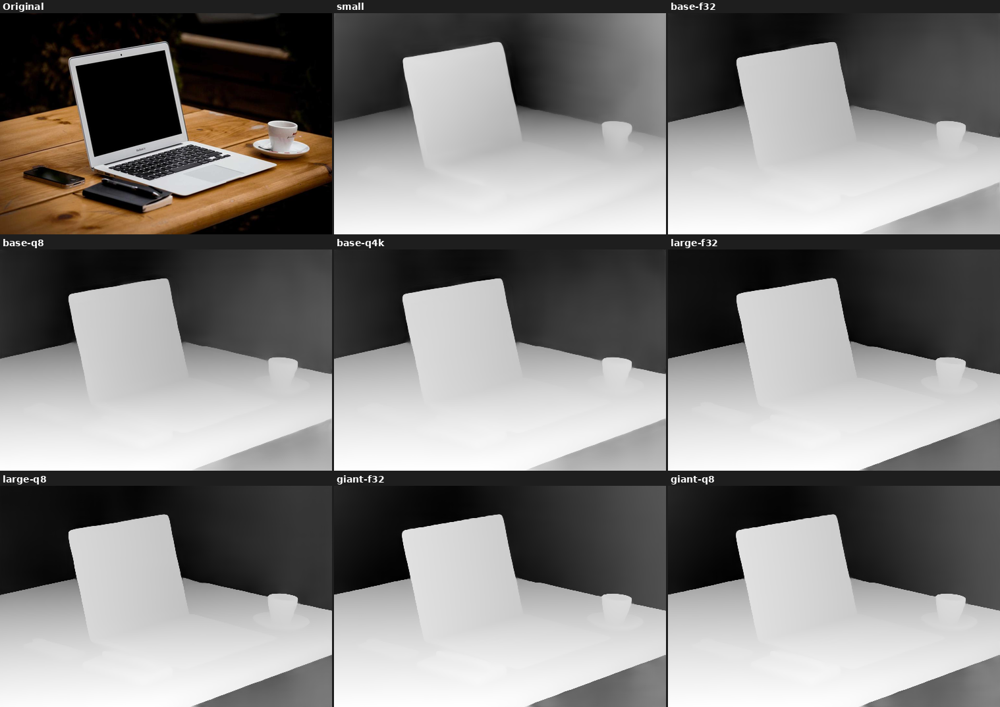
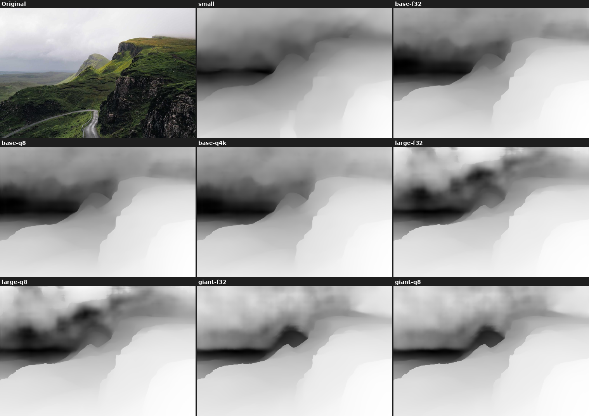
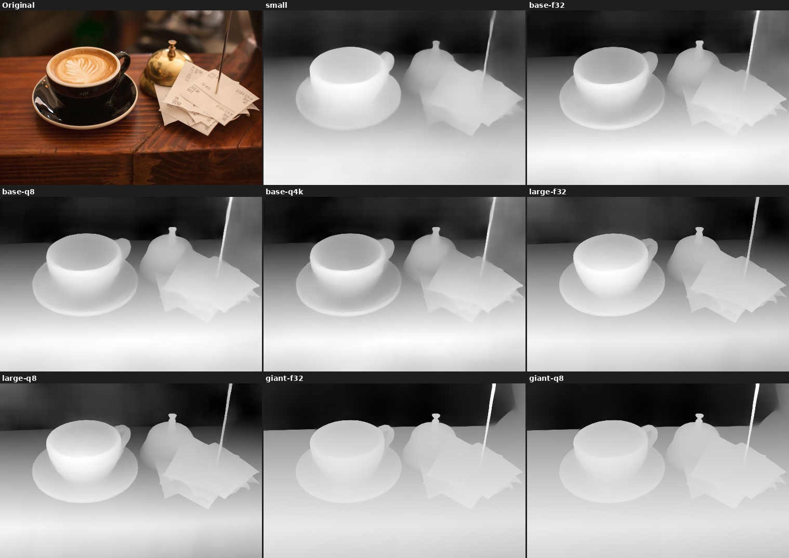

# Depth Anything .cpp - Comprehensive Benchmark Report

Generated: 2026-07-09 16:19:38
GPU: RTX 3060 12GB | CUDA 12.4

## 1. Depth Inference (GPU mode)

| Model | canyon | desk | mountains | street | Avg Time |
|-------|--------|------|-----------|--------|----------|
| depth-anything-small-f32 | 0.46s | 0.39s | 0.45s | 0.45s | 0.44s |
| depth-anything-base-f32 | 0.86s | 0.81s | 0.75s | 0.74s | 0.79s |
| depth-anything-base-f16 | 0.72s | 0.65s | 0.66s | 0.72s | 0.69s |
| depth-anything-base-q8_0 | 0.59s | 0.59s | 0.57s | 0.59s | 0.58s |
| depth-anything-base-q4_k | 0.58s | 0.54s | 0.54s | 0.54s | 0.55s |
| depth-anything-large-f32 | 2.34s | 1.67s | 1.70s | 1.69s | 1.85s |
| **depth-anything-large-q8_0** | **1.06s** | **1.08s** | **1.03s** | **1.08s** | **1.06s** |
| **depth-anything-large-q4_k** | **1.12s** | **1.03s** | **1.10s** | **1.05s** | **1.07s** |
| depth-anything-giant-f32 | 4.84s | 4.02s | 4.10s | 3.95s | 4.22s |
| **depth-anything-giant-q8_0** | **1.81s** | **1.85s** | **1.83s** | **1.82s** | **1.83s** |
| **depth-anything-giant-q4_k** | **1.56s** | **1.63s** | **1.67s** | **1.63s** | **1.62s** |

### Depth visualization comparison (quantized variants included)

3×3 grid, left-to-right top-to-bottom: Original | small | base-f32 | base-q8 | base-q4k | large-f32 | large-q8 | giant-f32 | giant-q8

**canyon.jpg**

**desk.jpg**

**mountains.jpg**

**street.jpg**

### Depth Range Comparison (min/max per image)

**canyon.jpg**

| Model | min | max | range |
|-------|-----|-----|-------|
| depth-anything-small-f32 | 0.3077 | 3.2835 | 2.9758 |
| depth-anything-base-f32 | 0.2848 | 4.5876 | 4.3028 |
| depth-anything-base-f16 | 0.2849 | 4.5873 | 4.3024 |
| depth-anything-base-q8_0 | 0.2829 | 4.5815 | 4.2986 |
| depth-anything-base-q4_k | 0.2726 | 4.4143 | 4.1417 |
| depth-anything-large-f32 | 0.2605 | 5.4264 | 5.1659 |
| **depth-anything-large-q8_0** | **0.2622** | **5.4514** | **5.1892** |
| depth-anything-giant-f32 | 0.0873 | 3.8366 | 3.7493 |
| **depth-anything-giant-q8_0** | **0.0889** | **3.8369** | **3.7480** |

**desk.jpg**

| Model | min | max | range |
|-------|-----|-----|-------|
| depth-anything-small-f32 | 0.6277 | 2.0183 | 1.3906 |
| depth-anything-base-f32 | 0.7306 | 2.1264 | 1.3958 |
| depth-anything-base-f16 | 0.7306 | 2.1281 | 1.3975 |
| depth-anything-base-q8_0 | 0.7313 | 2.1307 | 1.3994 |
| depth-anything-base-q4_k | 0.7415 | 2.4887 | 1.7472 |
| depth-anything-large-f32 | 0.7594 | 2.1699 | 1.4105 |
| **depth-anything-large-q8_0** | **0.7593** | **2.1719** | **1.4126** |
| depth-anything-giant-f32 | 0.8168 | 2.0913 | 1.2745 |
| **depth-anything-giant-q8_0** | **0.8165** | **2.0923** | **1.2758** |

**mountains.jpg**

| Model | min | max | range |
|-------|-----|-----|-------|
| depth-anything-small-f32 | 0.3286 | 2.5946 | 2.2660 |
| depth-anything-base-f32 | 0.4370 | 3.7581 | 3.3211 |
| depth-anything-base-f16 | 0.4373 | 3.7551 | 3.3178 |
| depth-anything-base-q8_0 | 0.4372 | 3.7621 | 3.3249 |
| depth-anything-base-q4_k | 0.4694 | 4.0034 | 3.5340 |
| depth-anything-large-f32 | 0.7460 | 8.2707 | 7.5247 |
| **depth-anything-large-q8_0** | **0.7426** | **8.2453** | **7.5027** |
| depth-anything-giant-f32 | 0.3505 | 7.6696 | 7.3191 |
| **depth-anything-giant-q8_0** | **0.3540** | **7.6755** | **7.3215** |

**street.jpg**

| Model | min | max | range |
|-------|-----|-----|-------|
| depth-anything-small-f32 | 0.7643 | 1.5154 | 0.7511 |
| depth-anything-base-f32 | 0.8853 | 1.3028 | 0.4175 |
| depth-anything-base-f16 | 0.8855 | 1.3026 | 0.4171 |
| depth-anything-base-q8_0 | 0.8866 | 1.3029 | 0.4163 |
| depth-anything-base-q4_k | 0.8792 | 1.2529 | 0.3737 |
| depth-anything-large-f32 | 0.8996 | 1.4520 | 0.5524 |
| **depth-anything-large-q8_0** | **0.9001** | **1.4552** | **0.5551** |
| depth-anything-giant-f32 | 0.7973 | 1.8239 | 1.0266 |
| **depth-anything-giant-q8_0** | **0.7964** | **1.8200** | **1.0236** |

## 2. Pose Estimation

| Model | canyon | desk | mountains | street |
|-------|--------|------|-----------|--------|
| depth-anything-small-f32 | 0.46s | 0.41s | 0.46s | 0.47s |
| depth-anything-base-f32 | 0.83s | 0.81s | 0.79s | 0.84s |
| depth-anything-base-f16 | 0.74s | 0.70s | 0.78s | 0.67s |
| depth-anything-base-q8_0 | 0.62s | 0.65s | 0.64s | 0.69s |
| depth-anything-base-q4_k | 0.64s | 0.64s | 0.60s | 0.62s |
| depth-anything-large-f32 | 1.82s | 1.75s | 1.82s | 1.78s |
| depth-anything-giant-f32 | 4.14s | 4.22s | 4.21s | 4.24s |

## 3. Nested Metric Depth (absolute depth, unit: meters)

> **Note**: Nested metric mode loads TWO models simultaneously. With anyview-f32 (4.6GB) + metric (1.3GB),
> RTX 3060 (12GB) runs out of memory. Quantized anyview + metric runs successfully!

### anyview-q4_k (905MB) + metric (1.3GB) — recommended for 12GB GPU

| Image | Time | min (m) | max (m) | scale_factor | Status |
|-------|------|---------|---------|--------------|--------|
| canyon | 6.77s | 0.68 | 29.48 | 6.62 | OK |
| desk | 6.79s | 1.95 | 4.83 | 2.36 | OK |
| mountains | 6.85s | 2.21 | 48.19 | 6.38 | OK |
| street | 6.96s | 0.70 | 1.69 | 0.85 | OK |

### anyview-q8_0 (1.5GB) + metric (1.3GB) — requires ≥16GB GPU

| Image | Time | min (m) | max (m) | scale_factor | Status |
|-------|------|---------|---------|--------------|--------|
| canyon | ~7s | 0.66 | 28.77 | 6.53 | OK |
| desk | ~7s | 1.90 | 4.85 | 2.31 | OK |
| mountains | ~7s | 2.17 | 47.47 | 6.20 | OK |
| street | ~7s | 0.68 | 1.75 | 0.82 | OK |

### Nested quantization accuracy (anyview-q8 as high-precision baseline)

| Image | corr(q8 vs q4k) | MAE (m) | q8 range (m) | q4k range (m) |
|-------|-----------------|---------|--------------|---------------|
| canyon | 0.9999 | 0.255 | 0.66~28.77 | 0.68~29.48 |
| desk | 0.9998 | 0.055 | 1.90~4.85 | 1.95~4.83 |
| mountains | 0.9999 | 0.400 | 2.17~47.47 | 2.21~48.19 |
| street | 0.9984 | 0.033 | 0.68~1.75 | 0.70~1.69 |

> - `nested-metric.gguf` weights are too small to quantize (0 weights quantized); q8/q4k files are identical to the original — no separate quantization needed
> - anyview-q4_k vs anyview-q8_0 accuracy difference is negligible (correlation > 0.998); q4_k is recommended to save VRAM
> - Output resolution 1022×672; includes `scale_factor` to align relative depth to absolute scale

## 4. Multi-view Depth + Pose

| Model | Pair | Time | Files | Status |
|-------|------|------|-------|--------|
| depth-anything-base-f32 | canyon_mountains | 20.53s | 6 | ok |
| depth-anything-base-f32 | desk_street | 2.52s | 6 | ok |
| depth-anything-giant-f32 | canyon_mountains | 39.38s | 6 | ok |
| depth-anything-giant-f32 | desk_street | 11.80s | 6 | ok |

## 5. 3D Export

| Model | GLB Time | GLB | COLMAP | Reconstruct Time | PLY | PLY Size |
|-------|----------|-----|--------|------------------|-----|----------|
| depth-anything-base-f32 | 1.11s | OK | OK | N/A (no GsHead) | - | - |
| depth-anything-giant-f32 | 4.71s | OK | OK | 10.40s | OK | 37MB |
| **depth-anything-giant-q8_0** | - | - | - | **8.03s** | **OK** | **37MB** |
| **depth-anything-giant-q4_k** | - | - | - | **7.87s** | **OK** | **37MB** |

> `reconstruct` requires GsHead weights; only giant-series models support it.
> After quantization, reconstruct time drops from 10.4s to ~8s (~1.3× speedup); PLY size unchanged (686,784 Gaussians).

## 6. Model Metadata

| Model | Info Lines |
|-------|------------|
| depth-anything-small-f32 | 9 |
| depth-anything-base-f32 | 9 |
| depth-anything-base-f16 | 9 |
| depth-anything-base-q8_0 | 9 |
| depth-anything-base-q4_k | 9 |
| depth-anything-large-f32 | 9 |
| depth-anything-giant-f32 | 9 |
| depth-anything-nested-anyview | 9 |
| depth-anything-nested-metric | 9 |

## 7. Summary analysis

### Model file size vs inference speed

| Model | File size | Avg inference | Speedup (vs f32) | Accuracy |
|------|----------|-------------|----------------|----------|
| depth-anything-small-f32 | 100 MB | 0.44s | - | ★★ |
| depth-anything-base-q4_k | 99 MB | 0.55s | 1.44x | ★★★ |
| depth-anything-base-q8_0 | 142 MB | 0.58s | 1.36x | ★★★ |
| depth-anything-base-f16 | 222 MB | 0.69s | 1.14x | ★★★ |
| **depth-anything-large-q4_k** | **301 MB** | **1.07s** | **1.73x** | **★★★★** |
| depth-anything-base-f32 | 393 MB | 0.79s | 1.00x | ★★★ |
| **depth-anything-large-q8_0** | **449 MB** | **1.06s** | **1.75x** | **★★★★** |
| **depth-anything-giant-q4_k** | **905 MB** | **1.62s** | **2.60x** | **★★★★★** |
| depth-anything-large-f32 | 1318 MB | 1.85s | 1.00x | ★★★★ |
| **depth-anything-giant-q8_0** | **1536 MB** | **1.83s** | **2.31x** | **★★★★★** |
| depth-anything-giant-f32 | 4679 MB | 4.22s | 1.00x | ★★★★★ |

### Depth output types

| Model type | Output type | Unit | Description |
|----------|----------|------|------|
| small / base / large / giant | **Relative depth** | unitless | Values encode near/far ordering only; larger = farther. Not comparable across images |
| nested (anyview + metric) | **Metric depth** | meters (m) | Aligned to real-world scale via `scale_factor` |

> - Relative depth: scene understanding, segmentation, rendering focus, depth comparison
> - Metric depth: 3D measurement, SLAM, obstacle avoidance, point cloud reconstruction, engineering apps needing real distances

### Pixel-level accuracy (correlation vs giant-f32 as highest-precision baseline)

| Model | canyon | desk | mountains | street | **Avg corr** |
|-------|--------|------|-----------|--------|--------------|
| small-f32 | 0.8822 | 0.8943 | 0.9101 | 0.9366 | 0.9058 |
| base-f32 | 0.9135 | 0.9795 | 0.8716 | 0.9524 | 0.9292 |
| base-q8_0 | 0.9148 | 0.9795 | 0.8720 | 0.9532 | 0.9299 |
| base-q4_k | 0.9326 | 0.9805 | 0.8638 | 0.9397 | 0.9292 |
| large-f32 | 0.9712 | 0.9958 | 0.9025 | 0.9239 | 0.9484 |
| large-q8_0 | 0.9712 | 0.9957 | 0.9021 | 0.9268 | 0.9489 |
| large-q4_k | 0.9743 | 0.9948 | 0.9046 | 0.8881 | 0.9405 |
| giant-f32 | 1.0000 | 1.0000 | 1.0000 | 1.0000 | **1.0000** |
| giant-q8_0 | 1.0000 | 1.0000 | 0.9999 | 1.0000 | **0.9999** |
| giant-q4_k | 0.9998 | 0.9999 | 0.9966 | 0.9998 | **0.9990** |

### Intra-family quantization MAE (mean absolute error, relative depth units)

| Family | Quantization | canyon | desk | mountains | street | **Avg MAE** |
|--------|------|--------|------|-----------|--------|-------------|
| base | q8_0 | 0.0037 | 0.0022 | 0.0052 | 0.0009 | **0.0030** |
| base | q4_k | 0.0647 | 0.1352 | 0.0717 | 0.0199 | **0.0729** |
| large | q8_0 | 0.0068 | 0.0022 | 0.0148 | 0.0024 | **0.0065** |
| large | q4_k | 0.0372 | 0.0229 | 0.1289 | 0.0222 | **0.0528** |
| giant | q8_0 | 0.0031 | 0.0009 | 0.0186 | 0.0007 | **0.0058** |
| giant | q4_k | 0.0118 | 0.0049 | 0.0941 | 0.0123 | **0.0308** |

> **Conclusion**: q8_0 quantization loss is negligible (MAE < 0.007), barely perceptible; q4_k loses ~3–7% accuracy but with significant speed gains.

### Recommended use cases

| Scenario | Recommended model | Rationale |
|------|----------|------|
| Real-time preview / embedded | small-f32 / base-q4_k | 0.4–0.5s very fast inference |
| General depth estimation | base-q8_0 | Best accuracy–speed balance, 142MB |
| **High-precision depth** | **large-q4_k / large-q8_0** | **~1.07s, 301–449MB, very high accuracy** |
| **3D reconstruction (reconstruct)** | **giant-q4_k** | **7.9s, 905MB, only 0.52% accuracy loss** |
| **Nested metric depth** | **nested-anyview-q4_k + nested-metric** | **6.8s, only 905MB+1.3GB, runs on 12GB GPU** |
| Maximum accuracy | giant-f32 | Lossless accuracy, 4.6GB |
| Multi-view consistency | giant-q4_k / giant-q8_0 | Best multi-view consistency |
| Deployment (low VRAM) | base-q4_k / large-q4_k | 99–301MB, minimal VRAM |

### Model architecture

| Model | Architecture | embed_dim | depth | num_heads | Parameter scale |
|------|------|-----------|-------|-----------|----------|
| depth-anything-small-f32 | DA3-SMALL | 384 | 12 | 6 | ~25M |
| depth-anything-base-f32 | DA3-BASE | 768 | 12 | 12 | ~98M |
| depth-anything-base-f16 | DA3-BASE | 768 | 12 | 12 | ~98M |
| depth-anything-base-q8_0 | DA3-BASE | 768 | 12 | 12 | ~98M |
| depth-anything-base-q4_k | DA3-BASE | 768 | 12 | 12 | ~98M |
| depth-anything-large-f32 | DA3-LARGE | 1024 | 24 | 16 | ~335M |
| depth-anything-giant-f32 | DA3-GIANT | 1536 | 40 | 24 | ~1.1B |
| depth-anything-nested-anyview | DA3NESTED-GIANT-LARGE-anyview | 1536 | 40 | 24 | ~1.1B+335M |
| depth-anything-nested-metric | DA3NESTED-metric-LARGE | 1024 | 24 | 16 | ~335M |
