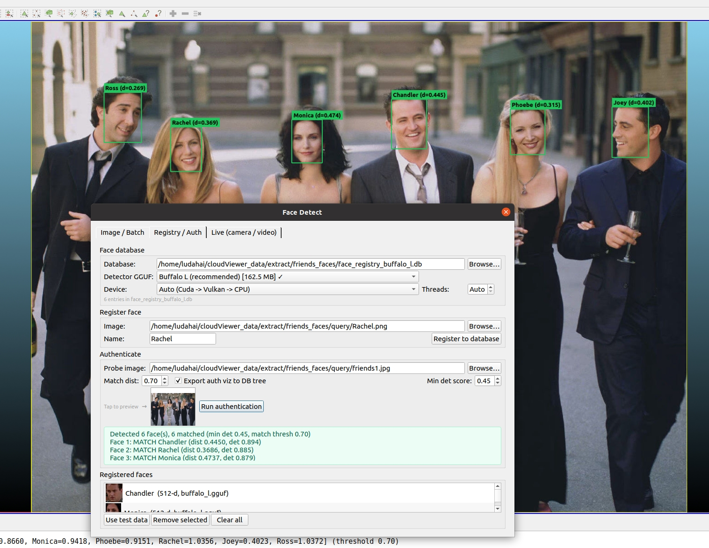
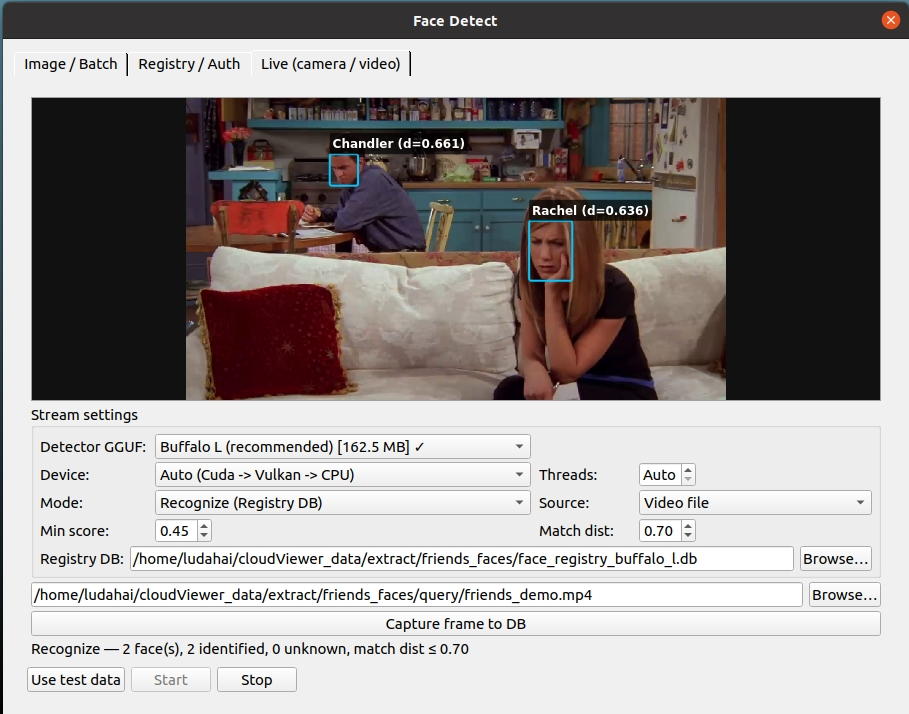

# qFaceDetect

InsightFace-style face detection and recognition for ACloudViewer — **native C++ GGML**.

**User guide:** [docs/guides/plugins/qFaceDetect.md](../../../docs/guides/plugins/qFaceDetect.md)



```
Image → AICore FaceDetect GGML → detect / analyze / verify → annotated ccImage → DB tree
```

## Build

```bash
cmake -DBUILD_GUI=ON \
  -DAICore_ENABLED=ON \
  -DPLUGIN_STANDARD_QFACEDETECT=ON \
  ..
make -j4 QFACEDETECT_PLUGIN
```

Face-detect GGML sources live in `core/AICore/src/tasks/facedetect/` (in-tree port of [face-detect.cpp](https://github.com/mudler/face-detect.cpp)).

Requires system **libjpeg** (e.g. `libjpeg-dev` on Ubuntu).

### Unit tests (helpers + registry store)

Pure JSON/box/label helpers and SQLite registry matching (no GGUF model required):

```bash
cmake -DBUILD_GUI=ON -DAICore_ENABLED=ON -DPLUGIN_STANDARD_QFACEDETECT=ON \
  -DBUILD_UNIT_TESTS=ON ..
cmake --build build_app --target test_qfacedetect_embed_helpers -j4
ctest -R test_qfacedetect_embed_helpers --output-on-failure
```

## Models

See [models/MODEL_CARD.md](models/MODEL_CARD.md). Default download:

[`buffalo_l.gguf`](https://github.com/Asher-1/cloudViewer_downloads/releases/download/qFaceDetect/buffalo_l.gguf) (official F16 selective quant)

All seven packs on [cloudViewer_downloads qFaceDetect](https://github.com/Asher-1/cloudViewer_downloads/releases/tag/qFaceDetect) are listed in the model combo.

## Usage

### Image / Batch tab

1. **Plugins → Face Detect**
2. Select model pack (downloads on first Run if missing)
3. Choose mode: **Detect**, **Analyze**, or **Verify**
4. Pick image(s) from disk or DB tree → **Run**
5. Annotated ccImage is added to the DB tree (Detect/Analyze modes)

**Min detection score** is shared across all three tabs via QSettings key `qFaceDetect/minDetectionScore` (Batch, Verify, Registry, and Live stay in sync).

### Registry / Auth tab

Register gallery identities and authenticate probe images against the SQLite registry. Auth labels show `name (d=…)` cosine distance.

### Live (camera / video) tab



Requires **OpenCV videoio** (`BUILD_OPENCV=ON`; FFmpeg-enabled OpenCV recommended for `.mp4`).

1. Open the **Live (camera / video)** tab
2. Choose **Detector** model and **Mode**:
   - **Detect faces only** — boxes + landmarks overlay
   - **Recognize (Registry DB)** — match faces against **Registry / Auth** tab (set **Match dist** threshold)
3. Set **Source** to **Video file** (or **Live camera**)
4. **Browse…** and pick a video (`.mp4`, `.avi`, `.mkv`, `.mov`, `.webm`, `.m4v`)
5. Click **Start** — preview plays with throttled inference (every 5th frame on video)
6. Optional: **Capture frame to DB** saves the current annotated snapshot to the DB tree
7. **Stop** ends playback

**QSettings paths (manual Browse only):**

| Key | Purpose |
|-----|---------|
| `qFaceDetect/manualLiveVideoPath` | User-chosen live video file |
| `qFaceDetect/manualBatchImagePath` | User-chosen batch image |
| `qFaceDetect/manualRegistryDbPath` | User-chosen registry DB |
| `qFaceDetect/minDetectionScore` | Shared min detection score (all tabs) |
| `qFaceDetect/matchThreshold` | Auth / Live recognize distance threshold |

Friends test-data auto-fill does **not** persist paths into QSettings (only manual Browse / edit does). Legacy key `qFaceDetect/liveVideoPath` is purged on load.

### Sample video (Friends demo)

Bundled test clip (InsightFace / DeepStream community demo — multi-face TV scene):

| | |
|---|---|
| **Path** | `plugins/core/Standard/qFaceDetect/assets/friends_demo.mp4` |
| **Size / duration** | ~12 MB, 1280×720, ~24 fps, ~2.4 min |
| **Use case** | Live video detect, registry recognize, frame capture to DB |

If the file is missing locally, download:

```bash
mkdir -p plugins/core/Standard/qFaceDetect/assets
curl -fL -o plugins/core/Standard/qFaceDetect/assets/friends_demo.mp4 \
  https://github.com/hiennguyen9874/deepstream-face-recognition/releases/download/v0.1/Friends.mp4
```

The same clip is symlinked for **qFreeSplatter** Face Capture tests at  
`plugins/core/Standard/qFreeSplatter/assets/friends_demo.mp4`.

> **Note:** Friends footage is for **non-commercial research / local testing** only (same convention as InsightFace demo assets).

## References

- [face-detect.cpp](https://github.com/mudler/face-detect.cpp) (GGML engine upstream)
- [cloudViewer_downloads qFaceDetect](https://github.com/Asher-1/cloudViewer_downloads/releases/tag/qFaceDetect) (plugin download source)
- [mudler/face-detect-gguf](https://huggingface.co/mudler/face-detect-gguf) (upstream HF mirror)
- [Asher-1/Face_AI](https://github.com/Asher-1/Face_AI) (related InsightFace REST API — ONNX/TensorRT)
- [insightface](https://github.com/deepinsight/insightface) (original model weights)
