# Facets (plugin)

## Introduction

The qFacets plugin can:

- automatically extract planar facets (e.g. fracture planes) from point clouds
- export the facets to SHP files
- classify the facets based on their orientation and their (orthogonal) distance
- display the orientations on a [stereogram/stereoplot](https://en.wikipedia.org/wiki/Stereographic_projection)
- filter the facets (or the points if they have normals) based on their orientation

This plugin has been created and financed by Thomas Dewez, [BRGM](http://www.brgm.eu/).

To cite this plugin you can refer to [this article](http://www.int-arch-photogramm-remote-sens-spatial-inf-sci.net/XLI-B5/799/2016/):

> Dewez, T. J. B., Girardeau-Montaut, D., Allanic, C., and Rohmer, J.: FACETS: A CLOUDCOMPARE PLUGIN TO EXTRACT GEOLOGICAL PLANES FROM UNSTRUCTURED 3D POINT CLOUDS, Int. Arch. Photogramm. Remote Sens. Spatial Inf. Sci., XLI-B5, 799-804, doi:10.5194/isprs-archives-XLI-B5-799-2016, 2016.

Alternative link: [ResearchGate](https://www.researchgate.net/publication/304027098).

## Usage

Two algorithms are available to extract planar facets.

### Extract planar facets with a kd-tree

This method relies on a [kd-tree](https://en.wikipedia.org/wiki/K-d_tree) to recursively divide the cloud in small planar patches. These planar patches are then regrouped in bigger 'facets'.

To use it, simply highlight the point cloud and click on the 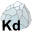 icon.

The following parameters dialog will appear:

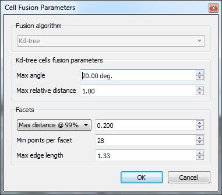

These parameters are used to conduct the fusion process of the small patches (to create the bigger facets):

**Kd-tree cells fusion parameters:**

- **Max angle**: maximum angle between neighbor patches (in degrees)
- **Max relative distance**: maximum distance between the merged patches and the current facet center

**Facets frame:**

- **Distance criterion**: this criterion is used to estimate whether a facet is still 'flat' enough after merging a new patch or not. For instance 'Max distance @ 99%' means that 99% of points have to be closer to the value specified in the field on the right (0.2 in the above example)
- **Min points per facet**: facets smaller than this value will be discarded
- **Max edge length**: parameter used to extract the facet (concave) contour (the smaller the closer to the points the contour should be)

After clicking on the 'OK' button, CloudCompare will first compute the kd-tree and then it will start the cell fusion process. This second process can be quite long depending on the parameters (especially if many small planar patches are merged in a single facet). However the more it goes the faster it is as there are less and less remaining patches.

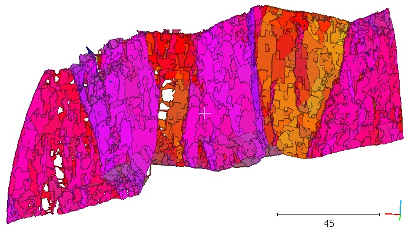

### Extract planar facets with a Fast Marching

This method resembles the previous one. The idea is once again to divide the input cloud in smaller patches and then to regroup them. This time the subdivision is systematic and not recursive. Therefore all the patches will have almost the same size but some may be very flat while others not (depending on the resolution). And the fusion process is based on a (Fast Marching) front propagation.

To use it, simply highlight the point cloud and click on the  icon.

The following parameters dialog will appear:

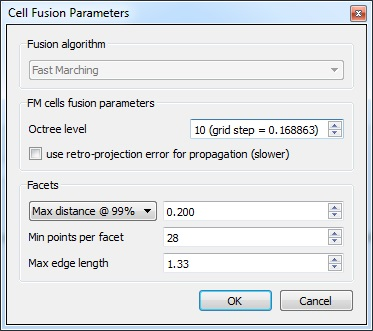

For the Fast Marching process two parameters can be set by the user:

- The **grid resolution** (expressed as the subdivision level of the cloud octree as we use the octree for a faster initialization)
- Whether to **re-compute the facet retro-projection error** each time a patch is merged (slower but more accurate)

The 'Facets' frame is the same as the previous algorithm (see above).

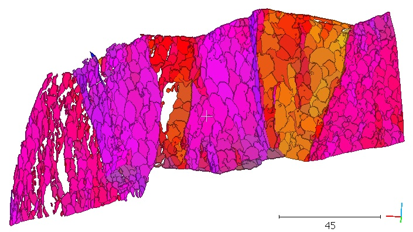

### Export facets as a SHP file

Once a set of facets has been generated, you can export it as a shape (SHP) file. Simply select the parent container and click on the  icon.

This will make a new dialog appear:

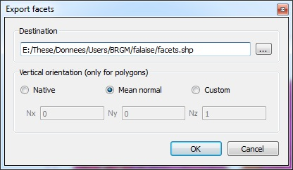

To export the facets to a SHP file, they will first be projected in 2D. To do this a projection direction ('vertical orientation') must be defined. This is the orientation of the 'vertical' vector in the 3D world. You can use:

- the native orientation (i.e. Z = (0,0,1))
- the mean facets normal
- a custom direction (which should be set in the 3 (Nx, Ny, Nz) fields below)

The resulting SHP file will be composed of 2D polygons. The associated DBF file will store various pieces of information for each facet:

- Index
- Center (X,Y,Z)
- Normal (X,Y,Z)
- Retro-projection error (RMS)
- Horiz_ext: horizontal extension
- Vert_ext: vertical extension
- Surf_ext: surface of the bounding rectangle (in the facet plane)
- Surface
- Dip direction
- Dip
- Family index (if any — see the Classification method below)
- Sub-family index (if any — see the Classification method below)

Here is an example of the SHP file imported in [QGis](http://www.qgis.org/):

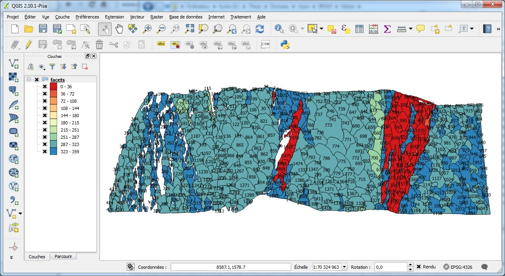

The colors of the polygons are based on their dip direction and the facets index is used as label.

### Export facets as a CSV file

Simply select the parent container of the generated facets and click on the  icon.

This function works almost the same as the SHP export one (see above). The only difference is that no polygon file will be generated. But the same information as in the DBF file will be saved in a CSV file.

### Facets classification

This tool lets you re-organize the generated facets in folders (families) and sub-folders (sub-families) based on their orientation and relative distance.

Select the parent container of the facets and then click on the  icon.

This will display a very simple dialog:

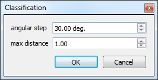

Simply choose:

- each family **angular range** (they will be regularly sampled starting from 0)
- and the maximum **orthogonal distance** between facets of a sub-family

Once validated, the facets will be regrouped in the DB tree (under the same parent container):

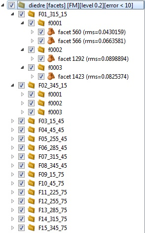

The facets will also be colored based on their family (instead of their dip/dip direction).

### Stereogram display

The last tool of the qFacets plugin is the stereogram/stereoplot display. To use it you can either select a group of facets or a cloud with normals. Then click on the  icon.

You will have first to define a few parameters for the stereogram plot:

- the angular step for the main sectors
- and the angular resolution (for both the dip and dip direction dimensions)

Then the true stereogram will appear:

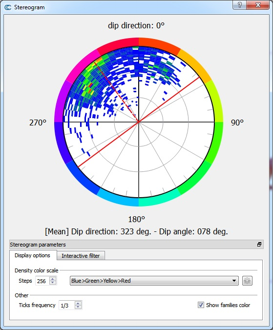

#### Display options

The first tab lets you set the display options:

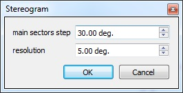

- the color ramp (type and number of steps) — this works just like the scalar fields color ramp
- the small ticks frequency (for each sector)
- and whether to display the families color around the stereogram or not

#### Interactive filter

The second tab lets you enable the 'interactive filter'. This filter will let you select an angular range along each dimension (dip and dip direction). Only the facets (or points) falling inside this corresponding section of the stereogram plot will be displayed. And this selection can be exported (as a new set of facets or a new point cloud depending on the input entity).

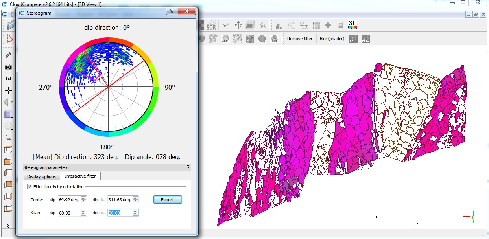

Notes:

- the current selection extents (delimited by red lines) can be re-centered by clicking directly on the stereogram plot
- when visually filtered, the facets polygon will be hidden but their contour will remain visible

## Command line

The plugin can be used via the command line (note that the stereogram option is not accessible via command line).

Here is the syntax:

```
-FACETS
  -EXTRACT_FACETS
    -ALGO {ALGO_KD_TREE|ALGO_FAST_MARCHING}
    -KD_TREE_FUSION_MAX_ANGLE_DEG {kd_tree_fusion_max_angle_deg}
    -KD_TREE_FUSION_MAX_RELATIVE_DISTANCE {kd_tree_fusion_max_relative_distance}
    -OCTREE_LEVEL {octree_level}
    -USE_RETRO_PROJECTION_ERROR
    -ERROR_MEASURE {RMS|MAX_DIST_68_PERCENT|MAX_DIST_95_PERCENT|MAX_DIST_99_PERCENT|MAX_DIST}
    -ERROR_MAX_PER_FACET {error_max_per_facet}
    -MIN_POINTS_PER_FACET {min_points_per_facet}
    -MAX_EDGE_LENGTH {max_edge_length}
  -CLASSIFY_FACETS_BY_ANGLE
    -CLASSIF_ANGLE_STEP {classif_angle_step}
    -CLASSIF_MAX_DIST {classif_max_dist}
  -EXPORT_FACETS
    -SHAPE_FILENAME {shape_filename}
    -USE_NATIVE_ORIENTATION
    -USE_GLOBAL_ORIENTATION
    -USE_CUSTOM_ORIENTATION {nX nY nZ}
  -EXPORT_FACETS_INFO
    -CSV_FILENAME {csv_filename}
    -COORDS_IN_CSV
```

### `-EXTRACT_FACETS`

**`-ALGO {ALGO_KD_TREE|ALGO_FAST_MARCHING}`** specifies which algorithm to use. Default is `ALGO_KD_TREE`.

`ALGO_KD_TREE` uses kd-tree:

- `-KD_TREE_FUSION_MAX_ANGLE_DEG {value}` default=20
- `-KD_TREE_FUSION_MAX_RELATIVE_DISTANCE {value}` default=1.0

`ALGO_FAST_MARCHING` uses fast marching:

- `-OCTREE_LEVEL {value}` default=8
- `-USE_RETRO_PROJECTION_ERROR` default=false

### `-CLASSIFY_FACETS_BY_ANGLE`

Groups the facets into angular groups. default=false

- `-CLASSIF_ANGLE_STEP {value}` default=30
- `-CLASSIF_MAX_DIST {value}` default=1.0

### `-EXPORT_FACETS`

Saves facet info including geometry to a shape file. default=false

- `-SHAPE_FILENAME {filename}` default='[name of cloud]_facets.shp'
- `-USE_NATIVE_ORIENTATION` default=true
- `-USE_GLOBAL_ORIENTATION` default=false
- `-USE_CUSTOM_ORIENTATION {nX nY nZ}` default=false, default nX nY nZ = 0.0 0.0 1.0

### `-EXPORT_FACETS_INFO`

Saves facet info to a CSV file (no geometry saved). default=false

- `-CSV_FILENAME {filename}`
- `-COORDS_IN_CSV` will add facet polyline coordinates to the csv file in WKT format `POLYGONZ(x1 y1 z1,x2 y2 z2,...,x1 y1 z1)`. default=false. If present then `-USE_NATIVE_ORIENTATION` etc. will apply.

### Example

```bash
ACloudViewer -O cloud.las -FACETS \
  -EXTRACT_FACETS -ALGO ALGO_KD_TREE \
  -KD_TREE_FUSION_MAX_ANGLE_DEG 20 -KD_TREE_FUSION_MAX_RELATIVE_DISTANCE 1.0 \
  -ERROR_MEASURE MAX_DIST_99_PERCENT -ERROR_MAX_PER_FACET 0.2 \
  -MIN_POINTS_PER_FACET 10 -MAX_EDGE_LENGTH 0.5 \
  -CLASSIFY_FACETS_BY_ANGLE -CLASSIF_ANGLE_STEP 30 -CLASSIF_MAX_DIST 1.0 \
  -EXPORT_FACETS -SHAPE_FILENAME output_facets.shp -USE_NATIVE_ORIENTATION \
  -EXPORT_FACETS_INFO -CSV_FILENAME output_facets.csv
```

## Build

```cmake
-DPLUGIN_STANDARD_QFACETS=ON
```

## References

- Dewez, T. J. B., Girardeau-Montaut, D., Allanic, C., and Rohmer, J., "FACETS: A CloudCompare Plugin to Extract Geological Planes from Unstructured 3D Point Clouds," *Int. Arch. Photogramm. Remote Sens. Spatial Inf. Sci.*, XLI-B5, 799-804, 2016.
- CloudCompare wiki: [Facets (plugin)](https://www.cloudcompare.org/doc/wiki/index.php/Facets_(plugin))
