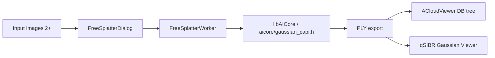
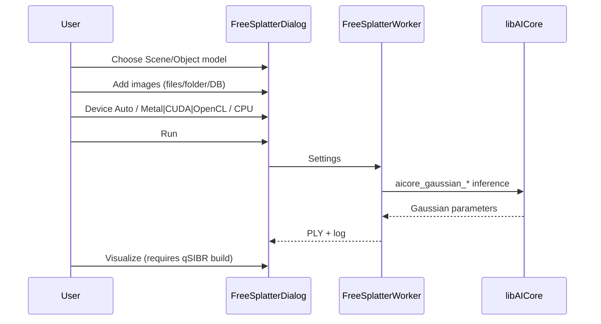

# qFreeSplatter — FreeSplatter 3D Gaussian Splatting


Turn ordinary photos into **3D Gaussian splatting** point clouds — no camera poses and no Python runtime. Inference on CPU / CUDA / OpenCL (Linux/Windows) or Metal / CUDA (macOS).

> **Build index:** see [plugins/README.md](../../README.md) (shares `libAICore.so` with qDA3).

User guide (Sphinx): [docs/guides/plugins/qFreeSplatter.md](../../../../docs/guides/plugins/qFreeSplatter.md)

---

## Overview

qFreeSplatter integrates the [FreeSplatter](https://github.com/TencentARC/FreeSplatter) network via [ggml](https://github.com/ggml-org/ggml) inside `libAICore.so`, exports **SIBR-compatible PLY**, and can launch the **qSIBR Gaussian Viewer** in one click.



---

## GUI workflow

**Menu:** Plugins → **FreeSplatter 3D Reconstruction**



| Step | Action | Notes |
|------|--------|-------|
| 1 | Choose **Model** | Scene (2 views) or Object (3+ views) |
| 2 | Select **GGUF model** | Six built-in variants; auto-download from GitHub Release on first use |
| 3 | **Add Images** | Files, folder, or DB tree selection |
| 4 | **Device** | `Auto` / `metal` (macOS) / `cuda` / `opencl` / `cpu` (Auto order below) |
| 5 | **Run** | Center-crop and resize to 512×512, then infer |
| 6 | **Export PLY** | Write PLY to disk; optional **Add to DB** |
| 6b | **Visualize (SIBR)** | Shown only when `PLUGIN_STANDARD_QSIBR=ON`; launches qSIBR |

### Inference device (Device)

| Option | Behavior |
|--------|----------|
| **Auto** | First compiled GPU backend by platform priority; CPU fallback |
| **GPU (Metal)** | Force Metal (macOS only) |
| **GPU (CUDA)** | Force ggml CUDA (`BUILD_CUDA_MODULE=ON`) |
| **GPU (OpenCL)** | Force OpenCL (Linux/Windows) |
| **CPU** | Force CPU |

**Auto priority (runtime):**

| Platform | Order |
|----------|-------|
| **macOS** | Metal → CUDA → CPU (OpenCL not built; Vulkan off by default) |
| **Linux / Windows** | CUDA → OpenCL → CPU (Vulkan off by default) |

`aicore_gaussian_warmup_backend` runs on the UI thread before **Run**; GPU failure falls back to CPU (same as qDA3). CLI: `--device` or `aicore_gaussian_options_set_device()` (`auto` / `cpu` / `cuda` / `opencl` / `metal`).

### Input constraints

| Model type | Minimum images | Typical use |
|------------|----------------|-------------|
| **Scene** | exactly **2** | Indoor / outdoor scenes |
| **Object** | **3** or more | Single-object reconstruction |

Optional: **Estimate poses** (PnP), **Opacity threshold**, Basic / Full PLY fields.

---

## Models

Models are cached automatically. Download source: [cloudViewer_downloads/3dgs](https://github.com/Asher-1/cloudViewer_downloads/releases/tag/3dgs).

See [models/MODEL_CARD.md](models/MODEL_CARD.md) for sizes and recommendations.

### Scene (2-view)

| File | Quant | Size |
|------|-------|------|
| `freesplatter-scene-f16.gguf` | F16 (recommended) | ~400 MB |
| `freesplatter-scene-f32.gguf` | F32 | ~800 MB |
| `freesplatter-scene-q8_0.gguf` | Q8_0 | ~200 MB |

### Object (3+ view)

| File | Quant | Size |
|------|-------|------|
| `freesplatter-object-f16.gguf` | F16 (recommended) | ~400 MB |
| `freesplatter-object-f32.gguf` | F32 | ~800 MB |
| `freesplatter-object-q8_0.gguf` | Q8_0 | ~200 MB |

---

## Build

```bash
cmake -B build_app \
  -DBUILD_GUI=ON \
  -DAICore_ENABLED=ON \
  -DPLUGIN_STANDARD_QFREESPLATTER=ON \
  -DPLUGIN_STANDARD_QSIBR=ON \
  ..

cmake --build build_app --target QFREESPLATTER_PLUGIN -j$(nproc)
```

| Option | Description |
|--------|-------------|
| `AICore_ENABLED` | Build `libAICore.so` (FreeSplatter + ggml) |
| `PLUGIN_STANDARD_QFREESPLATTER` | This plugin |
| `PLUGIN_STANDARD_QSIBR` | Optional; enables **Visualize (SIBR)** (runtime call, no static link) |
| `BUILD_CUDA_MODULE` | ggml CUDA backend (Linux/Windows NVIDIA) |
| `GGML_USE_OPENCL` | ON by default on Linux/Win when OpenCL 3.0 is detected; OFF on macOS |
| `GGML_USE_VULKAN` | OFF on all platforms; opt-in with `-DGGML_USE_VULKAN=ON` |
| `GGML_USE_METAL` | ON by default on Apple (primary GPU path on macOS) |

---

## Output format

### Per-pixel Gaussians (Scene, 23 channels)

| Channels | Field |
|----------|-------|
| 0–2 | xyz (OpenCV coordinates) |
| 3–14 | SH coefficients (degree 1) |
| 15 | opacity |
| 16–18 | scale |
| 19–22 | quaternion rotation |

### PLY (SIBR compatible)

- Position, SH DC + rest, opacity (logit), scale (log), rotation (quaternion)
- Coordinates converted to OpenGL (y up)

---

## Tests and CLI

### CMake toggles (off by default)

```bash
cmake -B build \
  -DAICore_ENABLED=ON \
  -DAICore_BUILD_TESTS=ON \
  -DPLUGIN_STANDARD_QFREESPLATTER=ON \
  -DPLUGIN_STANDARD_QFREESPLATTER_TOOLS=ON \
  ...
cmake --build build
```

Unit tests live under [`core/AICore/tests/gaussian/`](../../../../core/AICore/tests/gaussian/) (organized by capability, not plugin name). CLI: [`tools/free_splatter-cli.cpp`](tools/free_splatter-cli.cpp) (OpenCV image decode, same path as the plugin).

### Test tiers

| Binary | Label | Requires | Description |
|--------|-------|----------|-------------|
| `test_loader` | fast | no model | Synthetic GGUF KV round-trip |
| `test_graph_blocks` | fast | no model | ggml op golden pins |
| `test_image` | fast | no model | Untrusted image input validation |
| `test_pose` | fast | no model | Focal length / alignment / PnP math |
| `test_parity` | `model` | GGUF + fixtures | Layer-wise parity vs PyTorch reference |

**Fast gate (no model assets):**

```bash
ctest -LE model
# Binaries under build/bin/aicore_tests/
```

**Full parity (needs model + fixtures):**

```bash
export FREE_SPLATTER_GGUF=/path/to/freesplatter-scene-f16.gguf
export FREE_SPLATTER_FIXTURES=/path/to/scripts/fixtures
ctest -L model
```

Limit blocks with `FREE_SPLATTER_MAX_BLOCKS` to shorten `test_parity`.

---

## Performance (reference)

| Device | 2 views 512×512 F16 |
|--------|---------------------|
| GPU CUDA | ~0.1 s (GPU dependent) |
| GPU OpenCL | ~0.2 s |
| GPU Metal (macOS) | ~0.2 s |
| CPU 12 threads | ~14 s |

---

## qSIBR integration

1. Run FreeSplatter to produce a PLY
2. Click **Visualize**, or manually: Plugins → SIBR → **3D Gaussian Splatting Viewer**
3. Pass `--model-path` to the exported Gaussian directory / PLY

---

## References

- [FreeSplatter](https://github.com/TencentARC/FreeSplatter)
- [free-splatter.cpp](https://github.com/LocalAI-io/free-splatter.cpp)
- [ggml](https://github.com/ggml-org/ggml)
- [SIBR](https://sibr.gitlabpages.inria.fr/)

## License

Apache-2.0. Model weights from [TencentARC/FreeSplatter](https://github.com/TencentARC/FreeSplatter) (Apache-2.0).
