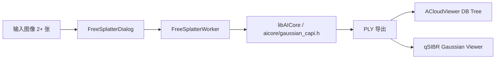
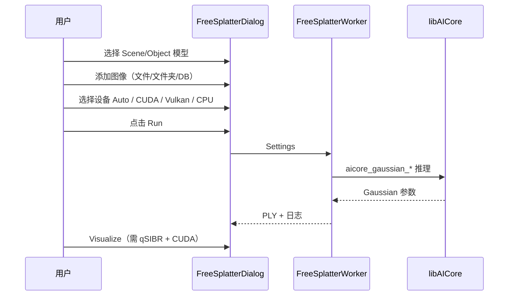

# qFreeSplatter — FreeSplatter 3D Gaussian Splatting


将普通照片转为 **3D Gaussian Splatting** 点云 — 无需相机位姿、无需 Python 运行时；支持 CPU / CUDA / OpenCL / Vulkan（Linux/Windows）或 Metal / Vulkan（macOS）推理。

> **构建索引：** 见 [plugins/README.md](../../README.md)（与 qDA3 共用 `libAICore.so`）。

---

## 概述

qFreeSplatter 集成 [FreeSplatter](https://github.com/TencentARC/FreeSplatter) 神经网络，通过 [ggml](https://github.com/ggml-org/ggml) 在 `libAICore.so` 内推理，导出 **SIBR 兼容 PLY**，并可选一键启动 **qSIBR Gaussian Viewer**。



---

## GUI 使用步骤

**菜单：** Plugins → **FreeSplatter 3D Reconstruction**



| 步骤 | 操作 | 说明 |
|------|------|------|
| 1 | 选择 **Model** | Scene（2 视图场景）或 Object（3+ 视图物体） |
| 2 | 选择 **GGUF 模型** | 内置 6 款；首次使用可自动从 GitHub Release 下载 |
| 3 | **Add Images** | 文件、文件夹，或从 DB Tree 选图 |
| 4 | **Device** | `Auto` / `cuda` / `vulkan` / `cpu`（Auto 顺序见下表） |
| 5 | **Run** | 中心裁剪并缩放到 512×512 后推理 |
| 6 | **Export PLY** | 写入 PLY 到磁盘；可选 Add to DB |
| 6b | **Visualize (SIBR)** | 仅当构建时 `PLUGIN_STANDARD_QSIBR=ON` 显示；一键启动 qSIBR |

### 推理设备（Device）

| 选项 | 行为 |
|------|------|
| **Auto** | 按平台优先级选择已编译 GPU 后端，失败则 CPU |
| **GPU (CUDA)** | 强制 ggml CUDA（需 `BUILD_CUDA_MODULE=ON`） |
| **GPU (Vulkan)** | 强制 Vulkan |
| **CPU** | 强制 CPU |

**Auto 优先级（运行时）：**

| 平台 | 顺序 |
|------|------|
| **Linux / Windows** | CUDA → OpenCL → Vulkan → CPU |
| **macOS** | Metal → Vulkan → CUDA → CPU（不编译 OpenCL） |

Run 前在 UI 线程调用 `aicore_gaussian_warmup_backend`；GPU 不可用时自动回退 CPU（与 qDA3 行为一致）。CLI 可用 `--device` 或 `aicore_gaussian_options_set_device()`（`auto` / `cpu` / `cuda` / `vulkan` / `opencl` / `metal`）。

### 输入约束

| 模型类型 | 最少图像数 | 典型用途 |
|----------|------------|----------|
| **Scene** | 恰好 **2** 张 | 室内 / 室外场景 |
| **Object** | **3** 张及以上 | 物体重建 |

可选：**Estimate poses**（PnP 位姿估计）、**Opacity threshold**、导出字段 Basic / Full。

---

## 模型

模型自动缓存；下载源：[cloudViewer_downloads/3dgs](https://github.com/Asher-1/cloudViewer_downloads/releases/tag/3dgs)。

### Scene（2-view）

| 文件 | 精度 | 大小 |
|------|------|------|
| `freesplatter-scene-f16.gguf` | F16（推荐） | ~400 MB |
| `freesplatter-scene-f32.gguf` | F32 | ~800 MB |
| `freesplatter-scene-q8_0.gguf` | Q8_0 | ~200 MB |

### Object（3+ view）

| 文件 | 精度 | 大小 |
|------|------|------|
| `freesplatter-object-f16.gguf` | F16（推荐） | ~400 MB |
| `freesplatter-object-f32.gguf` | F32 | ~800 MB |
| `freesplatter-object-q8_0.gguf` | Q8_0 | ~200 MB |

---

## 构建

```bash
cmake -B build_app \
  -DBUILD_GUI=ON \
  -DAICore_ENABLED=ON \
  -DPLUGIN_STANDARD_QFREESPLATTER=ON \
  -DPLUGIN_STANDARD_QSIBR=ON \
  ..

cmake --build build_app --target QFREESPLATTER_PLUGIN -j$(nproc)
```

| 选项 | 说明 |
|------|------|
| `AICore_ENABLED` | 构建 `libAICore.so`（含 FreeSplatter + ggml） |
| `PLUGIN_STANDARD_QFREESPLATTER` | 本插件 |
| `PLUGIN_STANDARD_QSIBR` | 可选；开启后编译 **Visualize (SIBR)** 按钮（无链接依赖，运行时调用 qSIBR） |
| `BUILD_CUDA_MODULE` | ggml CUDA 后端（Linux/Windows NVIDIA 加速） |
| `GGML_USE_OPENCL` | Linux/Win 默认 ON，自动检测 OpenCL 3.0；macOS 默认 OFF |
| `GGML_USE_VULKAN` | Apple 默认 ON，其他平台默认 OFF；可 `-DGGML_USE_VULKAN=ON` 手动开启 |
| `GGML_USE_METAL` | Apple 默认 ON（macOS 主 GPU 路径） |

---

## 输出格式

### 每像素 Gaussian（Scene，23 通道）

| 通道 | 字段 |
|------|------|
| 0–2 | xyz（OpenCV 坐标系） |
| 3–14 | SH 系数（degree 1） |
| 15 | opacity |
| 16–18 | scale |
| 19–22 | 四元数 rotation |

### PLY（SIBR 兼容）

- 位置、SH DC + rest、opacity（logit）、scale（log）、rotation（四元数）
- 坐标系转换为 OpenGL（y 向上）

---

## 测试与 CLI

### CMake 开关（默认关闭）

```bash
cmake -B build \
  -DAICore_ENABLED=ON \
  -DAICore_BUILD_TESTS=ON \                    # FreeSplatter 白盒单元测试 → core/AICore/tests/
  -DPLUGIN_STANDARD_QFREESPLATTER=ON \
  -DPLUGIN_STANDARD_QFREESPLATTER_TOOLS=ON \   # free_splatter-cli（需 BUILD_OPENCV=ON）
  ...
cmake --build build
```

单元测试位于 [`core/AICore/tests/gaussian/`](../../../../core/AICore/tests/gaussian/)（按 **能力模块** 组织，非插件名）。CLI 位于 [`tools/free_splatter-cli.cpp`](tools/free_splatter-cli.cpp)（图像解码使用 OpenCV，与 AICore 插件路径一致）。

### 测试分层

| 可执行文件 | 标签 | 依赖 | 说明 |
|------------|------|------|------|
| `test_loader` | 快速 | 无模型 | 合成 GGUF KV 往返 |
| `test_graph_blocks` | 快速 | 无模型 | ggml 算子 golden pin |
| `test_image` | 快速 | 无模型 | 非信任图像输入校验 |
| `test_pose` | 快速 | 无模型 | 焦距 / 对齐 / PnP 数学 |
| `test_parity` | `model` | GGUF + fixtures | 与 PyTorch 参考逐层 parity |

**快速门禁（无模型资产）：**

```bash
ctest -LE model   # 仅运行 test_loader / test_graph_blocks / test_image / test_pose
# 可执行文件在 build/bin/aicore_tests/
```

**完整 parity（需模型与 fixture）：**

```bash
export FREE_SPLATTER_GGUF=/path/to/freesplatter-scene-f16.gguf
export FREE_SPLATTER_FIXTURES=/path/to/scripts/fixtures
ctest -L model
```

`test_parity` 可通过 `FREE_SPLATTER_MAX_BLOCKS` 限制 block 数以缩短耗时。

---

## 性能参考

| 设备 | 2 视图 512×512 F16 |
|------|---------------------|
| GPU CUDA | ~0.1 s（视 GPU 而定） |
| GPU OpenCL / Vulkan | ~0.2 s |
| GPU Metal（macOS） | ~0.2 s |
| CPU 12 线程 | ~14 s |

---

## 与 qSIBR 联动

1. 运行 FreeSplatter 得到 PLY
2. 点击 **Visualize** 或手动：Plugins → SIBR → **3D Gaussian Splatting Viewer**
3. 指定 `--model-path` 指向导出的 Gaussian 目录 / PLY

---

## References

- [FreeSplatter](https://github.com/TencentARC/FreeSplatter)
- [free-splatter.cpp](https://github.com/LocalAI-io/free-splatter.cpp)
- [ggml](https://github.com/ggml-org/ggml)
- [SIBR](https://sibr.gitlabpages.inria.fr/)

## License

Apache-2.0。模型权重源自 [TencentARC/FreeSplatter](https://github.com/TencentARC/FreeSplatter)（Apache-2.0）。
