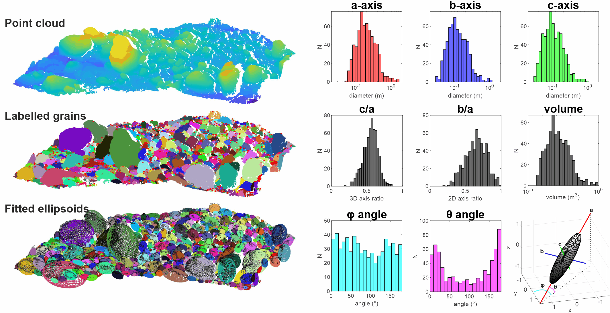

# G3Point (plugin) — Grain Size Analysis

## Introduction

**G3Point** performs **3D grain size measurement** on point clouds representing **gravel / cobble surfaces**: it segments grains, merges and cleans regions, then fits simple geometric models (e.g. ellipsoids) for size and shape analysis.

Official project page: [G3Point — Université de Rennes](https://lidar.univ-rennes.fr/en/g3point).

## Usage/Algorithm

The pipeline follows the published G3Point approach: local neighbourhood analysis, watershed-style segmentation, post-processing, and optional export of fitted ellipsoids for granulometry and orientation statistics.

## Parameters

| Option | Role |
|--------|------|
| `-MAX_RADIUS` | Upper search radius |
| `-MIN_RADIUS` | Lower search radius |
| `-N_NEIGHBORS` | Number of neighbours |
| `-EXPORT_ELLIPSOIDS` | Export fitted ellipsoids when supported in batch mode |

## Screenshots



## ACloudViewer CLI

```bash
ACloudViewer -SILENT -O grains.las -G3POINT -MAX_RADIUS 2 -MIN_RADIUS 0 -N_NEIGHBORS 30 -EXPORT_ELLIPSOIDS -AUTO_SAVE ON -SAVE_CLOUDS
```

## Build

```bash
-DPLUGIN_STANDARD_G3POINT=ON
```

## Dependencies

- **Eigen3**, **nanoflann**, **QCustomPlot** (as required by the plugin).

## References

- [G3Point — Université de Rennes](https://lidar.univ-rennes.fr/en/g3point)
- Method lineage: Steer, Guerit et al.; see project page and publications linked there.
