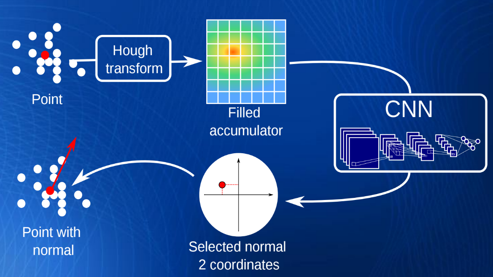

# HoughNormals (plugin)

## Introduction

This plugin applies to a point cloud the algorithm "Normal Estimation in Unstructured Point Clouds with Hough transform" by A. Boulch and R. Marlet (see [original code](https://github.com/aboulch/normals_Hough)).

The algorithm is called 'as is'. Users should refer to the article for the parameters (slides are [here](http://imagine.enpc.fr/~marletr/publi/SGP-2016-Boulch-Marlet_slides.pdf)).



## ACloudViewer CLI

```bash
ACloudViewer -SILENT -O cloud.ply -HOUGH_NORMALS [OPTIONS] -SAVE_CLOUDS
```

| Token | Type | Description |
|-------|------|-------------|
| `-HOUGH_NORMALS` | command | Run Hough-based normal estimation |
| `-K` | int | Number of neighbors |
| `-T` | int | Number of random triplets |
| `-N_PHI` | int | Number of bins for azimuth in the Hough accumulator |
| `-N_ROT` | int | Number of rotation steps |
| `-TOL_ANGLE_RAD` | float | Angular tolerance (radians) |
| `-K_DENSITY` | int | Neighbors for density estimation |
| `-USE_DENSITY` | flag | Use density weighting |

### Example

```bash
ACloudViewer -SILENT -O cloud.ply -HOUGH_NORMALS -K 100 -T 1000 -SAVE_CLOUDS
```

## Build

```cmake
-DPLUGIN_STANDARD_QHOUGH_NORMALS=ON
```

## References

- A. Boulch, R. Marlet, "Deep Learning for Robust Normal Estimation in Unstructured Point Clouds," *SGP*, 2016.
- Original code: [github.com/aboulch/normals_Hough](https://github.com/aboulch/normals_Hough)
- CloudCompare wiki: [HoughNormals (plugin)](https://www.cloudcompare.org/doc/wiki/index.php/HoughNormals_(plugin))
