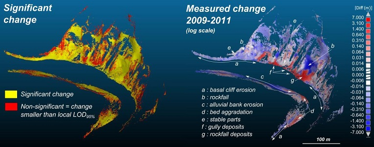
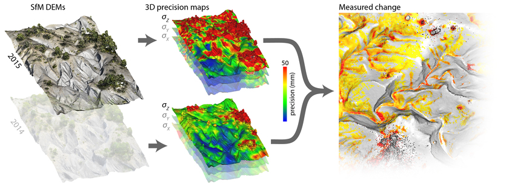
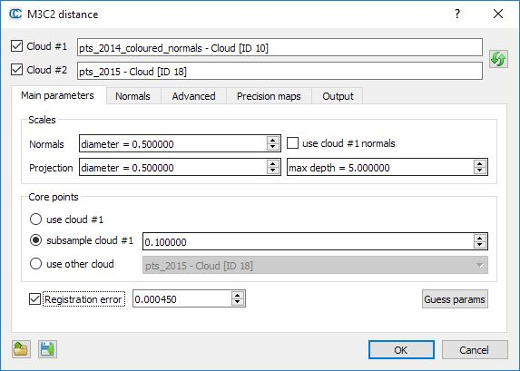
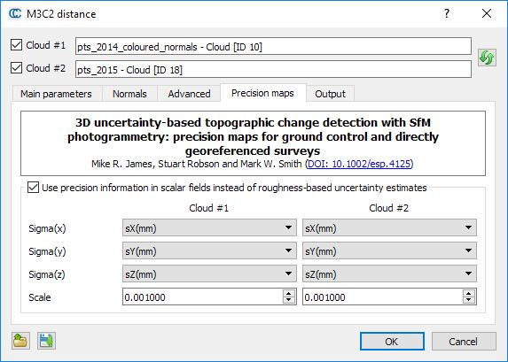
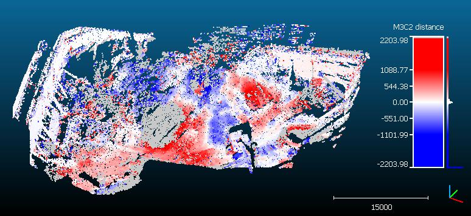

# M3C2 (plugin)

## Introduction

The M3C2 plugin is the unique way to compute signed (and robust) distances directly between two point clouds.

While you can use the 'Guess params' button, it is highly advised to read (even quickly) the original [article](https://arxiv.org/pdf/1302.1183) by D. Lague, N. Brodu and J. Leroux (Geosciences Rennes).

### Precision Maps

The M3C2 plugin also includes the 'precision maps' (M3C2-PM) variant of [James et al. (2017)](http://dx.doi.org/10.1002/esp.4125), for when precision estimates are already available for each point, and don't need to be calculated from roughness estimates. M3C2-PM is particularly suited to point clouds generated by photogrammetric processing; see the dedicated section below and [James et al. (2017)](http://dx.doi.org/10.1002/esp.4125) for more details.





## Computing M3C2 distances

Select the two clouds you want to compare then call the 'Plugins > M3C2 Distance' method.

### Main parameters

As with the [CANUPO](https://www.cloudcompare.org/doc/wiki/index.php/CANUPO_(plugin)) algorithm, computations can only be done on particular points — called **core points** — in order to speed up the computations. The main idea is that while TLS clouds are generally very dense, it is not necessary to measure the distance at such a high density (and it would be very slow in practice). This is why the user has to choose what 'core points' will be used (lower part of the dialog):

- either the whole cloud
- or a sub-sampled version of the input cloud
- or eventually a custom set of core points (typically a previously sub-sampled version of the input cloud, or a rasterized version)



The other important parameters are the **normal** and **projection** scales:

- The **normal scale** is the diameter of the spherical neighborhood extracted around each core point to compute a local normal. This normal is used to orient a cylinder inside which equivalent points in the other cloud will be searched for. Regarding normals more advanced options can be set in the 'Normals' tab (see below).
- The **projection scale** is the diameter of the above cylinder.
- The **max depth** parameter simply corresponds to the cylinder height (in both directions).

Note: the bigger those radii are, the less local surface roughness (and noise) will have an influence. But also the more points will be 'averaged' and the slower the computation will be.

Eventually, if you know the global registration error (if your cloud has been generated by registering several stations typically) you can input it in the 'registration error' field. It will be taken into account during the confidence computation for each point (that lets you know if the corresponding displacement is significant or not).

### Normals

Using 'clean' normals is very important in M3C2. The second tab lets you specify more advanced options regarding their computation:

- **Default**: the normals are computed thanks to the normal scale parameters defined in the previous tab
- **Multi-scale**: for each core point, normals are computed at several scales and the most 'flat' is used
- **Vertical**: no normal computation is done, only purely vertical normals are used (perfect for 2D problems)
- **Horizontal**: normals are 'constrained' in the (XY) plane

Alternatively you can also use the cloud's original normals (if any) by checking the "use cloud #1 normals" checkbox on the first tab.

The 'orientation' options let you help the plugin to properly orient the normals:

- either by specifying a global orientation (relatively to a given axis or a particular point)
- or by specifying a cloud containing all the sensor positions

### Precision maps



The Precision maps tab enables the calculation of detectable change to be carried out using measurement precision values stored in scalar fields of point clouds, rather than being estimated from roughness calculations.

This 'PM' variant of M3C2 is described in [James et al. (2017)](http://dx.doi.org/10.1002/esp.4125) and allows photogrammetric precision estimates to be used directly within the M3C2 workflow.

If scalar fields are available, then the check box can be used to enable the 'precision maps' variant of M3C2. In this case, uncertainty estimates will no longer be made from roughness estimates at the projection scale in the Main Parameters tab, but will be based on 3-D point precision estimates stored in scalar fields. Ensure that the appropriate scalar fields are selected for both point clouds to describe measurement precision in X, Y and Z (sigmaX, sigmaY and sigmaZ).

The scale can be changed if the precision values are in different units to the point coordinates. For example, if point coordinates and precision values are in metres, then the scale value is 1.000. However, if coordinates are in metres, but the scalar fields of precision are provided in millimetres, then the scale value should be set to 0.001.

### Advanced

The 'Advanced' tab contains... advanced parameters. Their name should speak for themselves. They can be ignored by most users.

### Output

You can choose to generate additional scalar fields and also on which cloud the measurements should be re-projected (especially useful if you use core points different from the first input cloud).

### Save/load parameters

Parameters can be saved (and re-loaded) via dedicated text files. Use the two icons on the bottom-left part of the dialog to do this.

### Computing distance

When ready, simply click on the "OK" button. Once finished, the dialog will be closed. You will generally have to hide the input clouds to see the result (generated in a new cloud).

Note that in addition to the distances, the M3C2 plugin generates several other scalar fields:

- **distance uncertainty** (the closer to zero the better)
- **change significance** (whether the distance probably corresponds to a real change or not)
- and optionally the **standard deviation** and **number of neighbors** at each core point (as specified in the 'output' tab)

Note also that points without any corresponding points in the other cloud stay in 'gray' (they are associated to NaN — not a number — distances). This means that no points in the other cloud could be found inside the search cylinder. Therefore, gray points means that either some parts of the clouds have no equivalent in the other cloud (due to hidden parts or other holes in the datasets) or simply that the cylinder maximum length is not long enough!



## Command line

The M3C2 plugin can be called via the command line.

Basically, you need to load at least 2 clouds (if a 3rd cloud is present, it will be used as core points). Then call the `-M3C2` command with a M3C2 parameters file as argument. This file can be saved via the dialog of the standard version. It should then be easy to update to your needs.

```bash
ACloudViewer -O cloud1.las -O cloud2.las (-O core_points.las) -M3C2 parameters_file.txt
```

## Build

```cmake
-DPLUGIN_STANDARD_QM3C2=ON
```

## References

- D. Lague, N. Brodu, J. Leroux, "Accurate 3D comparison of complex topography with terrestrial laser scanner: Application to the Rangitikei canyon (N-Z)," *ISPRS J. Photogramm.*, 2013. [arXiv:1302.1183](https://arxiv.org/abs/1302.1183)
- M. R. James, S. Robson, M. W. Smith, "3-D uncertainty-based topographic change detection with structure-from-motion photogrammetry: precision maps for ground control and directly georeferenced surveys," *Earth Surf. Process. Landforms*, 2017.
- CloudCompare wiki: [M3C2 (plugin)](https://www.cloudcompare.org/doc/wiki/index.php/M3C2_(plugin))
