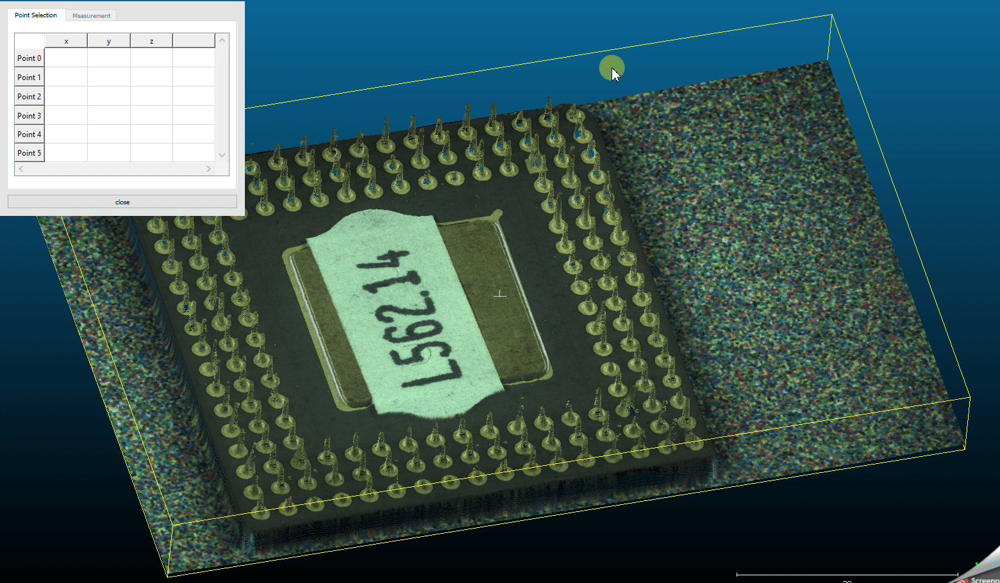
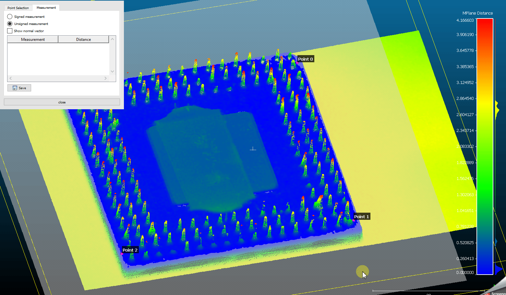
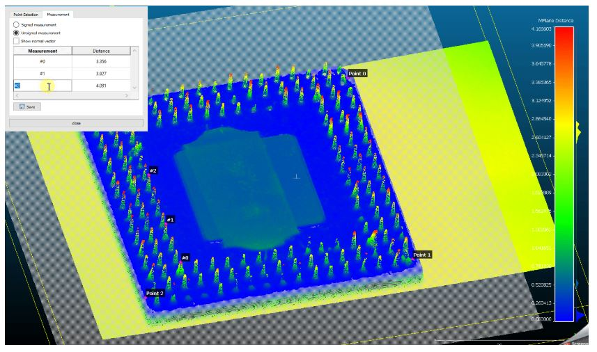

# MPlane (plugin)

MPlane is a plugin for CloudCompare to perform normal distance measurements against a defined plane.

## Basic workflow

(See the [github page](https://github.com/hvs-ait/mplane-plugin) for an animated workflow)

1. **Fit a plane** through a point cloud by selecting at minimum 3 reference points. A scalar field for visualizing the normal distance is created and applied automatically.



2. **Perform normal distance measurements** against the plane.



3. **Save measurements** as a .csv file.

| CSV Header | Explanation |
|------------|-------------|
| measurement | The name of the measurement point |
| x-coord | x coordinate of the measurement point |
| y-coord | y coordinate of the measurement point |
| z-coord | z coordinate of the measurement point |
| distance | Normal distance from the measurement point to the plane |



## Copyright

AIT Austrian Institute of Technology GmbH — [https://www.ait.ac.at/](https://www.ait.ac.at/)

## ACloudViewer CLI

```bash
ACloudViewer -SILENT -O cloud.ply -MPLANE [OPTIONS] -SAVE_CLOUDS
```

| Token | Type | Description |
|-------|------|-------------|
| `-MPLANE` | command | Run MPlane distance computation |
| `-NX` | float | Plane normal X component |
| `-NY` | float | Plane normal Y component |
| `-NZ` | float | Plane normal Z component |
| `-D` | float | Plane equation constant (ax+by+cz+d=0) |

### Example

```bash
ACloudViewer -SILENT -O facade.ply -MPLANE -NX 0 -NY 0 -NZ 1 -D -5.0 -SAVE_CLOUDS
```

## Build

```cmake
-DPLUGIN_STANDARD_QMPLANE=ON
```

## References

- GitHub: [hvs-ait/mplane-plugin](https://github.com/hvs-ait/mplane-plugin)
- CloudCompare wiki: [MPlane (plugin)](https://www.cloudcompare.org/doc/wiki/index.php/MPlane_(plugin))
