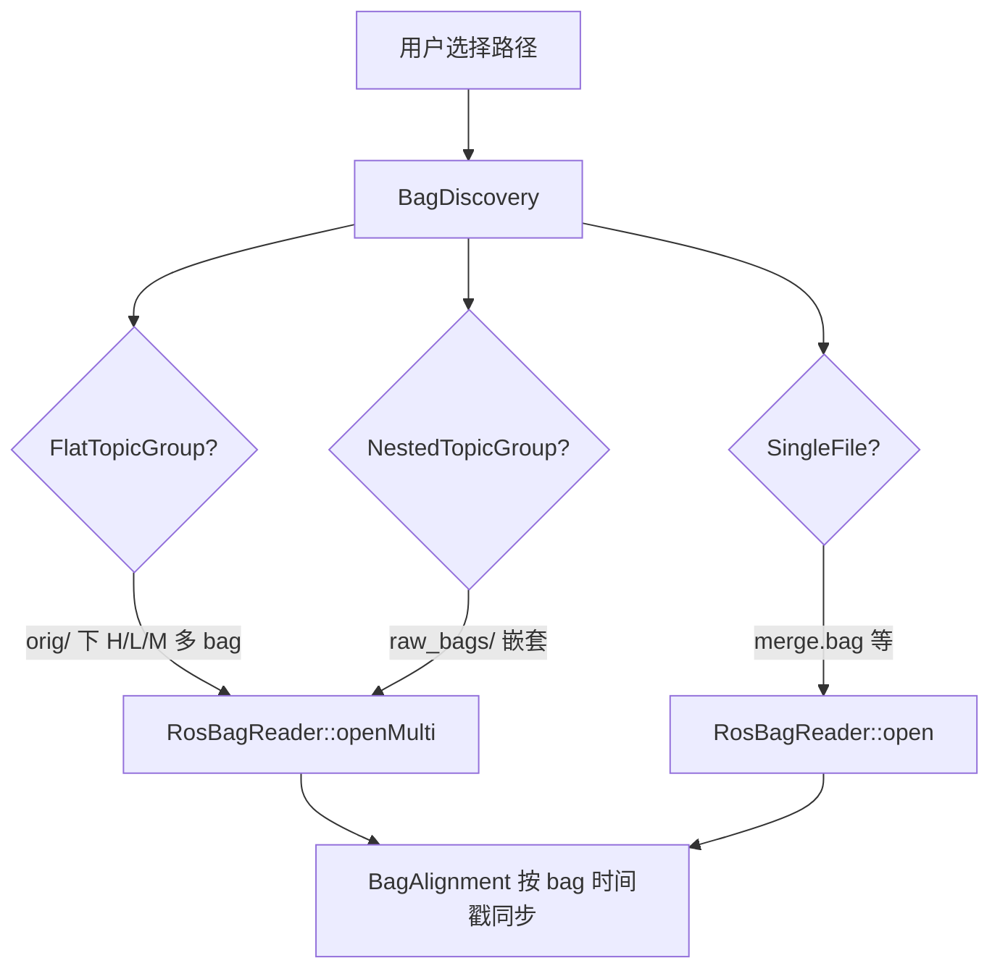

# qManualCalib — Manual Calibration Tools


ACloudViewer 插件，提供**手动传感器外参标定**与 **AVM（环视）视图调整**两大功能，面向自动驾驶 EOL / 在线标定工作流。

> **构建索引：** 见 [plugins/README.md](../../README.md)。

---

## 功能概览

| 模块 | 菜单入口 | 图标 | 用途 |
|------|----------|------|------|
| **Manual Sensor Calibration** | Plugins → Manual Calibration Tools → Sensor Calibration | `sensorCalibIcon.svg` | 相机 / LiDAR 6-DOF 外参微调、BEV、点云投影 |
| **AVM View Adjustment** | Plugins → Manual Calibration Tools → AVM Adjustment | `avmAdjustIcon.svg` | 环视 remap 参数实时调整 |

---

## 快速开始（Sensor Calibration）


1. **Load Config**：选择含 `cameras.cfg`（及可选 `lidars.cfg`、`ground.cfg`）的目录。
2. **Load Bag**：选择 `.bag` 文件或 bag **目录**（支持多 bag 自动发现，见下文）。
3. 选择传感器类型、名称、标定模式（single / all / avm / svm）。
4. 选择视图模式（BEV / LiDAR Proj / Single Frame），拖动滑动条浏览不同时间帧。
5. 用 Roll/Pitch/Yaw/X/Y/Z 微调外参；满意后 **Save Config** 或导出图像 / 点云。

**内置测试数据（无需自备 bag）：**

完整体积与性能说明见 **[`tests/data/DATA_CARD.md`](tests/data/DATA_CARD.md)**（数据随源码集成，无需额外下载）。

| 项 | 路径 |
|----|------|
| 配置 | `tests/data/configs/` |
| 对齐切片 bag | `tests/data/bags/sample_aligned.bag`（**24.3 MB**，~0.6 s，3 组 BEV 对齐帧） |

详见 [`tests/data/README.md`](tests/data/README.md)（切片与重新生成说明）。

---

## Module 1: Manual Sensor Extrinsic Calibration

### 核心能力

- **6-DOF 调整**：Roll / Pitch / Yaw / X / Y / Z 独立微调，步长 0.001–0.1（度/米）
- **Bird's Eye View (BEV)**：多相机俯视图拼接，重叠区距离变换加权融合
- **BEV Remap 后端**：UI 可选 Auto / CUDA / OpenCL / CPU
- **LiDAR-Camera Fusion**：点云投影到相机图像，深度着色
- **四种视图模式**：

| 模式 | 显示 | 主要控件 |
|------|------|----------|
| **BEV** | 2D 鸟瞰拼接 | BEV 后端、左键两点测距、空悬状态 |
| **LiDAR Projection** | 2D 点云投影 | 距离过滤、LiDAR 多选 |
| **Single Frame** | 3D 单帧点云 | 地面高度过滤、LiDAR 多选 |
| **Multi Frame** | — | 尚未实现（与原版 stub 一致） |

- **导出**：Export Image / Export PCD / Export BEV（批量）/ Save Config（`cameras_fix.cfg`、`lidars_fix.cfg`）
- **ROS Bag**：自研 bag v2.0 解析（`MCALIB_CALIB_IO`），BZ2 / LZ4 压缩
- **多 bag 与时间同步**：Flat / Nested / SingleFile 布局自动发现；图像 / 点云 / 车辆状态按 bag 时间轴对齐
- **HEVC / H.264 在线相机**：FFmpeg 顺序解码（`MCALIB_WITH_FFMPEG_SUPPORT`）
- **异步滑动条**：后台索引 + debounce + `QtConcurrent`

### ROS Bag 加载方式

**Load Bag** 支持两种方式：

- **Bag file…**：单个 `.bag`
- **Bag directory…**：目录内自动发现会话与 topic 分组



| 布局 | 典型目录 | 行为 |
|------|----------|------|
| **SingleFile** | `bags/`（含 `merge.bag`） | 打开单个合并 bag |
| **FlatTopicGroup** | `bags/orig/`（Heavy / Light / Medium 并列） | `openMulti` 多 bag 时间对齐 |
| **NestedTopicGroup** | `raw_bags/` 等嵌套结构 | 按 session 选组后 `openMulti` |
| **LegacyMultiBag** | 旧式多文件目录 | 兼容打开 |

多 session 时会弹出 **Select Bag Session** 对话框；默认选中最新 session。

**在线 HEVC 数据（如 YR_VF6）：**

- 相机 topic 为 `format=hevc` 的 NAL 流，非 JPEG
- 需启用 FFmpeg；解码状态在 `RosBagReader::videoDecodeCache()` 中持久化
- proto 内嵌时间戳与 bag 记录时间可能相差数年 → 同步逻辑在差值 > 60s 时**改用 bag 记录时间**

推荐路径示例：

```text
/home/.../YR_VF6_1_online/bags/orig/     # 多 bag（相机 + pose + 点云）
/home/.../YR_VF6_1_online/bags/        # 自动优先 merge.bag
```

### Sensor Calibration 详细流程

```
1. Load Config     → cameras.cfg / lidars.cfg / ground.cfg
2. Load Bag        → 文件或目录；等待后台时间索引
3. 传感器选择      → Camera/Lidar + 名称 + single/all/avm/svm
4. 视图模式        → BEV / LiDAR Proj / Single Frame
5. 6-DOF 调整      → ± 按钮 + 速度档位
6. 时间滑动条      → 0–100% bag 时长；图像与点云异步刷新（不累加历史帧）
7. 导出
   Save Config     → *_fix.cfg
   Export Image    → 当前 2D 视图 → DB Tree
   Export PCD      → 当前点云 → DB Tree
   Export BEV      → 批量 SVM/AVM BEV JPG
```

**快捷键（BEV）：** `[` / `]` 调节虚拟焦距（点大小滑条）。

Single Frame 切换时自动进入 3D 视图并 zoom-to-fit。

---

## Module 2: AVM View Adjustment


- **三种模式**：`small_single_view`、`large_single_view`、`wheel_hub_view`
- **14 项参数**：虚拟 K2、缩放、V0 偏移、输出尺寸、焦距、旋转角、裁剪矩形等
- **四路全景**：`panoramic_1` – `panoramic_4`（`panoramic_3` 大视图模式自动翻转焦距符号）
- **Bag 滑动条**：与 Sensor Calib 相同的异步加载

---

## CLI Tools（可选）

详见 [`tools/README.md`](tools/README.md)。

| 目标 | 说明 |
|------|------|
| `mcalib_export_bev` | 无头批量导出 BEV |
| `mcalib_rosbag2image` | bag → JPG |
| `mcalib_rosbag2pcd` | bag → 二进制 PCD |
| `mcalib_rosbag_merge` | 合并多个 bag |
| `mcalib_rosbag_slice` | 时间切片 / 多帧对齐合并 |
| `mcalib_extrinsic_compare` | 外参对比 |
| `mcalib_static_aruco_detect` | ArUco 检测 |
| `mcalib_static_chessboard_detect` | 棋盘格检测 |

---

## 架构

```
qManualCalib/
├── calib_io/          # MCALIB_CALIB_IO — bag / proto / 对齐 / 相机模型
├── bev_stitch/        # MCALIB_BEV_STITCH — BEV remap + alpha fusion
├── include/ / src/    # 插件 UI
├── tools/             # 可选 CLI（MCALIB_BUILD_TOOLS）
├── tests/             # test_bag_reader（MCALIB_BUILD_TESTS）
└── tests/data/        # 示例 config + sample_aligned.bag
```

```
QMANUAL_CALIB_PLUGIN
    ├── MCALIB_BEV_STITCH → MCALIB_CALIB_IO
    └── MCALIB_CALIB_IO   → OpenCV, Eigen3, CVCoreLib, FFmpeg(可选)
```

---

## 构建

### 插件（默认）

```bash
cmake -B build_app \
  -DBUILD_GUI=ON \
  -DBUILD_OPENCV=ON \
  -DPLUGIN_STANDARD_QMANUAL_CALIB=ON \
  ..

cmake --build build_app --target QMANUAL_CALIB_PLUGIN -j$(nproc)
```

产物：`build_app/bin/plugins/libQMANUAL_CALIB_PLUGIN.so`（Linux）。

### CMake 选项

| 选项 | 默认 | 说明 |
|------|------|------|
| `PLUGIN_STANDARD_QMANUAL_CALIB` | OFF | 构建插件 |
| `MCALIB_WITH_FFMPEG_SUPPORT` | ON | H.264/HEVC 解码（需系统 FFmpeg） |
| `MCALIB_BUILD_TESTS` | OFF | 构建 `test_bag_reader` |
| `MCALIB_BUILD_TOOLS` | OFF | 构建 `tools/` CLI |
| `MCALIB_BEV_CUDA` | ON（有 CUDA） | BEV CUDA remap |
| `MCALIB_BEV_OPENCL` | ON | BEV OpenCL remap |

启用插件时 OpenCV 会额外编译 `calib3d`、`objdetect`（ArUco）。

---

## 测试

### 构建

```bash
cmake -B build_app \
  -DPLUGIN_STANDARD_QMANUAL_CALIB=ON \
  -DMCALIB_BUILD_TESTS=ON \
  -DBUILD_OPENCV=ON \
  ..

cmake --build build_app --target test_bag_reader -j$(nproc)
```

### 运行

```bash
./build_app/bin/plugins/test_bag_reader
```

测试数据目录由编译宏 `MCALIB_TEST_DATA_DIR` 注入（默认 `plugins/.../tests/data`）。

### 用例说明

| 用例 | 验证内容 |
|------|----------|
| `test_open_and_duration` | 打开 `sample_aligned.bag`，时长与时间戳合理 |
| `test_topic_listing` | topic 枚举，相机 / 点云 topic 存在 |
| `test_read_camera_message_perf` | `readMessageAtPercent(50%)` 性能与数据非空 |
| `test_read_with_time_filter` | 1s 时间窗过滤读消息 |
| `test_multiple_reads_perf` | 多相机并行读取 |
| `test_church_header_strip` | Church 包头剥离 |
| `test_proto_decode_image` | CompressedImage protobuf → OpenCV 图像 |
| `test_proto_decode_pointcloud` | PointCloud2 protobuf → 点云反组合 |
| `test_bev_blend_weights` | BEV alpha 融合权重 |
| `test_bev_group_sync` | SVM+AVM 分组对齐 @10/50/90% |
| `test_bev_proto_sync_long_bag` | 长 bag proto 时间轴对齐 |
| `test_lidar_group_cloud_sync` | LiDAR 分组与图像 ref 点云同步 |
| `test_bag_discovery_topic_group_key` | topic 分组 session key 解析 |
| `test_bag_discovery_real_layouts` | Flat / Nested 目录发现 |
| `test_open_multi_topic_group` | `openMulti` 多 bag 读取 |
| `test_merged_single_bag_file` | 单文件 merge bag topic 完整性 |
| `test_yr_vf6_hevc_multi_bag` | YR_VF6 `bags/orig` HEVC 多 bag 对齐解码（本地有数据时运行） |
| `test_yr_vf6_hevc_merge_bag` | YR_VF6 `merge.bag` HEVC 解码（本地有数据时运行） |

后两个用例在缺少 `/home/ludahai/develop/data/eol/YR_VF6_1_online/` 时会 **SKIP**，不影响 CI 内置数据测试。

---

## 数据格式

### ROS Bag

- 格式：ROS bag v2.0；压缩：`none` / `bz2` / `lz4`
- 典型 topic：
  - `/sensors/camera/*/compressed_proto`（JPEG 或 HEVC/H.264 NAL）
  - `/sensors/lidar/*/pointcloud2` 或 `combined_point_cloud_proto`
  - `/localization/pose`、`/canbus/car_state`

### 配置文件

- Protobuf 文本 `.cfg`：`cameras.cfg`、`lidars.cfg`、`ground.cfg`
- 相机模型：`PINHOLE`、`KANNALA_BRANDT`、`MEI`、`FULLPINHOLE`

---

## 性能与稳定性

- BEV remap 缓存：外参不变时不重建 map
- GPU remap 失败自动回退 CPU
- Bag 时间索引后台构建；滑动条 debounce + 异步取帧
- HEVC：持久 `VideoDecodeCache`，正向滑动可增量解码
- 退出对话框：`waitForFinished()` 等待后台任务并释放 `RosBagReader`，避免 crash

## 与 ACloudViewer 重建插件的坐标系说明

| 数据来源 | DB Tree 坐标系 |
|----------|----------------|
| **Automatic Reconstruction** — Fused 点云 / Textured mesh / Delaunay mesh | COLMAP 世界坐标（三者应重合） |
| **qDA3** — 深度反投影点云 | 模型/ COLMAP 导出坐标 |
| **qFreeSplatter** — Gaussian PLY | OpenGL（y 向上），与 COLMAP 不同 |

Manual Calibration 的 BEV / 投影视图使用车辆/传感器配置坐标，与 COLMAP 重建结果无直接对齐关系。

---

## License

本插件为 ACloudViewer 项目的一部分，许可证见主项目。
