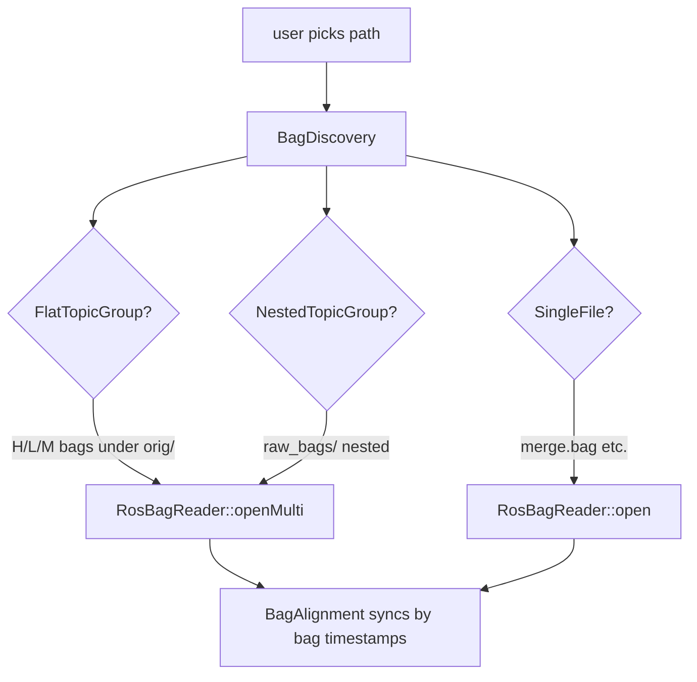

# qManualCalib — Manual Calibration Tools


ACloudViewer plugin providing **manual sensor extrinsic calibration** and **AVM (surround view) adjustment**, targeting autonomous-driving EOL / online calibration workflows.

> **Build index:** see [plugins/README.md](../../README.md).

---

## Feature Overview

| Module | Menu entry | Icon | Purpose |
|--------|------------|------|---------|
| **Manual Sensor Calibration** | Plugins → Manual Calibration Tools → Sensor Calibration | `sensorCalibIcon.svg` | Camera / LiDAR 6-DOF extrinsic fine-tuning, BEV, point cloud projection |
| **AVM View Adjustment** | Plugins → Manual Calibration Tools → AVM Adjustment | `avmAdjustIcon.svg` | Real-time surround-view remap parameter adjustment |

---

## Quick Start (Sensor Calibration)


```mermaid
flowchart LR
    A[Load Config] --> B[Load Bag]
    B --> C[Select sensor / view mode]
    C --> D[Drag time slider]
    D --> E[Fine-tune 6-DOF extrinsics]
    E --> F[Save Config / Export]
```

1. **Load Config**: select a directory containing `cameras.cfg` (and optionally `lidars.cfg`, `ground.cfg`).
2. **Load Bag**: select a `.bag` file or a bag **directory** (multi-bag auto-discovery supported, see below).
3. Select sensor type, name, and calibration mode (single / all / avm / svm).
4. Select a view mode (BEV / LiDAR Proj / Single Frame) and drag the slider to browse time frames.
5. Fine-tune extrinsics with Roll/Pitch/Yaw/X/Y/Z; when satisfied, **Save Config** or export images / point clouds.

**Built-in test data (one-click download, no bag required):**

In both the **Manual Sensor Calibration** and **AVM Adjustment** dialogs, click the **“use test data”** button to automatically download, extract, and fill in sample config and bag (cached to `~/cloudViewer_data/extract/qcalib_test_data/`); a live Qt progress bar shows the download / extraction progress. You can still load custom data via Load Config / Load Bag.

Full size and performance details: **[`tests/data/DATA_CARD.md`](tests/data/DATA_CARD.md)**.

| Item | Path |
|------|------|
| Download zip | [`qcalib_test_data.zip`](https://github.com/Asher-1/cloudViewer_downloads/releases/download/qManualCalib/qcalib_test_data.zip) |
| Config | `configs/` after extraction |
| Aligned slice bag | `bags/sample_aligned.bag` after extraction (**24.3 MB**, ~0.6 s, 3 aligned BEV frames) |

Custom user config / bag files remain fully supported through steps 1-2 (Load Config / Load Bag).
See [`tests/data/README.md`](tests/data/README.md) for download, slicing, and regeneration notes.

---

## Module 1: Manual Sensor Extrinsic Calibration

### Core capabilities

- **6-DOF adjustment**: Roll / Pitch / Yaw / X / Y / Z independently fine-tunable, step 0.001–0.1 (deg/m)
- **Bird's Eye View (BEV)**: multi-camera top-view stitching with distance-transform weighted blending in overlap areas
- **BEV remap backend**: UI selectable Auto / CUDA / OpenCL / CPU
- **LiDAR-Camera Fusion**: point cloud projected onto camera images with depth coloring
- **Four view modes**:

| Mode | Display | Main controls |
|------|---------|---------------|
| **BEV** | 2D bird's-eye stitching | BEV backend, left-click two-point distance, empty-state hover |
| **LiDAR Projection** | 2D point cloud projection | distance filter, multi LiDAR selection |
| **Single Frame** | 3D single-frame point cloud | ground height filter, multi LiDAR selection |
| **Multi Frame** | — | not implemented yet (consistent with the original stub) |

- **Export**: Export Image / Export PCD / Export BEV (batch) / Save Config (`cameras_fix.cfg`, `lidars_fix.cfg`)
- **ROS Bag**: in-house bag v2.0 parser (`MCALIB_CALIB_IO`), BZ2 / LZ4 compression
- **Multi-bag & time sync**: Flat / Nested / SingleFile layout auto-discovery; images / point clouds / vehicle state aligned along the bag timeline
- **HEVC / H.264 online cameras**: FFmpeg sequential decoding (`MCALIB_WITH_FFMPEG_SUPPORT`)
- **Async slider**: background indexing + debounce + `QtConcurrent`

### ROS Bag loading modes

**Load Bag** supports two ways:

- **Bag file…**: a single `.bag`
- **Bag directory…**: auto-discovers sessions and topic groups inside a directory


```mermaid
flowchart TD
    IN[user picks path] --> DISC[BagDiscovery]
    DISC --> L1{SingleFile?}
    DISC --> L2{FlatTopicGroup?}
    DISC --> L3{NestedTopicGroup?}
    L1 -->|merge.bag etc.| OPEN1[RosBagReader::open]
    L2 -->|H/L/M bags under orig/| OPENM[RosBagReader::openMulti]
    L3 -->|raw_bags/ nested| OPENM
    OPENM --> SYNC[BagAlignment syncs by bag timestamps]
    OPEN1 --> SYNC
```

| Layout | Typical directory | Behavior |
|--------|-------------------|----------|
| **SingleFile** | `bags/` (contains `merge.bag`) | opens a single merged bag |
| **FlatTopicGroup** | `bags/orig/` (Heavy / Light / Medium side by side) | `openMulti` multi-bag time alignment |
| **NestedTopicGroup** | nested structures such as `raw_bags/` | select a group by session, then `openMulti` |
| **LegacyMultiBag** | legacy multi-file directories | opened for compatibility |

When multiple sessions exist, the **Select Bag Session** dialog pops up; the newest session is selected by default.

**Online HEVC data (e.g. YR_VF6):**

- Camera topics are NAL streams with `format=hevc`, not JPEG
- FFmpeg must be enabled; decode state is persisted in `RosBagReader::videoDecodeCache()`
- Proto-embedded timestamps may differ from bag record times by years → the sync logic **switches to bag record time** when the difference exceeds 60 s

Example recommended paths:

```text
/home/.../YR_VF6_1_online/bags/orig/     # multi-bag (cameras + pose + point clouds)
/home/.../YR_VF6_1_online/bags/        # merge.bag preferred automatically
```

### Sensor Calibration detailed flow

```
1. Load Config     → cameras.cfg / lidars.cfg / ground.cfg
2. Load Bag        → file or directory; wait for background time indexing
3. Sensor select   → Camera/Lidar + name + single/all/avm/svm
4. View mode       → BEV / LiDAR Proj / Single Frame
5. 6-DOF adjust    → ± buttons + speed steps
6. Time slider     → 0–100% of bag duration; images and point clouds refresh
                     asynchronously (no accumulating history frames)
7. Export
   Save Config     → *_fix.cfg
   Export Image    → current 2D view → DB Tree
   Export PCD      → current point cloud → DB Tree
   Export BEV      → batch SVM/AVM BEV JPGs
```

**Shortcuts (BEV):** `[` / `]` adjust the virtual focal length (point size slider).

Switching to Single Frame automatically enters the 3D view and zoom-to-fit.

---

## Module 2: AVM View Adjustment


```mermaid
flowchart LR
    A[Load Config] --> B[Load Bag]
    B --> C[Select panoramic_1–4]
    C --> D[Select AVM mode]
    D --> E[Adjust via SpinBox / Slider]
    E --> F[Save / Load Parameters]
```

- **Three modes**: `small_single_view`, `large_single_view`, `wheel_hub_view`
- **14 parameters**: virtual K2, zoom, V0 offset, output size, focal length, rotation angle, crop rectangle, etc.
- **Four panoramas**: `panoramic_1` – `panoramic_4` (`panoramic_3` large-view mode flips the focal sign automatically)
- **Bag slider**: same async loading as Sensor Calib

---

## CLI Tools (optional)

See [`tools/README.md`](tools/README.md).

| Target | Description |
|--------|-------------|
| `mcalib_export_bev` | headless batch BEV export |
| `mcalib_rosbag2image` | bag → JPG |
| `mcalib_rosbag2pcd` | bag → binary PCD |
| `mcalib_rosbag_merge` | merge multiple bags |
| `mcalib_rosbag_slice` | time slicing / multi-frame aligned merge |
| `mcalib_extrinsic_compare` | extrinsic comparison |
| `mcalib_static_aruco_detect` | ArUco detection |
| `mcalib_static_chessboard_detect` | chessboard detection |

---

## Architecture

```
qManualCalib/
├── calib_io/          # MCALIB_CALIB_IO — bag / proto / alignment / camera models
├── bev_stitch/        # MCALIB_BEV_STITCH — BEV remap + alpha fusion
├── include/ / src/    # plugin UI
├── tools/             # optional CLI (MCALIB_BUILD_TOOLS)
├── tests/             # test_bag_reader (MCALIB_BUILD_TESTS)
└── tests/data/        # data documentation (sample data downloaded on demand)
```

```
QMANUAL_CALIB_PLUGIN
    ├── MCALIB_BEV_STITCH → MCALIB_CALIB_IO
    └── MCALIB_CALIB_IO   → OpenCV, Eigen3, CVCoreLib, FFmpeg (optional)
```

---

## Building

### Plugin (default)

```bash
cmake -B build_app \
  -DBUILD_GUI=ON \
  -DBUILD_OPENCV=ON \
  -DPLUGIN_STANDARD_QMANUAL_CALIB=ON \
  ..

cmake --build build_app --target QMANUAL_CALIB_PLUGIN -j$(nproc)
```

Artifact: `build_app/bin/plugins/libQMANUAL_CALIB_PLUGIN.so` (Linux).

### CMake options

| Option | Default | Description |
|--------|---------|-------------|
| `PLUGIN_STANDARD_QMANUAL_CALIB` | OFF | build the plugin |
| `MCALIB_WITH_FFMPEG_SUPPORT` | ON | H.264/HEVC decoding (requires system FFmpeg) |
| `MCALIB_BUILD_TESTS` | OFF | build `test_bag_reader` |
| `MCALIB_BUILD_TOOLS` | OFF | build `tools/` CLI |
| `MCALIB_BEV_CUDA` | ON (with CUDA) | BEV CUDA remap; Linux links cudart statically (loads on machines without CUDA); Windows builds auto-bundle `cudart64_*.dll` into `lib/cuda-runtime/` (the DLL has zero CUDA dependencies, ~0.5 MB, so the plugin also loads without a CUDA toolkit; machines without an NVIDIA driver automatically fall back to OpenCL/CPU) |
| `MCALIB_BEV_OPENCL` | ON | BEV OpenCL remap |

Enabling the plugin makes OpenCV additionally build `calib3d` and `objdetect` (ArUco).

---

## Testing

### Building

```bash
cmake -B build_app \
  -DPLUGIN_STANDARD_QMANUAL_CALIB=ON \
  -DMCALIB_BUILD_TESTS=ON \
  -DBUILD_OPENCV=ON \
  ..

cmake --build build_app --target test_bag_reader -j$(nproc)
```

### Running

```bash
./build_app/bin/plugins/test_bag_reader
```

Test data (`sample_aligned.bag` + `configs/`) is no longer shipped with the repo; download it via the plugin's **“use test data”** button or manually extract to `~/cloudViewer_data/extract/qcalib_test_data/` (see [`tests/data/README.md`](tests/data/README.md)). The test run resolves the bag from that directory automatically; if it is not downloaded, bag-dependent cases are **SKIPped** and only bag-independent cases run.

### Test cases

| Case | Verifies |
|------|----------|
| `test_open_and_duration` | opens `sample_aligned.bag`, duration and timestamps are sane |
| `test_topic_listing` | topic enumeration; camera / point cloud topics exist |
| `test_read_camera_message_perf` | `readMessageAtPercent(50%)` performance and non-empty data |
| `test_read_with_time_filter` | 1 s time-window filtered reads |
| `test_multiple_reads_perf` | parallel multi-camera reads |
| `test_church_header_strip` | Church header stripping |
| `test_proto_decode_image` | CompressedImage protobuf → OpenCV image |
| `test_proto_decode_pointcloud` | PointCloud2 protobuf → point cloud reconstruction |
| `test_bev_blend_weights` | BEV alpha fusion weights |
| `test_bev_group_sync` | SVM+AVM group alignment @10/50/90% |
| `test_bev_proto_sync_long_bag` | long-bag proto timeline alignment |
| `test_lidar_group_cloud_sync` | LiDAR group and image-ref point cloud sync |
| `test_bag_discovery_topic_group_key` | topic-group session key parsing |
| `test_bag_discovery_real_layouts` | Flat / Nested directory discovery |
| `test_open_multi_topic_group` | `openMulti` multi-bag reads |
| `test_merged_single_bag_file` | single-file merge bag topic completeness |
| `test_yr_vf6_hevc_multi_bag` | YR_VF6 `bags/orig` HEVC multi-bag aligned decoding (runs when local data exists) |
| `test_yr_vf6_hevc_merge_bag` | YR_VF6 `merge.bag` HEVC decoding (runs when local data exists) |

The last two cases are **SKIPped** when `/home/ludahai/develop/data/eol/YR_VF6_1_online/` is missing; they do not affect the CI built-in data tests.

---

## Data Formats

### ROS Bag

- Format: ROS bag v2.0; compression: `none` / `bz2` / `lz4`
- Typical topics:
  - `/sensors/camera/*/compressed_proto` (JPEG or HEVC/H.264 NAL)
  - `/sensors/lidar/*/pointcloud2` or `combined_point_cloud_proto`
  - `/localization/pose`, `/canbus/car_state`

### Config files

- Protobuf text `.cfg`: `cameras.cfg`, `lidars.cfg`, `ground.cfg`
- Camera models: `PINHOLE`, `KANNALA_BRANDT`, `MEI`, `FULLPINHOLE`

---

## Performance & Stability

- BEV remap caching: maps are not rebuilt when extrinsics are unchanged
- GPU remap failures automatically fall back to CPU
- Bag time index is built in the background; slider is debounced with async frame fetching
- HEVC: persistent `VideoDecodeCache` enables incremental decoding on forward seeks
- Dialog exit: `waitForFinished()` waits for background tasks and releases `RosBagReader`, avoiding crashes

## Coordinate frames vs. ACloudViewer reconstruction plugins

| Data source | DB Tree coordinate frame |
|-------------|--------------------------|
| **Automatic Reconstruction** — Fused point cloud / Textured mesh / Delaunay mesh | COLMAP world coordinates (all three coincide) |
| **qDA3** — depth back-projected point cloud | model / COLMAP export coordinates |
| **qFreeSplatter** — Gaussian PLY | OpenGL (y-up), differs from COLMAP |

Manual Calibration BEV / projection views use the vehicle/sensor configuration coordinates and have no direct alignment with COLMAP reconstruction outputs.

---

## License

This plugin is part of the ACloudViewer project; the license of the main project applies.
