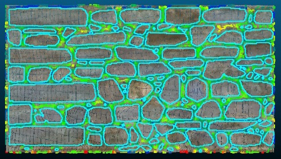

# Masonry Segmentation (plugin)

Segmentation of dense point clouds of masonry structures into their individual stones.



## Introduction

See:

- The GitHub project page: [CyberbuildLab/masonry-cc](https://github.com/CyberbuildLab/masonry-cc)
- The Historic Digital Survey project page: [cyberbuild.eng.ed.ac.uk](https://cyberbuild.eng.ed.ac.uk/projects/historic-digital-survey)
- A user guide (PDF): [CC_MASONRY_PLUGIN_USER_GUIDE_1.3.pdf](https://www.cloudcompare.org/doc/CC_MASONRY_PLUGIN_USER_GUIDE_1.3.pdf)

The plugin comprises two sub-plugins:

- **qAutoSeg** — automatic masonry segmentation
- **qManualSeg** — manual/interactive masonry segmentation

## ACloudViewer CLI

### Automatic segmentation

```bash
ACloudViewer -SILENT -O wall_scan.las -AUTO_SEG [OPTIONS] -SAVE_CLOUDS
```

| Token | Type | Description |
|-------|------|-------------|
| `-AUTO_SEG` | command | Run automatic masonry segmentation |
| `-MORTAR_MAPS` | flag | Generate mortar maps |
| `-CONTOURS` | flag | Extract contours |
| `-PROFILE` | flag | Generate profile |

### Manual segmentation

```bash
ACloudViewer -SILENT -O wall_scan.las -MANUAL_SEG [OPTIONS] -SAVE_CLOUDS
```

| Token | Type | Description |
|-------|------|-------------|
| `-MANUAL_SEG` | command | Run manual masonry segmentation |
| `-MORTAR_MAPS` | flag | Generate mortar maps |
| `-CONTOURS` | flag | Extract contours |
| `-PROFILE` | flag | Generate profile |

## Build

```cmake
-DPLUGIN_STANDARD_MASONRY_QAUTO_SEG=ON
-DPLUGIN_STANDARD_MASONRY_QMANUAL_SEG=ON
```

## References

- GitHub: [CyberbuildLab/masonry-cc](https://github.com/CyberbuildLab/masonry-cc)
- CloudCompare wiki: [Masonry Segmentation (plugin)](https://www.cloudcompare.org/doc/wiki/index.php/Masonry_Segmentation_(plugin))
