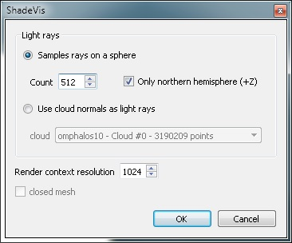
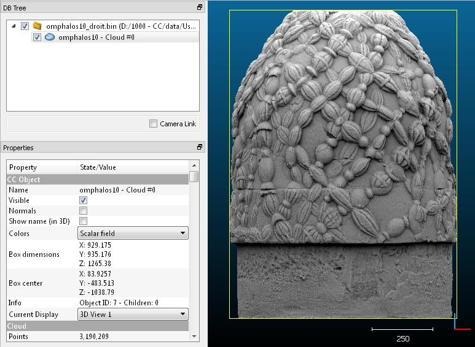

# ShadeVis (plugin)

## Introduction

qPCV stands for "Portion de Ciel Visible" which translates into "Portion of Visible Sky" in English.

It calculates the illumination of a point cloud (or vertices of a mesh) as if the light was coming from a theoretical hemisphere or sphere around the object (the user can also provide its own set of light directions - see below). It uses only the graphic card to achieve this.

It is a generalization of the algorithm developed by [Tarini et al.](http://citeseerx.ist.psu.edu/viewdoc/summary?doi=10.1.1.109.984&rank=1).

## Usage

To use this plugin the user must select one cloud or one mesh.

The plugin dialog looks like this:



Most importantly you have to set:

- Whether the light should come from a **hemisphere** (the 'sky' hemisphere by default, i.e. one pointing towards +Z) or if it should come from the **whole sphere** (warning: only works with a closed shape, otherwise the light will attain points by the front and the back leading to an unrealistic and poorly contrasted result).
- You have to set the **number of light rays** sampled on the (hemi)sphere. The more samples you use, the finer the result will be, but also the slower the computation will be!
- The **resolution** of the OpenGL context that will internally be used for rendering the different 'views' of the object. The bigger, the finer the result. But you need enough memory on your graphic card AND if you use a cloud, you have to get a very dense cloud otherwise holes will appear between the points and let the light enters...

Secondary options are:

- To specify if the mesh is **closed** (in case the selected entity is a mesh). This accelerates the process.
- You can input your own **'light directions'** by providing a point cloud. Only its normals will be used (considered as independent vectors sampled over a unit sphere).

On completion, the selected entity will gain a new **scalar field** corresponding to the illumination of each point.

You can modify the display parameters of this scalar field to increase the contrast for instance. You can also convert this scalar field to RGB colors, etc.



## ACloudViewer CLI

```bash
ACloudViewer -SILENT -O input.ply -PCV [OPTIONS] -SAVE_CLOUDS
```

| Token | Type | Description |
|-------|------|-------------|
| `-PCV` | command | Run PCV / ShadeVis |
| `-N_RAYS` | int | Number of light rays sampled on the (hemi)sphere |
| `-IS_CLOSED` | flag | Treat mesh as closed (accelerates process) |
| `-180` | flag | Use hemisphere only (upper half, +Z sky); omit for full sphere |
| `-RESOLUTION` | int | OpenGL context resolution for internal rendering |

### Example

```bash
ACloudViewer -SILENT -O model.ply -PCV -N_RAYS 256 -180 -RESOLUTION 1024 -SAVE_CLOUDS
```

## Build

```cmake
-DPLUGIN_STANDARD_QPCV=ON
```

Requires the VTK backend (`USE_VTK_BACKEND=ON`) and a working OpenGL context (including for headless/batch usage).

## References

- M. Tarini, P. Cignoni, R. Scopigno, "Ambient Occlusion and Edge Cueing for Enhancing Real Time Molecular Visualization," *IEEE TVCG*, 2006.
- CloudCompare wiki: [ShadeVis (plugin)](https://www.cloudcompare.org/doc/wiki/index.php/ShadeVis_(plugin))
