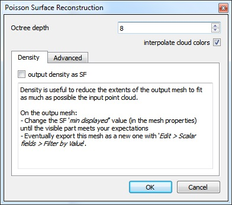
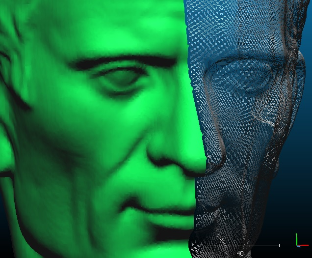
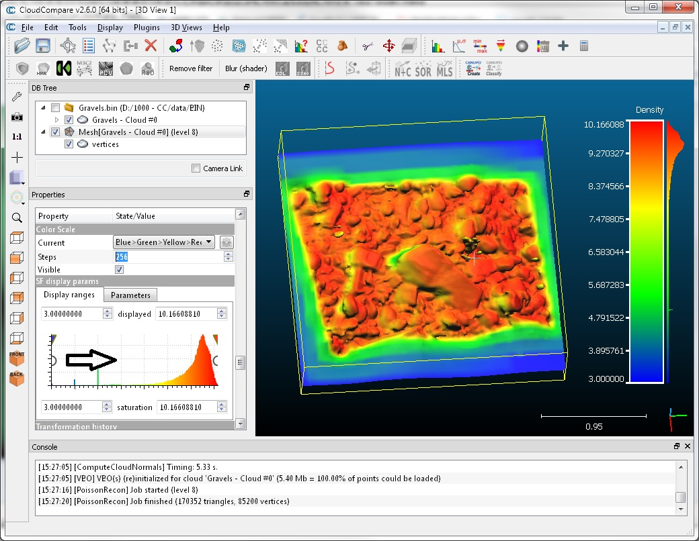
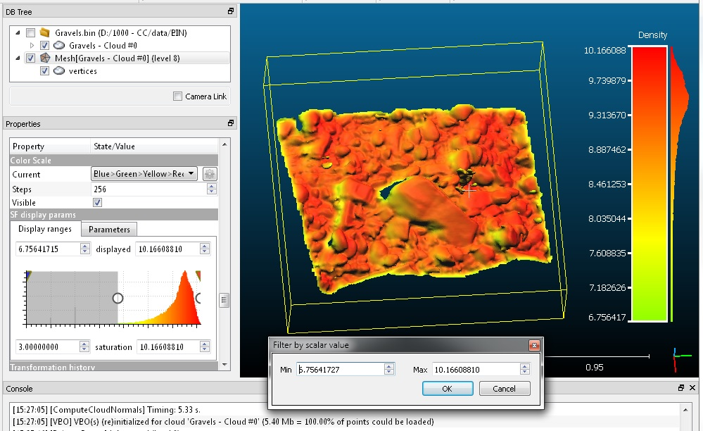

# Poisson Surface Reconstruction (plugin)

## Introduction

qPoissonRecon stands for "Poisson Surface Reconstruction" and is a simple interface to the triangular mesh generation algorithm proposed by [Misha Kazhdan](http://www.cs.jhu.edu/~misha/) of Johns Hopkins University.

This is exactly the same implementation as the [PoissonRecon](http://www.cs.jhu.edu/~misha/Code/PoissonRecon) library maintained and shared by the author (currently used version: 7).

Therefore, if you use this tool for a scientific publication, please cite the author before citing CloudCompare (which is also very good but less important in this particular case ;).

CloudCompare simply adds a dialog to set some parameters (see below) and a seamless integration in its own workflow.

## Usage

Notes:

- To use this plugin, the user must select a **point cloud with normals**.
- To obtain good results, the normals of the cloud must be **clean** (i.e. the orientation of all normals must be correct/consistent and not too noisy).
- By default the algorithm should be applied on **closed 3D shapes**, but you can use the output 'density' information to get a valid mesh even on an open mesh (typically such as terrains — see below).

The plugin dialog looks like this:



The parameters are relatively clear and their precise definition can be found on the original library [page](http://www.cs.jhu.edu/~misha/Code/PoissonRecon).

The main parameter is **'octree depth'**. The deeper (i.e. greater) the finer the result will be, but also the more time and memory will be required.

Here is an example of output mesh (the mesh is on the left, and the input cloud — with normals — is on the right):



With PoissonRecon v7+, the original cloud color can be automatically and properly interpolated (check the 'interpolate cloud colors' checkbox).

## Using the output density

The most interesting feature when working with open shapes (such as LIDAR clouds, etc.) is the 'density' measure output by PoissonRecon.



You can use this scalar field to reduce the output mesh extents so as to match as best the input cloud extents:

1. Once the computation is done, close the plugin dialog.
2. Select the output mesh.
3. Scroll its properties down (see the 'Properties' dialog — on the left by default) until you see the 'SF display params' section.

You can use the left white circular interactor (which corresponds to the 'minimum displayed value') to interactively hide the triangles with vertices having the lowest density values. They correspond to the triangles that are the farthest from the input cloud.

Once you are visually satisfied with the result, you can export the visible triangles as a new mesh:

- Use the **Edit > Scalar Fields > Filter by Value** method.
- The min and max values should be already set as the ones you have interactively set.
- Confirm to create a new mesh.
- You can drop the 'density' scalar field at least on the output mesh (with Edit > Scalar Fields > Delete).



## ACloudViewer CLI

```bash
ACloudViewer -SILENT -O cloud_with_normals.ply -POISSON_RECON [OPTIONS] -SAVE_MESHES
```

| Token | Type | Description |
|-------|------|-------------|
| `-POISSON_RECON` | command | Run Poisson Surface Reconstruction |
| `-DEPTH` | int | Octree depth (higher = finer result, more memory) |
| `-SAMPLES_PER_NODE` | float | Minimum number of sample points per octree node |
| `-POINT_WEIGHT` | float | Interpolation weight for point positions |
| `-BOUNDARY` | enum | Boundary type (e.g. Neumann, Dirichlet) |
| `-LINEAR_FIT` | flag | Use linear interpolation for low-depth nodes |
| `-WITH_COLORS` | flag | Interpolate cloud colors onto mesh |
| `-DENSITY` | flag | Output density scalar field |

### Example

```bash
ACloudViewer -SILENT -O terrain.ply -POISSON_RECON -DEPTH 10 -WITH_COLORS -DENSITY -SAVE_MESHES
```

## Build

```cmake
-DPLUGIN_STANDARD_QPOISSON_RECON=ON
```

## References

- M. Kazhdan, M. Bolitho, H. Hoppe, "Poisson Surface Reconstruction," *Eurographics SGP*, 2006.
- M. Kazhdan, H. Hoppe, "Screened Poisson Surface Reconstruction," *ACM ToG*, 2013.
- PoissonRecon library: [cs.jhu.edu/~misha/Code/PoissonRecon](http://www.cs.jhu.edu/~misha/Code/PoissonRecon)
- CloudCompare wiki: [Poisson Surface Reconstruction (plugin)](https://www.cloudcompare.org/doc/wiki/index.php/Poisson_Surface_Reconstruction_(plugin))
