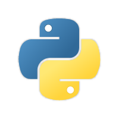

# qPythonRuntime — Embedded Python scripting

## Introduction

**qPythonRuntime** runs **Python scripts** inside ACloudViewer via **pybind11**, with bindings to the application API for automation, batch jobs, and experimental tools. Scripts can load clouds, invoke algorithms, and interact with the scene graph depending on the exposed bindings in your build.



Further build and embedding details live in **`docs/building.rst`** inside this plugin directory.

## Usage

From the GUI, use the Python plugin entry points your build provides (console, script runner, or menu actions). For repeatable runs, prefer the **CLI** below or a small driver script checked into your project.

## ACloudViewer CLI

```bash
ACloudViewer -SILENT -PYTHON_SCRIPT my_script.py [script arguments...]
ACloudViewer -SILENT -O cloud.las -PYTHON_SCRIPT process.py --extra-args
```

Arguments after the script path are forwarded to your script (see `tests/test_cmdline.py` in this plugin for behavior).

## Build

Enable the Python module and the plugin together:

```bash
-DPLUGIN_PYTHON=ON -DBUILD_PYTHON_MODULE=ON
```

Use **Python** development headers/libs matching the interpreter you link. Configure **pybind11** per `cmake/PythonEnvHelper.cmake` and project docs.

## Dependencies

- **Python** (development package).
- **pybind11**.

## References

- CloudCompare Python runtime documentation (conceptual lineage): [tmontaigu.github.io/CloudCompare-PythonRuntime](https://tmontaigu.github.io/CloudCompare-PythonRuntime/index.html)
- Local build notes: `plugins/core/Standard/qPythonRuntime/docs/building.rst`
