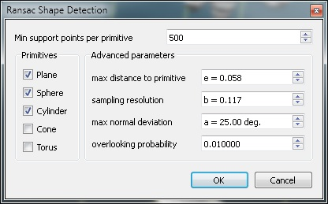
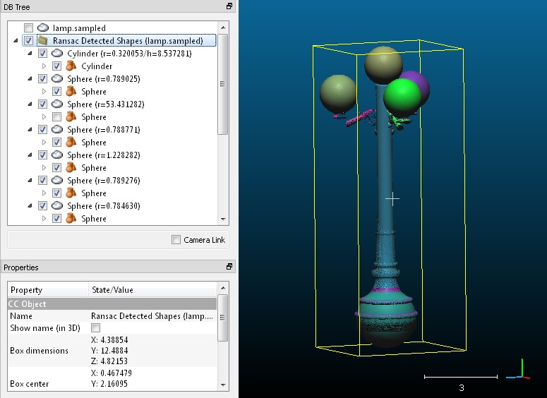

# RANSAC Shape Detection (plugin)

## Introduction

qRansacSD stands for "RANSAC Shape Detection" and is a simple interface to the automatic shape detection algorithm proposed by Ruwen Schnabel et al. of Bonn university (*Efficient RANSAC for Point-Cloud Shape Detection*).

This is exactly the same implementation as the library shared by the authors on their website (version 1.1).

See the original code [here](https://github.com/alessandro-gentilini/Efficient-RANSAC-for-Point-Cloud-Shape-Detection).

See the original paper [here](http://www.hinkali.com/Education/PointCloud.pdf).

Therefore, if you use this tool for a scientific publication, please cite the author before citing CloudCompare (which is also very good but less important in this particular case ;).

CloudCompare simply adds a dialog to set some parameters (see below) and a seamless integration in its own workflow.

## Usage

Notes:

- To use this plugin, the user must select a **point cloud**.
- To obtain better results, you can provide a point cloud with **clean normals** (otherwise the plugin will compute them itself).

The plugin dialog looks like this:



The description of each parameter should appear as a tooltip (appears when leaving the mouse over the corresponding spinbox for a while). The most important one is the **number of samples (support points) per primitive**. It all depends on your cloud density and the size of the shapes you are trying to detect. For the other parameters, it may be necessary to read the original article.

You also have to select only the kind of primitives you actually wish to detect (see the checkboxes on the left) so as to easily avoid false/unnecessary detections.

On completion, the plugin will create a set of new entities. For each detected shape you get:

- A **point cloud** corresponding to the subset of points that supports the detected primitive. The name of the cloud incorporates the estimated primitive parameters.
- The **corresponding entity as child** of this cloud. Warning: apart from planes, the other primitives are not displayed by default (as they can be much bigger than the actual cloud, especially for spherical or cylindrical portions that may only fit on a very small portion of the complete primitive).
- Each couple (cloud/primitive) is **randomly colored**.



## ACloudViewer CLI

```bash
ACloudViewer -SILENT -O cloud.ply -RANSAC [OPTIONS] -SAVE_CLOUDS
```

| Token | Type | Description |
|-------|------|-------------|
| `-RANSAC` | command | Run RANSAC shape detection |
| `EPSILON_ABSOLUTE` | float | Distance tolerance (absolute) |
| `EPSILON_PERCENTAGE_OF_SCALE` | float | Distance tolerance (% of scale) |
| `BITMAP_EPSILON_ABSOLUTE` | float | Bitmap epsilon (absolute) |
| `BITMAP_EPSILON_PERCENTAGE_OF_SCALE` | float | Bitmap epsilon (% of scale) |
| `SUPPORT_POINTS` | int | Minimum support points per primitive |
| `MAX_NORMAL_DEV` | float | Maximum normal deviation (degrees) |
| `PROBABILITY` | float | Detection probability |
| `ENABLE_PRIMITIVE` | enum | Followed by: `PLANE`, `SPHERE`, `CYLINDER`, `CONE`, or `TORUS` |
| `OUT_RANDOM_COLOR` | flag | Color output primitives randomly |
| `OUT_CLOUD_DIR` | path | Output directory for sub-clouds |
| `OUT_MESH_DIR` | path | Output directory for primitive meshes |
| `OUT_PAIR_DIR` | path | Output directory for paired cloud+primitive |
| `OUT_GROUP_DIR` | path | Output directory for grouped output |
| `OUTPUT_INDIVIDUAL_PRIMITIVES` | flag | Output each primitive separately |
| `OUTPUT_INDIVIDUAL_SUBCLOUDS` | flag | Output each sub-cloud separately |
| `OUTPUT_INDIVIDUAL_PAIRED_CLOUD_PRIMITIVE` | flag | Output paired cloud+primitive |
| `OUTPUT_GROUPED` | flag | Output grouped results |

### Example

```bash
ACloudViewer -SILENT -O building.ply \
  -RANSAC SUPPORT_POINTS 500 ENABLE_PRIMITIVE PLANE ENABLE_PRIMITIVE CYLINDER \
  OUTPUT_INDIVIDUAL_SUBCLOUDS \
  -SAVE_CLOUDS
```

## Build

```cmake
-DPLUGIN_STANDARD_QRANSAC_SD=ON
```

## References

- R. Schnabel, R. Wahl, R. Klein, "Efficient RANSAC for Point-Cloud Shape Detection," *Computer Graphics Forum*, 2007.
- Original code: [github.com/alessandro-gentilini/Efficient-RANSAC-for-Point-Cloud-Shape-Detection](https://github.com/alessandro-gentilini/Efficient-RANSAC-for-Point-Cloud-Shape-Detection)
- CloudCompare wiki: [RANSAC Shape Detection (plugin)](https://www.cloudcompare.org/doc/wiki/index.php/RANSAC_Shape_Detection_(plugin))
