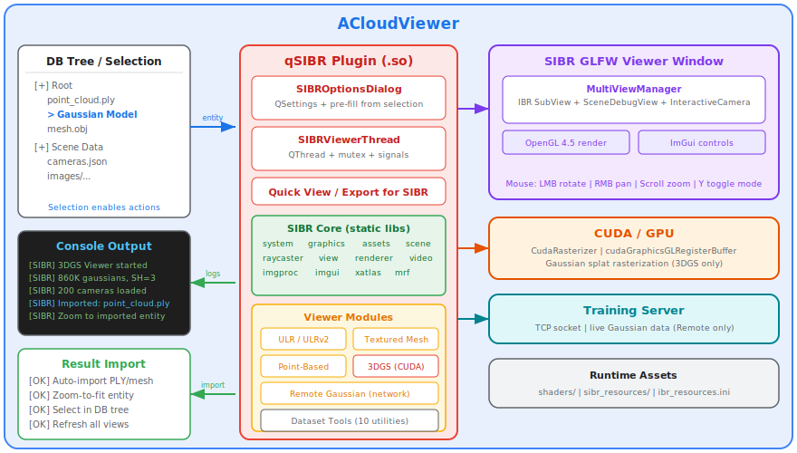
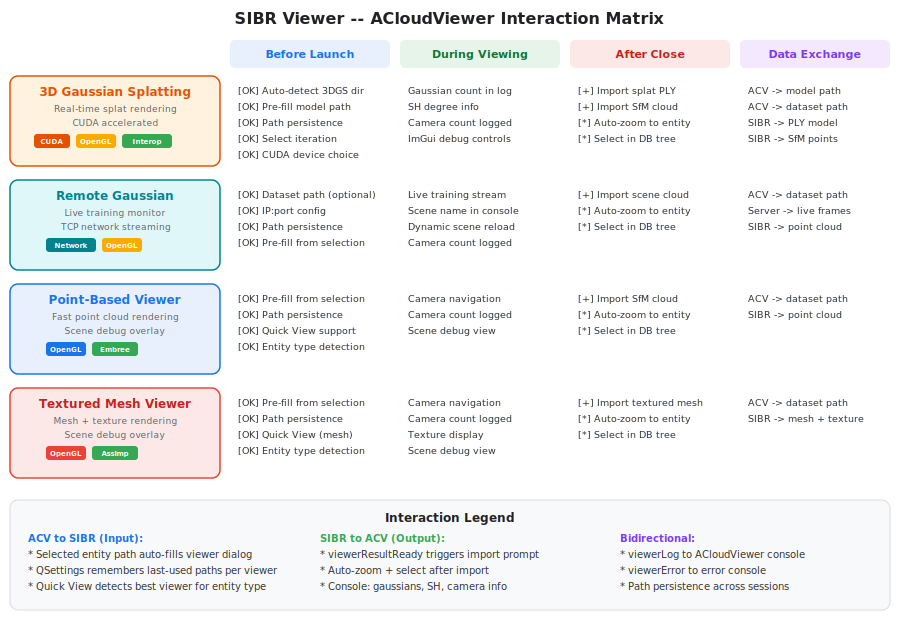
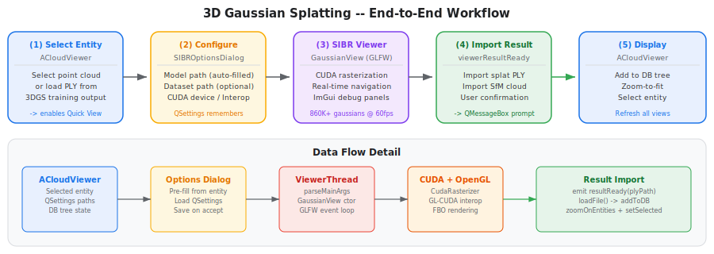
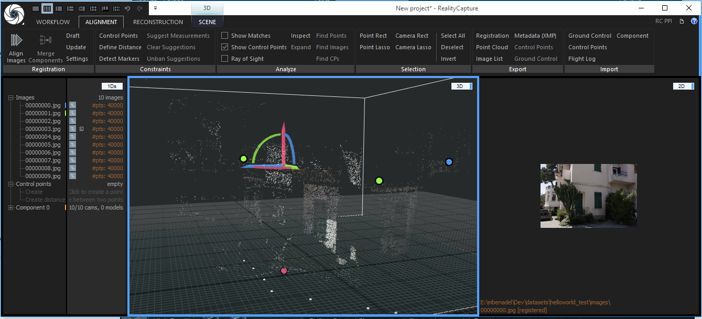
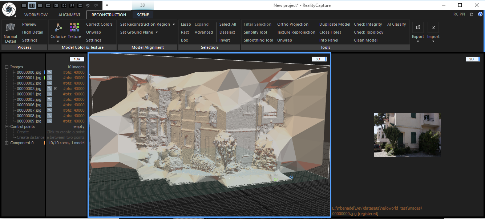
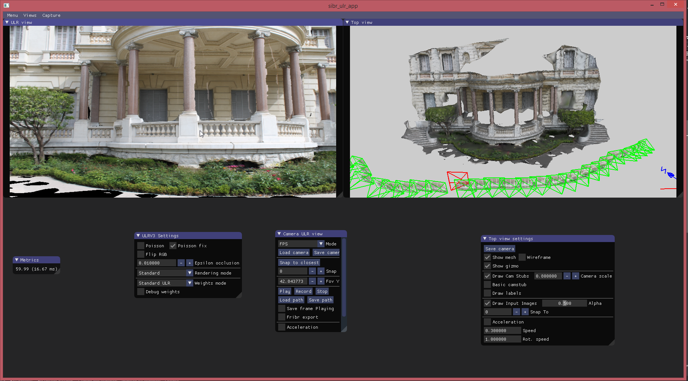
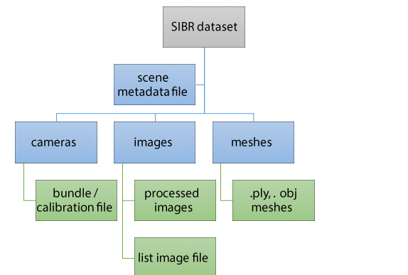
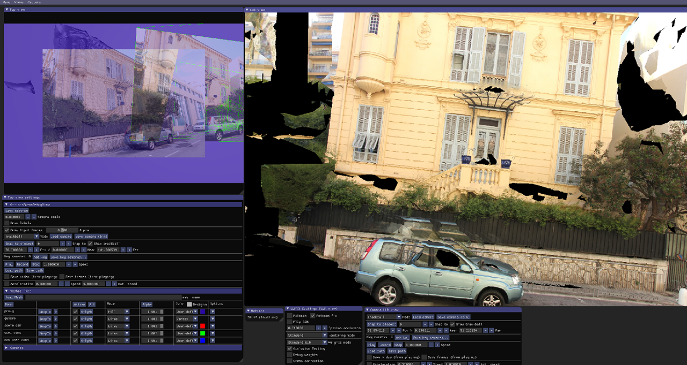

# qSIBR — SIBR Image-Based Rendering Plugin for ACloudViewer

> Full integration of the [SIBR](https://sibr.gitlabpages.inria.fr/) framework
> into ACloudViewer, including **3D Gaussian Splatting** real-time rendering,
> ULR novel-view synthesis, textured mesh & point-based viewing, and dataset
> preprocessing tools.

---

## Architecture Overview

<p align="center">
  
</p>

All SIBR viewer functionality is embedded directly in the plugin shared library.
The plugin communicates with ACloudViewer through signals, console messages,
and the database tree API.

---

## Plugin Menu

<p align="center">
  
</p>

---

## Viewer ↔ ACloudViewer Interaction Matrix

<p align="center">
  
</p>

Every SIBR viewer has **bidirectional interaction** with ACloudViewer:

| Direction | Mechanism | Details |
|-----------|-----------|---------|
| **ACV → SIBR** | Selected entity pre-fill | Dataset/model paths auto-detected from selected entity's source file |
| **ACV → SIBR** | Path persistence | QSettings remembers last-used paths per viewer type across sessions |
| **ACV → SIBR** | Quick View routing | Auto-selects the best viewer based on entity type (cloud, mesh, 3DGS) |
| **SIBR → ACV** | Console logging | Viewer status, Gaussian count, SH degree, camera info streamed to console |
| **SIBR → ACV** | Result import | PLY/mesh files offered for import with user confirmation on viewer close |
| **SIBR → ACV** | Post-import display | Imported entity auto-zoomed, selected in DB tree, views refreshed |

---

## Features

| Viewer | Description | GPU | Input |
|--------|-------------|-----|-------|
| **ULR Viewer** | Unstructured Lumigraph Rendering — full IBR pipeline | OpenGL | COLMAP dataset |
| **ULR v2/v3** | Improved ULR with texture arrays, masks & Poisson | OpenGL | COLMAP dataset |
| **Textured Mesh** | View textured meshes with scene debug overlay | OpenGL | COLMAP dataset + mesh |
| **Point-Based** | Fast point cloud visualization with debug view | OpenGL | COLMAP dataset |
| **3D Gaussian Splatting** | Real-time Gaussian splat rendering | CUDA + OpenGL | Trained 3DGS model |
| **Remote Gaussian** | Live connection to training process | OpenGL + Network | TCP server |
| **Quick View** | Auto-detect best viewer for selected entity | — | DB tree selection |
| **Export for SIBR** | Guide / prepare data for SIBR processing | — | DB tree selection |
| **Dataset Tools** | 10 preprocessing utilities | — | Dataset directory |

---

## Usage Guide

### 3D Gaussian Splatting Viewer

<p align="center">
  
</p>

Renders a trained 3D Gaussian Splatting model in real-time using CUDA.

**ACloudViewer interactions:**
- **Before launch:** If you have a point cloud loaded from a 3DGS output
  directory (containing `cfg_args` or `point_cloud/iteration_*/`), the model
  path is **auto-detected and pre-filled** in the dialog.
- **During viewing:** Gaussian count, SH degree, and camera info are logged
  to the ACloudViewer console.
- **After close:** The plugin offers to import both the **Gaussian splat PLY
  model** and the **SfM point cloud** into ACloudViewer's database. Accepted
  imports are auto-zoomed and selected.

**Input directory structure:**

```
model/
├── cfg_args               ← training config (auto-detected)
├── cameras.json
├── input.ply
└── point_cloud/
    └── iteration_30000/
        └── point_cloud.ply
```

**Steps:**
1. Select a point cloud in ACloudViewer (optional — for path auto-fill)
2. Click **Plugins → SIBR Viewer → 3D Gaussian Splatting Viewer**
3. Model Path is pre-filled if auto-detected; otherwise browse to select it
4. Choose iteration (leave empty for latest), CUDA device, interop mode
5. Click OK — the SIBR viewer window opens with real-time rendering
6. Navigate with mouse: LMB rotate, RMB pan, scroll zoom, Escape to close
7. ACloudViewer prompts to import the Gaussian splat PLY model

---

### Remote Gaussian Viewer

Connects to a running 3DGS training process and streams live renders.

**ACloudViewer interactions:**
- **Before launch:** Dataset path can be pre-filled from a selected entity.
  IP/port settings are remembered via QSettings.
- **During viewing:** Scene name changes are logged to the console as
  `[SIBR] Scene loaded: /path/to/scene`. The viewer dynamically reloads
  when the training server provides a new scene.
- **After close:** The scene point cloud is offered for import.

**Steps:**
1. Start your 3DGS training with `--ip 0.0.0.0 --port 6009`
2. Click **Plugins → SIBR Viewer → Remote Gaussian Viewer**
3. Enter IP and port (default `127.0.0.1:6009`, remembered for next time)
4. Optionally select a local dataset for camera overlay
5. Click OK — live training progress streams into the viewer

---

### Point-Based Viewer

Fast point cloud visualization with a top-view scene debug overlay.

<p align="center">
  
</p>

**ACloudViewer interactions:**
- **Before launch:** If a point cloud is selected in the DB tree and its
  source file path is detectable, the dataset path is **auto-filled**.
- **After close:** The SfM point cloud is offered for import with auto-zoom.

**Steps:**
1. Select a point cloud in ACloudViewer (optional)
2. Click **Plugins → SIBR Viewer → Point-Based Viewer**
3. Dataset path pre-filled from selection; adjust if needed
4. Set resolution and click OK
5. Navigate the point cloud in real-time; Escape to close
6. Import result back into ACloudViewer

---

### Textured Mesh Viewer

View textured meshes with camera input overlay and scene debug.

<p align="center">
  
</p>

**ACloudViewer interactions:**
- **Before launch:** If a mesh is selected in the DB tree, the dataset path
  is auto-filled from the entity's source. Quick View auto-routes meshes here.
- **After close:** The textured mesh is offered for import with auto-zoom.

**Steps:**
1. Select a mesh in ACloudViewer (optional)
2. Click **Plugins → SIBR Viewer → Textured Mesh Viewer**
3. Dataset path pre-filled from selection; adjust if needed
4. Click OK — mesh renders with textures in the SIBR viewer

---

### ULR Viewer

Unstructured Lumigraph Rendering — real-time novel-view synthesis.

<p align="center">
  
</p>

**Input:** SIBR dataset directory with cameras, images, and meshes:

<p align="center">
  
</p>

**Steps:**
1. Click **Plugins → SIBR Viewer → ULR Viewer**
2. Browse to select the dataset directory (or use remembered path)
3. Set rendering resolution (default 1280×720), click OK
4. Navigate with mouse; Escape to close
5. Import the scene mesh back into ACloudViewer

---

### Quick View (Context-Sensitive)

When you have an entity selected in ACloudViewer's database tree:

1. Click **Plugins → SIBR Viewer → Quick View in SIBR**
2. The plugin auto-detects the best viewer:
   - Source file from a **3DGS model directory** → Gaussian Splatting Viewer
   - Entity is a **mesh** → Textured Mesh Viewer
   - Entity is a **point cloud** → Point-Based Viewer
3. The options dialog opens with paths **pre-filled** from the entity
4. A blue label shows **"From selected [type]: [name]"** confirming the
   auto-detection

---

### SIBR Viewer Controls

All SIBR viewers share the same navigation controls:

| Mode | Controls | Description |
|------|----------|-------------|
| **FPS (default)** | `W/A/S/D` move, `Q/E` down/up | First-person camera |
| | `I/J/K/L` rotate, `U/O` roll | Look direction |
| **Trackball** | LMB center = rotate, LMB edge = roll | Orbit mode |
| | RMB center = pan, RMB edge = zoom | |
| | Ctrl+LMB = redefine center | Focus on region |
| | Scroll = forward/backward | |
| **Toggle** | Press `Y` | Switch FPS ↔ Trackball |
| **Quit** | Press `Escape` | Close viewer window |

The viewer has two panels: **main view** (rendering algorithm) and **top view**
(scene debug with camera positions). See the `MultiViewManager` documentation
for more details.

---

### Camera Paths & Comparisons

SIBR supports recording and replaying camera paths for reproducible comparisons:

- **Record path:** Click "Record" in the camera handler GUI, navigate, then
  "Save path" (formats: `.lookat`, `.path`, `.bundle`)
- **Replay path:** "Load path" → plays automatically with interpolation
- **Render to images:** Check "Record frames", load a path, images save
  to the output directory
- **Export video:** Check "Record video", play path, then
  "Capture → Export video" (`.mp4`)

---

### Dataset Tools

Preprocessing utilities accessible via **Plugins → SIBR Viewer → Dataset Tools**:

| Tool | Purpose |
|------|---------|
| Prepare COLMAP for SIBR | Convert COLMAP output to SIBR dataset format |
| Tonemapper | Tonemap HDR images |
| Unwrap Mesh | Generate UV coordinates for a mesh |
| Texture Mesh | Apply textures to a mesh |
| Clipping Planes | Define clipping planes for the scene |
| Crop From Center | Center-crop input images |
| NVM to SIBR | Convert VisualSFM NVM files |
| Distortion Crop | Remove distorted image borders |
| Camera Converter | Convert between camera formats |
| Align Meshes | Align two meshes |

> **Note:** Dataset tools run as external processes. Build with
> `-DSIBR_BUILD_DATASET_TOOLS=ON` to compile the tool executables.

---

### Preparing a Dataset

#### From COLMAP

Run the full COLMAP pipeline on your images, then convert to SIBR format:

```bash
python colmap2sibr PATH_TO_DATASET
```

This creates a `sibr_cm` subdirectory with the processed scene. Example
datasets are available at:
https://repo-sam.inria.fr/fungraph/sibr-datasets/

#### From RealityCapture

<p align="center">
  
</p>

1. Import images → **Align Images** → point cloud generated
2. **Calculate Model** (Normal Detail) → mesh reconstruction
3. **Colorize** or **Texture** the mesh
4. Simplify mesh if needed (Tools → Simplify Tools, ~1-2M triangles)
5. Export: Registration as `bundle.out` (bundler v0.3 Negative-Z, jpg, Inner
   region), mesh as `recon.ply`, textured as `textured.obj`

**Recommended directory structure:**

```
dataset/
├── raw/              # Original camera images
├── rcprojs/          # RealityCapture project files
├── sfm_mvs_rc/       # Exported: bundle.out, recon.ply, textured.obj
└── sibr_rc/          # Processed SIBR scene (bundle, mesh, images, metadata)
```

#### For 3D Gaussian Splatting

Follow the official [3DGS training
pipeline](https://github.com/graphdeco-inria/gaussian-splatting):

```bash
python train.py -s /path/to/dataset -m /path/to/model
```

The trained model directory is directly usable with the 3DGS Viewer.

---

## Build Requirements

| Dependency | Required | Notes |
|-----------|----------|-------|
| **Qt 5.x / 6.x** | Yes | Via ACloudViewer build system |
| **OpenGL 4.5+** | Yes | Desktop GPU with `GL_ARB_direct_state_access` |
| **GLEW** | Yes | Via `3rdparty_glew` |
| **GLFW 3** | Yes | Via `3rdparty_glfw` |
| **Boost** | Yes | system, filesystem, chrono, date_time |
| **OpenCV** | Yes | Via `3rdparty_opencv` |
| **Eigen 3** | Yes | Via `3rdparty_eigen3` |
| **Assimp** | Yes | Mesh loading |
| **Embree 3** | Recommended | Raycaster (limited without it) |
| **CUDA 11+** | Optional | Required for 3D Gaussian Splatting viewer |
| **FFmpeg** | Optional | Video export support |

## Build Instructions

```bash
# Enable the plugin (add -DBUILD_CUDA_MODULE=ON for 3D Gaussian Splatting)
cmake -DPLUGIN_STANDARD_QSIBR=ON -DBUILD_CUDA_MODULE=ON ..

# Build and install
make -j$(nproc)
make install
```

### CMake options

| Option | Default | Description |
|--------|---------|-------------|
| `PLUGIN_STANDARD_QSIBR` | `OFF` | Enable/disable the entire plugin |
| `BUILD_CUDA_MODULE` | `OFF` | Enable CUDA for Gaussian Splatting |
| `SIBR_BUILD_STANDALONE_APPS` | `OFF` | Build standalone SIBR viewer executables |
| `SIBR_BUILD_DATASET_TOOLS` | `OFF` | Build dataset preprocessing tool executables |

### Verify installation

After `make install`, confirm these runtime assets exist alongside the executable:

```
bin/
├── shaders/
│   ├── core/         # SIBR core shaders
│   ├── ulr/          # ULR project shaders
│   └── gaussian/     # Gaussian Splatting shaders (if CUDA)
├── sibr_resources/
│   ├── core/
│   ├── ulr/
│   └── basic/
├── ibr_resources.ini
└── plugins/
    └── libQSIBR_PLUGIN.so
```

---

## Architecture

```
qSIBR/
├── include/
│   ├── qSIBR.h                  # Plugin class (actions, slots, signals)
│   ├── SIBRViewerThread.h       # QThread wrapper for SIBR viewer loop
│   └── SIBROptionsDialog.h      # Configuration dialog with path persistence
├── src/
│   ├── qSIBR.cpp                # Plugin implementation + interactions
│   ├── SIBRViewerThread.cpp     # Viewer launch logic (6 viewers + tools)
│   └── SIBROptionsDialog.cpp    # Dialog with QSettings persistence
├── SIBR/src/
│   ├── core/                    # SIBR framework libraries
│   └── projects/                # ULR, basic, remote, gaussianviewer, tools
├── 3rdparty/                    # CudaRasterizer, imgui, mrf, xatlas
├── images/                      # SVG icons for each viewer
├── docs/img/                    # Documentation diagrams
├── info.json                    # Plugin metadata
└── CMakeLists.txt               # Build system
```

### SIBR Viewer Window

The SIBR viewer uses a `MultiViewManager` to display rendering subviews and
scene debug overlays within a single GLFW window:

<p align="center">
  
</p>

### Threading Model

Each SIBR viewer runs in its own `QThread` (`SIBRViewerThread`). GLFW and
SIBR's global `Input::global()` / `CommandLineArgs` are process-wide
singletons, so **only one SIBR viewer may be active at a time**. The plugin
enforces this with an atomic counter guard.

### Signal Flow

```
User clicks viewer action
    ↓
qSIBR::launchXxxViewer()
    ├── detectEntitySourcePath() → pre-fill dialog
    ├── SIBROptionsDialog (modal) → QSettings load/save
    └── SIBRViewerThread::start()
            ├── viewerStarted  → console: "[SIBR] Xxx started"
            ├── viewerLog      → console: Gaussian count, SH, scene info
            ├── SIBR OpenGL loop (GLFW window)
            ├── viewerResultReady → import prompt → loadFile → zoom + select
            └── viewerFinished → cleanup, remove from active viewers
```

---

## Cross-Platform Notes

| Platform | 3DGS (CUDA) | Other Viewers | Dataset Tools |
|----------|-------------|---------------|---------------|
| **Linux** | Full support | Full support | Full support |
| **Windows** | Full support | Full support | Full support |
| **macOS** | Not available (no CUDA) | Full support | Full support |

- **macOS:** SIBR runtime assets deploy into `.app/Contents/MacOS/`.
- **WSL / Mesa:** Enable "Disable CUDA-GL Interop" in the Gaussian viewer dialog.

---

## Troubleshooting

| Problem | Solution |
|---------|----------|
| Viewer doesn't start | Check console for `[SIBR]` messages. Ensure no other viewer is running. |
| GL_INVALID_OPERATION | Ensure GPU driver supports OpenGL 4.5+ with `GL_ARB_direct_state_access`. |
| Shaders not found | Verify `shaders/`, `sibr_resources/`, `ibr_resources.ini` exist in `bin/`. |
| CUDA errors | Check `nvidia-smi`. Try different device index. Enable no-interop for WSL. |
| Path not remembered | QSettings stored at `~/.config/ACloudViewer/ACloudViewer.conf` → `qSIBR/` |
| Quick View grayed out | Select a point cloud or mesh in the database tree first. |

---

## References

- [SIBR: A System for Image Based Rendering](https://sibr.gitlabpages.inria.fr/)
- [3D Gaussian Splatting for Real-Time Radiance Field Rendering](https://repo-sam.inria.fr/fungraph/3d-gaussian-splatting/)
- [GRAPHDECO - Inria](https://team.inria.fr/graphdeco/)

## License

The SIBR framework is developed by GRAPHDECO - Inria. This plugin integration
is part of the ACloudViewer project under the MIT license.
