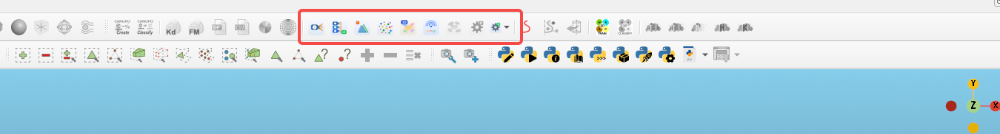
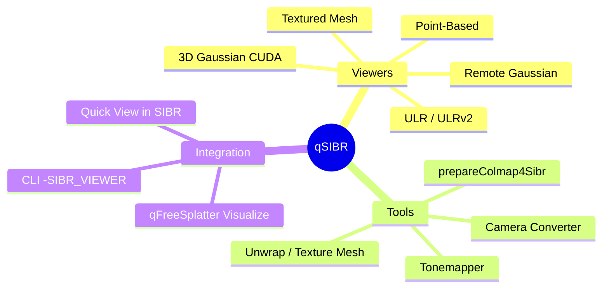
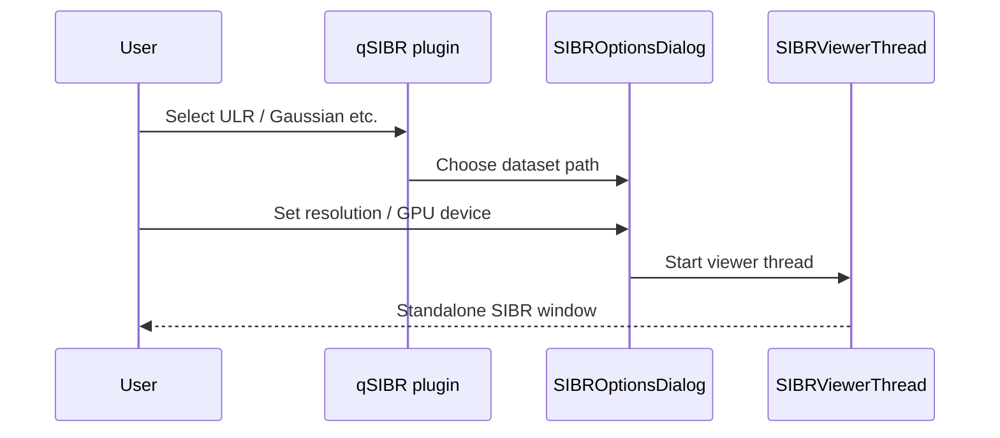

# qSIBR — SIBR Image-Based Rendering



Integrates the **[SIBR](https://sibr.gitlabpages.inria.fr/)** framework into ACloudViewer for **image-based rendering** and **3D Gaussian Splatting** real-time viewing, with two-way integration with the main DB Tree.

---

## Feature overview



| Category | Capabilities |
|------|------|
| **Interactive viewers** | ULR, ULR v2/v3, textured mesh, point-based rendering, 3D Gaussian (CUDA), remote training viewer |
| **Dataset tools** | COLMAP preprocessing, HDR tonemap, UV unwrap, mesh texturing, clipping, camera format conversion, etc. |
| **Quick View** | Automatically picks the best viewer for the selected DB entity |
| **Command line** | `-SIBR_VIEWER` / `-SIBR_TOOL` headless launch |

> **Platform note:** full CUDA Gaussian support is available on **Linux / Windows**; macOS is often limited by OpenGL / CUDA constraints and features may be incomplete.

---

## GUI usage

**Menu:** Plugins → **SIBR Viewer** (submenu icons per viewer)

 **ULR Viewer** — unstructured Lumigraph rendering  
 **ULR v2/v3 Viewer** — texture arrays + mask + Poisson  
 **Textured Mesh Viewer**  
 **Point-Based Viewer**  
 **3D Gaussian Splatting Viewer** (requires CUDA, `SIBR_HAS_CUDA`)  
 **Remote Gaussian Viewer** (requires `SIBR_HAS_REMOTE`)

### Workflow A: open a COLMAP / SIBR dataset



1. Click the target viewer (e.g. **ULR Viewer**).
2. In the dialog, specify **Dataset path** (with `cameras.json` / COLMAP layout / Gaussian output directory).
3. Set `--width` / `--height`, `--device` (GPU index), etc.
4. Confirm to browse interactively in a new window (only **one** SIBR window at a time to avoid GLFW conflicts).

### Workflow B: Quick View (from DB Tree)

1. Select a point cloud, mesh, or Gaussian-related entity in the DB Tree.
2. Click **Quick View in SIBR** (disabled when nothing is selected).
3. The plugin detects the type and launches the matching viewer.

### Workflow C: Dataset Tools

**Plugins → SIBR → Dataset Tools** submenu:

| Tool | Purpose |
|------|------|
| Prepare COLMAP for SIBR | Convert a COLMAP reconstruction into a SIBR dataset |
| Tonemapper | HDR image tonemap |
| Unwrap Mesh | Mesh UV unwrap |
| Texture Mesh | Mesh texturing |
| Clipping Planes | Clipping planes |
| Crop From Center | Center-crop images |
| NVM to SIBR | NVM format conversion |
| Distortion Crop | Distortion region crop |
| Camera Converter | Camera parameter format conversion |
| Align Meshes | Mesh alignment |

Each tool opens a path and parameter dialog and runs the native SIBR tool on a background thread.

### qFreeSplatter integration

1. Run FreeSplatter to produce PLY / Gaussian output.
2. Click **Visualize**, or manually open **3D Gaussian Splatting Viewer**.
3. Set `--model-path` to the FreeSplatter export directory.

---

## Command line (headless)

### Viewer `-SIBR_VIEWER`

```bash
# ULR dataset
./ACloudViewer -SILENT -SIBR_VIEWER ulr \
  --path /data/colmap_scene --width 1280 --height 720

# 3D Gaussian Splatting (CUDA)
./ACloudViewer -SILENT -SIBR_VIEWER gaussian \
  --path /data/scene \
  --model-path /data/gaussian_out \
  --device 0
```

| Viewer name | Description |
|-------------|------|
| `ulr` | ULR |
| `ulrv2` | ULR v2/v3 |
| `texturedmesh` | Textured mesh |
| `pointbased` | Point-based rendering |
| `gaussian` | 3D Gaussian (**requires `--model-path`**) |
| `remoteGaussian` | Remote training |

Common options: `--path`, `--model-path`, `--width`, `--height`, `--iteration`, `--device`, `--no-interop`, `--ip`, `--port`.

### Dataset tool `-SIBR_TOOL`

```bash
./ACloudViewer -SILENT -SIBR_TOOL prepareColmap4Sibr -- /path/to/colmap
```

Tool names: `prepareColmap4Sibr`, `tonemapper`, `unwrapMesh`, `textureMesh`, `clippingPlanes`, `cropFromCenter`, `nvmToSIBR`, `distordCrop`, `cameraConverter`, `alignMeshes`.

Tool-specific arguments go after the tool name; the next token starting with an uppercase `-` is treated as a new ACloudViewer argument (see `qSIBRCommands.h`).

---

## Build

```bash
cmake -B build_app \
  -DBUILD_GUI=ON \
  -DPLUGIN_STANDARD_QSIBR=ON \
  -DBUILD_OPENCV=ON \
  .

cmake --build build_app --target QSIBR_PLUGIN -j$(nproc)
```

| Option | Description |
|------|------|
| `PLUGIN_STANDARD_QSIBR` | Build this plugin and embedded SIBR libraries |
| CUDA Toolkit | Required for Gaussian viewer; CMake defines `SIBR_HAS_CUDA` when CUDA is detected |

**Dependencies:** Boost, OpenCV, GLEW, GLFW, Assimp; Gaussian path also requires CUDA.

---

## Testing

The qSIBR **plugin itself does not provide** a dedicated unit-test target. Verification options:

| Method | Description |
|------|------|
| **Manual GUI** | Open `examples` or your own COLMAP / Gaussian datasets; smoke-test each viewer |
| **CLI smoke** | `-SILENT -SIBR_VIEWER ulr --path ...` to confirm normal start and exit |
| **Integration** | qFreeSplatter **Visualize** button end-to-end into Gaussian viewer |
| **Third-party** | `3rdparty/CudaRasterizer/.../glm/test/` is glm library tests, not plugin tests |

Suggested minimal verification checklist:

```bash
# 1. Plugin loaded
./ACloudViewer 2>&1 | grep -i qSIBR

# 2. ULR CLI (replace with a real dataset path)
./ACloudViewer -SILENT -SIBR_VIEWER ulr --path /path/to/sibr/dataset --width 640 --height 480

# 3. Gaussian (requires CUDA + model path)
./ACloudViewer -SILENT -SIBR_VIEWER gaussian \
  --path /path/to/scene --model-path /path/to/gaussian.ply --device 0
```

---

## Architecture sketch

```
plugins/core/Standard/qSIBR/
├── include/          qSIBR.h, SIBRViewerThread, SIBROptionsDialog
├── src/              plugin entry, viewer launch, Dataset Tools
├── SIBR/             upstream SIBR source tree
├── 3rdparty/         CudaRasterizer, imgui, xatlas, ...
└── images/           menu icons + sibr_plugin.png
```

**GLFW / Input are singletons** within the same process; close the current SIBR window before opening the next.

---

## References

- [SIBR official documentation](https://sibr.gitlabpages.inria.fr/)
- Plugin source: `plugins/core/Standard/qSIBR/`
- ACloudViewer plugin index: [plugins/README.md](../../README.md)

## License

Follows the ACloudViewer main project and upstream SIBR license terms.
