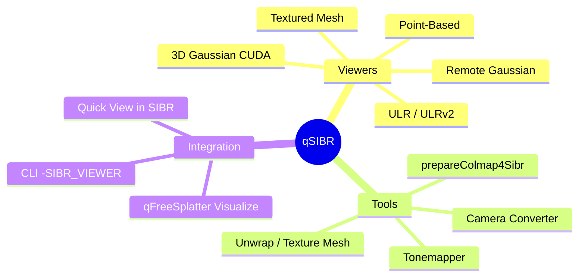
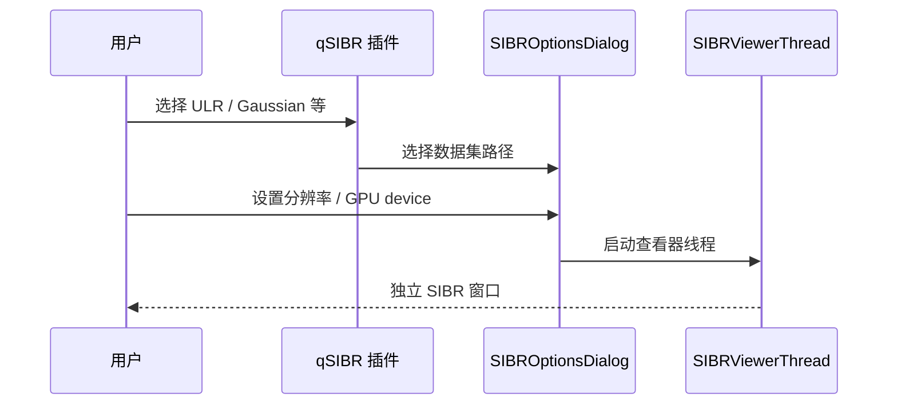

# qSIBR — SIBR Image-Based Rendering


在 ACloudViewer 内集成 **[SIBR](https://sibr.gitlabpages.inria.fr/)** 框架，提供**基于图像的渲染**与 **3D Gaussian Splatting** 实时查看，并与主程序 DB Tree 双向协作。

---

## 功能概览



| 类别 | 能力 |
|------|------|
| **交互查看器** | ULR、ULR v2/v3、纹理网格、点云渲染、3D Gaussian（CUDA）、远程训练查看 |
| **数据集工具** | COLMAP 预处理、HDR tonemap、UV 展开、网格纹理、裁剪、相机格式转换等 |
| **Quick View** | 根据 DB 选中实体自动选择最合适查看器 |
| **命令行** | `-SIBR_VIEWER` / `-SIBR_TOOL` 无 GUI 启动 |

> **平台说明：** 完整 CUDA Gaussian 功能在 **Linux / Windows** 上可用；macOS 通常受 OpenGL / CUDA 限制，功能可能不完整。

---

## GUI 使用

**菜单：** Plugins → **SIBR Viewer**（子菜单见各查看器图标）

 **ULR Viewer** — 非结构化 Lumigraph 渲染  
 **ULR v2/v3 Viewer** — 纹理数组 + mask + Poisson  
 **Textured Mesh Viewer**  
 **Point-Based Viewer**  
 **3D Gaussian Splatting Viewer**（需 CUDA，`SIBR_HAS_CUDA`）  
 **Remote Gaussian Viewer**（需 `SIBR_HAS_REMOTE`）

### 工作流 A：打开 COLMAP / SIBR 数据集



1. 点击目标查看器（如 **ULR Viewer**）。
2. 在对话框中指定 **Dataset path**（含 `cameras.json` / COLMAP 结构 / Gaussian 输出目录）。
3. 设置 `--width` / `--height`、`--device`（GPU 编号）等。
4. 确认后在新窗口中交互浏览（同时仅允许**一个** SIBR 窗口，避免 GLFW 冲突）。

### 工作流 B：Quick View（从 DB Tree）

1. 在 DB Tree 选中点云、网格或 Gaussian 相关实体。
2. 点击 **Quick View in SIBR**（选中项为空时禁用）。
3. 插件自动检测类型并启动匹配的查看器。

### 工作流 C：Dataset Tools

**Plugins → SIBR → Dataset Tools** 子菜单：

| 工具 | 作用 |
|------|------|
| Prepare COLMAP for SIBR | 将 COLMAP 重建整理为 SIBR 数据集 |
| Tonemapper | HDR 图像 tonemap |
| Unwrap Mesh | 网格 UV 展开 |
| Texture Mesh | 网格贴图 |
| Clipping Planes | 裁剪平面 |
| Crop From Center | 从中心裁剪图像 |
| NVM to SIBR | NVM 格式转换 |
| Distortion Crop | 畸变区域裁剪 |
| Camera Converter | 相机参数格式转换 |
| Align Meshes | 网格对齐 |

每个工具会弹出路径与参数对话框，在后台线程执行 SIBR 原生工具。

### 与 qFreeSplatter 联动

1. 在 FreeSplatter 中 Run 得到 PLY / Gaussian 输出。
2. 点击 **Visualize**，或手动打开 **3D Gaussian Splatting Viewer**。
3. `--model-path` 指向 FreeSplatter 导出目录。

---

## 命令行（无 GUI）

### 查看器 `-SIBR_VIEWER`

```bash
# ULR 数据集
./ACloudViewer -SILENT -SIBR_VIEWER ulr \
  --path /data/colmap_scene --width 1280 --height 720

# 3D Gaussian Splatting（CUDA）
./ACloudViewer -SILENT -SIBR_VIEWER gaussian \
  --path /data/scene \
  --model-path /data/gaussian_out \
  --device 0
```

| Viewer 名称 | 说明 |
|-------------|------|
| `ulr` | ULR |
| `ulrv2` | ULR v2/v3 |
| `texturedmesh` | 纹理网格 |
| `pointbased` | 点云渲染 |
| `gaussian` | 3D Gaussian（**需 `--model-path`**） |
| `remoteGaussian` | 远程训练 |

常用参数：`--path`、`--model-path`、`--width`、`--height`、`--iteration`、`--device`、`--no-interop`、`--ip`、`--port`。

### 数据集工具 `-SIBR_TOOL`

```bash
./ACloudViewer -SILENT -SIBR_TOOL prepareColmap4Sibr -- /path/to/colmap
```

工具名：`prepareColmap4Sibr`、`tonemapper`、`unwrapMesh`、`textureMesh`、`clippingPlanes`、`cropFromCenter`、`nvmToSIBR`、`distordCrop`、`cameraConverter`、`alignMeshes`。

工具专用参数写在工具名之后；下一个以大写 `-` 开头的 token 会被视为新的 ACloudViewer 参数（见 `qSIBRCommands.h`）。

---

## 构建

```bash
cmake -B build_app \
  -DBUILD_GUI=ON \
  -DPLUGIN_STANDARD_QSIBR=ON \
  -DBUILD_OPENCV=ON \
  .

cmake --build build_app --target QSIBR_PLUGIN -j$(nproc)
```

| 选项 | 说明 |
|------|------|
| `PLUGIN_STANDARD_QSIBR` | 构建本插件及内嵌 SIBR 库 |
| CUDA Toolkit | Gaussian 查看器需要；CMake 检测到 CUDA 时定义 `SIBR_HAS_CUDA` |

**依赖：** Boost、OpenCV、GLEW、GLFW、Assimp；Gaussian 路径另需 CUDA。

---

## 测试

qSIBR **插件本身不提供**独立的单元测试目标。验证方式：

| 方式 | 说明 |
|------|------|
| **手动 GUI** | 打开 `examples` 或自有 COLMAP / Gaussian 数据集，逐个查看器 smoke test |
| **CLI smoke** | `-SILENT -SIBR_VIEWER ulr --path ...` 确认进程正常启动与退出 |
| **集成** | qFreeSplatter **Visualize** 按钮端到端打开 Gaussian viewer |
| **第三方** | `3rdparty/CudaRasterizer/.../glm/test/` 为 glm 库自带测试，非插件测试 |

建议最小验证清单：

```bash
# 1. 插件已加载
./ACloudViewer 2>&1 | grep -i qSIBR

# 2. ULR CLI（替换为真实数据集路径）
./ACloudViewer -SILENT -SIBR_VIEWER ulr --path /path/to/sibr/dataset --width 640 --height 480

# 3. Gaussian（需 CUDA + 模型路径）
./ACloudViewer -SILENT -SIBR_VIEWER gaussian \
  --path /path/to/scene --model-path /path/to/gaussian.ply --device 0
```

---

## 架构简图

```
plugins/core/Standard/qSIBR/
├── include/          qSIBR.h, SIBRViewerThread, SIBROptionsDialog
├── src/              插件入口、查看器启动、Dataset Tools
├── SIBR/             上游 SIBR 源码树
├── 3rdparty/         CudaRasterizer, imgui, xatlas, ...
└── images/           菜单图标 + sibr_plugin.png
```

同一进程内 **GLFW / Input 为单例**；关闭当前 SIBR 窗口后再开下一个。

---

## References

- [SIBR 官方文档](https://sibr.gitlabpages.inria.fr/)
- 插件源码：`plugins/core/Standard/qSIBR/`
- ACloudViewer 插件索引：[plugins/README.md](../../README.md)

## License

遵循 ACloudViewer 主项目及 SIBR 上游许可条款。
