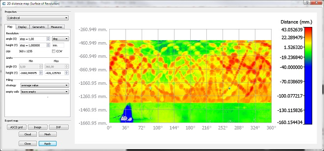
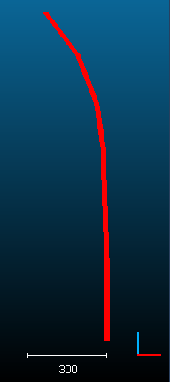
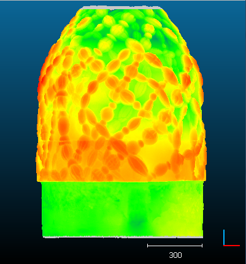
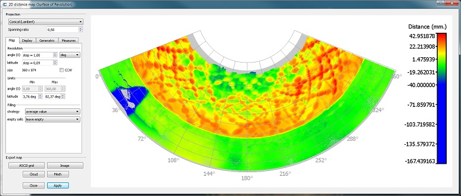

# Surface of Revolution Analysis (plugin)

## Introduction

The qSRA plugin computes distances between a cloud and a theoretical [Surface of Revolution](http://en.wikipedia.org/wiki/Surface_of_revolution). The surface of revolution is simply defined by a 2D profile.

Once the distances are computed, the plugin lets the user create a 2D map of deviations, either with a cylindrical or a conical projection.

A 'cylinder' or a 'cone' primitives can also be used in place of a 2D profile.



## Loading a 2D profile 

2D profiles can be loaded with the "Plugins > qSRA > Load profile" menu entry or the equivalent icon in the plugin's toolbar.

The corresponding dialog will mainly ask the user to specify a '2D profile' TXT file. The expected format is:

```
Xc        Yc         Zc      (profile origin)
4667.000  10057.000  171.000
R                    H       (radius and height of profile vertices)
59.3235190427553	28.685
58.8177164625621	30.142
58.32550519856	31.594
57.8404034801208	33.044
...
```

Don't change the header lines ('Xc...' and 'R...'), don't add blank lines, etc.

Notes:

- The profile origin is a point on the revolution axis corresponding to zero height (H = 0) by default (see below).
- The profile is described as a series of (radius, height) couples. The height values must be either constantly increasing or constantly decreasing.

Eventually the user can specify the revolution axis in 3D (X, Y or Z) and whether the height values are expressed relatively to the profile origin (i.e. z3D = Zc + H) or if they are absolute (i.e. z3D = H).

## Computing radial distances 

To compute the (radial) distances between a cloud and a 2D profile (i.e. the Surface of Revolution), the user must highlight both the cloud and the profile (or a cylinder/cone primitive) at the same time. Keep the **CTRL key** pressed while selecting both entities in the DB tree.

No dialog is displayed (apart from a progress bar).

On completion, the tool will automatically suggest to launch the Map Generation tool (see below).

 

## Map Generation 

To launch the map generation tool, the user must select both the cloud and the profile at the same time (keep the CTRL key pressed while selecting both entities in the DB tree). The cloud must already have a scalar field with radial distances (see above).



Most of the parameters are straightforward. You'll have to click on the **Apply** button to make the map appear (or to refresh it if you change some parameters).

You can export the map to various formats:

- CSV matrix file
- Image
- Point cloud (with the cylindrical projection only)
- Textured mesh of the Surface of Revolution (with the cylindrical projection only)

You can also generate horizontal and/or vertical profiles in Autocad DXF format.

## ACloudViewer CLI

```bash
ACloudViewer -SILENT -O cloud.las -SRA [OPTIONS] -SAVE_CLOUDS
```

| Token | Type | Description |
|-------|------|-------------|
| `-SRA` | command | Run Surface of Revolution Analysis |
| `-PROFILE` | path | Path to the 2D profile file |
| `-AXIS` | enum | Revolution axis: `X`, `Y`, or `Z` |

### Example

```bash
ACloudViewer -SILENT -O pipe_scan.las -SRA -PROFILE profile.txt -AXIS Z -SAVE_CLOUDS
```

## Build

```cmake
-DPLUGIN_STANDARD_QSRA=ON
```

## References

- CloudCompare wiki: [Surface of Revolution Analysis (plugin)](https://www.cloudcompare.org/doc/wiki/index.php/Surface_of_Revolution_Analysis_(plugin))
