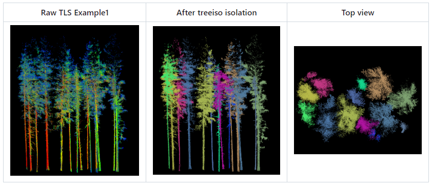

# Treeiso (plugin)

TreeIso is a plugin for CloudCompare to segment trees out of a TLS point cloud.



## Documentation

Refer to the original Matlab project on [GitHub](https://github.com/truebelief/artemis_treeiso).

## Copyright

The University of Lethbridge — Department of Geography & Environment — Artemis Lab

## ACloudViewer CLI

```bash
ACloudViewer -SILENT -O forest_scan.las -TREEISO [OPTIONS] -SAVE_CLOUDS
```

| Token | Type | Description |
|-------|------|-------------|
| `-TREEISO` | command | Run individual tree isolation |
| `-LAMBDA1` | float | Regularization weight for initial segmentation |
| `-K1` | int | Number of neighbors for initial segmentation |
| `-DECIMATE_RESOLUTION1` | float | Decimation resolution for initial step |
| `-LAMBDA2` | float | Regularization weight for refinement |
| `-K2` | int | Number of neighbors for refinement |
| `-MAX_GAP` | float | Maximum gap distance between tree segments |
| `-DECIMATE_RESOLUTION2` | float | Decimation resolution for refinement step |
| `-RHO` | float | Penalty parameter |
| `-VERTICAL_OVERLAP_WEIGHT` | float | Weight for vertical overlap criterion |

### Example

```bash
ACloudViewer -SILENT -O forest.las -TREEISO -LAMBDA1 1.0 -K1 20 -MAX_GAP 1.5 -SAVE_CLOUDS
```

## Build

```cmake
-DPLUGIN_STANDARD_QTREEISO=ON
```

## References

- Original Matlab project: [truebelief/artemis_treeiso](https://github.com/truebelief/artemis_treeiso)
- CloudCompare wiki: [Treeiso (plugin)](https://www.cloudcompare.org/doc/wiki/index.php/Treeiso_(plugin))
