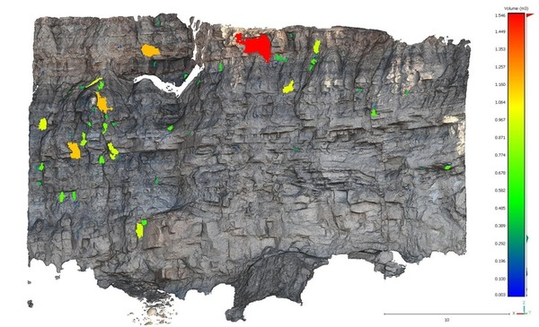
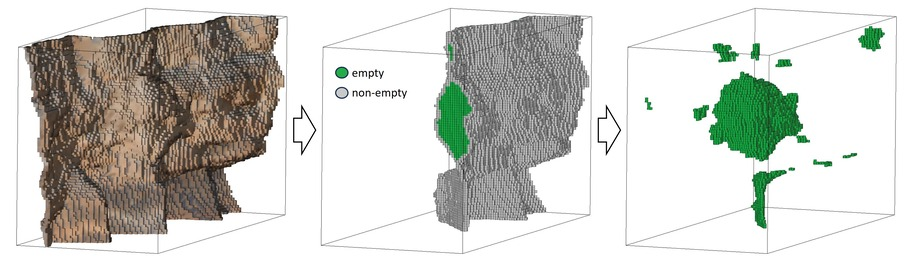
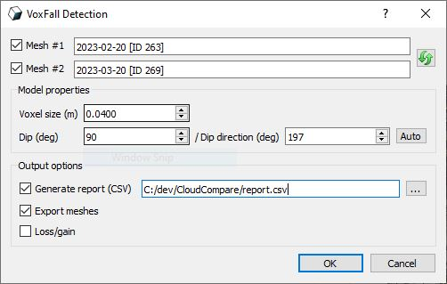

# VoxFall (plugin) — Voxel-Based Rockfall Detection

## Overview

**VoxFall** is a simple and efficient way to detect and quantify rockfall events as discrete blocks directly between two 3D models.

<p align="center">
  
</p>

VoxFall does not rely on any distance computation between two models and is free from scale parameters associated with normals, spatial clustering, and cluster shape reconstruction.

The method treats the two input models as a single scene and applies two steps:

1. **Fitting an occupancy voxel grid** of a resolution defined by the registration error.
2. **Empty space clustering** and volume computation based on voxel adjacency.

<p align="center">
  
</p>

While VoxFall is a simple unified rockfall detection framework, it is recommended to read the original article by [Farmakis et al. (2025)](https://doi.org/10.1016/j.enggeo.2025.108045).

## Using VoxFall

Select the two mesh models you want to compare and call: **Plugins > VOXFALL**

<p align="center">
  
</p>

### Model Properties

The user has to define the *voxel size* and the orientation of the occupancy grid by means of the model's *dip* and *dip direction*.

Since VoxFall is a non-parametric method and the results are only controlled by the quality of the input data, these two parameters are directly corresponding to input model properties.

- **Voxel size:** The registration error defines the *voxel size* (resolution), and each point in its distribution defines the probability of eliminating false positives (e.g., mean error = 50%, max error = 100%). A value corresponding to the LoD 95% is recommended.
- **Dip:** The slope model's dip angle in degrees [0–90].
- **Dip direction:** The slope model's dip direction (azimuth) in degrees [0–360].

The **auto** option computes the *dip* and *dip direction* parameters by fitting a plane to the input model.

### Output Options

VoxFall exports a point cloud representing the center of each voxel in the occupancy grid, with three scalar fields:

- **Cluster ID** — VoxFall clusters are assigned IDs > 0, surface model is assigned −1, and the rest of the grid is 0.
- **Volume (m³)** — estimated volume for each detected cluster.
- **Uncertainty (m³)** — volume estimation uncertainty for each cluster.

Additional output options:

- **Generate report (CSV):** Generates a CSV inventory listing all detected volumes with attribute columns.
- **Export meshes:** Exports the mesh of the voxel assembly for each cluster.
- **Loss/gain:** A scalar field defining whether a cluster represents material loss (−1) or gain (+1) from Mesh #1 to Mesh #2, to ease multiplications with the *Volume (m³)* scalar field.

## ACloudViewer CLI

Provide **at least two meshes** on the stack (`-O` each file) before `-VOXFALL`:

```bash
ACloudViewer -SILENT -O epoch1.ply -O epoch2.ply -VOXFALL -VOXEL_SIZE 0.1 -AZIMUTH 0 -EXPORT_MESHES -LOSS_GAIN -AUTO_SAVE ON -SAVE_CLOUDS
```

## Build

```bash
-DPLUGIN_STANDARD_QVOXFALL=ON
```

## Dependencies

None beyond the libraries required by the core application.

## References

- Farmakis, I., Guccione, D. E., Thoeni, K., & Giacomini, A. (2025). *VoxFall: Non-parametric volumetric change detection for rockfalls.* Engineering Geology, 352, 108045. [https://doi.org/10.1016/j.enggeo.2025.108045](https://doi.org/10.1016/j.enggeo.2025.108045)
- CloudCompare wiki: [VoxFall (plugin)](https://www.cloudcompare.org/doc/wiki/index.php/VoxFall_(plugin))
